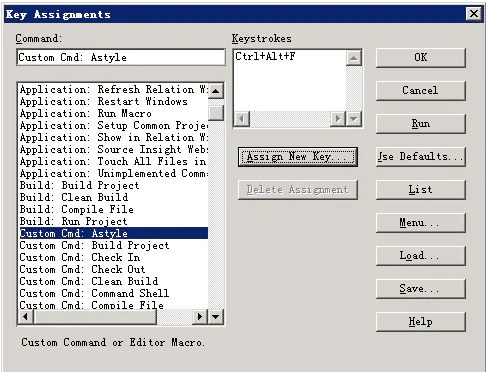

### 1.source insight常用插件

参考文档:https://www.cnblogs.com/wangqiguo/p/3713211.html

一直使用sourceinsight编辑C/C++代码，sourceinsight是一个非常好用的编辑工具可以任意定位，跳转，回退，本人一直使用该工具做C/C++开发，sourceinsight能够满足我的大部分需求，但是有些功能没有总觉得是一个缺憾。本文将补充这些非常好用的功能。

<1>.使用快捷键注释，单行注释，多行注释，#if 0注释
<2>.跳转到当前文件所在的文件夹，并高亮选择
<3>.使用quicker.em插件添加函数注释，文件头注释，标记注释等
<4>.多选项卡插件

 下面分别对如何在sourceinsight中使用上述4个功能进行说明：

**<1>.使用快捷键注释，单行注释，多行注释，#if 0注释**

 将文件 [mycomment.em点此下载 ](http://files.cnblogs.com/wangqiguo/mycomment.rar)放到sourceinsight的Base工程的路径下(一般是在C:\Documents and Settings\Administrator\My Documents\Source Insight\Projects\Base)，当然推荐存放到该目录下，一般em文件是sourceinsight的宏语言文件，宏语言是sourceinsight定义的一种语言，语法与C语言类似，sourceinsight提供了很多函数可供调用，以实现一些自定义的功能。em文件可以放到任意位置，不一定要放在souceinsight的工程目录下。在souceinsight中选择菜单 Project ->Open Project 弹出对话框如下，选择打开Base工程：

 再打开的Base工程的界面中，选择Project Window窗口下面的添加工程文件按钮，将mycomment.em文件添加到该Base工程中：

 选择菜单Options-> Key Assignments... 为宏添加一个快捷键：

mycomment.em文件中定义了3个宏，首先找到宏 Macro: WangQiGuo_MultiLineComment 该宏的功能是当执行之后会将所选择的代码块的每一行前面添加//双斜杠注释，选择这个宏之后，点击按钮Assign New Key ... 为该宏分配一个快捷键，此时会弹出一个对话框，这个时候只需要按键盘上面想要的快捷键就行了，例如我这里使用的是ctrl + / 这个快捷键，该快捷键会被检测到并自动添加到Keystroks窗口中，表示添加成功了，此时点击OK就设置完成了。此时随便找一个简单的文件拖到souceinsight窗口中就可以测试了：

选中某一行，直接按ctrl + / 就会自动注释，当然多行也是可以的。

用同样的方法为mycomment.em文件中的另外两个宏 Macro: WangQiGuo_AddMacroComment 与 Macro: WangQiGuo_CommentSelStr 定义快捷键，其中宏Macro: WangQiGuo_AddMacroComment 是将选中的代码前后添加#if 0 与 #endif 注释的。而宏Macro: WangQiGuo_CommentSelStr 是在选中的代码前后添加 /* 和 */ 注释的为了便于记忆，我为Macro: WangQiGuo_AddMacroComment设置的快捷键是 ctrl + 3 原因是在大键盘上数字键3上有一个#号，而我们的注释块#if 0 ,#endif中有#号，而Macro: WangQiGuo_CommentSelStr的快捷键我设置的是 ctrl + 8 原因是大键盘上的数字键8上有一个*号。

 宏块注释的效果如下图：

多行注释的效果如下图：

**<2>.跳转到当前文件所在的文件夹，并高亮选择**

我们使用sourceinsight的时候是否会有这样的需求：有时候代码很多，我需要找到sourceinsight中的某个源文件在资源管理器中的位置，但是可惜的是sourceinsight没有这样的功能，为此我google，百度了很久都没有一个好的解决方法，而实际上该功能的实现是非常简单的：

将文件 [openfolder.em点此下载](http://files.cnblogs.com/wangqiguo/openfolder.rar) 添加到sourceinsight的Base工程目录，按照上面的方法，将openfolder.em添加到Base工程中，该文件中有一个宏Macro: ToExplorerFolder 其功能就是当宏执行的时候在资源管理器中打开sourceinsight中的当前文件所在的文件夹，并高亮选择该源文件，添加快捷键的图如下：

我选择的快捷键是ctrl + t，按ctrl + t之后，其执行的效果如下图：

自动打开一个资源管理器窗口，并定位到我的文件test.cpp，实际上打开openfolder.em可以看到其实现是很简单的，就是利用sourceinsight提供的相关函数获得当前文件的绝对路径，然后将该路径传递给命令行的explorer命令，执行该命令就可以了，explorer的命令可以自行到cmd中试一下，openfolder.em中有注释说明。

 **<3>.使用quicker.em插件添加函数注释，文件头注释，标记注释等**

[quicker.em点此下载](http://files.cnblogs.com/wangqiguo/quicker.rar) 该文件据说是华为的一个员工写的，主要功能是为函数接口添加注释，为文件添加注释，生成头文件，生成标记注释(添加类似这样的注释：/*added by xxx 2014-05-07*/) ， 按照同样的方法将该文件添加到Base工程中，该文件中定义了一个主要的宏Macro: AutoExpand 该宏支持很多扩展命令，下面是我为该宏配置的快捷键 ctrl + enter (推荐使用ctrl + enter)：

该宏下面包含许多子命令，下面介绍常用的命令：

1.添加文件头注释：
命令：fi 解释：file

2.添加函数说明注释：
命令：fu 解释： function

3.添加单行注释：
命令：as 解释： add start    (添加之后：/* add by zhangsan, 20140504, Mantis号:d, 原因: */ )
命令：ms 解释： modify start  (添加之后：/* modify by zhangsan, 20140504, Mantis号:d, 原因: */ )
命令：ds 解释： delete start  (添加之后：/* delete by zhangsan, 20140504, Mantis号:d, 原因: */ )

4.添加标记注释：
命令：ab 解释： add begin    (添加之后：/* add begin by zhangsan, 20140504, Mantis号:d 原因: */)
命令：ae 解释： add end     (添加之后：/* add end by zhangsan, 20140504 */)

命令：mb 解释： modify begin  (添加之后：/* modify begin by zhangsan, 20140504, Mantis号:d 原因: */)
命令：me 解释： modify end   (添加之后：/* modify end by zhangsan, 20140504 */)

命令：db 解释： delete begin  (添加之后：/* delete begin by zhangsan, 20140504, Mantis号:d 原因: */)
命令：de 解释： delete end   (添加之后：/* delete end by zhangsan, 20140504 */)

5.配置命令：

命令：co 解释：config （修改相关配置信息）

如何使用呢，以为整个文件添加注释为例，在源文件的任何地方输入命令 fi 之后直接按ctrl + enter 如下图所示:

在弹出的对话框中输入对该文件的描述信息，例如我输入的是“测试文件” ， 直接点击OK之后文件变成这样：

可以看到在该文件的头部自动生成了一块注释代码其中包含了 文件名，负责人，文件说明，版权说明，生成时间，修改日志等，我们可以使用co命令修改这里的负责人，并且可以指定生成的语言是中文还是英文，同样在源文件的任何地方输入co之后直接按ctrl + enter 会弹出输入框让我们修改作者，选择语言，该配置只需要设置一次，之后再使用其他命令只要生成的注释里面包含作者信息的都会使用我们配置的这个作者名。

这里的版权说明只能自己手工修改代码，打开quicker.em文件，找到macro InsertFileHeaderCN定义就会看到相关版权信息的说明，自己改一下就可以了：

同样如果生成的是英文信息，请修改InsertFileHeaderEN 这个宏里面的相关代码。

 本段只演示了fi命令如何添加文件头的注释信息，其他的命令，例如fu命令添加函数头的注释信息，还有其他的命令添加相关形式的注释信息，请自行测试，要说明的是quicker.em中的这些命令都是扩展命令，其使用方法都是一样的，在文件的任何地方输入命令之后直接按ctrl + enter 就会出效果。例如添加函数注释的效果如下：

直接在函数max前面输入fu命令之后 按ctrl + enter 会提示输入相关的注释信息，下面的3个注释是分别输入as 之后按ctrl +enter , 输入ms 之后按ctrl + enter , 输入ds之后按ctrl + enter 之后生成的注释效果：

有关quicker.em的其他命令请自行测试，另外还有一些没有提到的命令，例如自动生成if块，for语句块，switch块等，请百度搜索相关资料

**<4>.多选项卡插件**

如果你希望在sourceinsight中像别的编辑器一样为每个文件生成一个选项卡页面，你可以试试[这个插件TabSiPlus](http://files.cnblogs.com/wangqiguo/TabSiPlus_0_99b2_1510.rar)，该插件需要安装。解压之后先运行VC_x86Runtime.exe ，之后直接运行TabSiHost.exe ，此时你的sourceinsight窗口自动出现下面的选项卡图：

双击选项卡可以关闭某一个文件，在选项卡的左边点击下拉箭头，可以对该插件设置，或者关闭该插件：

### 2.source insight4中quicker.em使用识别又问的解决方案

参考文档:https://blog.csdn.net/l645317186/article/details/82460253

quicker.em中，编写不符合sourceinsight 4的宏解析规范

将，//如果是{表示函数参数头结束了
改成：    //如果是'{'表示函数参数头结束了

将，//只提取字符和# { / *作为命令
改成：    // 只提取字符和'#','{','/','*'作为命令

### 3.Source Insight4.0 中文注释乱码的解决办法

​	参考文档:https://blog.csdn.net/gsh_hello_world/article/details/77881933

1. 单个文件乱码解决办法：

   菜单栏中【File】 > 【Reload As Encoding...】 > 【Chinese Simplified (GB18030)】 > 选择后，点击load，问题解决！！！

   

2. 所有文件乱码解决办法：

   在做下面操作的时候，先设置，然后关闭所有打开的文件，然后再打开文件即可。

   菜单栏中 【Options】 > 【Preferences】 >File标签中，最下面的“Default encod­ing” ：改成System Default(Windows ANSI)
   或者Chinese Simplified(GB2312) CP:936，点击确定，问题解决！！！

### 4.Source insight4.0上配置Astyle（格式化代码）

参考文档:https://www.jianshu.com/p/29846acb91e2

在Souce insight上选择Tools->Custom Commands，点击Add，输入Astyle,点击OK。

在Run中输入C:\AStyle\bin\AStyle.exe --style=ansi -S -N -L -xC80 -z2 --convert-tabs -H -p -U --align-pointer=name  --quiet --suffix=none %f

如下图所示：

完成后点击Close。

在Source insight选择Options->Menu Assignments，在Command中选择Astyle，在Menu中选择View，在Menu  Contents中选择Toolbars，然后点击Insert，如下图所示。

点击Insert，点击OK，完成。

在Source insight中选择Options->Key Assignments，在Command中选择Astyle，点击Assign New Key，然后输入一个快捷键（我使用的是Ctrl+Alt+F），如下图所示。

点击OK后完成快捷键的配置。

Asytle是完全可以脱离Source insight来单独使用的，这里仅说明如何在Source insight中使用Asytle。
 在上面的步骤中，我们配置了快捷键，只要打开想格式化的.c或者.h文件，按下快捷键，如果配置无误，文件就会被格式化，然后Source insight会提示重新载入这个文件，动手试一下吧。

##### Astyle参数

Astyle提供了很多参数供大家使用，通过配置这些参数，我们可以将文件格式化成我们想要的形式。
 我使用的是

> --style=ansi -S -N -L -xC80 -z2 -H -p -U --align-pointer=name  --suffix=none --quiet

| 配置                  | 含义                                                         |
| --------------------- | ------------------------------------------------------------ |
| -S                    | ”case XXX”需要缩进                                           |
| -N                    | namespace中的内容缩进                                        |
| -L                    | 缩进label，让label比当前的内容先前一个缩进距离，而不是通通靠左 |
| -xC80                 | 最长80个字符                                                 |
| -convert-tabs         | 将tab转换为合适长度的空格                                    |
| -H                    | 在if for等关键字后面，加一个空格                             |
| -p                    | 在操作符两边加空格                                           |
| -U                    | 去掉()内部不必要的空格                                       |
| ---align-pointer=name | 让*更靠近变量名                                              |
| --suffix=none         | 不备份原始文件                                               |

更多的参数，可以直接在命令行中输入

> astyle --help

就可以看到了。

Astyle并不是万能的格式化工具，只能支持一些典型的格式化，例如：

- 函数多参数对齐
- 使代码不超过80字符
- Tab全部转化成空格
- 细化一些空格、*的放置方式。
- 代码缩进
- 去掉每行末尾无用的空格
- 花括号的放置

### 5.source insight 删除工程后，旧工程信息还是保留在工程打开选项的解决办法

参考文档:https://blog.csdn.net/a3121772305/article/details/96592097

使用ultraedit32这个工具，打开你的\Source Insight\Projects\PROJECTS.DB3文件

这个时候你可以看见左边部分显示的是十六进制的数据，右边部分显示的是你工程的信息。(需要你下拉查看，工程和工程之间有很多的0)

找到你删除掉的对应的工程。然后将左边的十六进制数据全部替换为0，然后你再打开你的source insight，就看不到对应的信息了。

### 6.source insight死活打不开解决方法

参考文档:https://blog.csdn.net/zxy131072/article/details/83785256?depth_1-utm_source=distribute.pc_relevant.none-task&utm_source=distribute.pc_relevant.none-task

恢复默认设置(重新安装没用，必须手动)，步骤如下：

1、关闭Source Insight软件。

2、打开"C:\Users\Administrator\Documents\Source Insight x.x"下的目录，找到"Source Insight x.x"文件夹。

3、将"Source Insight x.x"文件夹中所有文件和文件夹都删除。

4、再次打开Source Insight软件，发现完美解决。

### 7.ubuntu下安装SourceInsight

1.安装wine
sudo apt-get install wine

注1：安装wine时停止在"正在设定ttf-mscorefonts-installer"
解决：将页面一直拉倒底，而后使用TAB键将光标Focus到<确定>，再点击Enter键。

2.查看wine安装结果
wine目录中会有drive_c目录，drive_c中目录与windows c盘结构相似。
所以才能在linux中安装windows .exe

3.安装Source Insight
将Source Insight的安装文件copy到ubuntu中。我复制到了用户目录/soft/中。
cp Si35Setup.exe ~/ys/soft/

使用wine安装source insight，安装后我的si路径是~/.wine/drive_c/Program Files (x86)/
wine ~/ys/soft/Si35Setup.exe

4.启动Source Insight并建立工程
使用wine命令启动si，建立工程方法与windows下的方法相同。

wine "c:\Program Files (x86)\Source Insight 3\Insight3.Exe"

5.编写启动脚本
#!/bin/bash
wine "c:\Program Files (x86)\Source Insight 3\Insight3.Exe" &