持续集成(continuous integration)，简称CI,是指开发者在代码的开发过程中，可以频繁的将代码部署集成到主干，并进行自动化测试

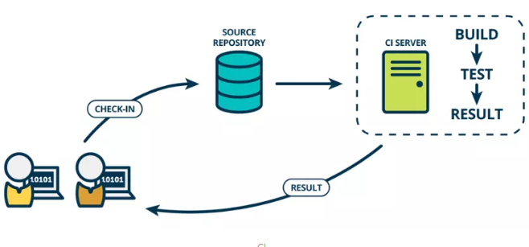

### 持续交付

持续交付(continuous Delivery)指在持续集成的环境基础上将代码部署到预生成环境

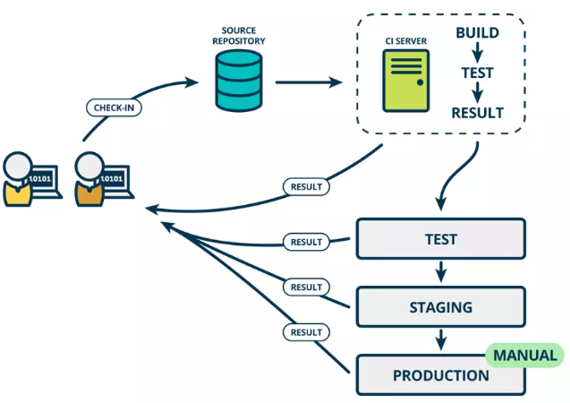

### 持续部署

持续部署(continuous deployment)是指在持续交付的基础上，把部署到生产环境的过程自动化，持续部署和持续交付的区别就是最终部署到生产环境是自动化的

目前大部分公司是做到持续交付，做到持续部署还很少，因为上生产环境，还要有很多步骤需要做

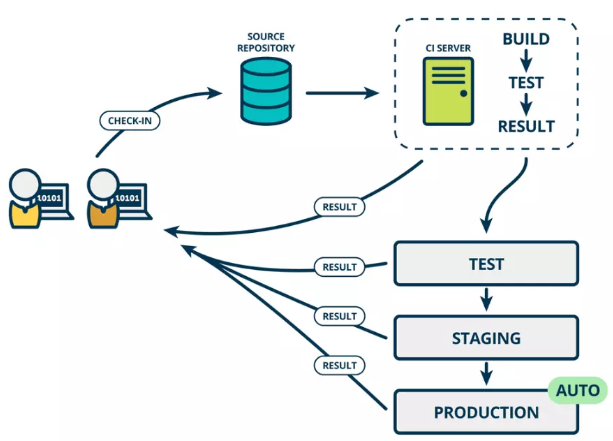

```java
软件开发过程中几个经典的环境:
开发环境-development,集成环境-integration,测试环境-testing,QA验证,模拟环境-staging,生产环境-production
```

### git-版本控制系统

版本控制是一种用于记录一个或多个文件内容变化，方便查询特定版本修订情况的系统

以前在没有使用版本控制的时候，通常会在项目的根目录下这样命名项目:project_v1、project_v1.1、project_v2等等，通过这种方式记录我们的项目的不同版本的修改。但这种的操作很是繁琐，有时候还可能因为一些非人因素导致丢失这样的事故

- 集中式版本控制系统-svn

  版本库集中存放在中央服务,工作的时候,用的是自己电脑，所以我们首先需要从中央服务器上拉取最新的版本,然后开始工作，等工作完了，再把自己的工作提交到中央服务器。最大的缺点就是必须联网才行。

  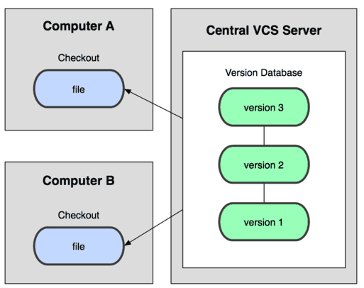

- 分布式版本控制系统-git

  分布式版本控制系统没有中央服务的概念，我们使用相关的客户端提取的不只是最新的文件，而是把代码仓库完整的镜像下来，相当于每个人的电脑都是一个完整的版本库，这样的话，任何一处协同工作的服务器出现故障，都可以用任何一个镜像出来的本地仓库恢复，并且，即便在网络环境比较差的情况下也不用担心，因为版本库就在本地电脑上

  

- 总结:

  - 分布式版本控制系统下的本地仓库包含代码库还有历史库，在本地就可以查看版本历史
  - 集中式版本控制系统下的历史仓库是存储在中央仓库，每次对比与提交都必须连接到中央仓库
  - 多人开发时，如果充当中央仓库的git仓库挂掉了，任何一个开发者都可以随时创建一个新的中央仓库然后同步就可以恢复中央仓库

### gitlab安装与使用

- gitlab与github关系
  - github和gitlab都是基于web的git仓库，使用起来二者差不多，他们都提供了分享开源项目的平台，为了开发团队提供了存储、分享、发布和合作开发项目的中心化云存储的场所
  - github作为开源代码库，拥有超所900万的开发者用户，目前仍然是最火的开源项目托管平台，github同事停工公共仓库和私有仓库，如果使用私有仓库，是需要付费的。gitlab解决了付费问题，可以在上面创建私人的免费仓库
  - 从代码的私有性来说gitlab是更好地选择，但是对于开源项目而言，github依然是代码托管的首选

- gitlab环境搭建

  - gitlab安装

    ```shell
    //离线安装
    用浏览器进入该网址:https://mirrors.tuna.tsinghua.edu.cn/gitlab-ce/ubuntu/pool/trusty/main/g/gitlab-ce/
    //下载离线安装包
    wget https://mirrors.tuna.tsinghua.edu.cn/gitlab-ce/ubuntu/pool/trusty/main/g/gitlab-ce/gitlab-ce_10.0.0-ce.0_amd64.deb
    //安装gitlab
    sudo dpkg -i gitlab-ce_10.0.0-ce.0_amd64.deb
    ```

    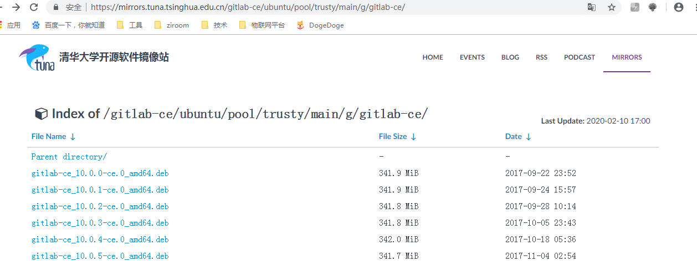

  - gitlab配置（主要是用于配置邮箱,当添加新的用户时,通过给配置的邮箱发送邮件,进行修改登录密码）

    当gitlab安装完后后,配置文件在在/etc/gitlab/gitlab.rb目录,修改的文件内容如下:

    ```shell
    external_url 'http://192.168.110.129:8888' //配置ip或域名及端口号
    
    gitlab_rails['smtp_enable'] = true
    gitlab_rails['smtp_address'] = "smtp.126.com"                                                                                            
    gitlab_rails['smtp_port'] = 465
    gitlab_rails['smtp_user_name'] = "zhao_kun00@126.com" //发送邮箱
    gitlab_rails['smtp_password'] = "abc15301070551" //校验码,该校验码是126邮箱中获取到的
    gitlab_rails['smtp_domain'] = "smtp.126.com"
    gitlab_rails['smtp_authentication'] = "login"
    gitlab_rails['smtp_enable_starttls_auto'] = true
    gitlab_rails['smtp_tls'] = true
    gitlab_rails['gitlab_email_from'] = 'zhao_kun00@126.com'
    
    ```

    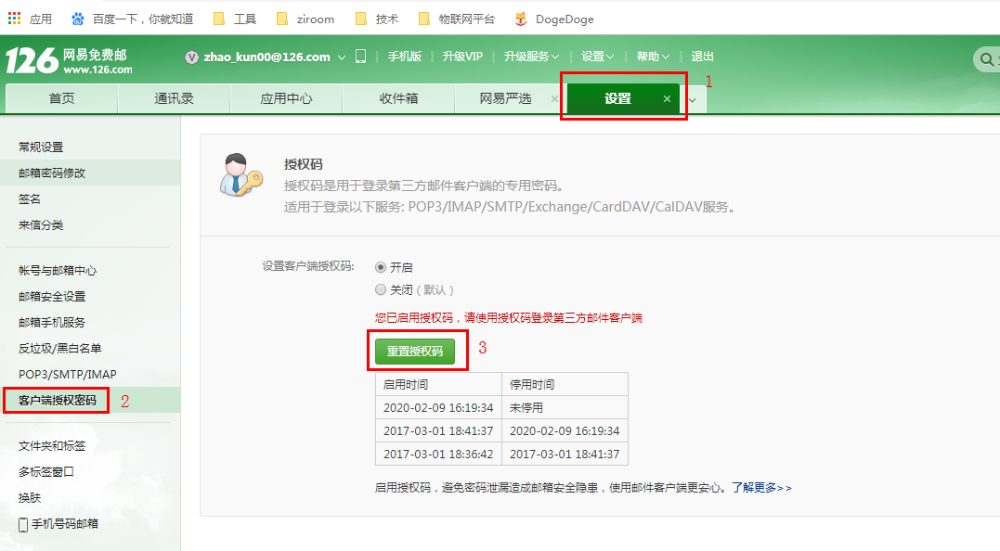

  - gitlab重启

    ```shell
    //重新配置
    sudo gitlab-ctl reconfigure
    //重启服务
    sudo gitlab-ctl start
    //在浏览器中访问服务,出现以下界面表示gitlab安装成功
    http://192.168.110.129:8888
    //自己搭建的gitlab账号
    用户名:root
    密码:abc15301070551
    ```

    

- gitlab的基本使用

  - 添加用户(只有root用户才能添加)

    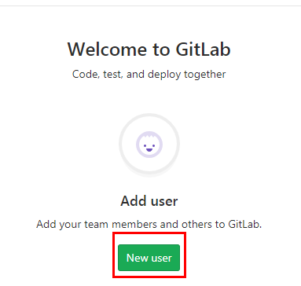

    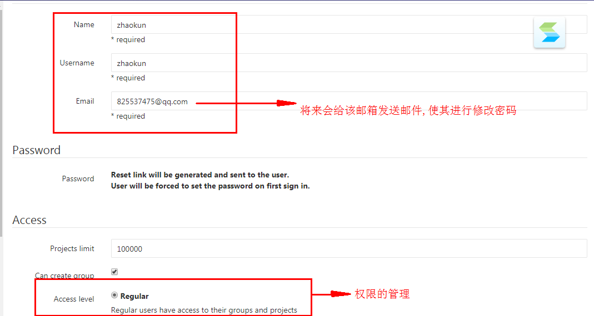

  - 添加组

    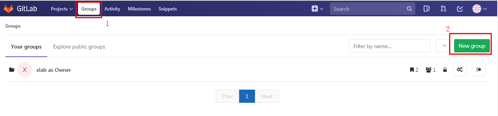

    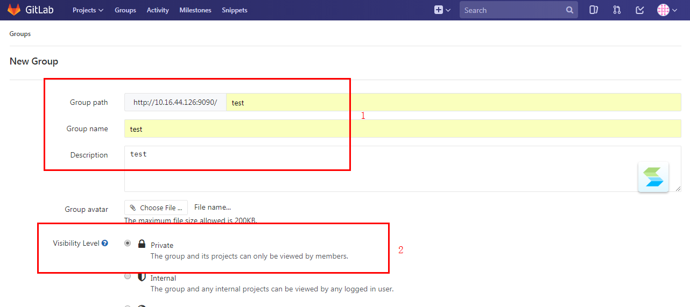

  - 添加项目

    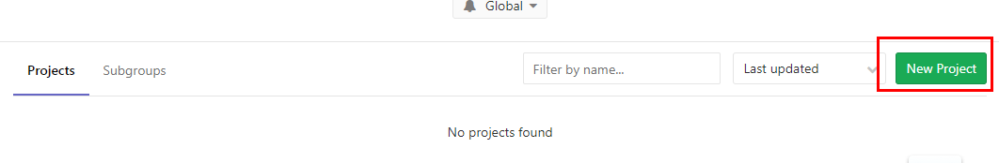

    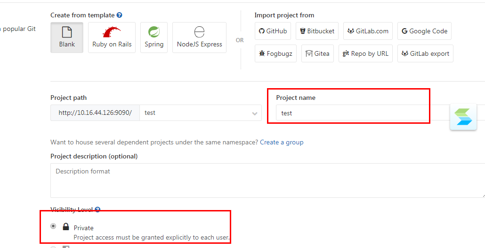

  - 在组成添加用户,并赋予权限

    

    ```reStructuredText
    Gitlab权限管理
    Gitlab用户在组中有五种权限：Guest、Reporter、Developer、Master、Owner
    
    Guest：可以创建issue、发表评论，不能读写版本库
    Reporter：可以克隆代码，不能提交，QA、PM可以赋予这个权限
    Developer：可以克隆代码、开发、提交、push，RD可以赋予这个权限
    Master：可以创建项目、添加tag、保护分支、添加项目成员、编辑项目，核心RD负责人可以赋予这个权限
    Owner：可以设置项目访问权限 - Visibility Level、删除项目、迁移项目、管理组成员，开发组leader可以赋予这个权限
    Gitlab中的组和项目有三种访问权限：Private、Internal、Public
    ```

  - 组、用户、项目之间的关系

    用户属于组，在组中创建项目，组赋予用户权限

    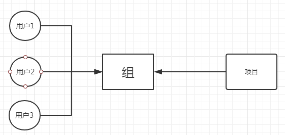

- ### git merge request 步骤

  如今很多项目都采取merge request方式来进行codereview，所有掌握merge request很有必要，步骤如下：

  ```
  现在本地用创建一个本地分支，比如叫xx_branch。
  2、改动xx_branch你需要改动的代码。
  3、进入你的项目根目录下，运行如下命令，将xx_branch推到远程分支。
  git add .
  git commit -a -m 'xxxxx'
  git push origin xx_branch
  4、在gitlab上面操作，进入xx项目下，点击merge request选项，然后选择你之前推到远端的xx_branch和你要合并到哪个分支，比如你要合并到master上。
  5、点击merge request。
  
  参考文档:https://blog.csdn.net/qq_33829154/article/details/81364047
  ```

  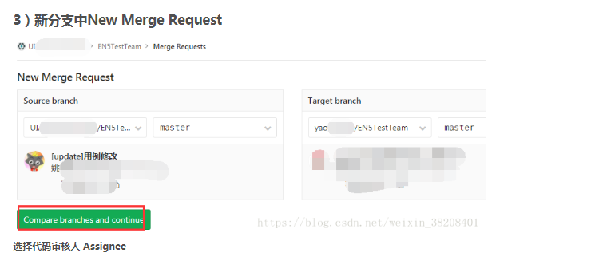

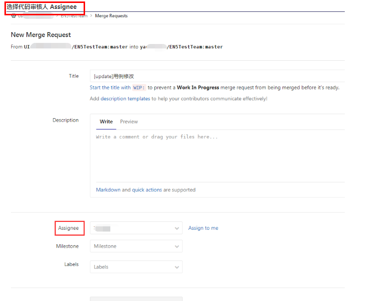

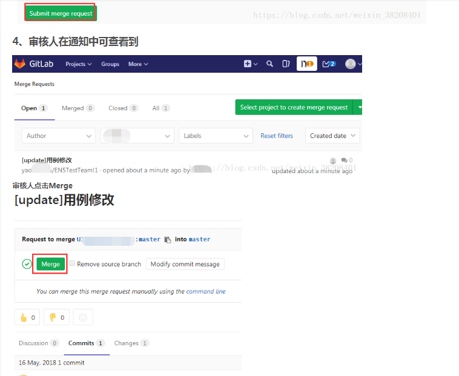

### Jenkins安装与使用

- #### Jenkins

  jenkins是一个开源的、提供友好操作界面的持续集成(CI)工具，主要用于持续、自动的构建/测试软件项目、监控外部任务的运行

- #### Ubuntu14.04安装Jenkins


```shell
#参考官网 https://pkg.jenkins.io/debian-stable/
#这里我们使用Jenkins的官方提供的软件仓库，要使用官方的软件仓库之前必须将软件仓库的秘钥添加到本地
#添加官方软件仓库的秘钥到本地的apt秘钥中
wget -q -O - http://pkg.jenkins-ci.org/debian/jenkins-ci.org.key | sudo apt-key add - 
```

```shell
#将官方提供的软件仓库地址加入到本地的apt软件源中，本地用于存放软件源的文件在/etc/apt/sources.list
#将地址添加进本地的软件源列表
sudo sh -c 'echo deb http://pkg.jenkins-ci.org/debian binary/ > /etc/apt/sources.list.d/jenkins.list' 
```

```shell
#更新我们本地的软件源缓存，然后直接安装jenkins
#更新软件包
sudo apt-get update
#安装jenkins
sudo apt-get install jenkins
#jenkins命令
sudo /etc/init.d/jenkins [start|restart|stop|status]
#在浏览器中访问,在/etc/default/jenkins中可以修改默认的端口号
http://192.168.1.100:8080/
```

​		备注:在安装jenkins时，所遇到的jdk问题,会报以下错误,找不到jdk路径

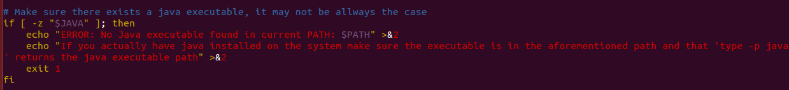

​		解决办法:在/etc/init.d/jenkins修改jdk的路径

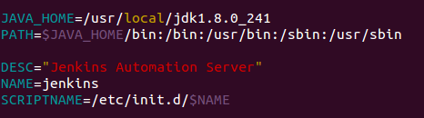

​		参考文档:https://www.deathearth.com/256.html 

```shell
#安装jdk
#解压压缩包
tar -zxvf jdk-8u191-linux-x64.tar.gz -C /usr/local
#更新配置
vim /etc/profile
export JAVA_HOME=/usr/local/jdk1.8.0_241
export PATH=$JAVA_HOME/bin:$PATH
source /etc/profile
#查看java版本
java -version
```

​		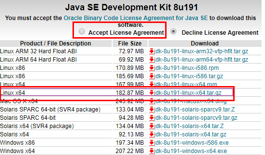

​		安装目录：/var/lib/jenkins 日志目录：/var/log/jenkins/jenkins.log

​		

​		jenkins工作目录:

​		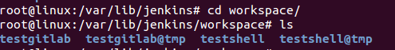


- ### Jenkins简单使用

  - 在jenkins安装启动完后，出现以下界面，按照提示输入密码(获取下面路径中的密码)

    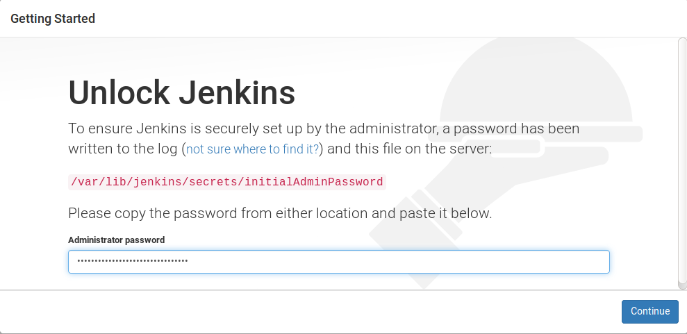

  - 安装插件,使用推荐安装即可

    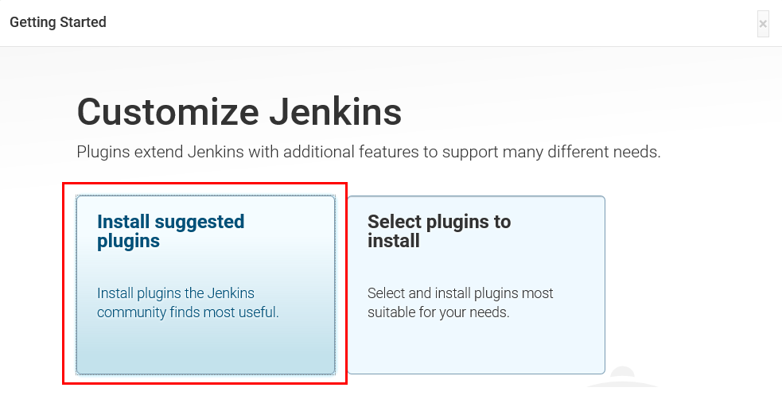

  - 安装插件的进度,如果能够连接外网很快

    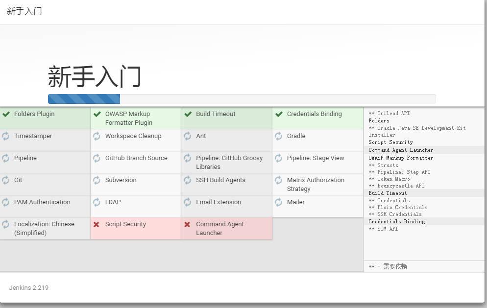

  - 创建用户,自己创建的是用户名和密码是:zhaokun,admin

    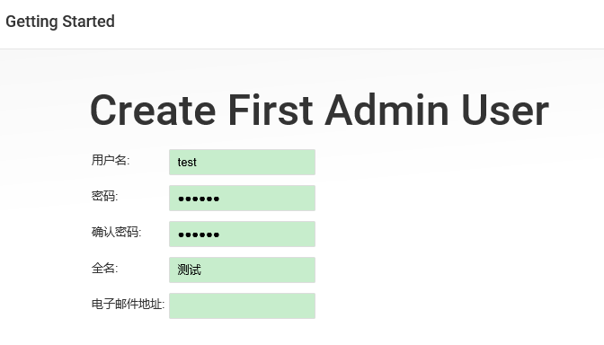

  - jenkins登录界面

    

  - 第一步,创建一个项目,对于我们选择创建一个自由风格的软件项目即可

    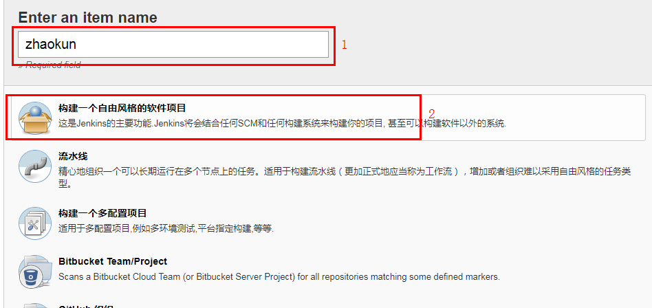

  - General:

    - 是构建任务的一些基本配置，例如名称、描述之类的，其中重要一项内容是可以构建化参数,往shell脚本中传入参数
    - 丢弃旧的构建:服务器资源是有限的，有时候保存了太多的历史构建，呼导致jenkins速度变慢，并且服务器硬盘资源也会被占满。当然下方的保存构建天数和保存构建的最大格式是可以自定义的，需要根据实际情况确定一个合理的值。构建天使-10天，构建最大个数-20
    - 

    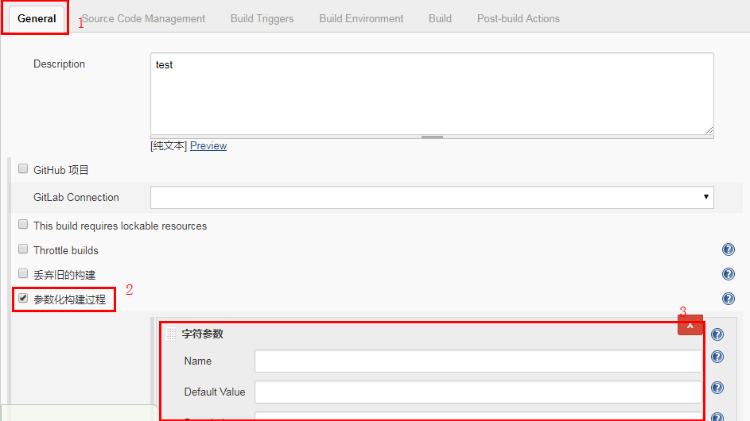

  - 源代码管理

    - 源代码管理就是配置你代码的存放位置

    -  **Git:** 支持主流的github 和gitlab代码仓库。因我们的研发团队使用的是gitlab，所以下面我只会对该项进行介绍。

      **Repository URL**：仓库地址

      **Credentials**：凭证。可以使用HTTP方式的用户名密码，也可以是RSA文件。 但要通过后面的"ADD"按钮添加凭证。

      **Branches to build**：构建的分支。*/master表示master分支，也可以设置为其他分支。也可以使用第一步参数化构建过程中的变量,使用方式${branch},和在shell中使用变量相同

      **源码浏览器**：你所使用的代码仓库管理工具，如github, gitlab. 

      **URL**：填入上方的仓库地址即可。

      **Version: 8.7**  这个是我们gitlab服务器的版本。

      **Subversion：**就是SVN，这里不作介绍。

    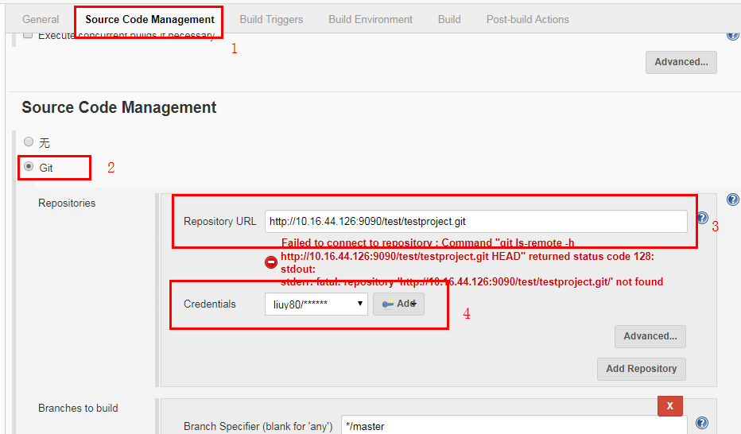

    - 使用http方式,需要填入用户名和密码

    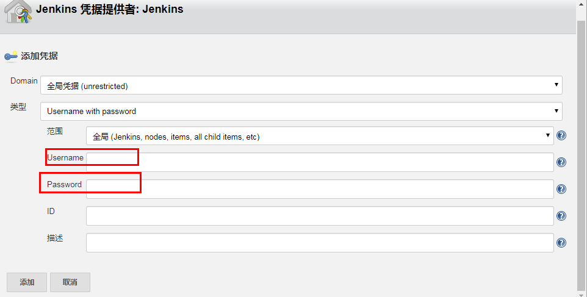

  - 构建触发器

    - 构建触发器，就是构建任务的触发器

    - **触发远程构建(例如，使用脚本):** 该选项会提供一个接口，可以用来在代码层面触发构建。这里不做介绍，后期可能会用到。

      **Build after other projects are built：** 该选项意思是"在其他projects构建后构建"。这里不作介绍，后期可能会用到该选项。

      **Build periodically：** 周期性的构建。很好理解，就是每隔一段时间进行构建。日程表类似    linux crontab书写格式。如下图的设置，表示每隔30分钟进行一次构建。

      **Build when a change is pushed to GitLab：**当有更改push到gitlab代码仓库，即触发构建。后面会有一个触发构建的地址，一般被称为webhooks。需要将这个地址配置到gitlab中，webhooks如何配置后面介绍。这个是常用的构建触发器。

      **Poll SCM：**该选项是配合上面这个选项使用的。当代码仓库发生改动，jenkins并不知道。需要配置这个选项，周期性的去检查代码仓库是否发生改动。

    - 下图的触发器只有安装了gitlab插件后才能显示,该触发器的作用是当gitlab中有代码提交时,可以进行触发构建,url参数用于填入gitlab中的选项中

    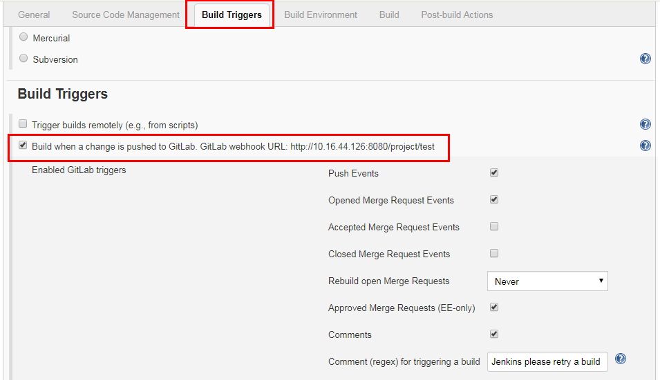

    第一个选项是输入分支的名字，第二个选项是生成secret token的值，将来用于填入gitlab中

    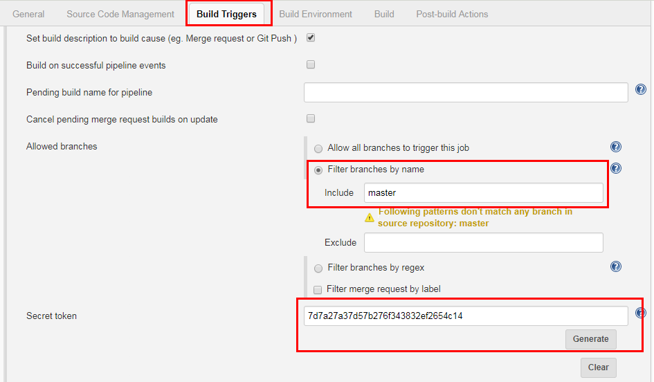

  - 构建

    下面画图有误,在这里可以执行一些脚本的执行

    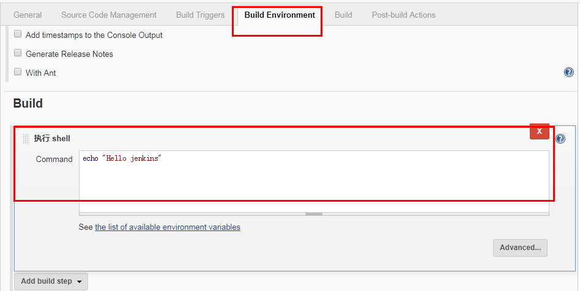

  - gitlab中配置webhook,填入jenkins中的url和secret token

    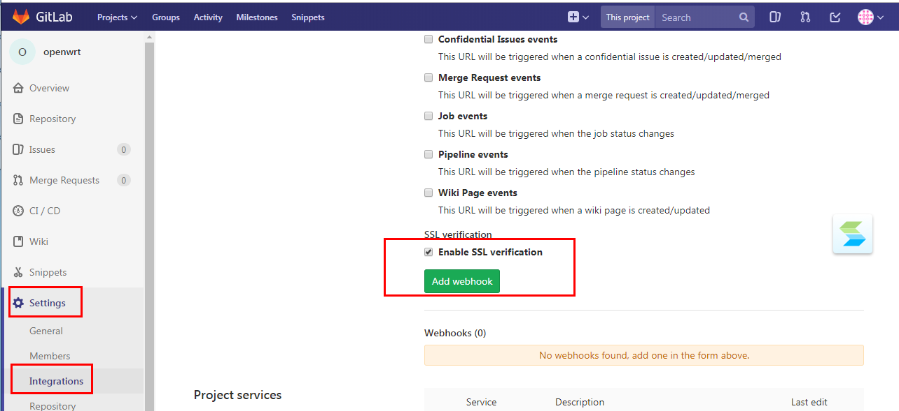

    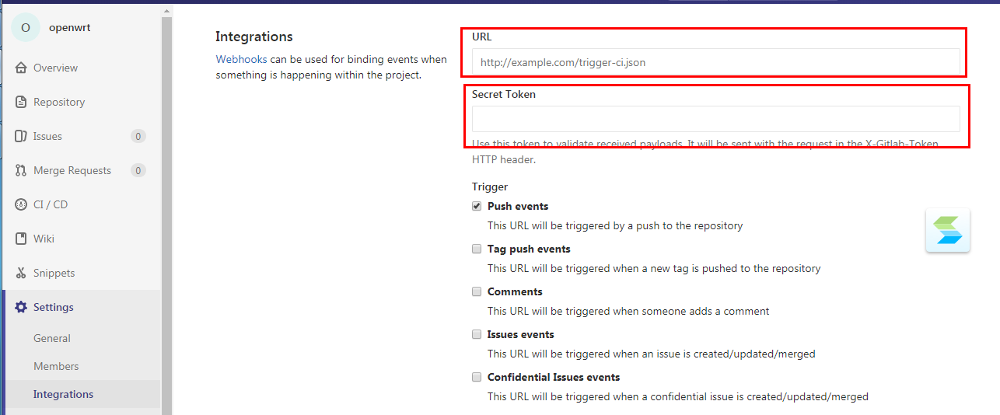

  - 构建结构说明

    - 构建状态

      **Successful蓝色**：构建完成，并且被认为是稳定的。

      **Unstable黄色**：构建完成，但被认为是不稳定的。

      **Failed红色**：构建失败。

      **Disable灰色**：构建已禁用

    - 构建稳定性

      **晴、晴转多云、多云、小雨、雷阵雨**。天气越好表示构建越稳定，反之亦然

    - 构建历史说明

      **console output：** 输出构建的日志信息

    - 参考文档:
      - https://www.jianshu.com/p/5f671aca2b5a
      - https://www.cnblogs.com/cnjavahome/p/8975726.html

- ### 参考文档

  ```shell
  #在jenkins中执行脚本
  https://www.cnblogs.com/yitianyouyitian/p/9255098.html
  
  #在jenkins中传入参数构建参数
  https://blog.csdn.net/qq_21047625/article/details/99643894
  
  #gitlab与jenkins实现webhook
  https://www.cnblogs.com/blog-ws/p/9306375.html
  https://www.jianshu.com/p/9db976b675b2
  
  #jenkins与gitlab
  https://www.jianshu.com/p/63b012ee52ea
  https://www.jianshu.com/p/eeb15a408d88
  https://www.cnblogs.com/zblade/p/9480366.html
  https://baijiahao.baidu.com/s?id=1630678692475452408&wfr=spider&for=pc
  ```

  - 用sh -x命令查看shell脚本内容与输出结果，一般用于调试过程当中

    - 执行步骤:sh -x testsh.sh

  - 在虚拟机中可以ping同ip但是不可以ping通域名

    ```shell
    #编辑resolv.conf文件，该文件是DNS客户机配置文件，用于设置DNS服务器的IP地址及DNS域名，还包含了主机的域名搜索顺序。执行命令：sudo vim /etc/resolv.conf，将下面内容加入：
    
    nameserver 8.8.8.8      //google的域名解析服务器
    nameserver 114.114.114.114   //联通的域名解析服务器
    ```

  - Ubuntu设置开机启动

    ```shell
    #方式1:
    #步骤1:新建脚本test.sh,内容如下
    
    #！/bin/bash
    # command content
    echo "hello start up script!" > /home/sc/Desktop/mystart.txt
    exit 0
    
    #步骤2:
    sudo mv test.sh  /etc/init.d/
    cd /etc/init.d/
    sudo chmod 755 test.sh
    #设置启动顺序,其中数字90是脚本启动的顺序号，数字越大表示执行的越晚，按照自己的需要相应修改即可
    sudo update-rc.d  test.sh  defaults  90
    
    #移除开机自启动
    sudo update-rc.d -f test.sh remove
    
    #方式2:
    #Ubuntu开机之后会执行/etc/rc.local文件中的脚本，所以我们可以直接在/etc/rc.local中添加启动脚本。在 exit 0 前面添加好脚本代码
    
    #！ /bin/sh -e
    echo "hello start up script!" > /home/sc/Desktop/mystart.txt
    
    exit 0
    ```

    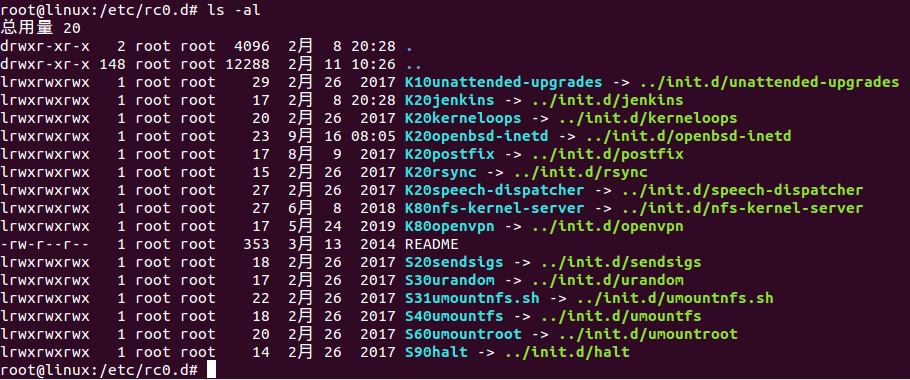

  - dpkg与apt-get区别

    - 两者的区别:dpkg绕过apt-get包管理数据库直接对软件包进行操作,所以用dpkg安装过的软件包可以用apt-get再次安装一遍，系统不知道之前已经安装过了，将会覆盖之前的dpkg的安装

    - dpkg用来安装.deb文件时，不会解决模块的衣领关系，且不会关系Ubuntu的软件仓库的软件，可以用来安装本地的deb文件，apt-get会解决和安装模块的依赖问题，并会资源软件仓库，但不会安装本地的deb文件，apt-get是建立在dpkg之上的软件管理工具

    - 常用命令

      ```shell
      1、dpkg -i <package.deb>
      安装一个 Debian 软件包，如你手动下载的文件。
      
      2、dpkg -c <package.deb>
      列出 <package.deb> 的内容。
      
      3、dpkg -I <package.deb>
      从 <package.deb> 中提取包裹信息。
      
      4、dpkg -r <package>
      移除一个已安装的包裹。
      
      5、dpkg -P <package>
      完全清除一个已安装的包裹。和 remove 不同的是，remove 只是删掉数据和可执行文件，purge 另外还删除所有的配制文件。
      
      6、dpkg -L <package>
      列出 <package> 安装的所有文件清单。同时请看 dpkg -c 来检查一个 .deb 文件的内容。
      
      7、dpkg -s <package>
      显示已安装包裹的信息。同时请看 apt-cache 显示 Debian 存档中的包裹信息，以及 dpkg -I 来显示从一个 .deb 文件中提取的包裹信息。
      
      8、dpkg-reconfigure <package>
      重新配制一个已经安装的包裹，如果它使用的是 debconf (debconf 为包裹安装提供了一个统一的配制界面)
      ```

      ```shell
      一、apt-get 安装软件包
      apt-get install PackageName                 // 普通安装
      apt-get install PackageName=VersionName     // 安装指定包的指定版本
      apt-get --reinstall install PackageName     // 重新安装
      apt-get build-dep PackageName               // 安装源码包所需要的编译环境
      apt-get -f install                          // 修复依赖关系
      apt-get source PackageName                  // 下载软件包的源码
      
      二、apt-get 卸载软件包
      apt-get remove PackageName              // 删除软件包, 保留配置文件
      apt-get --purge remove PackageName      // 删除软件包, 同时删除配置文件
      apt-get purge PackageName               // 删除软件包, 同时删除配置文件
      apt-get autoremove PackageName          // 删除软件包, 同时删除为满足依赖
                                              // 而自动安装且不再使用的软件包
      apt-get --purge autoremove PackageName  // 删除软件包, 删除配置文件, 
                                              // 删除不再使用的依赖包
      apt-get clean && apt-get autoclean      // 清除 已下载的软件包 和 旧软件包
      
      三、apt-get 更新
      apt-get update                  // 更新安装源（Source）
      apt-get upgrade                 // 更新已安装的软件包
      apt-get dist-upgrade            // 更新已安装的软件包（识别并处理依赖关系的改变）
      
      四、apt-get 查询软件包
      dpkg -l                             // 列出已安装的所有软件包
      apt-cache search PackageName        // 搜索软件包
      apt-cache show PackageName          // 获取软件包的相关信息, 如说明、大小、版本等
      apt-cache depends PackageName       // 查看该软件包需要哪些依赖包
      apt-cache rdepends PackageName      // 查看该软件包被哪些包依赖
      apt-get check                       // 检查是否有损坏的依赖
      
      
      
      
      ```

      

