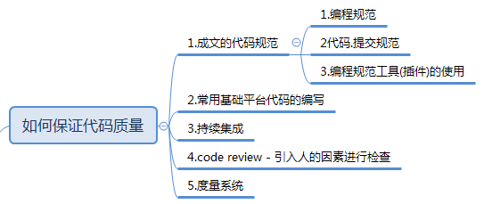
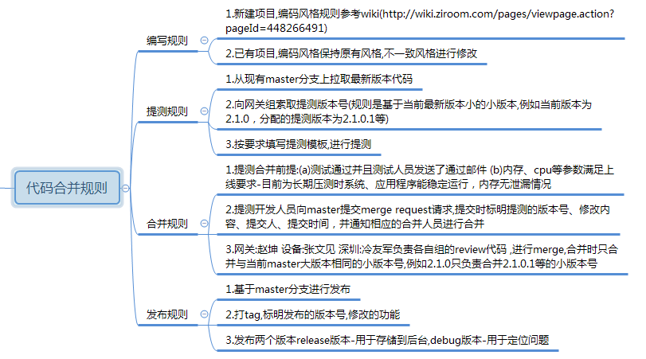
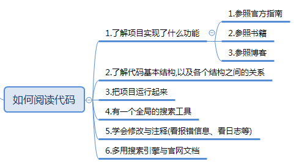
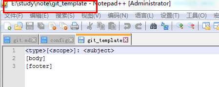
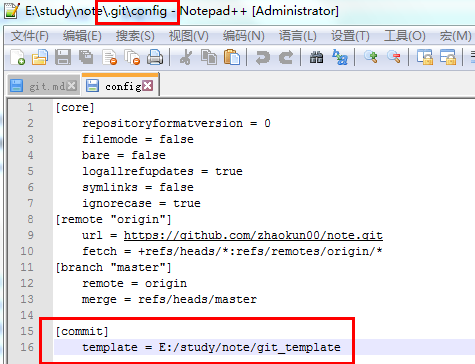

### 一些备注, 通常是 BREAKING CHANGE 或修复的 bug 的链接.如何保证代码质量



### 代码合并原则



### 如何阅读源码



### C++代码编程规范

#### 一、文件排版方面

------

##### 1. 包含头文件

```
　• 先系统头文件，后用户头文件。
　• 系统头文件，稳定的目录结构，应采用包含子路径方式。
　• 自定义头文件，不稳定目录结构，应在dsp中指定包含路径。
　• 系统头文件应用：`#include `
　• 自定义同文件应用：`#include "xxx.h"`
　• 只引用需要的头文件。
```

##### 2. h和cpp文件

```
　• 头文件命名为.h，内联文件命名为.inl；C++文件命名为*.cpp
　• 文件名用大小写混合，或者小写混合。例如`DiyMainview.cpp`，`infoview.cpp`。不要用无意义的名称：例如`XImage.cpp`；`SView.cpp`；`xlog.cpp`；
　• 头文件除了特殊情况，应使用`#ifdef`控制块。
　• 头文件`#endif`应采用行尾注释。
　• 头文件，首先是包含代码块，其次是宏定义代码块，然后是全局变量，全局常量，类型定义，类定义，内联部分。
　• CPP文件，包含指令，宏定义，全局变量，函数定义。
```

##### 3. 文件结构

```
　• 文件应包含文件头注释和内容。
　• 函数体类体之间原则上用2个空行，特殊情况下可用一个或者不需要空行。
```

##### 4. 空行

```
　• 文件头、控制块，`#include`部分、宏定义部分、`class`部分、全局常量部分、全局变量部分、函数和函数之间，用两个空行。
```

#### 二、注释方面

------

##### 1. 文件头注释

```
　• 作者，文件名称，文件说明，生成日期(可选)
```

##### 2. 函数注释

```
　• 关键函数必须写上注释，说明函数的用途。
　• 特别函数参数，需要说明参数的目的，由谁负责释放等等。
　• 除了特别情况，注释写在代码之前，不要放到代码行之后。
　• 对每个`#else`或`#endif`给出行末注释。
　• 关键代码注释，包括但不限于：赋值，函数调用，表达式，分支等等。
　• 善未实现完整的代码，或者需要进一步优化的代码，应加上 // TODO …
　• 调试的代码，加上注释 // only for DEBUG
　• 需要引起关注的代码，加上注释 // NOTE …
　• 对于较大的代码块结尾，如`for,while,do`等，可加上 // end for|while|do
```

#### 三、命名方面

------

##### １. 原则

```
　• 同一性：在编写一个子模块或派生类的时候，要遵循其基类或整体模块的命名风格，保持命名风格在整个模块中的同一性。
　• 标识符组成：标识符采用英文单词或其组合，应当直观且可以拼读，可望文知意，用词应当准确，避免用拼音命名。
　• 最小化长度 && 最大化信息量原则：在保持一个标识符意思明确的同时，应当尽量缩短其长度。
　• 避免过于相似：不要出现仅靠大小写区分的相似的标识符，例如`"i"与"I"`，`"function"`与`"Function"`等等。
　• 避免在不同级别的作用域中重名：程序中不要出现名字完全相同的局部变量和全局变量，尽管两者的作用域不同而不会发生语法错误，但容易使人误解。
　• 正确命名具有互斥意义的标识符：用正确的反义词组命名具有互斥意义的标识符，如：`"nMinValue"` 和`"nMaxValue"`，`"GetName()"` 和`"SetName()"` ….
　• 避免名字中出现数字编号：尽量避免名字中出现数字编号，如Value1,Value2等，除非逻辑上的确需要编号。这是为了防止程序员偷懒，不肯为命名动脑筋而导致产生无意义的名字（因为用数字编号最省事）。
```

##### ２. T,C,M,R类

```
　• T类表示简单数据类型，不对资源拥有控制权，在析构过程中没有释放资源动作。
　• C表示从CBase继承的类。该类不能从栈上定义变量，只能从堆上创建。
　• M表示接口类。
　• R是资源类，通常是系统固有类型。除了特殊情况，不应在开发代码中出现R类型。
```

##### ３. 函数名

```
　• M类的函数名称应采用`HandleXXX`命名，例如：`HandleTimerEvent；`不推荐采用java风格，例如`handleTimerEvent；`除了标准c风格代码，不推荐用下划线，例如，`handle_event`。
　• Leave函数，用后缀L。
　• Leave函数，且进清除栈，用后缀LC。
　• Leave函数，且删除对象，用后缀LD。
```

##### ４. 函数参数

```
　• 函数参数用a作为前缀。
　• 避免出现和匈牙利混合的命名规则如`apBuffer`名称。用`aBuffer`即可。
　• 函数参数比较多时，应考虑用结构代替。
　• 如果不能避免函数参数比较多，应在排版上可考虑每个参数占用一行，参数名竖向对齐。
```

##### ５. 成员变量

```
　• 成员变量用m最为前缀。
　• 避免出现和匈牙利混合的命名规则如mpBuffer名称。用mBuffer即可。
```

##### ６. 局部变量

```
　• 循环变量和简单变量采用简单小写字符串即可。例如，`int i;`
　• 指针变量用`p`打头，例如`void* pBuffer;`
```

##### ７. 全局变量

```
　• 全局变量用`g_`最为前缀。
```

##### ８. 类名

```
　• 类和对象名应是名词。
　• 实现行为的类成员函数名应是动词。
　• 类的存取和查询成员函数名应是名词或形容词。
```

##### ９. 风格兼容性

```
　• 对于移植的或者开源的代码，可以沿用原有风格，不用C++的命名规范。
```

#### 四、代码风格方面

##### 1. Tab和空格

```
　• 每一行开始处的缩进只能用Tab，不能用空格，输入内容之后统一用空格。除了最开始的缩进控制用Tab，其他部分为了对齐，需要使用空格进行缩进。这样可以避免在不同的编辑器下显示不对齐的情况。
　• 在代码行的结尾部分不能出现多余的空格。
　• 不要在`"::","->","."`前后加空格。
　• 不要在`"，","；"`之前加空格。
```

##### 2. 类型定义和{

```
　• 类，结构，枚举，联合：大括号另起一行
```

##### 3. 函数

```
　• 函数体的{需要新起一行，在{之前不能有缩进。
　• 除了特别情况，函数体内不能出现两个空行。
　• 除了特别情况，函数体内不能宏定义指令。
　• 在一个函数体内，逻揖上密切相关的语句之间不加空行，其它地方应加空行分隔。
　• 在头文件定义的`inline`函数，函数之间可以不用空行，推荐用一个空行。
```

##### 4. 代码块

```
　• `"if"、"for"、"while"、"do"、"try"、"catch"` 等语句自占一行，执行语句不得紧跟其后。不论执行语句有多少都要加 “{ }” 。这样可以防止书写和修改代码时出现失误。
　• `"if"、"for"、"while"、"do"、"try"、"catch"` 的括号和表达式，括号可紧挨关键字，这样强调的是表达式。
```

##### 5. else

```
• if语句如果有else语句，用 } else { 编写为一行，不推荐用 3 行代码的方式。
```

##### 6. 代码行

```
　• 一行代码只做一件事情，如只定义一个变量，或只写一条语句。这样的代码容易阅读，并且方便于写注释。
　• 多行变量定义，为了追求代码排版美观，可将变量竖向对齐。
　• 代码行最大长度宜控制在一定个字符以内，能在当前屏幕内全部可见为宜。
```

##### 7. switch语句

```
　• case关键字应和switch对齐。
　• case子语句如果有变量，应用{}包含起来。
　• 如果有并列的类似的简单case语句，可考虑将case代码块写为一行代码。
　• 简单的case之间可不用空行，复杂的case之间应考虑用空行分割开。
　• case字语句的大括号另起一行，不要和case写到一行。
　• 为所有switch语句提供default分支。
　• 若某个case不需要break一定要加注释声明。
```

##### 8. 循环

```
　• 空循环可用 `for( ;; )` 或者 `while( 1 )` 或者 `while( true )`
```

##### 9. 类

```
　• 类继承应采用每个基类占据一行的方式。
　• 单继承可将基类放在类定义的同一行。如果用多行，则应用Tab缩进。
　• 多继承在基类比较多的情况下，应将基类分行，并采用Tab缩进对齐。
　• 重载基类虚函数，应在该组虚函数前写注释 // implement XXX
　• 友元声明放到类的末尾。
```

##### 10. 宏

```
　• 不要用分号结束宏定义。
　• 函数宏的每个参数都要括起来。
　• 不带参数的宏函数也要定义成函数形式。
```

##### 11. goto

```
　• 尽量不要用`goto`
```

#### 五、类型

------

```
• 定义指针和引用时*和&紧跟类型。
• 尽量避免使用浮点数，除非必须。
• 用`typedef`简化程序中的复杂语法。
• 避免定义无名称的类型。例如：`typedef enum { EIdle, EActive } TState;`
• 少用union，如果一定要用，则采用简单数据类型成员。
• 用`enum`取代(一组相关的)常量。
• 不要使用魔鬼数字。
• 尽量用引用取代指针。
• 定义变量完成后立即初始化，勿等到使用时才进行。
• 如果有更优雅的解决方案，不要使用强制类型转换。
```

#### 六、表达式

------

```
• 避免在表达式中用赋值语句。
• 避免对浮点类型做等于或不等于判断。
• 不能将枚举类型进行运算后再赋给枚举变量。
• 在循环过程中不要修改循环计数器。
• 检测空指针，用 `if( p )`
• 检测非空指针，用 `if( ! p )`
```

#### 七、函数

------

```
##### １. 引用

　• 引用类型作为返回值：函数必须返回一个存在的对象。
　• 引用类型作为参数：调用者必须传递一个存在的对象。

##### ２. 常量成员函数

　• 表示该函数只读取对象的内容，不会对对象进行修改。

##### ３. 返回值

　• 除开`void`函数，构造函数，析构函数，其它函数必须要有返回值。
　• 当函数返回引用或指针时，用文字描述其有效期。

##### ４. 内联函数

　• 内联函数应将函数体放到类体外。
　• 只有简单的函数才有必要设计为内联函数，复杂业务逻辑的函数不要这么做。
　• 虚函数不要设计为内联函数。

##### ５. 函数参数

　• 只读取该参数的内容，不对其内容做修改，用常量引用。
　• 修改参数内容，或需要通过参数返回，用非常量应用。
　• 简单数据类型用传值方式。
　• 复杂数据类型用引用或指针方式。
```

#### 八、类

------

```
##### 1. 构造函数

　• 构造函数的初始化列表，应和类的顺序一致。
　• 初始化列表中的每个项，应独占一行。
　• 避免出现用一个成员初始化另一个成员。
　• 构造函数应初始化所有成员，尤其是指针。
　• 不要在构造函数和析构函数中抛出异常。

##### 2. 纯虚函数

　• M类的虚函数应设计为纯虚函数。

##### 3. 构造和析构函数

　• 如果类可以继承，则应将类析构函数设计为虚函数。
　• 如果类不允许继承，则应将类析构函数设计为非虚函数。
　• 如果类不能被复制，则应将拷贝构造函数和赋值运算符设计为私有的。
　• 如果为类设计了构造函数，则应有析构函数。

##### 4. 成员变量

　• 尽量避免使用`mutable`和`Volatile`。
　• 尽量避免使用公有成员变量。

##### 5. 成员函数

　• 努力使类的接口少而完备。
　• 尽量使用常成员函数代替非常成员函数，`const`函数
　• 除非特别理由，绝不要重新定义(继承来的)非虚函数。（这样是覆盖，基类的某些属性无初始化）

##### 6. 继承

　• 继承必须满足IS-A的关系，HAS-A应采用包含。
　• 虚函数不要采用默认参数。
　• 除非特别需要，应避免设计大而全的虚函数，虚函数功能要单一。
　• 除非特别需要，避免将基类强制转换成派生类。

##### 7. 友元

　• 尽量避免使用友元函数和友元类。
```

#### 九、错误处理

------

```
• 申请内存用new操作符。
• 释放内存用delete操作符。
• `new`和`delete`，`new[]`和`delete[]`成对使用。
• 申请内存完成之后，要检测指针是否申请成功，处理申请失败的情况。
• 谁申请谁释放。优先级：函数层面，类层面，模块层面。
• 释放内存完成后将指针赋空，避免出现野指针。
• 使用指针前进行判断合法性，应考虑到为空的情况的处理。
• 使用数组时，应先判断索引的有效性，处理无效的索引的情况。
• 代码不能出现编译警告。
• 使用错误传递的错误处理思想。
• 卫句风格：先处理所有可能发生错误的情况，再处理正常情况。
• 嵌套`do-while(0)`宏：目的是将一组语句变成一个语句，避免被其他if等中断。
```

#### 十、性能

------

```
• 使用前向声明代替`#include`指令。`Class M;`
• 尽量用`++i`代替`i++`。即用前缀代替后缀运算。
• 尽量在`for`循环之前，先写计算估值表达式。
• 尽量避免在循环体内部定义对象。
• 避免对象拷贝，尤其是代价很高的对象拷贝。
• 避免生成临时对象，尤其是大的临时对象。
• 注意大尺寸对象数组。
• 80-20原则。
```

#### 十一、兼容性

------

```
• 遵守ANSI C和ISO C++国际标准。
• 确保类型转换不会丢失信息。
• 注意双字节字符的兼容性。
• 注意运算溢出问题。
• 不要假设类型的存储尺寸。
• 不要假设表达式的运算顺序。
• 不要假设函数参数的计算顺序。
• 不要假设不同源文件中静态或全局变量的初始化顺序。
• 不要依赖编译器基于实现、未明确或未定义的功能。
• 将所有`#include`的文件名视为大小写敏感。
• 避免使用全局变量、静态变量、函数静态变量、类静态变量。在使用静态库，动态库，多线程环境时，会导致兼容性问题。
• 不要重新实现标准库函数,如STL已经存在的。
```

### git提交代码规范

#### 原因

1. 可以清晰知道每次提交的记录
2. 可以快速定位到指定的版本

#### 格式

```javascript
<type>(<scope>) : <subject>
<body>
<footer>
```

备注:每一个commit message由header（必填）、body（选填）和footer（选填）组成，header部分包括三个字段：type（必填）、scope（选填）和 subject（必填）。为了方便浏览，每一行的commit message不应超过100个字符

#### 解释

**type**

```
type 用于说明提交的commit的类别，有一下几种类型：

- feat：添加新功能（feature）
- fix：改bug
- docs： 修改文档（documentation）
- style： 只改样式（不影响代码运行的变动）
- refactor：重构（即不是新增功能，也不是改bug的代码变动）
- perf : 代码优化（提升代码性能）
- test：增加测试
- chore：构建过程或辅助工具的变动
```

**scope**

```
本次改动影响的范围
```

**subject**

```
对本次改动的简单描述
```

**body**

```
commit 具体修改内容的详细描述, 可以分为多行
```

**footer**

```
一些备注, 通常是 BREAKING CHANGE 或修复的 bug 的链接.
```

#### 配置

新建的文件



修改的文件



##### linux中进行设置模板

```
设置当前分支的提交模板
git config commit.template [模板文件名]   
例如：git config commit.template gitcommit_template

设置全局的提交模板
git config --global commit.template [模板文件名]   
例如：git config --global commit.template gitcommit_template

设置文本编辑器
git config -global core.editor [编辑器名称] 
例如:git config -global core.editor vim
```

##### TortoiseGit 提交模板

```
https://blog.csdn.net/zhangshencong12/article/details/78821990
```