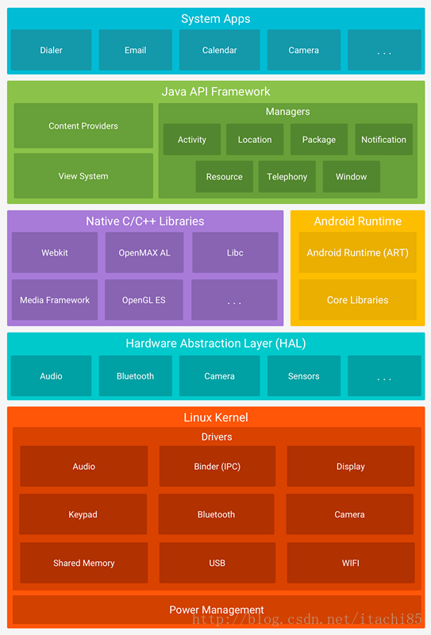
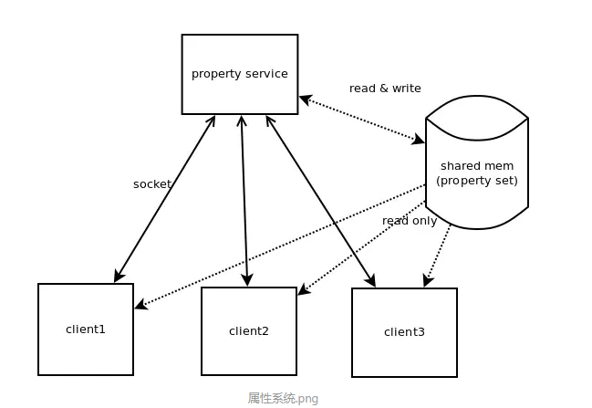
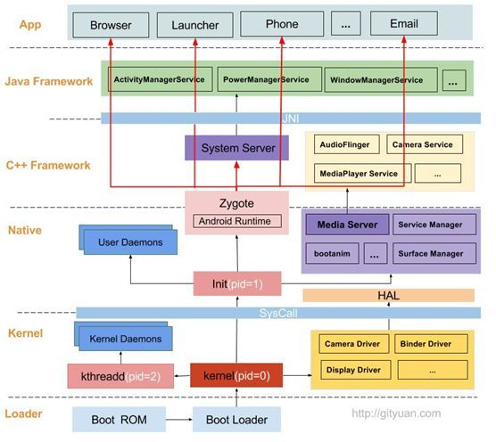
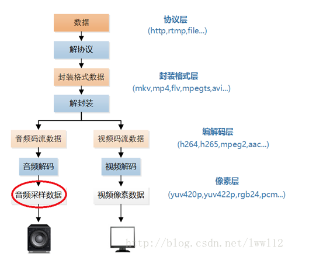
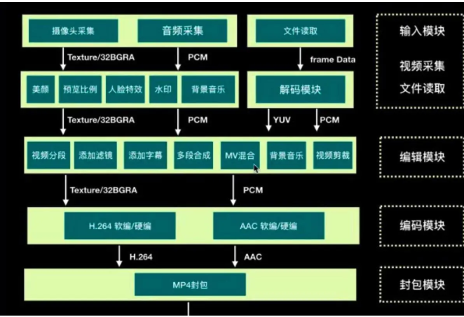
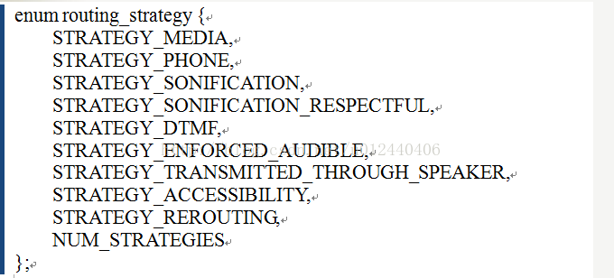

#### 1. 开发环境搭建

```shell
#Android源码编译、制作、烧写:
	(0)安装交叉编译工具链
		此处省略....
	(1)uboot编译:
		tar -xzvf uboot_tiny4412-20130729.tgz
		cd uboot_tiny4412/
		//配置
		make tiny4412_config
		//编译
		make
		镜像文件:u-boot.bin
		
#备注:
	1. 该处编译得到的u-boot.bin烧录进去后不能使用，目前只能使用厂家提供的Superboot4412.bin，但没有源码，并且也不能进行fastboot形式烧录，目前只能通过工具MiniTools烧录
	2. 获取得到mkimage可执行文件,主要用于制作文件系统镜像使用，sudo cp tools/mkimage /usr/bin/
		
	(2)内核编译:
		tar xzf linux-3.0.86-20150324.tgz
		cd linux-3.0.86/
		//配置内核
		cp tiny4412_android_defconfig .config
		//编译内核,直接使用zImage镜像,而没有使用uImage镜像
		make zImage
		
		镜像文件:arch/arm/boot/zImage
		
	(3)android源码的编译:
		tar xzf android-5.0.2-fs-20150325.tar.gz
		
		//下面的脚本会调用该命令source build/envsetup.sh,运行该脚本的原因，是由于要导出lunch等一系列函数使用
		source setenv或者. setenv
		
		#只有执行了上述的source命令才能使用lunch命令
		lunch full_tiny4412-eng
		//编译
		make –j4
		
		生成的文件系统目录:
		out/target/product/tiny4412/root
		out/target/product/tiny4412/system
		out/target/product/tiny4412/data
			
	(4)文件系统的制作:
		该脚本会根据上面的3个目录以及make_ext4fs、mkimage最终生成所需要的镜像文件
		./gen-img.sh
		最终生成的以下3个镜像文件:
			ramdisk-u.img
			system.img
			userdata.img
		
	(5)镜像烧写:
        tiny4412有以下2种烧写方式:(不管哪种方式,都需要设置sd卡启动)

            (1)使用sd卡离线烧写
            将所有的文件(包括uboot-1个、内核-1个、文件系统-3个)都放到sd卡中

            (2)使用usb烧写(此时已经使用sd卡将uboot烧写进去了)
            可以使用MiniTools工具单独进行烧写

#参考资料:
Tiny4412用户手册.pdf
友善之臂tiny4412-1306开发板安卓系统烧写
https://blog.csdn.net/morixinguan/article/details/52015233

#问题1:
miniusb，adb不识别问题(没有办法通过adb shell进入到开发板中)
原因:找不到驱动,配置驱动
https://blog.csdn.net/fozhishuiyue/article/details/83151479
在安装android studio时，sdk的安装路径:C:\Users\Administrator\AppData\Local\Android\sdk\extras\google\usb_driver\android_winusb.inf
#在上述内容中添加以上文件
;tiny4412
%SingleBootLoaderInterface% = USB_Install, USB\VID_18D1&PID_D011&MI_03
%SingleAdbInterface%        = USB_Install, USB\VID_18D1&PID_D011&REV_0400&MI_03

%SingleBootLoaderInterface% = USB_Install, USB\VID_18D1&PID_D011&MI_00
%SingleAdbInterface%        = USB_Install, USB\VID_18D1&PID_D011&REV_0400&MI_00

%SingleBootLoaderInterface% = USB_Install, USB\VID_18D1&PID_D011&MI_01
%SingleAdbInterface%        = USB_Install, USB\VID_18D1&PID_D011&REV_0400&MI_01

#总结:
	(1)根据上述描述，最终整个Andorid系统编译出了u-boot.bin、zImage、ramdisk-u.img、system.img、userdata.img5个文件，其中ramdisk-u.img属于根文件系统、system.img属于系统分区、userdata.img属于用户分区。实际Android与其他linux系统不同在于上述3个文件的不同
	(2)使用hmm命令查看source build/envsetup.sh加载了多少个shell脚本函数
book@linux:android-5.0.2$ hmm
Invoke ". build/envsetup.sh" from your shell to add the following functions to your environment:
- lunch:   lunch <product_name>-<build_variant>
- tapas:   tapas [<App1> <App2> ...] [arm|x86|mips|armv5|arm64|x86_64|mips64] [eng|userdebug|user]
- croot:   Changes directory to the top of the tree.
- m:       Makes from the top of the tree.
- mm:      Builds all of the modules in the current directory, but not their dependencies.
- mmm:     Builds all of the modules in the supplied directories, but not their dependencies.
           To limit the modules being built use the syntax: mmm dir/:target1,target2.
- mma:     Builds all of the modules in the current directory, and their dependencies.
- mmma:    Builds all of the modules in the supplied directories, and their dependencies.
- cgrep:   Greps on all local C/C++ files.
- ggrep:   Greps on all local Gradle files.
- jgrep:   Greps on all local Java files.
- resgrep: Greps on all local res/*.xml files.
- sgrep:   Greps on all local source files.
- godir:   Go to the directory containing a file.

Look at the source to view more functions. The complete list is:
addcompletions add_lunch_combo cgrep check_product check_variant choosecombo chooseproduct choosetype choosevariant cproj croot findmakefile gdbclient gdbwrapper get_abs_build_var getbugreports get_build_var getdriver getlastscreenshot get_make_command getprebuilt getscreenshotpath getsdcardpath get_symbols_directory gettargetarch gettop ggrep godir hmm is isviewserverstarted jgrep key_back key_home key_menu lunch _lunch m make mangrep mgrep mm mma mmm mmma pez pid printconfig print_lunch_menu qpid resgrep runhat runtest sepgrep set_java_home setpaths set_sequence_number set_stuff_for_environment settitle sgrep smoketest stacks startviewserver stopviewserver systemstack tapas tracedmdump treegrep
```

#### 2. android系统源码目录作用及与android系统框架对应关系

```shell
按照android软件系统架构图、android系统源码基本是一一相对应，各个版本的源码目录基本是类似，编译后的源码目录会多增加一个out文件夹，用来存储编译产生的文件。

abi	应用程序二进制接口
art	#全新的ART运行环境，对应着虚拟机
bionic	系统C库
bootable	启动引导相关代码
build	存放系统编译规则及generic等基础开发包配置
cts	Android兼容性测试套件标准
dalvik	dalvik虚拟机
developers	开发者目录
development	应用程序开发相关
device	设备相关配置
docs	参考文档目录
external	开源模组相关文件
frameworks	#应用程序框架，Android系统核心部分，由Java和C++编写，对应frmeworks层
hardware	#主要是硬件抽象层的代码，对应hardware层
libcore	核心库相关文件
libnativehelper	动态库，实现JNI库的基础
ndk	NDK相关代码，帮助开发人员在应用程序中嵌入C/C++代码
out	编译完成后代码输出在此目录
packages	应用程序包
pdk	Plug Development Kit 的缩写，本地开发套件
platform_testing	平台测试
prebuilts	x86和arm架构下预编译的一些资源
sdk	sdk和模拟器
system	底层文件系统库、应用和组件
toolchain	工具链文件
tools	工具文件
Makefile	全局Makefile文件，用来定义编译规则

参考文档:
Android系统架构与系统源码目录
https://blog.csdn.net/itachi85/article/details/54695046
Android虚拟机ART和Dalvik区别
https://www.jianshu.com/p/8bb770ec4c48
```



#### 3. android镜像基本介绍

```shell
#在源码中对应的各个目录，路径:out/target/product/tiny4412/root
root目录对应着ramdisk.img
data目录对应着userdata.img
system目录对应着system.img
	
#在开发板中对应的各个目录
(1)ramdisk.img是由root目录制作完成，然后挂载到了/目录下，其中system目录、data目录是根文件系统中的2个目录，只是系统镜像和用户镜像挂载到了以上2个目录下
(2)system.img是由system目录制作完成，然后挂载到了system目录下。通俗解释:就是我们刷ROM的分区
(3)userdata.img是由data目录制作完成，然后挂载到了data目录下。通俗解释:就是我们装APK的分区

#android根目录下各个文件介绍
data:应用或者系统的数据 /data/data/包/files/。。。sharedpre...
	
	init //android系统祖先进程, set bootargs init=/init
	init.rc //启动脚本 //类似于busybox中的/etc/init.d/rcS	
	ueventd.rc //自动创建设备节点的脚本,功能类似与mdev -s
	default.prop //属性文件,property属性
	system
		app //系统自带的apk,开机的时候会自动安装(因此一个新机器,会在开机时安装这些app,从而导致第一次启动时会慢)
		build.prop //属性文件
		fonts //字体库
		framework //framework层的java代码编译之后的二进制文件class文件，开机自动执行,tar jar光查看不解压参数
		media //开机动画
		tts //语音支持包
		vendor //厂商提供的二进制文件
		
#system目录:
root@tiny4412:/system # ls -al
drwxr-xr-x root     root              2015-02-12 02:49 addon.d
drwxr-xr-x root     root              2015-07-23 07:18 app #存放系统自带的APK
drwxr-xr-x root     shell             2015-06-11 01:49 bin
-rw-r--r-- root     root         2904 2015-07-23 06:26 build.prop
drwxr-xr-x root     root              2012-03-06 03:56 busybox
drwxr-xr-x root     root              2015-06-11 01:49 etc
drwxr-xr-x root     root              2015-07-23 06:52 fonts
drwxr-xr-x root     root              2014-01-01 19:05 framework #存放各种jar文件,主要是java
drwxr-xr-x root     root              2015-06-11 01:49 lib #存放系统库文件，主要是C/C++库
drwx------ root     root              1970-01-01 00:00 lost+found
drwxr-xr-x root     root              2015-07-23 06:43 media
drwxr-xr-x root     root              2015-07-23 07:18 priv-app
drwxr-xr-x root     root              2015-07-23 06:43 tts
drwxr-xr-x root     root              2015-07-23 06:46 usr
drwxr-xr-x root     shell             2015-07-23 07:07 vendor
drwxr-xr-x root     shell             2015-07-23 07:13 xbin


#总结:
	其中一个很重要的目录:/system/lib/hw,存放hardware层库文件

#data目录
root@tiny4412:/data # ls -al
-rw------- root     root            2 2014-01-01 12:48 .layout_version
drwxrwx--x system   system            2014-01-01 12:48 app #用户安装的APK放在这里
drwx------ root     root              2014-01-01 12:48 app-asec
drwxrwx--x system   system            2014-01-01 12:48 app-lib
drwxrwx--x system   system            2014-01-01 12:48 app-private
drwx------ system   system            2014-01-01 12:51 backup
lrwxrwxrwx root     root              2014-01-01 12:48 bugreports -> /data/data/
com.android.shell/files/bugreports
drwxrwx--x root     root              2014-01-01 12:48 dalvik-cache
drwxrwx--x system   system            2014-01-01 12:49 data #存放的是所有APK程序数据的目录，每个APK对就一个自己的Data目录，就是在data/data/目录下，会产生一个跟Package一样的目录
drwxr-x--- root     log               2014-01-01 12:48 dontpanic
drwxrwx--- drm      drm               2014-01-01 12:51 drm
drwxrwxr-x system   system            2014-01-01 12:48 ethernet
drwxrwx--x system   system            2014-01-01 12:48 gps
drwxr-x--x root     root              2014-01-01 12:48 local
drwxrwx--- root     root              1970-01-01 00:00 lost+found
drwxrwx--- media_rw media_rw          2014-01-01 12:51 media
drwxrwx--- mediadrm mediadrm          2014-01-01 12:48 mediadrm
drwxrwx--t system   misc              2014-01-01 12:48 misc #保存WIFI帐号，VPN设置信息等
drwxrwx--x system   system            2017-06-25 00:44 nativebenchmark
drwxrwx--x system   system            2017-06-25 00:24 nativetest
drwx------ root     root              2014-01-01 12:00 property
drwxrwx--x system   system            2014-01-01 12:48 resource-cache
drwx--x--x system   system            2014-01-01 12:48 security
drwxrwxr-x system   system            2014-01-01 12:00 system
drwx--x--x system   system            2014-01-01 12:48 user

参考资料:
	ramdisk.img、system.img、userdata.img镜像的作用
	https://blog.csdn.net/tanxjian/article/details/7909395

	system、data目录各个目录的作用
	https://www.cnblogs.com/airoot/p/4131891.html
```

#### 4. android系统查看实际分区情况

```shell
设备节点  挂载目录  文件系统类型  权限
//挂载情况，查看分区挂载情况
root@tiny4412:/ # mount
rootfs / rootfs ro,relatime 0 0
tmpfs /dev tmpfs rw,seclabel,nosuid,relatime,mode=755 0 0
devpts /dev/pts devpts rw,seclabel,relatime,mode=600 0 0
proc /proc proc rw,relatime 0 0
sysfs /sys sysfs rw,seclabel,relatime 0 0
selinuxfs /sys/fs/selinux selinuxfs rw,relatime 0 0
none /acct cgroup rw,relatime,cpuacct 0 0
none /sys/fs/cgroup tmpfs rw,seclabel,relatime,mode=750,gid=1000 0 0
tmpfs /mnt/asec tmpfs rw,seclabel,relatime,mode=755,gid=1000 0 0
tmpfs /mnt/obb tmpfs rw,seclabel,relatime,mode=755,gid=1000 0 0
none /dev/cpuctl cgroup rw,relatime,cpu 0 0
/dev/block/mmcblk0p2 /system ext4 ro,seclabel,relatime,user_xattr,barrier=1,data=ordered 0 0
/dev/block/mmcblk0p4 /cache ext4 rw,seclabel,nosuid,nodev,noatime,errors=panic,user_xattr,barrier=1,nomblk_io_submit,data=ordered 0 0
/dev/block/mmcblk0p3 /data ext4 rw,seclabel,nosuid,nodev,noatime,errors=panic,user_xattr,barrier=1,nomblk_io_submit,data=ordered,noauto_da_alloc 0 0
/sys/kernel/debug /sys/kernel/debug debugfs rw,relatime 0 0
/dev/fuse /mnt/shell/emulated fuse rw,nosuid,nodev,relatime,user_id=1023,group_id=1023,default_permissions,allow_other 0 0
/dev/block/vold/179:9 /mnt/media_rw/sd_external vfat rw,dirsync,nosuid,nodev,noexec,relatime,uid=1023,gid=1023,fmask=0007,dmask=0007,allow_utime=0020,codepage=cp437,iocharset=iso8859-1,shortname=mixed,utf8,errors=remount-ro 0 0
/dev/fuse /storage/sd_external fuse rw,nosuid,nodev,relatime,user_id=1023,group_id=1023,default_permissions,allow_other 0 0
/dev/block/vold/179:1 /mnt/media_rw/sd_internal vfat rw,dirsync,nosuid,nodev,noexec,relatime,uid=1023,gid=1023,fmask=0007,dmask=0007,allow_utime=0020,codepage=cp437,iocharset=iso8859-1,shortname=mixed,utf8,errors=remount-ro 0 0
/dev/fuse /storage/sd_internal fuse rw,nosuid,nodev,relatime,user_id=1023,group_id=1023,default_permissions,allow_other 0 0

#解释:
/dev/block/mmcblk0p2 /system ext4 ro,seclabel,relatime,user_xattr,barrier=1,data=ordered 0 0
/dev/block/mmcblk0p2设备节点挂载到了/system目录下，文件系统类型是ext4

//查看磁盘使用情况
root@tiny4412:/ # df                                                           
Filesystem               Size     Used     Free   Blksize
/dev                   397.2M    24.0K   397.2M   4096
/sys/fs/cgroup         397.2M    12.0K   397.2M   4096
/mnt/asec              397.2M     0.0K   397.2M   4096
/mnt/obb               397.2M     0.0K   397.2M   4096
/system                590.6M   525.7M    64.9M   4096
/cache                 508.3M    16.5M   491.9M   4096
/data                    3.9G   456.5M     3.5G   4096
/mnt/shell/emulated      3.9G   456.5M     3.5G   4096
/mnt/media_rw/sd_external     7.3G   568.0M     6.7G   4096
/storage/sd_external     7.3G   568.0M     6.7G   4096
/mnt/media_rw/sd_internal     2.0G    76.0K     2.0G   4096
/storage/sd_internal     2.0G    76.0K     2.0G   4096

#解释:
/system                590.6M   525.7M    64.9M   4096
总共大小590.6M，使用了525.7M，剩余64.9M

//分区情况，查看分了多少区
root@tiny4412:/ # cat /proc/partitions                                         
major minor  #blocks  name

179        0    7634944 mmcblk0
179        1    2119634 mmcblk0p1
179        2     626934 mmcblk0p2
179        3    4209414 mmcblk0p3
179        4     537372 mmcblk0p4
179        8    7806976 mmcblk1
179        9    7652352 mmcblk1p1

参考资料：
https://blog.csdn.net/Roland_Sun/article/details/50969958

Android平台如何查看设备ram和存储flash大小
https://www.jianshu.com/p/32137cd04586
```

#### 5. adb命令常用命令

```shell
以下命令都是在电脑上安装完adb工具后，在电脑上执行的命令

adb remount:
	adb remount将/system部分置于可写入的模式，默认情况下/system部分是只读模式，这个命令只适用于被root的设备，在将文件push到/system文件夹之前，必须先输入命令adb remount
	adb remount 的作用相当于 adb shell mount -o rw,remount,rw /system

示例:
#在未重新挂载system目录前，推送文件是不能够推送的
adb push 1.txt /system
adb: error: failed to copy '1.txt' to '/system/1.txt': remote Read-only file system
1.txt: 0 files pushed.

C:\Users\Administrator\Desktop>adb remount

#重新挂载后，可以进行推送
C:\Users\Administrator\Desktop>adb push 1.txt /system
1.txt: 1 file pushed.

#从system目录拉取文件
C:\Users\Administrator\Desktop>adb pull /system/1.txt .
/system/1.txt: 1 file pulled. 0.0 MB/s (4 bytes in 0.010s)

adb shell
	登录到开发板上
adb devices
	查看android设备,可以用此命令查看电脑下的android设备,只有有android设备时，才能使用各种的adb命令
adb root
	以root用户登录
adb push <电脑上的文件路径> <设备里的目录>
	从电脑向设备中推送文件
# 设备上的文件路径普通权限可能无法直接写入，如果设备已经root过，可以先adb push /path/on/pc /sdcard/filename，然后adb shell和su在 adb shell里获取root权限后，cp /sdcard/filename /path/on/device。
adb pull <设备里的文件路径> [电脑上的目录] # 电脑上的目录参数可忽略，默认为当前目录
# 设备上的文件路径可能需要root权限才能访问，如果你的设备已经root过，可以先使用adb shell和su命令在adb shell里获取root 限后，
先cp /path/on/device /sdcard/filename将文件复制到sdcard，然后adb pull /sdcard/filename /path/on/pc

参考文档:
	ADB——命令大全
	https://www.cnblogs.com/zhuminghui/p/10457316.html
	adb remount的作用是什么？在什么情况下有用？
	https://www.cnblogs.com/liushengchieh/p/9403584.html
```

#### 6. android系统简介

```shell
#(1)Android是linux的一种,Ubuntu也是linux的一种,区别在于：
	a.适用场景有所不同，Android系统一般用于移动设备适用场景有所不同，Android系统一般用于移动设备,Ubuntu一般用于桌面系统
	b.上层应用有所不同(根文件系统)，内核基本是相同(会在原有基础上加入本身系统特有的驱动)
	
#(2)Android系统的组成: bootloader(uboot) + linux内核(zImage/uImage) + 根文件系统
	a.bootloader - uboot.bin(源码编译)
	b.linux内核:开发驱动即在该层,linux驱动开发和android驱动开发基本一致,只是android修改了部分内核代码,linux内核(zImage/uImage)：该内核为Andoird源码内核(从source.android.com下载下来的源码，系统的组成),区别与linux标准内核(从kernel.org下载下来的内核)，它在标准内核的基础上进行了修改,增加了特有的驱动，例如binder、log系统、lowmekiller...,因此标准内核在android系统中是使用不了的,可以grep "goole" -rn ./查看具体修改了哪些内容
	c.根文件系统:即平时所看见的根目录下的各个目录,不同系统的区别即在此,Android源码编译-有图形界面，区别与之前的busybox-无图形界面

	bsp包:
		即包含以上3个部分
		
#(3)Android源码的来源:
	1.官网source.android.com
	2.原厂:高通、MTK、三星....,这些都是基于官网的源码进行修改的,针对各厂家的硬件,定制化开发
```

#### 7. android日志系统介绍

```shell
#1.android日志系统简介:
在Android中不同的log写到不同的设备中，一般共有/dev/log/system, /dev/log/main, /dev/log/radion, /dev/log/events四中类型，其中默认Log.v等写入/dev/log/main中。Slog写入/dev/log/system中
我们在使用logcat抓取日志的时候，可以指定buffer，默认为main system，因为Android日志系统为了日志消息保持了多个缓冲区，而不是所有的消息DOI被发送到默认的缓冲区

root@tiny4412:/ # ls -al /dev/log
crw-rw-rw- root     log       10,  43 2014-01-01 12:00 events --查看事件相关的消息,通知类
crw-rw-rw- root     log       10,  44 2014-01-01 12:00 main   --查看主缓冲区(默认缓冲区)
crw-rw-rw- root     log       10,  42 2014-01-01 12:00 radio  --查看包含在无线/电话相关的缓冲区消息
crw-rw-rw- root     log       10,  40 2014-01-01 12:00 sf
crw-rw-rw- root     log       10,  41 2014-01-01 12:00 system --系统缓冲区(后台服务)

参考文档:
android下的日志缓冲区
https://www.cnblogs.com/zhengtu2015/p/5134012.html

没有日志输出的解决办法:
部分android手机为了加快运行速度，故在rom中屏蔽了logcat的输出，所以这样的手机在开发的 时候会在logcat里面出现Unable to open log device ‘/dev/log/main': No such file or directory 的提示，是由于在启动开机时会把该设备文件删除
https://blog.csdn.net/growth58/article/details/41143387?utm_source=blogxgwz1

#android系统日志命令:
logcat —h 帮助
logcat -b ；指定缓冲区
	logcat -b main
	logcat -b system
	logcat -b radio
	logcat -b events
	
logcat -s:过滤
	logcat -s "dalvikvm" 
	logcat -s "dalvikvm:D" //带级别的过滤 

logcat -c :清空
	
日志格式:
等级/标签tag(pid)；调试内容
E/Sensors ( 1987): AkmSensor: isVLCD:0 (code=1, value=-2)

等级：
	V:verbose D:debug I:info W:warning E:error F:fatal
	标签作用：区分调试信息是从哪个进程或者是文件中打印出来的
	
在系统中打印日志使用以下函数:ALOGE ALOGW ALOGI ALOGD ALOGV,区别与printf，printf直接将日志信息打印到console,而上述函数打印的信息只能用logcat命令查看

#2. android日志示例:
参考模板:hardware/ril/rild/Android.mk
目录：external/test/hello
	book@linux:hello$ tree
	.
	├── Android.mk
	└── hello.c
	
hello.c内容如下:
#define LOG_TAG "HELLO" //该宏一定要定义到下面头文件的前面
#include <cutils/log.h>
#include <utils/Log.h>

#include <stdio.h>

int main()
{
        printf("hello world\n");
        ALOGD("main log"); //生成到main缓冲区
        SLOGD("system log"); //生成到system缓冲区
        RLOGD("radio log"); //生成到radio缓冲区

        return 0;
}

注意事项:
	0.在android中编写代码必须在Android源码目录下操作(不能再其他以外的目录)
	1.LOG_TAG宏的定义以及位置
	2.包含的头文件
	
Android.mk内容如下:
LOCAL_PATH := $(call my-dir)

include $(CLEAR_VARS)

LOCAL_MODULE := hello

LOCAL_SRC_FILES := hello.c

LOCAL_MODULE_PATH := $(LOCAL_PATH)

LOCAL_SHARED_LIBRARIES := \
        liblog \
        libcutils \

include $(BUILD_EXECUTABLE)


注意事项:
		1.依赖的库文件(LOCAL_SHARED_LIBRARIES)
		2.依赖的头文件路径
			system/core/include/cutils/log.h
			system/core/include/log/log.h

#强制编译，不管是否改动，重新编译；mm命令只能在当前目录下编译，mmm可以指定目录进行编译			
mm -B或者mmm -B external/test/hello/

#默认的生成的路径位置:
Install: out/target/product/tiny4412/system/bin/hello
#实际指定的生成位置
Install: external/test/hello/hello

打印日志:
	#可以看到默认输出的system、main两个缓冲区
	logcat -s HELLO
--------- beginning of system
--------- beginning of main
D/HELLO   (20692): main log
D/HELLO   (20692): system log

	#要进行指定radio缓冲区
	logcat  -b radio -s HELLO
D/HELLO   (20692): radio log
D/HELLO   (20789): radio log

#3. Android.mk的基本解释:
Android.mk，anroid中没有使用makefile，使用Android.mk替代makefile，语法更加的人性化，更容易理解

makefile重要的3个东西：
	目标:依赖
		编译方法
		
vim build/core/clear_vars.mk,内容如下,给各个变量赋值为空:
LOCAL_MODULE:=
LOCAL_MODULE_PATH:=
LOCAL_MODULE_RELATIVE_PATH :=
LOCAL_MODULE_STEM:=
LOCAL_DONT_CHECK_MODULE:=
LOCAL_CHECKED_MODULE:=
LOCAL_BUILT_MODULE:=
LOCAL_BUILT_MODULE_STEM:=

#表示获取当前路径
LOCAL_PATH := $(call my-dir)
#清空以LOCAL_XX的变量,LOCAL_PATH除外
include $(CLEAR_VARS)
#指定目标文件,相当于目标
LOCAL_MODULE := hello
#指定源文件，相当于依赖
LOCAL_SRC_FILES := hello.c
#指定安装目录
LOCAL_MODULE_PATH := $(LOCAL_PATH)
#指定依赖的库文件
LOCAL_SHARED_LIBRARIES := \
        liblog \
        libcutils \

#在任何情况都会编译这个模块
LOCAL_MODULE_TAGS:=optional
	
#编译成可执行程序，相当于编译方法
include $(BUILD_EXECUTABLE)


//使用hmm命令查看build/envsetup.sh导出了多少命令
book@linux:hello$ hmm
Invoke ". build/envsetup.sh" from your shell to add the following functions to your environment:
- lunch:   lunch <product_name>-<build_variant>
- tapas:   tapas [<App1> <App2> ...] [arm|x86|mips|armv5|arm64|x86_64|mips64] [eng|userdebug|user]
- croot:   Changes directory to the top of the tree.
- m:       Makes from the top of the tree.
- mm:      Builds all of the modules in the current directory, but not their dependencies.
- mmm:     Builds all of the modules in the supplied directories, but not their dependencies.
           To limit the modules being built use the syntax: mmm dir/:target1,target2.
- mma:     Builds all of the modules in the current directory, and their dependencies.
- mmma:    Builds all of the modules in the supplied directories, and their dependencies.
- cgrep:   Greps on all local C/C++ files.
- ggrep:   Greps on all local Gradle files.
- jgrep:   Greps on all local Java files.
- resgrep: Greps on all local res/*.xml files.
- sgrep:   Greps on all local source files.
- godir:   Go to the directory containing a file.

Look at the source to view more functions. The complete list is:
addcompletions add_lunch_combo cgrep check_product check_variant choosecombo chooseproduct choosetype choosevariant cproj croot findmakefile gdbclient gdbwrapper get_abs_build_var getbugreports get_build_var getdriver getlastscreenshot get_make_command getprebuilt getscreenshotpath getsdcardpath get_symbols_directory gettargetarch gettop ggrep godir hmm is isviewserverstarted jgrep key_back key_home key_menu lunch _lunch m make mangrep mgrep mm mma mmm mmma pez pid printconfig print_lunch_menu qpid resgrep runhat runtest sepgrep set_java_home setpaths set_sequence_number set_stuff_for_environment settitle sgrep smoketest stacks startviewserver stopviewserver systemstack tapas tracedmdump treegrep

//查看环境变量CLEAR_VARS的值
book@linux:android-5.0.2$ get_build_var CLEAR_VARS
build/core/clear_vars.mk
```

#### 8. android属性系统介绍

```shell
#1.android属性系统简介

android的系统属性实际就是系统中的全局变量，在各个进程中都可以获取到属性的值

属性系统简单可以总结以下几点:
(1)android系统一启动就从若干属性脚本文件中加载属性内容
(2)android系统中所有属性(key/value)会存入同一块共享内存中
(3)系统中各个进程会将这块共享内存映射到自己共享内存空间，这样就可以直接读取属性内容
(4)系统中只有一个进程可以设置、修改属性值，就是init进程
(5)不同进程只能通过socket方式，向init进程发出修改，而不能直接修改

属性系统操作的设备节点
root@tiny4412:/ # ls /dev/__properties__
/dev/__properties__


#2.使用命令获取系统中的属性变量

Android toolbox程序提供了两个工具： setprop和getprop获取和设置属性。其使用方法：
　　getprop <属性名>
　　setprop <属性名> <属性值>


root@tiny4412:/ # getprop
[dalvik.vm.dex2oat-Xms]: [64m]
[net.bt.name]: [Android]
[persist.demo.hdmirotationlock]: [1]
[ro.allow.mock.location]: [1]

#3.读取的属性文件目录:
	default.prop
	/system/build.prop
	/system/default.prop
	/data/property/*
	...
	
#4.系统属性根据不同的应用类型，可分为不可变类型，持久性，网络行，启动和停止服务等
属性名称以"ro."开头，那么这个属性被视为只读属性。一旦设置，属性值不能改变。

属性名称以"persist."开头，当设置这个属性时，其值也将写入/data/property。

属性名称以"net."开头，当设置这个属性时，"net.change"属性将会自动设置，以加入到最后修改的属性名。
例如:
	root@tiny4412:/data # setprop net.name zhaokun
	#例如net.change中保存的为修改的属性名字
	root@tiny4412:/data # getprop net.change
	net.name

属性"ctrl.start"和"ctrl.stop"是用来启动和停止服务。每一项服务必须在/init.rc中定义.系统启动时，与init守护进程将解析init.rc和启动属性服务。一旦收到设置“ ctrl.start ”属性的请求，属性服务将使用该属性值作为服务名找到该服务，启动该服务。这项服务的启动结果将会放入“ init.svc.<服务名>“属性中 。客户端应用程序可以轮询那个属性值，以确定结果。


#下面的命令将变量存储在共享内存中，重新上电属性变量会消失
root@tiny4412:/data/property # setprop male.name zhaokun
root@tiny4412:/data/property # getprop male.name
zhaokun

#下面的命令会保存在/data/property/persist.male.name文件中，持久化操作，重新上电属性变量不会消失
root@tiny4412:/ # setprop persist.male.name ycl
root@tiny4412:/ # getprop persist.male.name
ycl


#5.在程序层获取和设置系统属性

//在java程序中
public static String getProperty(String key,  String defaultValue);
public static String setProperty(String key,  String vlaue);

//在c/c++程序中,在头文件cutils/properties.h，依赖libcutils.so库
int property_get(const char *key ,  char *value , const char *default_value)
int property_set(const char *key ,  char *value)

示例程序:
#define LOG_TAG "HELLO"
#include <cutils/log.h>
#include <utils/Log.h>
#include <cutils/properties.h>

#include <stdio.h>

int main()
{
	char p[PROPERTY_VALUE_MAX] = {0};
	//获取属性值
	property_get("persist.male.name", &p[0] , NULL);

	printf("PROPERTY_VALUE_MAX = %u p = %s\n",PROPERTY_VALUE_MAX,p);
	//设置属性值
	property_set("persist.male.name", "aimi" );

	property_get("persist.male.name", &p[0] , NULL);

	printf("PROPERTY_VALUE_MAX = %u p = %s\n",PROPERTY_VALUE_MAX,p);

	return 0;
}

打印信息:
root@tiny4412:/data/test # ./hello
PROPERTY_VALUE_MAX = 92 p = ycl
PROPERTY_VALUE_MAX = 92 p = aimi

参考文档:
https://www.jianshu.com/p/d9a49248a1b5
https://www.cnblogs.com/l2rf/p/6610348.html
```



#### 8. android.d系统中的init.rc脚本分析

```shell
init.rc语法详解
https://blog.csdn.net/feigebangni/article/details/50300063
Android5.1 在init.rc 中添加自己的服务
https://www.cnblogs.com/zzb-Dream-90Time/p/7453729.html

https://blog.csdn.net/zhonglunshun/article/details/78615980
```

#### 9. android系统的启动流程

```shell
#1.Android启动流程
Android系统启动过程从下往上：
	bootloader --> kernel --> Native --> Framework --> APP

(1)bootloader
这是启动Android系统之前的引导程序，主要是检查RAM，初始化硬件参数等功能

(2)kernel
启动Kernel的0号进程：初始化进程管理、内存管理，加载Display,Camera Driver，Binder Driver等相关工作；

启动kthreadd进程（pid=2）：是Linux系统的内核进程，会创建内核工作线程kworkder，软中断线程ksoftirqd，thermal等内核守护进程。kthreadd进程是所有内核进程的鼻祖。

(3)Native
启动init进程(pid=1)，是Linux系统的用户进程，init进程是所有用户进程的鼻祖。

init进程启动Media Server(多媒体服务)、servicemanager(binder服务管家)、bootanim(开机动画)等重要服务；

init进程还会孵化出installd(用于App安装)、ueventd、adbd、lmkd(用于内存管理)等用户守护进程；

init进程孵化出Zygote进程，Zygote进程是Android系统的第一个Java进程，Zygote是所有Java进程的父进程，Zygote进程本身是由init进程孵化而来的。

(4)Framework
Zygote进程，是由init进程通过解析init.rc文件后fork生成的，Zygote进程主要包含： - 加载ZygoteInit类，注册Zygote Socket服务端套接字； - 加载虚拟机； - PreloadClasses； - PreloadResouces。

Zygote进程fork出System Server进程，System Server是Zygote孵化的第一个进程，地位非常重要。

System Server进程：负责启动和管理整个Java framework，包含ActivityManager，PowerManager等服务。

Media Server进程：负责启动和管理整个C++ framework，包含AudioFlinger，Camera Service等服务。

(5)APP
Zygote进程孵化出的第一个App进程是Launcher，这是用户看到的桌面App；

Zygote进程还会创建Browser，Phone，Email等App进程，每个App至少运行在一个进程上。

所有的App进程都是由Zygote进程fork生成的。

#2.
#进程分类
内核进程：父进程kthreadd PID =2 ，PPID = 2的都是kthreadd孵化出的子进程
c/c++进程：父进程init进程 PID = 1,PPID = 1都是init孵化出的子进程
java进程：父进程zygote进程 PID = 1663,PPID = 1663都是ygote孵化出的子进程

基于以上PPID,可以分辨出该进程属于什么样的进程
root@tiny4412:/ # ps
USER     PID   PPID  VSIZE  RSS     WCHAN    PC        NAME
#内核进程
root      2     0     0      0     c00a71bc 00000000 S kthreadd
root      31556 2     0      0     c00a1f8c 00000000 S kworker/0:2
root      3     2     0      0     c008dc1c 00000000 S ksoftirqd/0
.............

#c/c++进程
root      1     0     2628   680   c015743c 00022be0 S /init
system    1650  1     3248   644   c04f0c4c 40197edc S /system/bin/servicemanager
media     1660  1     44196  8168  ffffffff 40200edc S /system/bin/mediaserver
system    1652  1     48980  5080  ffffffff 40217e74 S /system/bin/surfaceflinger
root      1663  1     1195808 48180 ffffffff 4019acf0 S zygote
.............

#java进程
system    1989  1663  1323580 78440 ffffffff 4019ae74 S system_server
u0_a11    2382  1663  1258344 48296 ffffffff 4019ae74 S com.android.launcher
radio     2350  1663  1234944 40648 ffffffff 4019ae74 S com.android.phone
.............

#备注:
(1)C/C++进程中有不少进程都提供了各种服务，其他进程可以通过binder通信的方式供其他进程调用，例如mediaserver进程提供了AudioFlinger、Camera service服务等
(2)java进程中有不少进程都提供了各种服务，其他进程可以通过binder通信的方式供其他进程调用，例如system_server进程提供ActivityManagerService、WindowManagerService服务等

#3.Android库的分类:
系统运行库可以分为2部分:
	系统库：是应用横向框架的支撑，是连接应用程序框架层与linux内核层的重要纽带
		libc.so
		libm.so
		.....
	运行时库:Android应用应用程序是采用java语言编写的，程序在Android上运行时，其运行需要以下2部分库支持
		核心库:提供了java语言API中的大部分功能，同时也包含了Android的一些核心api
			libandroid_runtime.so
			libandroid_servers.so
			libandroidfw.so
			....
		虚拟机:每一个Android程序运行在一个虚拟机中，不是所有程序都运行在一个虚拟机中
			libart-compiler.so
			libart-disassembler.so
			libart.so
			...
		
#备注
(1)system/framework/目录下存放的是各种jar包，供java语言使用，如下:
-rw-r--r-- root     root      5252670 2015-07-23 07:13 framework.jar....

(2)/system/lib/hw/目录下存放的是各种hardware的库，如下:
lights.tiny4412.so
...

(3)/system/app/目录下存放了各种系统的apk

drwxr-xr-x root     root              2015-07-23 07:15 Bluetooth
drwxr-xr-x root     root              2015-07-23 07:17 Browser
drwxr-xr-x root     root              2015-07-23 07:17 Calculator

(4)/data/app/目录下存放了用户安装的apk

(5)/data/data/目录下存放的是所有apk程序数据的目录，每个apk对就一个自己的Data目录，就是在data/data/目录下，会产生一个跟Package一样的目录
com.FriendlyARM.sdcarddemo
com.android.backupconfirm
com.android.bluetooth
com.android.browser
...

#参考文档
https://www.sohu.com/a/227229912_468740
https://www.cnblogs.com/klb561/p/10274526.html
```



#### 10. Native层

```
Native层
https://zhidao.baidu.com/question/1925152751247003787.html
jni开发
https://www.jianshu.com/p/87ce6f565d37
```

#### 11. hardware层

```shell
#1.hardware层存在的意义
(1)封装硬件差异化代码
(2)规避GPL的限制，保护硬件厂商的核心代码

#2.为什么不把hardware层的代码写在jni层
保持接口的统一，保证native framework层不变化。当代码发生变化时，只变化hardware层，而native framework层不发生变化

#3.hardware层重要的结构体
参照下图

#备注:
	(1)native framework为什么能够调用hardware?
	native framework通过加装harware.so的动态库，获取到两个对象的指针:hw_module_t对象与hw_device_t，然后调用者两个对象的指针调用这2个对象中包含的方法
	(2)native frameowrk是怎样找到动态库的?
	hardware中的Android.mk包含了动态库的名字，native frameowrk中有id包含动态库的名字，二者最终相同，从而达到匹配
	
参考文档:
https://www.cnblogs.com/microliang/tag/HAL/
```

```c
//hardware层2个重要的结构体：对象里面的数据 = 属性 + 操作

//hw_module_t对象，描述的是haware.so动态库信息
typedef struct hw_module_t {
    /** tag must be initialized to HARDWARE_MODULE_TAG */
    uint32_t tag;  //tag，根据引文注释可以看到必须被初始化为HARDWARE_MODULE_TAG

    /** major version number for the module */
    uint16_t version_major;//主版本号

    /** minor version number of the module */
    uint16_t version_minor;//次版本号

    /** Identifier of module */
    const char *id;//模块id字符串

    /** Name of this module */
    const char *name;//模块名

    /** Author/owner/implementor of the module */
    const char *author;//作者

    /** Modules methods */
    struct hw_module_methods_t* methods;//硬件模块方法结构体

    /** module's dso */
    void* dso;//打开硬件模块的库时得到的句柄

    /** padding to 128 bytes, reserved for future use */
    uint32_t reserved[32-7];

} hw_module_t;

//hw_device_t：描述的是一个硬件设备信息
typedef struct hw_device_t {
    /** tag must be initialized to HARDWARE_DEVICE_TAG */
    uint32_t tag;   //设备tag

    /** version number for hw_device_t */
    uint32_t version;//版本

    /** reference to the module this device belongs to */
    struct hw_module_t* module;//本设备归属的硬件模块

    /** padding reserved for future use */
    uint32_t reserved[12];//保留

    /** Close this device */
    int (*close)(struct hw_device_t* device);//关闭设备的函数指针

} hw_device_t;
```

```c
传统的linux对硬件的操作基本上在内核空间的linux驱动程序中实现了，而现在许多硬件厂商不愿意将自己硬件相关代码一些核心东西开源出去，他们可以把一些
核心的算法之类的东西的实现放在了HAL层

android hardware层的代码主要位于hardware/libhardware下面，用hw_module_t结构体用来描述硬件模块，用hw_device_t结构体来描述硬件，上层app通过jni调用硬件时，
首先获得hw_module_t结构体，即是硬件模块，有了这个才能对硬件进行操作

(1)动态共享库一般是放在/system/lib/hw和/vendor/lib/hw这2个路径下
(2)动态库的名称是以id.variant.so的形式命名的，其中id为上层提供，中间variant为变种名称，是随系统平台变化的

light灯 hardware层示例:

//在这定义库的名字，用于native framework使用
hardware/libhardware/include/hardware/lights.h
#define LIGHTS_HARDWARE_MODULE_ID "lights"

//库源码
hardware/libhardware/modules/lights/lights_harware_4412.c
struct hw_module_t HAL_MODULE_INFO_SYM = {
        .tag = HARDWARE_MODULE_TAG,
        .version_major = 1,
        .version_minor = 0,
        .id = LIGHTS_HARDWARE_MODULE_ID, //通过该标签可以全局搜索hal层对应的jni文件,因为jni文件也会使用该id,从而加载hal层的动态库
        .name = "lights module",
        .author = "zhaokun",
        .methods = &lights_module_methods,
};


在hardware/libhardware/modules/lights/Android.mk中定义了库的名字
LOCAL_MODULE := lights.tiny4412

//在native framework加载hardware库，使用宏
frameworks/base/services/core/jni/com_android_server_lights_LightsService.cpp:71

//获取硬件模块
int err;
err = hw_get_module(LIGHTS_HARDWARE_MODULE_ID, (hw_module_t const**)&module);
devices->lights[LIGHT_INDEX_BACKLIGHT] = get_device(module, LIGHT_ID_BACKLIGHT);

//获取硬件设备
static light_device_t* get_device(hw_module_t* module, char const* name)
{
    int err;
    hw_device_t* device;
    err = module->methods->open(module, name, &device);
    if (err == 0) {
        return (light_device_t*)device;
    } else {
        return NULL;
    }
}

参考文档:
https://www.cnblogs.com/microliang/tag/HAL/
```

#### 12. framework层

```
初识Android framework层
https://blog.csdn.net/mountain_hua/article/details/81301299
```

#### 13. led灯光系统

```
https://www.cnblogs.com/blogs-of-lxl/p/6789421.html
https://blog.csdn.net/itdo_just/article/details/76461666
```

#### 14. binder驱动

```
https://blog.csdn.net/a740169405/article/details/94454223
https://www.jianshu.com/p/c7bcb4c96b38
```

#### 15. 音频系统

```shell
#1.音视频基础知识
(1)视频采集的数据格式：YUV/RGB/RAW这是3种
(2)视频编码格式：H.264(在MPEG 4-10中称为AVC)/Xvid/MPEG 4等,ITU-T的H.26x和MPEG组织的MPEG x 
(3)音频采集格式:pcm
(4)音频编码格式:ACC/mp3
(5)封装/复用/Muxer-同一个概念:将文字、音频、视频合并到一起形成一个文件，格式有AVI、RMB等
(6)解封装/解复用/Demuxer-同一个概念：将多媒体文件，拆分成音频、视频
(7)视频流传输协议:http、rtmp等
(8)为什么需要编解码
	编码:原始数据大，不适合网络的传输。例如:一张640x480，每次30帧，因此每秒的数据量是640x480x30,因此数据量太大，要在广域网传输，必须压缩，因此有了H264的这些算法
	解码:从网络中获取的是H264的数据，是压缩过的，不能直接显示，所以要解码，解压缩进行图像还原

#2.音视频播放流程
	见下图
#3.音视频采集流程
	见下图
#4.音视频采集与播放

	音视频输入:
	视频采集:例如摄像头
	音频采集:例如麦克风

	音视频输出:
	视频播放:例如显示器
	音频播放:例如喇叭

#5.音视频的硬解码与软解码的区别
硬解码是用专用芯片解码，而非CPU参与编解码
软解码cpu参与编解码的音视频

如果CPU够快的话，理论上是一样的。但是解码芯片根据型号不同一般都会附加优化算法，解码更流畅，却无法升级。软解码却可以选不同的解码器

#6.音频基础知识
(1)声音3要素
	音调：音频
	音量：响度
	音色：音品，与材质有关
	
(2)音频的量化与编码
	模拟信号：现实生活中的声音表现为连续的、平滑的波形，其横坐标为时间轴，纵坐标表示声音的强弱
	采样：按照一定的时间间隔在连续的波上进行采样取值
	量化：将采样的得到的值进行量化处理，即是给纵坐标一个刻度，记录下每个采样的纵坐标的值
	编码(此编码非AAC等压缩编码，而是将模拟信号转换为数字信号的编码)：将量化后的样本值转换成二进制编码
	数字信号：将所有样本二进制编码连起来存储在计算机上就形成了数字信号
	
(3)量化的基本概念
	采样大小：一个采用用多少bit存放，常用的是16bit，这意味着在上述量化过程中，纵坐标的取值范围是0-65535，声音是没有负值的
	采样率：采用频率(1s钟采用次数)，一般采用率有8kHz、16kHz、32kHz、44.1kHz、48kHz等，采用频率越高，声音的还原就越真实自然，当然数据量就越大
	声道数：为了播放声音时能够还原真实的声场，在录制声音时在前后左右几个不同的方位同时获取声音，每个方位的声音就是一个声道，声道数是声音在录制时的生源数量火和回访使相应的扬声器数量，有单声道、双声道、多声道
	码率：比特率，就是每秒传送的bit数，单位bps，比特率越高，每秒传数据就越高，音质就越好(一般是采样率就高)
	码率计算公式：
	码率 = 采样率 * 采样大小 * 声道数

	比如采样率44.1kHz，采样大小为16bit，双声道PCM编码的WAV文件：
	码率=44.1hHz*16bit*2=1411.2kbit/s。
	那么录制1分钟的音乐的大小为(1411.2 * 1000 * 60) / 8 / 1024 / 1024 = 10.09M。

(4)音频编解码器
	常见的音频编解码器包括OPUS、AAC、Vorbis、Speex、iLBC、AMR、G.711等。
	AAC编解码器:AAC(Advanced Audio Coding)编解码器应用范围特别广，编解码的音频质量高保真，它出现的目的是取代mp3格式，因为mp3是有损压缩，对音频质量有一定损耗，而AAC对于原始数据的损耗就会小很多，而且压缩率很高。

参考文档:
	https://www.jianshu.com/p/f56114df9c0b
```

- 解码流程

  

- 编码流程

  

```shell
#android音频框架

#1.应用框架
应用框架包含应用代码，该代码可使用 android.media API 与音频硬件进行交互。在内部，此代码会调用相应的 JNI 粘合类，以访问与音频硬件交互的原生代码。

#2.JNI
与 android.media 关联的 JNI 代码可调用较低级别的原生代码，以访问音频硬件。JNI 位于 frameworks/base/core/jni/ 和 frameworks/base/media/jni 中。

#3.原生框架
原生框架可提供相当于 android.media 软件包的原生软件包，从而调用 Binder IPC 代理以访问媒体服务器的特定于音频的服务。原生框架代码位于 frameworks/av/media/libmedia 中。

#4.Binder IPC
Binder IPC 代理用于促进跨越进程边界的通信。代理位于 frameworks/av/media/libmedia 中，并以字母“I”开头。

#5.媒体服务器
媒体服务器包含音频服务，这些音频服务是与您的 HAL 实现进行交互的实际代码。媒体服务器位于 frameworks/av/services/audioflinger 中。

#6.HAL
HAL 定义了由音频服务调用且您必须实现以确保音频硬件功能正常运行的标准接口。音频 HAL 接口位于 hardware/libhardware/include/hardware 中。如需了解详情，请参阅 audio.h。

#7.内核驱动程序
音频驱动程序可与您的硬件和 HAL 实现进行交互。您可以使用高级 Linux 音频架构 (ALSA)、开放声音系统 (OSS) 或自定义驱动程序（HAL 与驱动程序无关）。

#备注:
	(1)framework可以分为2部分:application framework 和 native framework，二者之间通过jni相连接
	(2)native framework 与 media server进程之间的连接通过binder通信(进程通信的一种方式)-使用了audioflinger服务，该服务打包再了libaudioflinger.so动态库中
```


```shell
#module、output、device概念:
一个module能支持哪些output、一个output能支持哪些device，使用配置/system/etc/audio_policy.conf来进行描述:,因此它们的关系是module包含output，output包含device
hardware module:可以理解为声卡
device：可以理解为喇叭、耳朵、蓝牙等
output：为了便于管理，把应具有相同参数的一组device称为output

audio_hw_modules { #一个module                                                                                                                            
  primary {                                                                                                                                    
    outputs {  #一个output                                                                                                                                
      primary {                                                                                                                                
        sampling_rates 44100                                                                                                                   
        channel_masks AUDIO_CHANNEL_OUT_STEREO                                                                                                 
        formats AUDIO_FORMAT_PCM_16_BIT                                                           #多个device                                             
        devices AUDIO_DEVICE_OUT_SPEAKER|AUDIO_DEVICE_OUT_EARPIECE|AUDIO_DEVICE_OUT_WIRED_HEADSET|AUDIO_DEVICE_OUT_WIRED_HEADPHONE|AUDIO_DEVICE
_OUT_ALL_SCO|AUDIO_DEVICE_OUT_AUX_DIGITAL                                                                                                      
        flags AUDIO_OUTPUT_FLAG_PRIMARY                                                                                                        
      }                                                                                                                                        
    }                                                                                                                                          
    inputs {                                                                                                                                   
      primary {                                                                                                                                
        sampling_rates 8000|11025|12000|16000|22050|24000|32000|44100|48000                                                                    
        channel_masks AUDIO_CHANNEL_IN_MONO|AUDIO_CHANNEL_IN_STEREO                                                                            
        formats AUDIO_FORMAT_PCM_16_BIT                                                                                                        
        devices AUDIO_DEVICE_IN_BUILTIN_MIC|AUDIO_DEVICE_IN_WIRED_HEADSET|AUDIO_DEVICE_IN_BLUETOOTH_SCO_HEADSET|AUDIO_DEVICE_IN_AUX_DIGITAL|AUD
IO_DEVICE_IN_VOICE_CALL                                                                                                                        
      }                                                                                                                                        
    }                                                                                                                                          
  }                                                                                                                                            
}                                                                                          
#stream type、strategy、policy概念
app要播放声音-->首先要确定stream type(声音类型)-->看声音类型属于哪一类策略(strategy)-->根据strategy来确定用什么设备播放(device)-->根据device来驱动output --> 在知道playbackthread-->然后把声音数据传给这个thread

stream type:
AudioManager.STREAM_RING)
AudioManager.STREAM_NOTIFICATION
AudioManager.STREAM_SYSTEM

strategy:见下图

policy：一个stream如何最终选择到一个device,这些stream如何互相影响(一个高优先级的声音会使得其他声音静音)统称为policy
```



```
PCM音频数据格式介绍
https://blog.csdn.net/ljxt523/article/details/52068241?utm_medium=distribute.pc_relevant_bbs_down.none-task--2~all~first_rank_v2~rank_v25-1.nonecase&depth_1-utm_source=distribute.pc_relevant_bbs_down.none-task--2~all~first_rank_v2~rank_v25-1.nonecase
```

#### 16. 显示系统

#### 17. Android.mk

```

```


