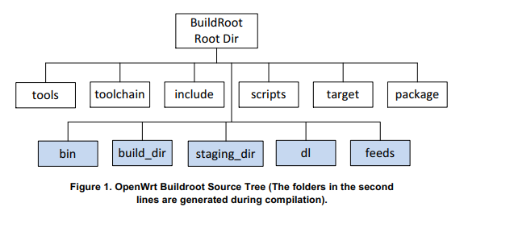
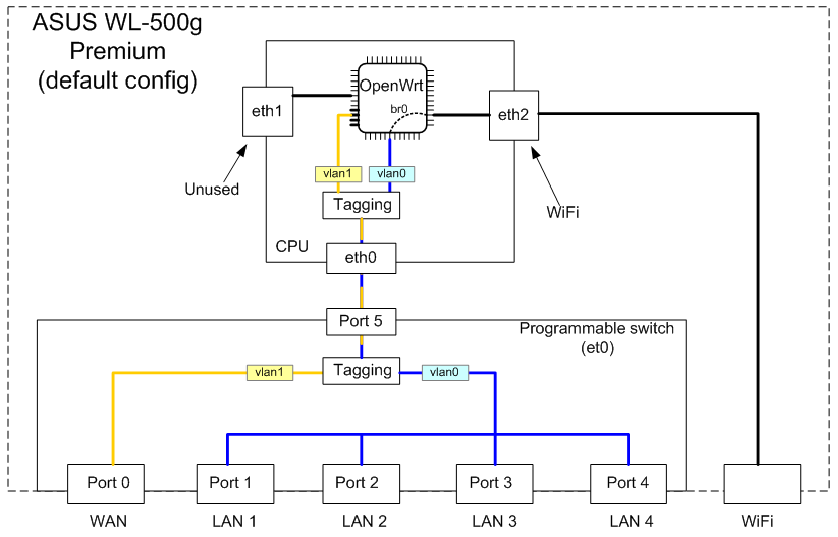
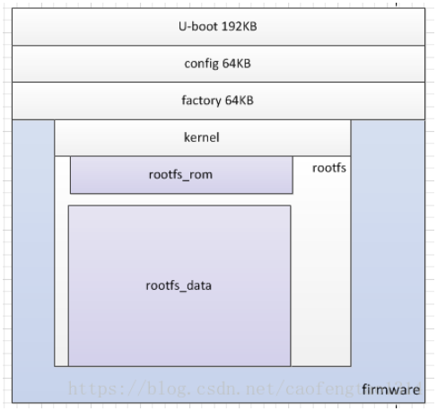

### 基础知识点

#### 1.openwrt环境搭建

```shell
第一步：安装基础软件
sudo apt-get install subversion g++ zlib1g-dev build-essential git python rsync man-db
sudo apt-get install libncurses5-dev gawk gettext unzip file libssl-dev wget zip time
 
第二步：克隆代码
git clone https://git.openwrt.org/openwrt/openwrt.git/
或者分支  https://github.com/lede-project/source.git

cd openwrt
./scripts/feeds update -a    // 更新最新的包
./scripts/feeds install -a   // 下载所有安装所有包  目录 package/feeds/
# 使用feeds.conf.default 默认配置进行软件包的更新与安装

make menuconfig              // 打开编译菜单
	Target System - 表示目标机器CPU型号
	Subtarget        - 表示子目标
	Target Profile - 表示目标机器设备型号
	
第四步：编译
make V=99    // V = verbose 全部都显示

参考文档:
环境搭建
https://blog.csdn.net/chenpu5887/article/details/100627295
https://www.cnblogs.com/yizhizaiYI/articles/5220008.html

OpenWrt编译扩展机制feeds
https://blog.csdn.net/hzlarm/article/details/102922103
```

#### 2.openwrt编译流程

#####     2.1 编译流程

```
系统编译流程如下：
1. 下载交叉编译工具，内核头文件，C库等。
2. 设置 staging_dir 目录，交叉编译的toolchain会安装到这里。
3. 创建 dl 目录， 所有的第三方源码包会被下载到这里
4. 创建build_dir目录， 用户态工具会被编译到这里
5. 创建 build_dir/target-arch/root 和 目标平台根文件系统
6. 在根文件系统中安装所有包，最后生成的镜象会在bin/目录中

参考文档:
opeenwrt的编译流程
https://www.cnblogs.com/Malphite/p/9037095.html
```

##### 	2.2 编译及烧写

```shell
#编译uboot(需要单独下载)、编译内核、编译根文件系统(下载完openwrt的源码后，openwrt会根据配置去下载相应的软件包，包括内核，然后制作根文件系统)-->将内核与根文件系统进行打包成一个镜像

####################################编译整个系统###########################################
#配置安装包
make menuconfig
#编译，编译出来的结果为设备树、内核、根文件系统为一个文件
make

#烧写系统(内核与文件系统一块烧写)
mtd erase firmware //擦除该问去
mtd -r write openwrt-ramips-mt7628-mt7628-squashfs-sysupgrade.bin  firmware

###################################单独编译uboot###########################################
make package/boot/uboot-mt7628 compile 
#进入到package/boot/uboot-mt7628，执行make menuconfig可进行配置uboot
#烧写uboot
    mtd write openwrt-ramips-mt7628-sxx-u-boot.bin u-boot
	#备注:必须在dts文件中打开uboot分区可写的操作
    partition@0 {
        label = "u-boot";
        reg = <0x0 0x30000>;
    //  read-only; //注释掉该语句,否则不能进行烧录
    };

    
#单独配置内核
make kernel_menuconfig

#单独编译内核
make target/linux compile

mtd -r write openwrt-ramips-mt7628-uImage.bin  kernel //单独烧写内核，目前不能
mtd -r write openwrt-ramips-mt7628-root.squashfs  rootfs //单独烧写根文件系统

#编译sdk,以供其他开发应用程序的人员开发
[*] Build the OpenWrt SDK //选中编译这个 
[ ] Package the OpenWrt-based Toolchain //这个只有基本的工具链,会缺少一些头文件和库文件

#注意:不能选择只编译基本的工具链，编译出来的包里面会缺少库文件和头文件，因此需要选中编译sdk，sdk中会包含库文件和头文件

参考文档:
https://blog.csdn.net/chenpu5887/article/details/100627296
```

#####     2.3 源码目录介绍



```shell
白颜色框:源码中自带的目录
蓝颜色框:系统编译过程中生成

1. package（里面包含了在配置文件里设定好的所有编译好的软件包）
此目录主要存放OpenWrt的软件包，我们自己添加的应用层代码都应存放于此文件夹，代码包存放于此文件夹并编写相应的Makefile后，在编译过程中OpenWrt会自主识别并编译。package下的目录会根据配置的不同而不同，其中基本都是openwrt的一些应用工具包，比如utils就是一引起工具集，ls,ssh等工具的源码都在此目录下

2. target
target目录下主要是和平台有关的代码，最主要的是linux文件夹，可以看到每一个平台都对应一个文件夹，我们通过makemenuconfig来选择平台和芯片时就是对应的此文件夹，可以进去ramips看下，可以看到里面有多种芯片型号，此中的image是最终生成固件时会调用到的，在这里可以对我们的固件做部分定制，patches是一些补丁包。base-files中的目录和linux目录相对应，很多地方都有这个文件夹。

3. tools
此目录下是一些工具集，通过名字应该都可以看出其具体功能

4. docs
文档存放目录，和openwrt有关的一些文档

5. include
顶层通用makefile，其他makefile中包含的makefile都可以在其中找到

6. scripts
脚本工具，包括一些用shell,perl，python编写的通用工具

7. toolchain
工具链目录

8. dl
dl为源代码下载目录，在编译过程中下载的源代码包都会保存在此文件夹下

9. staging_dir
这是一个比较重要的目录，此目录保存工具、内核等所有代码的编译结果

host文件夹是和平台无关的一些生成物。
target-mipsel_24kec+dsp_uClibc-0.9.33.2是根据我们所选的平台和芯片产生的，其就是对应平台的编译结果。
toolchain-mipsel_24kec+dsp_gcc-4.8-linaro_uClibc-0.9.33.2是根据我们所选的平台生成的交叉编译工具链及库文件

10. build_dir
这是一个中间文件夹，所有代码都会拷到其中编译，代码在编译之前会拷贝一份到此目录中，为什么要拷贝呢？一个原因就是在-编译过程中OpenWrt可能会对其中一些代码和makefile作改动，这里是为了安全起见，对副本进行编译。

#总结
packge:存放了需要下载安装包的配置
dl:安装package中定义的规则，下载的安装包.(在删除dl下的目录文件时会重新下载)
build_dir/target-mipsel_24kec+dsp_uClibc-0.9.33.2：将dl中的目录进行解压到该目录下(在删除build_dir目录下的文件时会重新解压)
target:与平台相关的代码在该目录下（例如该目录下的dts文件target/linux/ramips/dts）

系统会根据package配置的软件包，将软件包下载到dl目录下，对dl目录下的软件放到build_dir目录下，最终文件放到staging_dir目录下，固件生成在bin目录下

```

##### 	2.4 单独编译软件包

```shell
单独编译软件包(可以参照下面单独编译uboot的过程)
make package/tcpdump/clean  清除编译生成的文件
make package/tcpdump/prepare 进行编译准备
make package/tcpdump/configure  根据设置选项进行配置并生成Makefile
make package/tcpdump/compile   根据生成的Makefile进行编译
make package/tcpdump/install  生成安装包

clean 命令
make clean      # rm -rf bin  build_dir
make dirclean  # rm -rf bin build_dir staging_dir toolchain logs 
make distclean # 删除以上所有文件 ， dl 和 .config
对于特定组件进行clean
make target/linux/clean V=s
make package/luci/clean

单独模块编译流程如下:
在 make 时，make 读取到 package/utils/lua/Makefile 文件内容。
如果git或svn源，那么就会在 tmp/dl/ 目录下将源代码 clone 下来。然后，将 clone 下来的源码删除 .git 或 .svn 目录删除，然后压缩成 lua-1.5.1.tar.gz 文件，并复制到 dl/ 目录下。
在编译前段，将 dl/ 目录下的 lua-1.5.1.tar.gz 文件解压到 build_dir/target-mips_<board>/ 目录下。
进入 build_dir/target-mips_<board>/lua-1.5.1/
./configure，make，make install。
make install 会将生成的二进制文件安装到 build_dir/target-mips_<board>/lua-1.5.1/ipkg-ar71xx/ 目录下。
最后将 build_dir/target-mips_<board>/lua-1.5.1/ipkg-ar71xx/ 打成包成lua-5.1.5-1_ar71xx.ipk，并复制到 bin/ar71xx/packages/base/
```

#### 3.openwrt启动流程

```shell
简要流程:
	/etc/preinit-->/sbin/init-->/sbin/procd/-->解析/etc/initab文件/-->执行/etc/init.d/目录下的脚本
	
参考文档:
//先介绍了大体流程
https://blog.csdn.net/chenpu5887/article/details/100627302
https://blog.csdn.net/qq_41453285/article/details/102545624
//详细介绍
https://blog.csdn.net/fengfeng0328/article/details/83352459
//脚本分析
https://blog.csdn.net/hui523hui523hui523/article/details/38372119
https://blog.csdn.net/u013162035/article/details/78707882
```


#### 4.openwrt基础组件

##### 	4.1 ubox库

```c
libubox库简介:
	libubox是openwrt的一个核心库，封装了一系列基础实用功能，主要提供事件循环，二进制格式处理，linux链表实现和一些JSON辅助处理。它的目的是以动态链接库方式来提供可重用的通用功能，给其他模块提供便利和避免再造轮子。

libubox主要提供三部分功能：
1）提供多种基础通用功能接口，包含链表，平衡二叉树，二进制处理，key-value链表，MD5等。
2）socket通信。
3）一套基于事件驱动的机制及任务队列管理功能

事件处理循环主框架:
//初始化事件循环
int uloop_init(void);
//事件循环主处理入口
void uloop_run(void);
//销毁事件循环
void uloop_done(void);

描述符事件:
//注册一个新描述符到事件处理循环
int uloop_fd_add(struct uloop_fd *sock, unsigned int flags);
//从事件处理循环中销毁指定描述符
int uloop_fd_delete(struct uloop_fd *sock);

定时器事件:
//注册一个新定时器
int uloop_timeout_add(struct uloop_timeout *timeout);
//设置定时器超时时间(毫秒).并添加
int uloop_timeout_set(struct uloop_timeout *timeout, int msecs);
//销毁指定定时器
int uloop_timeout_cancel(struct uloop_timeout *timeout);
//获取定时器还剩余多长时间超时
int uloop_timeout_remaining(struct uloop_timeout *timeout);

进程事件
//注册新进程到事件处理循环
int uloop_process_add(struct uloop_process *p);
//从事件处理循环中销毁指定进程
int uloop_process_delete(struct uloop_process *p);

struct uloop_fd
{
	uloop_fd_handler cb; //回调函数,调用者初始化
	int fd; //文件描述符,调用者初始化
	bool eof;
	bool error;
	bool registered; //是否已注册到uloop中,调用者初始化
	uint8_t flags;
};

struct uloop_timeout
{
	struct list_head list;
	bool pending;

	uloop_timeout_handler cb; //回调函数,调用者初始化
	struct timeval time; //时间参数,调用者初始化
};

struct uloop_process
{
	struct list_head list;
	bool pending;

	uloop_process_handler cb; //回调函数,调用者初始化
	pid_t pid;	//进程pid,调用者初始化
};

ubox的基本使用
https://www.cnblogs.com/embedded-linux/p/6791544.html

参考文档:openwrt,Lede深入学习笔记v2.0.pdf
```

```c
//代码示例:监听文件描述符的变化,在实际应用中可以监听网络、串口等文件描述符的变化
#include <stdio.h>
#include <stdlib.h>
#include <string.h>
#include <unistd.h>
#include <sys/types.h>          /* See NOTES */
#include <sys/stat.h>
#include <fcntl.h>
#include <sys/socket.h>
#include <netinet/in.h>
#include <arpa/inet.h>
#include <libubox/usock.h>
#include <libubox/uloop.h>
 
 /*
	文件描述符触发时间
 */
static void recv_string(struct uloop_fd *u, unsigned int events)
{
    char buf[1024] = {0};
    if (events & ULOOP_READ) {
        if ( recv(u->fd, buf, 1024, 0) > 0) {
            printf("recv_buf: %s\n", buf);
            send(u->fd, "helloworld from server", strlen("helloworld from server"), 0);
        }
    }
}
 
static void read_std(struct uloop_fd *u, unsigned int events)
{
    char buf[1024] = {0};
    if (events & ULOOP_READ) {
        if ( read(u->fd, buf, 1024) > 0) {
            printf("read_std: %s\n", buf);
        }
    }
}
 
int main()
{
    struct sockaddr_in cli_addr;
    socklen_t len = sizeof(struct sockaddr);
    int type = USOCK_TCP | USOCK_SERVER  | USOCK_NOCLOEXEC | USOCK_IPV4ONLY;
    const char *host = "192.168.19.1";
    const char *service = "8000";
    char recv_buf[1024] = {0};
	
	printf("uloop start..................\n");
	
    int connect_fd, u_fd = usock(type, host, service);

    if (u_fd < 0) {
        perror("usock");
        return -1;
    }
    
    connect_fd = accept(u_fd, (struct sockaddr *)(&cli_addr), &len);
    if (connect_fd < 0) {
        perror("accept");
        return -1;
    }
		
    struct uloop_fd fd[2] = {
        {
            .cb = recv_string,
            .fd = connect_fd,
            .registered = false,
            .flags = ULOOP_READ,
        },
        {
            .cb = read_std,
            .fd = STDIN_FILENO,
            .registered = false,
            .flags = ULOOP_READ,
        }
    };
	
    uloop_init();
	
    /*添加uloop_fd*/
    uloop_fd_add(&fd[0], ULOOP_READ);
    uloop_fd_add(&fd[1], ULOOP_READ);
	
    uloop_run();
 
	printf("uloop_run end\n");
	
    uloop_fd_delete(&fd[0]);
	uloop_fd_delete(&fd[1]);
	
    uloop_done();
    
    return 0;
}
```

```c
//代码示例:设置一个定时器，通过查看并非是开辟的线程来进行实现的
#include <stdio.h>
#include <stdlib.h>
#include <string.h>
#include <sys/types.h>          /* See NOTES */
#include <sys/socket.h>
#include <libubox/uloop.h>

void send_data(struct uloop_timeout *t);

struct uloop_timeout tm = {
        .cb = send_data, //编写回调函数
};

//该处传入的参数与tm为同一个参数
void send_data(struct uloop_timeout *t)
{
	printf("send_data.....................%p\n",t);
    /* 添加uloop_timeout 实现循环定时 */
    uloop_timeout_set(&tm, 5000);
}

int main()
{
	printf("main..........................%p\n",&tm);
    uloop_init();
	
    /*添加uloop_timeout,设置时间*/
    uloop_timeout_set(&tm, 5000);
	
	//此处一样可以运行,不用在单独创建线程去做，并且查看/proc里面也没有创建线程
	printf("run..........................\n");
    uloop_run();
	
    uloop_done();
	
    return 0;
}

```

```c
//代码示例:监听一个进程的退出，必须是创建的子进程,必须有父子进程关系
#include <stdio.h>
#include <stdlib.h>
#include <string.h>
#include <sys/types.h>          /* See NOTES */
#include <unistd.h>
#include <libubox/uloop.h>
 
//实际应用中,要将这两个参数组成一个结构体的形式
struct uloop_process *u_process = NULL;
pid_t g_pid;

void child_process(int t)
{
    printf(" child_process pid: %d is runing\n", getpid());
	
	//进程替换
	execl("/test.sh","test.sh");
}
 
 /*c: 代表推出的进程, ret:代表推出的状态*/
void process_exit(struct uloop_process *c, int ret)
{
    printf("child process exit id[%d], status[%#x]\n", c->pid, ret);
    
	uloop_process_delete(c);
	
	free(c);
	
	g_pid = fork();
	
	if (g_pid == 0) {//子进程
		child_process(2);
	}
	else {
		//用这种方式可以检测到一个进程退出了,然后在重新启动起来
		u_process = (struct uloop_process *)malloc(sizeof(struct uloop_process));
		
		u_process->pid = g_pid;
		u_process->cb = process_exit;
		u_process->pending = false;
		
		uloop_process_add(u_process);
	}
}

int main(int argc,char **argv)
{
    int i;
    pid_t pid;
	
    uloop_init();

	pid = fork();
	
	if (pid == 0) {//子进程
		child_process(2); //
	}
	else {
		u_process = (struct uloop_process *)malloc(sizeof(struct uloop_process));
		if (NULL == u_process) {
			perror("malloc");
			exit(-1);
		}
				
		u_process->pid = pid;
		u_process->cb = process_exit;
		u_process->pending = false;
		
		if (uloop_process_add(u_process) < 0) {
			printf("uloop_process_add failed...\n");
		}
	}
		
	printf("uloop_runing....\n");
    uloop_run();
    uloop_done();
    
    return 0;
}
```

```shell
#ubox中shell中json的用法
简介:
	jshn是openwrt提供的通过shell操作json的工具，来自软件包libubox(原始脚本路径:libubox-2015-11-08/sh/jshn.sh)
作用:
	在shell脚本中利用jshn.sh组装json数据和解析json数据
	
#脚本内容
#!/bin/sh

source /usr/share/libubox/jshn.sh

#test1:
json_init

json_add_string name zhaokun
json_add_int age 30

json_dump


#test2:
json_init

json_add_int x 12
json_add_string name zhaokun
json_add_object obj
json_add_int y 56
json_select ..
json_add_int z 99
json_select obj
json_add_string sex male
json_select ..
json_add_boolean age 0
json_add_double height 23.3
json_add_array array
json_add_object user
json_add_string name zhaokun
json_dump

#test3:
json_load '{ "name": "zhaokun", "age": 30,"obj":{"name":"ycl"} }'

json_dump

json_get_var NAME name

json_select obj

json_get_var xxx name

json_select ..

json_get_var AGE age

echo ${NAME}
echo ${xxx}
echo ${AGE}


#test4
json_load '{"array": [ { "name": "zhaokun","age":"30"  }] }'

json_dump

json_get_keys keys array

json_select array

for key in $keys;do
	json_select $key
	json_get_vars name age
	json_get_var xxxx name
	echo $key $name $age $xxxx
	json_select ..
	
done

#shell脚本输出内容:
root@ziroom:/# ./ubox_shell 
{ "name": "zhaokun", "age": 30 }
{ "x": 12, "name": "zhaokun", "obj": { "y": 56, "sex": "male" }, "z": 99, "age": false, "height": 23.3, "array": [ { "name": "zhaokun" } ] }
{ "name": "zhaokun", "age": 30, "obj": { "name": "ycl" } }
zhaokun
ycl
30
{ "array": [ { "name": "zhaokun", "age": "30" } ] }
1 zhaokun 30 zhaokun
```

```c
总结:
	libubox.so为其他应用程序提供了基础的工具,例如ubus即是基于此进行开发的
参考文档:
ubox的基本使用
https://www.cnblogs.com/embedded-linux/p/6791544.html
参考文档:openwrt,Lede深入学习笔记v2.0.pdf
```

##### 	4.2 uci

```shell
简介:
	1.源码目录可以在dl目录下找到，提供了uci的命令、c语言、lua脚本3种形式的接口
	2.模型层负责数据的持久化操作,openwrt的模型层采用统一配置接口,目的在于集中openwrt系统的配置
	3.uci可以看作openwrt系统中最重要系统设置的主要配置接口，通常情况下这些设置对设备的功能晕妆至关重要，例如网络接口的配置、dhcp和防火墙设置

uci配置文件格式:
	配置文件名称/config/option
	
#一、使用uci命令获取配置文件内容
#自定义一个文件:存在文件/etc/config/user,内容如下:
config system 'system'
        option timezone 'CST-8'
        option zonename 'Asia/Shanghai'
        option hostname 'zk'

config timeserver 'ntp'
        list server '0.openwrt.pool.ntp.org'
        list server '1.openwrt.pool.ntp.org'
        list server '2.openwrt.pool.ntp.org'
        list server '3.openwrt.pool.ntp.org'
        option enabled '1'
        option enable_server '0'

#显示user的配置		
root@ziroom:/# uci show user
user.system=system
user.system.timezone='CST-8'
user.system.zonename='Asia/Shanghai'
user.system.hostname='zk'
user.ntp=timeserver
user.ntp.server='0.openwrt.pool.ntp.org' '1.openwrt.pool.ntp.org' '2.openwrt.pool.ntp.org' '3.openwrt.pool.ntp.org'
user.ntp.enabled='1'
user.ntp.enable_server='0'

#(1)获取配置文件内容
#获取单个配置,当没有名称时,只能这样获取config system
uci get user.@system[0].hostname -->  config system (无节点名字)
#当有名称时,使用名称进行获取
uci get user.system.hostname --> config system 'system'(有节点名字)
 
#(2)设置配置文件内容
uci set user.system.hostname='zk'
uci commit

#注意:
	这样修改只是内存中修改了(可以使用uci show命令查看)，配置文件中还没有进行修改，必须使用uci commit命令进行提交，配置文件中才能进行修改
	
备注:
	1.uci默认读取的文件路劲为/etc/config下的所有文件,其他路径的文件不会进行读取
	2.uci配置还要进一步转换为各个应用程序所需要的配置(由于各个应用程序的配置文件各有各的不同，uci只是提供了统一的配置文件格式，一般是在/etc/init.d/xxx下将uci的配置文件转换成应用程序所需要的配置文件,并保存到相应的文件中)
	3.修改完uci的配置文件后，还要重启相应的服务(修改完只是静态的修改完成，但是程序并不清楚已经修改，所以要重新启动服务,例如/etc/init.d/network start)
	4.有些运行中的状态值没有保存在/etc/config 目录下，而是保存在/var/state 下，可以直接使用命令cat /var/state查看

#二、通过shell脚本配置获取uci配置(提供了更加方便的获取配置信息)：

#测试1：
#!/bin/sh
#一定要加载该脚本，因为所用的函数，是该函数提供的
. /lib/functions.sh
config_load $1                                
config_get name system hostname                              
echo $name

root@ziroom:/# ./test.sh  user
zk

#测试2：
#!/bin/sh
. /lib/functions.sh

#表示将xxx_cb这3个函数初始化为没有任何操作。xxx_cb这3个函数必须在包含/lib/function.sh和config_load之间定义
reset_cb

#config_load解析配置文件时，解析到section时，就会回调config_cb
config_cb() {
        local type="$1"

        local name="$2"

#       echo "$name=$type"

        if [ -n "$type" ];then
                echo "$name=$type"
        fi
}

#config_load解析配置文件时，解析到option时，就会回调option_cb
option_cb() {
        local name="$1"
        local value="$2"
        echo $name=$value
}

#config_load解析配置文件时，解析到list时，就会回调list_cb
list_cb() {
        local name="$1"
        local value="$2"
        echo $name=$value
}

config_load $1

#测试3:该种方法通常用到/etc/init.d/xxx脚本中，用来获取uci的配置信息
#!/bin/sh
. /lib/functions.sh
reset_cb

handle_interface() {

local config="$1" #config=system
local custom="$2" #custom=hostname

echo "config="${config}
echo "custom"=${custom}

config_get name ${config} ${custom}

echo $name
#设置某一个值
config_set ${config} ${custom} ycl

}
config_load $1
config_foreach handle_interface system $2

#config_foreach会遍历以$1指定的配置文件中所有的section,一旦其类型与参数system相等时，则会回调handle_interface，在 config_foreach 函数内部，会以当前正在解析的section的ID 和调用config_foreach时的第3个参数作为调用 handle_interface 的参数

root@ziroom:/# ./test.sh  user hostname

参考文档:
	智能路由器开发指南.pdf
	openwrt,Lede深入学习笔记v2.0.pdf
```

##### 	4.3 ubusd进程

```shell
简介:
	ubus是openwrt提供的一种系统总线，作用是提供系统级的进程间通信功能。由3部分组成:后台进程、接口库、和实用工具

功能:
	(1)后台进程ubusd:提供了一个总线层，在系统启动时运行，负责进程间的消息路由和传递
	(2)接口库:libubus.so，其他进程可以通过该动态库来简化对ubus总线的访问
	(3)实用工具:命令行的接口调用工具

备注:
	ubus再进行数据传输时是使用了json的格式，因此在传输数据时必须将数据转换为json数据才能进行传输

ubus进行了3种进程间通信的方式:

#第1种方式-远程过程调用
invoke方式:实际是PRC-远程过程调用，一个应用程序调用另外一个程序的方法ubus将消息处理抽象为对象(object)和方法(method)的概念，一个对象中包含多个方法，对象和方法都有自己的名字，发送请求方咋消息中指定要调用的对象和方法名字即可

(1)使用ubus list查看都注册了哪些对象
root@ziroom:~# ubus list
dhcp
log
network
network.device
network.interface
network.interface.lan
network.interface.loopback
network.interface.wan
network.interface.wan6
network.wireless
scan_prog
service
session
system
uci

(2)使用ubus list 对象查看某个对象具体注册了什么方法
root@ziroom:~# ubus list scan_prog -v
'scan_prog' @7df589cf
        "scan":{"chnID":"Integer","chnName":"String"}

(3)调用scan_prog对象的scan方法
ubus call scan_prog scan '{"chnID":"1","chnName":"zhaokun"}'

#测试示例:查看注册了哪些接口
ubus list

root@ziroom:/# ubus list system -v
'system' @f3dc1e9d
        "board":{}
        "info":{}
        "upgrade":{}
        "watchdog":{"frequency":"Integer","timeout":"Integer","stop":"Boolean"}
        "signal":{"pid":"Integer","signum":"Integer"}
        "nandupgrade":{"path":"String"}
		

调用接口函数:格式为ubus call 对象 函数 数据(json格式的数据)
ubus call
 
root@ziroom:/# ubus call system board {}
{
        "kernel": "3.18.29",
        "hostname": "ziroom",
        "system": "MediaTek MT7628AN ver:1 eco:2",
        "model": "Mediatek MT7628AN evaluation board",
        "release": {
                "distribution": "OpenWrt",
                "version": "Chaos Calmer",
                "revision": "unknown",
                "codename": "chaos_calmer",
                "target": "ramips\/mt7628",
                "description": "OpenWrt Chaos Calmer 15.05.1"
        }
}

核心点:
	服务端:注册对象和方法
	客户端:请求相对应的对象、方法、发送数据、接收数据的回调函数

#第2种方式:消息订阅发布模式
订阅方式:订阅端订阅事件时，必须发送端存活才可以，使用该函数ubus_lookup_id要查找发布者的id

#第3方式:事件监听
事件通知方式(监听者和发送者可以没有关系，二者是独立存在的),在event机制中，发送方不需要知道谁要接收这个消息，实际就是一个广播消息

监听某个事件
ubus listen add_device

发送某个事件，
ubus send add_device '{"name":"zhaokun"}'

核心点:
监听者：要设置监听的主题和监听主题后的回调函数
发送者: 要设置监听主题和数据

参考文档:
ubus三种通信方式的示例
https://blog.csdn.net/jasonchen_gbd/article/details/46055885
```

```c
//第一种方式-远程过程调用

//server端代码
#include <libubox/uloop.h>
#include <libubox/ustream.h>
#include <libubox/utils.h>
#include <libubus.h>
#include <libubox/blobmsg_json.h>

/*
//ubus上下文
struct ubus_context {
	struct list_head requests;
	struct avl_tree objects;
	struct list_head pending;

	struct uloop_fd sock;
	struct uloop_timeout pending_timer;

	uint32_t local_id;
	uint16_t request_seq;
	int stack_depth;

	void (*connection_lost)(struct ubus_context *ctx);

	struct ubus_msghdr_buf msgbuf;
	uint32_t msgbuf_data_len;
	int msgbuf_reduction_counter;
};
*/
struct prog_attr {
	char name[64];
	int chn_id;
};

#define PROG_MAX	8

static struct ubus_context * ctx = NULL;
static struct blob_buf b;
static const char * sock_path;
 
enum
{
	SCAN_CHNID,
	SCAN_POLICY_MAX,
};

//核心3:当ubus list时显示方法的使用方式，格式为key及value的类型
static const struct blobmsg_policy scan_policy[2] = {
	[SCAN_CHNID] = {.name = "chnID", .type = BLOBMSG_TYPE_INT32},
	[SCAN_POLICY_MAX] = {.name = "chnName", .type = BLOBMSG_TYPE_STRING}
};

static int ubus_start_hello(struct ubus_context *ctx, struct ubus_object *obj,
		      struct ubus_request_data *req, const char *method,
		      struct blob_attr *msg)
{
	void * json_uri = NULL;
	void * json_list = NULL;
	int idx = 0;
	
	//1.获取发送的数据
	#if 1
		char *pData = NULL;
		//获取了客户端传递过来的数据
		pData = blobmsg_format_json(msg, true);
		
		printf("%s\n",pData);
	
	#endif
	
	//2.回复数据
	blob_buf_init(&b, 0);
	
	blobmsg_add_string(&b, "name", "zhaokun");
	blobmsg_add_u32(&b, "age", 30);
	
	//组装list数据
	json_uri = blobmsg_open_array(&b, "prog_list");
	for (idx = 0; idx < 2; idx++)
	{
		json_list = blobmsg_open_table(&b, NULL);
		blobmsg_add_string(&b, "sex", "male");
		blobmsg_add_u32(&b, "channel", idx);
		blobmsg_close_table(&b, json_list);
	}
	blobmsg_close_array(&b, json_uri);
	
	ubus_send_reply(ctx, req, b.head); //回复数据

	return 0;
}

/* 方法列表 */
static struct ubus_method scan_methods[] = 
{
	UBUS_METHOD("hello", ubus_start_hello, scan_policy), //自定义函数方法
};
 
/* type目前没有实际用处 */
static struct ubus_object_type scan_obj_type
= UBUS_OBJECT_TYPE("scan_prog", scan_methods);
 
static struct ubus_object scan_obj = 
{
	.name = "scan_prog", //核心1:对外提供的对象的名字
	.type = &scan_obj_type,
	.methods = scan_methods, //核心2:对外提供的对象的方法
	.n_methods = ARRAY_SIZE(scan_methods),
};
 
static void ubus_add_fd(void)
{
	ubus_add_uloop(ctx);
 
#ifdef FD_CLOEXEC
	fcntl(ctx->sock.fd, F_SETFD,fcntl(ctx->sock.fd, F_GETFD) | FD_CLOEXEC);
#endif
}
 
static void ubus_reconn_timer(struct uloop_timeout *timeout)
{
	static struct uloop_timeout retry =
	{
		.cb = ubus_reconn_timer,
	};
	int t = 2;
 
	if (ubus_reconnect(ctx, sock_path) != 0) {
		uloop_timeout_set(&retry, t * 1000);
		return;
	}
 
	ubus_add_fd();
}
 
static void ubus_connection_lost(struct ubus_context *ctx)
{
	ubus_reconn_timer(NULL);
}
 
static int display_ubus_init(const char *path)
{
	//1.uloop初始化
	uloop_init();
	
	sock_path = path;
 
	//2. ubus连接
	ctx = ubus_connect(path);
	if (!ctx)
	{
		printf("ubus connect failed\n");
		return -1;
	}
	
	printf("connected as %08x\n", ctx->local_id);
	
	//3.设置ubusd断开回调函数
	ctx->connection_lost = ubus_connection_lost;
 
	//4.添加描述符
	ubus_add_fd();
 
	//5.向ubusd注册对象和方法，供其他ubus客户端调用
	if (ubus_add_object(ctx, &scan_obj) != 0)
	{
		printf("ubus add obj failed\n");
		return -1;
	}
 
	return 0;
}
 
static void display_ubus_done(void)
{
	if (ctx)
		ubus_free(ctx);
}
 
int main(int argc, char * argv[])
{
	char * path = NULL;
	
	if (-1 == display_ubus_init(path))
	{
		printf("ubus connect failed!\n");
		return -1;
	}
 
	uloop_run();
 
	display_ubus_done();
 
	return 0;
}

//client代码
#include <libubox/uloop.h>
#include <libubox/ustream.h>
#include <libubox/utils.h>
#include <libubus.h>
#include <libubox/blobmsg_json.h>

static struct ubus_context * ctx = NULL;
static struct blob_buf b;
static const char * cli_path;
  
static int timeout = 30;
static bool simple_output = false;
 
static void scanreq_prog_cb(struct ubus_request *req, int type, struct blob_attr *msg)
{	
	char *pData = NULL;
	//获取了客户端传递过来的数据
	pData = blobmsg_format_json(msg, true);
	
	printf("%s\n",pData);
}
 
static int client_ubus_call()
{
	unsigned int id;
	int ret;
 
	blob_buf_init(&b, 0);
 
	/* 需要传递的参数 */
	blobmsg_add_u32(&b, "chnID", 0);
	blobmsg_add_string(&b, "chnName", "ycl");
 
	/*
	向ubusd查询是否存在"scan_prog"这个对象，
	如果存在，返回其id
	*/
	ret = ubus_lookup_id(ctx, "scan_prog", &id);
	if (ret != UBUS_STATUS_OK) {
		printf("lookup scan_prog failed\n");
		return ret;
	}
	else {
		printf("lookup scan_prog successs\n");
	}
	
	/* 调用"scan_prog"对象的"scan"方法 */
	return ubus_invoke(ctx, id, "hello", b.head, scanreq_prog_cb, NULL, timeout * 1000);
}
 
/*
ubus_invoke()的声明如下:
int ubus_invoke(struct ubus_context *ctx, uint32_t obj, const char *method,
                struct blob_attr *msg, ubus_data_handler_t cb, void *priv, int timeout);
                
其中cb参数是消息回调函数，其函数类型定义为:
typedef void (*ubus_data_handler_t)(struct ubus_request *req,
				    int type, struct blob_attr *msg);
参数type是请求消息的类型，如UBUS_MSG_INVOKE，UBUS_MSG_DATA等。
参数msg存放从服务端得到的回复消息，struct blob_attr类型，同样用blobmsg_parse()来解析。
参数req保存了请求方的消息属性，其中req->priv即ubus_invoke()中的priv参数，
用这个参数可以零活的传递一些额外的数据。
*/
static int client_ubus_init(const char *path)
{
	uloop_init();
	cli_path = path;
 
	ctx = ubus_connect(path);
	if (!ctx)
	{
		printf("ubus connect failed\n");
		return -1;
	}
	
	printf("connected as %08x\n", ctx->local_id);
 
	return 0;
}
 
static void client_ubus_done(void)
{
	if (ctx)
		ubus_free(ctx);
}
 
int main(int argc, char * argv[])
{
	/* ubusd创建的unix socket，默认值为"/var/run/ubus.sock" */
	char * path = NULL;
 
	/* 连接ubusd */
	if (UBUS_STATUS_OK != client_ubus_init(path))
	{
		printf("ubus connect failed!\n");
		return -1;
	}
 
	/* 调用某个ubus方法并处理返回结果 */
	client_ubus_call();
 
	client_ubus_done();
 
	return 0;
}
```

```c
//第二种方式:订阅发布模式
//server端代码
#include <unistd.h>
#include <libubox/blobmsg_json.h>
#include <libubox/uloop.h>
#include <libubus.h>
 
static struct ubus_context *ctx;
 
static void test_client_subscribe_cb(struct ubus_context *ctx, struct ubus_object *obj)
{
	fprintf(stderr, "Subscribers active: %d\n", obj->has_subscribers);
}
 
/* 这个空的method列表，只是为了让object有个名字，这样client可以通过object name来订阅。 */
static struct ubus_method test_methods[] = {};
 
static struct ubus_object_type test_obj_type = 
	UBUS_OBJECT_TYPE("test", test_methods);
 
static struct ubus_object test_object = {
	.name = "test", /* object的名字 */
	.type = &test_obj_type,
	.subscribe_cb = test_client_subscribe_cb,
};
 
static void notifier_main(void)
{
	int ret;
 
	/* 注册一个object，client可以订阅这个object */
	ret = ubus_add_object(ctx, &test_object);
	if (ret) {
		fprintf(stderr, "Failed to add object: %s\n", ubus_strerror(ret));
		return;
	}
 
	/* 在需要的时候，向所有客户端发送notify消息 */
	
	/* step1: 如果需要传递参数，则保存到struct blob_attr类型的结构体中。 */
 
	/* 
	int ubus_notify(struct ubus_context *ctx, struct ubus_object *obj, const char *type, struct blob_attr *msg, int timeout);
	type是一个字符串，自定义的。msg是需要携带的参数。如果需要等待回复，timeout需设置为>=0。
	*/
//	while (1) {
		sleep(5);
		printf("notify send..............\n");
		/* step2: 广播notification消息。 */
		ubus_notify(ctx,  &test_object, "say Hi!", NULL, -1);
//	}
}
 
int main(int argc, char **argv)
{
	const char *ubus_socket = NULL;
 
	uloop_init();
 
	ctx = ubus_connect(ubus_socket);
	if (!ctx) {
		fprintf(stderr, "Failed to connect to ubus\n");
		return -1;
	}
 
	ubus_add_uloop(ctx);
 
	notifier_main();
	
	uloop_run();
 
	ubus_free(ctx);
	uloop_done();
 
	return 0;
}

//clint端代码
#include <unistd.h>
#include <libubox/blobmsg_json.h>
#include <libubox/uloop.h>
#include <libubus.h>
 
static struct ubus_context *ctx;
 
static int counter = 0;
static uint32_t obj_id;
static struct ubus_subscriber test_event;
 
static int test_notify(struct ubus_context *ctx, struct ubus_object *obj,
			      struct ubus_request_data *req,
			      const char *method, struct blob_attr *msg)
{
	printf("notify handler...\n");
	counter++;
	if (counter > 3)
		ubus_unsubscribe(ctx, &test_event, obj_id); /* 取消订阅 */
	return 0;
}
 
static void test_handle_remove(struct ubus_context *ctx,
				      struct ubus_subscriber *obj, uint32_t id)
{
	printf("remove handler...\n");
}
 
static void subscriber_main(void)
{
	int ret;
	
	/* 通知到来时的处理函数。 */
	test_event.cb = test_notify;
	test_event.remove_cb = test_handle_remove; //server主动发起删除该client的订阅的cb函数（如server退出的时候）
 
	/* 注册test_event */
	ret = ubus_register_subscriber(ctx, &test_event);
	if (ret)
		fprintf(stderr, "Failed to add watch handler: %s\n", ubus_strerror(ret));
    
	/* 得到要订阅的object的id */
	ret = ubus_lookup_id(ctx, "test", &obj_id);
	if (ret)
		fprintf(stderr, "Failed to lookup object: %s\n", ubus_strerror(ret));
 
	/* 订阅object */
	ret = ubus_subscribe(ctx, &test_event, obj_id);
	if (ret)
		fprintf(stderr, "Failed to subscribe: %s\n", ubus_strerror(ret));
}
 
int main(int argc, char **argv)
{
	const char *ubus_socket = NULL;
 
	uloop_init();
 
	ctx = ubus_connect(ubus_socket);
	if (!ctx) {
		fprintf(stderr, "Failed to connect to ubus\n");
		return -1;
	}
 
	ubus_add_uloop(ctx);
 
	subscriber_main();
	
	uloop_run();
 
	ubus_free(ctx);
	uloop_done();
 
	return 0;
}
```

```c
//第三种方式:事件广播方式
//server端代码

#include <libubox/uloop.h>
#include <libubox/ustream.h>
#include <libubox/utils.h>
#include <libubus.h>
#include <libubox/blobmsg_json.h>
 
static struct ubus_context * ctx = NULL;
static struct blob_buf b;
static const char * sock_path;
 
static int server_ubus_send_event(void)
{
	blob_buf_init(&b, 0);
 
	/* 需要传递的参数 */
	#if 0
	blobmsg_add_u32(&b, "major", 3);
	blobmsg_add_u32(&b, "minor", 56);
	blobmsg_add_string(&b, "name", "mmc01");
	#endif
	
	const char * str = "{\"name\":\"zhaokun\"}";
	//将字符串转换为blob_buf类型
	blobmsg_add_json_from_string(&b, str);
	
	/*
		int ubus_send_event(struct ubus_context *ctx, const char *id,struct blob_attr *data);
	*/
	//核心1:发送主题+消息  广播名为"add_device"的事件
	return ubus_send_event(ctx, "add_device", b.head);
}
 
static int display_ubus_init(const char *path)
{
	uloop_init();
	sock_path = path;
 
	ctx = ubus_connect(path);
	if (!ctx)
	{
		printf("ubus connect failed\n");
		return -1;
	}
	
	printf("connected as %08x\n", ctx->local_id);
 
	return 0;
}
 
static void display_ubus_done(void)
{
	if (ctx)
		ubus_free(ctx);
}
 
int main(int argc, char * argv[])
{
	char * path = NULL;
	
	if (-1 == display_ubus_init(path))
	{
		printf("ubus connect failed!\n");
		return -1;
	}
 
	server_ubus_send_event();
 
	display_ubus_done();
 
	return 0;
}

//client端代码
#include <libubox/uloop.h>
#include <libubox/ustream.h>
#include <libubox/utils.h>
#include <libubus.h>
#include <libubox/blobmsg_json.h>
#include <unistd.h>
#include <fcntl.h>

/*
//ubus上下文对象
struct ubus_context {
	struct list_head requests;
	struct avl_tree objects;
	struct list_head pending;

	struct uloop_fd sock;
	struct uloop_timeout pending_timer;

	uint32_t local_id;
	uint16_t request_seq;
	int stack_depth;

	void (*connection_lost)(struct ubus_context *ctx);

	struct ubus_msghdr_buf msgbuf;
	uint32_t msgbuf_data_len;
	int msgbuf_reduction_counter;
};
*/ 
static struct ubus_context * ctx = NULL;
static const char * cli_path;
/*
//ubus事件处理函数
struct ubus_event_handler {
	struct ubus_object obj;

	ubus_event_handler_t cb;
};
*/
static struct ubus_event_handler listener;
 
#define	UBUS_EVENT_ADD_DEVICE	"add_device"
#define	UBUS_EVENT_REMOVE_DEVICE	"rm_device"
 
static void ubus_probe_device_event(struct ubus_context *ctx, struct ubus_event_handler *ev,
			  const char *type, struct blob_attr *msg)
{
	char *str;
 
	//消息类型
	printf("type = %s\n",type); //主题
	
	//用于blobmsg_json用于json对象的序列化
	str = blobmsg_format_json(msg, true);

	printf("str = %s\n",str); //消息内容
	
	free(str);
	str = NULL;
}
 
static int client_ubus_register_events()
{	
	int ret = 0;
 
	/* 注册特定event的listener。多个event可以使用同一个listener */
	memset(&listener, 0, sizeof(listener));
	//绑定事件处理函数
	listener.cb = ubus_probe_device_event; //核心1:设置监听的回调函数
	
	/*
	int ubus_register_event_handler(struct ubus_context *ctx,
				struct ubus_event_handler *ev,
				const char *pattern);
	*/
	//核心2:注册监听器和主题
	ret = ubus_register_event_handler(ctx, &listener, UBUS_EVENT_ADD_DEVICE);
	if (ret)
	{
		fprintf(stderr, "register event failed.\n");
		return -1;
	}
 
	ret = ubus_register_event_handler(ctx, &listener, UBUS_EVENT_REMOVE_DEVICE);
	if (ret)
	{
		ubus_unregister_event_handler(ctx, &listener);
		fprintf(stderr, "register event failed.\n");
		return -1;
	}
 
	return 0;
}
 
static void ubus_add_fd(void)
{
	/*
		原型:static inline void ubus_add_uloop(struct ubus_context *ctx)
		作用:把创建的ubus连接到注册的epoll中
	*/
	ubus_add_uloop(ctx);
 
#if 0
	printf("use FD_CLOEXEC\n");
	fcntl(ctx->sock.fd, F_SETFD,fcntl(ctx->sock.fd, F_GETFD) | FD_CLOEXEC);
#else
	printf("don'use FD_CLOEXEC\n");
#endif
}
 
static void ubus_reconn_timer(struct uloop_timeout *timeout)
{
	/*
		struct uloop_timeout
		{
			struct list_head list;
			bool pending;

			uloop_timeout_handler cb;
			struct timeval time;
		};
	*/
	static struct uloop_timeout retry =
	{
		.cb = ubus_reconn_timer,
	};
	int t = 2;
 
	if (ubus_reconnect(ctx, cli_path) != 0) {
		printf("reconnect start\n");
		uloop_timeout_set(&retry, t * 1000);
		return;
	}
 
	printf("reconnect end\n");
	ubus_add_fd();
	{
		ubus_unregister_event_handler(ctx, &listener);
		ubus_register_event_handler(ctx, &listener, UBUS_EVENT_ADD_DEVICE);
		ubus_register_event_handler(ctx, &listener, UBUS_EVENT_REMOVE_DEVICE);
	}
}
 
static void ubus_connection_lost(struct ubus_context *ctx)
{
	ubus_reconn_timer(NULL);
}
 
static int client_ubus_init(const char *path)
{
	/*
		原型:int uloop_init(void);
		作用:创建epoll句柄,最多监听32个fd
	*/
	uloop_init();
	
	cli_path = path;
	
	/*
		原型:struct ubus_context *ubus_connect(const char *path);
		作用:创建ubus连接
	*/
	ctx = ubus_connect(path);
	if(!path)
	{
		printf("path = %s\n",path);
	}
	
	if(!ctx)
	{
		printf("ubus connect failed\n");
		return -1;
	}
	
	printf("connected as %08x\n", ctx->local_id);
	
	//设置连接断开的回调函数
	ctx->connection_lost = ubus_connection_lost;
 
	ubus_add_fd();
 
	return 0;
}
 
static void client_ubus_done(void)
{
	if (ctx) {
		//关闭ubus连接
		ubus_free(ctx);
		uloop_done();
	}
		
}
 
int main(int argc, char * argv[])
{
	char * path = NULL;
 
	/* 连接ubusd */
	if (UBUS_STATUS_OK != client_ubus_init(path))
	{
		printf("ubus connect failed!\n");
		return -1;
	}
 
	/* 注册某个事件的处理函数 */
	client_ubus_register_events();
 
	//等待I/O事件发生,调用相对应的对象的功能函数
	uloop_run();
	
	client_ubus_done();
 
	return 0;
}

```

##### 	4.4. procd进程

```shell
简介：
	procd进程为openwrt中最开始的父进程
作用:
procd的进程管理功能主要包含3个部分:
    a. reload_config
    b. procd守护进程
    c. procd.sh 提供函数封装procd提供系统总线方法,方便调用者使用

(1)reload_config脚本的使用:
原理:
	/var/run/config.md5文件保存了之前的文件的md5值和需要检测的文件
	/var/run/config.check/* 目录保存了对/ect/config/下文件经过一定处理的文件-新文件，然后用md5sum -c命令进行对比

作用:
    //实际为一个脚本
    reload_config 要对比前后文件的md5值,不同的话调用ubus call命令-->procd-->/etc/ini.d/xxx reload

    运行流程:修改/etc/config/目录下的配置文件 --> reload_config --> procd --> /etc/ini.d/xxx reload

    //使用md5sum -c命令检测一个文件中的所有文件的md5值是否正确
    //检测正确返回值
    root@ziroom:/# md5sum -c config.md5 
    /sbin/mtd: OK

    //检测错误返回值
    root@ziroom:/# vim config.md5 
    root@ziroom:/# md5sum -c config.md5 
    /sbin/mtd: FAILED
    md5sum: WARNING: 1 of 1 computed checksums did NOT match

    //文件中的内容:认为的md5值   需要检测的文件
    root@ziroom:/# cat config.md5 
    da5d042ae613204f355147f4a45ae554  /sbin/mtd

(2)procd进程

procd提供了2个对象，service和system，使用了ubus接口

//service对象提供的方法
root@ziroom:/# ubus list service -v
'service' @574c9713
        "set":{"name":"String","script":"String","instances":"Table","triggers":"Array","validate":"Array"}
        "add":{"name":"String","script":"String","instances":"Table","triggers":"Array","validate":"Array"}
        "list":{"name":"String","verbose":"Boolean"}
        "delete":{"name":"String","instance":"String"}
        "update_start":{"name":"String"}
        "update_complete":{"name":"String"}
        "event":{"type":"String","data":"Table"}
        "validate":{"package":"String","type":"String","service":"String"}
        "get_data":{"name":"String","instance":"String","type":"String"}
		
//system对象提供的方法
root@ziroom:/# ubus list system -v
'system' @1aa01bbc
        "board":{}
        "info":{}
        "upgrade":{}
        "watchdog":{"frequency":"Integer","timeout":"Integer","stop":"Boolean"}
        "signal":{"pid":"Integer","signum":"Integer"}
        "nandupgrade":{"path":"String"}
		

//查看哪些实例(进程)交给procd守护进程管理
ubus call service list {}
{
        "cron": {

        },
        "dnsmasq": {
                "instances": {
                        "instance1": {
                                "running": true,
                                "pid": 1490,
                                "command": [
                                        "\/usr\/sbin\/dnsmasq",
                                        "-C",
                                        "\/var\/etc\/dnsmasq.conf",
                                        "-k",
                                        "-x",
                                        "\/var\/run\/dnsmasq\/dnsmasq.pid"
                                ],
                                "respawn": {
                                        "threshold": 3600,
                                        "timeout": 5,
                                        "retry": 5
                                }
                        }
                }
        }
....		
}

(3)procd.sh脚本
文件:/etc/init.d/hello - 一个脚本
文件:/bin/hello		   - 一个应用程序

#不使用procd管理脚本内容
#!/bin/sh /etc/rc.common

START=50
STOP=10
                   
start() {                 
        echo "start hello"
        /bin/hello &
}
        
stop() {                 
        echo "stop hello"
        killall -9 hello
}

start: 脚本调用start函数调用
stop: 脚本调用stop函数调用

//列出service中管理多少实例,调用service里面提供的方法
ubus call service list {}

//添加实例
ubus call service add '{"name":"hello", "script":"/etc/init.d/hello", "instances":{"instance1":{ "command":["/bin/hello","-f","-c","bjbook.net"], "respawn":[ ] } }, "triggers": [ ["config.change", ["if", ["eq","package", "hello" ], ["run_script", "/ect/init.d/hello", "reload" ] ] ] ] }'

第1个参数为被管理的服务进程名称；
第2个参数为启动脚本绝对路径；
第3个参数为进程实例信息，例如可执行程序路径和进程的启动参数等；
第4个参数为触发器；
第5个参数为配置验证项。
前3个参数是必须要传递的，后面两个参数可选

//列出实例的详细信息
ubus call service list '{"name":"hello","verbose":true}'
//删除实例
ubus call service delete '{"name":"hello"}'
//手动调用配置文件发生变化-会通知到procd,然后调用triggers里面的内容
ubus call service event '{"type":"config.change","data":{"package":"hello"}}'
//实际调用
reload_config

使用该种方式管理进程非常的麻烦,因此有了以下简化的方法，使用/lib/functions/procd.sh

#使用procd管理脚本内容--->实际应用中最常用的功能，将一个应用程序设置为开机启动
#!/bin/sh /etc/rc.common
USE_PROCD=1
START=15
STOP=85
PROG=/bin/hello

start_service() {

        procd_open_instance
        procd_set_param command "$PROG" -f -w bjbook.net
        procd_set_param respawn
        procd_close_instance
}

stop_service() {
        echo "stop HelloRoute!"
}

reload_service()
{
        echo "reload"
        stop
        start
}

执行方式:
	/etc/init.d/hello start
	/etc/init.d/hello stop
	/etc/init.d/hello reload

上面2种方式不管执行哪一种都是通过上面的方式启动、停止、重新服务。原因是在最开始加载了/etc/rc.common脚本

#在源码中执行开机启动
只需要将可执行程序和脚本放到相应的位置即可，重新烧写系统时，系统开机启动会自动创建软连接

#在板子执行开机启动(由于是自己手动添加的，因此必须手动添加软连接)
//开机自动启动
/etc/init.d/he enable

执行完该命令后，会在/etc/rc.d/目录下生成软连接:
S15he -> ../init.d/he
K85he -> ../init.d/he

//取消开机自动启动
/etc/init.d/he disable
执行完该命令后，会在/etc/rc.d/目录下取消软连接:
```

##### 	4.5 netifd进程

```shell
简介:
	netifd（network interface daemon）是一个管理网络接口和路由功能的后台进程，是一个使用 C 语言编写的带有 RPC 能力的精灵进程，它和内核系统通信采用 Netlink 接口来操作，采用ubus总线来提供 RPC，这样比直接使用 Linux 内核的管理接口更方便/etc/init.d/network-网络的脚本，用于启动和停止netifd进程的脚本,实际应用过程中:修改配置文件，然后重启netifd的服务即可.netifd会很具不同协议调用/lib/netifd/proto/*下的脚本进行处理

涉及文件:
	netifd 、/etc/config/network /etc/config/wireless 、/lib/netifd/proto/*

功能:
netifd注册了3种对象，分别为 network、network.device和network.interface,这些对象中提供了各种函数，可以使用ubus call命令调用ubus call network.device status '{"name":"eth0"}'
network
network.device
network.interface
network.interface.lan
network.interface.loopback
network.interface.wan
network.interface.wan6
network.wireless //无线也是netid控制

//对上述ubus call进行再次封装成了shell脚本，

● /sbin/ifup：启动接口 接口名称为lan或者wan,需要从/etc/config/network中获取
● /sbin/ifdown：关闭接口。
● /sbin/devstatus：获取网卡设备状态。接口名称为ifconfig后的显示出的物理网卡
● /sbin/ifstatus：获取接口的状态。

  /sbin/wifi //脚本，里面实现是调用ubus call调用其提供的方法 wifi down/up -> wifi down执行完成后可以ifconfig命令查看ra0网卡已经没有了
//查看接口对象有哪些方法:
root@ziroom:/etc/config# ubus list network.interface.lan -v
'network.interface.lan' @461c6805
        "up":{}
        "down":{}
        "status":{}
        "prepare":{}
        "dump":{}
        "add_device":{"name":"String","link-ext":"Boolean"}
        "remove_device":{"name":"String","link-ext":"Boolean"}
        "notify_proto":{}
        "remove":{}
        "set_data":{}
		
ifstatus lan/wan
root@ziroom:/# ifstatus wan 相当于调用ubus call network.interface.lan status {}
{
        "up": false,
        "pending": true,
        "available": true,
        "autostart": true,
        "dynamic": false,
        "proto": "dhcp",
        "device": "eth0.2",
        "data": {

        }
}

ifup/ifdown lan/wan相当于调用ubus call network.interface.lan down {}

root@ziroom:/etc/config# ubus list network.device -v
'network.device' @ec9d8ca7
        "status":{"name":"String"}
        "set_alias":{"alias":"Array","device":"String"}
        "set_state":{"name":"String","defer":"Boolean"}
		
root@ziroom:/etc/config# devstatus eth0.1 //相当于调用ubus call network.device status '{"name":"eth0.1"}'
{
        "external": false,
        "present": true,
        "type": "VLAN",
        "up": true,
        "carrier": true,
        "mtu": 1500,
        "mtu6": 1500,
        "macaddr": "00:ca:02:01:00:01",
        "txqueuelen": 0,
        "ipv6": false,
        "promisc": false,
        "rpfilter": 0,
        "acceptlocal": false,
        "igmpversion": 0,
        "mldversion": 0,
        "neigh4reachabletime": 30000,
        "neigh6reachabletime": 30000,
        "dadtransmits": 1,
        "statistics": {
                "collisions": 0,
                "rx_frame_errors": 0,
                "tx_compressed": 0,
                "multicast": 45,
                "rx_length_errors": 0,
                "tx_dropped": 0,
                "rx_bytes": 7161,
                "rx_missed_errors": 0,
                "tx_errors": 0,
                "rx_compressed": 0,
                "rx_over_errors": 0,
                "tx_fifo_errors": 0,
                "rx_crc_errors": 0,
                "rx_packets": 50,
                "tx_heartbeat_errors": 0,
                "rx_dropped": 0,
                "tx_aborted_errors": 0,
                "tx_packets": 19,
                "rx_errors": 0,
                "tx_bytes": 1966,
                "tx_window_errors": 0,
                "rx_fifo_errors": 0,
                "tx_carrier_errors": 0
        }
}

总结:
	在实际应用中，如果关于网络的配置发生变化，即重新启动netifd脚本即可
	
参考文档:
netifd简介-里面有一些基本的定义
https://blog.csdn.net/jasonchen_gbd/article/details/74990247

netifd流程图:
https://blog.csdn.net/velanjun/article/details/82469255?utm_medium=distribute.pc_relevant.none-task-blog-BlogCommendFromMachineLearnPai2-1.channel_param&depth_1-utm_source=distribute.pc_relevant.none-task-blog-BlogCommendFromMachineLearnPai2-1.channel_param
```



```
soc芯片内部自带以太网交换功能和VLAN功能，带有5个10/100Mbps端口针对每个网络接口的配置都有一个类型为interface这样的section,每个interface要么直接指向一个以太网/wifi接口(eth0、wlan0)或者包括多个接口
ifname:指明了linux网络接口名称 - ifconfig -a命令能够显示出所有的接口
```

#### 5. openwrt的常用软件配置

```shell
openwrt中的配置文件分为2类:遵循uci配置的文件与非遵循uci配置的文件

#常用的uci配置:
    /etc/config/dhcp Dnsmasq 软件包配置，包含 DHCP 和 DNS 设置
    /etc/config/dropbear SSH 服务器选项
    /etc/config/firewall 防火墙配置，包含网络地址转换、包过滤和端口转发等
    /etc/config/network 网络配置，包含桥接、接口和路由配置
    /etc/config/system 系统设置，包含主机名称，网络时间同步等
    /etc/config/timeserver rdate 的时间服务列表
    /etc/config/luci 基本的 LuCI 配置
    /etc/config/wireless 无线设置和 Wi-Fi 网络定义
    /etc/config/uhttpd Web 服务器选项配置
    /etc/config/upnpd miniupnpd UPnP 服务设置
    /etc/config/qos 网络服务质量的配置文件定义
    
#非uci配置文件:
    (1)系统配置文件
    sysctl.conf 进行初始化配置
    //命令
    //使用sysctl命令可以内核中的配置,只是修改的内存中的配置，当重新上电启动时会恢复到sysctl.conf的配置
    sysctl kernel.hostname
    sysctl -w kernel.hostname='zk'

    //内存位置
    sysctl命令实际读取或修改的为为/proc/sys/xxx/xxx下的文件，实际也可以直接用echo命令直接写入,

    (2)/etc/rc.local脚本
    作用:系统开机之后最后调用到的脚本，也就是任何想要在开机之后就立即执行的命令，直接写入/etc/rc.local，而不必等登陆系统再去执行
    调用位置:
    /etc/rc.d/S95done

    boot() {
            # process user commands
            [ -f /etc/rc.local ] && {
                    #驱动rc.local
                    sh /etc/rc.local 
            }
    }

    (3)/etc/profile脚本
    /etc/profile为每个用户登录首先执行的脚本(在这里设置了环境变量)，在脚本中会读取/etc/banner(开机内容显示画面，在这里可以改变登录的显示的画面)下的内容

    (4)/etc/shells脚本
    openwrt采用的是哪个shell

    (5)/etc/services,从逻辑上来看基于/etc/protocols文件
    互联网服务列表

    格式:
    service-name port/protocol
    service-name：服务的名字

    port:端口
    protocol：协议

    (5)/etc/protocols

    protocol number aliases
    protocol:协议的名称
    number:协议的数字号，将出现在IP报头
    aliases:别名
    
参考链接:
https://blog.csdn.net/chenpu5887/article/details/100627307

#1.网络配置，分为有线网络和无线网络
/etc/config/network-有线网络文件

config interface 'loopback'
        option ifname 'lo'
        option proto 'static'
        option ipaddr '127.0.0.1'
        option netmask '255.0.0.0'

config globals 'globals'
        option ula_prefix 'fd1a:d14e:1775::/48'

config interface 'lan'
        option ifname 'eth0.1'
        option force_link '1'
        option macaddr '00:ca:02:01:00:01'
        option type 'bridge'
        option proto 'static'
        option ipaddr '192.168.19.1'
        option netmask '255.255.255.0'
        option ip6assign '60'

config interface 'wan'
        option ifname 'eth0.2'
        option force_link '1'
        option macaddr '00:ca:02:01:00:02'
        option proto 'dhcp'

config interface 'wan6'
        option ifname 'eth0.2'
        option proto 'dhcpv6'

config switch
        option name 'switch0'
        option reset '1'
        option enable_vlan '1'

config switch_vlan
        option device 'switch0'
        option vlan '1'
        option ports '1 2 3 6t'

config switch_vlan
        option device 'switch0'
        option vlan '2'
        option ports '0 6t'

#选项说明:
proto:选项指明了 interfere 所使用的协议，包括 static、dhcp 和 pppoe。

static：
	ipaddr和netmask这两个option是必须的，gateway和dns是可选的。可以设置多个dns，以空格分隔。

dhcp：
	只接受两个 option，分别是 ipaddr（想从 DHCP 服务器申请的 IP 地址）和 hostname（用于标识客户端 hostname），并且这两个 option 都是可选的。
	
pppoe：接受如下 option：
    username：用于 PPP 验证的用户名
    password：用于 PPP 验证的密码
    keepalive：使用 LCP 协议 ping PPP 服务器。这个 option 的值指明 ping 失败多少次后重新连接。ping
    的间隔默认为 5，但是可以在 keepalive 选项中增加",<interval>"来改变间隔值

#vlan的配置
config switch
        option name 'switch0'
        option reset '1'
        option enable_vlan '1' //启用vlan

#下面划分了2个vlan
config switch_vlan
        option device 'switch0'
        option vlan '1'  //vlan id = 1
        option ports '1 2 3 6t' //vlan1的端口号,6值得是cpu

config switch_vlan
        option device 'switch0'
        option vlan '2' //vlan id = 2
        option ports '0 6t' //vlan2的端口号
*****************************************************************************************
		
/etc/config/wireless-无线网络配置
config wifi-device  ra0
        option type     ralink
        option mode     9
        option channel  6
        option txpower  17
        option ht       20
        option country US

config wifi-iface
        option device   ra0
        option network  'lan'
        option mode     'ap'
        option ssid     Lite_0001
        option encryption 'none'

我们可以将 Wireless 网络接口单独作为一个 LAN 口，也可以和 eth0.1 桥接在一起，使用同一个 LAN，我们就按第 2 种方式，这样配置少一些。

系统会创建一个br-lan，根据配置文件：有线eth0.1和ra0是桥接在一起的		
root@ziroom:/etc/config# brctl show
bridge name     bridge id               STP enabled     interfaces
br-lan          7fff.00ca02010001       no              eth0.1
														ra0

#源码中有线网络和无线网络的修改位置
/etc/config/network文件生成过程:可以在这里添加属于自己的配置
package/base-files/files/bin/config_generate
/etc/config/wireless文件生成过程:可以在这里添加属于自己的配置
package/ralink-wifi-mt76x8/files/lib/wifi/ralink.sh

#2.防火墙配置:
package/network/config/firewall/files/firewall.config-->源码位置
/etc/config/firewall

#示例：阻止某个mac上网，修改文件/etc/config/firewall
config rule
	option src lan
	option dest wan
	option src_mac 2C:56:DC:81:A1:F2
	option proto all
	option target DROP

config rule
	option src lan
	option src_mac 2C:56:DC:81:A1:F2
	option target DROP
	

#3.配置DHCP服务器和DNS 服务器
/etc/config/dhcp
config dnsmasq
        option domainneeded '1'
        option boguspriv '1'
        option filterwin2k '0'
        option localise_queries '1'
        option rebind_protection '1'
        option rebind_localhost '1'
        option local '/lan/'
        option domain 'lan'
        option expandhosts '1'
        option nonegcache '0'
        option authoritative '1'
        option readethers '1'
        option leasefile '/tmp/dhcp.leases'
        option resolvfile '/tmp/resolv.conf.auto' //指定dnsmasq的解析文件
        option localservice '1'

#4.配置wan口和lan口的dns，修改文件/etc/config/network
//设置lan口的dns
config interface 'lan'
        option force_link '1'
        option macaddr '00:ca:02:01:00:01'
        option type 'bridge'
        option proto 'static'
        option ipaddr '192.168.19.1'
        option netmask '255.255.255.0'
        option ip6assign '60'
        option _orig_ifname 'eth0.1 ra0'
        option _orig_bridge 'true'
        option ifname 'eth0.1 ra0'
		option dns '8.8.8.8'

//设置wan的dns
config interface 'wan'
        option ifname 'eth0.2'
        option force_link '1'
        option macaddr '00:ca:02:01:00:02'
        option proto 'dhcp'
        option peerdns '0'
        option dns '114.114.114.114'
        
参考文档:
WAN和LAN灵活切换
https://blog.csdn.net/bruceoxl/article/details/78642940?utm_medium=distribute.pc_relevant.none-task-blog-BlogCommendFromMachineLearnPai2-3.channel_param&depth_1-utm_source=distribute.pc_relevant.none-task-blog-BlogCommendFromMachineLearnPai2-3.channel_paramhttps://blog.csdn.net/u013162035/category_7223203.html
```

#### 6. openwrt应用软件包与内核软件包编译

```
openwrt是一个比较完善的嵌入式linux开发平台，在无线路由器应用上已有4000多个软件包，用户可以按照openwrt的约定增加开源软件或者自行开发的软件，加入软件包需要在package目录下创建一个目录，以包含该软件包的各种信息和与openwrt建立联系的文件。然后创建一个makefile与openwrt建立联系，makefile需要遵循openw的约定。另外可以创建一个patches保存patches文件，对下载的源代码进行适量的修改
```

```shell
编译应用软件包
源码位置：
    参考源文件:package/helloworld(里面还包含开机自启动)
    #编译成模块
    在make menuconfig中以M选中-编译模块的方式
    #单独编译某个软件包
    make package/helloworld/compile V=s
    
    ipk生成包目录位置:
    bin/ramips/packages/base/helloworld_1.0_ramips_24kec.ipk

    make package/helloworld/install V=s
    会安装helloworld到根文件系统的bin目录下

    make package/helloworld/clean V=s
    #编译进内核
    在make menuconfig选中以*,将其编译进内核的形式这样的话会将可执行文件直接安装到/bin目录下
```

```shell
编译内核软件包
源码位置:
参考源文件:package/kernel/helloworld-drv 
#单独编译某个软件包
make package/kernel/helloworld-drv/compile V=s

生成的内核.ko文件:
staging_dir/target-mipsel_24kec+dsp_uClibc-0.9.33.2/root-ramips/lib/modules/3.18.29

opkg install kmod-helloworld-drv_3.18.29\+1.0-1_ramips_24kec.ipk //实际是向lib/modules/3.18.29添加了.ko文件

modprobe helloworld //安装驱动
rmmod helloworld //卸载驱动
opkg remove kmod-helloworld-drv //移除.ko文件

安装完成后:
root@ziroom:/# find ./ -name helloworld.ko
./lib/modules/3.18.29/helloworld.ko
./overlay/upper/lib/modules/3.18.29/helloworld.ko
```

```
参考文档:
定制OpenWrt系统及添加自开发软件
https://blog.csdn.net/qq_36347513/article/details/81985556
```

#### 7. openwrt的分区结构

```shell
openwrt采用了overlay文件系统的优点
1.首先uboot启动了kernel完成之后，由kernel加载"ROM分区"(就是rootfs减去rootfs_data得到的那一块分区)
2.ROM分区采用的是Linux内核支持的squashFS文件系统，加载完毕后将其挂载到/rom目录(同时也挂载为根文件系统)。
3.系统将使用JFFS2文件系统格式化rootfs_data这部分并且将这部分挂载到/overlay目录。
4.将/overlay透明挂载为/分区。
5.将一部分内存挂载为/tmp目录。

OpenWRT设计的一个优点，它采用了一种叫Overlay透明挂载技术，首先将/rom挂载为/根文件，然后再用/overlay覆盖在/之上，这样，当你进行文件系统的变更，修改，所做的操作将在overlay中记录。rom是不改变的。而最简单的恢复出厂设置方法，即是删除掉/overlay下所有文件

总结:
	rootfs_rom挂载到了/rom目录下，又挂载到了/目录下，因为为只读文件系统，因此只能读取不能修改
	rootfs_data挂载到/overlay目录下，又挂载到了/目录下，文件系统可读可写
	
#一、恢复出厂设置方式:
	1.mtd -r erase rootfs_data //使用mtd命令清除某个分区
	2.使用命令:firstboot实际调用jffs2reset 
	3.删除overlay目录下的所有文件 --> reboot
	4.jffs2reset -y

#二、升级系统方式(升级):
方式一：该种方式会把firmware重新清除掉，然后重新写入。即会把/etc下面配置数据会清除掉，如果使用这种方式应该使用先把/etc下面的数据先进行备份
	mtd -r write /tmp/xxx.bin firmware
刷新完成后路由器会自动重启。

方式二：使用sysupgrade更新，推荐这种方式:
	sysupgrade相比mtd更加安全，变砖的可能性比较少；
	#不保留/etc下面的配置
	sysupgrade /tmp/xxx.bin
	#保留/etc下面的配置
    sysupgrade -c /tmp/xxx.bin

sysupgrade命令不仅仅可以升级，还可以保留配置信息和恢复配置信息
root@ziroom:(unreachable)/etc/config# sysupgrade --help
Usage: /sbin/sysupgrade [<upgrade-option>...] <image file or URL>
       /sbin/sysupgrade [-q] [-i] <backup-command> <file>

upgrade-option:
        -d <delay>   add a delay before rebooting
        -f <config>  restore configuration from .tar.gz (file or url)
        -i           interactive mode
        -c           attempt to preserve all changed files in /etc/
        -n           do not save configuration over reflash
        -T | --test
                     Verify image and config .tar.gz but do not actually flash.
        -F | --force
                     Flash image even if image checks fail, this is dangerous!
        -q           less verbose
        -v           more verbose
        -h | --help  display this help

backup-command:
		#保留配置信息
        -b | --create-backup <file>
                     create .tar.gz of files specified in sysupgrade.conf
                     then exit. Does not flash an image. If file is '-',
                     i.e. stdout, verbosity is set to 0 (i.e. quiet).
        #恢复配置信息
        -r | --restore-backup <file>
                     restore a .tar.gz created with sysupgrade -b
                     then exit. Does not flash an image. If file is '-',
                     the archive is read from stdin.
        -l | --list-backup
                     list the files that would be backed up when calling
                     sysupgrade -b. Does not create a backup file.
        
	#备份路由器配置:
	sysupgrade -b /tmp/back.tar.gz
	#恢复路由器配置:
	sysupgrade -f /tmp/back.tar.gz
	
#三、备份一个分区和恢复一个分区(分区和某一个设备节点是相对应)
#备份固件firmware,
dd if=/dev/mtd2 of=/tmp/firmware_backup.bin
#恢复固件firmware,同样也可以使用dd命令写入
mtd -r write /tmp/firmware_backup.bin firmware

#备份恢复rootfs_data分区
dd if=/dev/mtd5 of=/tmp/overlay.bin
#恢复固件overlay分区,同样也可以使用dd命令写入
mtd -r write /tmp/overlay.bin rootfs_data
```



#### 8. openwrt的wifi命令

```shell
1.iwconfig
作用:查看无线网卡,查看的信息包括ssid,信道,mac地址,无线最大速率
root@ziroom:/# iwconfig
ra0       RTWIFI SoftAP  ESSID:"Lite_0001"  
          Mode:Managed  Channel=6  Access Point: 00:CA:02:01:00:0F   
          Bit Rate=144 Mb/s 
          
2.iwpriv ra0 set SiteSurvey=1
  iwpriv ra0 get_site_survey
作用:查看周围无线信号,信息包括ssid、mac地址、加密方式、信号强度、支持协议等
root@ziroom:/# iwpriv ra0 set SiteSurvey=1
root@ziroom:/# iwpriv ra0 get_site_survey
ra0       get_site_survey:
Ch  SSID                             BSSID               Security               Signal(%)W-Mode  ExtCH  NT
1   PuTian-Internal                  7c:57:3c:78:8c:80   NONE                   15       11b/g/n NONE   In
1   PuTian-Guest                     7c:57:3c:78:8c:81   NONE                   15       11b/g/n NONE   In
1                                    10:32:7e:20:65:11   WPA2PSK/AES            20       11b/g/n NONE   In
1   Ziroom-guest                     18:64:72:cb:bf:e0   WPA2PSK/AES            60       11b/g/n NONE   In

3.iwpriv ra0 stat
作用:查看具体某个无线网卡的详细信息,主要是CCA值:信道干扰强度,越低表示信道干扰越好,RSSI:天线的信号强度,Last TX Rate，Last Rx Rate:最新的发送、接收速率
root@ziroom:/# iwpriv ra0 stat
ra0       stat:
CurrentTemperature              = 48
Tx success                      = 0
Tx fail count                   = 0, PER=0.0%
Rx success                      = 50322
Rx ICV Error                    = 0
Rx with CRC                     = 181112, PER=78.2%
Rx with PhyErr                  = 0
Rx with PlcpErr                 = 0
Rx drop due to out of resource  = 0
Rx duplicate frame              = 0
False CCA                       = 0
RSSI                            = 0 0 0
TX AGG Range 1 (1)              = 0
TX AGG Range 2 (2~5)            = 0
TX AGG Range 3 (6~15)           = 0
TX AGG Range 4 (>15)            = 0
AMPDU Tx success                = 0
AMPDU Tx fail count             = 0, PER=0.0%

4.iwpriv ra0 show statinfo -- 有的板子不一定能够支持
作用:查看连接无线的客户端详细信息

总结:
	(1)共分为下面积累情况:查看本身wifi状况、查看周围wifi状况、查看连接到wifi的客户端状况
	(2)参考文档:MTK_Wi-Fi_SoftAP_Software_Programming_Guide.pdf
```

#### 1. 高级知识点

https://blog.csdn.net/qq_41453285/category_9376523_2.html

https://blog.csdn.net/weixin_38890593/article/details/83384377?utm_medium=distribute.pc_relevant.none-task-blog-BlogCommendFromMachineLearnPai2-1.nonecase&depth_1-utm_source=distribute.pc_relevant.none-task-blog-BlogCommendFromMachineLearnPai2-1.nonecase

#### 9. openwrt中的hotplug机制

```
openwrt下hotplug基本流程:
中断处理函数(硬件产生中断)--> 在中断处理函数中发出事件(netlink) --> procd(该进程监听了对应的内核事件) -->  procd调用脚本/etc/hotplug.json --> 在hotplug.json中调用/sbin/hotplug-call --> 根据$SUBSYSTEM -- /etc/hotplug.d/下不同目录中的所有脚本

根据上述流程涉及到的文件有:
	内核驱动程序、procd进程、/etc/hotplug.json、/sbin/hotplug-call、/etc/hotplug.d/*
	
	用户需要修改的文件:内核驱动程序(要在中断中发出netlink消息,并且添加发送的消息内容，例如SUBSYSTEM变量的值)、/etc/hotplug.json(添加SUBSYSTEM变量的值)、在/etc/hotplug.d/添加以SUBSYSTEM变量的文件夹和在该目录下添加子定义的脚本
```

```shell
示例1:分析按键驱动程序
#openwrt自己的驱动程序都在package/kernel目录下
源码:openwrt/package/kernel/gpio-button-hotplug.c

#驱动程序编译后的文件位置，会在内核的目录下，区别与应用程序的目录:
build_dir/target-mipsel_24kec+dsp_uClibc-0.9.33.2/linux-ramips_mt7628/gpio-button-hotplug.c

#各个平台设备树文件，在各个平台目录下，按键的设备树位置，编译后的dtb文件会在build_dir下的内核目录下:
target/linux/ramips/dts/MT7628.dts b/target/linux/ramips/dts/MT7628.dts

#1.内核按键驱动程序分析
gpio_keys_probe
	button_handle_irq //注册中断服务函数
		button_hotplug_event
			button_hotplug_create_event
				button_hotplug_work
					button_hotplug_fill_event #填充数据,可以填充自定义的数据，将来会添加到环境变量中
					broadcast_uevent #发送广播
#2.procd程序分析					
hotplug_run
	hotplug //监听netlink
		hotplug_handler //监听到数据处理函数
			json_script_run //运行脚本/etc/hotplug.json
			
#3./etc/hotplug.json部分内容:
.............
		#匹配SUBSYSTEM变量
        [ "if",                                                    
                [ "eq", "SUBSYSTEM",                                                    
                        [ "net", "input", "usb", "usbmisc", "ieee1394", "block", "atm", "zaptel", "tty", "button
                ],                                                                                       #调用hotplug-call脚本    
                [ "exec", "/sbin/hotplug-call", "%SUBSYSTEM%" ]                                               
        ],                                                      
.............

#4./sbin/hotplug-call脚本内容
[ \! -z "$1" -a -d /etc/hotplug.d/$1 ] && {
		#循环调动/etc/hotplug.d/$1下的脚本
        for script in $(ls /etc/hotplug.d/$1/* 2>&-); do (
                [ -f $script ] && . $script
        ); done
}

#5./etc/hotplug.d下的目录:		
button    firmware  iface     net       usb

#6.按键的按下和松开使用的是hotplug形式:
    按键脚本/etc/hotplug.d/button/00-button
	#可以使用env命令查看环境变量,查看从内核往应用程序传递了多少个变量参数,从而在应用程序中就可以获得传递的数据
    env > /tmp/envs_log.log

    root@ziroom:/# cat log 
    USER=root
    ACTION=pressed
    SHLVL=2
    HOME=/
    SEQNUM=456
    HOTPLUG_TYPE=button
    BUTTON=BTN_1
    DEVICENAME=
    LOGNAME=root
    TERM=linux
    SUBSYSTEM=button
    PATH=/usr/sbin:/usr/bin:/sbin:/bin
    SEEN=231
    PWD=/
```

```c
//示例2:利用hotplug实现网线的热插拔，利用网线的热插拔实现wan口的ip地址的重新获取和释放
//修改源码文件:build_dir/target-mipsel_24kec+dsp_uClibc-0.9.33.2/linux-ramips_mt7628/linux-3.18.29/drivers/net/ethernet/ralink/esw_rt3052.c

//此处的代码可以参照build_dir/target-mipsel_24kec+dsp_uClibc-0.9.33.2/linux-ramips_mt7628/gpio-button-hotplug/gpio-button-hotplug.c处的代码,该处也是通过netlink上传内核信息,该处代码是源码自带程序
static const char *phy_actions[] = {
        "linkdown", "linkup",
};

//用户自定义添加内容
struct bh_event {
        const char              *name;
        struct sk_buff          *skb;
        struct work_struct      work;

        unsigned int port_num;
        const char      *action;
};

static int bh_event_add_var(struct bh_event *event, int argv,
                const char *format, ...)
{
        static char buf[128];
        char *s;
        va_list args;
        int len;

        if (argv)
                return 0;

        va_start(args, format);
        len = vsnprintf(buf, sizeof(buf), format, args);
        va_end(args);

        if (len >= sizeof(buf)) {
                WARN_ON(1);
                return -ENOMEM;
        }

        s = skb_put(event->skb, len + 1);
        strcpy(s, buf);

       return 0;
}
static int phy_hotplug_fill_event(struct bh_event *event)
{
        int ret;
		//在这里可以构造自定义的数据
        ret = bh_event_add_var(event, 0, "HOME=%s", "/");
        if (ret)
                return ret;

        ret = bh_event_add_var(event, 0, "PATH=%s",
                "/sbin:/bin:/usr/sbin:/usr/bin");
        if (ret)
                return ret;

        ret = bh_event_add_var(event, 0, "SUBSYSTEM=phy");
        if (ret)
                return ret;

        ret = bh_event_add_var(event, 0, "ACTION=%s", event->action);
        if (ret)
                return ret;

		ret = bh_event_add_var(event, 0, "PORT=wlan");
        if (ret)
                return ret;
			
        ret = bh_event_add_var(event, 0, "SEQNUM=%llu", uevent_next_seqnum());

        return ret;
}
static void phy_hotplug_work(struct work_struct *work)
{
    struct bh_event *event = container_of(work, struct bh_event, work);
    int ret = 0;

    printk(KERN_NOTICE "eth phy: %s\n", event->action);

    event->skb = alloc_skb(BH_SKB_SIZE, GFP_KERNEL);
    if (!event->skb)
        goto out_free_event;

    ret = bh_event_add_var(event, 0, "%s@", event->action);
    if (ret)
        goto out_free_skb;

    ret = phy_hotplug_fill_event(event);
    if (ret)
        goto out_free_skb;


    NETLINK_CB(event->skb).dst_group = 1;
    broadcast_uevent(event->skb, 0, 1, GFP_KERNEL);
	
	printk("phy_hotplug_work\n");

 out_free_skb:
    if (ret) {
		kfree_skb(event->skb);
    }
 out_free_event:
    kfree(event);
}
static int phy_hotplug_create_event(const u32 status)
{
        struct bh_event *event;
        u32 port_status = status & 0x1;
		
		printk("status = %x\n",status);
		
        event = kzalloc(sizeof(*event), GFP_KERNEL);
        if (!event)
                return -ENOMEM;

        event->name   = "port 0";
        event->action = phy_actions[port_status];
		//利用工作队列完成该任务
        INIT_WORK(&event->work, (void *)(void *)phy_hotplug_work);
        schedule_work(&event->work);

		printk("phy_hotplug_create_event");
        return 0;
}

static u32 oldlink = 0;
static irqreturn_t esw_interrupt(int irq, void *_esw)
{
	struct rt305x_esw *esw = (struct rt305x_esw *) _esw;
	u32 status;

	status = esw_r32(esw, RT305X_ESW_REG_ISR);
	
	if (status & RT305X_ESW_PORT_ST_CHG) {
		u32 link = esw_r32(esw, RT305X_ESW_REG_POA);
		
		printk("link 0x%X\n",link);
		
		link >>= RT305X_ESW_POA_LINK_SHIFT;
		link &= RT305X_ESW_POA_LINK_MASK;
		
		//具体判断是哪个端口断开，3个端口分别对应着1 2 4 的三个位置，插上为1，拔掉为0，可以保持一个上一次的值，和当前最新的值比较从而判断是哪一个端口插上或者拔下
		#if 1
		if((oldlink & 0x01) != (link & 0x01))
		{
			if(link & 0x01)
			{
				printk("first port link up\n");
			}
			else 
			{
				printk("first port link down\n");
			}
		}
		
		if((oldlink & 0x02) != (link & 0x02))
		{
			if(link & 0x02)
			{
				printk("second port link up\n");
			}
			else 
			{
				printk("second port link down\n");
			}
		}
		
		if((oldlink & 0x04) != (link & 0x04))
		{
			if(link & 0x04)
			{
				printk("third port link up\n");
			}
			else 
			{
				printk("third port link down\n");
			}
		}
		
		oldlink = link;
		#endif
		
		dev_info(esw->dev, "link changed 0x%02X\n", link);
		
		phy_hotplug_create_event(link);
	}
	esw_w32(esw, status, RT305X_ESW_REG_ISR);

	return IRQ_HANDLED;
}
```

```shell
#修改package/system/procd/files/hotplug.json文件
[
	[ "case", "ACTION", {
		"add": [
			[ "if",
				[ "and",
					[ "has", "MAJOR" ],
					[ "has", "MINOR" ],
				],
				[
					[ "if",
						[ "or",
							[ "eq", "DEVNAME",
								[ "null", "full", "ptmx", "zero" ],
							],
							[ "regex", "DEVNAME",
								[ "^gpio", "^hvc" ],
							],
						],
						[
							[ "makedev", "/dev/%DEVNAME%", "0666" ],
							[ "return" ],
						]
					],
					[ "if",
						[ "or",
							[ "eq", "DEVNAME", "mapper/control" ],
							[ "regex", "DEVPATH", "^ppp" ],
						],
						[
							[ "makedev", "/dev/%DEVNAME%", "0600" ],
							[ "return" ],
						],
					],
					[ "if",
						[ "has", "DEVNAME" ],
						[ "makedev", "/dev/%DEVNAME%", "0644" ],
					],
				],
			],
			[ "if",
				[ "has", "FIRMWARE" ],
				[
					[ "exec", "/sbin/hotplug-call", "%SUBSYSTEM%" ],
					[ "load-firmware", "/lib/firmware" ],
					[ "return" ]
				]
			],
		],
		"remove" : [
			[ "if",
				[ "and",
					[ "has", "DEVNAME" ],
					[ "has", "MAJOR" ],
					[ "has", "MINOR" ],
				],
				[ "rm", "/dev/%DEVNAME%" ]
			]
		]
	} ],
	[ "if",
		[ "eq", "SUBSYSTEM", "platform" ],
		[ "exec", "/sbin/hotplug-call", "%SUBSYSTEM%" ]
	],
	[ "if",
		[ "and",
			[ "has", "BUTTON" ],
			[ "eq", "SUBSYSTEM", "button" ],
		],
		[ "exec", "/etc/rc.button/%BUTTON%" ]
	],
	[ "if",
		[ "eq", "SUBSYSTEM",
			#该处添加了一个参数phy
			[ "net", "input", "usb", "usbmisc", "ieee1394", "block", "atm", "zaptel", "tty", "button","phy" ]
		],
		[ "exec", "/sbin/hotplug-call", "%SUBSYSTEM%" ]
	],
	[ "if",
		[ "and",
			[ "eq", "SUBSYSTEM", "usb-serial" ],
			[ "regex", "DEVNAME",
				[ "^ttyUSB", "^ttyACM" ]
			],
		],
		[ "exec", "/sbin/hotplug-call", "tty" ]
	],
]

```

```shell
#在package/base-files/files/etc/hotplug.d/phy目录下添加脚本00-wan
#!/bin/sh

wan_ifname="$(uci -q get network.wan.ifname)"

dhcp_handle_up() {
        local wan_name="$1"
        local wan_if_name="$2"

        [ "dhcp" = "$(uci -q get network.$wan_name.proto)" ] && {
                # renew
                local udhcpc_pid=$(pidof udhcpc)
                local pid_arr=$(echo $udhcpc_pid | tr " " "\n")

                for x in $pid_arr; do
                        cat /proc/$x/cmdline | grep -q "$wan_if_name"
                        if [ $? -eq 0 ]; then
                        		#重新获取ip地址
                                kill -USR1 $(pidof udhcpc)
                                break
                        fi
                done
        }
}

dhcp_handle_down() {
        local wan_name="$1"
        local wan_if_name="$2"

        [ "dhcp" = "$(uci -q get network.$wan_name.proto)" ] && {
                # release
                local udhcpc_pid=$(pidof udhcpc)
                local pid_arr=$(echo $udhcpc_pid | tr " " "\n")

                for x in $pid_arr; do
                        cat /proc/$x/cmdline | grep -q "$wan_if_name"
                        if [ $? -eq 0 ]; then
                        		#释放ip地址
                                kill -USR2 $(pidof udhcpc)
                                break
                        fi
                done
        }
}

phy_hotplug() {
        for script_file in /etc/hotplug.d/phy/$1/* ; do
                sh $script_file $2
        done
}
#ACTION为驱动程序传递过来的变量
case "$ACTION" in
      "linkup")
      		dhcp_handle_up "wan" "$wan_ifname"
      		;;
      "linkdown")
      		dhcp_handle_down "wan" "$wan_ifname"
      		;;
esac
```

```
参考文档:
https://www.cnblogs.com/sammei/p/4119659.html
https://blog.csdn.net/hzlarm/article/details/103035282
https://blog.csdn.net/u012503786/article/details/105864748
```

#### 10. mt7628使用Netfilter统计各个客户端的流量

```
Netfilter基本概念:
	Netfilter是一套融入在linux内核网络协议栈中的报文处理(过滤或者修改)框架，它在内核中报文的关键流动路径上定义了5个HOOK点(下图蓝色方框)，各个协议(如IPV4、IPV6、ARP)可以在这些HOOK点安装钩子函数，报文流经此地，内核会按照优先级调用这些钩子函数，这些钩子函数最终会决定是被NF_ACCEPT(放行)还是NF_DROP(丢弃)
	图中红色虚线表示内核最常见的报文流经的路径:本机接收、转发、本机发送，5个HOOK点分别是：路由前、本地输入、转发、本地输出、路由后
```

```
统计各个客户端实验原理:
在netfilter的框架上进行数据捕获，分布监控每台设备子网设备流量信息，在netfilter的pre_routing统计上传流量以及在post_routing节点统计下载流量，通过/proc文件系统提供给上层应用程序利用

代码思路:
提取ip数据包-->过滤本地数据、广播数据-->统计各个设备的ip、流量
```

```c
//内核模块:利用netfilter进行各个客户端流量的统计、再利用proc文件系统将内核数据提供给应用程序
#include <linux/time.h> 
#include <linux/init.h>  
#include <linux/netfilter.h>
#include <linux/module.h>
#include <linux/skbuff.h>
#include <linux/netdevice.h>  
#include <linux/netfilter_ipv4.h>
#include <linux/net.h>
#include <net/ip.h>
#include <linux/if_ether.h>
#include <net/protocol.h>
#include <net/icmp.h>
#include <net/tcp.h>
#include <linux/if_vlan.h>
#include <linux/proc_fs.h>
#include <asm/uaccess.h>

static struct proc_dir_entry *proc_parent;

MODULE_LICENSE("GPL");

#define MACQUAD(mac) \
	mac[0], \
	mac[1], \
	mac[2], \
	mac[3], \
	mac[4], \
	mac[5] 	

#define NIPQUAD(addr) \
	((unsigned char *)&addr)[0], \
	((unsigned char *)&addr)[1], \
	((unsigned char *)&addr)[2], \
	((unsigned char *)&addr)[3]  
	
//并没有进行越界检测，故buf必须足够大
uint8_t flow_buf[3000] = {0};
uint8_t flow_bufRx[3000] = {0};

struct flow_data {
	uint8_t ip[4];
	uint32_t len;
};

struct flow_data indata;

struct mutex visit_mutex_rx;

static int len,temp;

/*
目的:统计每个MAC的下载流量
*/
static unsigned int flow_hook_in(  
		unsigned int hooknum,  
		struct sk_buff * skb,  
		const struct net_device *in,  
		const struct net_device *out,  
		int (*okfn) (struct sk_buff *)) 
{
	struct ethhdr *eth;
	struct iphdr *ip;
	
	if (!skb)  
        return NF_ACCEPT;
		
	if(skb->protocol != htons(0x0800)) //查看是否是IP数据包（排除ARP干扰）
		return NF_ACCEPT;
	//获取以太网头信息
	eth = eth_hdr(skb);
	//获取ip头信息	
	ip = ip_hdr(skb);
	if(!ip)
		return NF_ACCEPT;
	
	if(!strnicmp(out->name, "br-lan", strlen("br-lan"))) //过滤只从网卡br-lan出去的流量
	{
		if(((ip->daddr & 0xff000000) >> 24) != 255) //过滤广播数据
		{ 
		
			//printk("out->name = %s\n",out->name); //打印网卡
			//printk("int->name = %s\n",in->name);
				
			if(((ip->daddr & 0xff000000) >> 24) == 217) //从这里过滤指定ip地址的数据,该处只是用于测试使用
			{ 
				indata.ip[0] = ((ip->daddr & 0xff) >> 0);
				indata.ip[1] = ((ip->daddr & 0xff00) >> 8);
				indata.ip[2] = ((ip->daddr & 0xff0000) >> 16);
				indata.ip[3] = ((ip->daddr & 0xff000000) >> 24);
				
				indata.len = indata.len + ip->tot_len;
				//printk("src's ip:%d.%d.%d.%d\n",((ip->saddr & 0x000000ff) >> 0),((ip->saddr & 0x0000ff00) >> 8),((ip->saddr & 0x00ff0000) >> 16),((ip->saddr & 0xff000000) >> 24)); 
				//printk("dst's ip.%d.%d.%d.%d\n",((ip->daddr & 0xff) >> 0),((ip->daddr & 0xff00) >> 8),((ip->daddr & 0xff0000) >> 16),((ip->daddr & 0xff000000) >> 24));
			
				//printk("len = %lu\n",indata.len);
				//注意点:由于netfilter工作在网络层,这里此时在这里还未进行填充mac地址,因此在这里采集mac地址是无效的
//				printk("srcmac:%x-%x-%x-%x-%x-%x\n", MACQUAD(eth->h_source));
//				printk("destmac:%x-%x-%x-%x-%x-%x\n", MACQUAD(eth->h_dest));

				//将整型数据转换为字符串数据
//				mutex_lock(&visit_mutex_rx);
				sprintf(flow_buf, "%d.%d.%d.%d %lu\n", NIPQUAD(ip->daddr), indata.len);
				
				printk("flow_buf = %s\n",flow_buf);
				
				len = strlen(flow_buf);
				temp = len;
//				mutex_unlock(&visit_mutex_rx);
			}
			else {
				
			}
		}
		else
		{
			printk("broadcast data\n");
			printk("src's ip[0] = %d ip[1] = %d ip[2] = %d ip[3] = %d\n",((ip->saddr & 0x000000ff) >> 0),((ip->saddr & 0x0000ff00) >> 8),((ip->saddr & 0x00ff0000) >> 16),((ip->saddr & 0xff000000) >> 24)); 
			printk("dst's ip[0] = %d ip[1] = %d ip[2] = %d ip[3] = %d\n",((ip->daddr & 0xff) >> 0),((ip->daddr & 0xff00) >> 8),((ip->daddr & 0xff0000) >> 16),((ip->daddr & 0xff000000) >> 24));
		}
		
	}
 
	return NF_ACCEPT; 
}

/*
目的:统计每个MAC的上传流量
*/
static unsigned int flow_hook_out(  
		unsigned int hooknum,  
		struct sk_buff * skb,  
		const struct net_device *in,  
		const struct net_device *out,  
		int (*okfn) (struct sk_buff *)) 
{
	struct ethhdr *eth;
	struct iphdr *ip;
	
	if (!skb)  
        return NF_ACCEPT;
		
	if(skb->protocol != htons(0x0800)) //查看是否是IP数据包（排除ARP干扰）
		return NF_ACCEPT;
	
	eth = eth_hdr(skb);
		
	ip = ip_hdr(skb);
	if(!ip)
		return NF_ACCEPT;
					
	if(!strnicmp(in->name, "br-lan", strlen("br-lan"))) //过滤只从网卡br-lan出去的流量
	{
		if(((ip->saddr & 0xff000000) >> 24) != 255) //过滤广播数据
		{ 
		
			//printk("out->name = %s\n",out->name); //打印网卡
			//printk("int->name = %s\n",in->name);
				
			if(((ip->saddr & 0xff000000) >> 24) == 217) //从这里过滤指定ip地址的数据,该处只是用于测试使用
			{ 
				indata.ip[0] = ((ip->saddr & 0xff) >> 0);
				indata.ip[1] = ((ip->saddr & 0xff00) >> 8);
				indata.ip[2] = ((ip->saddr & 0xff0000) >> 16);
				indata.ip[3] = ((ip->saddr & 0xff000000) >> 24);
				
				indata.len = indata.len + ip->tot_len;
				
				//printk("src's ip:%d.%d.%d.%d\n",((ip->saddr & 0x000000ff) >> 0),((ip->saddr & 0x0000ff00) >> 8),((ip->saddr & 0x00ff0000) >> 16),((ip->saddr & 0xff000000) >> 24)); 
				//printk("dst's ip.%d.%d.%d.%d\n",((ip->daddr & 0xff) >> 0),((ip->daddr & 0xff00) >> 8),((ip->daddr & 0xff0000) >> 16),((ip->daddr & 0xff000000) >> 24));
			
				//printk("len = %lu\n",indata.len);
				
				//由于是设备上传的数据,因此这里可以获取到源、目的的mac地址
				printk("srcmac:%x-%x-%x-%x-%x-%x\n", MACQUAD(eth->h_source));
				printk("destmac:%x-%x-%x-%x-%x-%x\n", MACQUAD(eth->h_dest));
			}
			else {
				
			}
		}
		else
		{
			printk("broadcast data\n");
			printk("src's ip[0] = %d ip[1] = %d ip[2] = %d ip[3] = %d\n",((ip->saddr & 0x000000ff) >> 0),((ip->saddr & 0x0000ff00) >> 8),((ip->saddr & 0x00ff0000) >> 16),((ip->saddr & 0xff000000) >> 24)); 
			printk("dst's ip[0] = %d ip[1] = %d ip[2] = %d ip[3] = %d\n",((ip->daddr & 0xff) >> 0),((ip->daddr & 0xff00) >> 8),((ip->daddr & 0xff0000) >> 16),((ip->daddr & 0xff000000) >> 24));
		}	
	}
	return NF_ACCEPT; 
}

struct nf_hook_ops flow_ops_in = {  //流入设备的流量,对于路由器来说就是流出的流量
	.hook = flow_hook_in,  
	.pf = PF_INET,   
	.hooknum = NF_INET_POST_ROUTING,
	.priority = NF_IP_PRI_LAST-1
};
 
struct nf_hook_ops flow_ops_out = {  //从设备流入的流量,对于路由器来说就是流入的流量
	.hook = flow_hook_out,  
	.pf = PF_INET,   
	.hooknum = NF_INET_PRE_ROUTING,
	.priority = NF_IP_PRI_FIRST+1
};

static ssize_t read_proc(struct file *filp,char __user *buf,size_t count,loff_t *offp ) 
{
//	mutex_lock(&visit_mutex_rx);
	
    if(count > temp)
        count = temp;
    temp = temp-count;

    copy_to_user(buf,flow_buf, count);
	
    if(count==0)
        temp=len;
	
//	mutex_unlock(&visit_mutex_rx);
	
    return count;
}

//下面是关于proc文件系统,目的是将数据导出去,供用户空间使用
static const struct file_operations proc_fops = { 
    .read       =  read_proc
};

static void create_new_proc_entry(void)
{
	/*create a new directory named hello, and return a pointer point to this dir*/
    proc_parent = proc_mkdir("flow",NULL);
    if(!proc_parent)
    {
        printk(KERN_INFO "Error creating proc entry");
    }
 
    proc_create("flow_hook_in",0,proc_parent,&proc_fops);
}


static int proc_init (void)
{
    create_new_proc_entry();
    return 0;
}

static void proc_cleanup(void)
{
    remove_proc_entry("flow_hook_in",proc_parent);
    remove_proc_entry("flow",NULL);
}

static int __init m_init(void)
{
	printk("flow init ok\n");
	
	indata.ip[0] = 0;
	indata.ip[1] = 0;
	indata.ip[2] = 0;
	indata.ip[3] = 0;
	indata.len = 0;
	
	mutex_init(&visit_mutex_rx);
	
	proc_init();
	
	nf_register_hook(&flow_ops_in);
	
//	nf_register_hook(&flow_ops_out);
	
	return 0;
}

static void __exit m_exit(void)
{
	proc_cleanup();
	nf_unregister_hook(&flow_ops_in);
//	nf_unregister_hook(&flow_ops_out);
	
}

module_init(m_init);  
module_exit(m_exit);
```

```c
//nf_hook_ops类型结构体
struct nf_hook_ops
{
	struct list_head list;

	/* User fills in from here down. */
	nf_hookfn *hook;
	struct module *owner;
	int pf;
	int hooknum; //5个钩子函数的位置
	/* Hooks are ordered in ascending priority. */
	int priority;
};

.hook；表示你所定义的hook函数名称。
.pf；协议簇，示例中PF_INET表示IPv4。
.hooknum；表示这个钩子在数据包处理流程中的位置，示例中为经路由选择确认本机接受，进入本机进程前。
.prioity；你所注册的钩子函数优先级，示例中NF_IP_PRI_FIRST表示优先级最高。
.owner；表示所属的模块，示例中属于此模块。

 //netfilter共有5个hook点
【1】NF_IP_PRE_ROUTING：刚刚进入网络层，还未进行路由查找的包，通过此处。
【2】NF_IP_POST_ROUTING：进入网络层已经经过路由查找，确定转发，将要离开本设备的包，通过此处。
【3】NF_IP_LOCAL_IN：通过路由查找，确定发往本机的包，通过此处。
【4】NF_IP_LOCAL_OUT：从本机进程刚发出的包，通过此处。
【5】NF_IP_FORWARD：经路由查找后，要转发的包，在POST_ROUTING之前。
 
//钩子函数注册
int nf_register_hook(struct nf_hook_ops *reg);
//钩子函数取消注册
void nf_unregister_hook(struct nf_hook_ops *reg);

参考文档:
Netfilter是如何工作的
https://blog.csdn.net/chenmo187J3X1/article/details/101163598

设备流量、网速统计及上下线提醒
https://blog.csdn.net/yuyu0602/article/details/81093889

利用netfilter截获、修改数据包基础与实现
htps://www.jianshu.com/p/8bf6284e832b    
```

#### 11. wifi设置

```shell
#一、设置两个ap步骤:
//修改/etc/config/wireless
config wifi-device  ra0
        option type     ralink
        option mode     9
        option channel  4
        option txpower  17
        option ht       20
        option country US
#第一个ssid
config wifi-iface
        option device   ra0
        option ifname ra0
        option network  'lan'
        option mode     'ap'
        option ssid     ZhuoTK_08A3
        option encryption 'none'
#第二个ssid
config wifi-iface
        option device   ra0
        option ifname ra1
        option network  'lan'
        option mode     'ap'
        option ssid     Zhuo
        option encryption 'none'

//修改/etc/config/network		
config interface 'wan'
        option ifname 'eth0.2'
        option force_link '1'
        option macaddr '00:ca:02:0a:09:f7'
        option proto 'dhcp'
		
重新启动网络:/etc/init.d/network restart
重新启动wifi:wifi

#二、设置成中继模式，不用插wan口
//修改/etc/config/wireless
	
config wifi-iface
	option device ra0
	option ifname 'ra0'
	option network 'lan'
	option mode     'ap'
	option ApCliEnable '1'
	option ApCliSsid 'ZHOME_E51099999'
	option ApCliAuthMode 'WPA2PSK'
	option encryption 'psk2'
	option ApCliEncrypType 'AES'
	option ApCliPassWord '12345678'
		
//修改/etc/config/network		
config interface 'wan'
        option ifname 'apcli0'
        option force_link '1'
        option macaddr '00:ca:02:0a:09:f7'
        option proto 'dhcp'

重新启动网络:/etc/init.d/network restart
重新启动wifi:wifi

#三、设置成中继+ap模式,同一个wifi即连接上级路由同时又让其他wifi设备进行连接
config wifi-device  ra0
        option type     ralink
        option mode     9
        option channel  3                       //一定要与上级路由信道相同
        option txpower  17
        option ht       20
        option country US

config wifi-iface
        option device   ra0
        option network  'lan'
        option mode     'ap'
        option ssid     ZhuoTK_1AFC            //下面是ap的设置
        option encryption 'none'
        option ApCliEnable '1'                 //下面是中继的设置
        option ApCliSsid 'ZHOME_EF38'
        option ApCliAuthMode 'WPA2PSK'
        option ApCliEncrypType 'AES'
        option ApCliPassWord 'ZHOME_EF38'

#四、把mt7628设置成ap+stat模式,wireless修改如下:
目前这种模式没有调试通过,通过与冷工沟通在于使用的是原厂的wifi驱动,wifi驱动在package/ralink-wifi-mt76x8/modules目录下
//设置ap+sta模式
config wifi-device  ra0
        option type     ralink
        option mode     9
        option channel  4
        option txpower  17
        option ht       20
        option country US

config wifi-iface
        option device   ra0
        option ifname ra0
        option network  'lan'
        option mode     'ap'
        option ssid     ZhuoTK_08A3
        option encryption 'none'

config wifi-iface
	option device ra0
	option ifname 'apcli0'
	option network 'wan'
	option mode     'sta'
	option ApCliEnable '1'
	option ApCliSsid 'ZHOME_E51099999'
	option ApCliAuthMode 'WPA2PSK'
	option encryption 'psk2'
	option ApCliEncrypType 'AES'
	option ApCliPassWord '12345678'

//修改/etc/config/network		
config interface 'wan'
        option ifname 'apcli0'
        option force_link '1'
        option macaddr '00:ca:02:0a:09:f7'
        option proto 'dhcp'
        
重启wifi报这个错误
    Invalid mode
    
参考文档:
mt7628/mt7688 apcli0 中继调试记录
http://tsengyia.blog.chinaunix.net/uid-22547469-id-5148636.html
```


