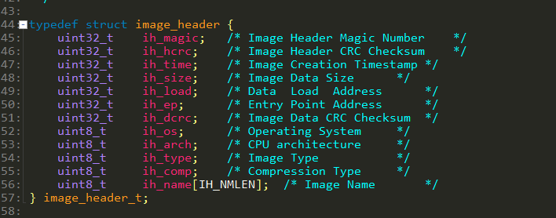
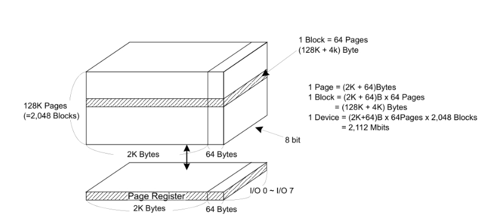
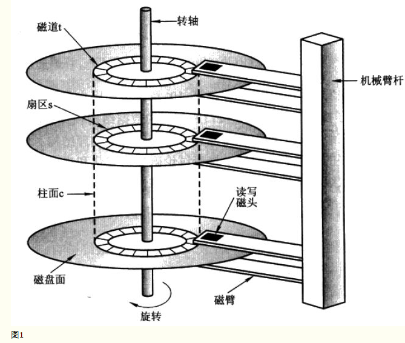
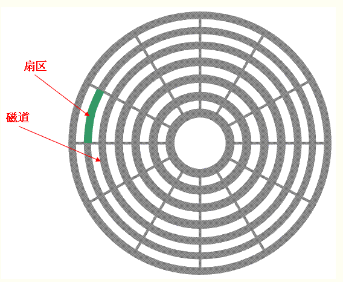
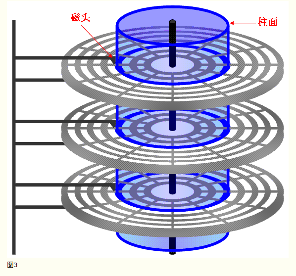
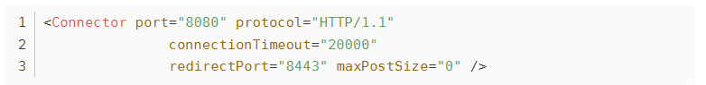

### 嵌入式linux知识点

#### 1. linux下查看动态库和静态库所支持的CPU架构

```shell
#查看动态库-方式1
file libutil-2.10.1.so
libutil-2.10.1.so: ELF 32-bit LSB shared object, Intel 80386, version 1 (SYSV), dynamically linked (uses shared libs), for GNU/Linux 2.6.15, stripped

#查看动态库-方式2
readelf -h libutil-2.10.1.so
ELF Header:
  Magic:   7f 45 4c 46 01 01 01 00 00 00 00 00 00 00 00 00 
  Class:                             ELF32
  Data:                              2's complement, little endian
  Version:                           1 (current)
  OS/ABI:                            UNIX - System V
  ABI Version:                       0
  Type:                              DYN (Shared object file)
  Machine:                           Intel 80386
  Version:                           0x1
  Entry point address:               0xa00
  Start of program headers:          52 (bytes into file)
  Start of section headers:          8588 (bytes into file)
  Flags:                             0x0
  Size of this header:               52 (bytes)
  Size of program headers:           32 (bytes)
  Number of program headers:         8
  Size of section headers:           40 (bytes)
  Number of section headers:         29
  Section header string table index: 28
  
#查看静态库-方式1,用file方式不能查看
file libftdi.a
libftdi.a: current ar archive

#查看静态库-方式,用readelf命令
readelf -h libftdi.a

File: libftdi.a(ftdi.o)
ELF Header:
  Magic:   7f 45 4c 46 01 01 01 00 00 00 00 00 00 00 00 00 
  Class:                             ELF32
  Data:                              2's complement, little endian
  Version:                           1 (current)
  OS/ABI:                            UNIX - System V
  ABI Version:                       0
  Type:                              REL (Relocatable file)
  Machine:                           Intel 80386
  Version:                           0x1
  Entry point address:               0x0
  Start of program headers:          0 (bytes into file)
  Start of section headers:          44124 (bytes into file)
  Flags:                             0x0
  Size of this header:               52 (bytes)
  Size of program headers:           0 (bytes)
  Number of program headers:         0
  Size of section headers:           40 (bytes)
  Number of section headers:         28
  Section header string table index: 25
```

#### 2. linux下设置临时全局变量和全局的环境变量

##### 2.1 查看当前由哪些环境变量

```shell
#查看环境变量命令env
env
TERM=xterm
SHELL=/bin/bash
XDG_SESSION_COOKIE=c0fbedb2eb0e1a195fcabda54b26e6fa-1581852595.530612-1468451737
SSH_CLIENT=192.168.1.2 53092 22
OLDPWD=/
SSH_TTY=/dev/pts/1
NAME=YCL
USER=book
PATH=/usr/local/sbin:/usr/local/bin:/usr/sbin:/usr/bin:/sbin:/bin:/usr/games:/work/tools/gcc-3.4.5-glibc-2.3.6/
```

##### 2.2 临时全局环境变量

```shell
#export命令用法
export: usage: export [-fn] [name[=value] ...]
#在当前shell中执行
#设置环境变量
export name=zhaokun
#打印环境变量
echo $name
#取消环境变量
unset name
```

##### 2.3 全局环境变量

```shell
编辑.bashrc
export name=zhaokun
source .bashrc
```

#### 3. libc与glibc的关系

https://zhidao.baidu.com/question/1830870100763392140.html

https://blog.csdn.net/guangmingsky/article/details/80965694

```shell
glibc和libc都是Linux下的C函数库。libc是Linux下的ANSI C函数库；glibc是Linux下的GUN C函数库。

ANSI C 函数库是基本的C语言函数库，包含了C语言最基本的库函数。
lic常用的头文件:
<ctype.h>：包含用来测试某个特征字符的函数的函数原型，以及用来转换大小写字母的函数原型；
<errno.h>：定义用来报告错误条件的宏；
<float.h>：包含系统的浮点数大小限制；
<math.h>：包含数学库函数的函数原型；
...........

GNU C函数库是一种类似于第三方插件的东西，由于Linux是用C语言写的，所以Linux的一些操作是用C语言实现的，因此GNU组织开发了一个C语言的库以便更好地利用C语言开发基于Linux操作系统的程序，现在不同的Linux的发行版本对这两个函数库有不同的处理方法，有的可能已经集成到同一个库中
glibc是linux下c标准库的实现,即GNU C Library，glibc本身是GNU旗下的C标准库，后来逐渐形成Linux的标准C库，而Linux下原来的标准库Linux libc逐渐不爱被维护。glibc在/lib目录下的.so文件为libc.so.6
    
#在开发板中/lib目录下查看    
-rwxrwxr-x    1 1000     1000      1435660 Dec 24  2010 libc-2.3.6.so
-rwxrwxr-x    1 1000     1000          195 Dec 24  2010 libc.so
lrwxrwxrwx    1 1000     1000           13 Dec 24  2010 libc.so.6 -> libc-2.3.6.so

#查看glibc的版本
 ./libc.so.6
GNU C Library stable release version 2.3.6, by Roland McGrath et al.
Copyright (C) 2005 Free Software Foundation, Inc.
This is free software; see the source for copying conditions.
There is NO warranty; not even for MERCHANTABILITY or FITNESS FOR A
PARTICULAR PURPOSE.
Compiled by GNU CC version 3.4.5.
Compiled on a Linux 2.6.12 system on 2008-01-21.
Available extensions:
        GNU libio by Per Bothner
        crypt add-on version 2.1 by Michael Glad and others
        linuxthreads-0.10 by Xavier Leroy
        BIND-8.2.3-T5B
        libthread_db work sponsored by Alpha Processor Inc
        NIS(YP)/NIS+ NSS modules 0.19 by Thorsten Kukuk
For bug reporting instructions, please see:
<http://www.gnu.org/software/libc/bugs.html>.

glic常用功能:
string，字符串处理
signal，信号处理
dlfcn，管理共享库的动态加载
direct，文件目录操作
elf，共享库的动态加载器，也即interpreter
```

#### 4. linux文件的为什么默认大小是4096

目录只是一个特殊的文件,它包含每个文件的文件名和inode编号的数组，创建目录时,文件系统将1个inode分配为上述创建的目录,inode指向单个数据块(最小开销),即4096字节

```shell
ls -al
  drwxr-xr-x  2 book book    4096 2009-12-15 09:38 Documents
  drwxr-xr-x  2 book book    4096 2009-12-15 09:38 Downloads
  drwxr-xr-x  3 book book    4096 2010-11-22 17:09 .eclipse
  
  sudo tune2fs -l /dev/sdb1 | grep Block
  Block count:              10484412
  Block size:               4096
  Blocks per group:         32768
```

#### 5. ulimit命令

ulimit为shell内建指令,可用于控制执行程序的资源

```shell
ulimit -a
  core file size          (blocks, -c) 0
  data seg size           (kbytes, -d) unlimited
  scheduling priority             (-e) 20
  file size               (blocks, -f) unlimited
  pending signals                 (-i) 16382
  max locked memory       (kbytes, -l) 64
  max memory size         (kbytes, -m) unlimited
  open files                      (-n) 1024
  pipe size            (512 bytes, -p) 8
  POSIX message queues     (bytes, -q) 819200
  real-time priority              (-r) 0
  stack size              (kbytes, -s) 8192
  cpu time               (seconds, -t) unlimited
  max user processes              (-u) unlimited
  virtual memory          (kbytes, -v) unlimited
  file locks                      (-x) unlimited
  
  -a 　显示目前资源限制的设定。
  -c <core文件上限> 　设定core文件的最大值，单位为区块。
  -d <数据节区大小> 　程序数据节区的最大值，单位为KB。
  -f <文件大小> 　shell所能建立的最大文件，单位为区块。
  -H 　设定资源的硬性限制，也就是管理员所设下的限制。
  -m <内存大小> 　指定可使用内存的上限，单位为KB。
  -n <文件数目> 　指定同一时间最多可开启的文件数。
  -p <缓冲区大小> 　指定管道缓冲区的大小，单位512字节。
  -s <堆叠大小> 　指定堆叠的上限，单位为KB。
  -S 　设定资源的弹性限制。
  -t <CPU时间> 　指定CPU使用时间的上限，单位为秒。
  -u <程序数目> 　用户最多可开启的程序数目。
  -v <虚拟内存大小> 　指定可使用的虚拟内存上限，单位为KB。
```

#### 6. man 1 2 3命令

```shell
linux的man很强大,该手册分成很多section,使用man时可以指定不同的section来浏览,各个setion意义如下:

1 - commands - 普通命令

2 - system callls -系统调用,如open、wirite之类的，通常这个可以很方便地查到调用这个函数需要加什么头文件

3 - library callls - 库函数,如printf,fread

4 -special files - 特殊文件,也就是/dev下的各种设备文件

5 - file formats and convertions - 文件的格式,比如passwd,就会说明这个文件中各个字段的含义

6 - games for linux - 留给游戏留用

7 - macro packages and conventions - 

8 - system management commands - 系统管理命令,这些命令只能由root使用,如ifconfig

9 - 其他

man 1 ls
    man 3 printf
对于像open,kill这种既有命令又有系统调用来说，man open则显示man 1 open,如果想查看openw系统调用的话,需用man 2 open
```

#### 7. strace命令

作用:查看程序使用了哪些系统调用

```shell
#include <stdio.h>
  
  void main() {
  	printf("Hello\n");
  }
  
  //执行命令，可以看到输出信息里面包含了系统调用
  strace ./main    
  execve("./main", ["./main"], [/* 20 vars */]) = 0
  brk(0)                                  = 0x905e000
  access("/etc/ld.so.nohwcap", F_OK)      = -1 ENOENT (No such file or directory)
  mmap2(NULL, 8192, PROT_READ|PROT_WRITE, MAP_PRIVATE|MAP_ANONYMOUS, -1, 0) = 0xb7796000
  access("/etc/ld.so.preload", R_OK)      = -1 ENOENT (No such file or directory)
  open("/etc/ld.so.cache", O_RDONLY)      = 3
  fstat64(3, {st_mode=S_IFREG|0644, st_size=71399, ...}) = 0
  mmap2(NULL, 71399, PROT_READ, MAP_PRIVATE, 3, 0) = 0xb7784000
  close(3)                                = 0
  access("/etc/ld.so.nohwcap", F_OK)      = -1 ENOENT (No such file or directory)
  open("/lib/tls/i686/cmov/libc.so.6", O_RDONLY) = 3
  read(3, "\177ELF\1\1\1\0\0\0\0\0\0\0\0\0\3\0\3\0\1\0\0\0\260l\1\0004\0\0\0"..., 512) = 512
  fstat64(3, {st_mode=S_IFREG|0755, st_size=1319364, ...}) = 0
  mmap2(NULL, 1325416, PROT_READ|PROT_EXEC, MAP_PRIVATE|MAP_DENYWRITE, 3, 0) = 0xbe5000
  mmap2(0xd23000, 12288, PROT_READ|PROT_WRITE, MAP_PRIVATE|MAP_FIXED|MAP_DENYWRITE, 3, 0x13e) = 0xd23000
  mmap2(0xd26000, 10600, PROT_READ|PROT_WRITE, MAP_PRIVATE|MAP_FIXED|MAP_ANONYMOUS, -1, 0) = 0xd26000
  close(3)                                = 0
  mmap2(NULL, 4096, PROT_READ|PROT_WRITE, MAP_PRIVATE|MAP_ANONYMOUS, -1, 0) = 0xb7783000
  set_thread_area({entry_number:-1 -> 6, base_addr:0xb77836c0, limit:1048575, seg_32bit:1, contents:0, read_exec_only:0, limit_in_pages:1, seg_not_present:0, useable:1}) = 0
  mprotect(0xd23000, 8192, PROT_READ)     = 0
  mprotect(0x8049000, 4096, PROT_READ)    = 0
  mprotect(0xd44000, 4096, PROT_READ)     = 0
  munmap(0xb7784000, 71399)               = 0
  fstat64(1, {st_mode=S_IFCHR|0620, st_rdev=makedev(136, 1), ...}) = 0
  mmap2(NULL, 4096, PROT_READ|PROT_WRITE, MAP_PRIVATE|MAP_ANONYMOUS, -1, 0) = 0xb7795000
  write(1, "Hello\n", 6Hello
  )                  = 6
  exit_group(6)                           = ?
```

#### 8.关于库函数和系统调用

> 关于库函数和系统调用
>
> - 从运行空间
>
>    库函数是高层的,完全运行在用户空间，为程序员提供更方便地接口。
>
>    系统调用在内核态运行并且由内核自己提供。
>
> - 从提供功能
>
>   函数库提供的函数通常是不需要操作系统的服务，函数是在用户空间内执行的，除非函数涉及到I/O操作等，一般是不会切到核心
>
>   系统调用要求操作系统为用户提供进程，提高某种服务，通常是涉及系统的硬件资源和一些敏感的软件资源等
>
> - 从移植角度
>
>   库函数尤其与输入输出相关的函数,大多必须通过linux的系统调用来完成，因此可以将函数库当成应用程序设计人员与系统调用程序之间的一个中间层，通过这个中间层我们可以用一致的接口来安全的调用系统调用，这样程序员可以只要写一次代码就能够在不同版本的linux系统实现完全不同的系统调用，至于如何实现对不同的系统调用的兼容性问题，那是函数库开发者所关心的问题
>
> - 从执行效率
>
>   系统调用的执行效率大多要比函数高，尤其是处理输入输出的函数。当处理的数据量比较小时，函数库的函数执行效率可能比较好，因为函数库的做法是将要处理的数据先存入缓冲区，等到缓冲区满了，再将数据一次写入或者读出，这种方式处理小量数据时效率比较高，但是在进行系统调用时，因为用户进程从用户模式进入系统核心 模式，中间涉及了许多额外的任务的切换工作，这些操作称为上下文切换，此类的额外工作会影响系统的执行效率。但是当要处理的数据量比较大时，例如当输入输 出的数据量超过文件系统定义的尽寸时，利用系统调用可获得较高的效率。

#### 9. linux查看符号表

```shell
#在实际应用中,是需要把符号表去掉的
  #查看文件是否去掉了符号表
  file main
  main: ELF 32-bit LSB executable, Intel 80386, version 1 (SYSV), dynamically linked (uses shared libs), for GNU/Linux 2.6.15, not stripped
  
  #查看符号表
  nm main
  08049f20 d _DYNAMIC
  08049ff4 d _GLOBAL_OFFSET_TABLE_
  080484bc R _IO_stdin_used
           w _Jv_RegisterClasses
  08049f10 d __CTOR_END__
  08049f0c d __CTOR_LIST__
  08049f18 D __DTOR_END__
  08049f14 d __DTOR_LIST__
  080484c8 r __FRAME_END__
  08049f1c d __JCR_END__
  08049f1c d __JCR_LIST__
  0804a014 A __bss_start
  0804a00c D __data_start
  08048470 t __do_global_ctors_aux
  08048360 t __do_global_dtors_aux
  0804a010 D __dso_handle
           w __gmon_start__
  0804846a T __i686.get_pc_thunk.bx
  08049f0c d __init_array_end
  08049f0c d __init_array_start
  08048400 T __libc_csu_fini
  08048410 T __libc_csu_init
           U __libc_start_main@@GLIBC_2.0
  0804a014 A _edata
  0804a01c A _end
  0804849c T _fini
  080484b8 R _fp_hw
  080482b8 T _init
  08048330 T _start
  0804a014 b completed.6990
  0804a00c W data_start
  0804a018 b dtor_idx.6992
  080483c0 t frame_dummy
  080483e4 T main
           U puts@@GLIBC_2.0
  #去掉符号表         
  strip main
  
  file main
  main: ELF 32-bit LSB executable, Intel 80386, version 1 (SYSV), dynamically linked (uses shared libs), for GNU/Linux 2.6.15, stripped
  
  nm main
  nm: main: no symbols
```

#### 10. linux输出线程id

```c
 //获取进程pid
  #include <unistd.h>  
  pid_t getpid(void);
  
  //获取线程pid
  #include <sys/syscall.h>  
  printf("The ID of this thread is: %ld\n", (long int)syscall(224));  
  
  //示例
  #include <stdio.h>
  #include <pthread.h> //线程头文件 
  #include <sys/types.h>
  #include <unistd.h>
  
  //pthread不是linux下的默认的库，也就是在链接的时候，无法找到phread库中哥函数的入口地址，于是链接会失败,在gcc编译的时候，附加要加 -lpthread参数即可解决。gcc -o run pthreadtext.c  -lpthread
  
  void *myThread1(void) //线程函数
  {
      int i;
      for(i=0;i<500; i++)
      {
          printf("now pid is %d \n", getpid());
          printf("now tid is %ld \n", (long int)syscall(224));
          sleep(500);
      }
  }
  
  int main()
  {
      int i=0,ret=0;
      pthread_t id1,id2;
      ret= pthread_create(&id1,NULL,(void*)myThread1,NULL ); //创建线程
      if(ret)
      {
          printf("create error\n");
          return 1;
      }
  
      pthread_join(id1,NULL); //当前线程会处于阻塞状态，直到被调用的线程结束后，当前线程才会重新开始执行
      return 0;
  }
  
  gcc -o run pthreadtext.c  -lpthread
```

#### 11. ldd命令

作用:查看应用程序或动态库依赖哪些库函数

```shell
ldd main
            linux-gate.so.1 =>  (0x00231000)
            libc.so.6 => /lib/tls/i686/cmov/libc.so.6 (0x005ae000)
            /lib/ld-linux.so.2 (0x0046a000)
            
    ldd /lib/libc.so.6
            /lib/ld-linux.so.2 (0x009cb000)
            linux-gate.so.1 =>  (0x00ee1000)
            
    注意：在 ldd 命令打印的结果中，“=>”左边的表示该程序需要连接的共享库之 so 名称，右边表示由 Linux 的共享库系统找到的对应的共享库在文件系统中的具体位置。默认情况下，/etc/ld.so.conf 文件中包含有默认的共享库搜索路径。
```

#### 12. pstree命令

作用:查看进程及线程号

```shell
pstree -ap
    init,1
      ├─sshd,983
      │   └─sshd,1696
      │       └─sshd,1779
      │           ├─bash,1780
      │           │   └─pstree,2000 -ap
      │           └─bash,1939
      │               └─run,1992 #该处是进程名字及进程号
      │                   ├─{run},1993 #该处是线程名字及线程号
      │                   └─{run},1994 #该处是线程名字及线程号
      ├─system-service-,1677 /usr/lib/system-service/system-service-d
      ├─trashapplet,1583 --oaf-activate-iid=OAFIID:GNOME_Panel_TrashApplet_Factory--oaf-ior-fd
      ├─udevd,408 --daemon
      │   ├─udevd,523 --daemon
      │   └─udevd,534 --daemon
      ├─update-manager,1681 /usr/bin/update-manager --no-focus-on-map
      ├─upstart-udev-br,405 --daemon
      ├─vsftpd,1126
      └─wpa_supplicant,1048 -u -s
      
    #在proc目录页能看到该进程下有多少线程  
    ls /proc/1992/task 
    1992  1993  1994
```

#### 13. nohup和& 区别

> &是指在后台运行,./a.out & 的时候，即使使用ctrl+c,那么a.out照样运行(因为对SIGINT信号免疫)，需注意的是如果直接关掉shell，那么a.out进程同样会退出，可见，&的后台对SIGHUP不免疫
>
>     nohup:Run COMMAND, ignoring hangup signals.表示忽略挂起信号,就是不挂断地运行，但是没有后台运行的功能,即可以用ctrl+c打断
>    
>     nohup的意思是忽略SIGHUP信号， 所以当运行nohup ./a.out的时候， 关闭shell, 那么a.out进程还是存在的（对SIGHUP信号免疫）,但是如果直接在shell中用Ctrl C, 那么, a.out进程也是会消失的（因为对SIGINT信号不免疫）
>     nohua ./a.out &
>     &和nohup没有半毛钱的关系， 要让进程真正不受shell中Ctrl C和shell关闭的影响，就需要运行一下命令:
>     nohua ./a.out &

#### 14. linux中ctrl+z和ctrl+c的区别

> ctrl+z与ctrl+c都是中断命令,但是他们的作用却不一样
>     ctrl+c:是强制中断程序执行,进程已经死掉
>     ctrl+z:是将任务中断,但是任务并没有结束,它仍然在进程中,只是将进程进行挂起(进程没有死掉),用户恶意使    用fg/bg操作前台或后台的任务,fg命令重新启动前台被中断的任务,bg命令把被中断的任务放在后台执行.  
>
>     fg、bg、jobs、&、 ctrl+z都是跟系统任务有关的
>     一、&最经常被用到
>     这个用在一个命令的最后，可以把这个命令放到后台执行
>     二、ctrl + z
>     可以将一个正在前台执行的命令放到后台，并且暂停
>     三、jobs
>     查看当前有多少在后台运行的命令
>     四、fg
>     将后台中的命令调至前台继续运行
>     如果后台有多个命令，可以用fg %jobnumber将选中的命令调出，%jobnumber是通过jobs命令查到的后台正在执行的命令的序号（不是pid）
>     五、bg
>     将一个在后台暂停的命令，变成继续执行
>    
>     如果后台有多个命令，可以用bg %jobnumber将选中的命令调出，%jobnumber是通过jobs命令查到的后台正在执行的命令的序号（不是pid）

#### 15. sigaction函数

```c
 //sigaction函数的功能是检查或修改与指定信号相关联的处理动作（可同时两种操作），他是POSIX的信号接口，而signal()是标准C的信号接口(如果程序必须在非POSIX系统上运行，那么就应该使用这个接口)
      #include <stdio.h>  
      #include <signal.h>  
        
      void WrkProcess(int nsig)  
      {  
              printf("WrkProcess,I get signal = %d\n",nsig);  
      #if 0  
              int i=0;  
              while(i<5){  
                      printf("%d\n",i);  
                      sleep(1);  
                      i++;  
              }
      #endif  
      }  
        
      int main()  
      {  
              struct sigaction act,oldact; 
              sigset_t set;
      
              //添加处理函数 
              act.sa_handler  = WrkProcess;  
      
      //测试1:无论发送多少次ctrl+c信号程序都不会退出,屏蔽了SIGINT信号,由crl+c产生
      #if 0
              act.sa_flags = SA_NODEFER;
      #endif
      
      //测试2:第一次不会导致程序的结束。而是继续执行，当用户再次执行ctrl+c的时候，程序采用结束
      #if 0     
              act.sa_flags = SA_NODEFER | SA_RESETHAND;
      #endif
      
      //测试3:在执行信号处理函数这段期间，多次操作ctrl+c，程序也不会调用信号处理函数，而是在本次信号处理函数完成之后，在执行一次信号处理函数（无论前面产生了多少次ctrl+c信号）
      #if 0
              act.sa_flags = 0;
      
      #endif
      
      //测试4:发送ctrl+/信号，程序也不会已经退出，而是在信号处理函数执行完毕之后才会执行SIGQUIT的信号处理函数，然后程序退出。如果不添加这项设置，则程序将会在接收到ctrl+/信号后马上执行退出，无论是否在ctrl+c的信号处理函数过程中
      #if 0
              sigaddset(&act.sa_mask,SIGQUIT);
      #endif
      
      #if 0
              sigemptyset(&act.sa_mask);
      #endif
      
      //测试5
      #if 1
              act.sa_flags = SA_NODEFER;
      #endif
      
              sigaction(SIGINT,&act,&oldact);
      
      //测试5:
      #if 1
              sigemptyset(&set);
              sigaddset(&set, SIGQUIT);
      
              sigprocmask(SIG_BLOCK, &set, NULL); //用于屏蔽某信号
      
              printf("please input data:\n");
              getchar();
      
              sigprocmask(SIG_UNBLOCK, &set, NULL); //用于取消屏蔽某信号
              printf("xxxxxxxxxxxxxx\n");
      #endif
      
              printf("main threadid...........\n");  
        
              while(1) {
                      sleep(5);
              }
        
              return 0;  
      } 
```

#### 16. 标准C函数库和POSIX函数库的关系

POSIX库函数是C标准库函数的超集
      POSIX表示可移植操作系统接口（Portable Operating System Interface of UNIX，缩写为 POSIX ），POSIX标准定义了操作系统应该为应用程序提供的接口标准。
      POSIX标准意在期望获得源代码级别的软件可移植性。换句话说，为一个POSIX兼容的操作系统编写的程序，应该可以在任何其它的POSIX操作系统（即使是来自另一个厂商）上编译执行
      
      简单总结：
        完成同一功能，不同内核提供的系统调用（也就是一个函数）是不同的，例如创建进程，linux下是fork函数，windows下是creatprocess函数。好，我现在在linux下写一个程序，用到fork函数，那么这个程序该怎么往windows上移植？我需要把源代码里的fork通通改成creatprocess，然后重新编译...
      
        posix标准的出现就是为了解决这个问题。linux和windows都要实现基本的posix标准，linux把fork函数封装成posix_fork（随便说的），windows把creatprocess函数也封装成posix_fork，都声明在unistd.h里。这样，程序员编写普通应用时候，只用包含unistd.h，调用posix_fork函数，程序就在源代码级别可移植了。
    
      - 标准C函数
    
        <assert.h>      Contains the assert macro, used to assist with detecting logical errors and other types of bug in debugging versions of a program.
        <complex.h> C99 A set of functions for manipulating complex numbers.
        <ctype.h>       Defines set of functions used to classify characters by their types or to convert between upper and lower case in a way that is independent of the used character set (typically ASCII or one of its extensions, although implementations utilizing EBCDIC are also known).
        <errno.h>       For testing error codes reported by library functions.
        <fenv.h>    C99 Defines a set of functions for controlling floating-point environment.
        <float.h>       Defines macro constants specifying the implementation-specific properties of the floating-point library.
        <inttypes.h>    C99 Defines exact width integer types.
        <iso646.h>  NA1 Defines several macros that implement alternative ways to express several standard tokens. For programming in ISO 646 variant character sets.
        <limits.h>      Defines macro constants specifying the implementation-specific properties of the integer types.
        <locale.h>      Defines localization functions.
        <math.h>        Defines common mathematical functions.
        <setjmp.h>      Declares the macros setjmp and longjmp, which are used for non-local exits.
        <signal.h>      Defines signal handling functions.
        <stdalign.h>    C11 For querying and specifying the alignment of objects.
        <stdarg.h>      For accessing a varying number of arguments passed to functions.
        <stdatomic.h>   C11 For atomic operations on data shared between threads.
        <stdbool.h> C99 Defines a boolean data type.
        <stddef.h>      Defines several useful types and macros.
        <stdint.h>  C99 Defines exact width integer types.
        <stdio.h>       Defines core input and output functions
        <stdlib.h>      Defines numeric conversion functions, pseudo-random numbers generation functions, memory allocation, process control functions
        <stdnoreturn.h> C11 For specifying non-returning functions.
        <string.h>      Defines string handling functions.
        <tgmath.h>  C99 Defines type-generic mathematical functions.
        <threads.h> C11 Defines functions for managing multiple Threads as well as mutexes and condition variables.
        <time.h>        Defines date and time handling functions
        <uchar.h>   C11 Types and functions for manipulating Unicode characters.
        <wchar.h>   NA1 Defines wide string handling functions.
        <wctype.h>  NA1 Defines set of functions used to classify wide characters 
POSIX库函数(标准C库以外)

```c
<aio.h> Asynchronous input and output   Issue 5
    <arpa/inet.h>   Functions for manipulating numeric IP addresses (part of Berkeley sockets)  Issue 6
    <assert.h>  Verify assumptions   ??
    <complex.h> Complex Arithmetic, see C mathematical functions     ??
    <cpio.h>    Magic numbers for the cpio archive format   Issue 3
    <dirent.h>  Allows the opening and listing of directories   Issue 2
    <dlfcn.h>   Dynamic linking Issue 5
    <errno.h>   Retrieving Error Number  ??
    <fcntl.h>   File opening, locking and other operations  Issue 1
    <fenv.h>    Floating-Point Environment (FPE), see C mathematical functions   ??
    <float.h>   Floating-point types, see C data types   ??
    <fmtmsg.h>  Message display structures  Issue 4
    <fnmatch.h> Filename matching   Issue 4
    <ftw.h> File tree traversal Issue 1
    <glob.h>    Pathname "globbing" (pattern-matching)  Issue 4
    <grp.h> User group information and control  Issue 1
    <iconv.h>   Codeset conversion facility Issue 4
    <inttypes.h>    Fixed sized integer types, see C data types  ??
    <iso646.h>  Alternative spellings, see C alternative tokens  ??
    <langinfo.h>    Language information constants – builds on C localization functions Issue 2
    <libgen.h>  Pathname manipulation   Issue 4
    <limits.h>  Implementation-defined constants, see C data types   ??
    <locale.h>  Category macros, see C localization functions    ??
    <math.h>    Mathematical declarations, see C mathematical functions  ??
    <monetary.h>    String formatting of monetary units Issue 4
    <mqueue.h>  Message queue   Issue 5
    <ndbm.h>    NDBM database operations    Issue 4
    <net/if.h>  Listing of local network interfaces Issue 6
    <netdb.h>   Translating protocol and host names into numeric addresses (part of Berkeley sockets)   Issue 6
    <netinet/in.h>  Defines Internet protocol and address family (part of Berkeley sockets) Issue 6
    <netinet/tcp.h> Additional TCP control options (part of Berkeley sockets)   Issue 6
    <nl_types.h>    Localization message catalog functions  Issue 2
    <poll.h>    Asynchronous file descriptor multiplexing   Issue 4
    <pthread.h> Defines an API for creating and manipulating POSIX threads  Issue 5
    <pwd.h> passwd (user information) access and control    Issue 1
    <regex.h>   Regular expression matching Issue 4
    <sched.h>   Execution scheduling    Issue 5
    <search.h>  Search tables   Issue 1
    <semaphore.h>   POSIX semaphores    Issue 5
    <setjmp.h>  Stack environment declarations   ??
    <signal.h>  Signals, see C signal handling   ??
    <spawn.h>   Process spawning    Issue 6
    <stdarg.h>  Handle Variable Argument List    ??
    <stdbool.h> Boolean type and values, see C data types    ??
    <stddef.h>  Standard type definitions, see C data types  ??
    <stdint.h>  Integer types, see C data types  ??
    <stdio.h>   Standard buffered input/output, see C file input/output  ??
    <stdlib.h>  Standard library definitions, see C standard library     ??
    <string.h>  Several String Operations, see C string handling     ??
    <strings.h> Case-insensitive string comparisons Issue 4
    <stropts.h> Stream manipulation, including ioctl    Issue 4
    <sys/ipc.h> Inter-process communication (IPC)   Issue 2
    <sys/mman.h>    Memory management, including POSIX shared memory and memory mapped files    Issue 4
    <sys/msg.h> POSIX message queues    Issue 2
    <sys/resource.h>    Resource usage, priorities, and limiting    Issue 4
    <sys/select.h>  Synchronous I/O multiplexing    Issue 6
    <sys/sem.h> XSI (SysV style) semaphores Issue 2
    <sys/shm.h> XSI (SysV style) shared memory  Issue 2
    <sys/socket.h>  Main Berkley sockets header Issue 6
    <sys/stat.h>    File information (stat et al.)  Issue 1
    <sys/statvfs.h> File System information Issue 4
    <sys/time.h>    Time and date functions and structures  Issue 4
    <sys/times.h>   File access and modification times  Issue 1
    <sys/types.h>   Various data types used elsewhere   Issue 1
    <sys/uio.h> Vectored I/O operations Issue 4
    <sys/un.h>  Unix domain sockets Issue 6
    <sys/utsname.h> Operating system information, including uname   Issue 1
    <sys/wait.h>    Status of terminated child processes (see wait) Issue 3
    <syslog.h>  System error logging    Issue 4
    <tar.h> Magic numbers for the tar archive format    Issue 3
    <termios.h> Allows terminal I/O interfaces  Issue 3
    <tgmath.h>  Type-Generic Macros, see C mathematical functions    ??
    <time.h>    Type-Generic Macros, see C date and time functions   ??
    <trace.h>   Tracing of runtime behavior (DEPRECATED)    Issue 6
    <ulimit.h>  Resource limiting (DEPRECATED in favor of <sys/resource.h>) Issue 1
    <unistd.h>  Various essential POSIX functions and constants Issue 1
    <utime.h>   inode access and modification times Issue 3
    <utmpx.h>   User accounting database functions  Issue 4
    <wchar.h>   Wide-Character Handling, see C string handling   ??
    <wctype.h>  Wide-Character Classification and Mapping Utilities, see C character classification  ??
    <wordexp.h> Word-expansion like the shell would perform
```

#### 17. linux内核进程

```
 # ps
      PID  Uid        VSZ Stat Command
        1 0          3092 S   init     #用户进程
        2 0               SW< [kthreadd] #内核进程
        3 0               SWN [ksoftirqd/0]
        4 0               SW< [watchdog/0]
        5 0               SW< [events/0]
        6 0               SW< [khelper]
       55 0               SW< [kblockd/0]
       56 0               SW< [ksuspend_usbd]
       59 0               SW< [khubd]
       61 0               SW< [kseriod]
       73 0               SW  [pdflush]
       74 0               SW  [pdflush]
       75 0               SW< [kswapd0]
       76 0               SW< [aio/0]
      710 0               SW< [mtdblockd]
      745 0               SW< [kmmcd]
      762 0               SW< [rpciod/0]
      770 0          3096 S   -sh 
      771 0          3096 R   ps 
      
    在代码里是通过查看/proc/pid/cmdline 来进行判断，如果为空则追加[]
```

#### 18.一个系统支持多少个进程取决于虚拟内存,系统创建的进程过多，运行速度非常慢，一个进程支持的最大线程数据也取决于虚拟内存

```shell
ulimit -a
    time(seconds)        unlimited
    file(blocks)         unlimited
    data(kbytes)         unlimited
    stack(kbytes)        8192 #最大占用的栈空间
    coredump(blocks)     0
    memory(kbytes)       unlimited
    locked memory(kbytes) 32
    process              512 #最大的进程数
    nofiles              1024
    vmemory(kbytes)      unlimited
    locks                unlimited
```

#### 19. linux中的信号

https://www.cnblogs.com/Mered1th/p/10744825.html

#### 20. dup( )和dup2( )函数

https://blog.csdn.net/tiandc/article/details/81489447
https://www.cnblogs.com/lidabo/p/4581202.html

#### 21. linux守护进程

https://blog.csdn.net/xu1105775448/article/details/80877747
https://www.cnblogs.com/yinbiao/p/11203225.html

#### 22. Jlink与JTAG的区别

> Jlink:是 SEGGER 公司为支持仿真 ARM 内核芯片推出的 JTAG仿真器
>
> JTAG:调试 ARM，要遵循 ARM 的调试接口协议

#### 23. 内核支持nfs文件系统

```shell
#linux内核支持nfs挂载配置
https://www.cnblogs.com/PengfeiSong/p/6442899.html

#挂载文件系统报错
IP-Config: Complete:
      device=eth0, addr=192.168.1.17, mask=255.0.0.0, gw=192.168.1.17,
     host=255, domain=, nis-domain=255.0,
     bootserver=192.168.1.3, rootserver=192.168.1.3, rootpath=
VFS: Cannot open root device "nfs" or unknown-block(0,255)
Please append a correct "root=" boot option; here are the available partitions:
1f00        256 mtdblock0 (driver?)
1f01        128 mtdblock1 (driver?)
1f02       2048 mtdblock2 (driver?)
1f03     259712 mtdblock3 (driver?)
Kernel panic - not syncing: VFS: Unable to mount root fs on unknown-block(0,255)
```

#### 24. uImage和zImage

```
uImage比zImage多的64字节，多头部信息
```



#### 25. nand flash结构与坏块



```shell
#nand flash结构
(1)nand flash的存储结构为：一个flash由许多block组成，一个block又是有许多page组成，一个page又是由有效数据和spare area区(即oob区组成)

(2)上图中flash有2048个块，一个block又有64个page，一个page有2Kbytes的有效数据+64bytes的oob数据，我们通常计算nand flash容量大小为：block数 * 一个block中的page数 * 一个page中的有效数据。oob区为特殊数据，用作硬件纠错和坏块管理

备注:按照读、写、擦除的操作，擦除操作最小单位是一个block，读写操作最小单位是一个page

#坏块的定义
坏块的定义:指在nand flash中出现的某些flash区域不能进行擦写操作，我们称这样的一个单位区域为一个坏块，而由于nand flash中的读和写操作是以page为单位，擦除是以block为单位，且写操作之前必须要进行擦除操作，因此一个最小的可操作单位即为一个block，整个block中产生任何不可修复的位错误，我们就认为这个块是坏块
#坏块的产生
由于nand flash的工艺不能保证nand的memory array在其生命周期中保持性能的可靠性，因此在生产和使用过程总会产生坏块，nand flash在出厂阶段就会有某些概率出现坏块的现象，我们称为固有坏块
#坏块的管理
每个块都会在一个page的oob区第6个字节标记这个块是否为坏块的信息，如果在擦除一个块之前，检测到底一个page的oob区的第6个字节非0xff，就表示为坏块不能进行擦除操作(0xff表示正常)，以免将坏块标记擦除。如果在操作过程中出现新的坏块，应及时标记坏块，更新坏块表
对于nand flash，比较严重的就是坏块，也就是说一个块中包含有一个或者多个位是坏的，而现在对于坏块有两类:
(1)出厂的时候就存在坏块：在出厂之前，就会做对应的标记，标记为坏块，一般芯片厂商会将每个块第一个page的oob的第6byte标记为不等于0xff
(2)使用过程中产生的坏块，就需要将这个块作为坏块来处理，为了与固有的坏块信息保持一致，也需要将新发现的坏块的第一个page的oob的第6个Byte标记为非0xff的值。因此在需要擦除一个块之前，必须先要检查下第一个page的oob区的第6个byte是否为0xff,如果是就证明是一个好块;如果不是，就证明这是一个坏块,就不能擦除
#EEC校验
ECC是一种用于nand flash的差错检测和修正的算法。由于操作的时序和电路稳定性等原因，常常会出现一些bit出错，也就是原来的某个位，本来是0而变成了1，或者本来是1而变成了0.从现象来看，问题起来并不是特别严重，但是如果恰好某个重要的文件的某一位发生了变化，那么问题就大了，可能会导致此时文件不能运行，如果这个文件是一个影响系统的程序，那么直接将导致系统会出现问题，所以对于nand flash就出现了这样一个机制，它能纠正1个bit的错误和检测出2个bit的错误，对于1bit以上的错误无法纠正，而对于2bit以上的错误不能保证检测。
(1)当往nand flash写入数据时候，每256个字节生产一个ECC校验，针对这些数据会生成一个ECC校验码，然后保存到对应的page的OOB数据区
(2)当读取nand flash的数据时候，每256个字节就会生产一个ECC校验，那么对于这些数据就会计算出一个ECC校验码，然后将OOB中读取存储的ECC校验和计算的ECC校验相比较

oob区:
	(1)一个块的第一个page的第6字节标识是否为坏块
	(2)部分数据用于存储ECC校验值
	2048(一页的大小) / 256(多少个字节数用于产生ECC校验值) = 8*ECC校验值的大小(共占用obb区的大小)
```

#### 26. jffs2与yaffs文件类型的区别

```shell
cramfs、jffs2文件系统映像文件并没有obb区的内容，如果将它们烧入到nandflash中，则nand flash的驱动首先根据oob的标记略过坏块，然后将一页数据写入后，还会计算51字节的ECC校验值，最后将它写入oob区，如此循环
yaffs文件系统映像文件的格式跟他们不同，文件本身就包含了oob区的数据(里面有坏块标记、ECC校验码等相关信息，最后会写入16或者64字节的oob数据，yaffs文件系统映像大小是(2048+64)的整数倍)
```

#### 27. 磁盘的基本概念

```
扇区:硬盘的最小读写单位
块:操作系统针对硬盘最小读写单位,硬盘本身没有block概念。文件系统不是一个扇区一个扇区的来读数据，这样速度太慢，所以有了block概念，它是一个块一个块读取的，block才是文件存取的最小单位
```

```
盘片、片面和磁头:硬盘中一般会有多个盘片组成，每个盘片包含两个面，每个盘面都对应地有一个读/写磁头。受到硬盘整体体积和生产成本的限制，盘片数量都受到限制，一般都在5片以内。盘片的编号自下向上从0开始，如最下边的盘片有0面和1面，再上一个盘片就编号为2面和3面。
```



```
扇区和磁道:下图显示的是一个盘面，盘面中一圈圈灰色同心圆为一条条磁道，从圆心向外画直线，可以将磁道划分为若干个弧段，每个磁道上一个弧段被称之为一个扇区（图践绿色部分）。扇区是磁盘的最小组成单元，通常是512字节。（由于不断提高磁盘的大小，部分厂商设定每个扇区的大小是4096字节）
```



```
磁头和柱面:
硬盘通常由重叠的一组盘片构成，每个盘面都被划分为数目相等的磁道，并从外缘的“0”开始编号，具有相同编号的磁道形成一个圆柱，称之为磁盘的柱面。磁盘的柱面数与一个盘面上的磁道数是相等的。由于每个盘面都有自己的磁头，因此，盘面数等于总的磁头数。 如下图
```



```
磁盘容量计算
存储容量 ＝ 磁头数 × 磁道(柱面)数 × 每道扇区数 × 每扇区字节数
图3中磁盘是一个 3个圆盘6个磁头，7个柱面（每个盘片7个磁道） 的磁盘，图3中每条磁道有12个扇区，所以此磁盘的容量为：
存储容量 6 * 7 * 12 * 512 = 258048
```

```shell
#查看当前目录在哪个硬盘下挂载
df
Filesystem           1K-blocks      Used Available Use% Mounted on
/dev/sda6             19560336   3645732  14920988  20% /
udev                   1105716       232   1105484   1% /dev
none                   1105716      1160   1104556   1% /dev/shm
none                   1105716       100   1105616   1% /var/run
none                   1105716         0   1105716   0% /var/lock
none                   1105716         0   1105716   0% /lib/init/rw
/dev/sda1                93307     20178     68312  23% /boot
/dev/sdb1             41279536   2067504  37115152   6% /work

#查看一个块占用的大小,占用大小为4096(因此实际操作时以block为单位效率是最高的)
book@book-desktop:~/tftp$ sudo tune2fs -l /dev/sda6 | grep "Block size" 
Block size:               4096

#查看一个文件占用空间大小(与实际大小进行区分)
book@book-desktop:~/tftp$ du -ah
4.0K    ./aa #占用大小为4.0k - 4096
23M     .

#查看实际文件大小
book@book-desktop:~/tftp$ ls -al
drwxrwxrwx  2 book book     4096 2020-05-05 09:07 .
drwxr-xr-x 36 book book     4096 2020-05-07 16:22 ..
-rw-r--r--  1 root root        2 2020-05-05 09:07 aa #实际占用大小2字节
```

#### 28. nand write/read 与nand write.jffs2/read.jffs/read/.jffs2与nand write.yaffs/read.yaffs的区别

```shell
nand write:向nand flash写入数据，如果nand flash相应的区有坏块，则直接报错，并计算ECC值并将其烧录到oob中
nand write.jff2:向nand flash写入数据，如果nand flash相应的区域有坏块，则可以跳过，并计算ECC值并将其烧录到oob
nand write.yaffs:向nand flash写入数据，如果nand flash相应的区域有坏块，则可以跳过,不计算ECC，因为yaffs image中自带了ECC的OOB数据，直接将其烧录到oob区即可
nand read：读取Nand Flash相应区域的数据，如果NandFlash相应的区域有坏块，则直接报错
nand read.jffs2s：读取Nand Flash相应区域的数据，如果NandFlash相应的区域有坏块，将对应坏块区域的缓冲填充0xff，然后跳过此坏块继续读取。
nand read.jffs2：读取Nand Flash相应区域的数据，如果NandFlash相应的区域有坏块，直接跳过坏块。
```

#### 29.Linux中查看cpu核数

```shell
1.物理cpu个数：physical id
2.每个物理cpu的核数: cpu cores
3.总逻辑cpu核数 : processor

总核数 = 物理cpu个数 * 每个物理cpu的核数

cat /proc/cpuinfo 
processor       : 0 #逻辑cpuid
vendor_id       : GenuineIntel
cpu family      : 6
model           : 79
model name      : Intel(R) Xeon(R) CPU E5-2630 v4 @ 2.20GHz
stepping        : 1
microcode       : 0xb00002a
cpu MHz         : 2199.998
cache size      : 25600 KB
physical id     : 0 #物理cupid
siblings        : 4
core id         : 0
cpu cores       : 4 #每个物理cpu有几个核
apicid          : 0
initial apicid  : 0
fpu             : yes
fpu_exception   : yes
cpuid level     : 20
wp              : yes
flags           : fpu vme de pse tsc msr pae mce cx8 apic sep mtrr pge mca cmov pat pse36 clflush dts mmx fxsr sse sse2 ss ht syscall nx pdpe1gb rdtscp lm constant_tsc arch_perfmon pebs bts nopl xtopology tsc_reliable nonstop_tsc aperfmperf eagerfpu pni pclmulqdq ssse3 fma cx16 pcid sse4_1 sse4_2 x2apic movbe popcnt tsc_deadline_timer aes xsave avx f16c rdrand hypervisor lahf_lm abm 3dnowprefetch epb invpcid_single fsgsbase tsc_adjust bmi1 hle avx2 smep bmi2 invpcid rtm rdseed adx smap xsaveopt dtherm ida arat pln pts
bogomips        : 4399.99
clflush size    : 64
cache_alignment : 64
address sizes   : 42 bits physical, 48 bits virtual
power management:
```

#### 30 . 使用DD进行Linux的磁盘读写性能测试

```shell
#dd只能提供一个大概的测试结果,而且是连续IO而不是随机IO，dd命令是对块进行操作，将原始数据(raw data)按照数据源原封不动的拷贝到目的地;cp是对文件操作,将文件和目录拷贝到目的地后按照目的地的格式排列新数据
#测试读数据能力,因为/dev/sda1是一个物理分区，对它的读取会产生io，/dev/null是伪设备，相当于黑洞，of到该设备不会产生io，所以这个命令的io只发生在/dev/sda1上，相当于测试磁盘的读能力
#用time命令测试耗费的时间
time dd if=/dev/sda1 of=/dev/null bs=8k count=10000

记录了10000+0 的读入
记录了10000+0 的写出
81920000字节(82 MB)已复制，0.0396602 秒，2.1 GB/秒
#实际耗费时间
real    0m0.041s
#用户空间耗时
user    0m0.001s
#内核空间耗时
sys     0m0.040s

#测试写数据能力,因为/dev/zero是一个伪设备，它只产生空字符流，对它不会产生io，所以io都会集中在of文件中，of文件只能用于写，所以这个命令相当于测试磁盘的写能力
time dd if=/dev/zero of=/data1/zhaokun/iotest bs=8k count=10000

#同时测试读写能力
time dd if=/dev/sda1 of=/data1/zhaokun/iotest bs=8k count=10000

#直接读写文件,相当于复制文件
time dd if=/data1/zhaokun/iotest of=/data1/zhaokun/iodata bs=8k count=10000
```

#### 31. 测试linux性能

```shell
#cpu性能测试
iostat -c
avg-cpu:  %user   %nice %system %iowait  %steal   %idle
           0.97    0.00    0.60    0.05    0.00   98.37
           
user:用户进程消耗的cpu时间百分比
system:内核进程消耗cpu时间百分比
idle:cpu处于空闲状态百分比

user + system参考值为80%,如果大于80%,说明可能存在cpu资源不足的情况

#内存性能测试
1. free #查看剩余内存
2. watch 与 free 相结合，在watch后面跟上需要运行的命令，watch就会自动重复去运行这个命令

watch -n 1 free
Every 1.0s: free                                                                         
              total        used        free      shared  buff/cache   available
Mem:        1882236     1330512      177592         624      374132      367356
Swap:             0           0           0

#磁盘性能测试
iostat -d
Device:            tps    kB_read/s    kB_wrtn/s    kB_read    kB_wrtn
vda               0.71         5.45         4.79  211626821  186018112

kB_read/s：每秒读取的数据块数
kB_wrtn/s：每秒写入的数据块数
kB_read：读取的所有块数
kB_wrtn：写入的所有块数

如果kB_read/s很大，表示磁盘直接读取操作很多，可以将读取的数据写入内存中进行操作；kB_wrtn/s表示磁盘的写操作很频繁，可以考虑优化磁盘或者优化程序

#网络性能测试
1. ping
time值显示了两台主机之间的网络延时情况，若很大，表示网络的延时很大。packets loss表示网络丢包率，越小表示网络的质量越高。

2. netstat -i
Kernel Interface table
Iface             MTU    RX-OK RX-ERR RX-DRP RX-OVR    TX-OK TX-ERR TX-DRP TX-OVR Flg
docker0          1500     2994      0      0 0          2932      0      0      0 BMU
eth0             1500 247172665      0      0 0      169907846      0      0      0 BMRU
lo              65536  1793711      0      0 0       1793711      0      0      0 LRU

正常情况下，RX-ERR RX-DRP RX-OVR TX-ERR TX-DRP TX-OVR都应该为0，若不为0且很大，那么网络质量肯定有问题，网络传输性能也一定会下降
```

#### 32. 系统调用

http://emb.hqyj.com/Column/Column465.htm

https://blog.csdn.net/kyovs/article/details/4298278

https://www.cnblogs.com/wuyuegb2312/archive/2012/08/09/2629719.html

https://www.cnblogs.com/longbiao831/p/4556262.html

#### 33. 详解Linux调用驱动open函数过程

https://blog.csdn.net/owhfg/article/details/86639048

#### 34. Linux查看glibc版本信息

https://blog.csdn.net/xiaoxinyu316/article/details/44834255

#### 35. glibc源码分析

https://blog.csdn.net/poject/article/details/104441328

https://blog.csdn.net/pyf09/article/details/82468340

#### 36. linux下的proc目录

```shell
linux内核提供了一种通过/proc文件系统，在运行时访问内核内部数据结构、改变内核设置的机制。proc文件系统是一个伪文件系统，它只存在内存当中，而不占用外部存储空间。它以文件系统的方式为访问系统内核数据的操作提供接口
用户和应用程序可以通过proc得到系统信息，并可以改变内核的某些参数，由于系统的信息，如进程，是动态改变的，所以用户或应用程序读取proc文件时，proc文件系统是动态从系统内核读出所需信息并提交的。下面列出的这些文件或子文件夹，并不是都是在你的系统中存在，这取决于你的内核配置和装载的模块。另外，在/proc下还有三个很重要的目录：net，scsi和sys。 Sys目录是可写的，可以通过它来访问或修改内核的参数，而net和scsi则依赖于内核配置。例如，如果系统不支持scsi，则scsi 目录不存在
```

#### 37. linux一个进程能创建多少个线程

```shell
#查看linux下能创建多少个进程
 ulimit -a
time(seconds)        unlimited
file(blocks)         unlimited
data(kbytes)         unlimited
stack(kbytes)        8192 #栈的大小
coredump(blocks)     0
memory(kbytes)       unlimited
locked memory(kbytes) 32
process              512 #用户能创建的进程数量
nofiles              1024
vmemory(kbytes)      unlimited
locks                unlimited

#查看一个进程下有多少个线程
cat /proc/27154/status 
Name:   ZHOME_GATEWAY
State:  S (sleeping) #进程状态
Tgid:   27154
Pid:    27154 #进程号
PPid:   1     #父进程号
TracerPid:      0
Uid:    0       0       0       0
Gid:    0       0       0       0
FDSize: 256
Groups:
VmPeak:    76116 kB
VmSize:    76116 kB
VmLck:         0 kB
VmPin:         0 kB
VmHWM:      9916 kB
VmRSS:      9916 kB
VmData:    64580 kB
VmStk:       136 kB
VmExe:      3028 kB
VmLib:      8116 kB
VmPTE:        80 kB
VmSwap:        0 kB
Threads:        35 #线程数量

#查看进程下面的线程号
/proc/27154/task# ls
27154  27190  27193  27281  27284  27286  27296  27298  27300  27302  27307  27309  27311  27313  27315  27325  27327  6761
27180  27192  27194  27283  27285  27295  27297  27299  27301  27303  27308  27310  27312  27314  27324  27326  27328

#查看一个进程能创建多少个线程
创建一个线程会占用多少内存，这取决于分配给线程的调用栈大小，可以用ulimit -s命令查看大小，显示单位kB(一般是8M),一个进程的虚拟内存是4G,在linux 32位平台下，内核分走了1G，留给用户的是3G，因此数量是3G / 10M

```

#### 38. linux查看系统信息

```shell
 #显示内核版本，显示使用的操作系统
 cat /proc/version 
Linux version 3.10.0-957.1.3.el7.x86_64 (mockbuild@kbuilder.bsys.centos.org) (gcc version 4.8.5 20150623 (Red Hat 4.8.5-36) (GCC) ) #1 SMP Thu Nov 29 14:49:43 UTC 2018
```

#### 39. Http协议传输数据,大小有限制吗

```
post方式理论上没有大小限制,HTTP协议规范也没有进行大小限制,但实际上post能传递的数据量大小取决于服务器设置(tomcat中可设置传输一次post的最大数据)和内存的大小
```



#### 40. linux获取error的值

```c
//#include <errno.h>
//extern int errno;

//直接打印errno

#include <sys/types.h>
#include <sys/stat.h>
#include <fcntl.h>
#include <stdio.h>
#include <string.h>
#include <errno.h> 

extern int errno;

int main(void)
{
	int	fd;
    //实际该文件不存在
	if((fd =open("/dev/dsp",O_WRONLY)) < 0)
	{
   		printf("errno=%d\n",errno); //errno为一个整型值
		char * mesg = strerror(errno); //输出一个具体的错误信息
   		printf("Mesg:%s\n",mesg); 
	}

	return 0;
}

//编译结果
errno=2
Mesg:No such file or directory
```

#### 41. system与popen的区别

```c
system:调用system函数时,shell命令的执行被封装在了函数内部,所以若system函数不返回,调用system的进程就不再继续执行
popen:一旦调用poen函数,调用进程和执行command的进程便处于并行状态

#include <stdio.h>

int main() {
	printf("main start\n");
	//串行进行,会阻塞当前进程
//  system("sleep 30");
    
    //并行进行,不会阻塞当前进程
//	system("sleep 30 &");
    
//  并行进行,不会阻塞当前进程
	popen("sleep 20","r");
	printf("main end\n");
	return 0;
}
```

