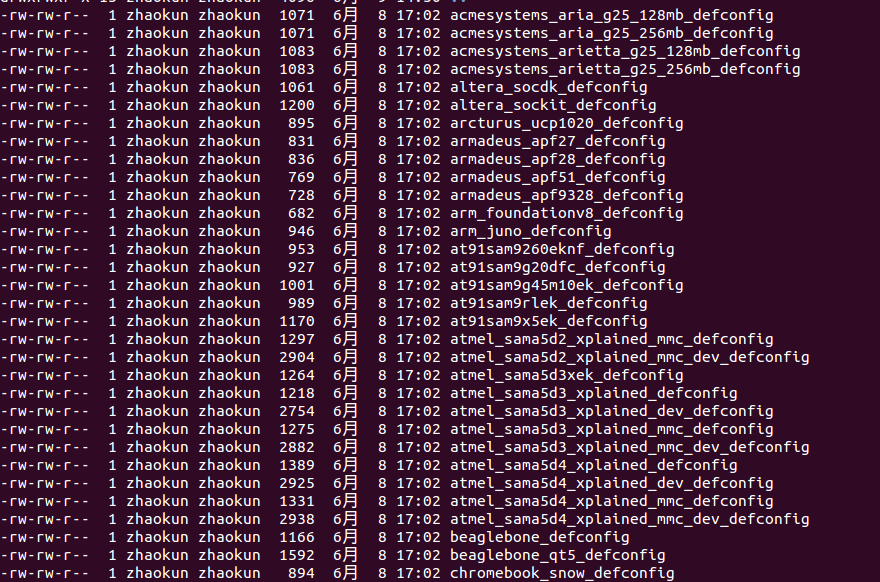
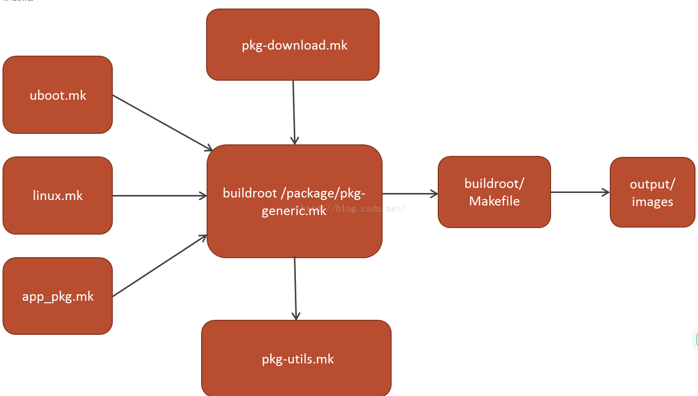
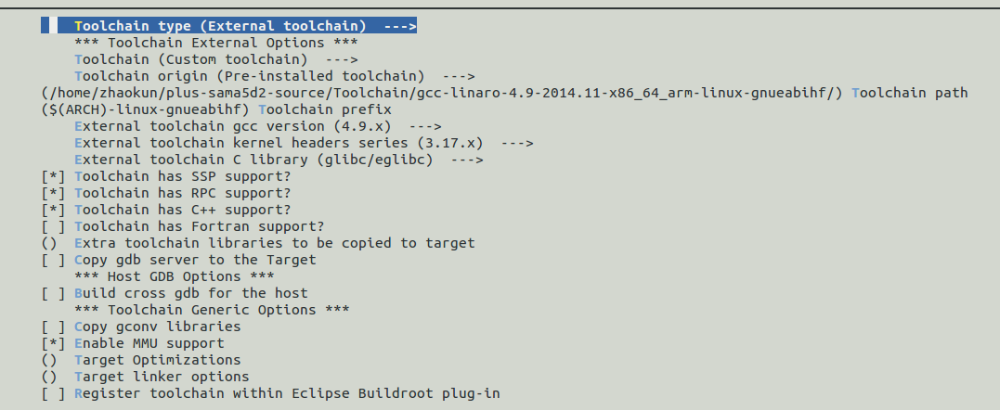
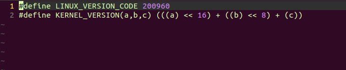
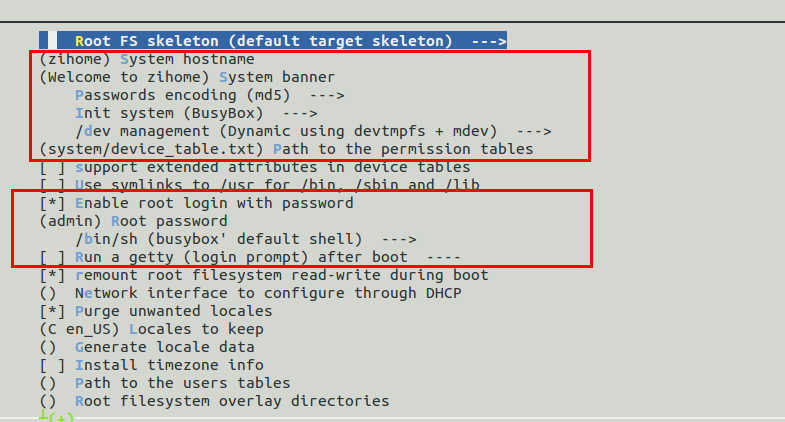
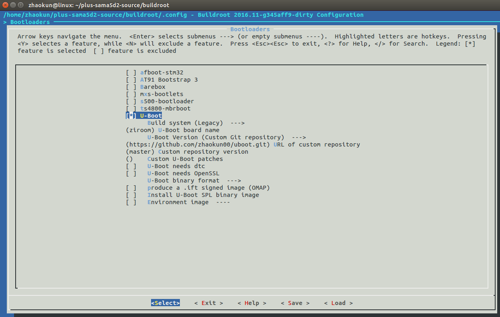
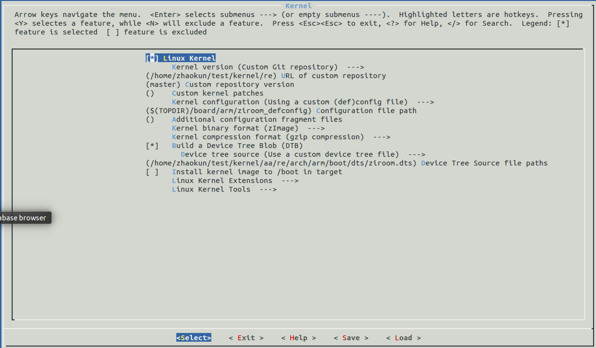
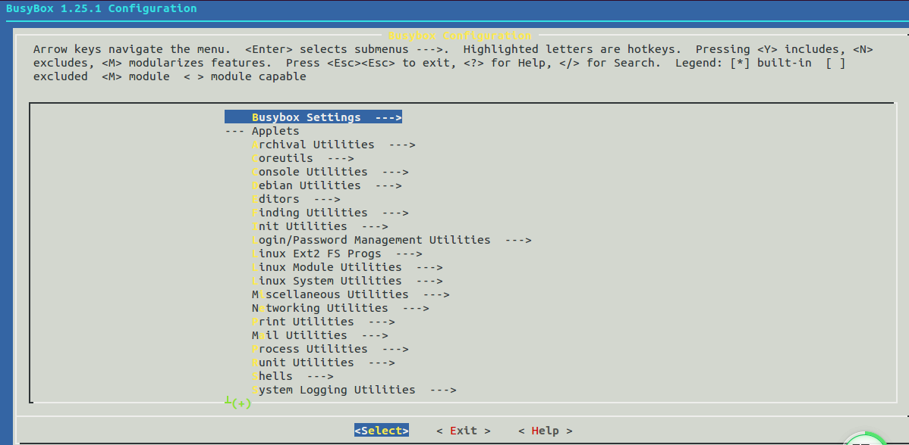

### buildroot知识点

[参考链接](https://www.cnblogs.com/ranson7zop/p/8027044.html)

#### 1.buildroot入门

##### 1.1 目录介绍

> 构建开源软件包的流程:(1)获取源代码(package目录下会存在各个软件包的源地址及安装地址) -->(2)解压源代码(dl目录下存储下载后的文件) -->(3)配置:根据环境准备构建过程(output/build目录存放编译后的文件)-->(4)安装:复制二进制和辅助文件到它们的目标目录(ouput/target、output/images目录)

```makefile
├── arch: 存放CPU架构相关的配置脚本，如arm/mips/x86,这些CPU相关的配置，在制作工具链时，编译uboot和kernel时很关键.
├── board
├── boot
├── CHANGES
├── Config.in
├── Config.in.legacy
├── configs: 放置开发板的一些配置参数. 
├── COPYING
├── DEVELOPERS
├── dl: 存放下载的源代码及应用软件的压缩包. 
├── docs: 存放相关的参考文档. 
├── fs: 放各种文件系统的源代码. 
├── linux: 存放着Linux kernel的自动构建脚本. 
├── Makefile
├── Makefile.legacy
├── output: 是编译出来的输出文件夹. 
│   ├── build: 存放解压后的各种软件包编译完成后的现场.
│   ├── host: 存放着制作好的编译工具链，如gcc、arm-linux-gcc等工具.
│   ├── images: 存放着编译好的uboot.bin, zImage, rootfs等镜像文件，可烧写到板子里, 让linux系统跑起来.
│   ├── staging
│   └── target: 用来制作rootfs文件系统，里面放着Linux系统基本的目录结构，以及编译好的应用库和bin可执行文件. (buildroot根据用户配置把.ko .so .bin文件安装到对应的目录下去，根据用户的配置安装指定位置)
├── package：下面放着应用软件的配置文件，每个应用软件的配置文件有Config.in和soft_name.mk。
├── README
├── support
├── system
└── toolchain

buildroot构建流程:
configs:配置文件目录,可以把不同的配置文件放到该目录中,在编译前可以进行选择使用哪种配置，因此可以一个buildroot支持不同的配置
package:buildroot所支持的开源项目的配置脚本,当选择使用不同的软件版本时，可以修改项目下的*.mk文件
dl:buildroot所下载的软件包
output/build:编译现场
output/images:编译的镜像文件,包括uboot、内核、文件系统等
output/target:编译的文件系统目录
```

##### 1.2 配置

```
使用buildroot步骤:
(1)选择一个defconfig
(2)根据需要配置buildroot
(3)编译buildroot
(4)在目标板上运行buildroot构建的系统
```

```
通过make xxx_defconfig来选择一个defconfig,这个文件在config目录下，然后通过make menuconfig进行配置
```



```
make menuconfig如下:
Target options  ---> 选择目标板架构特性      
Build options  --->  配置编译选项       
Toolchain  ---> 配置交叉工具链，使用buildroot工具链还是外部提供            
System configuration  --->  配置系统信息，例如欢迎语、登录用户名等等
Kernel  ---> 配置内核               
Target packages  ---> 配置应用软件包       
Filesystem images  ---> 配置文件系统    
Bootloaders  ---> 配置bootloader          
Host utilities  --->        
Legacy config options  --->       
```

##### 1.3 make命令使用

```makefile
make help
Cleaning:
  clean                  - delete all files created by build
  distclean              - delete all non-source files (including .config)

Build:
  all                    - make world
  toolchain              - build toolchain

Configuration:
  menuconfig             - interactive curses-based configurator-->对整个buildroot进行配置
  nconfig                - interactive ncurses-based configurator
  xconfig                - interactive Qt-based configurator
  gconfig                - interactive GTK-based configurator
  oldconfig              - resolve any unresolved symbols in .config
  silentoldconfig        - Same as oldconfig, but quietly, additionally update deps
  olddefconfig           - Same as silentoldconfig but sets new symbols to their default value
  randconfig             - New config with random answer to all options
  defconfig              - New config with default answer to all options
                             BR2_DEFCONFIG, if set, is used as input
  savedefconfig          - Save current config to BR2_DEFCONFIG (minimal config)-->保存menuconfig的配置
  allyesconfig           - New config where all options are accepted with yes
  allnoconfig            - New config where all options are answered with no
  randpackageconfig      - New config with random answer to package options
  allyespackageconfig    - New config where pkg options are accepted with yes
  allnopackageconfig     - New config where package options are answered with no

Package-specific:-->对package配置
  <pkg>                  - Build and install <pkg> and all its dependencies-->单独编译对应APP
  <pkg>-source           - Only download the source files for <pkg>
  <pkg>-extract          - Extract <pkg> sources
  <pkg>-patch            - Apply patches to <pkg>
  <pkg>-depends          - Build <pkg>'s dependencies
  <pkg>-configure        - Build <pkg> up to the configure step
  <pkg>-build            - Build <pkg> up to the build step
  <pkg>-show-depends     - List packages on which <pkg> depends
  <pkg>-show-rdepends    - List packages which have <pkg> as a dependency
  <pkg>-graph-depends    - Generate a graph of <pkg>'s dependencies
  <pkg>-graph-rdepends   - Generate a graph of <pkg>'s reverse dependencies
  <pkg>-dirclean         - Remove <pkg> build directory-->清除对应APP的编译目录
  <pkg>-reconfigure      - Restart the build from the configure step
  <pkg>-rebuild          - Restart the build from the build step

busybox:
  busybox-menuconfig     - Run BusyBox menuconfig

linux:
  linux-menuconfig       - Run Linux kernel menuconfig-->配置Linux并保存设置
  linux-savedefconfig    - Run Linux kernel savedefconfig
  linux-update-defconfig - Save the Linux configuration to the path specified
                             by BR2_LINUX_KERNEL_CUSTOM_CONFIG_FILE
                             
Documentation:
  manual                 - build manual in all formats
  manual-html            - build manual in HTML
  manual-split-html      - build manual in split HTML
  manual-pdf             - build manual in PDF
  manual-text            - build manual in text
  manual-epub            - build manual in ePub
  graph-build            - generate graphs of the build times
  graph-depends          - generate graph of the dependency tree
  graph-size             - generate stats of the filesystem size
  list-defconfigs        - list all defconfigs (pre-configured minimal systems)

Miscellaneous:
  source                 - download all sources needed for offline-build
  source-check           - check selected packages for valid download URLs
  external-deps          - list external packages used
  legal-info             - generate info about license compliance

  make V=0|1             - 0 => quiet build (default), 1 => verbose build
  make O=dir             - Locate all output files in "dir", including .config
  
比较常用命令:
make menuconfig:查看菜单
make all:编译所有
make uboot-menuconfig:配置uboot
make uboot:编译uboot
make linux-menuconfig:配置linux内核
make linux:编译linux
busybox-menuconfig:配置busybox
make busybox:编译busybox
```

#### 2.buildroot框架

```
buildroot提供了函数框架和变量命令框架，采用它的框架编写的app.mk这种makefile格式的自动构建脚本，将被package/pkg-generic.mk这个核心脚本展开并填充到buildroot主目录下的makefile中去，最后由make all执行buildroot主目录下的makefile，生成想要的image。package/pkg-generic.mk中通过调用同目录下的pkg-download.mk、pkg-utils.mk文件，已经自动实现了下载、解压、依赖包下载编译等一些列机械化流程。用户需要做的是按照写app.mk，填充下载地址，链接依赖库的名字等一些列的构建细节即可，总而言之，buildroot本身提供构建流程的框架，开发者按照格式写脚本，提供必要的构建细节，配置整个系统，最后自动构建出系统
```



对buildroot的配置通过Config.in串联起来,相同当linux内核中Kconfig,通过这个生成了菜单选项

| 配置选项                 | Config.in位置          |
| ------------------------ | ---------------------- |
| Target options           | arch/Config.in         |
| Build options            | Config.in              |
| Toolchain                | toolchain/Config.in    |
| System configuration     | system/Config.in       |
| Kernel                   | linux/Config.in        |
| Target packages          | package/Config.in      |
| Target packages->Busybox |                        |
| Filesystem images        | fs/Config.in           |
| Bootloaders              | boot/Config.in         |
| Host utilities           | package/Config.in.host |

#### 3.配置Toolchain

```makefile
Toolchain  --->   
        Toolchain type (External toolchain)  --->                 //工具链类型 [外部工具链]
        Toolchain External Options --->                           //外部工具链选项
        Toolchain (Custom toolchain)  --->                        //工具链 [自定义工具链]
        Toolchain origin (Toolchain to be downloaded and installed)  --->  //工具链来源
    ($(ARCH)-linux-gnueabihf) Toolchain prefix                    //工具链前缀 [arm-linux-gnueabihf]
        External toolchain gcc version (6.x)  --->                //外部工具链GCC版本 [6.x]
        External toolchain kernel headers series (4.6.x)  --->    //外部工具链内核头文件系列 [4.6.x]
        External toolchain C library (glibc/eglibc)  --->         //外部工具链C库 [glibc/eglibc]
```

实际应用中配置如下:



工具链内核版本:

gcc-linaro-4.9-2014.11-x86_64_arm-linux-gnueabihf/libc/usr/include/linux/version.h



200960的十六进制数据0x31100，那版本号就是3.11.0，因此工具链就选择3.11.0版本

#### 3.buildroot配置system configuration



```
system hostname:配置主机名
system banner:配置启动欢迎语
Enable root login with password:配置用户名及密码
Run a getty aftr:配置启动后，是否需要输入用户名和密码
```

#### 5.buildroot配置boot



```
U-Boot board name:配置编译时,使用的配置文件的名称,该配置文件不用放入到buildroot中,保持原样位置即可
U-Boot version(customer repository):配置uboot的git地址
Customer repository version:可以配置分支的名称或者提交的版本号

make uboot-menuconfig:配置uboot
make uboot:编译uboot
```

#### 6.buildroot配置kernel



```makefile
Kernel vesion(Customer Git repository):配置kernelgit地址
Customer repository version:配置分支名字或者提交版本号
Kernel configuration(Using a customer (def)config file):配置编译内核使用的配置文件
Build a Device a Tree Blob:配置设备树的配置文件

make linux-menuconfig:配置linux内核
make linux:编译linux
```

#### 5.buildroot配置filesystem



```
busybox-menuconfig:配置busybox
make busybox:编译busybox
```

#### 6.buildroot添加应用app

```
添加属于自己的应用app,遵循以下步骤:
(1)在package/Config.in中添加指向新增APP目录 -->告诉buildroot需要编译的文件
(2)在package中新增目录helloworld,并在里面添加Config.in和helloworld.mk -->告诉buildroot源文件版本、源文件、安装路径等信息
(3)添加对应的源码helloworld源文件及Makefile -->源文件目录
```

```makefile
步骤一:在package/Config.in中添加指向新增APP目录

vim package/Config.in

menu "Text editors and viewers"
    source "package/ed/Config.in"
    source "package/joe/Config.in"
    source "package/less/Config.in"
    source "package/mc/Config.in"
    source "package/nano/Config.in"
    source "package/uemacs/Config.in"
    source "package/vim/Config.in"
endmenu

#仿照上面进行编写
menu "Private package"
    source "package/helloworld/Config.in"
endmenu

```

```makefile
步骤二:在package中新增目录helloworld,并在里面添加Config.in

通过make menconfig可以对helloworld进行选择,只有当BR2_PACKAGE_HELLOWORLD=y条件下，才会调用helloworld.mk进行编译，相当于内核中的KConfig配置文件
Config.in文件内容如下:
config BR2_PACKAGE_HELLOWORLD
    bool "helloworld"
    help
      This is a demo to add local app.

```

```makefile
步骤二:在package中新增目录helloworld,并在里面添加helloworld.mk,源文件在本地
################################################################################
#
# helloworld
#
################################################################################

#版本
HELLOWORLD_VERSION:= 1.0.0
#源文件路径
HELLOWORLD_SITE:= $(CURDIR)/work/helloworld
#源文件是在本地还是远端
HELLOWORLD_SITE_METHOD:=local
HELLOWORLD_INSTALL_TARGET:=YES

#编译方法
define HELLOWORLD_BUILD_CMDS
    $(MAKE) CC="$(TARGET_CC)" LD="$(TARGET_LD)" -C $(@D) all
endef

#按照路径
define HELLOWORLD_INSTALL_TARGET_CMDS
    $(INSTALL) -D -m 0755 $(@D)/helloworld $(TARGET_DIR)/bin
endef

#权限修改
define HELLOWORLD_PERMISSIONS
    /bin/helloworld f 4755 0 0 - - - - -
endef

$(eval $(generic-package))
```

```
步骤二:在package中新增目录helloworld,并在里面添加helloworld.mk,源文件在git上
 HELLOWORLD_VERSION:=master--------------------------------------仓库分支名称
 HELLOWORLD_SITE:=http://.../dma.git-----------------------------仓库git地址
 HELLOWORLD_SITE_METHOD:=git-------------------------------------获取源码的方式
```

```
步骤二:参数解释
_VERSION结尾的变量是源码的版本号；_SITE_METHOD结尾的变量是源码下载方法；_SITE结尾变量是源码下载地址。

_BUILD_CMDS结尾的变量会在buildroot框架编译的时候执行，用于给源码的Makefile传递编译选项和链接选项，调用源码的Makefile。

_INSTALL_TARGET_CMDS结尾的变量是在编译完之后，自动安装执行，一般是让buildroot把编译出来的的bin或lib拷贝到指定目录。

$(eval$(generic-package)) 最核心的就是这个东西了，一定不能够漏了，不然源码不会被编译，这个函数就是把整个.mk构建脚本，通过Buildroot框架的方式，展开到Buildroot/目录下的Makfile中，生成的构建目标(构建目标是什么，还记得Makefile中的定义吗？)
```

```c
步骤三:添加对应的源码helloworld源文件及Makefile

helloworld.c文件内容:
#include <stdio.h>

void main(void)
{
    printf("Hello world.\n");
}

Makefile文件内容:
CPPFLAGS += 
LDLIBS += 

all: helloworld

helloworld: helloworld.o
	$(CC) $(CFLAGS) $(LDFLAGS) -o $@ $^ $(LDLIBS)

clean:
	rm -f *.o helloworld

.PHONY: all clean

```

```
使用:
配置:
make menuconfig --> Target packages --> Private package --> helloworld
编译:
(1)方式一:可以和整个平台一起编译APP,直接make
(2)单独编译:make helloworld
结果:
源文件都会被拷贝到output/build/hellworld-1.0.0文件中，然后生成的bin文件拷贝到output/target/bin/hellworld,此时整个文件就被打包到了文件系统中，如果需要清空相应的源文件，通过make helloworld-disclean

```

#### 7. buildroot某个包修改后重新编译

```shell
问题：buildroot中某一个包进行了修改，在重新编译前需要怎么处理？

例如修改了busybox下相关配置文件，需要进入output/build/busybox/路径下，删除.stamp_build 和.stamp_target_install文件。然后才能在buildroot目录下使用make all重新编译。

.stamp_configured, .stamp_downloaded, .stamp_patched,.stamp_extracted
其实每个工具包里都有这样的几个文件，这几个文件主要控制这个工具包的下载，解压，打包，配置，编译，安装。而根据我们的需要是要修改然后重新编译，安装即可。所以删除.stamp_built和.stamp_target_installed就可以啦。然后编译完了再进去看看。这两个文件又产生啦，如果我们仅仅是修改了文件，而没有删除这两个文件是不会编译的

参考链接:
https://blog.csdn.net/i13919135998/article/details/100772059
```

#### 8. buildroot 重新打包(打包一个新的根文件系统)

```shell
有时修改配置后，重新打包，要删除target中的旧包，一个个去找挺麻烦的。可以删除output/target目录，重新安装已经编译过的包，然后去打包。这样简单方便。

#删除旧的包
rm -rf output/target

#删除包安装记录
find . -name “.stamp_target_installed” -exec rm {} \;

#打包生成
make ARCH=arm CROSS_COMPILE=arm-linux-gnueabi- -j4

参考链接:
https://blog.csdn.net/nxjbill/article/details/106742863
```

