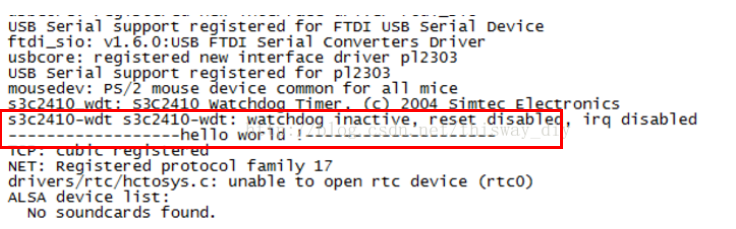

### kernel基本知识点

#### 1. 内核配置及编译

##### 1.1 内核配置[参考链接](https://blog.csdn.net/thisway_diy/article/details/76981113)

(1)直接输入make menuconfig命令,从头到尾配置菜单(由于非常复杂,不推荐)

a.make menuconfig时修改配置项时最终的配置结果会保存在.config中

b.执行make menuconfig时会读取.config文件

(2)通过make xxx_defconfig命令在默认的配置上进行修改，然后在输入make menuconfig配置菜单(xxx_defconfig为内核中的一个配置文件,目录在arch/arm/configs目录下,该目录下已经有很多不同型号的默认配置文件)

```shell
#查找defconfig文件
(1)find ./ -name *defconfig
#查找结果,可以看到文件都在arch/cpu各个目录下
./arch/avr32/configs/atngw100_defconfig
./arch/avr32/configs/atstk1002_defconfig
./arch/arm/configs/edb7211_defconfig
./arch/arm/configs/lusl7200_defconfig
./arch/arm/configs/shannon_defconfig
./arch/arm/configs/netx_defconfig
./arch/arm/configs/pleb_defconfig
./arch/arm/configs/lart_defconfig
./arch/arm/configs/pnx4008_defconfig
./arch/arm/configs/lpd7a404_defconfig
./arch/arm/configs/netwinder_defconfig
./arch/arm/configs/assabet_defconfig
./arch/arm/configs/cerfcube_defconfig
./arch/arm/configs/shark_defconfig
./arch/arm/configs/h7202_defconfig
./arch/arm/configs/jornada720_defconfig
./arch/arm/configs/ebsa110_defconfig
./arch/arm/configs/simpad_defconfig
./arch/arm/configs/carmeva_defconfig
./arch/arm/configs/s3c2410_defconfig

(2)由于使用的是arm架构,所以 cd  arch/arm/configs进入configs目录,如下图所示,发现与2440相像的就只有s3c2410_deconfig
./arch/arm/configs/s3c2410_defconfig

(3)通过make s3c2410_defconfig命令来配置
配置完后可以看出最后出现“configuration written to .config”，表示将所有config配置都写入到.config文件中
```

(3)使用厂家提供的配置文件

```shell
在linux-2.6.22.6目录下，使用cp config_ok  .config将config_ok复制覆盖新的.config隐藏文件
```

##### 1.2 内核编译

(1)输入make命令直接编译

```shell
make
Kernel: arch/arm/boot/Image is ready
Kernel: arch/arm/boot/zImage is ready
```

(2)输入make uImage命令生成uImage

```shell
make uImage
uImage内核文件:头部+zImage,uImge内核uboot可以直接使用,因为uboot支持的内核需要有头部信息

#注意：要想“ make uImage”成功，必须把编译 u-boot 时得到的 mkimage工具(该工具是在主机上运行的程序)复制到/usr/bin 目录下去。 mkimage 工具在 u-boot 源码下u-boot-1.1.6/tools 目录里
```

#### 2. linux内核中.config、kconfig、makefile

```makefile
Kconfig：文本形式,(1)用于内核的配置菜单 (2)包含其他Kconfig文件
Makefile:文本形式,用于提供编译源文件的方法
.config:最终生成的配置文件,编译内核所依据的配置
```

```c
示例(编写一个驱动程序,放到内核中):

(1)编写Kconfig文件,drivers/hello/Kconfig文件
#用于生成菜单使用,菜单的名称为HELLO
menu "HELLO"
#config用于定义一个变量HELLO,用于Makefile中使用,通过该变量用于决定该驱动是否被包含    
config HELLO
    #用于在显示菜单中显示
	tristate "xxx_HELLO"
    #用于在显示菜单总显示帮助信息
    help
    xxx_HELLO Support help
endmenu
    
(2)编写Makfile文件,drivers/hello/Makefile
    #该处CONFIG_HELLO变量在Kconfig中定义的变量,前面默认加上CONFIG_字符,通过该变量就可以决定是否包含hello.o文件
    
    obj-$(CONFIG_HELLO)        += hello.o
(3)编写源文件
#include <linux/module.h>
#include <linux/kernel.h>
#include <linux/init.h>

static int first_init(void)
{
        printk("Hello world\n");
        return 0;
}


static void first_exit(void)
{

}

//入口文件
module_init(first_init);
//出口文件
module_exit(first_exit);

MODULE_LICENSE("GPL");
(4)修改上层的Kconfig文件 --> 用于包含编写的Kconfig文件,显示菜单使用,drivers/Kconfig
source "drivers/mmc/Kconfig"
source "drivers/leds1/Kconfig"
#包含子目录的Kconfig文件
source "drivers/hello/Kconfig"
source "drivers/infiniband/Kconfig"
    
(5)修改上层的Makefile文件 --> 用于包含编写的源文件,指定哪些文件用于编译，哪些文件不用于编译,drivers/Makefile

obj-$(CONFIG_MMC)               += mmc/
obj-$(CONFIG_NEW_LEDS)          += leds1/
#通过在Kconfig中定义的变量,用于决定是否包含子目录,在该处直接写目录名即可,所编译的文件在子目录中定义
obj-$(CONFIG_HELLO)             += hello/
  
 (6)编译
 //编译内核,当把内核烧写到开发板中，通过内核的启动信息,查看打印信息看驱动信息是否编译进了内核
 make uImage
 //编译模块,生成.ko文件
 make modules
```



```makefile
自定义Kconfig菜单,理解menu/endmenu、bool、default、tristate、depends on、select关键字的作用
#定义菜单选项LED_TEST,将来用于显示菜单使用
menu "LED_TEST"
#用于定义变量CONFIG_BOOL_LEDS
config BOOL_LEDS
		#定义上面的变量类型为bool类型,在菜单中只能用于选择y/n
        bool "BOOL_led"
        #默认变量为y,即在菜单中为选中
        default y
        help
          BOOL_LEDS Support help

config tristate_LEDS
		#定义上面的变量类型为bool类型,在菜单中只能用于选择y/m/n
        tristate "tristate_led"
        help
          tristate_LEDS surrort help

config DEPENDS_LEDS
        bool "DEPENDS_led"
        #依赖含义，该菜单选中,依赖于BOOL_LEDS变量,只有当BOOL_LEDS变量选中时,该变量才能进行选择，在菜单中的表现是只有上面的菜单选中时,该菜单才能显示出来，以供进行选择
        depends on BOOL_LEDS
        help
          DEPENDS_LEDS support help

config SELECT_LEDS
        bool "SELECT_led"
        #反向选择含义,当SELECT_LEDS变量选中时,下面的选项同时会被选中
        select SELECT_LEDS_ITEM
        help
          SELECT_LEDS support help

config SELECT_LEDS_ITEM
bool "SELECT_LEDS_ITEM"
        help
          SELECT_LEDS_ITEM support help

config INT_DEFAULT_LEDS
		#定义int类型,默认值为100
        int "INT_DEFAULT_LEDS"
        default 100
        help
          INT_DEFAULT_LEDS support help

config STRING_DEFAULT_LEDS
		#定义字符串类型数据,默认值为STRING_DEFAULT_LEDS
        string "STRING_DEFAULT_LEDS"
        default "STRING_DEFAULT_LEDS"
        help
          STRING_DEFAULT_LEDS  support help
endmenu
```

```Makefile
Kconfig文件详细解释
作用:决定make menuconfig时展示的菜单项
(1)每个config菜单项都有类型定义:bool布尔类型、tristate三态类型(内建、模块、移除)、integer整型、string字符串、hex十六进制
1.1 bool类型:此类型只能选中或不选中，make menuconfig时显示为[ ]，即无法配置成模块
1.2 Tristate类型:选择Y就是直接编进内核，会在.config中生成一个 CONFIG_HELLO=y的配置项,假如选择编译成内核模块，则会在.config中生成一个 CONFIG_HELLO=m的配置
1.3 depend on:该选项依赖于另一个选项，只有当依赖项被选中时，当前配置项的提示信息才会出现，才能设置当前配置项。
1.4 select:反向依赖关系，该选项选中时，同时选中select后面定义的那一项
1.5 目录层次迭代:
Kconfig中有类似语句：source "drivers/usb/Kconfig" ，用来包含（或嵌套）新的Kconfig文件，使得各个目录管理各自的配置内容，不必把那些配置都写在同一个文件里，方便修改和管理
```

```makefile
.config文件详细解释
作用:内核编译参考文件,查看里面内容可以知道哪些驱动被编译进内核
配置内核方式有3种(任选其一)：
(1)make menuconfig
(2)make xxx_defconfig
(3)直接修改.config

注意: 如果直接修改.config，不一定会生效，因为有些配置可能存在依赖关系，make时会根据依赖关系，进行规则的检查，直接修改.config有时无效，所以不推荐直接修改
```

```makefile
Makefile文件详细解释
作用:用来定义哪些内容作为模块编译，哪些条件编译等。子目录Makefile被顶层Makefile包含

(1)直接编译
obj-y      +=xxx.o                
表示由xxx.c或xxx.s编译得到xxx.o并直接编进内核。

(2)条件编译
obj -$(CONFIG_HELLO)  +=xxx.o   
根据.config文件的CONFIG_XXX来决定文件是否编进内核。

(3)模块编译
obj-m     +=xxx.o
```
