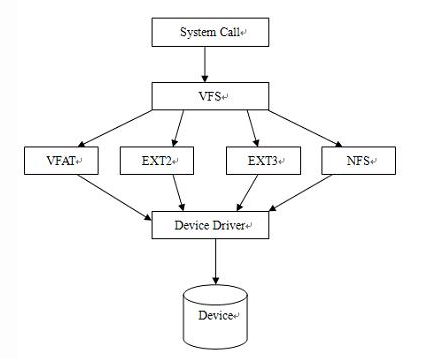
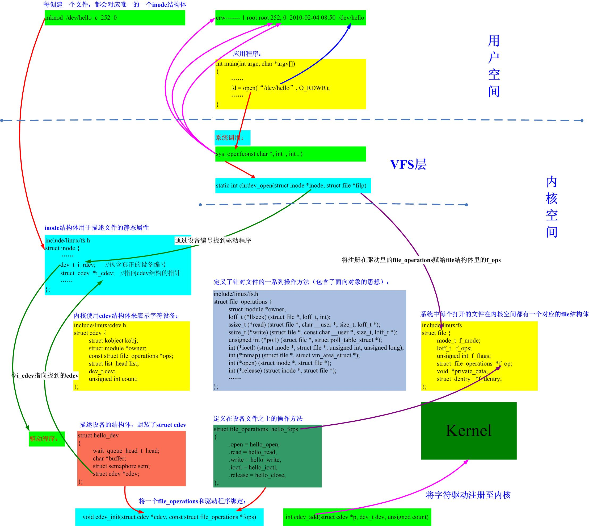

### 文件系统基本知识点

##### 1. 文件系统定义及作用

```shell
1.在存储设备上组织文件的一种机制，是操作系统用于确定位于存储设备上的文件的一种方法和数据结构

```

```
虚拟文件系统
1.linux中允许众多不同的文件系统共存，通过使用同一套文件I/O系统调用即可。对linux中的任意文件进行操作而无需考虑其所在的具体文件系统格式
2.虚拟文件系统是linux内核中的一个软甲层，用于给用户空间的程序提供文件系统接口，同时它也提供了内核中的一个抽象功能，允许不同的文件系统共存，系统中所有的文件系统不但依赖VFS共存，而且也依靠VFS协同工作
3.为了能够支持各种实际文件系统，VFS定义了所有文件系统都支持的基本的、概念上的接口和数据结构；同时实际文件系统也提供VFS所期望的抽象接口和数据结构，将自身的诸如文件、目录等概念在形式上与VFS的定义保持一致。换句话说，一个实际的文件系统想要被linux支持，就必须提供一个符合VFS标准的接口，才能与VFS协同工作，实际文件系统在统一的接口和数据下隐藏了具体的实现细节
```



##### 2. 各种文件系统对比

文件系统在挂载时间、I/O性能、内存使用、掉电恢复、FLASH寿命进行对比


##### 3. linux设备文件3大结构 inode，file，file_operation

```c
//include/linux/fs.h
 596 /*
 597  * Keep mostly read-only and often accessed (especially for
 598  * the RCU path lookup and 'stat' data) fields at the beginning
 599  * of the 'struct inode'
 600  */
 601 struct inode {
 602         umode_t                 i_mode;
 604         kuid_t                  i_uid;
 605         kgid_t                  i_gid;
 606         unsigned int            i_flags;
 630         union {
 631                 const unsigned int i_nlink;
 632                 unsigned int __i_nlink;
 633         };
 634         dev_t                   i_rdev;
 635         loff_t                  i_size;
 636         struct timespec         i_atime;
 637         struct timespec         i_mtime;
 638         struct timespec         i_ctime;
 668         union {
 669                 struct hlist_head       i_dentry;
 670                 struct rcu_head         i_rcu;
 671         };
 672         u64                     i_version;
 673         atomic_t                i_count;
 674         atomic_t                i_dio_count;
 675         atomic_t                i_writecount;
 679         const struct file_operations    *i_fop; /* former ->i_op->default_file_ops */
 681         struct address_space    i_data;
 682         struct list_head        i_devices;
 683         union {
 684                 struct pipe_inode_info  *i_pipe;
 685                 struct block_device     *i_bdev;
 686                 struct cdev             *i_cdev;
 687                 char                    *i_link;
 688                 unsigned                i_dir_seq;
 689         };
 702         void                    *i_private; /* fs or device private pointer */
 703 };    
```

```shell
#主要成员:
struct inode
--602-->i_mode表示访问权限控制
--604-->UID
--605-->GID
--606-->i_flags文件系统标志
--630-->硬链接数计数
--635-->i_size以字节为单位的文件大小
--636-->最后access时间
--637-->最后modify时间
--638-->最后change时间
--669-->i_dentry; //目录项链表
--673-->i_count引用计数,当引用计数变为0时，会释放inode实例
--675-->i_writecount写者计数
--679-->创建设备文件的时候i_fops填充的是def_chr_fops,blk_blk_fops,def_fifo_fops,bad_sock_fops之一,参见创建过程中调用的init_special_inode()
--683-->特殊文件类型的union,pipe,cdev,blk.link etc,i_cdev表示这个inode属于一个字符设备文件，本文中创建设备文件的时候会把与之相关的设备号的驱动对象cdev拿来填充
--702-->inode的私有数据
```

```c
//include/linux/fs.h
 877 struct file {
 878         union {
 879                 struct llist_node       fu_llist;
 880                 struct rcu_head         fu_rcuhead;
 881         } f_u;
 882         struct path             f_path;
 883         struct inode            *f_inode;       /* cached value */
 884         const struct file_operations    *f_op;
 885 
 886         /*                                            
 887          * Protects f_ep_links, f_flags.
 888          * Must not be taken from IRQ context.
 889          */
 890         spinlock_t              f_lock;
 891         atomic_long_t           f_count;
 892         unsigned int            f_flags;
 893         fmode_t                 f_mode;
 894         struct mutex            f_pos_lock;
 895         loff_t                  f_pos;
 896         struct fown_struct      f_owner;
 897         const struct cred       *f_cred;
 898         struct file_ra_state    f_ra;f
 904         /* needed for tty driver, and maybe others */
 905         void                    *private_data;
 912         struct address_space    *f_mapping;
 913 } __attribute__((aligned(4)));  /* lest something weird decides that 2 is OK */
```

```shell
#主要成员:
struct file
--882-->f_path里存储的是open传入的路径，VFS就是根据这个路径逐层找到相应的inode
--883-->f_inode里存储的是找到的inode
--884-->f_op里存储的就是驱动提供的file_operations对象，这个对象应该在第一次open()的时候被填充，具体地，应用层的open通过层层搜索会调用inode.i_fops->open()，即chrdev_open()
--891-->f_count的作用是记录对文件对象的引用计数，也即当前有多少个使用CLONE_FILES标志克隆的进程在使用该文件。典型的应用是在POSIX线程中。就像在内核中普通的引用计数模块一样，最后一个进程调用put_files_struct()来释放文件描述符。
--892-->f_flags当打开文件时指定的标志，对应系统调用open的int flags，比如驱动程序为了支持非阻塞型操作需要检查这个标志是否有O_NONBLOCK。
--893-->f_mode;对文件的读写模式，对应系统调用open的mod_t mode参数，比如O_RDWR。如果驱动程序需要这个值，可以直接读取这个字段。
--905-->private_data表示file结构的私有数据
```

