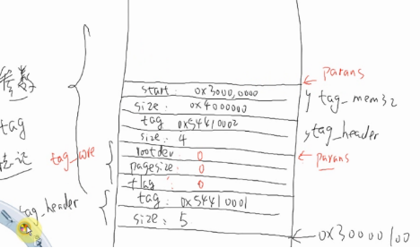
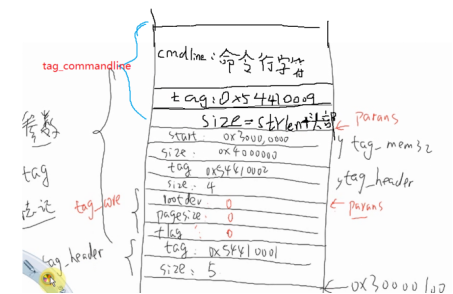
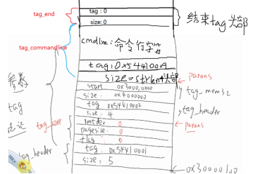

### uboot流程分析

#### 1.make 100ask24x0_config指令分析

(1)执行make 100ask24x0_config用来配置芯片选型，在Makefile中它执行以下代码，路径u-boot-1.1.6/Makefile

在uboot根目录下执行该命令时,100ask24x0_config为Makefile文件中的一个目标,而非在目录中的一个文件

```makefile
#CURDIR是make的内嵌变量，为当前目录
87 SRCTREE    := $(CURDIR)                             
92 MKCONFIG    := $(SRCTREE)/mkconfig
1886 100ask24x0_config    :    unconfig
1887 @$(MKCONFIG) $(@:_config=) arm arm920t 100ask24x0 NULL s3c24x0
```

```shell
在第87行中，$(SRCTREE)等于$(CURDIR)，也就是当前目录u-boot-1.1.6，所以MKCONFIG=./mkconfig
在第1886~1887行中，$(@:_config=)的结果就是将 “100ask24x0_config” 中的 “_config” 去掉， 结果为 “100ask24x0“

实际执行:
$0       $1         $2  $3      $4         $5   $6
mkconfig 100ask24x0 arm arm920t 100ask24x0 NULL s3c24x0

#mkconfig为一个文件
```

(2)打开mkconfig文件

```makefile
06 # Parameters: Target Architecture CPU Board [VENDOR] [SOC]

在第6行中给出了mkconfig的用法，刚好对应mkconfig(参数) 100ask24x0(目标) arm(架构) arm920t(cpu) 100ask24x0(开发板选型) NULL(供应商) s3c24x0(片上系统/芯片)
```

```makefile
11 APPEND=no # Default: Create new config file
12 BOARD_NAME="" # Name to print in make output
13
14 while [ $# -gt 0 ] ; do
15 case "$1" in
16 --) shift ; break ;;
17 -a) shift ; APPEND=yes ;;
18 -n) shift ; BOARD_NAME="${1%%_config}" ; shift ;;
19 *) break ;;
20 esac
21 done
22
23 [ "${BOARD_NAME}" ] || BOARD_NAME="$1"
24
```

```shell
对于“./mkconfig 100ask24x0 arm arm920t smdk2410 NULL s3c24x0”命令，其中没有“--” 、“-a” 、 “-n”等符号，所以第 14～22行没做任何事情。第11、12 行两个变量仍维持原来的值。

执行23行时，||表示左边命令为假时，则执行BOARD_NAME="$1",由于BOARD_NAME一直为空所以执行BOARD_NAME 的值等于第 1个参数，即“100ask24x0” 。

同样 mkconfig="$0", 
s3c24x0="$6"
```

```makefile
25 [ $# -lt 4 ] && exit 1
26 [ $# -gt 6 ] && exit 1
```

```shell
第25,26行中，其中$#表示总参数个数，-lt为小于(less than),-gt为大于(greater than),&&表示左边命令为真则执行"exit 1",跳出执行。
由于总参数个数为6，所以不满足25,26行条件，所以不跳出继续执行
```

```makefile
31 echo "Configuring for ${BOARD_NAME} board..."           #打印Configuring for ${BOARD_NAME} board...　　
```

```makefile
33 if [ "$SRCTREE" != "$OBJTREE" ] ; then                 *判断SRCTREE的字符是否不等于OBJTREE，若等于执行else
34~44 ... ...                                             *SRCTREE和OBJTREE是相等的，所以这里不执行
45 else                                                   *等于执行else
46 cd ./include                                       *打开子目录include/ 
47  rm -f asm                                     *删除之前连接名为asm的文件
48  ln -s asm-$2 asm                              *重新建立一个asm连接文件，指向asm-arm文件(表示选择使用arm架构文件)
49 fi
 
51 rm -f asm-$2/arch                                   *rm -f asm-arm/arch 
53 if [ -z "$6" -o "$6" = "NULL" ] ; then             *判断为假，执行ELSE语句 
54 ln -s ${LNPREFIX}arch-$3 asm-$2/arch
55 else
56 ln -s ${LNPREFIX}arch-$6 asm-$2/arch *ln -s arch-s3c24x0 asm-arm/arch
57 fi
59 if [ "$2" = "arm" ] ; then                         *判断为真，$2="arm"
60 rm -f asm-$2/proc *rm -f asm-arm/proc 
61 ln -s ${LNPREFIX}proc-armv asm-$2/proc *ln -s proc-armv asm-arm/proc 
62 fi
 
67 echo "ARCH = $2" > config.mk                         *">":新建config.mk文件，里面内容为ARCH = arm
68 echo "CPU = $3" >> config.mk                         *">>":追加内容
69 echo "BOARD = $4" >> config.mk 
71 [ "$5" ] && [ "$5" != "NULL" ] && echo "VENDOR = $5" >> config.mk             *判断$5存在且不等于NULL
72
73 [ "$6" ] && [ "$6" != "NULL" ] && echo "SOC = $6" >> config.mk                *判断$6存在且不等于NULL
```

```shell
第67~73行执行完后，路径:u-boot-1.1.6/include/config.mk内容为：(该文件自动生成,将来会把里面的内容export出去，作为环境变量使用，在顶层的Makefile中使用该环境变量，用于确定架构-->用于确定工具链)
  ARCH = arm
  CPU = arm920t
  BOARD = 100ask24x0
  SOC = s3c24x0
```

```makefile
78 if [ "$APPEND" = "yes" ]        *在mkconfig第11行中，APPEND=no，所以执行else语句创建config.h 
79 then
80 echo >> config.h
81 else
82 > config.h    # Create new config file
83 fi
84 echo "/* Automatically generated - do not edit */" >>config.h      #追加内容
85 echo "#include <configs/$1.h>" >>config.h                          #追加内容<br>87 exit 0  
```

```shell
第84~85行执行完后，u-boot-1.1.6/include/config.h内容为：
/* Automatically generated - do not edit */
#include <configs/100ask24x0.h
```

```shell
总结:
	(1)执行make 100ask24x0_config涉及的文件,Makefile->mkconfig->config.mk config.h
	(2)先配置(由于uboot支持不同架构的cpu，即使相同架构也区分不同的开发板)，后编译
```

#### 2.make指令

```shell
使用make指令来生成uboot.bin文件
```

(1)分析make指令,首先打开u-boot-1.1.6/Makefile文件:

```makefile
117 include $(OBJTREE)/include/config.mk               #调用include/config.mk的文件
118 
...
124 ifeq ($(ARCH),ppc)                                 
125 CROSS_COMPILE = powerpc-linux- 
126 endif
#判断config.mk这个文件中ARCH是否等于arm
127 ifeq ($(ARCH),arm)                                 
128 CROSS_COMPILE = arm-linux- 
129 endif
...
164 include $(TOPDIR)/config.mk						   #调用顶层的config,mk文件
```

```makefile
因为执行了make 100ask24x0_config 后,其中include/config.mk内容为：

ARCH = arm
CPU = arm920t
BOARD = 100ask24x0
SOC = s3c24x0

由于ARCH=arm,所以第127行为真，执行第128行语句使用arm-linux-来制定交叉编译器前缀。
其中第164行的config.mk是属于顶层目录的config,主要通过arm，arm920t，100ask24x0，s3c24x0来确定编译器、编译选项等
```

(2)config.mk(主要作用如下几段):

```makefile
45 PLATFORM_LDFLAGS =
...
88 BOARDDIR = $(BOARD)                                        #$(BOARD)=100ask24x0
...
91 sinclude $(TOPDIR)/board/$(BOARDDIR)/config.mk             #调用board下的config,mk文件,将来uboot代码段会在该处的内存地址处 board/100ask24x0/config.mk中第25行"TEXT_BASE=0x33F80000."
...
143 LDSCRIPT := $(TOPDIR)/board/$(BOARDDIR)/u-boot.lds        //LDSCRIPT=.//board/100ask24x0/u-boot.lds
...
189 LDFLAGS += -Bstatic -T $(LDSCRIPT) -Ttext $(TEXT_BASE) $(PLATFORM_LDFLAGS)
通过grep查找内容指令可以看出u-boot设置的TEXT_BASE地址为0x33F80000(若boot太大或SDRAM太小，可以减小TEXT_BASE基地址)
相当于向LDFLAGS内容中追加了"-T board/100ask24x0/u-boot.lds -Ttext 0x33F80000"字段，(LDFLAGS:属于u-boot第四个依赖文件)
```

(3)Makefile分析

```makefile
169 OBJS = cpu/$(CPU)/start.o                                //u-boot需要的目标文件，OBJS等于目标文件cpu/$(CPU)/start.o 
... 
193 LIBS = lib_generic/libgeneric.a                          //u-boot需要的库文件，LIBS等于库文件lib_generic/libgeneric.a  
194 LIBS += board/$(BOARDDIR)/lib$(BOARD).a                  //追加库文件board/100ask24x0/lib100ask24x0.a 
195 LIBS += cpu/$(CPU)/lib$(CPU).a                           //追加库文件cpu/arm920t/libarm920t.a 
...
 
214 LIBS := $(addprefix $(obj),$(LIBS))                      //addprefix为加前缀函数，其中obj=空，所以LIBS地址不变
 
 
...
222 SUBDIRS = tools \                       　　　        //SUBDIRS伪命令:用来执行tools,examples,post,post\cpu子目录下面的make文件。
223 examples \
224 post \
225 post/cpu
...
239 ALL = $(obj)u-boot.srec $(obj)u-boot.bin $(obj)System.map $(U_BOOT_NAND)    //all的依赖文件
240
241 all:    $(ALL)                                                          //使用make命令,相当于执行make all 
...
249 $(obj)u-boot.bin:   $(obj)u-boot                                            //生成u-boot.bin需要elf格式的u-boot，elf也就是通过ld链接文件生成的。
250 $(OBJCOPY) ${OBJCFLAGS} -O binary $< $@                                 //执行:arm-linux-objcopy -O binary u-boot u-boot.bin
...
 
262 $(obj)u-boot:   depend version $(SUBDIRS) $(OBJS) $(LIBS) $(LDSCRIPT)      //生成elf格式的u-boot所需要的依赖文件
263 UNDEF_SYM=`$(OBJDUMP) -x $(LIBS) |sed -n -e 's/.*\(__u_boot_cmd_.*\)/-u\1/p'|sort|uniq`;\
264 cd $(LNDIR) && $(LD) $(LDFLAGS) $$UNDEF_SYM $(__OBJS) \                       
265 --start-group $(__LIBS) --end-group $(PLATFORM_LIBS) \
266 -Map u-boot.map -o u-boot
```

```shell
在第263行和266行翻译出内容如下所示:
UNDEF_SYM=`arm-linux-objdump -x lib_generic/libgeneric.a board/100ask24x0/lib100ask24x0.a cpu/arm920t/libarm920t.a cpu/arm920t/s3c24x0/libs3c24x0.a lib_arm/libarm.a fs/cramfs/libcramfs.a fs/fat/libfat.afs/fdos/libfdos.a fs/jffs2/libjffs2.a fs/reiserfs/libreiserfs.a fs/ext2/libext2fs.a net/libnet.a disk/libdisk.a rtc/librtc.a dtt/libdtt.a drivers/libdrivers.a drivers/nand/libnand.a drivers/nand_legacy/libnand_legacy.a drivers/usb/libusb.a drivers/sk98lin/libsk98lin.a common/libcommon.a

 |sed -n -e 's/.*\(__u_boot_cmd_.*\)/-u\1/p'|sort|uniq`;\

cd /work/system/u-boot-1.1.6 &&
arm-linux-ld -Bstatic -T /work/system/u-boot-1.1.6/board/100ask24x0/u-boot.lds -Ttext 0x33F80000 
$UNDEF_SYM cpu/arm920t/start.o \
--start-group 
lib_generic/libgeneric.a board/100ask24x0/lib100ask24x0.a 
cpu/arm920t/libarm920t.a cpu/arm920t/s3c24x0/libs3c24x0.a lib_arm/libarm.a 
fs/cramfs/libcramfs.a fs/fat/libfat.a fs/fdos/libfdos.a fs/jffs2/libjffs2.a
fs/reiserfs/libreiserfs.a fs/ext2/libext2fs.a net/libnet.a disk/libdisk.a 
rtc/librtc.a dtt/libdtt.a 
drivers/libdrivers.a 
drivers/nand/libnand.a 
drivers/nand_legacy/libnand_legacy.a 
drivers/usb/libusb.a 
drivers/sk98lin/libsk98lin.a 
common/libcommon.a 
--end-group -L 
/work/tools/gcc-3.4.5-glibc-2.3.6/lib/gcc/arm-linux/3.4.5 -lgcc \
-Map u-boot.map -o u-boot
在第263行和266行就是在制作elf格式的u-boot, 其中$(LIBS)和$(__LIBS)就是库文件，$(LD)为连接选项，$(__OBJS)为目标文件，
 $(LDFLAGS)指定程序的布局与地址,为"/work/system/u-boot-1.1.6/board/100ask24x0/u-boot.lds -Ttext 0x33F80000 ..."
```

4.board/100ask24x0/u-boot.lds文件如下所示：

```makefile
    OUTPUT_ARCH(arm)                        #设置输出文件的体系架构。
    ENTRY(_start)                           #将_start这个全局符号设置成入口地址,进行复位初始化，该处个start.S中的_start处相对应
SECTIONS                                    #输出文件的内容布局
{
. = 0x00000000;                             #指定地址0x00000000,最终运行地址在0x33F80000+0x00000000
 
. = ALIGN(4);                                #代码以4字节对齐
.text :                                      #指定.text section段(位于0x33F80000)
{
cpu/arm920t/start.o (.text)                  #添加第一个目标文件cpu/arm920t/start.o里面的.text代码段
board/100ask24x0/boot_init.o (.text)         #添加第二个目标文件board/100ask24x0/boot_init.o里面的.text代码段
*(.text)                                     #*(.data) 表示添加剩下的全部文件的.text代码段
}
 
. = ALIGN(4);
.rodata : { *(.rodata) }                     #指定.rodata section段(位于0x33F80000+.text section),将所有的.rodata只读数据段合并成一个.rodata只读数据段
 
. = ALIGN(4);
.data : { *(.data) }                           #指定读写数据段
 
. = ALIGN(4);
.got : { *(.got) }                             #指定got段，got段是uboot自定义的一个段
 
. = .;
__u_boot_cmd_start = .;                        # 把__u_boot_cmd_start赋值为当前位置, 即起始位置
.u_boot_cmd : { *(.u_boot_cmd) }               # u_boot_cmd段，所有的u-boot命令相关的定义都放在这个位置
__u_boot_cmd_end = .;                          # *u_boot_cmd段结束位置
 
. = ALIGN(4);
__bss_start = .;                               #把__bss_start赋值为当前位置,即bss段的开始位置
.bss : { *(.bss) }                             #指定bss段，这里NOLOAD的意思是这段不需装载，仅在执行域中才会有这段
_end = .;                                      #把_end赋值为当前位置,即bss段的结束位置
}
```

```shell
总结:
	(1)make指令指定了哪些文件需要进行编译
	(2)链接脚本中指定了uboot最终运行的内存地址
```

#### 3.目标文件start.o中.globl 和.balignl理解

```ASM
.globl _start  
作用:声明一个_start全局符号（Symbol）, 这个_start这个符号要被lds链接脚本用到

.balignl 16,0xdeadbeef
　　
作用:以当前地址开始，在地址为16的倍数的指令位置的上一个指令填入为0xdeadbeef的内容
```

实例,在start.o中有以下几段:

```assembly
1 .globl _start                             // .globl定义一个全局符号"_start",表明_start这个符号要被链接器用到 
2 _start:                                     //_start：系统复位设置,以下共8种不同的异常处理
3 b reset                                   //复位异常             0x0
4 ldr   pc, _undefined_instruction          //未定义的指令异常       0x4
5 ldr   pc, _software_interrupt             // 软件中断异常          0x8 
6 ldr   pc, _prefetch_abort                 //内存操作异常           0xc
7 ldr   pc, _data_abort                     //数据异常               0x10
8 ldr   pc, _not_used                       //未使用                 0x14
9 ldr   pc, _irq                            //中断IRQ异常            0x18
10 ldr  pc, _fiq                          //快速中断FIQ异常        0x1c
11 
12 _undefined_instruction:  .word undefined_instruction         //0x20
13 _software_interrupt: .word software_interrupt               //0x24
14 _prefetch_abort: .word prefetch_abort                  // 0x28
15 _data_abort: .word data_abort                          //0x2c
16 _not_used:   .word not_used                              //0x30
17 _irq:    .word irq                                       //0x34
18 _fiq:    .word fiq                                       //0x38
19 
20 .balignl 16,0xdeadbeef                                  //0x3c
```

```tex
在第1行中".globl _start":

使用.globol声明全局符号_start,在 board/100ask24x0/u-boot.lds中ENTRY(_start)这里用到_start是一个符号，符号在汇编程序中代表一个地址，然后在lds链接脚本中通过这个_start全局符号来跳转到_start所在的地址来进行复位异常处理。

第20行中 .balignl 16,0xdeadbeef:

它的意思就是在以当前地址开始，在地址为16的倍数的指令位置的上一个指令填入为0xdeadbeef的内容,

此时当前地址刚好0x3c=60,由于ARM每个指令间隔4个字节,且64%16=0,所以在0x3c中填入0xdeadbeef。仿真如下图所示,可以看出在0X3C处填入了0xdeadbeef.
它们的作用就是为内存做标记，插在那里，这个位置往前有特殊作用的内存，禁止访问。
```

#### 4.uboot第一个执行函数_start(cpu/arm920t/start.S)分析

```assembly
1 .globl _start                      # .globl定义一个全局符号"_start",表明_start这个符号要被链接器用到 
2 _start:                            #_start：系统复位设置,以下共8种不同的异常处理
3 b reset                             #复位异常 0x0
4 ldr    pc, _undefined_instruction                 #未定义的指令异常 0x4
5 ldr    pc, _software_interrupt                 # 软件中断异常 0x8 
6 ldr    pc, _prefetch_abort                 #内存操作异常 0xc
7 ldr    pc, _data_abort                 #数据异常 0x10
8 ldr    pc, _not_used                 #未使用 0x14
9 ldr    pc, _irq                   #中断IRQ异常 0x18
10 ldr    pc, _fiq                 #快速中断FIQ异常 0x1c
11 
12 _undefined_instruction:    .word undefined_instruction                 #0x20
13 _software_interrupt:    .word software_interrupt                       #0x24
14 _prefetch_abort:    .word prefetch_abort             # 0x28
15 _data_abort:    .word data_abort                     #0x2c
16 _not_used:    .word not_used                        #0x30
17 _irq:    .word irq                                  #0x34
18 _fiq:    .word fiq                                  #0x38
19 
20 .balignl 16,0xdeadbeef                              #0x3c
```

在第1行中".globl _start":使用.globol声明全局符号_start,在 board/100ask24x0/u-boot.lds中ENTRY(_start)这里用到其中符号保存的地址都在顶层目录/system.map中列出来了,system.map文件开头部分如下：

```assembly
33f80000 t $a 
33f80000 T _start                   #_start符号被链接在33f80000,其中33f80000是生成bin文件的运行启始地址.
33f80020 t $d 
33f80020 t _undefined_instruction   #_undefined_instruction符号被链接在33f80020
...
33f80160 t undefined_instruction #_undefined_instruction指向的undefined_instruction符号被链接在33f80160
33f801c0 t software_interrupt
33f80220 t prefetch_abort
33f80280 t data_abort
33f802e0 t not_used
33f80340 T Launch
33f803b0 t On_Steppingstone
33f80400 t irq
...
```

继续往下看start.S

```assembly
reset: 
/* 设置CPSR程序程序状态寄存器为管理模式   */                           
  mrs    r0,cpsr                   #MRS读出CPSR寄存器值到R0
  bic    r0,r0,#0x1f               #将R0低5位清空
  orr    r0,r0,#0xd3               #R0与b'110 10011按位或,禁止IRQ和FIQ中断,10011：复位需要设为管理模式(图1)
  msr    cpsr,r0                   #MSR写入CPSR寄存器

/* 关看门狗   */      
# define pWTCON        0x53000000          //(WitchDog Timer)看门狗定时器寄存器WTCON，设为0X0表示关闭看门狗
# define INTMOD     0X4A000004        //(Interrupt Mode)中断模式寄存器INTMOD,相应位=0:IRQ模式，相应位=1:IRQ模式，
# define INTMSK        0x4A000008            //(Interrupt Mask)中断屏蔽寄存器INTMSK，相应位=0:开启中断服务，相应位=1:关闭中断服务
# define INTSUBMSK    0x4A00001C        #中断次级屏蔽寄存器，相应位=0:开启中断服务，相应位=1:关闭中断服务
# define CLKDIVN    0x4C000014            #时钟分频寄存器

#if defined(CONFIG_S3C2400) || defined(CONFIG_S3C2410)        #宏定义CONFIG_S3C2410已定义
    ldr     r0, =pWTCON                                         #R0等于WTCON地址
    mov     r1, #0x0                                            #R1=0x0
    str     r1, [r0]                                            #关闭WTCON寄存器,pWTCON=0;
/* 关中断   */  
    mov    r1, #0xffffffff                                         #R1=0XFFFF FFFF
    ldr    r0, =INTMSK                                             #R0等于INTMSK地址
    str    r1, [r0]                                                //*0x4A000008=0XFFFF FFFF(关闭所有中断)
# if defined(CONFIG_S3C2410)
    ldr    r1, =0x3ff                                          #R1=0x3FF
    ldr    r0, =INTSUBMSK                                      #R0等于INTSUBMSK地址
    str    r1, [r0]                                            //*0x4A00001C=0x3FF(关闭次级所有中断)
# endif


/*
判断系统是从nand启动的还是直接将程序下载到SDRAM中运行，
若系统从nand启动，这里得到r0和r1值是不一样的，r1=0x33f80000，
而r0=0x00000000。说明没初始化SDRAM,ne(no equal)标识符为真，所以bl cpu_init_crit执行跳转.
*/
  adr    r0, _start     
  ldr    r1, _TEXT_BASE     
  cmp     r0, r1               
  blne    cpu_init_crit
```

```shell
CPU复位后是从这里开始执行，这里初始化了：
1.执行设置CPSR程序程序状态寄存器为管理模式
2.关看门狗
3.屏蔽中断
4.进入cpu_init_crit函数关闭MMU,进入lowlevel_init初始化13个BANK寄存器来初始化SDRAM
```

进入cpu_init_crit函数(关闭MMU)：

```assembly
cpu_init_crit:

mov    r0, #0
mcr    p15, 0, r0, c7, c7, 0    #关闭ICaches(指令缓存,关闭是为了降低MMU查表带来的开销)和DCaches(数据缓存,DCaches使用的是虚拟地址，开启MMU之前必须关闭)
mcr    p15, 0, r0, c8, c7, 0    #使无效整个数据TLB和指令TLB(TLB就是负责将虚拟内存地址翻译成实际的物理内存地址)

mrc    p15, 0, r0, c1, c0, 0
bic    r0, r0, #0x00002300    @ clear bits 13, 9:8 (--V- --RS) #bit8:系统不保护,bit9:ROM不保护,bit13:设置正常异常模式0x0~0x1c,即异常模式基地址为0X0
bic    r0, r0, #0x00000087    @ clear bits 7, 2:0 (B--- -CAM) #bit0~2:禁止MMU，禁止地址对齐检查,禁止数据Cache.bit7:设为小端模式
orr    r0, r0, #0x00000002    @ set bit 2 (A) Align #bit2:开启数据Cache
orr    r0, r0, #0x00001000    @ set bit 12 (I) I-Cache #bit12:开启指令Cache
mcr    p15, 0, r0, c1, c0, 0
/*
mcr/mrc:
Caches:是一种高速缓存存储器，用于保存CPU频繁使用的数据。在使用Cache技术的处理器上，当一条指令要访问内存的数据时，
首先查询cache缓存中是否有数据以及数据是否过期，如果数据未过期则从cache读出数据。处理器会定期回写cache中的数据到内存。
根据程序的局部性原理，使用cache后可以大大加快处理器访问内存数据的速度。
其中DCaches和ICaches分别用来存放数据和执行这些数据的指令

TLB:就是负责将虚拟内存地址翻译成实际的物理内存地址,TLB中存放了一些页表文件，文件中记录了虚拟地址和物理地址的映射关系。
当应用程序访问一个虚拟地址的时候，会从TLB中查询出对应的物理地址，然后访问物理地址。TLB通常是一个分层结构，
使用与Cache类似的原理。处理器使用一定的算法把最常用的页表放在最先访问的层次。
这里禁用MMU，是方便后面直接使用物理地址来设置控制寄存器
*/
mov    ip, lr #临时保存当前子程序返回地址,因为接下来执行bl会覆盖当前返回地址.
bl    lowlevel_init #跳转到lowlevel_init(位于u-boot-1.1.6/board/100ask24x0/lowlevel_init.S)
mov    lr, ip #恢复当前返回地址
mov    pc, lr #退出
```

进入lowlevel_init函数 (初始化各个bank和SDRAM)、

```assembly
lowlevel_init:
ldr r0, =SMRDATA #将SMRDATA的首地址(0x33F806C8)存到r0中 
ldr    r1, _TEXT_BASE #r1等于_TEXT_BASE内容，也就是TEXT_BASE(0x33F80000)
sub    r0, r0, r1 #将0x33F806C8与0x33F80000相减，得到现在13个寄存器值在NOR Flash上存放的开始地址
ldr    r1, =BWSCON #将BWSCON寄存器地址值存到r1中 (第一个存储器寄存器首地址)
add r2, r0, #13*4 #每个寄存器4字节,r2=r0+13*4=NOR Flash上13个寄存器值最后一个地址
0: 
ldr r3, [r0], #4 #将r0的内容存到r3的内容中(r3等于SMRDATA里面值)， 同时r0地址+=4;
str r3, [r1], #4 #将r3的内容存到r1所指的地址中(向寄存器地址里写入r3值),同时r1地址+=4;
cmp r2, r0 # 判断r2和r0
bne 0b #不等则跳转到第6行继续执行

mov pc, lr #跳回到返回地址中继续执行

SMRDATA:
.word (0+(B1_BWSCON<<4)+(B2_BWSCON<<8)+(B3_BWSCON<<12)+(B4_BWSCON<<16)+(B5_BWSCON<<20)+(B6_BWSCON<<24)+(B7_BWSCON<<28)) 
#设置每个BWSCON，注意BANK0由硬件连线决定了
.word ((B0_Tacs<<13)+(B0_Tcos<<11)+(B0_Tacc<<8)+(B0_Tcoh<<6)+(B0_Tah<<4)+(B0_Tacp<<2)+(B0_PMC))
.word ((B1_Tacs<<13)+(B1_Tcos<<11)+(B1_Tacc<<8)+(B1_Tcoh<<6)+(B1_Tah<<4)+(B1_Tacp<<2)+(B1_PMC))
.word ((B2_Tacs<<13)+(B2_Tcos<<11)+(B2_Tacc<<8)+(B2_Tcoh<<6)+(B2_Tah<<4)+(B2_Tacp<<2)+(B2_PMC))
.word ((B3_Tacs<<13)+(B3_Tcos<<11)+(B3_Tacc<<8)+(B3_Tcoh<<6)+(B3_Tah<<4)+(B3_Tacp<<2)+(B3_PMC))
.word ((B4_Tacs<<13)+(B4_Tcos<<11)+(B4_Tacc<<8)+(B4_Tcoh<<6)+(B4_Tah<<4)+(B4_Tacp<<2)+(B4_PMC))
.word ((B5_Tacs<<13)+(B5_Tcos<<11)+(B5_Tacc<<8)+(B5_Tcoh<<6)+(B5_Tah<<4)+(B5_Tacp<<2)+(B5_PMC))
#设置BANKCON0~BANKCON5 
.word ((B6_MT<<15)+(B6_Trcd<<2)+(B6_SCAN))
.word ((B7_MT<<15)+(B7_Trcd<<2)+(B7_SCAN))
#设置BANKCON6~BANKCON7
.word ((REFEN<<23)+(TREFMD<<22)+(Trp<<20)+(Trc<<18)+(Tchr<<16)+REFCNT)
#设置REFRESH,在S3C2440中11～17位是保留的，也即(Tchr<<16)无意义
.word 0xb1 #设置BANKSIZE,对于容量可以设置大写，多出来的空内存会被自动检测出来
.word 0x30 #设置MRSRB6
.word 0x30 #设置MRSRB7ass
```

```assembly
stack_setup: #设置栈,方便调用C函数 
ldr    r0, _TEXT_BASE    #代码段的初始地址：r0=0x33f80000
sub    r0, r0, #CFG_MALLOC_LEN      #留出一段内存以实现malloc：r0=0x33f50000
sub    r0, r0, #CFG_GBL_DATA_SIZE  #再留出一段存一些全局参数的变量：r0=0x33F4FF80

#ifdef CONFIG_USE_IRQ
sub    r0, r0, #(CONFIG_STACKSIZE_IRQ+CONFIG_STACKSIZE_FIQ) #中断与快中断的栈：r0=0x33F4DF7C
#endif
sub    sp, r0, #12                 #留出12字节内存给abort异常 设置栈顶sp=r0-12;

#ifndef CONFIG_SKIP_LOWLEVEL_INIT
bl clock_init                  #进入clock_init函数
#endif
```

```txt
5.设置栈
6.进入clock_init函数设置时钟
```

进入clock_init函数

```c
void clock_init(void)
{
S3C24X0_CLOCK_POWER *clk_power = (S3C24X0_CLOCK_POWER *)0x4C000000; //定义一个S3C24X0_CLOCK_POWER型结构体指针，clk_power->LOCKTIME=0x4C000000

if (isS3C2410) //isS3C2410为0,执行else
{... ...}
else
{
/* FCLK:HCLK:PCLK = 1:4:8 */
clk_power->CLKDIVN = S3C2440_CLKDIV; //S3C2440_CLKDIV=0X05

/* change to asynchronous bus mod */
__asm__( "mrc p15, 0, r1, c1, c0, 0\n" /* read ctrl register */ 
"orr r1, r1, #0xc0000000\n" //使其从快总线模式改变为异步总线模式,在2440手册上看到
"mcr p15, 0, r1, c1, c0, 0\n" /* write ctrl register */ 
:::"r1" //:::"r1" 向GCC声明：我对r1作了改动
);

/* to reduce PLL lock time, adjust the LOCKTIME register */
clk_power->LOCKTIME = 0xFFFFFFFF; //PLL 锁定时间计数寄存器

/* configure UPLL */
clk_power->UPLLCON = S3C2440_UPLL_48MHZ; //UCLK=48Mhz

/* some delay between MPLL and UPLL */
delay (4000); //等待UCLK时钟波形稳定

/* configure MPLL */
clk_power->MPLLCON = S3C2440_MPLL_400MHZ; //FCLK=400Mhz

/* some delay between MPLL and UPLL */ 
delay (8000); //等待FCLK时钟波形稳定
}
}
```

继续往下看start.S

```assembly
relocate:    /* 拷贝u-boot到SDRAM */
adr    r0, _start    //r0:当前代码开始地址
ldr    r1, _TEXT_BASE    //r1:代码段连接地址(0X3FF8 0000)
cmp r0, r1 //测试现在在FLASH中还是RAM中
beq clear_bss //若_start==_TEXT_BASE,表示已经进行代码从Flash拷贝SDRAM了(通常是调试时直接下载到RAM中)

ldr    r2, _armboot_start //r2等于_armboot_start里的内容,也就是_start
ldr    r3, _bss_start //r3等于_bss_start里的内容,(在连接脚本u-boot.lds中定义,是代码段的结束地址)
sub    r2, r3, r2    //r2等于代码段长度

bl CopyCode2Ram    // r0: source, r1: dest, r2: size 将从NOR FLASH上代码段(r0~r0+r2)拷贝到sdram地址(r3)0x3ff80000代码段地址上

clear_bss:
ldr    r0, _bss_start    //r0=__bss_start
ldr    r1, _bss_end    //r0等于_bss_end里的内容,也就是_end(在u-boot.lds里定义,是存bss的结束地址)
mov r2, #0x00000000    //r2=0；用来清bss所有段

clbss_l:
str    r2, [r0]    //*r0=0;
add    r0, r0, #4 //r0+=4;
cmp    r0, r1 
ble    clbss_l //小于等于一直执行clbss_l


ldr    pc, _start_armboot //pc等于_start_armboot里的内容,也就是跳转到start_armboot函数
_start_armboot:    .word start_armboot *(_start_armboot)=start_armboot
```

```tex
7.重定位(代码从Flash拷贝至SDRAM中)
8.清bss段(未初始的全局/静态变量)
9.跳转到start_armboot函数(位于u-boot-1.1.6/lib_arm/borad.c,用来实现第2阶段硬件相关的初始化)
```

```
总结:
uboot第一节硬件初始化主要实现了以下功能;
1.执行设置CPSR程序状态寄存器为管理模式
2.关看门狗
3.屏蔽中断
4.关闭MMU,初始化SDRAM
5.设置栈
6.时钟设置
7.重定位(代码从Flash拷贝到SDRAM中)
8.bss段(未初始的全局/静态变量)
9.跳转到start_armboot函数(位于u-boot-1.1.6/lib_arm/borad.c,用来实现第2阶段硬件相关的初始化)
接下来开始分析uboot-第二阶段硬件初始化
```

#### 5.硬件初始化start_armboot函数分析

在start.S初始化后跳转到start_armboot实现第2阶段硬件相关的初始化(烧写擦除flash,网卡驱动,usb驱动,串口驱动,从FLASH读内核，启动内核等)然后调用main_loop();实现u-boot环境参数设置(print)，读内核，启动内核等

start_armboot函数代码如下(位于u-boot-1.1.6/lib_arm/borad.c)

```c
void start_armboot (void)
{
...
for (init_fnc_ptr = init_sequence; *init_fnc_ptr; ++init_fnc_ptr) { //init_sequence:进入初始化序列，初始化CPU,GPIO,中断,环境,串口,设置SDRAM首地址和长度等
if ((*init_fnc_ptr)() != 0) {
hang ();
}
}

size = flash_init (); //初始化NOR FLASH
mem_malloc_init (_armboot_start - CFG_MALLOC_LEN); //初始化malloc(相当于C语言中的malloc()和free(),实现堆的分配和释放)
nand_init();    //初始化NAND FLASH
env_relocate (); //将环境参数[enviconment]迁移[relocate]到内存指定位置
cs8900_get_enetaddr (gd->bd->bi_enetaddr); //初始化网络设备
....
for (;;) {
main_loop (); //死循环调用main_loop();
}

main_loop()分析(位于u-boot-1.1.6/common/main.c):
环境参数设置，从flash读出内核，启动内核等
void main_loop (void)
{
...

s = getenv ("bootdelay"); //char指针变量s指向bootdelay(开机倒计时)环境变量
bootdelay = s ? (int)simple_strtol(s, NULL, 10) : CONFIG_BOOTDELAY; //这个CONFIG_BOOTDELAY全局变量等于3,表示bootdelay=3S、
...
...
s = getenv ("bootcmd"); //char指针变量s指向bootcmd(command)环境变量
...
...
if (bootdelay >= 0 && s && !abortboot (bootdelay)) { //当开机bootdelay秒内无串口输入时
...
# ifndef CFG_HUSH_PARSER
{
printf("Booting Linux ...\n"); //启动 Linux ...
run_command (s, 0); //执行bootcmd命令 s= getenv ("bootcmd");
}
...
}
/*bootcmd:启动命令 */
/*在uboot里输入print就会有这么一行"boodcmd=nand read .jffs2 0x30007FC0 kernel; bootm 0x30007FC0" */ 
/*当在开机bootdelay秒内未有串口输入，则会执行bootcmd命令: */ 
/*1.从NAND FLASH中读出内核到SDRAM的0x30007FC0中(nand read .jffs2 0x30007FC0 kernel) */ 
/* 2.从0x30007FC0中启动内核 */
...
...
run_command("menu", 0); //当开机bootdelay秒内有串口输入时,进入菜单界面，按q(queue)键退出
...
...
for (;;) { //进入u-boot界面
...
len = readline (CFG_PROMPT); //一直扫描串口输入的命令(以回车结尾)
...
rc = run_command (lastcommand, flag); //执行串口输入的命令
}
...
}
```

```c
总结：
uboot-第二阶段硬件初始化主要主要执行以下三个过程:
1.启动内核(开机不按空格)-从flash读取内核到内存中,然后跳转到内存地址进行执行内核
{
s = getenv ("bootcmd"); //char指针变量s指向bootcmd(command)环境变量
run_command (s, 0); //执行bootcmd命令 run_command():执行命令函数
}
2.进入菜单(开机按空格)-通过菜单可以执行一些下载程序的命令
{
run_command("menu", 0); //进入菜单界面，按q(queue)键退出
}
3.进入u-boot界面(退出菜单后)-执行一些串口命令
{
len = readline (CFG_PROMPT); //一直扫描串口输入的命令(以回车结尾)
rc = run_command (lastcommand, flag); //执行串口输入的命令
}
```

#### 6.命令执行run_command函数分析及命令生成过程分析

##### 6.1 命令的分析

在u-boot界面中(main_loop();位于u-boot-1.1.6/common/main.c ):
(1)输入命令字符串
(2)将命令字符串代入函数run_command()
(3)run_command():判断命令字符串,在argv[0]里保存命令名，并调用find_cmd(argv[0]))函数查找内存中该命令结构体,判断各个参数,执行命令等
(4)find_cmd(argv[0])):查找.u_boot_cmd命令段中所有命令是否与argv[0]这个命令名字相等,

run_command()函数分析,如何判断判断命令

```c
int run_command (const char *cmd, int flag) //*cmd:入口字符串命令 flag:参数
{
cmd_tbl_t *cmdtp;
char cmdbuf[CFG_CBSIZE];    //cmdbuf：用来备份的
char *str = cmdbuf; //*str指向备份的入口命令
...
if (!cmd || !*cmd) { //先对字符串命令cmd的有效性进行检测，判断该命令是否为空
return -1;    /* empty command */
}
if (strlen(cmd) >= CFG_CBSIZE) { //判断字符串命令的长度是否在CFG_CBSIZE(256)范围之内
puts ("## Command too long!\n");
return -1;
}
strcpy (cmdbuf, cmd); //备份入口命令cmd到cmdbuf

while (*str) { //str指向cmdbuf备份命令,循环判断字符串命令有几个
/*因为uboot允许一次输入多个命令,以下就是分析 是否有多个命令，*/ 
/* 比如在uboot界面输入"print;md.w 0"回车后，先打印出环境参数后，后打印地址0里存放的数据。*/ 
for (inquotes = 0, sep = str; *sep; sep++) //sep指向当前命令str的开头,一直for寻找当前命令结尾处
{
if ((*sep=='\'') && //对"\"解析，分割成多个命令 
(*(sep-1) != '\\'))
inquotes=!inquotes;

if (!inquotes &&
(*sep == ';') &&    //判断当前等于";"    
( sep != str) &&    //且当前指向的位置不是命令的开头， 
(*(sep-1) != '\\'))    
break; //停止本次for循环,sep指向当前这个命令结尾处 
}
token= str; //token指向当前命令的开头 
if (*sep) { //将当前";"分割符处替换成'\0'空字符 
str = sep + 1;    //str命令指向下个命令，若下个命令为空，退出while (*str)循环. 
*sep = '\0'; //将当前命令结尾";"处替换成'\0'空字符 
}
else 
str = sep;    //如果没有命令了,就指向当前命令底部 

process_macros (token, finaltoken); //token=当前命令开头,将当前命令中的宏替换掉,
//例如命令"nand write .yaffs 30000000 0X00260000 $(kernelsize)":其中$(kernelsize)就是宏,这里将替换成文件大小长度

if ((argc = parse_line (finaltoken, argv)) == 0) 
//argc等于参数的个数。
//parse_line函数:解析当前命令用argv数组保存并返回当前命令参数个数,例如"md.w 0"->argv[0]=“md.w”(保存命令), argv[1]=“0”(保存参数)

{ 
rc = -1;    /* no command at all */
continue;
}

if ((cmdtp = find_cmd(argv[0])) == NULL) { 
/* find_cmd(argv[0])) :查找.u_boot_cmd段中是否有这个命令argv[0]名字,若有的话返回这个命令的结构体,否则返回NULL。*/
/* cmdtp: 指向argv[0]命令名字的结构体. */
printf ("Unknown command '%s' - try 'help'\n", argv[0]); //输出提示，未找到命令
rc = -1;    /* give up after bad command */
continue;
}
/*其中find_cmd()返回值和cmdtp都是一个cmd_tbl_s型结构体,其中成员如下所示：
struct cmd_tbl_s {
char    *name;    //命令的名字
int    maxargs;    //命令后带的最大参数个数
int    repeatable;    //定义命令是否可重复，例如:在uboot界面输入"md.w 0"打印后，再次敲回车键继续运行该命令.

int    (*cmd)(struct cmd_tbl_s *, int, int, char *[]); //函数指针，用于命令执行时需要调用什么函数
char    *usage;    // 该命令所对应得较短的使用说明，例如输入“help”,每行命令后面都跟着较短的使用说明 
#ifdef    CFG_LONGHELP
char    *help;    // 该命令所对应得较详细的使用说明，例如输入“help md”,会打印出该命令详细的使用说明 
#endif 
};
*/
if (argc > cmdtp->maxargs) { //检查当前命令的参数个数argc是否在最大参数个数范围内
printf ("Usage:\n%s\n", cmdtp->usage);
rc = -1;
continue;
}

if ((cmdtp->cmd) (cmdtp, flag, argc, argv) != 0) { //cmdtp:当前命令结构体,判断cmdtp->cmd执行命令有没有函数
rc = -1; //执行命令
}

repeatable &= cmdtp->repeatable; //设置命令重复执行标志

if (had_ctrlc ()) //检查是否有ctrl+c按键按下，如果有的话，取消当前命令执行。
return 0;    /* if stopped then not repeatable */
}

return rc ? rc : repeatable;
}
```

find_cmd()函数分析,如何查找命令:

```c
cmd_tbl_t *find_cmd (const char *cmd) //*cmd:字符串命令名
{
cmd_tbl_t *cmdtp;
cmd_tbl_t *cmdtp_temp = &__u_boot_cmd_start;    /*Init value */
const char *p;
int len;
int n_found = 0;
len = ((p = strchr(cmd, '.')) == NULL) ? strlen (cmd) : (p - cmd); //查找'.'这个字符,用来获得当前字符串命令长度len

for (cmdtp = &__u_boot_cmd_start; 
cmdtp != &__u_boot_cmd_end; 
cmdtp++) 
//上面的__u_boot_cmd_start和__u_boot_cmd_end在board/100ask24x0/u-boot.lds连接脚本里已定义.
//所以for循环是将*cmd入口参数从所有命令起始段找到命令结束段，直到找到为止。
{
if (strncmp (cmd, cmdtp->name, len) == 0) { //比较len长度的*cmd和cmdtp->name,若相等表示找到一样的实际命令。
if (len == strlen (cmdtp->name)) //再次获取实际命令的长度,判断是否和当前命令的长度一样。
return cmdtp;    //已找到，返回实际命令的结构体 
cmdtp_temp = cmdtp;    /* abbreviated command ? */
n_found++;
}
}

if (n_found == 1) {    /* exactly one match */
return cmdtp_temp;
}

return NULL;    /* not found or ambiguous command */
}
```

##### 6.2 命令的定义

例如:"boodcmd=nand read.jffs2 0x30007FC0 kernel;bootm 0x30007FC0 "中bootm命令(定义过程,如何定义的)分析：

bootm 0x30007FC0” 是使用bootm命令,参数为0x30007FC0, 该命令位于Cmd_bootm.C
先搜索bootm命令,位于./common/Cmd_bootm.C (命令文件都存在common文件里，Cmd_bootm.C就是定义bootm命令的文件),进入./common/Cmd_bootm.C:

其中执行bootm这个命令时所对应的函数就是:

```c
int do_bootm (cmd_tbl_t *cmdtp, int flag, int argc, char *argv[]);
```

这个do_bootm函数等于bootm命令里的宏U_BOOT_CMD->cmd
do_bootm()成员:

```c
cmd_tbl_t *cmdtp :  指向命令段里的bootm命令结构体
flag   :      参数
argc   :      参数个数,例如"bootm 0x30007FC0",那么argc=2。
argv   :      存参数的数组,共argc个.例如"bootm 0x30007FC0",那么argv[0]="bootm",argv[1]="0x30007FC0".
```

它在U_BOOT_CMD宏里,是因为每个命令都是通过U_BOOT_CMD宏定义调用的,如下：

```c
U_BOOT_CMD(                            //U_BOOT_CMD宏里有bootm成员,CFG_MAXARGS成员等
bootm,    CFG_MAXARGS,    1,    do_bootm,                 // do_bootm是一个函数名
"bootm - boot application image from memory\n",
"[addr [arg ...]]\n - boot application image stored in memory\n" //usage成员，较短的帮助说明
"\tpassing arguments 'arg ...'; when booting a Linux kernel,\n"
"\t'arg' can be the address of an initrd image\n"
#ifdef CONFIG_OF_FLAT_TREE
"\tWhen booting a Linux kernel which requires a flat device-tree\n"
"\ta third argument is required which is the address of the of the\n"
"\tdevice-tree blob. To boot that kernel without an initrd image,\n"
"\tuse a '-' for the second argument. If you do not pass a third\n" 
"\ta bd_info struct will be passed instead\n" //help成员，详细的帮助说明
#endif 
);
```

再来看看U_BOOT_CMD宏是怎么定义的，宏U_BOOT_CMD在./include/command.h定义,如下所示:

```c
#define U_BOOT_CMD(name,maxargs,rep,cmd,usage,help) \
cmd_tbl_t __u_boot_cmd_##name Struct_Section = {#name, maxargs, rep, cmd, usage, help}
```

这里定义了全局变量:U_BOOT_CMD(name,maxargs,rep,cmd,usage,help)等于"cmd_tbl_t __u_boot_cmd_##name Struct_Section={#name, maxargs, rep, cmd, usage, help}"

其中U_BOOT_CMD宏各个参数意义如下:

md_tbl_t: 定义__u_boot_cmd_bootm的类型为cmd_tbl_t结构体
\##name:   指向name,其中name指向第2.1节里面U_BOOT_CMD宏里的第一个成员            bootm.
Struct_Section :   保存命令的段位置参数,在./include/Command.h中定义, “#define Struct_Section __attribute__ ((unused,section (".u_boot_cmd")))”,section表示强制将 段属性设为.u_boot_cmd命令段
\#name:   U_BOOT_CMD宏里第一个成员,命令名字,等于"bootm"
maxargs: 最大参数个数,等于CFG_MAXARGS
rep：     [repeat]是否支持重复,等于1,表示支持
cmd:      执行命令后对应的函数指针,执行命令时就会使用该指针	,	在2.1节里,
usage:保存字符串,用于较短的帮助说明,等于上面代码里"bootm - boot application           image from  memory\n"
help:用于详细的帮助说明，等于U_BOOT_CMD宏里usage成员后剩下的几行字符串  (它们之间没有加逗号，所以那几行字符串都是连接在一起的).

所以对于bootm命令,最终扩展开为: cmd_tbl_t __u_boot_cmd_bootm __attribute__ ((unused,section (".u_boot_cmd"))) /
={bootm, CFG_MAXARGS, 1, do_bootm, "字符串1",""字符串2"}

#### 7.自定义命令

仿照bootm命令生成来制作一个hello命令,功能:打印出hello,world!和参数值

```c
1.点击New File ，创建cmd_hello.c
将./common/cmd_bootm.c的头文件复制到 cmd_hello.c中
(因为cmd_bootm.c的头文件都是包括的命令相关的文件)：

#include <common.h>
#include <watchdog.h>
#include <command.h>
#include <image.h>
#include <malloc.h>
#include <zlib.h>
#include <bzlib.h>
#include <environment.h>
#include <asm/byteorder.h>

2.点击保存:
保存在./common文件下,(命令文件都存在common文件里)

3.写执行命令需要调用的函数:
复制./common/cmd_bootm.c里
int do_bootm (cmd_tbl_t *cmdtp, int flag, int argc, char *argv[])
{
}
改成：
int do_hello (cmd_tbl_t *cmdtp, int flag, int argc, char *argv[]) //执行命令需要调用的函数
{
int i;
printf ("hello,world!,arg_numble=%d\n",argc); //打印"hello,world!"和参数个数arg_numble 
for(i=0;i<argc;i++)
printf("argv[i]=%s",i,arg[i]); //打印命令名字和参数值

return 0;
}

4. 添加U_BOOT_CMD宏(实现:通过U_BOOT_CMD宏来将命令保存在.u_boot_cmd段里):
U_BOOT_CMD(
hello,	//命令名
CFG_MAXARGS, //参数最大值
1,	//支持重复使用命令
do_hello, //函数指针，用于命令执行时需要调用什么函数,就是第2节的do_hello函数
"hello - just for help...", //短的使用说明
"hello - long help... ..." //长的使用说明,敲打"help hello"命令,就会出现这段字符串 
#endif
);
5.将cmd_hello.c复制到虚拟机中u-boot-1.1.6/common目录下。
6.进入common目录,输入"vi Makefile" 修改conmon目录下Makefile,在Makefile第54行,COBJS里添加cmd_hello.o文件
7.输入"make",生成u-boot.bin文件重新下载就可以使用hello命令了.
```

cmd_hello.C源码：

```c
#include <common.h>
#include <watchdog.h>
#include <command.h>
#include <image.h>
#include <malloc.h>
#include <zlib.h>
#include <bzlib.h>
#include <environment.h>
#include <asm/byteorder.h>

int do_hello (cmd_tbl_t *cmdtp, int flag, int argc, char *argv[]) //执行命令需要调用的函数
{
int i;
printf ("hello,world!,arg_numble=%d\n",argc); //打印"hello,world!"和参数个数arg_numble 
for(i=0;i<argc;i++)
printf("argv[i]=%s",i,arg[i]); //打印参数

return 0;
}
U_BOOT_CMD(
hello,    //命令名
CFG_MAXARGS, //参数最大值
1,    //支持重复使用命令
do_hello, //函数指针，用于命令执行时需要调用什么函数,就是第2节的do_hello函数
"hello - just for help...\n", //短的使用说明
"hello - long help... ...\n" //长的使用说明,敲打"help hello"命令,就会出现这段字符串 
#endif
);
```

```shell
总结:
	(1)在u-boot-1.1.6/common$目录下存放的是各个命令的程序
	
-rw-r--r-- 1 book book   7148 2006-11-02 22:15 cmd_ace.c
-rw-r--r-- 1 book book   4309 2006-11-02 22:15 cmd_autoscript.c
-rw-r--r-- 1 book book   7696 2006-11-02 22:15 cmd_bdinfo.c
-rw-r--r-- 1 book book  12706 2006-11-02 22:15 cmd_bedbug.c
-rw-r--r-- 1 book book   4719 2006-11-02 22:15 cmd_bmp.c
-rw-r--r-- 1 book book   2317 2006-11-02 22:15 cmd_boot.c
-rw-r--r-- 1 book book  39990 2020-05-02 10:59 cmd_bootm.c
-rw-r--r-- 1 book book   2720 2006-11-02 22:15 cmd_cache.c
-rw-r--r-- 1 book book   1849 2006-11-02 22:15 cmd_console.c
-rw-r--r-- 1 book book   4338 2006-11-02 22:15 cmd_date.c
-rw-r--r-- 1 book book   7216 2006-11-02 22:15 cmd_dcr.c
-rw-r--r-- 1 book book   2249 2006-11-02 22:15 cmd_diag.c
-rw-r--r-- 1 book book   2025 2006-11-02 22:15 cmd_display.c
-rw-r--r-- 1 book book  44784 2006-11-02 22:15 cmd_doc.c
-rw-r--r-- 1 book book   1593 2006-11-02 22:15 cmd_dtt.c
-rw-r--r-- 1 book book  11878 2006-11-02 22:15 cmd_eeprom.c
-rw-r--r-- 1 book book   9261 2006-11-02 22:15 cmd_elf.c
-rw-r--r-- 1 book book   7431 2006-11-02 22:15 cmd_ext2.c
-rw-r--r-- 1 book book   8302 2006-11-02 22:15 cmd_fat.c
-rw-r--r-- 1 book book  24702 2006-11-02 22:15 cmd_fdc.c
-rw-r--r-- 1 book book   4122 2006-11-02 22:15 cmd_fdos.c
-rw-r--r-- 1 book book  19360 2006-11-02 22:15 cmd_flash.c
-rw-r--r-- 1 book book   8058 2006-11-02 22:15 cmd_fpga.c
-rw-r--r-- 1 book book  24413 2006-11-02 22:15 cmd_i2c.c
-rw-r--r-- 1 book book  51581 2006-11-02 22:15 cmd_ide.c
-rw-r--r-- 1 book book  15529 2006-11-02 22:15 cmd_immap.c
-rw-r--r-- 1 book book   4449 2006-11-02 22:15 cmd_itest.c
-rw-r--r-- 1 book book  55335 2006-11-02 22:15 cmd_jffs2.c
-rw-r--r-- 1 book book  33833 2019-02-08 06:25 cmd_load.c
-rw-r--r-- 1 book book   6670 2006-11-02 22:15 cmd_log.c
-rw-r--r-- 1 book book   1995 2006-11-02 22:15 cmd_mac.c
-rw-r--r-- 1 book book  29083 2006-11-02 22:15 cmd_mem.c
-rw-r--r-- 1 book book   7991 2019-02-08 06:25 cmd_menu.c
```

#### 8.uboot分析之通过nand命令读内核

```shell
nand flash是怎么读取内核的？
1. nand read.jffs2 0x30007FC0 kernel 
步骤a: 从NAND FILSHE中kernel分区读出
步骤b: 放到0x30007FC0内存中去

1.1 kernel分区: 是flash中内核区 
其中在flash中定义了4大分区:
| bootloader | :一开机直接运行u-boot 
|boot parameters | :存放一些可以设置的参数,供u-boot使用
| kernel | :存放内核区
|root filesystem | :根文件系统,挂载(mount)后才能使用文件系统中的应用程序

这几个分区通过配置文件已在flash地址上是写好了,位于 u-boot-1.1.6/include/configs/100ask24x0.h：

#define MTDIDS_DEFAULT "nand0=nandflash0"
#define MTDPARTS_DEFAULT "mtdparts=nandflash0:256k@0(bootloader)," \
"128k(params)," \
"2m(kernel)," \
"-(root)"

在100ask24x0.h里定义了一个MTDPARTS_DEFAULT宏定义，
“mtdparts=nandflash0:”表示mtdparts分区位于nandflash上
"256k@0(bootloader),"表示从0开始共256kb是bootloader分区
"128k(params),"表示接下来128kb用来存放参数，是params分区
"2m(kernel)," 表示接下来2Mb用来存放内核,是kernel分区
"-(root)" 表示剩下的容量存放根文件系统,是root分区

1.2 可以通过在uboot界面输入"mtd"命令，查看4个分区的位置情况:
#: name size offset mask_flags
0:bootloader 0X00040000 0X00000000 0
1:params 0X00020000 0X00040000 0
2:kernel 0X00200000 0X00060000 0
3:root 0X0fda0000 0X00260000 0

从上面可以看出bootloader基地址是0x0000 0000,该分区大小为0x0004 000,所以结束地址为0X0003 FFFF。
为什么0X00040000等于256kb?
因为在ARM920t中,每隔4个地址保存了一个32位数据(4个字节)
所以0X00040000=0X00040000个字节=0x100(256)*0x400(1024)=256Kb

1.3 所以 nand read.jffs2 0x30007FC0 kernel 最终扩展开为：
nand read.jffs2 0x30007FC0 0X00060000 0X00200000

1.4 nand命令位于./common/cmd_nand.c(所有命令文件都是存在common中,以cmd_xx.c形式保存)
其中nand命令执行时调用的是do_nand(cmd_tbl_t * cmdtp, int flag, int argc, char *argv[])函数
```

```c
do_nand()函数:
int do_nand(cmd_tbl_t * cmdtp, int flag, int argc, char *argv[])
{ 
int i, dev, ret;
ulong addr, off, size;
char *cmd, *s;
nand_info_t *nand;
int quiet = 0;
const char *quiet_str = getenv("quiet"); //获取环境变量quiet


if (argc < 2) //判断nand命令参数个数若小于2,将goto到usage,打印cmdtp->usage(nand命令短的帮助说明)
goto usage;
...
cmd = argv[1]; //cmd="read.jffs2"
...
if (strcmp(cmd, "info") == 0) //cmd不等于"info",不执行
{...}
...
if (strcmp(cmd, "bad") != 0 && strcmp(cmd, "erase") != 0 &&
strncmp(cmd, "dump", 4) != 0 &&
strncmp(cmd, "read", 4) != 0 && strncmp(cmd, "write", 5) != 0 &&
strcmp(cmd, "scrub") != 0 && strcmp(cmd, "markbad") != 0 &&
strcmp(cmd, "biterr") != 0 &&
strcmp(cmd, "lock") != 0 && strcmp(cmd, "unlock") != 0 )
goto usage; //若argv[1]都不满足的话,表示使用命令在语法上有错误,打印短的帮助说明
....
if (strncmp(cmd, "read", 4) == 0 || strncmp(cmd, "write", 5) == 0) //cmd==read为真
{
int read;

if (argc < 4) // "nand read.jffs2 0x30007FC0 0X00060000 0X00200000"共5个参数,这里不执行
goto usage;

addr = (ulong)simple_strtoul(argv[2], NULL, 16); //将argv[2]的"0x30007FC0"字符型转换成数值型

read = strncmp(cmd, "read", 4) == 0; 
//strncmp():判断cmd和"read"前4个字节若相等返回0,不相等返回大于0的数
//这里cmd与"read"相等，所以strncmp()返回0,read=(0==0)为真,所以read=1 
printf("\nNAND %s: ", read ? "read" : "write"); //由于read=1,所以打印"\nNAND read:" 

if (arg_off_size(argc - 3, argv + 3, nand, &off, &size) != 0)
return 1;

s = strchr(cmd, '.'); //strchr():查找'.'字符,若没找到返回NULL。
if (s != NULL &&
(!strcmp(s, ".jffs2") || !strcmp(s, ".e") || !strcmp(s, ".i"))) //if为真,argv[1]=read.jffs2
{ 
if (read) { //read==1,执行if
/* read */
nand_read_options_t opts;
memset(&opts, 0, sizeof(opts));
opts.buffer = (u_char*) addr; //设置buffer=0x30007FC0
opts.length = size; //设置size=0X00200000=2097152 byte
opts.offset = off; //设置offset=0X00060000
opts.quiet = quiet;
ret = nand_read_opts(nand, &opts); 
//nand_read_opts():读取nandflash的kernel分区到 buffer地址,如读取成功返回0
} else {
/* write */
...
}
}
else if ( s != NULL && !strcmp(s, ".yaffs")){
...
}else if ( s != NULL && !strcmp(s, ".raw")){
...
} else {
...
}

printf(" %d bytes %s: %s\n", size, 
read ? "read" : "written", ret ? "ERROR" : "OK"); //打印"2097152 bytes read : OK\n"

return ret == 0 ? 0 : 1; //read读取kernel分区成功返回0,失败返回1
}
```

9.启动函数bootm命令

```shell
uboot是怎样启动内核的？
其中bootm要做的事情:
a 读取头部,把内核拷贝到合适的地方(0X30008000)
b 在do_boom_linux()中把参数给内核准备好,并告诉内核参数的首地址
c 在do_boom_linux()中最后使用theKernel () 引导内核. 
{注意:当在cmd_bootm.C中没有定义宏CONFIG_PPC时，
系统使用./lib_arm/armlinux.C下的do_bootm_linux()函数(本uboot使用的是这个函数).
若定义了该宏,系统会使用./common/cmd_bootm.C下的do_bootm_linux()函数.}

1. bootm 0x30007FC0 
为什么这里是从0x30007FC0启动?

因为Flash上存的内核格式是：uImage　　
而uiamge由: 头部(header) + 真正的内核 组成
在下面1.1节中讲到头部占用了64B字节,用来存放各个参数变量,所以真正的内核加载地址是在：
真正的内核开始地址=0x30007FC0+64=0X30008000,所以bootm启动内核地址刚好位于nand命令加载的地址后面,不需要移动

```

```c
1.1 uImage头部结构体分析 
头部:由结构体image_header_t定义,该结构体大小为64B,位于./include/image.h
    
typedef struct image_header {
uint32_t    ih_magic;    /* Image Header Magic Number(镜像头部幻数,为#define IH_MAGIC    0x27051956    )    */ //幻数:用来标记文件的格式 
uint32_t    ih_hcrc;    /* Image Header CRC Checksum(镜像头部CRC校验码)    */
uint32_t    ih_time;    /* Image Creation Timestamp(镜像创建时间戳)*/
uint32_t    ih_size;    /* Image Data Size(镜像数据大小(不算头部) )    */
uint32_t    ih_load;    /* Data    Load Address(镜像数据将要载入的内存地址)    */ 
uint32_t    ih_ep;      /* Entry Point Address(镜像入口地址)    */
uint32_t    ih_dcrc;    /* Image Data CRC Checksum(镜像数据CRC校验码)    */
uint8_t    ih_os;       /* Operating System(操作系统类型)    */
uint8_t    ih_arch;     /* CPU architecture(CPU架构)    */
uint8_t    ih_type;     /* Image Type(镜像类型)    */
uint8_t    ih_comp;     /* Compression Type(压缩类型)    */
uint8_t    ih_name[IH_NMLEN];    /* Image Name(镜像名字ih_name,共32字节 #define IH_NMLEN    32)    */
} image_header_t;
```

```c
1.2 bootm命令之do_bootm函数分析 (bootm命令位于./common/cmd_bootm.c,其中nand命令执行时调用的是do_bootm()函数)

int do_bootm (cmd_tbl_t *cmdtp, int flag, int argc, char *argv[])
{
ulong    iflag;
ulong    addr;
ulong    data, len, checksum;
ulong *len_ptr;
uint    unc_len = CFG_BOOTM_LEN; 
int    i, verify;
char    *name, *s;
int    (*appl)(int, char *[]);
image_header_t *hdr = &header; //定义头部结构体指针hdr等于header的地址.

s = getenv ("verify"); //读取uboot环境变量verify
verify = (s && (*s == 'n')) ? 0 : 1; //如果verify==n,局部变量verify=0,否则verify=1.

if (argc < 2) { //如果argc==1(只输入了bootm),则使用缺省加载地址load_addr 
addr = load_addr;
} else { //否则使用argv[1](0x30007FC0)为加载地址
addr = simple_strtoul(argv[1], NULL, 16);
}
SHOW_BOOT_PROGRESS (1);
printf ("## Booting image at %08lx ...\n", addr); //打印"## Booting image at 0x30007FC0 ...\n" 

#ifdef CONFIG_HAS_DATAFLASH
if (addr_dataflash(addr)){
read_dataflash(addr, sizeof(image_header_t), (char *)&header);
} else
#endif
memmove (&header, (char *)addr, sizeof(image_header_t)); 
//在加载地址中前64B大小的头部结构体提取到image_header_t结构变量header中,为下面的分析校验做准备

if (ntohl(hdr->ih_magic) != IH_MAGIC) //判断幻数Magic number 是否匹配,不匹配说明下载过程中错误.
{
...
} else
#endif    /* __I386__ */
{
puts ("Bad Magic Number\n");
SHOW_BOOT_PROGRESS (-1);
return 1;
}
}
SHOW_BOOT_PROGRESS (2);

data = (ulong)&header; 
len = sizeof(image_header_t);

checksum = ntohl(hdr->ih_hcrc);
hdr->ih_hcrc = 0;

if (crc32 (0, (uchar *)data    , len) != checksum) { //判断校验和
puts ("Bad Header Checksum\n");
SHOW_BOOT_PROGRESS (-2);
return 1;
}
SHOW_BOOT_PROGRESS (3);

....

#if defined(__PPC__) //判断体系结构,校验CPU类型是否正确
if (hdr->ih_arch != IH_CPU_PPC)
#elif defined(__ARM__)
if (hdr->ih_arch != IH_CPU_ARM)
#elif defined(__I386__)
if (hdr->ih_arch != IH_CPU_I386)
#elif defined(__mips__)
if (hdr->ih_arch != IH_CPU_MIPS)
#elif defined(__nios__)
if (hdr->ih_arch != IH_CPU_NIOS)
#elif defined(__M68K__)
if (hdr->ih_arch != IH_CPU_M68K)
#elif defined(__microblaze__)
if (hdr->ih_arch != IH_CPU_MICROBLAZE)
#elif defined(__nios2__)
if (hdr->ih_arch != IH_CPU_NIOS2)
#elif defined(__blackfin__)
if (hdr->ih_arch != IH_CPU_BLACKFIN)
#elif defined(__avr32__)
if (hdr->ih_arch != IH_CPU_AVR32)
#else
# error Unknown CPU type //没有找到CPU类型
#endif
...
switch (hdr->ih_type) //判断镜像image类型
{ ...}

switch (hdr->ih_comp) //根据镜像压缩(compression)类型把内核镜像解压到指定的地址
{
case IH_COMP_NONE: //使用的是没有压缩,执行该段case
if(ntohl(hdr->ih_load) == data) //该data内核地址刚好位于ih_load加载地址,不需要移动,直接运行
{ 
printf (" XIP %s ... ", name); //打印
} 
else //else执行内核移动,将内核data地址移到 hdr->ih_load (加载地址)中
{ ...
memmove ((void *) ntohl(hdr->ih_load), (uchar *)data, len); 
...}    
break;
case IH_COMP_GZIP:
....
}
...
switch (hdr->ih_os) //根据不同的操作系统类型来启动内核
{ 
case IH_OS_LINUX: //LINUX系统,执行该段case
#ifdef CONFIG_SILENT_CONSOLE
fixup_silent_linux();
#endif
do_bootm_linux(cmdtp, flag, argc, argv,addr, len_ptr, verify); //执行do_bootm_linux()函数启动内核
break;
case IH_OS_NETBSD: //NETBSD系统 
....
....
}
```

```c
1.3 bootm命令之do_bootm_linux函数分析 
进入do_bootm_linux()函数(位于./lib_arm/armlinux.C) : 
void do_bootm_linux (cmd_tbl_t *cmdtp, int flag, int argc, char *argv[],ulong addr, ulong *len_ptr, int verify) 
{
void (*theKernel)(int zero, int arch, uint params); //定义一个函数指针theKernel
... ...
theKernel = (void (*)(int, int, uint))ntohl(hdr->ih_ep); //1.设置theKernel地址=ih_ep镜像入口地址,用于后面启动内核
... ...
char *commandline = getenv ("bootargs"); 
//commandline指向"bootargs"命令环境参数. 用于后面setup_commandline_tag的形参
//在本uboot界面中输入print指令就能得到"bootargs=noinitrd root=/dev/mtdblock3 init=/linuxrc console=ttySAC0" 
//root=/dev/mtdblock3:表示根文件系统root位于第4个flsh分区(mtdblock3), mtdblock0=bootloader,mtd1=参数,mtd2=内核 
//init=/linuxrc:指定内核启动后运行的第一个脚本是当前目录下linuxrc脚本
//console=ttySAC0:指定选择串口0(ttySAC0)来打印信息、
... ...

/*2.设置tag 参数*/ 
setup_start_tag (bd);           //在0X30000100地址保存start_tag数据，tag:用于u-boot给Linux kernel传递参数数据,因为内核启动后不能使用uboot了.
setup_memory_tags (bd);                   //保存memory_tag数据,让LINUX知道内存多大
setup_commandline_tag (bd, commandline); //保存commandline_tag数据
setup_end_tag (bd);                      //初始化tag结构体结束
....
cleanup_before_linux ();                   //3.启动内核之前需要做一些清理工作,禁止中断,关闭cache

theKernel (0, bd->bi_arch_number, bd->bi_boot_params); 
//4.通过ih_ep镜像入口地址启动内核,然后从0X30000010处读取tag参数，
//其中"bd->bi_arch_number"参数是向内核传递的机器ID，用于内核确定机器ID是否正确,    bd->bi_arch_number是在start_armboot函数中board_init里赋了值

}
```

从以上代码中可以看出启动内核之前主要执行了两步骤:

1.4  通过setup_...._tag函数为内核准备参数,

1.5  进入cleanup_before_linux函数清除中断和cache

```c
1.4 tag参数函数分析:
1.4.1 d setup_start_tag (bd)函数分析如下: (在上面的tag结构体的首地址为什么在0X30000100?)
通过搜索"setup_start_tag"得到该函数位于./lib_arm/armlinux.c中:

static void setup_start_tag (bd_t *bd)
{
params = (struct tag *) bd->bi_boot_params; 

//初始化(struct tag *)型全局变量params= bd->bi_boot_params=0x30000100,
// 之后的memory_tag和commandline_tag等tag数据都保存在params后面的偏移地址. 
params->hdr.tag = ATAG_CORE; //存放srat常量:params->hdr.tag = ATAG_CORE=0x54410001, tag表示tag类型的常量。 
params->hdr.size = tag_size (tag_core); //存放srat长度:params->hdr.size=5, size表示start_tag的结构大小。
//因为tag_size (tag_core)=((sizeof(struct tag_header) + sizeof(struct tag_core)) >> 2)
//其中tag_header结构体里有2个4字节成员(size,tag),
//tag_core结构体里有3个4字节成员(flags,pagesize,rootdev)
//所以tag_size (tag_core)=(2*4+3*4)>>2=5; 单位是4字节
params->u.core.flags = 0;    //存放params的(tag_core型)结构体成员u.core.flags=0
params->u.core.pagesize = 0;//存放params的(tag_core型)结构体成员u.core.pagesize=0
params->u.core.rootdev = 0;//存放params的(tag_core型)结构体成员u.core.rootdev=0

params = tag_next (params); //params指向下一个tag(setup_memory_tags),params=(0x30000100+size*4)=0x30000114 
}
```


```c
1.4.2 do_bootm_linux函数中setup_memory_tags(bd)函数分析如下: 
static void setup_memory_tags (bd_t *bd) 
{
int i;

for (i = 0; i < CONFIG_NR_DRAM_BANKS; i++) {
params->hdr.tag = ATAG_MEM; //存放内存tag常量: params->hdr.tag =ATAG_MEM= 0x54410002 
params->hdr.size = tag_size (tag_mem32); //存放内存长度:params->hdr.size =4 (len+ATAG_MEM+u.mem.size+u.mem.start)

params->u.mem.start = bd->bi_dram[i].start; 
//存放内存(sdram)的的首地址,
// bd->bi_dram[i].start在start_armboot()函数中init_sequence->dram_init结构函数成员里被复制：
// gd->bd->bi_dram[0].start = PHYS_SDRAM_1;其中"PHYS_SDRAM_1"在./include/configs/100ask24x0.h中定义为0X30000000(bank6首地址)
//所以,这里存放内存(sdram)首地址:params->u.mem.start =0X30000000; 
params->u.mem.size = bd->bi_dram[i].size;
//同上,gd->bd->bi_dram[0].size = PHYS_SDRAM_1_SIZE;"PHYS_SDRAM_1_SIZE"被定义为0X04000000(64Mb)
//所以,这里存放内存(sdram)长度: params->u.mem.size=0X04000000; 
params = tag_next (params); //params指向下一个tag(setup_commandline_tag),params=(0x30000114+size*4)=0x30000124 
}
}
```



```c
1.4.3 do_bootm_linux函数中setup_commandline_tag(bd)函数分析如下: 

static void setup_commandline_tag (bd_t *bd, char *commandline) //commandline:指向"bootargs"命令环境参数
{
char *p;

if (!commandline) // 判断bootargs是否为空,
return;


for (p = commandline; *p == ' '; p++); //去掉空格

if (*p == '\0') //判断*p是否为空
return;

params->hdr.tag = ATAG_CMDLINE; //存放命令行产量: params->hdr.tag =ATAG_MEM= 0x54410009 
params->hdr.size =
(sizeof (struct tag_header) + strlen (p) + 1 + 4) >> 2; //存放命令行长度 params->hdr.size 
/* 其中 strlen (p) + 1 + 4: +1表示添加结束符'/0' */
/* +4 表示向上取整,比如当len=(4,5,6,7)时，size=(len+4）>>2=2; 实现4字节对齐 */

strcpy (params->u.cmdline.cmdline, p); 
//存放命令行参数:params->u.cmdline.cmdline=boottargs=noinitrd root=/dev/mtdblock3 init=/linuxrc console=ttySAC0

params = tag_next (params); //params指向下一个tag(setup_end_tag)
}
```



```c
1.4.4 do_bootm_linux函数中setup_end_tag (bd)函数分析如下:
static void setup_end_tag (bd_t *bd)  
{
params->hdr.tag = ATAG_NONE; //params->hdr.tag =ATAG_NONE=0
params->hdr.size = 0; //size=0
}
```



```c
1.5  进入cleanup_before_linux函数清除中断和cache(./arm920t/cpu/cpu.c):
int cleanup_before_linux (void)
{
unsigned long i;

disable_interrupts (); //禁止中断
/* turn off I/D-cache */ //关闭 指令Icache和数据Dcache
asm ("mrc p15, 0, %0, c1, c0, 0":"=r" (i));
i &= ~(C1_DC | C1_IC);
asm ("mcr p15, 0, %0, c1, c0, 0": :"r" (i));

/* flush I/D-cache */
i = 0;
asm ("mcr p15, 0, %0, c7, c7, 0": :"r" (i));

return (0);
}
```