### 一、操作系统

#### 1. 进程线程

```shell
参考总文档:
#进程和线程基础知识全家桶
https://mp.weixin.qq.com/s/YXl6WZVzRKCfxzerJWyfrg
#进程间通信
https://mp.weixin.qq.com/s/MnIcTR0KKpgnSoA3xaPUSA
#多线程的同步与互斥
https://mp.weixin.qq.com/s/UWT1oMQsQUmmKzQ94xRwew
```

##### 1.1 基本概念

```
进程:系统中运行的一个程序，资源分配的最小单位
线程:进程中的实体(执行单元)，程序执行的最小单位
```

##### 1.2 进程与线程的区别

```
1.占用系统资源
	进程拥有独立的堆栈空间、数据段、代码段，线程拥有独立的堆栈空间，共享数据段和代码段。因此进程安全性比较高，一个进程崩溃一般不会对其他进程产生影响，而线程一旦崩溃则整个进程就会崩溃。线程开销小，切换速度快，效率高
	
2.通信机制上
	进程之间通信复杂:由于进程之间互不干扰，因此通信机制相对复杂
	线程之间通信简单:由于线程之间共享数据段
	
参考链接:
https://www.cnblogs.com/renzhuang/articles/6733461.html
```

##### 1.3 什么时候用进程，什么时候用线程

```
优先选用线程:更需要速度时,涉及到频繁创建、切换、销毁
优选选用进程:更需要稳定安全选用进程
```

##### 1.4 多进程通信方法

```shell
1.进程通信方式:
	(1)管道
	(2)消息队列
	(3)共享内存
	(4)信号量
	(5)信号
	(6)socket
	
2.进程通信方式比较
	由于每隔进程的用户空间都是独立的，不能相互访问，这时就需要借助内核空间来实现进程间通信，原因很简单，每隔进程都共享一个内核空间
	
	#管道:
		匿名管道:是特殊文件只存在内存，没有存在于文件系统中，shell命令中的|竖线就是匿名管道。通信的数据格式是无格式的流并且大小受限，通信的方式是单向的，数据只能在一个方向上流动，如果要双向流动，需要创建2个管道。匿名管道只能用于存在父子关系的进程间通信
		命名管道:使用命名管道的前提是，需要在文件系统创建一个类型p的设备文件，那么毫无关系的进程就可以通过这个设备文件就进行通信，不管是匿名管道还是命名管道，进程写的数据缓存在内核中，另一个进程读取数据也是从内核中获取
		
		#特点:
			#优点:简单
			#缺点:单向传输，通信效率低，不适合做进程间频繁交换数据
	#消息队列:
		消息队列实际上是保存在内核的「消息链表」，消息队列的消息体是可以用户自定义的数据类型，发送数据时，会被分成一个一个独立的消息体，当然接收数据时，也要与发送方发送的消息体的数据类型保持一致，这样才能保证读取的数据是正确的
	
		#特点:消息队列时消息的链接表，存放在内核中
			#优点:实现了双向通信，收发独立
			#缺点:通信不及时，传输大小有限制，存在用户态和内核态之间的数据拷贝开销
	
    #共享内存
    	可以解决消息队列通信中用户态与内核态之间数据拷贝过程带来的开销，它直接分配一个共享空间，每个进程都可以直接访问，就像访问进程自己的空间一样快捷方便，不需要陷入内核态或者系统调用，大大提高了通信的速度，享有最快的进程间通信方式之名。但是便捷高效的共享内存通信，带来新的问题，多进程竞争同个共享资源会造成数据的错乱
    	
    	#特点:
    		#优点:效率快，不需要进行用户态与内核态之间的数据拷贝
    		#缺点:共享资源会带来数据混乱(解决该问题，要用到互斥锁或者信号量来解决)
    		
	#信号量:
		信号量来保护共享资源，以确保任何时刻只能有一个进程访问共享资源，这种方式就是互斥访问。信号量不仅可以实现访问的互斥性，还可以实现进程间的同步，信号量其实是一个计数器，表示的是资源个数，其值可以通过两个原子操作来控制，分别是 P 操作和 V 操作
		
		#特点:信号量实际是个整型计数器，主要用于实现进程间互斥和同步。而不是用于进程间传递是数据
		
	#信号:
		进程间通信机制中唯一的异步通信机制，信号可以在应用进程和内核之间直接交互，内核也可以利用信号来通知用户空间的进程发生了哪些系统事件，信号事件的来源主要有硬件来源（如键盘 Cltr+C ）和软件来源（如 kill 命令），一旦有信号发生，进程有三种方式响应信号 1. 执行默认操作、2. 捕捉信号、3. 忽略信号。有两个信号是应用进程无法捕捉和忽略的，即 SIGKILL 和 SEGSTOP，这是为了方便我们能在任何时候结束或停止某个进程
		
	#socket:
		如果要与不同主机的进程间通信，那么就需要 Socket 通信了。Socket 实际上不仅用于不同的主机进程间通信，还可以用于本地主机进程间通信，可根据创建 Socket 的类型不同，分为三种常见的通信方式，一个是基于 TCP 协议的通信方式，一个是基于 UDP 协议的通信方式，一个是本地进程间通信方式
		
		#特点:
			#socket不仅用于本地主机进程间通信，还可以用于不同主机的间的进程通信

	#线程间通信:
	同个进程下的线程之间都是共享进程的资源，只要是共享变量都可以做到线程间通信，比如全局变量，所以对于线程间关注的不是通信方式，而是关注多线程竞争共享资源的问题，信号量也同样可以在线程间实现互斥与同步：

	互斥的方式，可保证任意时刻只有一个线程访问共享资源；
	同步的方式，可保证线程 A 应在线程 B 之前执行；

	#同步概念;直接制约关系,是指多个线程或进程为了合作完成任务,必须严格按照规定某种次序来运行
	#互斥概念:又称间接制约关系,是指系统中的某些共享资源,一次只允许一个线程访问,当一个线程正在访问该临界资源时,其他线程必须等待。
```

- 进程通信

  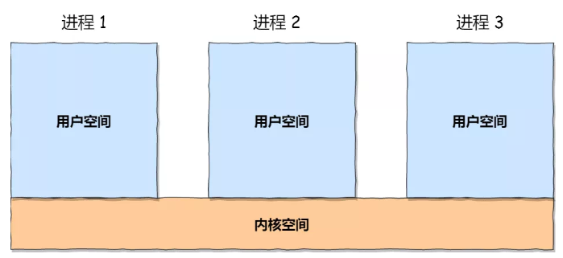

- 管道

- 消息队列

  要支持消息队列，需要在内核中进行选中

  General setup -->

  ​	POSIX Message Queues

- 共享内存

##### 1.5 进程的空间模型

```shell
虚拟内存空间:内核空间 + 用户空间

用户空间:
	text：存放了代码、常量、字符串常量等
	data:存放了初始化的全部/静态变量
	bss:存放了未初始化的全局/静态变量
	栈:局部变量
	堆:malloc或者new创建的

linux中可以使用size命令，列出elf文件中的text、data、bss段的大小

#查看一个应用程序占用的各段的大小
#size main
   text    data     bss     dec     hex filename
   1173     540      16    1729     6c1 main
   
text、data、bss都是在编译过程中已经确定了内存空间，栈和堆的数据都是在运行时动态分配的，因此没有办法在二进制文件中显示出来

参考链接:
size命令查看二进制文件各个数据段
https://blog.csdn.net/Hungxum/article/details/99671071
```

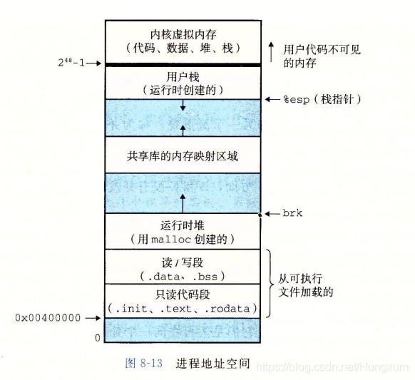

##### 1.6 进程的状态转换图

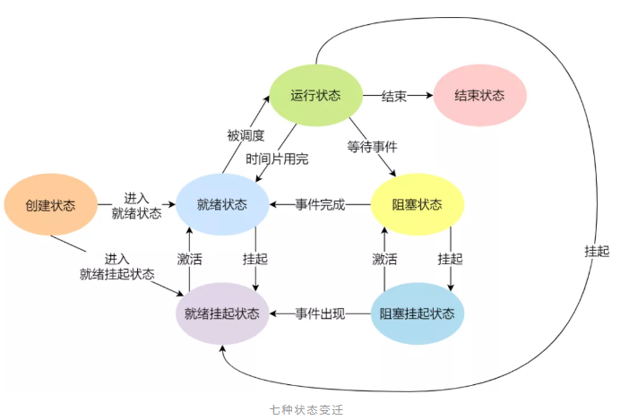

```
NULL   --> 创建状态：一个新进程被创建时的一个状态
创建状态 --> 就绪状态:当进程被创建并完成初始化后，一切就绪准备运行时，变为就绪状态，这个过程很快
就绪状态 --> 运行状态:处于就绪状态的进程被操作系统的进程调度器选中后，就分配给cpu正式运行该进程
运行状态 --> 结束状态:当进程已经运行完成或者出错时，会被操作系统作结束状态处理
运行状态 --> 就绪状态:处于运行状态的进程在运行过程中，由于分配给它的运行时间片用完，操作系统会把该进程变为就绪态，接着从就绪态选中另外一个进程运行
运行状态 --> 阻塞状态:当进程请求某个事件并且必须等待时，例如I/O事件
阻塞状态 --> 就绪状态:当进程要等待的事件完成时，它从阻塞状态编导就绪状态

另外，还有一个状态叫做挂起状态，它表示进程美欧占用物理内存空间，这个阻塞状态不一样，阻塞状态是等待某个事件的返回，由于虚拟内存管理原因，进程的所使用的空间可能没有映射到物理内存，而是在硬盘上，这时候就会出现挂起状态，另外调用sleeo也会被挂起
```

##### 1.7 什么是进程的上下文、中断上下文

```
进程上下文切换:一个进程切换到另一个进程运行。
	在进行切换时，cpu涉及的2个重要元素:寄存器和程序计数器。寄存器:存放要运行的指令或者数据。程序计数器:cpu正在执行的指令位置或者即将执行的下一条指令位置
	
进程上下文:用户进程从用户空间进入到内核空间，对于内核来说就是进程上下文。
	用户空间执行的代码-进程上文；内核空间执行的代码-进程下文
中断上下文:当内核处理中断函数时，这时候内核就是处于中断上下文。
	中断上半部：触发中断开始到进入中断处理程序的哪个点；中断下半部：执行中断处理程序的那部分代码


参考文档:
	https://mp.weixin.qq.com/s/KbpSnfQmbCPKcONo44zqrQ
	
进程上下文切换场景:
	(1)进程分配的时间片耗尽:为了保证所有进程可以得到公平调度，cpu时间被划分为一段段的时间片，这些时间片再被轮流分配给各个进程，这样当某个进程的时间片耗尽了，就会被系统挂起，cpu就会切换到其他等待cpu的进程运行
	(2)系统资源不足:进程在系统资源不足(比如内存不足)时，要等到资源满足后才可以运行，这个时候进程会被挂起，并由系统调度其他进程运行
	(3)调用sleep函数:主动将自己挂起，自然也会重新调度
	(4)更高优先级进程进来时:当有优先级更高的进程运行时，为了保证高优先级进程的运行，当前进程会被挂起，由高优先级进程来运行
	(5)发生硬件中断:当发送硬件中断时，cpu上的进程会中断挂起，转而执行内核中的中断服务程序
```

##### 1.8 操作系统可以创建多少个进程，一个进程可以创建多少个线程

```shell
1.查看系统中的进程上限
# ulimit -a
core file size          (blocks, -c) 0
data seg size           (kbytes, -d) unlimited
scheduling priority             (-e) 0
file size               (blocks, -f) unlimited
pending signals                 (-i) 7270
max locked memory       (kbytes, -l) 262144
max memory size         (kbytes, -m) unlimited
open files                      (-n) 65535
pipe size            (512 bytes, -p) 8
POSIX message queues     (bytes, -q) 819200
real-time priority              (-r) 0
stack size              (kbytes, -s) 8192 #一个线程栈的占用的最大值
cpu time               (seconds, -t) unlimited
max user processes              (-u) 7270 #系统支持的最大进程数
virtual memory          (kbytes, -v) unlimited
file locks                      (-x) unlimited

7270，这个属于软限制，是可以改变的，我们可以通过改变这个参数的值来修改对于进程数量的软限制，比如使用下面的命令将软限制改到5120
#ulimit -u 5120

用pid_t来表示一个进程的pid，因此能表示的进程的范围一定不会超过pid_t类型的大小
cat /proc/sys/kernel/pid_max
32768
以上只是一个理论值，实际上由于内存等系统资源的限制，根本不会同时有这么多进程存在

2.一个进程中最多可以有多少个线程
创建一个线程会占用多少内存，这取决于分配给线程的调用栈大小，可以用ulimit -s命令来查看大小，一般进程的虚拟内存是4G，在32位平台上，内核分走了1G，留给用户的只有3G,因此一个线程如果占用了10M，总共3G内存可以使用，因此最多也就300个左右的线程

参考链接:
https://blog.csdn.net/lyl194458/article/details/88768526?utm_medium=distribute.pc_aggpage_search_result.none-task-blog-2~all~sobaiduend~default-1-88768526.nonecase&utm_term=%E4%B8%80%E4%B8%AA%E8%BF%9B%E7%A8%8B%E5%8F%AF%E4%BB%A5%E5%88%9B%E5%BB%BA%E4%B8%80%E4%B8%AA%E6%88%96%E5%A4%9A%E4%B8%AA%E7%BA%BF%E7%A8%8B&spm=1000.2123.3001.4430
```

##### 1.9 父进程、子进程的关系

```
通过fork()函数，父进程和子进程之间存在着代码拷贝，且父子进程相互独立执行。父子进程只共享了文件描述符，而不能共享全局变量、栈区、堆区

参考文档:
http://blog.sina.com.cn/s/blog_179ea19500102wz0x.html
```

##### 1.10 常见的进程调度算法

```
5个进程调度原则:
1.cpu利用率
	调度程序硬确保cpu是始终匆忙的状态，这可以提供cpu的利用率
2.系统吞吐量
	吞吐量表示单位时间内cpu完成进程的数量，长作业的进程占用较长的cpu资源。因此会降低吞吐量，相反，短作业的进程会提示系统吞吐量
3.周转周期
	周转周期=运行+阻塞时间，一个进程的周转周期越小越好
4.等待时间
	这个等待时间不是阻塞状态的时间，而是进程处于就绪队列的时间，等待时间越长，用户越不满意
5.响应时间
	用户提交请求到系统第一次产生响应所花费的时间，在交互式系统中，响应时间是衡量调度算法好坏的主要标准
	
调度算法:
	1.先来先服务调度算法：适用于CPU繁忙型作业的系统，而不适用与I/O繁忙型作业的系统
	2.最短作业优先调度算法
	3.高响应比优先调度算法
	4.时间轮转调度算法
	5.最高优先级调度算法
	6.多级反馈调度算法
```


```
多级:表示有多个队列，每个队列优先级从高到底，同时优先级越高时间片越短
反馈:表示如果有新的进程加入优先级高的队列时，立刻停止当前正在运行的进程，转而去运行优先级高的队列
```

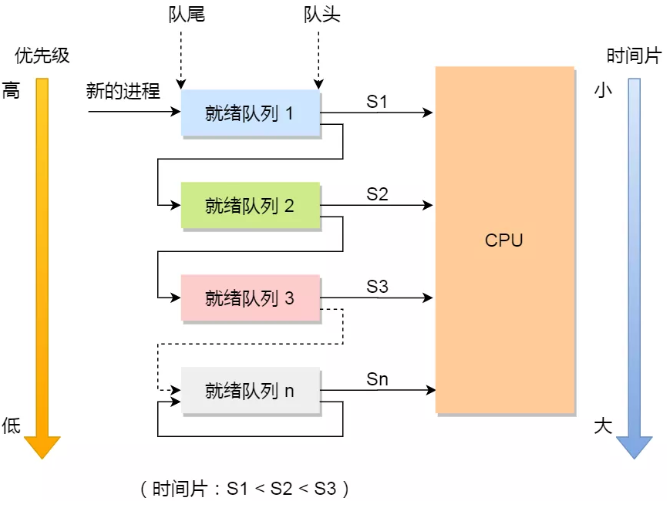

##### 1.11 线程同步方法

```
为了实现进程/线程间的正确协作，操作系统必须提供实现进程/线程间协作的措施和方法，主要有2种:
(1)锁+条件变量
   根据锁的实现不同，锁又可以分为忙等待锁(自旋锁)和无忙等待锁
   忙等待锁:当获取不到锁时，线程会一直while循环，不做任何事情，这是最简单的锁，一直在自旋，利用cpu周期，直到锁可以使用。在单处理器上，需要抢占式的调度器(即不断通过时钟中断一个线程，运行其他线程)，否则自旋锁在单cpu上无法使用，因为自旋锁的线程永远不会放弃cpu
   
   无忙等待锁:就是获取不到锁，不用自旋。当获取不到时，就把当前线程放到锁的等待队列中，然后又执行调度程序，把cpu让给其他线程执行
   
(2)信号量
```

##### 1.12 如何提升多线程的效率

```shell
1.为什么要使用多线程
	多线程可以提高cpu的利用率从而挺高效率。数据库访问、磁盘io等操作速度比cpu执行代码速度慢，但线程环境下，这次操作会阻塞程序执行，导致cpu空转，因此对于会产生这些阻塞的程序来说，使用多线程可以避免在等待期间cpu的空转，以此来提供cpu利用率

#备注:
	(1)单线程与多线程比较:
	单处理器上多线程只能并发执行而不能并行。并发执行存在着线程间上下文切换问题，会消耗一定的时间，如果不考虑阻塞，多线程并发执行其实比单线程执行更加耗时，线程过多也会造成cpu负荷过大，并且线程占用内存资源，创建消耗线程也都需要开销
	在多核处理器系统上，将要执行的任务分割成多个可并行执行线程，就可以提供执行速率

参考文档:
为什么使用多线程
https://blog.csdn.net/java_lifeng/article/details/102838559

2.怎样提升运行效率
  (1)尽量减少加锁解锁的过程(减少线程的耗时)
  (2)尽量减少线程数量(减少线程的切换耗时)，如果已经确定好线程数量，可以使用线程池技术(减少线程的创建，销毁的耗时)
```

##### 1.13 多线程是怎么实现调度的

#### 2. 内存管理

```shell
#参考总文档
https://mp.weixin.qq.com/s/HJB_ATQFNqG82YBCRr97CA
```

```shell
#单任务-单片机 多任务-操作系统
单片机的cpu是直接操作内存的物理地址，因此想在内存中同时运行2个以上的程序不不可能的。
 操作系统就可以让多个程序同时运行，它为每个进程分配独立的虚拟地址，互不干涉，但是前提每个进程都不能访问物理地址，操作系统管理0虚拟地址和物理地址映射，对于进程来讲是透明的
```

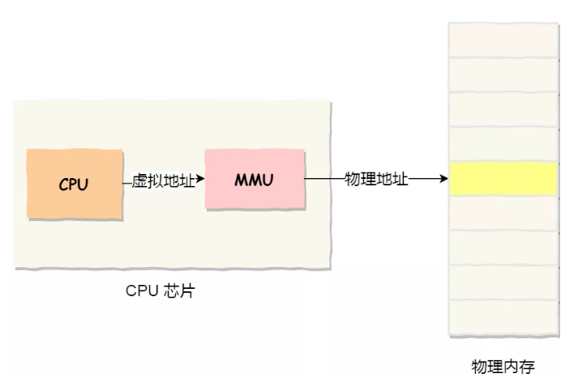

```shell
#操作系统管理虚拟地址和物理地址的方式

1.内存分段
	定义:程序是由若干个逻辑分段组成的，如可由代码分段、数据分段、栈段、堆段组成。不同的段是有不同的属性的，所以就用分段（Segmentation）的形式把这些段分离出来
	优点:产生了连续的内存空间
	缺点:内存碎片、内存交换的效率低

2.内存分页
	定义:分页是把整个虚拟和物理内存空间切成一段段固定尺寸的大小。这样一个连续并且尺寸固定的内存空间，我们叫页（Page）
	虚拟地址与物理地址之间是通过页表来实现的，页表实际上存储在cpu的内存管理单元(MMU)中，cpu就是可以通过MMU，找到实际要访问的物理内存地址，而当进程访问的虚拟地址在页表中查不到时，系统就会产生一个缺页异常，进入系统内核空间分配物理内存，更新进程页表，最后再返回用户空间，恢复进程运行(从这里可以得出，有虚拟地址不一定会分配物理地址，只有在真正用到的时候才分配物理地址)。
	#页表的创建、更新是由操作系统完成，存储是在MMU中
	优点:解决了分段带来的内存碎片(释放的内存都是以页为单位释放的，不会产生无法给进程使用的小内存)、
	缺点:一级页面:空间上的缺陷,多级页表可以解决空间缺陷问题
	
	#linux中采用的方式是分页机制
```

- 内存分段

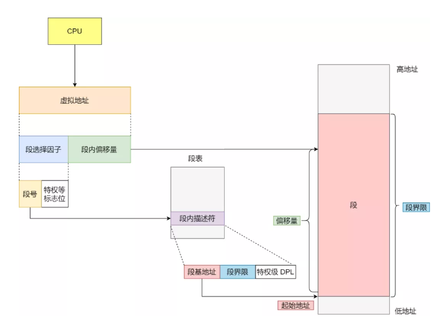

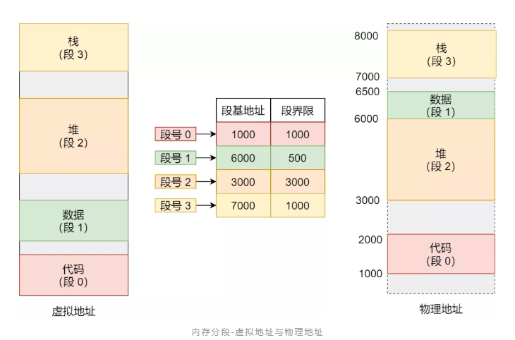

- 内存分页

  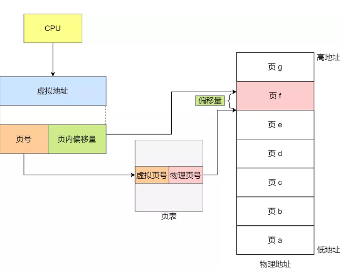

  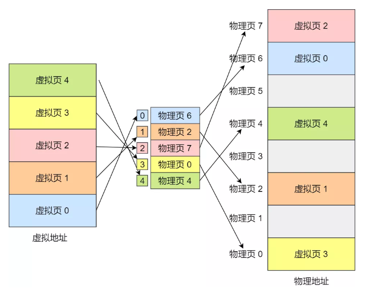

- 多级页表

  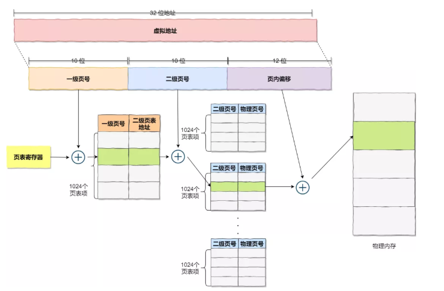

#### 3. 文件系统

```shell
#文件系统
https://mp.weixin.qq.com/s/qJdoXTv_XS_4ts9YuzMNIw

#1.文件系统的作用
文件系统是操作系统中农负责管理持久数据的子系统，就是负责把用户的文件存到磁盘硬件中

#2.基础知识
(1)文件系统的基本数据单位是文件，它的目的是对磁盘上的文件进行组织管理，那么组织的方式不同，就会形成不同的文件系统

(2)索引节点存储在磁盘上，目录项是由内核维护的一个数据结构，不存放在磁盘，而是缓存在内存中
	超级块，用来存储文件系统的详细信息，比如块个数、块大小、空闲块等等。
	索引节点区，用来存储索引节点；
	数据块区，用来存储文件或目录数据；
	
#3.嵌入式文件系统对比
```

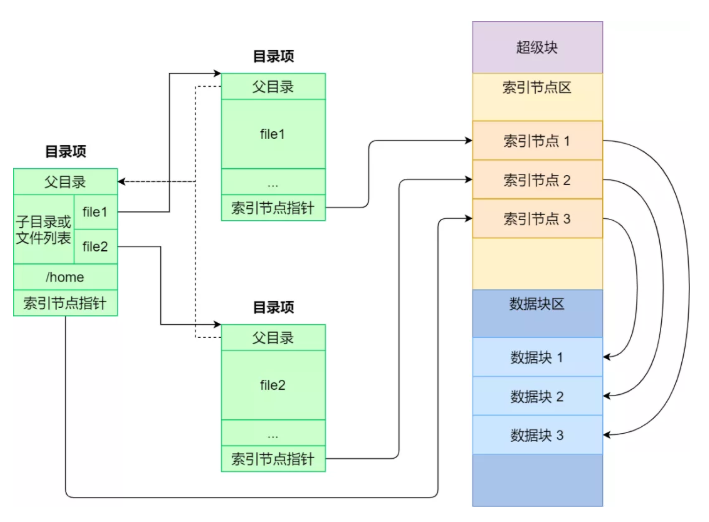

```shell
#1.虚拟文件系统
文件系统额种类众多，而操作系统希望对用户提供一个统一的接口，于是在用户层和文件系统层引入了中间层，这个中间层就称为虚拟文件系统。虚拟文件系统定义了一组所有文件系统都支持的数据结构和标准接口，这样用户就不需要了解文件系统的工作原理，只需要了解虚拟文件系统提供的统一接口即可

#2.文件系统分类
(1)磁盘文件系统:直接把数据存储在磁盘上，比如Ext2/3/4
(2)内存文件系统:数据不是存储在磁盘上，而是占用内存空间，经常用到的/proc、/sys文件系统属于这一类，读写这类文件，实际是读写内核中相关的数据
(3)网络文件系统:用来访问其他计算机主机数据的文件系统，例如NFS
文件系统首先要挂载到某个目录下才可以正常使用，例如在linux系统启动时，会把文件系统挂载到根目录

#3.逻辑块-文件系统读写的基本单位
	磁盘读写的最小的单位是扇区，扇区的大小只有513B大小，跟明显，如果每次读写多是以这么小为单位，那么读写的效率会非常低，所以文件系统把多个扇区组成了一个逻辑块，每次读写的最小单位是逻辑块(数据块)，linux中逻辑块大小为4kb，也就是一次读写8个扇区，这将提高了磁盘的读写效率

#4.文件系统向磁盘写数据的场景
	(1)在调用 write 的最后，当发现内核缓存的数据太多的时候，内核会把数据写到磁盘上；
	(2)用户主动调用 sync，内核缓存会刷到磁盘上；
	(3)当内存十分紧张，无法再分配页面时，也会把内核缓存的数据刷到磁盘上；
	(4)内核缓存的数据的缓存时间超过某个时间时，也会把数据刷到磁盘上；
```

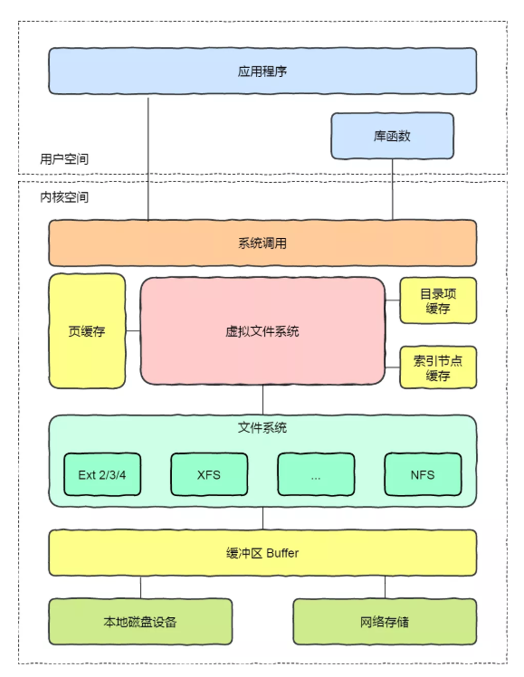

```shell
#各个文件系统区别
由于嵌入式系统自身存在一些特殊要求，使得一些传统的文件系统(如FAT、EXT2)并不合适，专用的嵌入式文件系统应有一些自身特性，如文件系统面对的存储介质特殊性、文件系统应具有跨平台的安全性以及整个系统的即时性,cramfs、jffs2、yaffs2、ubifs是专用于嵌入式的文件系统

cramfs是只读压缩的文件系统，可以将文件系统进行压缩，提高存储效率
squashfs是只读压缩文件系统，相比于cramfs可以支持更大的单个文件大小
jffs/jffs2是可读写的，压缩的日志闪存文件系统，主要用于norflash
yaffs/yaffs2是可读写的，非压缩的日志闪存文件系统，主要为nandflash设计的文件系统，为了应对flash容量的快速增长
ubifs是作为jffs2后继的文件系统，为了满足大容量的需求

#选用文件系统的技术指标
(1)flash类型：jffs-norflash、yaffs、ubifs-nand flash
(2)挂载时间(启动时间)：jffs挂载慢，yaffs，ubifs挂载块
(3)内存消耗：jffs-消耗大，yaffs，ubifs-消耗小
(4)只读、读写类型，cramfs、squashfs-只读

参考资料:
https://blog.csdn.net/iceiilin/article/details/22721029
https://mp.weixin.qq.com/s/aEBaf98u2RSMjyITcLZlzw
```

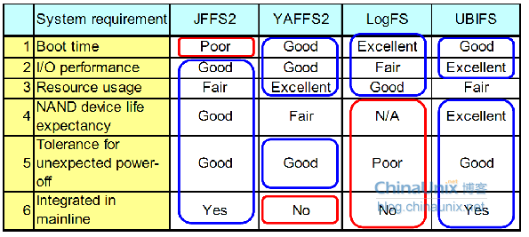

#### 4. 孤儿进程、僵尸进程、守护进程

##### 4.1 基本概念

##### 4.2 如何创建守护进程

```
https://blog.csdn.net/silent123go/article/details/71108501
https://blog.csdn.net/ciaiy/article/details/80458588
https://blog.csdn.net/tiaojingtao1293/article/details/106025672
```

##### 4.3 如何做正确处理僵尸进程的方法

```shell
#1.僵尸进程与孤儿进程的区别
僵尸进程：一个父进程退出,而它的一个或几个子进程仍然还在运行，那么这些子进程就会变成孤儿进程,孤儿进程将被init进程所收养,并由init进程对它们完成状态收集工作

孤儿进程:一个父进程退出,而它的一个或几个子进程仍然还在运行，那么这些子进程就会变成孤儿进程,孤儿进程将被init进程所收养,并由init进程对它们完成状态收集工作

#2.如何避免僵尸进程
(1)父进程调用wait函数或者waitpid函数

#include<stdio.h>
#include<unistd.h>
#include<stdlib.h>

int main()
{
	int id;
	//先创建一个子进程
	pid_t pid = fork();
	if (pid == 0)
	{
		sleep(1);
		//让子进程先退出，父进程一直执行,子进程将来会变成僵尸进程
		printf("child pid=%d ppid=%d\n", getpid(), getppid());
		exit(1);
	}
	else if (pid > 0)
	{
		while(1) {
			printf("father start\n");
			//等待任意一个子进程结束
			id = wait(NULL);
			printf("id = %d\n",id);
			sleep(1);
		}
	}
	else
	{
		printf("error\n");
	}
}

#备注:
	(1)wait函数在没有子进程时不会阻塞，会直接返回-1，当有子进程时并且没有退出时，会一直阻塞住；任意一个进程退出都能导致wait函数的返回，因此当创建了多个子进程时要循环等待子进程的退出，例如while(wait(NULL) ! = -1);
	
(2)父进程采用信号SIGCHLD通知处理，并在信号处理程序中调用wait函数

#include<stdio.h>
#include<unistd.h>
#include<stdlib.h>
#include <signal.h>

//当有子进程退出时，会调用该函数
void signal_wait(int isig)
{
	wait(NULL); //用于回收子进程的资源
	printf("child is cleaned\n");
}

int main()
{
	int id;
	int time;

	signal(SIGCHLD,signal_wait);

	//先创建一个子进程
	pid_t pid = fork();
	if (pid == 0)
	{
		sleep(1);
		//让子进程先退出，父进程一直执行,子进程将来会变成僵尸进程
		printf("child pid=%d ppid=%d\n", getpid(), getppid());

		exit(1);
	}
	else if (pid > 0)
	{
		//sleep函数将会被信号打断，返回剩余的秒数
		time = sleep(5);
		printf("time = %d\n",time);
	}
	else
	{
		printf("error\n");
	}
}

SIGCHLD:当一个进程终止或者停止时，将SIGCHLD信号发送给其父进程，按系统默认将忽略此信号，如果父进程希望被告知其子系统柜的这种状态，则应捕捉此信号
```

#### 5. 并发与并行，同步与异步，阻塞与非阻塞、互斥、各种锁的应用场景

##### 5.1 基本概念

```shell
并发：指多个事情，在一个时间段内同时发生了。(基于操作系统的分时间片调度原理实现，由于计算机的处理速度很快，只要时间片的间隔取得适当，那么一个用户作业从用完分配给它的一个时间片到获得下一个时间片，之间有所停顿，但是用户察觉不出来)
并行：指多个事情，在同一个时间点上同时发生了。

并发的多个任务之间是互相抢占资源的(抢占一个cpu资源)；并行的多个任务之间是不互相抢占资源的；只有在多个cpu的情况下，才会发生并行，否则看似是同时发生的事情，其实都是并发执行

参考链接:
https://mp.weixin.qq.com/s/RZ6Qx0Pq0W4QiETlCYYr9A

阻塞与非阻塞:区别在于在干一件事情时，当事情还没有完成时，处理这件事情的人除此之外是否能做其他的事情，不能干-阻塞，能干-非阻塞。
	#阻塞等待的是内核数据准备好和数据从内核态拷贝到用户态这两个过程
	#对于阻塞io而言，如果没有数据，应用会阻塞在调用上面。而对于非阻塞io而言，即使没有数据，调用会返回错误码表示没有数据可读，换而言之即使没有数据不会让应用一直阻塞在这个调用上

同步与异步:区别在于使自己去做这件事情，还是等别人做好了通知有结果，然后自己再去拿结果。注意这里说的拿结果，如果只是别人告诉你可以做某件事情了，然后自己去操作，这种情况下也属于同步操作，例如多路复用io-也属于同步操作

参考链接:
https://mp.weixin.qq.com/s/Ivg5nxsMyeL3xJcZsYMmUQ
```

- 并发与并行

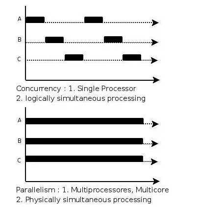

- 阻塞与非阻塞

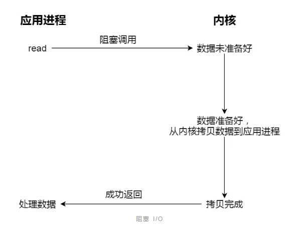

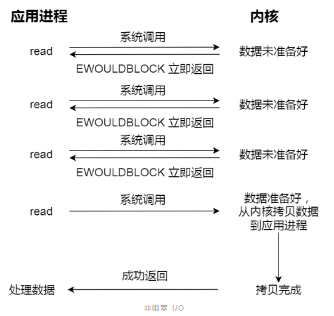

- 同步与异步

  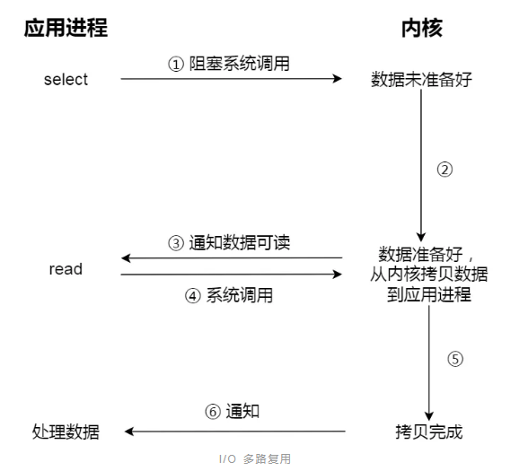

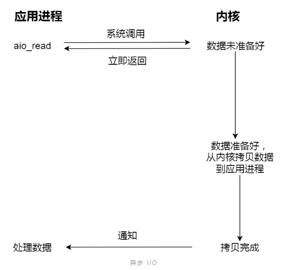

##### 5.2 io模型

```shell
#1.io模型
(1)阻塞io - 同步
(2)非阻塞io - 同步
(3)基于非阻塞的多路复用 --> select系统调用时阻塞的，io操作是非阻塞的 - 同步
(4)异步io - 异步

同步会涉及到阻塞与非阻塞的概念，而对于异步没有这两个概念

#2.i/o是分为2个过程:
(1).数据准备过程
(2).数据从内核空间拷贝到用户进程缓冲区的过程

阻塞i/o会阻塞在1、2两个过程，而非阻塞io和基于非阻塞多路复用只会阻塞在2过程，这2个都是同步io，异步io则不同过程1、2都不回阻塞
```

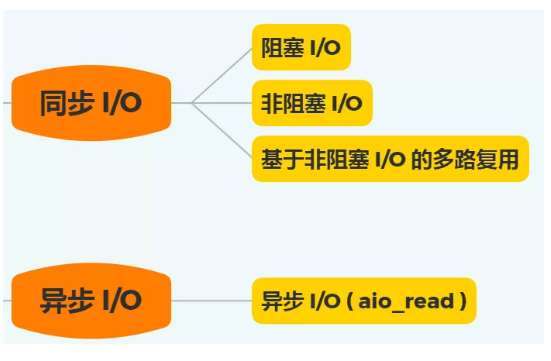

##### 5.3 互斥锁、自旋锁、读写锁、悲观锁、乐观锁的应用场景

```shell
#0.
   	这些锁的使用不仅仅在用户程序中可以使用，也可以在内核程序中使用，只是将来调用锁的函数不相同而已
   	
#1.锁存在的原因
	多线程中对共享资源的竞争，为了解决这一问题，通常在访问共享资源之前需要加锁，加锁的目的是保证共享资源在任意时间里，只有线程访问，这样就可以避免多线程导致共享数据错乱的问题
	
#2.各个锁的区别
	最底层的2种锁：互斥锁和自旋锁，基本上高级锁都是基于他们实现的
	
	互斥锁:加锁失败后，线程会阻塞，会释放cpu给其他线程使用；不在占用cpu
	自旋锁:加锁失败后，线程会忙等待，直到拿到锁，会占用cpu
	
	当加锁失败后，互斥锁用线程切换来应付，自旋锁用忙等待来应付
	
#3.各个锁适应场景
	互斥锁和自旋锁使用场景:
	如果能确定被锁住的代码执行的时间很短，就不应该使用互斥锁，而应该选用自旋锁，否则使用互斥锁

	读写锁由「读锁」和「写锁」两部分构成，如果只读取共享资源用「读锁」加锁，如果要修改共享资源则用「写锁」加锁
	读写锁适用于能明确区分读操作和写操作，在读多写少的场景，能发挥出优势-->可以同时读取数据，但读写不能同时进行
	
参考文档:
https://mp.weixin.qq.com/s/CqIXHowIDT1kxyBOO0x7TQ

https://blog.csdn.net/zryoo_k/article/details/88559142
```

- 互斥锁

  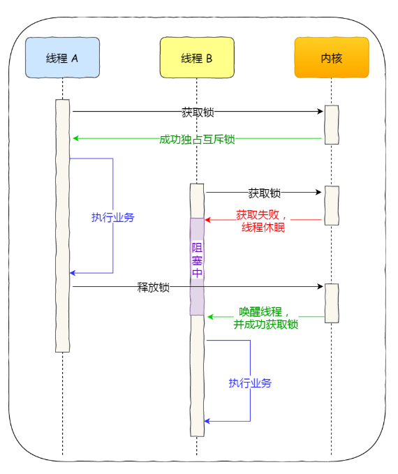

- 读写锁

  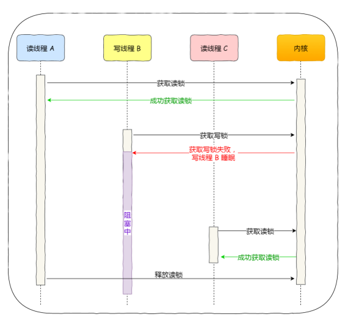

#### 6. 死锁

##### 6.1 基本概念

```shell
当线程A持有独占锁a,并尝试去获得独占锁b的同时，线程B持有独占锁b，并尝试获取独占锁a的情况下，就会发生A\B两个线程由于互相出游对方需要的锁，而发生的阻塞现象

参考文档:
https://mp.weixin.qq.com/s/SsU8Ro-Uf2WDSjkPv4lptQ
https://www.jianshu.com/p/44125bb12ebf
```

##### 6.2 产生死锁的条件

```
1.互斥条件   --> 一个资源只能被一个线程使用 -->独占锁的特点
2.占用且等待 --> 一个线程因请求资源而阻塞时，对方获取的资源不释放 --> 独占锁的特点
3.不可剥夺   --> 线程已获得资源，在未使用完之前，不能强制剥夺    --> 独占锁的特点
4.循环等待条件 --> 若干线程之间形成一种头尾相接的循环等待资源关系 --> 通过该条件来避免死锁
```

##### 6.3 解决死锁的基本方法

```
在并发程序中，逻辑中避免出现多个线程相互持有对方线程所需要的独占锁的情况
```

#### 7. 零拷贝

```
1.传统的数据拷贝，涉及到4次数据的拷贝
  (1)将磁盘数据拷贝到内核空间  --> 由DMA拷贝
  (2)将内核数据拷贝到用户空间  --> 由cpu拷贝
  (3)将用户空间数据拷贝到内核  --> 由cpu拷贝
  (4)将内核数据拷贝到网卡     --> 由dma拷贝
  
2.使用mmap+write或者sendfile，会涉及到3次拷贝
  (1)将磁盘数据拷贝到内核空间  --> 由DMA拷贝
  (2)将内核数据拷贝到另外一块内核空间  --> 由cpu拷贝
  (3)将内核数据拷贝到网卡     --> 由dma拷贝
 
tmp_buf = mmap(file, len); 
write(socket, tmp_buf, len);

首先，应用程序调用了 mmap() 之后，数据会先通过 DMA 拷贝到操作系统内核的缓冲区中去。接着，应用程序跟操作系统共享这个缓冲区，这样，操作系统内核和应用程序存储空间就不需要再进行任何的数据拷贝操作。应 用程序调用了 write() 之后，操作系统内核将数据从原来的内核缓冲区中拷贝到与 socket 相关的内核缓冲区中。接下来，数据从内核 socket 缓冲区拷贝到协议引擎中去，这是第三次数据拷贝操作

参考文档：

 
 3.真正意义上的零拷贝，会涉及到2次拷贝
   (1)将磁盘数据拷贝到内核空间  --> 由DMA拷贝
   (2)将内核数据拷贝到网卡     --> 由dma拷贝 
   
#结论:
	以上不管哪种方式，至少都会有2个拷贝的过程(将数据从磁盘拷贝到内核空间，再从内核拷贝到网卡)，这2个拷贝是必不可少的2个过程
	
参考文档:
https://mp.weixin.qq.com/s/P0IP6c_qFhuebwdwD8HM7w
```

- 传统的数据拷贝

  

- 一般意义的零拷贝（内核空间和用户空间没有数据的拷贝）

  使用mmap+write实现

  

  使用sendfile实现

  

- 真正意义上的零拷贝

  

### 二、 linux驱动

#### 1. 基础题

##### 1.1 linux中为什么要区分内核空间和用户空间？用户空间与内核通信的方式有哪些？

```shell
#1.区分内核空间与用户空间的目的
(1)保护操作系统的运行
	隔离了操作系统代码和用户程序代码，即便有单个应用程序程序出现错误也不会影响到操作系统的稳定性(操作系统代码要比应用程序代码健壮的多)，由于运行在不同的内存空间，即应用程序不能直接访问内核的空间，因此即使用户程序崩溃也不会影响都内核的运行

(2)限制应用程序的权限
	现代cpu都具有不同的操作模式，不同的操作模式代表着不同的运行级别，内核运行在最高的级别，可以进行所有的操作，而应用程序运行在低级别可以进行一些非受限的访问

#备注:
	每个进程的4G地址空间中，最高的1G都是一样的，即内核空间，只有剩余的3G才归进程自己使用。即最高1G的内核空间是被所有的进程共享的
	当进程运行在内核空间时就处于内核态，当运行在用户空间时就处于用户态
	
参考链接:
https://www.cnblogs.com/sparkdev/p/8410350.html
https://blog.51cto.com/fengyunshan911/2072028

#2.用户空间和内核空间的通信方式
由于用户空间与内核空间是相互独立的，因此应用程序需要进行一些操作时(例如操作硬件)需要与内核进行通信,通信有以下几种方式:
(1)系统调用
(2)虚拟文件系统
	proc文件系统    - 进程文件系统
	sysfs文件系统   - 设备文件系统
	debugfs文件系统 -  调试文件系统
(3)ioctl接口
(4)netlink

参考链接:
https://blog.csdn.net/vertor11/article/details/79622694
```


##### 1.2 字符设备和块设备的区别？

```shell
#1.定义
字符设备:
	字符在io传输过程中以字符为单位进行传输的设备。
	例如键盘，打印机等。请注意，以字符为单位并不一定意味着是以字节为单位，因为有的编码规则规定，1个字符占16比特，合2个字节
	
块设备:
	块设备将信息存储在固定大小的块中，每个块都有自己的地址。
	数据块的大小通常在512字节到32768字节之间。块设备的基本特征是每个块都能独立于其它块而读写。磁盘是最常见的块设备
	
#2.区别
	(1)是否可以被随机的访问
		字符设备只能顺序访问，不能随机访问
		块设备可以随机访问，原因在于每一个块都有自己的地址
		
		 如果一个硬件设备是以字符流的方式被访问的话，那就应该将它归于字符设备；反过来，如果一个设备是随机（无序的）访问的，那么它就属于块设备。即块设备能随机打乱顺序读取，并且保证不出错，字符设备只能以数据流的形势读取，如随机读取则会出现错误。如键盘和硬盘
		 
	(2)数据访问的大小
		字符设备支持按字节/字符来读写数据；
		块设备数据的读写只能以块(通常是512B)的倍数进行
参考链接：
	http://blog.sina.com.cn/s/blog_8686d9520101cf2q.html
```

##### 1.3 linux内核的启动过程？

```
https://mp.weixin.qq.com/s/PKz63OlSleu_J0taVShyJA
https://mp.weixin.qq.com/s/fiiwJF4ULPwGlpmkA6x4aw
https://mp.weixin.qq.com/s/3NFLEqW0gV9-czfpc32LzQ
```

##### 1.4 linux中系统调用过程？

##### 1.5 linux调度原理？

##### 1.6 查看驱动模块中打印信息使用什么命令？如何查看内核中已有的字符设备的信息？如何查看正在使用的有哪些中断号？

```shell
查看驱动模块中打印信息使用什么命令:dmesg
如何查看内核中已有的字符设备的信息:lsmod
如何查看正在使用的有哪些中断号:cat /proc/interrupt
```

##### 1.7 copy_to_user()和copy_from_user()主要用于实现什么功能?

```shell
#1.为什么要有这两个函数
由于内核空间和用户空间是不能相互访问的，如果需要访问就必须借助内核函数进行数据读写。(用户空间不能直接访问内核空间的数据，只能把内核空间数据拷贝到用户空间，供用户程序访问)

#2.这两个函数的作用
copy_to_user():完成内核空间到用户空间的复制，copy_from_user()：是完成用户空间到内核空间的复制。一般用于file_operations结构里的read,write,ioctl等内存数据交换作用的函数
```

##### 1.8 主设备号和次设备号的用途？

```
主设备号:
	用于表示不同的设备驱动
	虽然现代的linux内核允许多个驱动程序共享主设备号，但我们看待的大多数设备仍然按照“一个主设备对应一个驱动程序”的原则组织
	
次设备号:
 	用于表示相同设备驱动下的不同设备
 	次设备号由内核使用，用于正确确定设备文件所指的设备。依赖于驱动程序的编写方式，我们可以通过次设备号获得一个指向内核设备的直接指针，也可将此设备号当作设备本地数组的索引
```

##### 1.9 设备驱动程序洪如何注册一个字符数设备？

```
https://mp.weixin.qq.com/s/_wu6ORfviensyGQVdAYTZw
```

##### 1.10 linux中RCU原理？

##### 1.11 linux内存如何划分以及如何使用？虚拟地址以及物理地址的概念以及转换，高端内存的概念？

##### 1.12 字符型驱动设备怎么创建设备文件？

```
https://mp.weixin.qq.com/s/_wu6ORfviensyGQVdAYTZw
```

##### 1.13 insmod、rmmod一个驱动模块，会执行模块中的哪个函数？这2个函数在设计上要注意哪些呢？

```shell
insmod会调用init函数 --> 内核模块装载函数
rmmod会调用exit函数  --> 内核模块卸载函数

init函数中一般情况下要进行申请资源操作
exit函数中一般清零下要清理init申请的资源操作

#备注:
	(1)如果某个内核模块或者应用程序正在使用该内核模型，当卸载模块时会出现卸载失败的情况
	(2)申请的资源一般会有内存、ioremap、定时器、工作队列等待
```

##### 1.14 设备驱动模型中3个重要成员是什么？platform总线的匹配规则是什么？

```shell
#1.设备驱动模型
	3个重要的成员:总线、设备、驱动
#2.platform总线的匹配规则
	先匹配设备树中的compatible属性与驱动中的copmatible属性，如果匹配失败，在根据device和driver的名字进行匹配，如果还不匹配则匹配失败
#备注:
	(1)相对于I2C、SPI、USB等实际存在的物理总线，平台总线是一种虚拟的总线，它并不对应实际的物理总线，目的是将虚拟的设备和驱动进行统一的管理
	(2)设备可以在设备树里注册，也可以在代码里注册，如果匹配成功则会去嗲用驱动程序里面的probe函数
	
参考连接:
https://blog.51cto.com/11674570/1952420
```

##### 1.15 内核函数mmap的实现原理是什么？

```
mmap函数实现是把一个文件映射到一个内存区域，从而可以向读写内存一样读写文件(直接操作这块磁盘区域，省去了系统调用)，要比单纯的read/write要快，使得进程之间通过映射同一个普通文件实现共享内存

参考文档:
https://blog.csdn.net/you_shou/article/details/52604906
```

##### 1.16 在驱动调试过程中遇到过oops没？

##### 1.17 ioctl和unlock_ioctl有什么区别？

##### 1.18 驱动中操作物理绝对地址为什么要先ioremap？

```shell
因为在内核中没有办法直接操作物理内存的地址，必须先通过ioremap将物理地址转换为虚拟地址。

#备注:
	1.在linux中操作，用户空间和内核空间操作时，操作的都是虚拟地址，然后通过mmu将虚拟内存地址转换为物理内存地址
	2.ioremap函数的作用;将物理内存地址转换为虚拟地址
```

##### 1.19 平时怎么用C写嵌入式系统的死循环？

```c
for(;;) {}
while(1) {}

一般for(;;){}性能更优，这两个;;空语句，编译器一般会优化掉，直接进入死循环
while(1){}每次循环一次都要判断1是不是等于0，在这里while比for多做了判断这件事情    
```

##### 1.20 kmalloc和vmalloc的区别？

```shell
#区别:
	(1)kmalloc分配的物理地址连续，vmalloc分配的物理地址一般不连续，但2者分配的虚拟地址都是连续的
	(2)kmalloc分配的为小块内存，一般不超过128k，vmalloc分配的为大块内存
	(3)vmalloc分配的一般为高端内存，只有当内存不够时候才分配低端内存，kmalloc从低端内存分配
#备注:
	(1)在设备驱动程序中或者内核模块中动态开辟内存，不是malloc，而是kmalloc、vmalloc，释放内存用kfree、vfree
	(2)kmalloc、vmalloc返回是虚拟内存地址，而非物理内存地址

参考链接：
https://www.cnblogs.com/hongzhunzhun/p/4533960.html
```

##### 1.21 kernel panic？

##### 1.22 linux中用户模式和内核模式的是什么含义？

```
参考:1.1 linux中为什么要区分内核空间和用户空间？用户空间与内核通信的方式有哪些？
```

##### 1.23 linux编译时用到的参数以及含义？

##### 1.24 内核配置编译以及makefile？

##### 1.25 Volatile关键字的理解？

##### 1.26 内核中申请内存有几种方式？区别是什么？

```
参考:1.20 kmalloc和vmalloc
```

##### 1.27 分时操作系统、实时操作系统、硬实时和软实时？

```shell
#操作系统分类
操作系统可分为实时操作系统和分时操作系统，而实时操作系统又可以分为硬实时操作系统和软实时操作系统

#区别
实时操作系统是抢占性内核，高优先级任务能打断低优先级任务而立即执行。可剥夺内核的含义是：可以剥夺其他任务的cpu使用权，它总是运行任务中优先级最高的那个任务
分时操作系统是基于时间片轮转，cpu是不可抢占的，即便高优先级任务就绪了，也不能马上中断低优先级任务而得到执行，必须要等到低优先级任务主动挂起(sleep)或者时间片结束才能执行

#示例
实时操作系统：uCOS/VxWorks/RTLinux
非实时操作系统：Linux/Windows/OSX

#硬实时操作系统和软实时操作系统
硬实时:在规定的时间内必须完成操作，不允许超时
软实时:在处理过程中，如果超时后果不是很严重

https://blog.csdn.net/WZJwzj123456/article/details/83243453
https://www.zhihu.com/question/358777846/answer/1197253876
```

- 实时操作系统

  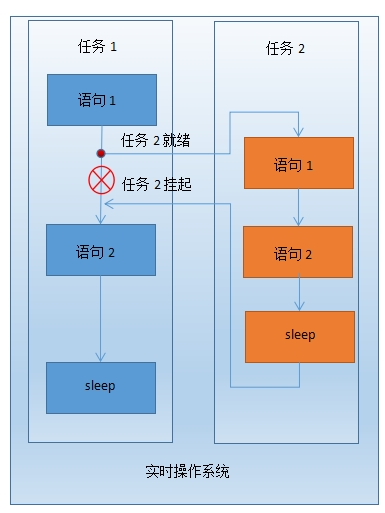

- 分时操作系统

  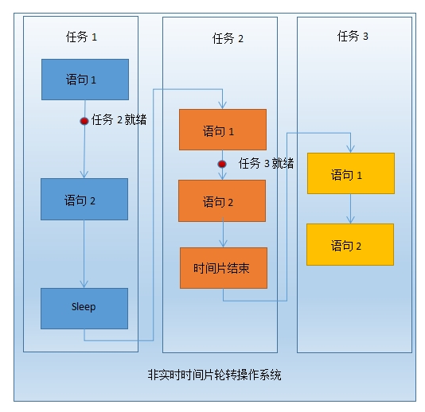

##### 1.28 dts文件中interrupt是怎么定义的？

```
interrupt-controller - 一个空属性用来声明这个node接收中断信号；会用到中断控制器上
#interrupt-cells - 这是中断控制器节点的属性，用来标识这个控制器需要几个单位做中断描述符；会用到中断控制器上
interrupt-parent - 标识此设备节点属于哪一个中断控制器，如果没有设置这个属性，会自动依附父节点的，会用到使用控制器的节点上
interrupts - 一个中断标识符列表，表示每一个中断输出信号。会用到使用控制器的节点上，一般为<组内io口序号  中断触发标志>
发出中断的组成元素:
(1)具体属于哪一个中断控制器 (2)在上述中断控制器的所属位置

<gpio组  组内io口序号  中断触发标志>
```

##### 1.29 内核的上半部和下半部的根本区别是什么？

```
中断处理程序分为2部分:中断上半部和中断下半部
上半部:指的是中断处理程序
下半部:指的是虽然与中断有相关性但是可以延后执行的任务

上半部与下半部主要区别在于:上半部不能被相同类型的中断打断，而下半部依然可以被中断打断；上半部对于时间非常敏感，而下半部基本上都是一些可以延迟的工作。可以参考以下4条是放在上半部执行还是下半部执行:

1.如果一个任务对时间非常敏感，将其放在中断处理程序中执行
2.如果一个任务和硬件相关，将其放在中断处理程序中执行
3.如果一个任务要保证不被其他中断（特别是相同的中断）打断，将其放在中断处理程序中执行
4.其他所有任务，考虑放在下半部去执行

参考文档:
https://blog.csdn.net/weixin_30768175/article/details/98615613
https://www.cnblogs.com/hanyan225/archive/2011/07/19/2110434.html
```

##### 1.30 下半部的实现机制有几种？主要区别是什么？

```
由于有内核任务需要延时处理，因此有了中断下半部，处理中断下半部又有3种方式:
1.软中断
2.tasklet
3.工作队列

软中断和tasklet不能阻塞和睡眠(阻塞和睡眠将来会让进程处于不同的状态，阻塞状态和挂起状态)，而工作队列可以阻塞和睡眠，正是由于该原因，因此在软中断和tasklet的处理函数中不能使用具有阻塞或者睡眠的函数，而在工作队列中可以使用

参考文档:
https://mp.weixin.qq.com/s/A5JBkvUWjWINOaBrVJXPlA
```

##### 1.31 EXPORT_SYMBOL和extern的区别？

```
EXPORT_SYMBOL
	作用域:在全局内核空间
	定义:在该标签内定义的函数或者变量对内核代码全部公开，即使用EXPORT_SYMBOL将一个函数或者变量以符号的方式导出给其他模块使用
	用法:
		1.在模块函数定义之后使用EXPORT_SYMBOL（函数名）
		2.在掉用该函数的模块中使用extern对之声明
		3.首先加载定义该函数的模块，再加载调用该函数的模块
		
EXPORT_SYMBOL_GPL:GPL版本的宏定义只能使符号对GPL许可的模块可用

参考链接:
https://blog.csdn.net/qq_30624591/article/details/101756167?utm_medium=distribute.pc_relevant_t0.none-task-blog-BlogCommendFromMachineLearnPai2-1.channel_param&depth_1-utm_source=distribute.pc_relevant_t0.none-task-blog-BlogCommendFromMachineLearnPai2-1.channel_param
```

##### 1.32 EXPORT_SYMBOL的原理，能否导出同一名称的变量？

```
不能同名，因为是导出的是全局变量
```

##### 1.33 Cache和DMA一致性？

```shell
#1.dma定义
dma-直接内存访问，在进行i/o设备和内存的数据传输的时候，数据搬运的工作全部交给dma控制器，而cpu不需要参与任何数据搬运的工作，这样cpu就可以处理别的事务

dma --> 负责将数据从外设搬运到内核空间
内核 --> 负责将数据从内核空间搬运到用户空间

参考文档:
https://mp.weixin.qq.com/s/vpWUT2vbUHSKRDs-3vLrcw
https://mp.weixin.qq.com/s/sVDcBMFZh6uSNvzD5R17xg

#2.寄存器、cache、内存

寄存器存放的是当前cpu环境以及任务环境的数据
cache存放的是最近经常访问的指令和数据

大致来说，数据是通过内存-->cache-->寄存器，cache缓存则是为了弥补cpu与内存之间运算速度而设置的部件

参考文档:
https://mp.weixin.qq.com/s/LuwlpV7CY9eQGc5HGpf8xQ

#3.dma与cache一致性问题
#现象
我们知道DMA可以帮我们在I/O和主存之间搬运数据，且不需要CPU参与。高速缓存是CPU和主存之间的数据交互的桥梁。而DMA如果和cache之间没有任何关系的话，可能会出现数据不一致。例如，CPU修改了部分数据依然躺在cache中(采用写回机制)。DMA需要将数据从内存搬运到设备I/O上，如果DMA获取的数据是从主存那里，那么就会得到旧的数据。导致程序的不正常运行。这里告诉我们，DMA通过总线获取数据时，应该先检查cache是否命中，如果命中的话，数据应该来自cache而不是主存

#最简单解决办法-nocahe
当我们使用DMA时，首先是配置。我们需要在内存中申请一段内存当做buffer，这段内存用作需要使用DMA读取I/O设备的缓存，或者写入I/O设备的数据。为了避免cache的影响，我们可以将这段内存映射nocache，即不使用cache。映射的最小单位是4KB，因此在内存映射上至少4KB是nocahe的。这种方法简单实用，但是缺点也很明显。如果只是偶尔使用DMA，大部分都是使用数据的话，会由于nocache导致性能损失。这也是Linux系统中dma_alloc_coherent()接口的实现方法

参考文档:
https://zhuanlan.zhihu.com/p/109919756
```

无dma(cpu负责将外设数据读取到内核空间，此时cpu只能拷贝数据不能干其他事务):

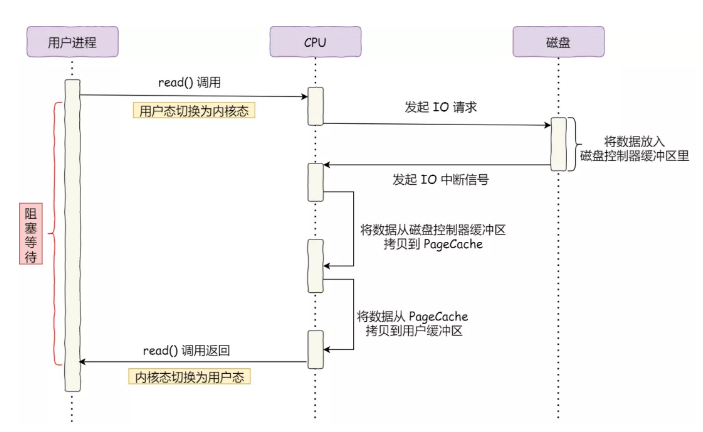

有dma:(dma负责从外设读取数据到内核空间，此时cpu去干别的事务)

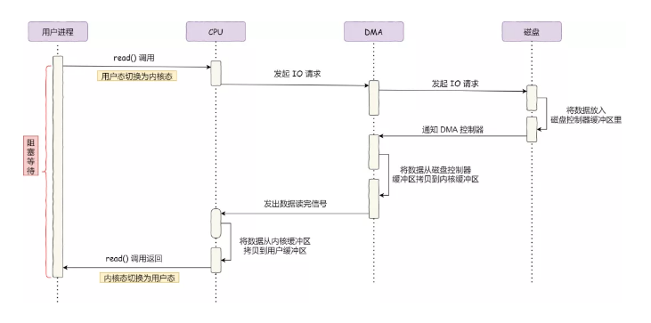

dma与cache


##### 1.34 读写时如何避免cache不一致？

```
参照:1.33 Cache和DMA一致性？
```

##### 1.35 yaffs、jffs、ubi文件系统比较？

```
参考:3. 文件系统
```

##### 1.36 linux下Hz、tick、jiffies关系？

```shell
#1.名词解释
linux系统中有几个重要的跟时间有关的名词，HZ、tick、jiffies
    HZ:表示每秒产生了多少次timer interrupts(时钟中断)
    tick:表示多长时间产生一次timer interrupts，是HZ的倒数
    jiffies:表示系统自开机以来，产生了多少次tick

#2.内核中1秒钟表示
jiffies+Hz

参考文档:
https://blog.csdn.net/uyguyu/article/details/7564761
```

##### 1.37 arm-linux启动分成几部分，简述流程？

##### 1.38 如何分配2MB、20MB、200MB的内核空间？

##### 1.39 1个8GHZ远比8个1GHZ有效率，为什么还要有多核？

##### 1.40 linux内核的组成部分？

```
进程管理:
	负责控制进程对cpu的访问，如任务的创建、调度和终止等；任务调度是进程管理最核心的工作，由linux内核调度器来完成，根据进程的优先级来选择运行的进程
	
进程通信:
	支持进程间各种通信机制，如管道、命名管道、信号、消息队列、内存共享、信号量和套接字等
	
内存管理:
	1.为各进程实现虚拟地址到内存物理地址的转换
	2.控制和管理多个进程，使之能够安全的共享主内存区域

网络接口:
	网络接口提供了各种网络标准的存取和对各种网络硬件的支持，接口可以分为网络协议和网络驱动程序
	网络协议部分负责实现每一种可能的网络传输协议
	网络驱动程序负责与硬件设备通讯，每一种可能的硬件设备都有相应的设备驱动程序
	
文件系统:
	VFS则是Linux基于各种逻辑文件系统抽象出的一种内存中的文件系统，隐藏了各种硬件设备细节，为用户提供统一的操作接口，是用户访问各种不同文件系统个设备时，不用区分具体的逻辑文件系统。Linux内核支持众多的逻辑文件系统，如Ext2、Ext3、Ext4、btrfs、NFS、VFAT等
	
设备驱动:
	Linux内核中很大一部分是Linux驱动，Linux驱动实现对外部设备的访问和管理
	
参考文档:
https://mp.weixin.qq.com/s/u7pjMQaE5E7_JpH_3jE5qw
```

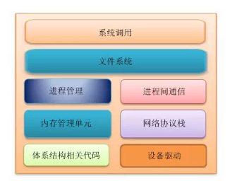

##### 1.41 系统调用的作用？

```shell
#1.系统调用的作用
	通过系统调用可以使得运行在用户空间的进程可以和内核之间进行交互

#2.系统调用存在的理由
	linux将整个虚拟地址空间分为2部分，用户空间和内核空间,并且规定用户空间不能直接访问内核空间，而内核空间可以访问用户空间，通过这样的级别划分，可以让内核空间更加稳定和安全。但是，当用户进程必须访问内核或者使用某个函数内核时，就必须使用系统调用来实现
	
#3.系统调用的应用
	用户程序负责调用系统调用的函数
	内核程序负责实现系统调用，以及提供系统调用的接口
	
参考文档:
https://mp.weixin.qq.com/s/-6os9wUZLFmRpVALhI1Atg
```

##### 1.42 系统调用read/write，内核具体做了哪些事情？

##### 1.43 linux下检查内存状态的命令？

```shell
1.查看某个进程内存状态
#方式1:
cat /proc/fd(进程pid)/status 
....
VmSize:    51764 kB #占用的虚拟内存
VmRSS:      2560 kB #占用的物理内存
....

#方式2:
cat /proc/fd(进程pid)/statm 
12941 640 303 353 0 2373 0

#参数解释:
Size (pages) 任务虚拟地址空间的大小 VmSize/4，#占用的虚拟内存
Resident(pages) 应用程序正在使用的物理内存的大小 VmRSS/4，#占用的物理内存
Shared(pages) 共享页数 0
Trs(pages) 程序所拥有的可执行虚拟内存的大小 VmExe/4
Lrs(pages) 被映像到任务的虚拟内存空间的库的大小 VmLib/4
Drs(pages) 程序数据段和用户态的栈的大小 （VmData+ VmStk ）4

参考链接:
https://blog.csdn.net/dutsoft/article/details/51250374

2.查看整个系统内存状态
# free -h
              total        used        free      shared  buff/cache   available
Mem:           1.8G        1.4G        100M        692K        257M        182M
Swap:            0B          0B          0B

#列解释:
total:总计物理内存的大小
used:已使用多大
free:可用有多少
Shared:多个进程共享的内存总额
Buffers/cached:磁盘缓存的大小

参考链接:
https://blog.csdn.net/21aspnet/article/details/6581037?utm_medium=distribute.pc_relevant.none-task-blog-BlogCommendFromMachineLearnPai2-1.channel_param&depth_1-utm_source=distribute.pc_relevant.none-task-blog-BlogCommendFromMachineLearnPai2-1.channel_param
```

##### 1.44 硬链接与软链接的区别？

```shell
#1.结论
	硬链接:与普通文件基本没有区别，inode都指向同一个文件在磁盘中的区块
	软连接:保存了其代表文件的绝对路径，是另外的一种文件，在硬盘上有独立的区块，访问时替换自身路径
	
#2.软连接作用
	linux通常用它来解决一些版本的问题，通过也会将一些目录层次较深的文件链接到一个更易访问的目录中
#2.
#建立硬连接
# ln aa aa.hard
#建立软连接
#ln -s aa aa.soft

#查看软连接和硬连接
[root@iz2ze87o2y8w8nqmfvf34dz zk]# ls -il
1576885 -rw-r--r-- 1 root root     4 Oct 12 10:17 aa
1576422 -rw-r--r-- 1 root root    16 Oct 12 10:08 aa.hard
1576422 lrwxrwxrwx 1 root root     2 Oct 12 10:08 aa.soft -> aa

(1)修改其中任何一个文件内容，其他文件内容也多随之发生变化
(2)硬连接和源文件的inode节点一样(存储了数据在磁盘中的位置，类似与一个指针)，指向了相同的磁盘位置，即使删除了源文件，还可以通过硬链接访问，磁盘中的数据不会消失
(3)软连接和源文件的inode节点不一样，软连接的inode节点中存储的是源文件的路径，如果把源文件删除了，通过软连接就不能再访问

参考链接:
https://blog.csdn.net/weixin_34096182/article/details/88011793?utm_medium=distribute.wap_relevant.none-task-blog-searchFromBaidu-6.wap_blog_relevant_no_pic&depth_1-utm_source=distribute.wap_relevant.none-task-blog-searchFromBaidu-6.wap_blog_relevant_no_pic
```

##### 1.45 计算机中，32bit与64bit有什么区别？

```
CPU分为32位CPU和64位CPU,同时操作系统也要相对于CPU分为32位操作系统和64位操作系统

数据处理能力，64位cpu处理速度变大
32位cpu中的寄存器为32位，一次能处理4字节数据
64位cpu中的寄存器为64位，一次能处理8字节数据

内存寻址能力，支持内存变大
32位cpu，内存寻址能力为2^32字节
64位cpu，内存寻址能力为2^64字节

参考链接:
https://zhidao.baidu.com/question/1445672285571164900.html
```

##### 1.46 linux操作系统挂起、休眠、关机命令？

````
http://www.cppcns.com/os/linux/168193.html
````

##### 1.47 bootloader作用

```
uboot的最终目的就是从flash读取内核，放到内存中，然后启动内核

uboot启动分为2阶段:
第1阶段:硬件初始化(设置处理器模式为SVC模式，关闭看门狗，屏蔽中断，初始化sdram)，设置堆栈，最后跳转到第2阶段
第2阶段:从flash中读出内核,启动内核

参考文档:
https://www.jianshu.com/p/b7205bb30865
```

##### 1.48 kernel panic、oops、oom

```shell
#1.panic、oops、oom之间的关系
panic：该文件表示如果发生kernel pannic(内核严重错误)，则内核在重新引导之前等待的时间(以秒为单位)，路径/proc/sys/kernel/panic
oops：内存发生错误，例如有空指针
oom：内存泄漏

oops、oom可能会引发panic，也可以不引发pannic，是可以通过设置的

oops通过设置: /proc/sys/kerne/panic_on_oops,当设置为1时，表示只要发生oops则引发了kernel pannic
oom通过设置: /proc/sys/vm/panic_on_oom，当设置为1时，表示只要发生oom则引发了kernel pannic

#2.pannic与系统重启的关系
当发生kernel panic时，系统可以挂掉，也可以设置重启，该操作可以在用户空间对内核进行设置

/proc/sys/kerne/panic

0秒:表示在发生内核严重错误时将禁止自动重新引导
>0:表示内核在重新引导之前等待的时间

#3.当发生oom时的选择
当内核严重不足时，会出现oom的情况，内核有2种选择:
	1.直接panic
	2.杀掉部分进程，释放一些内存

以上2个选择，可以通过/proc/sys/vm/panic_on_oom可以控制，当panic_on_oom为1时，直接panic，当panic_on_oom=0时通过oom killer杀掉部分进程(默认为0)

内核选择杀死哪个进程基本原理:

可以在用户空间操作每个进程的/proc/PID/oom_score_adj内核参数来决定哪些进程不容易OOM killer选中杀掉，oom_score_adj的范围是-17 ~ 15，其中15最大，-17最小，当为-17表示禁止使用OOM(即该进程不允许被杀死),
内核会根据/proc/PID/oom_score的值选择杀死哪一个进程，oom_score的分数越高越会被内核优先杀掉，当oom_score_adj = -17时，oom_score = 0，表示该进程不允许被杀死

参考文档:
https://www.cnblogs.com/machangwei-8/p/10354636.html

#4.kernel oops和panic是一回事吗
oops表示惊叹，panic表示惊慌，panic的程序显示要高于oops，内核panic后就死机了俗称 内核崩溃，但是内核报oops，这个时候不见得会panic，它可能只是报个oops，杀死进程而已，更加以下代码：
void die(const char *str, struct pt_regs *regs, int err)
{
	if (in_interrupt())
		panic("Fatal exception in interrupt");

	if (panic_on_oops)
		panic("Fatal exception");
}

总结如下:
	1.非中断上下文的oops只是oops，只是打印oops-打印出堆栈信息，可以使用dmesg查看
	2.中断上下文oops要panic
	3.如果设置了pannic_on_oops，任何oops都是pannic
	
参考文档:
http://news.eeworld.com.cn/mp/ymc/a52750.jspx
```

##### 1.49 怎样判断内核驱动是否稳定

```

```

##### 1.50 dma与cache一致性问题

```
https://blog.csdn.net/michaelcao1980/article/details/19191167
https://blog.csdn.net/waterhawk/article/details/50723677
```

##### 1.xx IIC原理，总线框架？

##### 1.xx framebuffer机制？

##### 1.xx usb驱动总线框架？

#### 2. 同步相关

##### 2.1 spinlock与信号量的区别？在使用时需要注意哪些？

```
在应用层，实现互斥或者同步更多的是多线程中
在内核层，实现互斥或者同步更多的是进程中

使用自旋锁的进程不能阻塞，使用信号量的进程可以阻塞，进程进入什么状态是由内核来决定的，因此在中断服务程序中要实现互斥需要使用自旋锁而不能使用信号量

自旋锁在同一时刻只能被最多一个内核任务持有，所以一个时刻只有一个线程允许存在于临界区，因此可以应用在多处理机器或运行在单处理器的抢占式内核中
```

##### 2.2 linux中的同步机制？

```
在linux内核中一般使用自旋锁、互斥锁、信号量来实现加锁机制
在linux内核中一般使用等待队列和完成量来实现同步机制
在linux内核中一般使用工作队列、tasklet实现中断下半部
```

##### 2.3 linux系统实现原子操作有哪些方法

##### 2.4 驱动里面为什么要有并发、互斥的控制？

```
保证对共享资源的互斥访问
```

#### 3. 中断相关

##### 3.1 linux中软中断的实现原理？

##### 3.2 linux中断响应的执行流程？

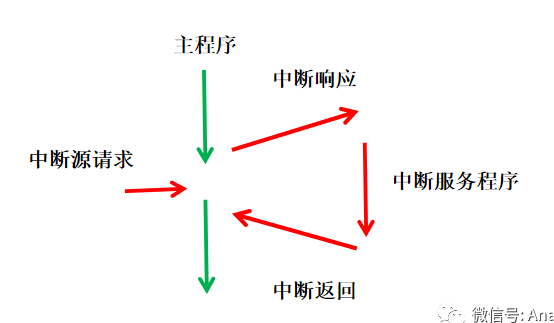

##### 3.3 linux中中断实现机制、tasklet和workqueue的区别好底层实现的区别，为什么要区分中断上半部和中断下半部？

```
参考:1.29 内核的上半部和下半部的根本区别是什么？
参考:1.30 下半部的实现机制有几种？主要区别是什么？
```

##### 3.4 中断服务程序为什么不能睡眠？

```shell
中断服务程序中不能睡眠

#备注
(1)首先这里所说的中断是硬件中断，服务程序是中断服务程序-中断上半部
(2)执行中断服务程序时，内核处于中断上下文中，此时内核与进程无关，如果睡眠后就不能调度回来了，因为调度程序调度的是进程，而中断服务程序却和进程无关

参考链接:
https://wenwen.sogou.com/z/q899241461.htm
```

##### 3.5 linux中断可以嵌套吗？

##### 3.6 IRQ和FIQ有什么区别，在cpu里面是怎么做的？

##### 3.7 中断与异常的关系

```
中断分为外部中断和内部中断，外部中断即平常所说的中断，内部中断即异常

外部中断:是由于系统外的某件事情引起的，与现行指令无关
内部中断:是由于执行了现行指令引起的

相同点:都是cpu对系统发生某个事情做出的一种反应
异同点:中断是由外因引起的，异常是由cpu本身原因引起的

参考链接:
https://blog.csdn.net/qq_29996285/article/details/88078939
```

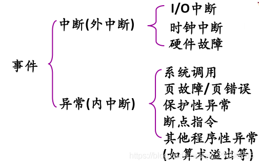

##### 3.8 linux中的中断上半部和中断下半部

```shell
中断上半部: --> 中断处理函数
功能:
	响应中断，当中断发生时，它就把设备驱动程序中中断处理例程的下半部挂到设备的下半部执行队列中，然后继续等待新的中断到来。上半部之所以块，是因为
	它完全屏蔽中断
	
中断下半部: --> 软中断、tasklet、工作队列
功能:
	下半部几乎完成了中断处理程序所有的事情，因为上半部只是将下半部排到了它们所负责的设备中断的处理队列中去，然后就不做其它的处理了。下半部是可以中断的。
	所以在运行期间，如果其他设备产生了中断，这个下半部可以暂时的中断掉，等到那个设备的上半部运行完了，再回头运行整个下半部

示例：
当网卡接收流入网络的数据包时，需要通知内核数据包到了，网卡需要立即完成这件事，从而优化网络的吞吐量和传输周期，以避免超时。因此网卡立即发出中断，通知内核这里有最新的数据包。内核通过执行网卡已注册的中断处理程序作出应答。中断开始运行，应答硬件，复制最新的网络数据包到内存，然后读取网卡更多的数据包，这些都是重要的、紧迫的、又与硬件相关的的工作。处理和操作其他数据包的其他工作在随后的下半部分进行。

#备注:
(1)中断上半部与下半部最大的区别在于是否可以被中断，上半部不能被中断，下半部可以被中断
(2)中断与异常:
中断本质上是一种特殊的电信号，由硬件设备发向处理器。处理器接收到中断后，会马上向操作系统反映此信号的到来，然后就由操作系统负责处理这些新到来的数据。
在处理器执行到由于编程失误而导致的错误指令（如被0除）的时候，或者是在执行期间出现特殊情况（如缺页），必须靠内核来处理的时候，处理器就会产生一个异常。
(3)Linux 中的中断处理程序是无须重入的。当给定的中断处理程序正在执行的时候，其中断线在所有的处理器上都会被屏蔽掉，以防在同一个中断线上又接收到另一个新的中断。通常情况下，除了该中断的其他中断都是打开的，也就是说其他的中断线上的重点都能够被处理，但是当前的中断线总是被禁止的，故，同一个中断处理程序是绝对不会被自己嵌套的。

参考文档:
https://blog.csdn.net/newtonnl/article/details/46004451
https://blog.csdn.net/yxfabcdefg/article/details/53127155?utm_medium=distribute.wap_relevant.none-task-blog-baidulandingword-3
https://www.cnblogs.com/cjj-ggboy/p/12309531.html

中断号、中断向量表、中断处理函数的关系
当发生中断时，cpu跳转到中断向量表的开始地址，根据中断号，从中断向量表中获取到中断处理函数的地址，然后执行
https://blog.csdn.net/weixin_33976072/article/details/86343937
https://blog.csdn.net/weixin_44146373/article/details/104218868?utm_medium=distribute.wap_relevant.none-task-blog-BlogCommendFromMachineLearnPai2-7.wap_blog_relevant_pic&depth_1-utm_source=distribute.wap_relevant.none-task-blog-BlogCommendFromMachineLearnPai2-7.wap_blog_relevant_pic

linux中断处理流程
https://blog.csdn.net/zwl1584671413/article/details/108266070
https://blog.csdn.net/zwl1584671413/article/details/108266070
```

### 三、 网络

#### 1. 基本问题

```shell
#参考总文档:
https://mp.weixin.qq.com/s/tH8RFmjrveOmgLvk9hmrkw

#0.tcp协议格式
序列号:
	在建立连接时由计算机生成的随机数作为其初始值，通过SYN包传给接收端主机，每发送一次数据，就累加一次数据字节数大小。用来解决包乱序问题

确认序列号:
	只期望下一次收到的数据包的序列号，发送端收到这个确认应答以后可以认为在这个序列号以前的数据都已经 被正常接收，用来解决不丢包问题
	
控制位:
	SYN:该位为1时，表示希望建立连接，并在其序列号的字段进行序列号的初始值的设定
	ACK:该位为1时，确认应答的字段变为有效，TCP规定除了最初建立连接时的SYN包之外该位必须设置为1
	FIN:该位为1时,表示今后不再有数据发送，希望断开连接
	RST:该位为1时，表示TCP连接中出现异常必须强制断开连接
	
#1.tcp与udp之间的区别
(1)连接

TCP是面向连接的传输协议，传输数据前要先建立连接 --> 即有3次握手的过程
UDP是不需要连接，即刻传输数据

(2)服务对象
TCP是一对一的2点服务
UDP支持一对一，一对多，多对多通信

(3)可靠性
TCP可以可靠交付数据，保证数据无差错、不丢失、不重复
UDP是不保证可靠交付数据

(4)流程控制、拥塞控制
TCP有流量控制、拥塞控制的机制，保证数据的传输
UDP没有，即使网络拥堵也不影响发送速率

#2.tcp与udp应用场景
使用TCP还是UDP实际是在质量和实时性方面做权衡

tcp --> 保证的是质量
ucp --> 保证的是实时性

对于视频网站，更大需求是视频质量好，没有马赛克，可以缓冲一些数据，再播放，对速度没有严格的要求，因此使用的是tcp
对于视频聊天，更大需求是速度快，图像有点不清晰可以接收，因此使用的是udp

参考文档:
https://segmentfault.com/q/1010000004953614

#3.一个ip的服务器监听了一个端口，它的tcp的最大连接数是多少
最大TCP连接数 = 客户端的ip数 × 客户端的端口数 = 2^32 × 2^16
当然这是理论上线，会受到以下因素影响:
(1)文件描述符限制
(2)内存限制，每个tcp连接都要占用一定的内存，操作系统是有限的

#4.tcp连接时为什么是3次握手，不能是2次或者4次
(1)3次握手能防止历史连接
(2)3次握手帮助双方同步初始化序列号
(3)3次握手能减少双方不必要的资源开销

2次握手以上3点都不能保证，4次握手可以(将SYN+ACK分成2部分:SYN、ACK)，但是3次握手是理论上的最小值

#5.为什么挥手需要4次
(1)关闭连接时，客户端向服务端发送FIN时，仅仅表示客户端不在发送数据，但是还能接收数据
(2)服务端收到客户端FIN报文后，先回一个ACK应答报文，而服务端可能还有数据需要处理和发送，等服务端不在需要发送数据使，才才发送FIN报文给客户端表示同意现在关闭连接
(3)客户端收到服务端的FIN后，在发送ACK

服务端的ACK和FIN一般都是分开来发送，因此比握手多了一次，成了4次挥手

#6.为什么需要TIME_WAIT的状态
(1)足以保证2个方向上的数据包被丢弃，使得原来连接的数据包在网络中自然消失，再次出现的数据包一定都是新连接的所产生的
(2)保证连接正确关闭
#7.为什么TIME_WAIT等待的时间是2MSL
MSL:报文最大生成时间

(1)足以保证2个方向上的数据包被丢弃，使得原来连接的数据包在网络中自然消失，再次出现的数据包一定都是新连接的所产生的
(2)一来一回需要等待2MSL

#8.为什么服务端易受到SYN攻击
假设攻击者短时间伪造不同 IP 地址的 SYN 报文，服务端每接收到一个 SYN 报文，就进入SYN_RCVD 状态，但服务端发送出去的 ACK + SYN 报文，无法得到未知 IP 主机的 ACK 应答，久而久之就会占满服务端的 SYN 接收队列（未连接队列），使得服务器不能为正常用户服务

#9.既然ip层会分片，为什么TCP层还需要MSS呢
MTU:一个网络包中的最大长度，以太网一般为1500字节
MSS:除去IP头和TCP头，一个网络包所能容纳的TCP数据的最大长度

当ip层有一个超过MTU大小的数据要发送时，那么ip层就要进行分片，把数据分配成若干片，保证每一个分片都小于MTU,把一份ip数据包进行分片以后，由目标主机的IP层来进行重新组装后，在交给上一层tcp传输层，但是如果一个ip分配丢失，整个ip报文的所有分片都给重传，但是ip层本身没有重传机制，得由传输层tcp来负责超时重传，这样效率低。为了达到最佳的传输效能 TCP 协议在建立连接的时候通常要协商双方的 MSS 值，当 TCP 层发现数据超过 MSS 时，则就先会进行分片，当然由它形成的 IP 包的长度也就不会大于 MTU ，自然也就不用 IP 分片了，经过 TCP 层分片后，如果一个 TCP 分片丢失后，进行重发时也是以 MSS 为单位，而不用重传所有的分片，大大增加了重传的效率

#客户端connect成功后在第几次握手，accept返回是在第几次握手
客户端 connect 成功返回是在第二次握手，服务端 accept 成功返回是在三次握手成功之后
```

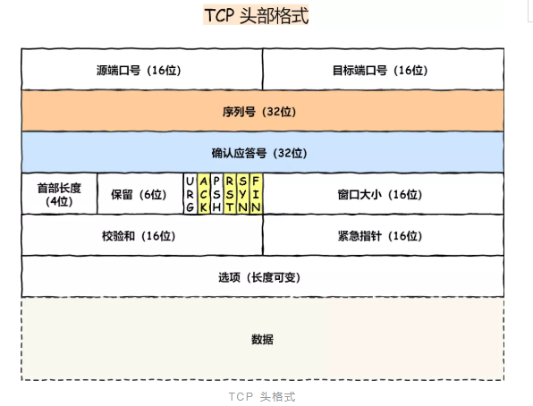


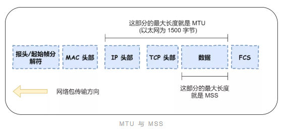

#### 2. ip层

```shell
#参考总文档:
https://mp.weixin.qq.com/s/qydIO7NDfFTYs4-ZZlfgRg

#1.ip层作用
实现主机与主机之间的通信，即点对点通信

#2.ip层与MAC层区别
MAC的作用是实现直连的2个设备之间的通信，而ip层负责没有直连的2个网络之间的通信传输

#3.ip层为什么分片
```

#### 3. 应用层-HTTP/HTTPS

```shell
#参考总文档:
https://mp.weixin.qq.com/s/bUy220-ect00N4gnO0697A

#1.HTTP是什么?
超文本传输协议

「协」字，代表的意思是必须有两个以上的参与者

#2.HTTP中的GET和POST区别

#3.HTTP的特性
无状态 --> 用cookie、session来解决
明文传输 --> 用HTTPS来解决

#4.HTTPS的加密流程
存在以下3方:服务端、客户端、证书机构
使用了混合加密:非对称加密+对称加密
证书机构:
	(1)将服务端的公钥用自己的私钥进行数字签名
	(2)将数字签名+服务器公钥生成一个证书给服务端
	
服务端:
	(1)存储了CA颁发的证书
	(2)存储了自己私钥
	
客户端:
	获取服务端的证书 --> 用CA的公钥对证书进行认证，并从中获取到服务端的公钥，用该公钥对会话密钥进行加密并传输给服务端，服务端用私钥对其解密，拿到会话密钥，之后双发就用会话密钥进行通信
```

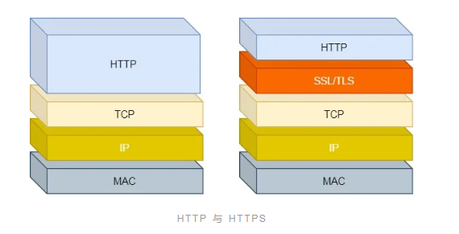

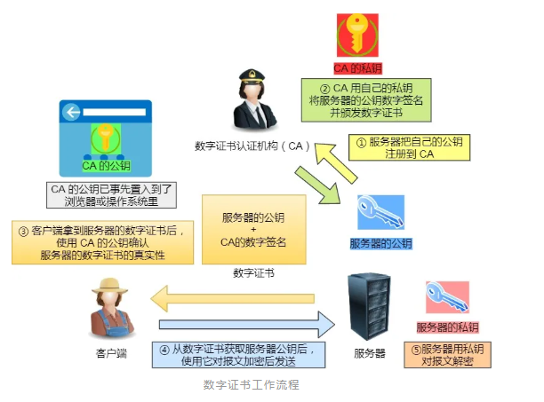

### 四、 c/c++

#### 1. 基础题

##### 1.1 大小端的区别以及各自的优点，什么时候应用？

```
https://www.zhihu.com/question/275738523/answer/382407340
https://mp.weixin.qq.com/s/W1cjfUnU5gG9qXQ9JCbvIg
```

##### 1.2 一个程序从开始运行到结束的完整过程？

```
1.预处理:处理源代码中的预处理指令，引入头文件，去除注释，处理所有的条件编译指令，宏的替换，添加行号，保留所有的编译器指令
2.编译:生成汇编代码
3.汇编:将汇编代码生成目标文件.o
4.链接:将.o文件连接起来

备注:
https://www.cnblogs.com/xidian2014/p/8504580.html
```

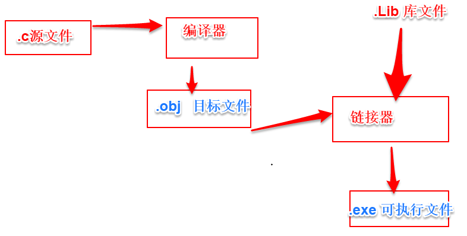

##### 1.3 linux中内存模型？

```
参考链接:
https://www.cnblogs.com/zhangjinfu/articles/11275895.html
```

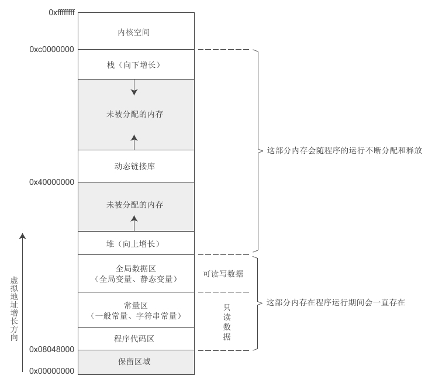

##### 1.4 什么是内存泄漏和内存溢出？

```shell
#1.定义
内存泄漏:是指本应该回收(不在使用)的内存对象无法被系统回收的现象
内存溢出:系统在未程序分配内存时，发现内存不足，抛出异常，这叫做内存溢出

#2.二者的关系
手机设备的内存空间是有限的，为每个应用所分配的内存空间更是有限的，当内存泄漏越来越多时，可分配的内存空间就会越小，app应用性能就越差，当内存空间不足时再次申请内存时就会引起OOM

参考文档:
https://mp.weixin.qq.com/s/d2cOF7z0O9LoJShkxLI7mA
```

- 内存泄漏

  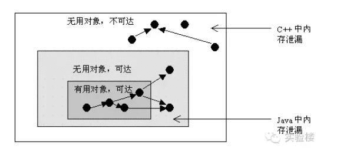

- 内存溢出

  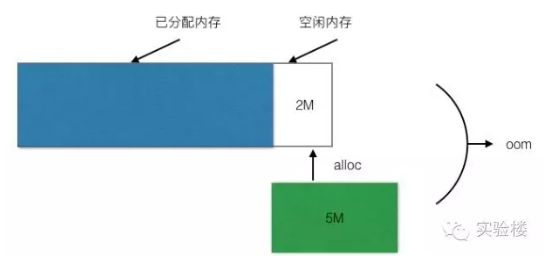

##### 1.5 new、malloc delete free关系？

```shell
#1.这些关键字的作用
malloc/free和new/delete都是用来动态内存管理的，其中malloc和new用来在堆上申请空间，在堆上的内存都需要用户自己来管理，所以动态申请好的空间在使用完后需要用相应的free和delete由用户自己手动释放，否则会造成内存泄漏

#2.区别

1.属性不同
malloc/free属于标准的库函数，new/delete属于c++的操作运算符

2.传入参数不同
malloc需要显示的传入申请内存的大小，而new无需显示指定内存的大小，编译器会根据类型自行计算

3.返回类型不同
malloc内存分配成功返回的是void *,需要通过强制类型转换将void *指针转换成需要的类型；new操作符内存分配成功使，返回的是对象类型的指针，类型严格与对象匹配，无须进行类型转换，属于类型安全的操作符

4.分配失败不同
malloc分配内存失败时返回NULL,new内存失败时抛出异常

5.无论释放几个空间大小，free只传递指针，多个对象时delete需加[]
....

#备注:
	new/delete底层调用的是malloc和free
参考文档：
https://blog.csdn.net/nie19940803/article/details/76358673?utm_medium=distribute.pc_relevant_t0.none-task-blog-BlogCommendFromMachineLearnPai2-1.channel_param&depth_1-utm_source=distribute.pc_relevant_t0.none-task-blog-BlogCommendFromMachineLearnPai2-1.channel_param

https://blog.csdn.net/weibo1230123/article/details/81980889
```

##### 1.6 malloc的底层实现？

```c
当开辟的空间小于128k时，调动brk()函数，malloc底层实现是调用brk()，如果只是调用了但从来不访问它，那么物理页是不会分配的，即不占用实际的物理空间
当开辟的空间大于128k时，mmap()系统调动来实现虚拟地址空间(堆和栈中间)找一块空间来开辟

brk()系统调用开辟的空间，低内存地址需要等到高地址内存释放以后才能彻底释放(物理内存)，但是可以继续使用
mmap()分配的空间，可以单独释放

参考文档:
#下面链接中包含申请与释放的全过程
https://www.cnblogs.com/zpcoding/p/10808969.html
```

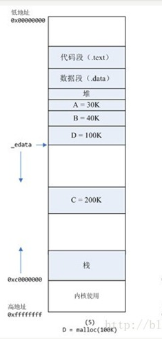

##### 1.7 在1G内存的计算机中能否malloc(1.2G)？

```shell
malloc能够申请的空间大小与物理内存的大小没有直接关系，仅与虚拟地址空间相关，程序运行时，堆空间是程序向操作系统申请划分出来的一块虚拟内存，应用程序通过malloc申请空间，得到的是虚拟地址空间中的地址，之后程序运行所提供的物理内存是由操作系统完成的

本题要申请空间的大小为 1.2G=2 30 × 1.2 Byte ，1.2G=(1024*1024*1024)*1.2Byte转换为十六进制约为 4CCC CCCC ，这个数值已经超过了 int 类型的表示范围，但还在 unsigned 的表示范围。幸运的是 malloc 函数要求的参数为 unsigned

参考文档:
https://blog.csdn.net/weixin_41289588/article/details/88695482
```

##### 1.8 指针和引用的相同点和区别？如何相互转换？

```shell
(1)指针:指针是一个变量，只不过这个变量存储的是一个地址，指向内存单元
   引用:和原来的变量是一个东西，只是一个别名
(2)指针在初始化后可以再次改变，而引用在初始化后就不能再发生变化

#include<iostream>
using namespace std;

//指针可以改变原来内存单元中的值
void testp(int * p)
{
	*p = 50;
}

//引用可以改变内存单元中的值
void test(int &a)
{
	cout << &a << endl;
	cout << a << endl;
	a = 100;
}

int main(void)
{
    int a=1;
	cout << &a << endl;
	cout << a << endl;
	testp(&a);
	cout << a << endl;
    test(a);
	cout << a << endl;
    return 0;
}

//打印信息:
0x7ffe826b9dbc
1
50
0x7ffe826b9dbc
50
100

参考文档:
https://www.cnblogs.com/dolphin0520/archive/2011/04/03/2004869.html
```

##### 1.9 C语言检索内存情况，内存分配的方式？

##### 1.10 extern "C"的作用？

```c
//作用:
告诉编译器这部分代码按照C语言(而不是C++)的方式进行编译，目的是能够正确实现C++代码调用其他C语言代码
    
//背景:
    	因为在C++出现以前，很多代码都是C语言写的，而且很多底层库也是C语言写的，为了更好的支持原来的C代码和已经写好的C库，extern “c”是其中的一个策略
    
//使用方式:
#ifdef __cplusplus //而这一部分就是告诉编译器，如果定义了__cplusplus(即如果是cpp文件， 
extern "C"{ //因为cpp文件默认定义了该宏),则采用C语言方式进行编译
#include"moduleA.h"
#endif
   
#ifdef __cplusplus
}
#endif

参考文档:
https://www.cnblogs.com/xiangtingshen/p/10980055.html
```

##### 1.11 重写memcpy()函数的需要注意哪些问题？

```c
1.注意最后一个参数是字节数
int main() {
	int a[10] = { 0,1,2,3,4,5,6,7,8,9 };
	memcpy(a, a + 3, 2);
	for (int i = 0; i<10; i++){
		printf("%d ", a[i]);
	}
	return 0;
}

是不是以为结果是：3,4,2,3,4,5,6,7,8,9
其实答案是：3,1,2,3,4,5,6,7,8,9
因为最后一个参数2是2个字节，一个ini是4个字节，所以只拷贝了3这个数字的低2个字节，如果想要拷贝2个元素的话需要做如下修改:
memcpy（a , a+3 , 2 * sizeof(int)）;
这样结果就是3,4,2,3,4,5,6,7,8,9
    
#备注:
https://blog.csdn.net/weixin_44717958/article/details/98490680
```

##### 1.12 数组到底存放在哪里？

```
数组存放到哪里，有以下几种情况:
(1)如果是全局变量，则整个数组就在是数据段中，始终有效
(2)如果是局部变量，则在栈中
(2)如果是用malloc或new，则是在堆中

参考文档:
https://zhidao.baidu.com/question/541947391.html
```

##### 1.13 struct和class的区别？

```
https://blog.csdn.net/weixin_39640298/article/details/84349171?utm_medium=distribute.wap_relevant.none-task-blog-title-2
```

##### 1.14 char和init之间的转换？

```c
1.首先char与int都分为signed与unsigned类型，默认情况下都是signed类型。
2.从长字节数据类型转换为短字节数据类型，会产生截断：
如从4字节的int类型转换成1个字节的char类型，则取int数据的最低的一个字节，将这个字节的数据赋给char型数据，且是有符号的，即首位为符号位；而如果是从int转换成unsigned char类型，则整个一个字节都是数据，没有符号位。
    
#include <stdio.h>  
int main()  
{  
    int s=128;  
    unsigned char unChar = s;  
    char Char = s;  
	
    printf("%x\t%x\n",Char,unChar);//按16进制输出
    printf("%d\t%d\n",Char,unChar);//按10进制输出
	
} 

//打印信息:
ffffff80	80
-128	128
    
#include <stdio.h>  
int main()  
{  
    int s1,s2;  
    unsigned char unChar=128;  
    char Char=128;  
    s1=(int)unChar;  
    s2=(int)Char;  
    printf("%x\t%x\n",s1,s2);//按16进制输出  
    printf("%d\t%d\n",s1,s2);//按10进制输出  
}  

//打印信息:
80	ffffff80
128	-128
    
https://blog.csdn.net/smilesundream/article/details/77881995
```

##### 1.15 static的用法

```
c语言中的static关键字，3种用法
(1)静态局部变量 --> 用于函数体内部修饰变量，这种变量长期存在于该函数中
(2)静态全局变量 --> 定义函数体外，用于修饰全局变量，表示该变量只在本文件可见
(3)静态函数    --> 表示该函数只在本文件可见

c++语言中的static关键字，2种用法
(1)静态成员变量 --> 表示每个class只有一个，各个对象共享这一个变量，使用类名::变量访问
(2)静态成员函数 --> 用于修饰class的成员函数，使用类名::函数名访问

参考文档:
https://blog.csdn.net/majianfei1023/article/details/45290467?utm_medium=distribute.wap_relevant.none-task-blog-BlogCommendFromMachineLearnPai2-1.wap_blog_relevant_no_pic&depth_1-utm_source=distribute.wap_relevant.none-task-blog-BlogCommendFromMachineLearnPai2-1.wap_blog_relevant_no_pic
```

##### 1.16 const和#define的区别？

```c
const是c/c++中的一个关键字，一般用来定一个常量，例如const int var = 100，即以后的值不能再发生变化
#define是宏定义，在编译阶段会将所有使用宏的地方简单的进行替换，如下:
    #define value 100
    int var = value ---> 替换成int var = 100

const和define都能定一个常量，但是const要比define更加省内存，如下:

#define PI 3.14159 //常量宏 
const double Pi=3.14159; //此时并未将Pi放入ROM中 ...... 
double i=Pi; //此时为Pi分配内存，以后不再分配！ 
double I=PI; //编译期间进行宏替换，分配内存 
double j=Pi; //没有内存分配 
double J=PI; //再进行宏替换，又一次分配内存！ 

https://mp.weixin.qq.com/s/MHK3Rf7qWw0aJbBWVgZZ0A
```

##### 1.17 常量指针和指针常量？

```
https://mp.weixin.qq.com/s/JT7RjNEAqro9BSxdRCd-CA
```

##### 1.18 c/c++中变量的作用域

```
全局变量:
	定义:在所有函数外部定义的变量（通常是在程序的头部），称为全局变量
	范围:全局变量的值在程序的整个生命周期内都是有效的,可以被任意函数访问
	
局部变量:
	定义:在函数或一个代码块内部声明的变量
	范围:它们只能被函数内部或者代码块内部的语句使用
	
参考文档:
https://mp.weixin.qq.com/s/bZcMkKnNoFkHWiHDeKyaig
```

##### 1.19 c++中类型转换机制？各适用于什么环境？

```c
在c++的世界中，有这样两种概念，向上类型转换和向下类型转换
在C语言中，强制类型转换存在两种等价形式：Type(Value)或(Type)Value
C++的类型转换分为2种，一种隐式转换(系统跟据程序的需要而自动转换的)，一种显示转换(自己主动让这个类型转换成别的类型)，应尽量必须隐式转换而使用显示转换    
/*
	方向:从等号右边的数据类型转换为左边的数据类型
	
	向上转换：子类指针(右边数据类型)转换为父类指针(左边数据类型)
	
	向下转换：父类指针转换为子类指针
*/

//1.代码示例:
#include <iostream>
using namespace std;

class Human {

	public:
		Human() {};
		virtual void print() {cout << "human" << endl;}
};

class Student : public Human {

	public:
		Student() {}
		void print2() {cout << "student" << endl;}
};

class Teacher {

	public:
		Teacher() {}
};

int main()
{
   //测试1:
   int a = static_cast<int>(3.2);
   cout << a << endl;
	
	Human * h = new Human();
	Student *s;
	
	//测试2
	//基类可以指向子类，向上转换
//	h = s;
	
	//子类指向基类，直接这样进行转换编译器报错
//	s = h;
	s = static_cast<Student *>(h);
    s->print();

	//测试3:测试dynamic_cast
	Human * h1 = new Student(); //本身是一个Human类型的指针，但是指向了Student对象

	/*
		在类层次间进行上行转换时，dynamic_cast和static_cast效果是一样的
		在向下转换时，dynamic_cast具有类型检测功能比static_cast更安全
	*/
	//向下转换
	dynamic_cast<Student *>(h1)->print2();
	static_cast<Student *>(h1)->print2();
	
	//此处会转换失败，可以看到在运行期间进行转换，然后根据返回值进行检查是否转换成功
	if(dynamic_cast<Teacher *>(h1)) {
		cout << "success" << endl;
	}
	else {
		cout << "failed" << endl;
	}
	
	//此处在编译阶段会报错
#if 0
	if(static_cast<Teacher *>(h1)) {
		cout << "success" << endl;
	}
	else {
		cout << "failed" << endl;
	}
#endif
	
   return 0;
}

//打印信息:
3
human
student
student
failed
    
//2.类型转换比较
static_cast:是在编译时处理，可以实现C++内部基本类型之间的转换，只能在有相互联系的类型中进行转换，基类中不一定包含虚函数
dynamic_cast:是在运行期间处理，运行是需要进行检查,不能用于C++内部基本类型之间的转换，要想使dynamic_cast进行转换，必须满足下面2个条件：
    (1)基类中一定要有虚函数
    (2)要有继承
    
参考文档:
https://blog.csdn.net/xiaonan153/article/details/81381381
https://www.cnblogs.com/xiaodingmu/p/7351919.html
```

##### 1.20 继承和虚继承？

```c
虚基类:
	目的:解决多继承时产生的命名冲突，使得在派生类中只保留间接基类的一份成员
	
    //虚继承普通继承
	class B : virtual public A
    //普通继承
    class B : public A
        
参考文档:
https://blog.csdn.net/try_again_later/article/details/100523363
```

##### 1.21 多态的类内存布局是怎么样的？

```c
//1.C++中一个空的类占用内存空间大小，实际为1

#include <stdio.h>
#include <iostream>

using namespace std;

class X {
};

int main() {
    X a, b;
    printf("sizeof(X) = %ld\na: %ld\nb: %ld\n",sizeof(X), &a, &b);
    return 0;
}

//打印信息:
sizeof(X) = 1
a: 140734778694863
b: 140734778694862

原因:
	用这个字节地址来区分不同的对象，可以看到上面打印信息两个对象的内存地址，相差1字节
 
参考文档:
https://www.csdn.net/gather_26/OtDagg4sNDQ0OS1ibG9n.html

//2.C++中内存分布

https://www.cnblogs.com/WPF-342201/p/11479758.html
https://blog.csdn.net/yuupengsun/article/details/104136210
```

```c
//2.C++中内存分布,基于32位系统

//1.只有数据成员的对象

结论:类对象的大小就是所有成员变量大小之和
    
//代码:
#include<iostream>
#include<string>
 
using namespace std;
 
class Base_1
{
public:
    int base_1_1;/* 占用4字节 */
    int base_1_2;/* 占用4字节 */
	long long base_1_3; /* 占用8字节 */
};
 
int main()
{	
	cout << "sizeof(Base_1) = " << sizeof(Base_1) << endl << endl;		
	
	return 0;
}

//打印信息:
sizeof(Base_1) = 16

//2.有数据成员，并且包含一个普通函数，但是没有虚函数的对象

结论:普通的成员函数并不产生内存空间，也就不会对对象的布局造成任何影响
//代码
#include<iostream>
#include<string>
 
using namespace std;
 
class Base_1
{
public:
    int base_1_1;
    int base_1_2;
	
    void Base_1_fun()
	{
		cout << "void Base_1_fun()" << endl;
	}
};
 
 
int main()
{
	cout << "sizeof(Base_1) = " << sizeof(Base_1) << endl << endl;		
	
	return 0;
}

//打印信息:
sizeof(Base_1) = 8
    
//3.有数据成员，并且包含一个虚拟函数的对象

结论:有虚函数的对象包含一个指向虚函数表的指针，在32位系统占用4个字节
//代码    
#include<iostream>
#include<string>
 
using namespace std;
 
class Base_1
{
public:
    int base_1_1;
    int base_1_2;
	
    virtual void Base_1_fun_1()
	{
		cout << "virtual void Base_1_fun_1()" << endl;
	}
};
 
 
int main()
{
	cout << "sizeof(Base_1) = " << sizeof(Base_1) << endl << endl;		
	
	return 0;
}

//打印信息:
sizeof(Base_1) = 12
    
//4.有数据成员，并且包含2个虚拟函数的对象

结论:真正保存对象中虚函数的是虚函数表，而这里的虚函数指针只是提供一个虚函数表的入口
//代码:
#include<iostream>
#include<string>
 
using namespace std;
 
class Base_1
{
public:
    int base_1_1;
    int base_1_2;
	
    virtual void Base_1_fun_1()
	{
		cout << "virtual void Base_1_fun_1()" << endl;
	}
	virtual void Base_1_fun_2()
	{
		cout << "virtual void Base_1_fun_2()" << endl;
	}
};
 
int main()
{	
	cout << "sizeof(Base_1) = " << sizeof(Base_1) << endl << endl;		
	
	return 0;
}

//打印信息:
sizeof(Base_1) = 12

参考文档:
https://blog.csdn.net/yuupengsun/article/details/104136210

//5.普通单继承且本身不存在虚函数的子类

sizeof(Base_1) = 12   (成员属性 + 指向虚函数表的指针)
sizeof(Derive_1) = 20 (Base成员属性 + Derive成员属性 + 指向虚函数表的指针)
    
//代码
#include<iostream>
#include<string>
 
using namespace std;
 
class Base_1
{
public:
    int base1_1;
    int base1_2;	
 
    virtual void base1_fun_1() 
	{
		cout << "virtual void Base_1_fun_1()" << endl;
	}
    virtual void base1_fun_2() 
	{
		cout << "virtual void Base_1_fun_2()" << endl;
	}
};
 
class Derive_1 : public Base_1
{
public:
    int derive1_1;
    int derive1_2;
};
 
int main()
{
	cout << "sizeof(Base_1) = " << sizeof(Base_1) << endl << endl;	
	cout << "sizeof(Derive_1) = " << sizeof(Derive_1) << endl << endl;	
	
	return 0;
}

//打印信息
sizeof(Base_1) = 12
sizeof(Derive_1) = 20

//6.基类存在虚函数，子类中也存在虚函数
    
//代码
#include<iostream>
#include<string>
 
using namespace std;
 
class Base_1
{
public:
    int base1_1;
    int base1_2;	
 
    virtual void Base_1_fun_1() 
	{
		cout << "virtual void Base_1_fun_1()" << endl;
	}
    virtual void Base_1_fun_2() 
	{
		cout << "virtual void Base_1_fun_2()" << endl;
	}
};
 
class Derive_1 : public Base_1
{
public:
    int derive1_1;
    int derive1_2;
	
	virtual void Derive_1_fun_1() 
	{
		cout << "virtual void Derive_1_fun_1()" << endl;
	}
};
 
int main()
{	
	cout << "sizeof(Base_1) = " << sizeof(Base_1) << endl << endl;	
	cout << "sizeof(Derive_1) = " << sizeof(Derive_1) << endl << endl;	
	
	return 0;
}

//打印信息:
sizeof(Base_1) = 12
sizeof(Derive_1) = 20
    
//7.子类中不存在虚函数，但是重写了基类中的虚函数
    
//代码:
#include<iostream>
#include<string>
 
using namespace std;
 
class Base_1
{
public:
    int base1_1;
    int base1_2;	
 
    virtual void Base_1_fun_1() 
	{
		cout << "virtual void Base_1_fun_1()" << endl;
	}
    virtual void Base_1_fun_2() 
	{
		cout << "virtual void Base_1_fun_2()" << endl;
	}
};
 
class Derive_1 : public Base_1
{
public:
    int derive1_1;
    int derive1_2;
	
	void Base_1_fun_1() 
	{
		cout << "virtual void Derive 重载 Base_1_fun_1()" << endl;
	}
};
 
int main()
{	
	cout << "sizeof(Base_1) = " << sizeof(Base_1) << endl << endl;	
	cout << "sizeof(Derive_1) = " << sizeof(Derive_1) << endl << endl;	
	
	return 0;
}

//打印信息:
sizeof(Base_1) = 12
sizeof(Derive_1) = 20
    
//8.子类中存在虚函数并且重写了基类中的虚函数

//代码
#include<iostream>
#include<string>
 
using namespace std;
 
class Base_1
{
public:
    int base1_1;
    int base1_2;	
 
    virtual void Base_1_fun_1() 
	{
		cout << "virtual void Base_1_fun_1()" << endl;
	}
    void Base_1_fun_2() 
	{
		cout << "virtual void Base_1_fun_2()" << endl;
	}
};
 
class Derive_1 : public Base_1
{
public:
    int derive1_1;
    int derive1_2;
	
	virtual void Base_1_fun_2() 
	{
		cout << "virtual void Derive 重载 Base_1_fun_2()" << endl;
	}
};
 
int main()
{	
	cout << "sizeof(Base_1) = " << sizeof(Base_1) << endl << endl;	
	cout << "sizeof(Derive_1) = " << sizeof(Derive_1) << endl << endl;	
	
	return 0;
}

//打印信息:
sizeof(Base_1) = 12
sizeof(Derive_1) = 20
    
参考文档:
sizeof(Base_1) = 12
sizeof(Derive_1) = 20
    
参考文档:
https://blog.csdn.net/yuupengsun/article/details/104136676
```

##### 1.22 被隐藏的基类函数如何调用或者子类调用父类的同名函数和父类成员变量？

```
https://blog.csdn.net/alpha_love/article/details/75222175
```

##### 1.23 多态实现的3个条件、实现原理？

```shell
#1.实现多态的3个条件
(1)要有继承
(2)要有虚函数重写
(3)用父类指针(父类引用指向子类对象)
参考文档:
https://blog.csdn.net/baixiaolong1993/article/details/89204076
```

```c
//示例1:多态
#include <iostream>

using namespace std;

//多态实现的3个条件
/*
	1.要有继承
	2.要有虚函数重写
	3.要用父类指针指向子类对象
*/
class Human {

	public:
		Human() { cout << "human 构造" << endl;}
		virtual ~Human() { cout << "human 析构" << endl;}
		//该成员函数为普通的函数
		void show() {cout << "human show" << endl;}
		//定义该成员函数为虚函数
		virtual void showMember() {cout << "human showMember" << endl;}
	
		int age;
};


//1.多态条件2:要有继承
class Student : public Human {

	public:
		Student() {cout << "Student 构造" << endl;}
		~Student() {cout << "Student 析构" << endl;}
		//该函数会覆盖基类中的show函数
		void show() {cout << "student show" << endl;}
		//2.多态条件2:要有虚函数重写(虚函数的定义是在基类中)
		virtual void showMember() {cout << "student showMember" << endl;}
};

int main() {
	
	//3.多态条件3:要用父类指针指向子类对象
	Human * h1 = new Student();
	
	//由于该函数并非虚函数，因此不会调用子类中的show方法而调用父类中的show方法
	h1->show();
	h1->showMember();
	
	delete h1;

	return 0;
}

//打印信息:
human 构造
Student 构造
human show
student showMember
Student 析构
human 析构
    
//备注:
    (1)构造函数与析构函数的调用顺序
    	1.构造函数的调用顺序
    		先调用基类的，然后调用子类的构造函数
    	2.析构函数的调用顺序
    		先调用子类的构造函数，然后调用基类的构造函数-->前提是基类的构造函数要声明为virtual虚函数，构造只会调用基类的析构函数，而不调用子类的析构函数，从而产生内存泄漏
 
 //示例2:只要存在父类指针指向子类对象，则析构函数需要声明为虚函数
 
#include <iostream>

using namespace std;

class Human {

	public:
		Human() { cout << "human 构造" << endl;}
		virtual ~Human() { cout << "human 析构" << endl;}
		void show() {cout << "human show" << endl;}
};

class Student : public Human {

	public:
		Student() {cout << "Student 构造" << endl;}
		~Student() {cout << "Student 析构" << endl;}
		//会造成基类show函数的隐藏
		void show() {cout << "student show" << endl;}
};

int main() {
	
	//情景1:会调用基类的构造函数 --> 子类的构造函数，同时也会调用子类的析构函数-->父类的析构函数 
	Student s;
	
	cout << "---------我是分割线----------" << endl;
	
	//情景2:假如父类的析构函数不定义成虚函数，则析构时只能调用父类的析构函数，而不能调用子类的析构函数；构造函数是正常调用
    Human *h = new Student();
	
	delete h;
	
	return 0;
}

//打印信息:
human 构造
Student 构造
---------我是分割线----------
human 构造
Student 构造
Student 析构
human 析构
Student 析构
human 析构

参考文档:
https://blog.csdn.net/baixiaolong1993/article/details/89204076
https://www.jianshu.com/p/108791c771f5
```

##### 1.24 对拷贝构造函数、深浅拷贝的理解？什么时候需要自定义拷贝构造函数？

##### 1.25 什么情况下会调用复制构造函数？

```
https://blog.csdn.net/wangjian530/article/details/103854150
```

##### 1.26 析构函数一般写成虚函数的原因？

```
首先析构函数可以为虚函数，当析构一个指向派生类的基类指针时，最好将基类的析构函数声明为虚函数，否则可以存在内存泄露的问题。

如果析构函数不被声明成虚函数，则编译器实施静态绑定，在删除指向派生类的基类指针时，只会调用基类的析构函数而不调用派生类析构函数，这样就会造成派生类对象析构不完全。

参考文档:
https://blog.csdn.net/libaineu2004/article/details/85684224
```

##### 1.27 构造函数为什么不定义成虚函数？

```
1）因为创建一个对象时需要确定对象的类型，而虚函数是在运行时确定其类型的。而在构造一个对象时，由于对象还未创建成功，编译器无法知道对象的实际类型，是类本身还是类的派生类等等

2）虚函数的调用需要虚函数表指针，而该指针存放在对象的内存空间中；若构造函数声明为虚函数，那么由于对象还未创建，还没有内存空间，更没有虚函数表地址用来调用虚函数即构造函数了
参考文档:
https://blog.csdn.net/libaineu2004/article/details/85684224
```

##### 1.28 什么是纯虚函数？

```c
虚函数可以分为纯虚函数和普通虚函数

class Shape {
public:
    virtual void Draw() const = 0;    // 1) 纯虚函数
    virtual void Error(const string& msg);  // 2) 普通虚函数
    int ObjectID() const;  // 3) 非虚函数，常成员函数，可以使用类中的所有成员变量，但是不能修改它们的值
};

纯虚函数:在派生类中，要重写成员函数
普通虚函数:由派生类选择是否重写该函数
    
https://mp.weixin.qq.com/s/4_RRZsfcO88zIYbU2dR1ZQ

const成员函数
http://c.biancheng.net/view/2230.html    
```

##### 1.29 什么是静态绑定和动态绑定？

##### 1.30 C++所有的构造函数？

##### 1.31 重载、重写(覆盖)的区别？

```c
1.重载(overload):在同一作用域中，同名函数的形式(参数个数、类型或者顺序)不同时，构成了函数的重载，例如：
class A
{
public:
	int 	func(int a);
	void 	func(int a, int b);
	void 	func(int a, int b, int c);    	
	int 	func(char* pstr, int a);
};

2.重写/覆盖(overwrite):派生类中与基类同返回值类型、同名和同参数的虚函数重定义，构成虚函数覆盖，也叫虚函数重写
class Base
{
public:
    virtual A& show() //该处必须用virtual关键字进行标识，否则不构成重写
    {
        cout<<"In Base"<<endl;
        return *(new A);
    }
};

class Derived : public Base
{
public:
     //返回值协变，构成虚函数重写
     B& show()
     {
        cout<<"In Derived"<<endl;
        return *(new B);
    }
}

3.override关键字(C++11的特性)：可以显示的在派生类中声明，哪些成员函数需要被重写，如果没有被重写，则编译器报错
class Base {
	public:
    virtual void mf1() const;
};

class Derived: public Base {
public:
    void mf1() override; //如果不重写将来会报错
};

4.final关键字：意味着任何尝试覆盖该函数的操作豆浆引发错误
class D
{
	void f1( int ) const final; //不允许后续的其它类覆盖 f1（int）
};

class E : D
{
	void f1( int ) const;	//错误：D已经将 f2 声明成 final
};
    
参考文档:
https://blog.csdn.net/weixin_39640298/article/details/88725073
```

##### 1.32 成员初始化列表的概念？为什么用成员初始化列表会快一些？

##### 1.33 如果避免编译器进行隐式类型转换？

```c

```

##### 1.34 delete与delete[]区别？

```shell
delete释放的是单个对象，使用new创建的对象
delete []释放的是一组对象，使用new []创建的对象

参考文档:
https://www.cnblogs.com/charley_yang/archive/2010/12/08/1899982.html
```

##### 1.35 C++有哪些特性？

```
面向对象的3大特性:
1.封装
	将数据和函数封装在一起，组成一个类。目的简化编程，使得代码模块化
2.继承
	继承的目的是实现代码复用
3.多态
	多态的目的是实现接口的复用，一个接口，多种方法，在程序运行时才调用的函数。
	实现方式:用父类型的指针指向子类的实例，然后通过父类的指针调用实际子类的成员函数

参考文档:
https://www.jb51.net/article/179215.htm
```

##### 1.36 C++中子类析构时要调用父类的析构函数吗？

##### 1.37 结构体与共用体(又称为联合体)有何区别？

```c
//1.结构体与共用体之间的区别
结构体的各个成员会占用不同的内存，互相之间没做影响；而共用体的所有成员占用同一段内存，修改一个成员会影响其他的程序
共用体使用了内存覆盖技术，通一时刻只能保存一个成员的值，如果对新的成员赋值，就会把原来的成员值覆盖掉
    
//代码
#include <stdio.h>
union data{
    int n;
    char ch;
    short m;
};
int main(){
    union data a;
    printf("%d, %d\n", sizeof(a), sizeof(union data) );
    a.n = 0x40;
    printf("%X, %c, %hX\n", a.n, a.ch, a.m);
    a.ch = '9';
    printf("%X, %c, %hX\n", a.n, a.ch, a.m);
    a.m = 0x2059;
    printf("%X, %c, %hX\n", a.n, a.ch, a.m);
   
    return 0;
}

//打印
4, 4
40, @, 40
39, 9, 39
2059, Y, 2059

```

##### 1.38 C++是不是类型安全的？

```shell
C++不是类型安全的，原因是在C++中允许不同类型指针之间进行强制转换

#备注
https://mp.weixin.qq.com/s/f6lb0wXqS9_JfRx9-MhC6g
```

##### 1.39 main函数执行之前，还会执行什么代码？

```
会调用全局变量和静态对象的构造函数，来初始化全局变量和静态变量
```

##### 1.40 分别写出bool、int、float和指针类型的变量与0的比较语句？

```c
bool类型：
if (flag)
if (!flag)

int类型:
if (n == 0)
if (n != 0)
    
float类型:
const float EPSINON = 0.00001;
if ((x >= - EPSINON) && (x <= EPSINON))
    
指针类型:
if(p == NULL)
if(p != NULL)

参考文档:
https://blog.csdn.net/cy_cai/article/details/52963502
```

##### 1.41 简述数组与指针的区别？

```
https://blog.csdn.net/yixiao3660/article/details/65948801?utm_medium=distribute.pc_relevant_t0.none-task-blog-BlogCommendFromMachineLearnPai2-1.channel_param&depth_1-utm_source=distribute.pc_relevant_t0.none-task-blog-BlogCommendFromMachineLearnPai2-1.channel_param
```

##### 1.42 将程序跳转到指定的内存地址？

```c
要对绝对地址0x100000赋值，我们可以用(unsigned int*)0x100000 = 1234;那么要是想让程序跳转到绝对地址是0x100000去执行，应该怎么做？

*((void (*)( ))0x100000 ) ( );
首先要将0x100000强制转换成函数指针,即:
(void (*)())0x100000
然后再调用它:
*((void (*)())0x100000)();
用typedef可以看得更直观些:
typedef void(*)() voidFuncPtr;
*((voidFuncPtr)0x100000)();
```

##### 1.43 int id[sizeof(unsigned long)];这个对吗？为什么？

```c
//1.strlen与sizeof的区别
//strlen解释:
strlen是一个函数，用来计算指定字符串str的长度，但不包括结束字符(即0)
size_t strlen(char const* str);
char sArr[] = "ILOVEC"; //共有6个字符
printf("sArr的长度=%d\n", strlen(sArr)); //输出结果为6

//sizeof解释:
sizeof是一个运算符，计算变量占用的字节数，它的参数可以是数组、指针...
char sArr[] = "ILOVEC";
printf("sArr的长度=%d\n", sizeof(sArr)); //输出结果为7,包括了结束符null

//备注:
sizeof是在编译时计算，因此sizeof不能用来返回动态分配的内存空间的大小
    
//2.int id[sizeof(unsigned long)]
正确，这个sizeof是编译时计算，编译时就确定了
    
参考文档:
http://c.biancheng.net/view/342.html
```

##### 1.44 全局变量和局部变量有什么区别是怎么实现的？操作系统和编译器是怎么知道的？

```
参考1.3 linux中内存模型
```

##### 1.45 内联函数？

```shell
#1.定义
函数用inline关键字修饰的函数叫做内联函数，如下
inline void Foo(int x, int y) 
{
}
#2.作用
省去了函数调用的开销，从而提高了函数的执行效率，但是是以代码膨胀(复制)为代价的，这将使程序的总代码量增大，消耗更多的内存空间

#3.适应场景
inline只适合函数体内代码简单的函数使用，不包含复制结构控制语句，例如while 、switch，并且内联函数本不能是直接递归函数

参考文档:
https://blog.csdn.net/zqixiao_09/article/details/50877383
https://blog.csdn.net/lanhaiblog/article/details/21235169
```

##### 1.46 多态有什么好处？

```
派生类的功能可以被基类调用
参考文档:
https://www.cnblogs.com/hai-ping/articles/2807750.html
```

##### 1.47 为什么要内存对齐？

```
(1)节省空间

(2)可以提高访问数据效率
	对于访问未对齐的内存，处理器需要进行两次访问；而对于对齐的内存，只需要访问一次就可以
	
参考文档:
https://mp.weixin.qq.com/s/evZgDcvOFkIIGStAoG6m6Q
```

##### 1.48 select、poll、epoll区别？底层实现原理？

|                  |                select                 |                 poll                  |                            epoll                             |
| ---------------- | :-----------------------------------: | :-----------------------------------: | :----------------------------------------------------------: |
| 支持最大的连接数 |       有限制,1024个,由内核决定        |           无上限,由硬件决定           |                      无上限,由硬件决定                       |
| I/O效率          | 每次调用进行线性遍历,时间复杂度为O(n) | 每次调用进行线性遍历,时间复杂度为O(n) | 使用事件通知方式,每当fd就绪，系统注册的回调函数就会被调用,将就绪fd放到rdlist里面,这样epoll_wait返回的时候我们就拿到了就绪的fd。时间发复杂度O（1） |

```shell
#1.select、poll、epoll区别
见上表，主要原因在于I/O效率不高，其次是支持的文件描述符个数

#2.区别的原因是什么
select效率低的原因是：
	(1)每次调用select都需要将进程加入到所有监视socket的等待队列中，每次唤醒都需要从队列中移除，这里涉及了2次变量。而且每次都要将FDS列表传递给内核，有一定的开销,正是因为遍历操作开销大，出于效率的考量，才会规定select的最大监视数量，默认只能监视1024个socket
	(2)进程被唤醒后，程序并不知道哪些socket接收数据，还需要遍历一次(select需要遍历所有fd，不管是否有没有数据，而epoll返回时就是已经就绪的fd)

epoll效率高的原因:
	(1)
        epoll中会有两个表，一个是监听表，一个是就绪表
            监听表:使用红黑树的结构 --> 可以快速查找到哪个socket有事件发生
            就绪表:使用双向链表接口 --> 可以快速的增加和删除
	(2)
        epoll返回的是所有已经准备好的fd
	
#3.网卡接收数据流程
见下图
#4.select 、epoll的底层工作原理
见下图

#5.socket内核的一些配置
在linux中打开的文件描述符是有限的，可以使用unlimit -n进行设置

根据fd  --> socket对象，socket对象包括接收缓冲区、发送缓冲区、等待队列等元素，因此每新建一个socket时，会在内核中创建一个socket对象(占用内存)

#查看写缓冲区
cat /proc/sys/net/ipv4/tcp_wmem
#查看读缓冲区
cat /proc/sys/net/ipv4/tcp_rmem

#6.当有数据发生时，操作系统如何知道哪个网络数据对应哪个socket
因为一个socket对应着一个端口，而网络数据包中包含ip和端口，内核可以通过端口号找到对应的socket

#7.
wait_event与wait_event_interruptible区别:在于后者可以被信号打断，在调用时操作系统将进程状态设置成了不可打断状态和可打断状态

wake_up与wake_up_interruptible区别：前者可以唤醒处于TASK_INTERRUPTIBLE 和 TASK_UNINTERRUPTIBLE的进程，而二者只能唤醒TASK_INTERRUPTIBLE的进程

参考文档:
https://mp.weixin.qq.com/s/6VRkbkGHYsEAPvTSd3KXoQ
https://mp.weixin.qq.com/s/CSTRgjFxJzNVCkphQIrppg
```

- 网卡接收数据流程

  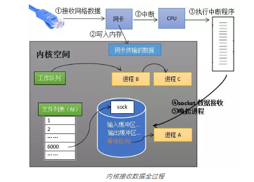

- select 流程

  - select函数监听文件描述符-->将进程加入到socket的等待队列中

    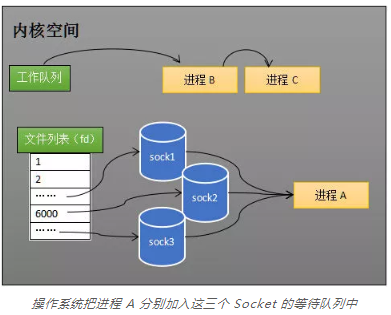

  - socket接收到数据，中断程序唤醒进程

    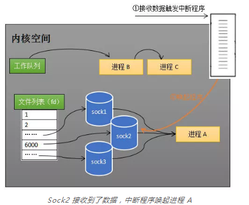

  - 将进程A从所有等待队列中移除，再加入到工作队列中

    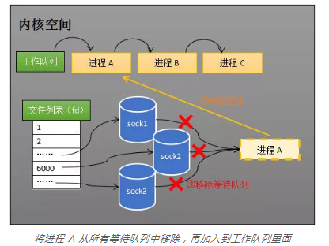

- epoll流程

  - 内核创建eventpoll对象

    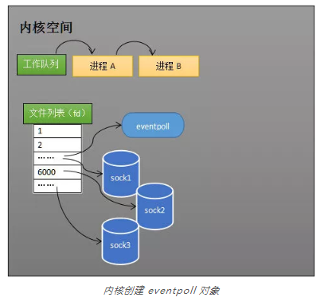

  - 维护监视列表

    

  - 阻塞进程

    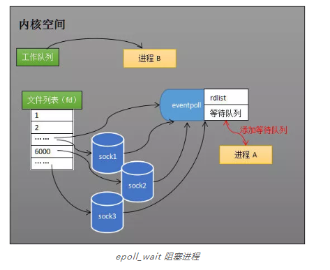

  - 接收数据

    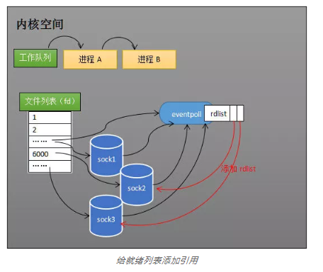

  - 唤醒进程

    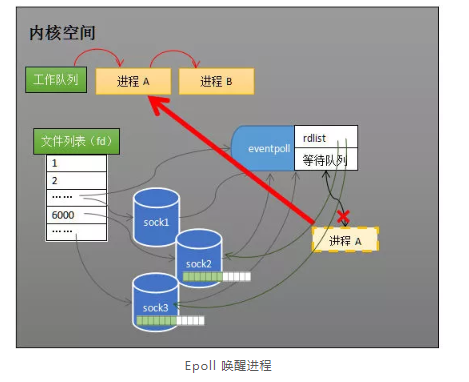

##### 1.49 如何查看段的范围和大小

##### 1.50 什么是虚函数表？有什么作用？

```
虚函数表中存储了函数地址，c++通过这张表来查找调用的函数，从而实现了多态

参考文档:
https://www.cnblogs.com/WPF-342201/p/11479758.html
https://blog.csdn.net/amoscykl/article/details/85796850
```

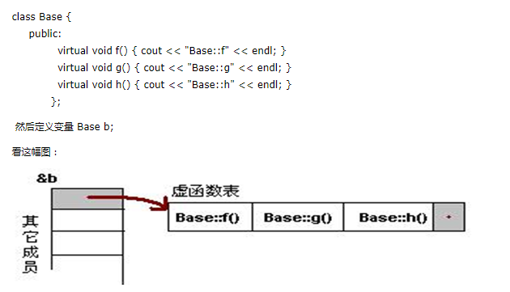


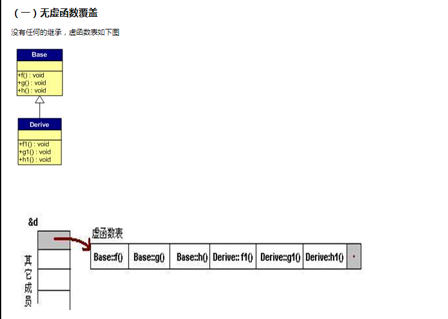

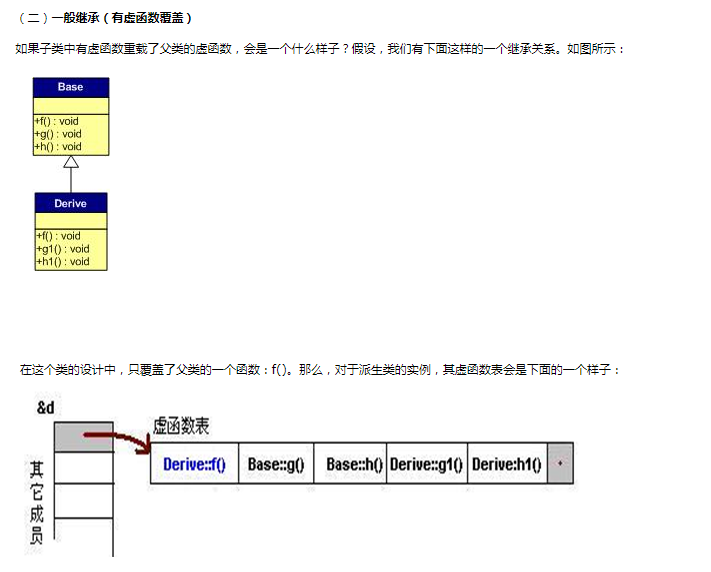

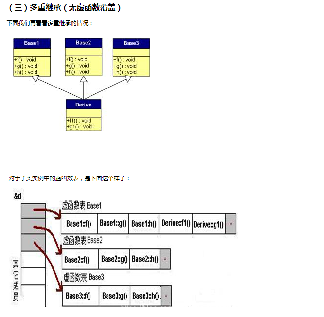

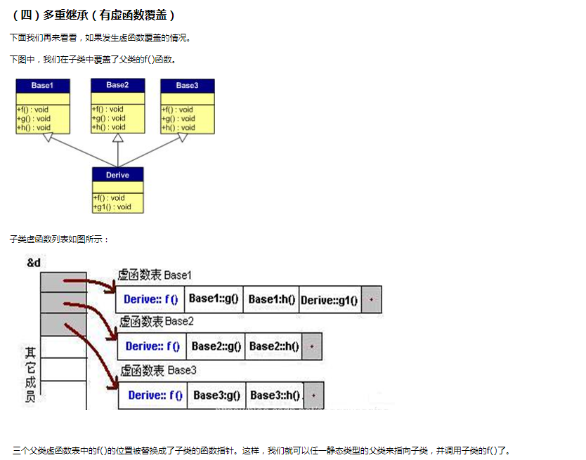

##### 1.51 哈希表，hash冲突？

```
https://mp.weixin.qq.com/s/2J7F5oQmRSA63JgYg2NS8Q
https://mp.weixin.qq.com/s/HbHtfewzYpNlL-64LFadCQ
https://mp.weixin.qq.com/s/XQrrVdZdqJ_et71l6CQeWg
```

##### 1.52 float型和double型数据的存储方式

```
https://blog.csdn.net/u012184539/article/details/88020956
https://www.cnblogs.com/Open-ing/articles/11865642.html
```

##### 1.53 c语言中extern

```
https://www.cnblogs.com/freesblog/p/4525936.html
https://zhidao.baidu.com/question/128251164.html
https://blog.csdn.net/wlfbitfc/article/details/81737099
```

##### 1.54 析构函数可以跑出异常吗？

```
如果析构函数抛出异常，则异常点之后的程序不会执行，如果析构函数在异常点之后执行了某些必要的动作比如释放某些资源，则这些动作不会执行，会造成诸如资源泄漏的问题。
通常异常发生时，c++的机制会调用已经构造对象的析构函数来释放资源，此时若析构函数本身也抛出异常，则前一个异常尚未处理，又有新的异常，会造成程序崩溃的问题。

https://www.jianshu.com/p/77f6a0074dc3
```

##### 1.55 为什么malloc时，要求输入内存区域大小:而在free时，不需要输入内存区域大小

```shell
当程序调用malloc申请内存时，分配一块内存给用户，同时在p-4这个地址记录下malloc空间大小，而在free这块内存时，在从p-4这个地址获得分配内存的大小，然后释放这块内存

#备注:
malloc、free是glic中的库函数

参考文档:
https://blog.csdn.net/nh5431313/article/details/104452071/
```

##### 1.56 用C语言实现多态

```c
//提到面向对象编程，我们能想到封装、继承、多态，但是这几个特性不仅面对对象才能实现，面向过程的C语言也能支持以下3个特性

#include <stdio.h>
#include <stdlib.h>

//1.封装的体现，将函数指针和数据封装在一起
typedef struct _Parent
{  
    int a;  
    int b;  
    void (*print)(struct _Parent *This);  
}Parent; 

//2.继承的体现，子类中包含有父类的对象或者指针
typedef struct _Child
{  
    Parent parent;  
    int c;  
}Child;

void print_parent(Parent *This)  
{  
    printf("a = %d. b = %d.\n",   This->a, This->b);  
}  
  
void print_child(Parent *This)  
{  
    Child *p = (Child *)This;  
	printf("a = %d. b = %d. c = %d.\n", p->parent.a, p->parent.b, p->c);  
}  
  
Parent *create_parent(int a, int b)  
{  
    Parent *This;  
  
    This = NULL;  
    This = (Parent *)malloc(sizeof(Parent));  
    if (This != NULL)
	{  
        This->a = a;  
        This->b = b;
		//3.多态的体现，使用函数指针指向一个函数
        This->print = print_parent;  
        printf("Create parent successfully!\n");  
    }  
      
    return This;  
}  
  
void destroy_parent(Parent **p)  
{  
    if (*p != NULL)
	{  
        free(*p);  
        *p = NULL;  
        printf("Delete parent successfully!\n");  
    }  
}  
  
Child *create_child(int a, int b, int c)  
{  
    Child *This;  
  
    This = NULL;  
    This = (Child *)malloc(sizeof(Child));  
    if (This != NULL)
	{  
        This->parent.a = a;  
        This->parent.b = b;  
        This->c = c;
        //3.多态的体现，使用函数指针指向一个函数
        This->parent.print = print_child;  
        printf("Create child successfully!\n");  
    }  
      
    return This;  
}  
  
void destroy_child(Child *p)  
{  
    if (p != NULL)
	{  
        free(p);  
        p = NULL;  
        printf("Delete child successfully!\n");  
    }  
}  
  
int main()  
{  
    Child *p = create_child(1, 2, 3);  
    Parent *q;  
  
	//父类指针指向了一个子类对象
    q = (Parent *)p;  
    
    //可以调用基类中的方法
    q->print(q);  
  
    destroy_child(p); 
	
    return 0;  
}

参考文档:
https://mp.weixin.qq.com/s/1DGxPJctcOchA_0pi6U6TA
https://blog.csdn.net/qq_35433716/article/details/87464502
```

##### 1.57 32位系统和64位系统占用字节数

```c
	short	int	long	long long	__int64
32位	 2		4	 4			8	     8
64位	 2		4	 4			8	     8

 其中指针类型:在32位系统下占用内存大小是4个字节
     	    在64位系统下占用内存大小是8个字节
```

##### 1.58 C++中的智能指针

```shell
#1.C++11中的智能指针
C++里面有4个智能指针，auto_ptr,unique_ptr,shared_ptr,weak_ptr,其中auto_ptr已经被弃用

#2.使用智能指针的原因
原因：在实际情况中程序员自己申请的空间在函数结束时忘记释放掉，造成内存泄漏，使用智能指针可以在很大程序上避免这个问题

#2.智能指针的原理
智能指针就是一个类，当超出了类的作用域，类就会自动调用析构函数，析构含少数会自动释放资源，所以只能指针额作用原理就是在函数结束时自动释放内存空间，不需要手动释放空间

#3.智能指针的区别
unique_ptr：独占式概念，保证的是同一个时间只有一个智能指针可以指向对象
	//unique_ptr示例:
    unique_ptr<string> pu1(new string ("hello world"));
    unique_ptr<string> pu2;
    pu2 = pu1; //这种编译器会报错
    pu2 = move(pu1);  //但是可以使用move函数进行转移

shared_ptr：共享式概念，多个智能指针可以指向相同的对象，该对象会在最后一个引用被销毁时释放

weak_ptr：一种不控制对象生命周期的指针，他的构造和析构不会引起记树的增加或者减少，用来解决循环引用的问题

https://www.nowcoder.com/ta/review-c/review?tpId=22&tqId=31357&query=&asc=true&order=&page=35
https://blog.csdn.net/xy_cpp/article/details/81750575
https://www.cnblogs.com/xiaoshiwang/p/9721763.html
```

##### 1.59 读取文件、读取socket的返回值区别

```shell
read\write函数,操作的对象可以是一个真实的文件,也可以是一个socket等等

读取文件返回值:
	>0：成功读取的字节数；
	=0：到达文件尾；
	-1：发生错误，通过errno确定具体错误值

#注意点:
	当读取一个文件，不管是处于阻塞模式还是非阻塞模式，当读取到文件末尾时，在没有错误的情况下，都会返回0(不会阻塞住那里)，而不是返回-1

对于写文件返回值:
	>0发送数据大小
	0：当写入的字节数为0
	<0：出错

读取socket:

	阻塞与非阻塞read返回值没有区分，都是 <0：出错，=0：连接关闭，>0接收到数据大小
	注意点:
		(1)读取socket，如果缓冲区没有数据，当以阻塞方式读取时，会阻塞住那里，当以非阻塞方式读取时，会立即返回-1,，并带有EWOULDBLOCK或者EAGAIN字样
		(2)非阻塞模式下返回值 <0时并且(errno == EINTR || errno == EWOULDBLOCK || errno == EAGAIN)的情况下认为连接是正常的，继续接收。

#备注
在linux进行非阻塞的socket接收数据时经常出现Resource temporarily unavailable，errno代码为11(EAGAIN):表明在非阻塞模式下调用了阻塞操作，
在该操作没有完成就返回了这个错误，这个错误不会破坏socket的同步，不用管它，下次循环继续read就可以。对于非阻塞socket而言，EAGAIN不是一种错误，又叫做EWOULDBLOCK
如果出现EINTR，错误描述为interrupt system call，操作也应该继续。最后，如果read的返回值为0，表明连接已经断开，read操作也应该结束

写socket:
	阻塞与非阻塞write返回值没有区分，都是 <0：出错，=0：连接关闭，>0发送数据大小
	注意点:
		(1)非阻塞模式下返回值 <0时并且 (errno == EINTR || errno == EWOULDBLOCK || errno == EAGAIN)的情况下认为连接是正常的， 继续发送。
		(2)只是阻塞模式下write会阻塞着发送数据，非阻塞模式下如果暂时无法发送数据会返回，不会阻塞着 write，因此需要循环发送。

参考链接:
https://blog.csdn.net/li2572889641/article/details/73656767

#socket
socket编程出现close_wait的现象
	含义:表示等待应用进程调用close函数关闭连接，因为内核没有权利替代进程去关闭连接，因此linux没有限制close_wait状态的持续时间，当使用netstat命令发现大量close_wait状态，就需要排除应用程序，因为可能应用程序出现了bug，read函数返回0时，没有调用close
	主要原因:是在某种情况下对方关闭了socket链接，但是我方忙于读写，没有关闭连接，
	
	解决办法:
		但是中需要判断socket，一旦读取到了0,断开连接，read返回负，检测一下errno，如果不是errno == EINTR || errno == EWOULDBLOCK || errno == EAGAIN也需要断开连接

#mqtt长时间处于close_wait解决办法:
int SSLSocket_getch(SSL* ssl, int socket, char* c)
{
	...
	if ((rc = SSL_read(ssl, c, (size_t)1)) < 0)
	{
		int err = SSLSocket_error("SSL_read - getch", ssl, socket, rc);
		if (err == SSL_ERROR_WANT_READ || err == SSL_ERROR_WANT_WRITE)
		{
			rc = TCPSOCKET_INTERRUPTED;
			SocketBuffer_interrupted(socket, 0);
		}
	}
	else if (rc == 0)
	{
		close(socket); //根据描述信息，这里要加关闭socket
		rc = SOCKET_ERROR;    /* The return value from recv is 0 when the peer has performed an orderly shutdown. */
	}
	else if (rc == 1)
	{
	}
	...
}

参考文档:
	https://blog.csdn.net/libaineu2004/article/details/78886182
	https://blog.csdn.net/li2572889641/article/details/73656767
	https://mp.weixin.qq.com/s/fjnChU3MKNc_x-Wk7evLhg
```

##### 1.60 指针常量和常量指针

```c
#include<iostream>
using namespace std;

//指针常量，指针的指向不能再发生变化即不能在指向别的变量，但是指向的内存地址内容可以发生变化
void test1() 
{	
	int a = 1;
	int b = 2;
	int * const p = &a; //只能在初始化时赋值
	//在这里不能赋值
//	p = a;
	cout << *p << endl;
	*p = 100;
	cout << *p << endl;
//	p =&b; //不能再指向别的变量
	
}

//常量指针:指针可以再次指向别处，但是指针指向的内存地址中的数据不能发生变化
void test2()
{
	int a = 1;
	int b = 2;
	int const * p;
	
	p = &a;
	cout << *p << endl;
	p= &b;
	cout << *p << endl;

#if 0
	*p = 100; //发生错误
	
	cout << *p << endl;
#endif
}

int main(void)
{
//	test1();
	test2();
    return 0;
}

参考文档:
https://blog.csdn.net/weibo_dm/article/details/80445205
```

##### 1.61 C语言的声明和定义

```
https://www.cnblogs.com/stemon/p/4000730.html
```

##### 1.61 C++中传递数组

```c

#include<iostream>
using namespace std;

void test(int arr[])
{
	printf("%p\n",arr);
	arr[0] = 100;
}

int main(void)
{
	int a[2] = {1,2};
	printf("%p\n",a);
	printf("a[0] = %d\n",a[0]);
	test(a);
	printf("a[0] = %d\n",a[0]);
    return 0;
}

//打印信息
0x7fffe88a5298
a[0] = 1
0x7fffe88a5298
a[0] = 100

//可以看到以上传传递数组的方式实际传递的是地址，通过这种方式的传递可以改变原来数组的值
```

##### 1.62 C++中explicit的作用及用法

```
https://blog.csdn.net/qq_36570733/article/details/100585625
```

##### 1.63 NULL、0、nullptr的区别

```c
NULL在c/c++中是一个宏定义，在头文件stddef.h中定义:
C/C++标准规定，NULL的值是一个空指针常量，在C语言中常数0和(void *)0都是空指针常量，C++中常数0是，而(void *)0不是
    
#if defined(__cplusplus)
# define NULL 0    // C++中使用0作为NULL的值
#else
# define NULL ((void *)0)    // C中使用((void *)0)作为NULL的值
#endif


#include <stddef.h>
void foo(int) {}     // #1
void foo(char*) {}   // #2
int main() {
    foo(NULL); //会调用#1
    foo(nullptr); //会调用#2
}

参考文档:
https://www.cnblogs.com/nothx/p/8523191.html
```

##### 1.64 STL 迭代器失效情况

```c
/*
	vector/deque为顺序容器，erase迭代器不仅使所有指向被删元素的迭代器失效，而且使被删除元素之后的所有迭代器失效，所以不能使用erase(iter++)方式，但是erase的返回值为下一个有效迭代器，因此可以这样使用:
	for( iter = c.begin(); iter != c.end(); )
		iter = c.erase(iter);
	
	list/set/map迭代器只是被删除元素的迭代器失效，因此可以这样使用:
	for( iter = c.begin(); iter != c.end(); )  
         c.erase(iter++);
*/

#include <stdio.h>
#include <vector>
#include <list>
using namespace std;

int main()
{
#if 0
	std::vector<int>  my_container; 

 	for (int i = 0; i < 10; ++i)
 	{ 
  		my_container.push_back(i); 
 	}

	std::vector<int>::iterator it;

	for (it=my_container.begin();it!= my_container.end(); )
 	{ 
 		 if ((*it) % 2 == 1)
  		 { 
             //对于vector正确删除方法
   		     it = my_container.erase(it);
             //对于vector错误删除方法
   		    // my_container.erase(it++); 
  		 }
	     else
  		 {
			printf("%d\n",*it);
   			it++;
  		 }
		 
	}
#endif

#if 1
	std::list<int>  my_container;
	
	for (int i = 0; i < 10; ++i)
    { 
    	my_container.push_back(i); 
    }

	std::list<int>::iterator it;
	for (it=my_container.begin();it!= my_container.end(); )
	{
		 if ((*it) % 2 == 1)
         { 
            //对于list的正确删除方法
          	my_container.erase(it++);
            //对于list的错误删除方法
			//it = my_container.erase(it);
			printf("it = %d\n",*it);
         }
		 else
		 {
			printf("%d\n",*it);
            it++;
		 }
	}

#endif	
	return 0;

}

参考文档:
https://blog.csdn.net/smilestone_322/article/details/23433549
https://blog.csdn.net/smilestone_322/article/details/7976764
```

##### 1.65 为什么不能以%s输出整数

```
在c语言编译时，可以以字符型输出整数，以整数输出字符，但是以字符串型%s输出一个整数时，在编译时不会报错，但是在运行时程序会崩溃

因为%s输出的是字符串，而字符串中有多少个字符，取决于它最后\0结束标志，当出入整数那么它会一直读取内存，直到遇到\0，这样导致它读取到不该读取的内存区域，就崩溃了

char ch[4] = {0x30,0x31,0x32}; //这样定义后，ch[3]默认会是0x00,当以%s输出时可以正确的输出
char ch[4] = {0x30,0x31,0x32}; //这样定义后，当以%s输出不一定能够得到正确的结果

参考文档:
https://ask.csdn.net/questions/761926?sort=comments_count
```

##### 1.66 c++中类的默认函数有哪些

```

```

##### 1.67  内存泄漏的处理思路

```shell
#内存泄漏的分类
(1)常发性内存泄漏:发生内存泄漏的代码会被多次执行到，每次执行时都会导致一块内存泄漏 --> 共用代码可能出现问题
(2)偶发性内存泄漏:发生内存泄漏的代码只有在某些特定环境或操作过程下才会发生         --> 某个特定环境下的代码出现问题
(3)一次性内存泄漏:发生内存泄漏的代码只会被执行一次，导致总会有一块且仅有一块内存发生泄漏

参考文档:
	https://blog.csdn.net/zzhang_12/article/details/81040954
	
#处理内存泄漏的办法

(1)人工查看(适用于问题排查范围比较小)
	a.查看本次代码修改了哪些内容
	b.查看malloc/free、new/delete是否是成对出现
	c.查看是否使用内存池，如果使用了查看内存池的释放问题
	d.多线程共享数据也有可能造成内存泄漏
	
(2)使用工具查看(如果不知道问题出现在哪次代码改动，检测工具就非常重要了)
	
	valgrind --leak-check=yes myprog
	
备注:
	(1)valgrind的好处在于无需重新编译代码即可进行内存检测
	(2)使用valgrind工具会比正常的程序运行慢20-30倍

参考文档:
		https://mp.weixin.qq.com/s/PyLuySr10_IqGpcvcsoY3Q
		
#避免内存泄漏的办法
	(1)不要手动管理内存，可以使用智能指针来替代
		在c++中避免内存泄漏的最好办法是尽可能地在程序基本上进行new和delete调用-最好是没有。任何需要动态内存的东西都应该隐藏在一个RAII对象中，
		当超出范围时释放内存，RAII在构造函数中分配内存并在析构函数中释放内存，这样当变量离开当前范围时，内存就可以被释放
		
	(2)如果必须使用new/delete，则必须成对出现，可以始终在new和delete之间编写代码
	
	(3)使用string而不是char*，string类在内部处理所有内存管理
	
参考文档:
	https://blog.csdn.net/weixin_30734435/article/details/102213046
```

##### 1.68 C++/C相互调用

```C
//C++调用C

//calc.h内容如下:
#ifndef CALC_H_INCLUDED
#define CALC_H_INCLUDED

void fun();

#endif

//calc.c内容如下:
#include <stdio.h>
#include "calc.h"

void fun()
{
        printf("fun\n");
}

//main.cpp内容如下:
#include <stdio.h>

//方式1(推荐):可以将.h中的所有函数都包含进来
#ifdef __cplusplus
extern "C" {
#endif

#include "calc.h"

#ifdef __cplusplus
}
#endif

//方式2：单独引进某一个函数
//extern "C" void fun();

using namespace std;

int main()
{
        fun();
        return 0;
}

//编译命令如下:对.c文件个.cpp文件单独进行编译
gcc calc.c  -c
g++ -c main.cpp
g++ main.o calc.o -o main
    
//g++ main.cpp calc.c -o main --> 这种编译方式会编译不通过
```

```c
//C调用C++

//calc.h内容如下:
#ifndef CALC_H_INCLUDED
#define CALC_H_INCLUDED

//在这里要用编译c的方式进行编译
#ifdef __cplusplus
extern "C" {
#endif

	void fun();

#ifdef __cplusplus
}
#endif

#endif

//calc.cpp内容如下:
#include <stdio.h>
#include "calc.h"

void fun()
{
        printf("fun\n");
}


//main.c内容如下:
#include <stdio.h>
extern void fun();

int main()
{
        fun();
        return 0;
}

//编译命令如下:
g++ -c calc.cpp
gcc -c main.c
gcc main.o calc.o -o main    
```

```shell
objdump -t calc.o
按照c++方式进行编译
SYMBOL TABLE:
....
0000000000000000 g     F .text  0000000000000010 _Z3funv #可以看到除了函数名以外还添加了部分其他内容
....

按照c方式进行编译
SYMBOL TABLE:
....
0000000000000000 g     F .text  0000000000000010 fun #可以看到只含有函数名

#总结
C++保留了一部分过程式语言特点，因此可以定义不属于任何类的全局变量和函数，但是c++为面向对象语言，支持函数的重载，c++对全局函数处理方式明显不同于c处理。extern "C" {}目的就是为了让c++正确使用c的代码，加上extern "C" {}之后，会指示编译器对这部分代码按照c语言进行编译，而不是c++语言进行编译，c++支持多态，因此编译过程中会将函数的参数类型合入函数名符号中，而不仅仅是函数名

(1)__cplusplus为cpp中自定义的宏，extern表明变量和函数是全局性的
(2)c++调用一个c语言编写的.so库时，包含描述.so库中函数的头文件时，应将对应的头文件放置在extern "C" {}格式中
(3)c中引用c++中的全局函数时，c++的头文件需要添加extern "C"，而C文件中不能用extern "C"，只能用extern关键字

参考文档:
https://blog.csdn.net/yanlaifan/article/details/83109890
```

```c
//在c里面调用c++里面的成员函数，基本思想是写一个wrapper文件，把c++类封装起来，对外只提供c语言的接口，和c++相关的都在wrapper的文件里面实现

//apple.h文件内容如下:
#ifndef __APPLE_H__
#define __APPLE_H__

class Apple
{
public:
        enum
        {
                APPLE_COLOR_RED,
                APPLE_COLOR_BLUE,
                APPLE_COLOR_GREEN,
        };
 
        Apple();
        int GetColor(void);
        void SetColor(int color);
private:
        int m_nColor;
};

#endif

//apple.cpp文件内容如下:
#include "apple.h"
Apple::Apple():m_nColor(APPLE_COLOR_RED)
{

}
 
void Apple::SetColor(int color)
{
        m_nColor = color;
}
 
int Apple::GetColor(void)
{
        return m_nColor;
}

//AppleWrapper.h内容如下:对外提供接口，供c调用
#ifndef _APPLE_WRAPPER_H__
#define _APPLE_WRAPPER_H__

struct tagApple;
#ifdef __cplusplus
extern "C" {
#endif

struct tagApple *GetInstance(void);
void ReleaseInstance(struct tagApple **ppInstance);
extern void SetColor(struct tagApple *pApple, int color);
extern int GetColor(struct tagApple *pApple);

#ifdef __cplusplus
};
#endif
#endif

//AppleWrapper.cpp内容如下:具体调用c++里面的代码
#include "AppleWrapper.h"
#include "apple.h"
 
#ifdef __cplusplus
extern "C" {
#endif

struct tagApple
{
        Apple apple;
};

struct tagApple *GetInstance(void)
{
        return new struct tagApple;
}

void ReleaseInstance(struct tagApple **ppInstance)
{
        delete *ppInstance;
        *ppInstance = 0;

}

void SetColor(struct tagApple *pApple, int color)
{
        pApple->apple.SetColor(color);
}
 
int GetColor(struct tagApple *pApple)
{
        return pApple->apple.GetColor();
}

#ifdef __cplusplus
};
#endif

//main.c内容如下:
#include "AppleWrapper.h"
#include <assert.h>
#include <stdio.h>
 
int main(void)
{
        struct tagApple * pApple;

        pApple= GetInstance();
        SetColor(pApple, 1);
        int color = GetColor(pApple);
        printf("color = %d\n", color);
        ReleaseInstance(&pApple);
        assert(pApple == 0);

        return 0;
}

//编译内容:
g++ -c apple.cpp  AppleWrapper.cpp
gcc test.c -o test AppleWrapper.o apple.o -lstdc++
    
参考文档:
https://blog.csdn.net/caspiansea/article/details/9676153
```

##### 1.69 调用一个普通函数和调用系统函数有啥区别

```
普通函数调用发生在哎用户态
系统调用发生在内核态 --> 系统调用为用户提供了接口，从而维护了内核的稳定和安全性
```

##### 1.70 静态库与动态库的区别

```
静态库发生在编译和链接时期，在链接过程中将目标文件(.o文件)一起打包到可执行文件中，因此静态库的体积比较大
动态库是在程序运行时动态载入的，可执行文件小，灵活性大
```

##### 1.71 linux内核线程

```
基本概念
	(1)内核中线程与进程属于同一个概念，因为他们共享内核空间，因此当线程切换时就涉及不到空间的切换
	(2)内核在后台执行一些操作，这种任务可以通过内核线程(kernel thread)完成，内核线程时独立运行在内核空间的标准进程，没有独立的地址空间，只运行在内核空间，从来不切换到用户空间，和普通的进程一样，可以被调度也可以被抢占
	(3)内核线程只能又其他内核线程创建，linux驱动模块中可以用kernel_thread()，kthread_create()/kthread_run()2种方式创建内核线程

常用内核线程
kthreadd  : 内核线程只有一个，它的作用是管理调度其它的内核线程
watchdogd : 每个处理器核对应一个watchdog 内核线程，watchdog用于监视系统的运行，在系统出现故障时自动重新启动系统，包括一个内核 watchdog module 和一个用户空间的 watchdog 程序。

参考文档:
https://blog.csdn.net/huangweiqing80/article/details/83088465
https://blog.csdn.net/farmwang/article/details/70159387
```

##### 1.72 linux中编译程序过程

```shell
高层的C/C++语言编写的程序转换成处理器能够执行的二进制代码的过程，包括4个步骤:
预处理(preprocessing) --> 编译(compilation) --> 汇编(assembly) --> 链接(linking)

//预处理
命令：
gcc -E main.c -o main.i
作用:
(1)处理#include预编译指令
(2)将所有的#define删除，并且展开
.....

//编译
命令:
gcc -S main.i -o main.s
作用:(在这个阶段将c语言转变了汇编语言)
对预处理的文件进行一系列的词法分析，语法分析，并生成相应的汇编文件

//汇编
命令:
gcc -c main.s -o main.o
作用:(将汇编代码生成机器命令,打开之后已经是一堆乱码)
对汇编代码进行处理，生成处理器能识别的指令，保存在后缀为.o的目标文件中

//链接
命令:
gcc main.o -o main
作用:
静态链接:在编译阶段直接把静态库加入到可执行文件中去，这样可执行文件会比较大
动态链接:动态链接则是指链接阶段仅仅只加入一些描述信息，而程序执行时再从系统中把相应动态库加载到内存中去

//查看生成elf可执行文件的大小
size main
   text    data     bss     dec     hex filename
   1198     540       4    1742     6ce main
 
.text: 已编译程序的指令代码段
.rodata: ro代表read only,即只读数据,字符串常量存在该区域中
.data: 已初始化C程序全局变量和静态局部变量
.bss: 未初始化C程序全局变量和静态局部变量

//查看依赖的动态库
ldd main
        linux-vdso.so.1 =>  (0x00007ffc68989000)
        libc.so.6 => /lib64/libc.so.6 (0x00007f6beaee0000)
        /lib64/ld-linux-x86-64.so.2 (0x00007f6beb2ad000)
   

gcc -o hello -g hello.c

//反编译，只形式机器语言和汇编语言
objdump -D hello

//对二进制文件进行反汇编，显示出汇编语言以及对应的c语言
objdump -S hello

#备注:
(1)计算机程序设计语言通常分为机器语言、汇编语言和高级语言。高级语言需要通过翻译成机器语言才能执行，翻译的方式有2种，一种是编译型，一种是解释型

参考文档:
https://mp.weixin.qq.com/s/cE3Bxy3hBBlQRFTGMp6DgQ
```

##### 1.73 linux中strace命令

```shell
strace常用来跟踪进程执行时的系统调用和所接收的信号，通过strace可以知道应用程序打来了哪些文件以及读写了什么内容，包括消耗的时间以及返回值。
在linux中，进程不能直接访问硬件，当进程需要访问硬件设备(比如读取磁盘文件，接收网络数据)时，必须由用户态模式切换到内核态模式，通过系统调用访问应硬件设备

strace常用参数如下所示:
-o    指定跟踪信息的输出文件       
-t     记录跟踪信息的时间,以S为单位
-tt    记录跟踪信息的时间,以uS为单位

# strace -t ls
15:34:37 execve("/usr/bin/ls", ["ls"], [/* 26 vars */]) = 0
15:34:37 brk(NULL)                      = 0x1f83000
15:34:37 mmap(NULL, 4096, PROT_READ|PROT_WRITE, MAP_PRIVATE|MAP_ANONYMOUS, -1, 0) = 0x7f7e7d756000
15:34:37 access("/etc/ld.so.preload", R_OK) = -1 ENOENT (No such file or directory)
15:34:37 open("/etc/ld.so.cache", O_RDONLY|O_CLOEXEC) = 3
15:34:37 fstat(3, {st_mode=S_IFREG|0644, st_size=30576, ...}) = 0
15:34:37 mmap(NULL, 30576, PROT_READ, MAP_PRIVATE, 3, 0) = 0x7f7e7d74e000
15:34:37 close(3)                       = 0
15:34:37 open("/lib64/libselinux.so.1", O_RDONLY|O_CLOEXEC) = 3
....

#备注:
系统调用与内核函数区别
(1)内核函数在形式上与普通函数一样，但它是在内核实现的，需要满足一些内核编程的要求
(2)系统调用是用户进程进入内核的接口层，它本身并非内核函数，但它是由内核函数实现的
(3)进入内核后，不同的系统调用会找到各自对应的内核函数，这些内核函数被称为系统调用的“服务例程 ”

参考链接:
https://www.jb51.net/article/130567.htm
```

##### 1.74 Linux系统调用过程

```shell
(1)linux系统给每个系统调用函数都指定了一个系统调用号，例如write的系统调用号为4 -->
(2)当应用程序调用系统调用函数时，例如write函数，首先去C库的write函数实现 -->
(3)C库的write函数首先把write函数对应的系统调用保证在R7寄存器中  -->
(4)调用swi或者svc触发一个软件中断异常从用户空间进入到内核空间，cpu跳转到异常向量表的位置去处理  -->
(5)进入到内核空间以后，从R7寄存器中年感取出之前的保存的系统调用号  -->
(6)然后在内核已经定义好的系统表中农，以系统调用号为索引，在系统调用表中找到对应的函数(sys_write)  -->
(7)执行此函数后，最后原路返回用户空间

#备注;
软中断是从用户空间陷入内核空间的唯一途径

参考链接:
http://blog.chinaunix.net/uid-30077524-id-4716130.html
```

##### 1.75 为什么STM32没法跑Linux

```
stm32是不可以运行linux，原因是stm32芯片中没有MMU(内存管理单元，硬件)，linux系统中运行的单位是进程，而freertos、ucos运行单位是线程，crotex-M没有MMU,所以不能运行进程的操作系统

参考链接:
https://blog.csdn.net/super828/article/details/80955862
```

#### 2. STL库相关

##### 2.1 vector和list区别？

```shell
vector：拥有连续的内存空间，存取效率高，效率为O(1);插入和删除数据效率低，效率为O(n)
list：采取的是双线链表接口，内存空间不是连续的，插入和删除数据效率高，效率为O(1)，存取效率低，效率为O(n)

#备注:
vector当内存空间不够时，会重新申请一块内存并进行内存拷贝

参考文档:
https://www.cnblogs.com/shijingjing07/p/5587719.html
```

##### 2.2 vector内存是怎样增长的？vector底层实现？

```shell
vector当内存不足时，会以2倍的方式进行扩容，如果以大于2倍的方式进行扩容，下一次申请空间会大于之前申请所所有空间总和，会导致之前的空间不能被重复利用
https://blog.csdn.net/zhangruijerry/article/details/99681595
https://www.cnblogs.com/-citywall123/p/12846941.html

#1.vector的内部实现原理
vector是动态增加内存大小的，所谓动态增加并不是在原来空间之后持续新空间(因为无法保证原空间之后是否有可配置的空间)，而是以原来大小2倍另外配置一块新的空间，然后将原来内容拷贝过去，并释放原来的空间，因此一旦内存被重新分配，则指向容器的迭代器、指针和引用都会失效

#2.vector添加一个元素，size会变大，capacity也会变大么？
size是肯定会变大，而capacity要看情况，如果已经满载，那么capacity会变大，并且为2倍扩容，如果内存空间足够，那么capacity不会变大

#3.vector中size和capacity的区别？
size是vector的元素数目，而capacity是容量

#4.删除一个迭代器，还能使用吗？
对于序列式容器(vector、queue)删除迭代器，会使后面所有元素的迭代器都失效，对于关联容器(如list、map)删除迭代器只会使当前迭代器失效
```

##### 2.3 vector和deque的比较？

##### 2.4 利用迭代器删除元素会发生什么？

```
参照2.2
```

##### 2.5 map是如何实现的？查找效率是多少？

```shell
map：
	优点：有序，内部实现是红黑树，查找效率O(logn)
	缺点：耗费内存大
	适应场景:适用于数据有序的场合-按照key值的大小从小到大排序
	
unordered_map:
	优点：内部实现是哈希表，查找效率O(1)快
	缺点：无序-元素排列无序，哈希表的建立比较费时
	应用场景:在海量数据处理中有着广泛应用
#参考文档
https://blog.csdn.net/yam_sunshine/article/details/89930311
https://blog.csdn.net/qq_21997625/article/details/84672775
```

##### 2.6 stl底层数据结构实现？

##### 2.7 集中模板插入的时间复杂度？

### 五、 数据结构与算法

#### 1. 基础知识

##### 1.1 冒泡排序

##### 1.2 快速排序

#### 2. 实例

##### 2.1 单链表快排

##### 2.2 反转单链表

##### 2.3 hash处理冲突的方法

##### 2.4 二分查找及其变种

##### 2.5 红黑树比平衡二叉树有哪些优点

##### 2.6 二叉树，b+树，hash，二叉查找树区别

```
https://mp.weixin.qq.com/s/AdAkwSdSbKKPvAPOKLos_A
https://mp.weixin.qq.com/s/Tbx-VZxca8Z2U8VpXl6GoA
```

##### 2.7 说说红黑树的特性

```
https://mp.weixin.qq.com/s/X3zYwQXxq93P_XUzFmKluQ
```

##### 2.8 各种树，排序的时间复杂度

##### 2.9 字符串转整型

##### 2.10 判断3个数是否只能够组成三角形

##### 2.11 随机数rand(1,100)转换成rand(1,10000)

### 六、硬件

##### 1.1 nandflash、norflash区别？

```shell
flash存储器又称为闪存，主要有2种，norflash和nandflash，在实际开发中，设计者可以根据产品需求进行闪存的合理选择，一般主要从以下几个方面进行选择:

#(1)容量和成本
相比起NandFlash来说，NorFlash的容量要小，一般在1~16MByte左右，NandFlash一般都在32MBye上以上
#(2)可靠性
NAND器件中的坏块是随机分布的，所以在使用NandFlash时建议同时使用EDC/ECC等校验算法
#(3)读写性能
NOR的读速度比NAND快
#(4)接口
norflash接口相较于nandflash接口简单
#(5)寿命
在NAND闪存中每个块的最大擦写次数是一百万次，而NOR的擦写次数是十万次
#(6)文件系统
通常在NorFlash上我们会选取jffs及jffs2文件系统，在NandFlash上选用yaffs或yaffs2文件系统。Yaffs2文件系统支持大页（大于512字节/页）的NandFlash存储器
#(7)硬件升级
NorFlash硬件升级麻烦，nandflash硬件升级简单

参考文档:
https://mp.weixin.qq.com/s/tSNlqO3oqOu1WaTn3deTrg
```

##### 1.2 uart、iic、spi总线接口比较？

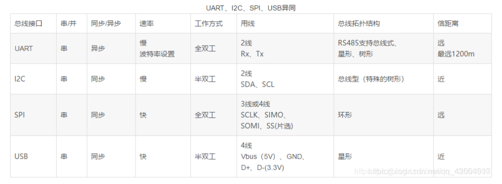

```shell
从各个总线的用线数量就可以区分各个总线的区别:
同步与异步:一般有时钟线的为同步，没有时钟线的为异步，因为异步没有时钟，因此需要双方设置通信速率
全双工与半双工:同时具有RX、TX的为全双工，RX/TX共用的为半双工

#应用场景
	I2C和SPI都是同步协议，都有时钟信号，在一条总线上也都可以挂多个从设备，但是I2C的从设备是通过地址来区分的，SPI的从设备是通过片选线来区分的，所以SPI总线上，每多挂一个从设备，就要多用一个线作为片选线，而I2C则不用，只要地址不冲突，可以随便挂设备。但是，I2C总线速度一般普遍慢于SPI，I2C一般的速度是100kbs、400kbps和1Mbps，而SPI的速度可以在几Mbps，也可以10+Mbps。所以看使用场合，低速的话，I2C就挺合适的，如果速度快一些，则一般都要选用SPI。另外，I2C总线的管脚都是开漏输出，必须外接上拉电阻，阻值可以根据总线速度来推算，一般我们常用400kbps传输速率，上拉电阻选用2.2K。UART和SPI、I2C不同，他是异步传输的，一般来说传输速度比较慢，传统的传输速度一般在115200bps或以下，不过现在大部分UART控制器也能支持到4Mbps或者8Mbps了。UART目前最常用的就是调试接口，因为UART比较简单，所以CPU输出log一般都通过一个UART口来输出

#参考文档
总线接口比较
https://blog.csdn.net/qq_43604517/article/details/108347229
SPI、 I2C、USART等协议共同点区别、使用场景
https://blog.csdn.net/qq_36226810/article/details/80311644
```

##### 1.3 i2c协议

```shell
#1.i2c协议的作用
由于i2c总线只有数据、时钟2根线，因此需要规定一组传输协议格式，(地址线和数据线复用，读和写复用)	

#2.协议格式
总协议格式:
	S(开始)  从设备地址(7bit) R/W(读/写) ACK(1bit) 数据(8bit) ACK(1bit) P(结束)

具体协议(具体对总线的实现):
	写数据:
	S(开始)  从设备地址(7bit) W(写) ACK(由从设备将SDA的电平从高拉低) 内部寄存器地址(8bit) ACK(1bit) 数据(8bit) ACK(bit) 数据(8bit) ACK(bit) ... P(结束) #数据可以发送多个
	
	读数据:
	S(开始) 从设备地址(7bit) W(写) ACK(由从设备将SDA的电平从高拉低) 内部寄存器地址(8bit) ACK S(开始) 从设备地址 R(读) ACK 数据(8bit) ACK(bit) ... P(结束)
	
#备注:
	(1)在读数据时，先把内存寄存器地址告诉从设备，然后再读取数据，读取数据时，从设备上传数据
	(2)在SCL为高电平时，要保持数据的稳定，在低电平时可以变化数据，原因在于使在高电平时，读取SDA上的数据
```

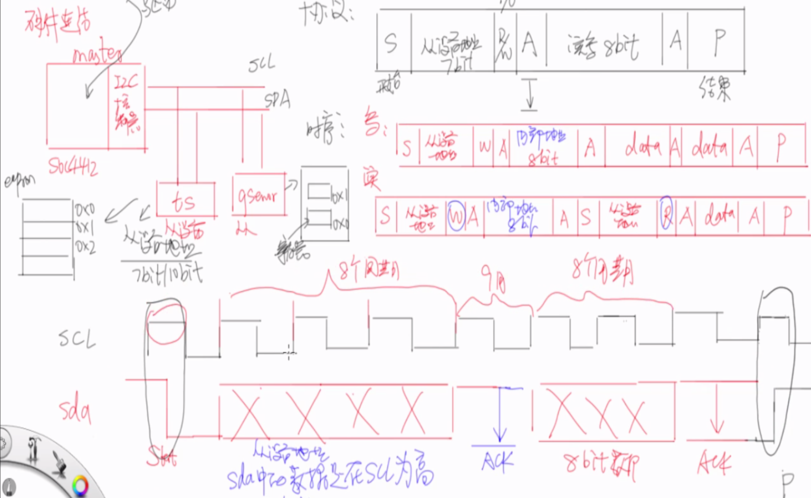

- i2c驱动程序框架

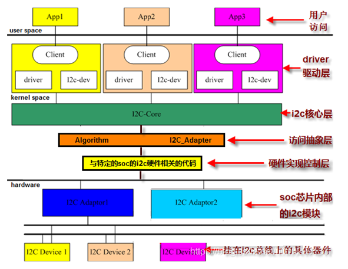

### 六、其他

##### 1.1 栈实现队列？

##### 1.2 了解elf？

##### 1.3 智能指针？

```
参考:1.58 C++中的智能指针
```

##### 1.4 io密集型和cpu密集型？

```shell
#1.定义
cpu密集型:系统运作大部分状况是CPU loading 100%，cpu要读/写I/O(磁盘、内存、网络)在很短的时间就可以完成，主要消耗的是cpu资源

io密集型:系统大部分的状况是CPU在等I/O(磁盘、内存、网络)的读/写操作，此时cpu loading并不高，消耗cpu资源少

#2.适用场景

cpu密集型:例如计算圆周率、视频编解码全靠cpu的运算能力，最好用C语言编写，而python脚本语言运行效率很低不适合计算密集型任务

io密集型:例如web应用，99%的时间都花在I/O上，花在cpu上的时间很少，因此运用速度极快的c语言替换python这样运算速度较低的脚本语言，完全无法提示运行效率，对于i/o密集型任务最合适的语言就是开发效率最高(代码量最少)的语言，脚本语言首选，c语言最差

参考文档:
https://mp.weixin.qq.com/s/RdvYExBcD3P09lk-sGyOFg
```

##### 1.5 线程池用过没有？要开多大？需要注意哪些事项？

```shell
#1.基本原理
	有一堆创建好的线程(数量一定)，初始化时都处于空闲状态，当有新任务进来时，从线程中年感取出一个空闲的线程处理任务，然后当任务处理完成之后，该线程被重新放回到线程池中，供其他任务使用，当线程池中的线程都在处理任务时，就没有空闲线程使用，此时，如果有新的任务产生，只能等待线程池中有线程结束才能执行
	
#2.作用
	(1)不需要每次使用时都进行初始化，从而减少线程创建/关闭的资源开销
	(2)更好并发控制
	
#3.使用注意事项
	(1)线程池的大小
	(2)任务队列的大小
	(3)设计时避免出现死锁等现象
	
	如何合理地估算线程池大小?一般与逻辑cpu的个数相关，io请求时间、cpu计算时间这3个参数相关
	https://www.cnblogs.com/myseries/articles/11525684.html
	
#4.代码
	c++简单线程池实现
	https://www.cnblogs.com/yangang92/p/5485868.html
	github
	https://github.com/lizhenghn123/zl_threadpool.git
	
#5.备注
	(1)线程池中的线程的获取与放回实际代码中使用信号量来实现
	(2)任务队列的存取与获取实际代码中使用队列来实现
```

##### 1.6 什么是缓冲区溢出？

```shell
#1.定义
当计算机向缓冲区填充数据使超出了缓冲器本身的容量，溢出的数据覆盖在了合法的数据上

#缓冲区定义
可以理解为一段可读写的内存区域，缓冲区攻击的最终目的就是希望系统能执行这块可读写内存中农已经被蓄意设定好的恶意代码，程序代码是作为二进制数据存储在内存的，同样程序的数据也在内存中，因此直接从内存的二进制形式上无法区分哪些数据是代码的那些是数据的，这就为缓冲区溢出攻击提供了可能

参考文档:
https://blog.csdn.net/qq_35642036/article/details/82809845
```

##### 1.7 coredump oops panic？

```shell
#1.应用程序和内核程序产生错误
应用程序如果进行了非法内存访问或执行了非法指令，会得到segfault信号，一般行为就是coredump(进程崩溃，产生coredump文件)

当内核程序产生错误时会一般会有2类错误，
	(1)kernel panic-导致内核崩溃(最大可能性是驱动模块中中断处理中访问一个空指针)
	(2)oops - 没有kernel pannic严重，通常导致段错误，凡是非中断处理引发的模块崩溃都将导致oops，在这种情况下，驱动本身会崩溃，但是不至于让系统出现致命性失败
	
#2.coredump排查方法

(1)开启产生coredump文件的配置
ulimit -c unlimited #设置产生coredump文件没有限制
ulimit -c 0 #关闭产生的coredump文件

#查看
zhaokun@linux:/$ ulimit -a
core file size          (blocks, -c) 10000

(2)设置coredump文件名称的格式

#会在当前执行应用程序的目录生成coredump文件
echo "core-%e-%p-%s-%t" > /proc/sys/kernel/core_pattern

#会在执行的路径生成coredump文件
echo "/var/core-%e-%p-%t" > /proc/sys/kernel/core_pattern 

          进程-信号-时间
core-main-4306-11-1603008859

%p - insert pid into filename 添加 pid 
%u - insert current uid into filename 添加当前 uid 
%g - insert current gid into filename 添加当前 gid 
%s - insert signal that caused the coredump into the filename 添加导致产生 core 的信号 
%t - insert UNIX time that the coredump occurred into filename 添加 core 文件生成时的 unix 时间 
%h - insert hostname where the coredump happened into filename 添加主机名 
%e - insert coredumping executable name into filename 添加命令名


参考文档:
https://blog.csdn.net/dcq15545338580/article/details/81475612

(3)使用coredump文件排查步骤

//示例:
#include <stdio.h>

void fun()
{
    int *p = NULL;
    *p = 10; 
}

void main() 
{
    fun();                                                                                                                               
}

#使用这种方式产生更多的调试信息(-ggdb3表示产生更多适合GDB的调试信息，3是最高等级)
gcc -ggdb3 -std=c99 -Wall -Wextra -pedantic -o main main.c

#这种方式产生的调试信息就少
gcc main.c -o main

#详细调试信息，可以 定位到哪一行
zhaokun@linux:test$ gdb ./main core
[New LWP 4256]
Core was generated by `./main'.
Program terminated with signal SIGSEGV, Segmentation fault.
#0  0x00000000004004fd in fun () at main.c:6
6		*p = 10

#简单调试信息，可以定位到哪个函数
方式1:
zhaokun@linux:test$ gdb ./main core
[New LWP 4178]
Core was generated by `./main'.
Program terminated with signal SIGSEGV, Segmentation fault.
#0  0x00000000004004fd in fun ()

方式2:
gdb -c core
在gdb中输入下列命令，查看函数栈
symbol-file /home/zhaokun/utils/test/main
sharedlibrary
bt

具体信息如下:
zhaokun@linux:test$ gdb -c core
Core was generated by `./main'.
Program terminated with signal SIGSEGV, Segmentation fault.
#0  0x00000000004004fd in ?? ()
(gdb) symbol-file /home/zhaokun/utils/test/main
Reading symbols from /home/zhaokun/utils/test/main...(no debugging symbols found)...done.
(gdb) sharedlibrary
Reading symbols from /lib/x86_64-linux-gnu/libc.so.6...Reading symbols from /usr/lib/debug//lib/x86_64-linux-gnu/libc-2.19.so...done.
done.
Loaded symbols for /lib/x86_64-linux-gnu/libc.so.6
Reading symbols from /lib64/ld-linux-x86-64.so.2...Reading symbols from /usr/lib/debug//lib/x86_64-linux-gnu/ld-2.19.so...done.
done.
Loaded symbols for /lib64/ld-linux-x86-64.so.2
(gdb) bt
#0  0x00000000004004fd in fun ()
#1  0x0000000000400513 in main ()

#3.生成coredump原理
当从内核空间返回用户空间时，查看是否有生成coredump文件的信号，这些信号包括SIGQUIT、SIGILL、SIGTRAP、SIGABRT、SIGFPE、SIGSEGV、SIGBUS、SIGSYS、SIGXCPU、SIGXFSZ，如果有则根据设置产生coredump文件

参考文档:
https://www.cnblogs.com/arnoldlu/p/11160510.html

#3.kernel pannic与oops排查方法

(1)开启产生错误信息宏定义
	在.config中查看CONFIG_FRAME_POINTER宏是否是y，如果没有使用make menuconfig进行选中
	
(2)查看错误信息日志
	使用demsg查看内核产生的日志

(3)排查步骤
	a.明确出错的原因
	由出错信息"Unable to handle kernel NULL pointer dereference at virtual address 00000000"
	可知内核是因为非法地址出错，使用了空指针
	b.根据栈回溯信息找出函数调用关系
	内核崩溃时，可以从pc寄存器得知崩溃发生时的函数、出错指令，但是很多情况下错误有可能是它调用者引入的，所以找出函数的调用关系很重要
	
	下面是栈信息，从下往上进行函数调用，最上面的函数是最后被调用的
	Backtrace:
	[<c001a6f4>] (s3c2410fb_probe+0x0/0x560) from [<c01bf4e8>] (platform_drv_
	probe+0x20/0x24)
	[<c01bf4c8>] (platform_drv_probe+0x0/0x24) from [<c01bd5a8>] (driver_probe_
	device+0xe8/0x18c)
	[<c01bd4c0>] (driver_probe_device+0x0/0x18c) from [<c01bd788>] (__driver_
	attach+0x80/0xe0)
	r8:00000000 r7:c0389a3c r6:c01bd708 r5:c036256c r4:c0362644
	[<c01bd708>] (_ _driver_attach+0x0/0xe0) from [<c01bc5a8>] (bus_for_each_
	dev+0x50/0x84)
	r5:c0481eec r4:00000000
	[<c01bc558>] (bus_for_each_dev+0x0/0x84) from [<c01bd808>] (driver_attach+
	0x20/0x28)
	r7:c038d9dc r6:c0389a44 r5:c0389a3c r4:00000000
	[<c01bd7e8>] (driver_attach+0x0/0x28) from [<c01bcd78>] (bus_add_driver+
	0x7c/0x1b4)
	[<c01bccfc>] (bus_add_driver+0x0/0x1b4) from [<c01bdc84>] (driver_register+
	0x80/0x88)
	[<c01bdc04>] (driver_register+0x0/0x88) from [<c01bf5fc>] (platform_driver_
	register+0x6c/0x88)
	r4:00000000
	[<c01bf590>] (platform_driver_register+0x0/0x88) from [<c019479c>] (s3c2410fb_
	init+0x14/0x1c)
	[<c0194788>] (s3c2410fb_init+0x0/0x1c) from [<c0008c14>] (kernel_init+0xd4/
	0x28c)
	[<c0008b40>] (kernel_init+0x0/0x28c) from [<c00476ec>] (do_exit+0x0/0x760)
	Code: e24cb004 e24dd010 e59f34e0 e3a07000 (e5873000)
	Kernel panic - not syncing: Attempted to kill init!

参考文档:
https://blog.csdn.net/kangear/article/details/8217329?utm_medium=distribute.wap_relevant.none-task-blog-BlogCommendFromMachineLearnPai2-1.wap_blog_relevant_pic&depth_1-utm_source=distribute.wap_relevant.none-task-blog-BlogCommendFromMachineLearnPai2-1.wap_blog_relevant_pic
https://blog.csdn.net/u013592097/article/details/51887856
```

##### 1.8 B+树B-树？

##### 1.9 非对称加密和对称加密？

##### 2.0 select什么情况下返回0

```
当事件超时，会返回0
```

##### 2.1 如何设置非阻塞？

##### 2.2 如何设计一个可靠的udp？

##### 2.3 粘包如何处理？

```
自定义数据格式:
帧头	有效数据长度	命令ID   帧序号	发送/应答	有效数据	异或校验	帧尾

MODBUS协议
主机号(1字节)  功能码(1字节)  起始地址(2字节)  要写入的数据(2字节)  CRC校验(2字节)
```

##### 2.4 http和https的区别？

##### 2.5 栈内存为什么由系统自动分配和释放？

##### 2.6 自旋锁在单cpu与多cpu下的使用？

##### 2.7 如何读取一个10G文件，cat一个10g文件会发生什么？

##### 2.8 介绍下nm与ldd命令

##### 2.9 数据包乱序怎么处理？

##### 3.0 inode、文件描述符、file、file_operations关系？

```
https://blog.csdn.net/mm_hh/article/details/71374474?utm_medium=distribute.wap_relevant.none-task-blog-BlogCommendFromMachineLearnPai2-3.wap_blog_relevant_no_pic&depth_1-utm_source=distribute.wap_relevant.none-task-blog-BlogCommendFromMachineLearnPai2-3.wap_blog_relevant_no_pic
https://blog.csdn.net/cloudusers/article/details/16988969?utm_medium=distribute.wap_relevant.none-task-blog-BlogCommendFromMachineLearnPai2-2.wap_blog_relevant_no_pic&depth_1-utm_source=distribute.wap_relevant.none-task-blog-BlogCommendFromMachineLearnPai2-2.wap_blog_relevant_no_pic
https://blog.csdn.net/wwwlyj123321/article/details/100298377
https://blog.csdn.net/daocaokafei/article/details/108219511
https://blog.csdn.net/dreaming_my_dreams/article/details/8272586
```

##### 3.1 简述memcpy和strcpy的区别？

```c
char* strcpy(char* strDestination, const char* strSource);
void *memcpy(void *destin, void *source, unsigned n);

(1)复制内容不同
    	strcpy只能复制字符串，而memcpy可以复制任何内容，例如字符串、整型等...
(2)复制方法不同
    	strcpy复制时不需要指定长度，遇到被复制字符串结束符0才结束，memcpy是根据其第3个参数决定复制的长度
    
参考文档:
https://mp.weixin.qq.com/s/AnOjK-KY23yPH_jTWj4-mw
```

##### 3.2 简述程序编译的过程？

```
https://mp.weixin.qq.com/s/-equHyDTkW1f3wh57uAHqA
```

##### 3.3 可中断睡眠和不可中断睡眠

```c
#include <stdio.h>
#include <stdlib.h>
#include <signal.h>
#include <unistd.h>

void handler(int num)
{
 
    printf("receive num:%d\\n", num);
}
 
// 不可中断睡眠示例
int main()
{
    int n = 100;
    
    signal(SIGINT, handler); 
    //使用do while来防止sleep中断
    do{
        n = sleep(n);
    }while(n > 0);
 
    return 0;
}
 
// 可中断睡眠示例
int main()
{
    // 注册一个信号
    signal(SIGINT, handler);
 
    sleep(100);
 
    return 0;
}

#备注:
	(1)sleep的返回值就是剩余睡眠的时间，所以可以通过do while来防止程序中断
    
参考文档:
https://mengkang.net/546.html
http://blog.sina.cn/dpool/blog/s/blog_4770ef020101h45d.html
```

```
嵌入式面经111道面试题全解析C/C++可参考
https://blog.csdn.net/a763450633/article/details/106835653
linux驱动面试题2018
https://blog.csdn.net/qq_39436605/article/details/82152575?utm_medium=distribute.wap_relevant.none-task-blog-BlogCommendFromBaidu-3.wap_blog_relevant_no_pic&depth_1-utm_source=distribute.wap_relevant.none-task-blog-BlogCommendFromBaidu-3.wap_blog_relevant_no_pic
小林code
https://mp.weixin.qq.com/mp/profile_ext?action=home&__biz=MzUxODAzNDg4NQ==&scene=124#wechat_redirect
```

https://blog.csdn.net/viewsky11/article/details/80401631

https://blog.csdn.net/thisway_diy/article/details/80857621?utm_medium=distribute.pc_relevant.none-task-blog-BlogCommendFromBaidu-2&depth_1-utm_source=distribute.pc_relevant.none-task-blog-BlogCommendFromBaidu-2

https://blog.csdn.net/kai_zone/article/details/82021233

https://github.com/xiaowenxia/embedded-notes

https://my.oschina.net/u/4412687/blog/3742988

