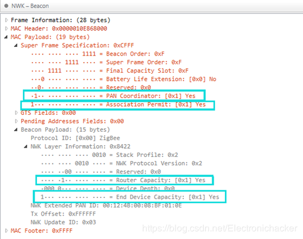
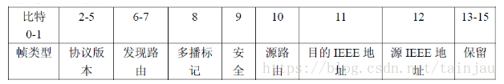

### ember zigbee

#### 1.zigbee基础知识

- 概述

  zigbee技术是一种短距离、低复杂度、低功耗、低速率、低成本的双向无线通信技术或无线网络技术,是一组基于IEEE802.15.4无线标准。由于IEEE802.15.4标准只定义了物理层和MAC层协议,于是成立了zigbee联盟，zigbee联盟对其网络层协议和API进行了标准化，还开发了安全层

- 无线通信方式对比

  

  

- 设备类型

  zigbee的基本成员被称为设备,在zigbee网络中,有3种不同类型的设备，分别是协调器-coorinator、路由器-router、终端节点-end device，如下图所示:

  

  - 协调器(ZC)
    - 定义:每个zigbee网络只允许有一个zigbee的协调器，协调器首先选择一个信道和网络标识(PANID),然后开始这网络。因为协调器是整个网络的开始，它具有网络的最高权限,是整个网络的维护者,还可以保持间接寻址的表格绑定,同时还可以设计安全中心和执行其他动作，保持网络其他设备的通信
    - 功能特点:
      - 选择一个信道和PANID,组建网络
      - 允许路由和终端节点加入这个网络
      - 对网络中的数据进行路由
      - 必须常供电,不能进入睡眠模式
      - 可以为睡眠的终端节点保留数据，至其唤醒后获取

  - 路由器(ZR)
    - 定义:一种支持关联的设备，能够允许其他设备节点入网
    - 功能特点:
      - 在进行数据收发之前,必须首先加入到一个zigbee网络
      - 本身加入网络后,允许路由和终端节点加入
      - 加入网络后，可以对网络中的数据进行路由
      - 必须长供电，不能进入睡眠模式
      - 可以为睡眠的终端节点保留数据，至其唤醒后获取
  - 终端设备(ZE)
    - 定义:具有执行的数据采集传输的设备，不能转发其他节点的消息
    - 功能特点:
      - 在进行数据收发之前，必须首先加入一个zigbee网络
      - 不能允许其他设备的加入
      - 必须通过其他父节点收发数据，不能对网络中的数据进行路由
      - 可由电池供电，进入睡眠模式

- 组网方式

  - 星形拓扑

    - 定义:最简单的一种拓扑形式,它包含一个coordinator节点和一系列的End Device节点。每个End Device节点只能和Coordinator节点进行通讯。如果需要在两个End Device节点之间进行通讯必须通过Coordinator节点进行信息的转发

      

  - 树形拓扑

    - 定义:树形拓扑包括一个Coordinator以及一些列的router和End Device节点。Coordinator连接一些列的Router和End Device,他的子节点Router也可以连接一些列的Router和EndDevice,这样可以重复多个层级

    

  - 网络拓扑-Mesh拓扑

    - 定义:Mesh拓扑包含一个Coordinator和一些列的Router和End Device。这种拓扑形式和树形拓扑相同。但是，网状拓扑具有更加灵活的信息路由规则，在可能的情况下，路由节点之间可以直接的通讯。这种路由机制使得信息的通讯变得更有效率，而且意味着一旦一个路由路径出现了问题，信息可以自动的沿着其他路由路径进行传输

      

- 通信方式

  - 单播(unicatst) - 网络短地址

    unicast是标准寻址模式,它将数据包发送给一个已经知道的网络地址的设备，将afAddrMode设置为Addr16Bit并且在数据包中携带目标设备地址

  - 组播(multicats)

  - 广播(broadccast)

    当应用程序需要将数据包发送给网络的每一个设备时,使用这种模式，将afAddrMode设置为AddrBroadccast，目的地址可以设置下面的其中一种:

    NWK_BROADCAST_SHORTADDR_DEVALL(0xFFFF)——数据包将被传送到网络上的所有设备，包括睡眠中的设备。对于睡眠中的设备，数据包将被保留在其父亲节点直到查询到它，或者消息超时(NWK_INDIRECT_MSG_TIMEOUT 在f8wConifg.cfg 中)。 

    NWK_BROADCAST_SHORTADDR_DEVRXON(0xFFFD)——数据包将被传送到网络上的所有在空闲时打开接收的设备(RXONWHENIDLE)，也就是说，除了睡眠中的所有设备。 

    NWK_BROADCAST_SHORTADDR_DEVZCZR(0xFFFC)——数据包发送给所有的路由器，包括协调器。  

  - MAC地址 - 物理地址

  - 绑定

    - 定义
    - 绑定的方式

- 通信方式代码分析

  - 单播(unicatst) - 网络短地址
  - 组播(multicats)
  - 广播(broadccast) 
  - MAC地址 - 物理地址
  - 绑定

- 专业名词

  - 物理地址(MAC地址):64位IEEE地址,即MAC地址,通常也成为长地址，是全球唯一的地址，8字节

  - 网络地址:在zigbee无线局域网里，每个模块都在一个局域网络里有一个唯一的2字节的地址，叫做网络地址又称为短地址(在网络中通信使用的是短地址,相当于互联网通信中的ip地址)

  - PANID:局域网id一个2字节的编码，用来区别不同的zigbee无线局域网。

  - 端点(Endpoint):用来表示应用层的功能,相当于网络编程中的端口号
    - 1.数据收发的基本单元,用一个字节进行编号,在模块通信的时候，发送模块必须指定收发双发模块的网络地址和端点
    - 2.端点要使用必须和模块里面的某个任务(任务相当于一个应用)挂钩定义,首先每一个端点可以看成1个字节数字编号的房间，数据最终的目标是进入到无线数据包指定的目标端点的房间
    - 3.一个端点只能挂接在一个任务上，而一个任务可以挂接多个端点。相当于在网络编程中一个端口只能让一个应用使用，而一个应用可以占用多个端口
    - 在实际zigbee应用中总共定义了240个不同的应用对象，通过端点来描述，端点接口索引号为1~240，还有两个特殊的端点:
      - 端点0:只为ZDO的数据接口服务
      - 端点255:供应用对象的广播数据接口功能

  - 簇(Cluster ID):用来表示应用的主题,相当于网络通信中MQTT中的主题
    - 簇相当于端点房间中的里面的人，是接收最终的目标，簇是2个字节的编号，在射频发送的时候，必须要指定接收模块的簇，发送模块不需要指定
  - 发送方和接收方收发收据必要素
    - 发送方网络短地址、端点号
    - 接收方网络短地址、端点号、簇id

  - 属性:是应用程有用的数据载荷
  - MAC地址管理器
  - 绑定表

- 协议栈分析

  - 协议栈:是协议的具体实现形式,是协议和用户之间的一个接口,开发人员通过使用协议栈来使用这个协议，进而实现无线数据收发

  - 协议:是一些列的通信标准，就是通信双方进行正常的数据收发所需要共同遵循的一个标准

    

  

  - 分层架构简介

    - 1、PHY:物理层

    - 2、MAC:数据链路层

    - 3、NWK:网络层

    - 4、应用层(包括APS、ZDO、AF)

      - APS：应用支持子层, Application Support Sub Layer
      - ZDO：设备对象, Zigbee Device Object

      - AF：应用程序框架，Application Framework

  - 各层具体功能

    - 物理层（PHY层）

      - 主要功能:激活硬件发送和接收数据；选择Channel Frequency。

      - 基本构成:

        在整个zigbee网络中，物理层是距离硬件最低的层，因此它直接控制并发送无线收发器通信，负责激活发送或接收数据包的无线设备。还具有选择信道的频率并确保该信道当前没有被任何一个其他网络所使用。标准规定的物理层包括一个管理实体，即物理层管理实体（Physical Layer Management Entity, PLME），分别提供以下两个服务：

        PD-SAP：数据服务接入点，Physical Data SAP

        PLME-SAP：管理服务接入点，Physical Layer Management Entity SAP

        在 PLME-SAP 中，包含PHY-PIB（物理层个域网信息数据库），整个物理层也有一个RF-SAP（无线发送接收访问接口）的称呼。

    - MAC层

      - 主要功能:负责产生信标（Beacon）和为信标（beacon-enable网络）同步设备。MAC层还提供建立连接和解除连接的服务。

      - 基本构成:

        如下图所示。MAC层和物理层一样，也包含一个管理实体，称为MLME（MAC Layer Management Entity）。负责维护和 MAC 子层相关的管理目标数据库。，也就是 MAC 子层的PAN（Personal Area Network）信息数据库。

    - 网络层(NWK层)

      - 主要功能:负责形成网络及路由信息的建立（选择将信息发送到目标设备的路径）。此外，协调器的NWK层还负责建立新的网络及选择网络拓扑（星形，树形及网状结构）、分配节点地址等功能。

      - 基本构成:

        如下图所示，同样的NWK层也有相应的数据服务实体NLDE（NWK Layer Data Entity）和管理服务实体：MLME,（NWK Layer Management Entity）

        其中NLDE提供的服务有：生成网络数据单元：也就是对上层的数据进行分段、封装，以及指定路由拓扑和安全支持。

        MLME提供的服务有：配置新设备，建立新网络，允许设备加入或离开网络，路由的发现邻居寻址。

    - 应用层（APL层）
      应用层包含了以下三个部分:APS：应用支持子层，ZDO：设备对象，AF：应用程序框架。

      - 应用支持子层APS

        提供以下两个服务实体：

        应用支持子层数据实体：APSDE，Application Support Sub Layer Data Entity
        应用支持子层管理实体：APSME, Application Support Sub Layer Management Entity
        相应的，也就有APSDE-SAP和APSME-SAP。

      - 应用程序框架

        在应用程序框架（AF, Application Framework）内部，ZigBee 设备对象通过APSDE-SAP来收发数据。总共定义了240个不同的应用对象（Application Object），通过端点来描述，端点接口索引号为1~240。此外还有两个特殊端点：

        ​	端点0：只为ZDO的数据接口服务

        ​    端点255：供应用对象的广播数据接口功能

      - ZDO
        ZDO负责初始化APS,NWK及安全子层，ZigBee 协议栈中的ZDO特指端点号为0的ZigBee 设备对象。ZDO 管的事情实际上纵跨几个层：

        网络角色定义：设备是 coordinator、router 还是end-point

        设备发现:设备发现是ZigBee设备为什么能发现其他设备的过程。这有两种形式的设备发现请求：IEEE地址请求和网络地址请求。IEEE地址请求是单播到一个特殊的设备且假定网络地址已经知道。网络地址请求是广播且携带一个已知的IEEE地址作为负载。

        服务发现:服务发现是为什么一个已知设备被其他设备发现的能力的过程。服务发现通过在一个已知设备的每一个端点发送询问或通过使用一个匹配服务（广播或者单播）。服务发现方便定义和使用各种描述来概述一个设备的能力。服务发现信息在网络中也许被隐藏，在这种情况下，设备提供的特殊服务便可能不在操作发生的时候到达。

- 空中抓包分析

  - CC2530抓包分析

    - 网络建立过程

      - 协调器

        1. 发送一帧信标请求帧,发送这一帧会得到周围具备介绍人资格的节点回复信标帧,但是协调器拿到这些信标帧，用来判断周围的环境情况，为创建网络做准备

           - 在代码中没有指定PANID,会随机选择PANID

             

           - 在代码中指定PANID

             

        2. 当协调器创建成功以后,就会发送一个数据帧，这个帧里面可以看到协调器的地址0x0000,PANID,可以把这个帧就做网络连接状态帧

           - 在代码中没有指定PANID,会随机选择PANID

             

           - 在代码中指定PANID,可以看到PANID变成了指定的PANID

           

      - 路由器

        1. 在入网之前,一直发送信标请求帧，作用是,让在它附件的所有具备介绍人资格的节点，都回复信标帧，这些返回的信标帧被这个想加入的无线模块拿到，通过这些信标帧，选出最佳介绍人节点，请求加入

           

      - 终端

        1. 与路由器行为相同

    - 从入网到稳定工作

      - 协调器发出的网络连接状态帧，表明协调器稳定工作，与路由器或终端入网无关
      - 路由器或终端发出的信标请求帧，用于发现周围的网络，请求加入

      - 路由器或终端拿到协调器发出的信标请求帧之后，可有得到协调器模块相对于自己的信号强度，判断该协调器是不是最佳的介绍人

         以上3个环节在这个过程中会不断地重复,在下图中对应着帧1-帧11

      

      - 帧12:Association request(连接请求)：路由器或终端发送给协调器，作用是路由器或终端模块接收到了协调器模块的信标帧，通过该信标帧判断协调器是当前路由器或终端的最佳介绍人，并且携带了自己MAC地址，这个MAC地址是协调器模块给路由器或终端模块分配网络地址的依据

      - 帧13:ACK协调器硬件自动回复的的ACK,表明已经收到了路由器或终端发过来的帧

        

      - 帧14:数据请求帧:路由器或终端模块发给协调器模块的帧，请求协调器，把你根据我前面发给你的MAC地址给我分配网络地址给我

      - 帧15:ACK帧:协调器恢复给路由器或终端模块的ACK,表明收到了路由器发过来的帧

      - 帧16:协调器把为路由器分配好的网络地址发给路由器或终端模块，而这个帧需要非常明确的发给路由器或终端模块，但是路由器还不知道自己的网络地址是多少，所以在指定目标地址的时候用MAC地址

      - 帧17:路由器或终端模块根据自己的MAC地址收到了协调器发过来分配给自己的网络地址，硬件自己回复ACK,表明已经收到了

      - 帧18:路由器或终端模块入网宣告，告诉当前网络里的所有节点，我入网了，我的网络地址是xxxx

      - 帧19:ACK帧,协调器模块硬件自动回复的ACK帧

      - 帧20:协调器模块在收到了路由器或终端的入网宣告以后，转发的帧

      - 帧21:数据请求帧:告诉父节点，我一直在线

      - 帧22:父节点收到终端发来的帧时硬件自动回复ACK

      - 下图中的帧:协调器或路由器模块在工作稳定后，会每隔一段时间发送一次网络状态帧，默认是15s

        

        

  - ember分析

    - 抓包工具Ubiqua的Traffic介绍

      添加或者隐藏Traffic View中的内容：在抓包左上角中选择“tools” → “options”→ “Traffic”，即可勾选在抓包Traffic View上要显示内容,对于目前测试，一般显示如下即可：

      - Timestamp：发出该条包的时间


      - Time delta：这条包和上一条包的时间间隔


      - Ch.：网关的当前信道


      - Layer：层（MAC/NWK/APS/ZCL/ZDP）


      - Packet information：数据包信息。


      - PAN Dst：显示网关的PAN ID，网关PAN ID可在ZLL Test中查看。


      - MAC Src：可通过查看到包的短地址，判断该条包是由哪个设备发出。


      - MAC Dst：MAC层目的地址，可查看到发出包的设备走的中继。


      - MAC seq：包的序号。


      - NWK Src：NWK层原地址，可查看某条是由哪个设备发出。


      - NWK Dst：NWK层目的地址，可查看到某条包的发送目的是给哪个设备

    - 添加设备

      

      

    - 添加link key

      Ubiqua软件设置抓取加密包的密码，选择tools->Options->Security->Add输入密钥即可

      type-Application or Trust Center Link Key”和“Application or Trust Center Master Key”

      

      - 设置信道

        

    - 入网过程分析

      - 普通开关、插座、门锁设备入网流程一般到basic就结束了；灯到identity结束；低功耗传感器设备一般到IAS zone结束

      - Beacon request

        由endpoint发出，请求入网，设备一般会全信道扫描找网,设备会在预先设置的几个信道里面按照指定的顺序逐信道发出这个包，看到Dest PAN ID,Dest Address都是0xFFFF，说明这是个广播包，在这些信道里面的网络都会收到它。

        

      - Beacon

        由网关发出，主要查看四点，如下图绿色方框内，都为yes则网关处于可以接收router和end device设备入网

        

        备注:

        这个回复里面有五个关键的值

        - Source PAN ID ：回复Beacon的这个设备所处网络的PAN ID
        - Source Address：回复Beacon的这个设备所处网络的短地址
        - Association Permit：关联许可是否开放
        - Router Capacity：可否接入Route节点
        - End Device Capacity：可否接入End Device

        能收到入网设备发出的`Beacon Request`的网络都会回复`Beacon`，并且同一个网络里面能收到入网设备`Beacon Request`的FFD设备都会回复`Beacon`。这样一来，一般入网设备会受到多个`Beacon`回复。那么它会按照下列的顺序，并且结合这帧Beacon的Link Quality来进行下一步动作：

        1.入网设备首先判断`Association Permit`是否开放，这个是需要协调器发出全网广播，通知所有route节点这个许可开放了。

        2.如果关联许可是开放的，再根据自己所属的设备类型来判断`Router Capacity`、 `End Device Capacity`。

        3.如果可以接入，再筛选最佳Link Quality的设备发出`Association Request`，这个时候就需要用Beacon里面的Source PAN ID和Source Address发出一个MAC层的单播包。

      - association request

        关联请求入网，由设备发出，此时设备还没有分配短地址，因此在MAC层显示的原地址为设备长地址

      - data request

        收到Coordinator的MAC层确认后，Endpoint发送一个Data request请求Coordinator给其分配16位网络地址

      - association response

        可以查看到给设备分配的短地址。（当Coordinator接收到Data request后经NWK层的算法为其分配一个唯一的网络短地址，然后向Endpoint发送一个包含些短地址的包，这个包是通过MAC地址发送的）

        

      - Transport key

        传输key,协调器通过子设备的认证后，发送网络密钥

        Trust center link key：公开的，固定为{0x5A 0x69 0x67 0x42 0x65 0x65 0x 41 0x6c 0x6c 0x69 0x61 0xe 0x63 0x65 0x 30 0x39}，是终端用来向coordinate获取网络的network key使用的，所以黑客很容易抓包并用默认的key解码获取network key 从而黑进这个网络。称之为Public Key

        network key:来加密ZigBee设备之间交互的数据的，用network key加密了就看不出交互数据用的是哪个命令了，称为为Private Key

        Trust Center：信任中心，简称TC

        Installation Code :用来预配置Trust Center Link Key，其用于加入ZigBee网络时对Network Key的传输进行加密。在进入网络时，加入设备和Trust Center都必须知道这个唯一的密钥，所以install code用于在两端导出密钥。每一个设备的intall code都不相同，因此生成的link key也不相同，因此在配置设备时，首先要把intall code来告诉协调器

        颁发过程:

        TC设备拿着公钥（Public Key）通过非对称性算法对私钥（Private Key）进行加密，然后将加密后的数据包发给入网的设备，入网设备通过公钥和非对称算法把该数据包解密出来得到私钥，此后所有数据交互都使用私钥（Private Key）进行加密。

        ZigBee设备加入网络后，必须得到私钥才能通信（用来解密数据包内容），这个私钥是由一个叫TC的设备（一般是协调器）颁发的。

        ```c
        security-config.h
        #define ZIGBEE_PROFILE_INTEROPERABILITY_LINK_KEY       \
          {                                                    \
            { 0x5A, 0x69, 0x67, 0x42, 0x65, 0x65, 0x41, 0x6C,  \
              0x6C, 0x69, 0x61, 0x6E, 0x63, 0x65, 0x30, 0x39 } \
          }
        ```

        

        

      - Device announce

        - 一般为设备广播两次，网关广播两次。此时设备已经入网，但是网关还没有识别是什么设备
        - Device Announce的广播数据主要是通知全网相关节点有一个新设备进来了，给大家做个自我介绍，大家刷新下路由表这类的信息。并且可以看到此时的数据在NWK层加密了，就是用了上面的Transport Key传输的Standard Network Key

        a.常电供电设备广播：

        

        b.End device 设备广播

        

      - Active endpoints request

        网关向设备发出的节点请求

      - Active endpoints response

        设备给网关回应的节点数

        

      - Simple descriptor request

        网关请求设备的一些属性或者特性的描述，使网关去判断这是什么设备

      - Simple descriptor response

        设备回应，告诉网关该设备的属性等信息

        

      - Basic：read attributes

        网关请求设备的 basic cluster 相关信息

      - Basic：read attributes response

        

      - Identity

      - IAS Zone:read attributes

      - IAS Zone:read attributes response

- 数据帧格式分析

  ​	参考链接:https://blog.csdn.net/tainjau/article/details/81540013

  - zigbee协议帧格式

    在zigbee技术中，每一个协议层都增加了各自的帧头和帧尾

    

  

  

  

  

  

  - PHY层

    PHY层的数据包分为SHR，PHR和PHY Payload

    SHR（Synchronization Header）：用于同步数据的

    PHR(Physical Header)：包含了帧长度信息

    PHY Payload：包负载，即实际内容（发送给接受设备的数据和命令）

    

  - MAC层

    MAC Frame定义了四种结构如下：信标帧、数据帧、应答帧和MAC命令帧。

    帧类型是由MAC层前面的Herder中的2个字节的FrameControl来决定的。

    

    除此之外，FrameControl控制字段还有其他用途，相应位代表的意思如下：

    

    其中：第0-2位表示帧类型：000：信标帧、001：数据帧、010：应答帧、011：命令帧。

    第3位表示安全使能：体现在该帧是否有密锁保护MAC的有效载荷。

    第4位表示数据待传：1：表述当前数据还没传输完成，发送端还要接着传输数据给接收 端，因此接受设备还需要发送请求来获取数据。

    第5位表示确认请求：1：表示接受设备在接受到该帧的时候，需要回复一个确认帧来表述接收到数据。

    第6位表示网内/网际：表示是否在同个PAN网络中传输数据。

    第10-11位和14-15为表示目的/源地址模式，00：没有目的地址，01：预留，10：16位的短地址，11：64位的长地址。

    - Beacon frame

      其中Beacon Payload对于NWK层是可选域。

      简单来说，信标帧用于同步网络中的设备。在信标网络中，协调器通过向网络中的所有从设备发送信标帧，以保证这些设备能够同协调器进行同步（同步工作和同步休眠），以达到网络功耗最低（非信标模式只允许ZE进行周期性休眠，ZC和所有ZR必须长期处于工作状态）。
      

    这里我截取一段抓包器抓到的beacon包的数据，可以看到超帧描述（superframe specification）、保护时隙域（GTS Fields）和未处理地址区域（Pendling Address Filelds）这几个区域还是有很多细节要讨论的，这里我现在也不是很了解，留在将来学习吧。
    

    - Data Frame

      下图是MAC层数据协议单元（MPDU）的通用帧格式。 数据帧由高层（应用层）发起，在ZigBee设备之问进行数据传输的时候，要传输的数据由应用层生成，经过逐层数据处理后发送给MAC层，形成MAC层服务数据单元(MSDU)。通过添加MAC层帧头信息和帧尾，便形成了完整的MAC数据帧MPDU，其帧结构如下图所示。 
      

    

    - ACK Frame

      最简单的MAC帧，不包含任何Payload，向发送设备表示已经正确的接收了相应的信息。Ack帧非常小，只有5个字节。

      

    还记得之前提到过的FrameControl控制段中的第5位表示确认请求位吧。这位如果被设置成1时，那么接收端收到之后，就需要回复一个ack，来表述接受到数据了。

    

    看一下Ack的数据帧

    

    - MAC Command Frame

      Mac命令帧是细化了通用MAC帧的帧载荷域，是这几种帧格式中较为复杂的

      在ZigBee网络中，为了对设备的工作状态进行控制，同网络中的其他设备进行通信，MAC层将根据命令类型生成相应的命令帧。

      

    区别命令帧的关键在于命令帧标识符（command Type）描述如下：

    

    

    由于每个命令帧后面的载荷所携带信息不同，这里我就不做一一记录了。关于物理层和MAC层，还是基于《IEEE Std 802.15.4-2003》文档。

  - NWK层

    - NWK Header

    在实际工作之中，大多情况是在MAC层以上进行修改操作的。

    NWK层的通用帧格式如下图:

    

    1、帧控制域（Frame Control）
    由2个字节组成，包含所定义的帧类型、地址和序列域以及其他控制标记。帧控制域格式如图。

    

    1.1、帧类型
    帧类型由2bit组成，00代表数据、01代表网络层命令，其余为保留。

    ​                            

    1.2、协议版本
    由4bit组成，设置值反应了所使用的ZigBee网络层协议版本号特定设备上所使用的协议版本应像固定网络层协议版本号一样。

    1.3、发现路由
                                 

    1.4、多播标志位
    多播标志域为1bit，如果是单播或者广播帧，值为0，如果为多播帧值为1。

    1.5、安全域
    该标志位位1时，该帧具有网络层安全操作能力。

    1.6、源路由子域
    该标志位为1时，源路由子帧才在网络层报头中存在。为0时不存在。它分成3个子域。

    1.7、目的IEEE地址子域
    该标志位为1是，网络帧报头包含整个目的IEEE地址。

    1.8、源IEEE地址子域
    该标志位为1是，网络帧报头包含整个源IEEE地址。

    

    2、目的地址域（Destination Address）
    在网络层帧中必须有目的地址域，其长度是2字节。如果帧控制域的多播标志子域值是0，那么目的地址域值是16位的目的设备网络地址或者为广播地址。如果多播标志子域值是1，目的地址域是16位目的多播组的Group ID。值得注意的是设备的网络地址与IEEE802.15.4-2003协议中的MAC层16位短地址相同。

    3、源地址域（Soruce Address）
    在网络层帧中必须有源地址域，其长度是2字节，其值是源设备的网络地址。值得注意的是设备的网络地址与在IEEE802.15.4-2003协议中的MAC层16位短地址相同。

    4、半径域（Radius）
    在网络层帧中必须有半径域，其长度是1字节，并且限定了传输半径范围。每个设备接收一次该帧，则该值减1。

    简单来说，设备将数据发送到网关，途径路由转发的话，该值就会被减1。

    

    5、序列号域（Sequence number）
    在每个帧中都包含序列号域，其长度是1字节。每发送一个新的帧序列号值加1。帧的源地址和序列号子域是一对，在限定了序列号1字节的长度内是唯一的标识符。

    6、目的IEEE地址域（Destination IEEE Address）
    如果存在目的IEEE地址域，则包含与包含在网络层地址头中的目的地址域的16位网络地址相对应的64位IEEE地址。如果该16位网络地址是广播或者多播地址那么目的IEEE地址不存在。

    7、源IEEE地址（Soruce IEEE Address）
    如果存在源IEEE地址域，则包含与包含在网络层地址头中的源地址域的16位网络地址相对应的64位IEEE地址。

    8、多播控制域（Multicast control）
    多播控制域是1字节长度且只有多播标志子域值是1时存在

    ​                                

    8.1、多播模式子域（Multicast Mode）
    多播模式子域表明无论是使用成员或非成员模式传输该帧。成员模式在目的组成员设备中使用传送多播帧。非成员模式是从不是多播组成员设备到是多播组成员设备换算多播帧。

    ​                              

    8.2、非成员半径子域
    当不是目的组成员设备转播时，非成员半径域表明成员模式多播范围。接收设备是目的组成员将设置该子域值是最大非成员半径（MaxNonmemberRadius）域的值。如果NonmemberRadius field的值是0，接收设备不是目的组成员时将丢弃该帧，且如果NonmemberRadius域的值是在0x01到0x06范围内，那么将耗尽此域。如果NonmemberRadius域值是0x07表明无限的范围且不能被耗尽。

    8.3最大非成员半径
    该帧的非成员半径域的最大值。

    9、源路由子帧域
    当帧控制域（Frame Control）的源路由子域标志位为1时，才存在。

    ​                  

    9.1、应答计数器子域
    应答计数器子域表明包含在源路由子帧转发列表里的应答的数值。

    9.2、转发索引
    应答索引子域表明传输的数据包的应答列表子域的下一转发的索引。这个域被数据包的发送设备初始化为0，且每转发一次就加1。

    9.3、应答列表子域
    应答列表子域包括一个应答地址的列表，最接近目标地址的应答先被列出。最接近发起者的应答最后被列出。

    

    - NWK Payloade

      NWK层的帧区别是又帧头的帧控制域（Frame Control）的前两个bit控制的，而数据帧和命令帧格式有所却别，不同处如下图

      

      1、数据帧
      数据帧的网络层报头域有控制域和根据需要适当组合而得到的路由域组成。数据帧的Payload携带的信息就是将来应用层的数据。ps：将来应用层的读属性，写属性等aps层是数据，都是用数据帧发出来的。
      2、命令帧
      命令帧的区别是根据NWK payload中的命令帧标识符（NWK Command Identifier）来决定的，该域是由一个字节组成。

      

      2.1、路由请求命令（Route Request）
      设备使用路由请求命令来请求在其无线通信范围内的其他设备发现到达目的设备的路由，以便在网络中建立一条稳定的使信息更快更经济地到达目的设备的路由。路由请求命令的载荷格式如下图。

      

      2.1.1、命令选择域（Command Options）
      2.1.1.1.多对一路由(Many-to-one)

      

      ps：关于many-to-one更具体的知识，可以参考这篇文档：https://www.silabs.com/community/wireless/zigbee-and-thread/knowledge-base.entry.html/2017/12/18/_many-to-one_source-JRvm

      0：表示不适用many-to-one机制，即单播路由发现。
      1：表示启用many-to-on机制，整个网络中，会由中心节点，周期性发出many-to-one（默认60s，广播），使得整个网络中，具有路由能力的设备都收到这个命令帧，并解析出到中心节点的路径。

      2.1.1.2.Destination IEEE address
      2.1.1.3.多播子域（Mulicast）
      多播子域是1位。只有命令帧请求多播组路由时，它的值是1，在这个情况下，目的地址域包含期望组的Group ID。
      2.2、路由应答命令（Route reply）
      路由应答命令的目的设备使用路由应答命令来通知路由请求的源设备已接收到请求命令。ZigBee路由请求所经路由器建立一种能使帧更快捷地从源地址路由到目的地址的状态路由应答命令的载荷格式如下图所示。

      

      

      ps：当zigbee网络中的A路由设备需要知道去往B设备的路径时，可以发起到B设备的路由发现（不带many-to-one），B设备收到后，将会把路径用route reply应答回去。
      2.3、网络状态命令（Network Status）
      设备使用网络状态命令报告从特定设备的NWK 层到到网络中其他设备的对等NWK 层实体产生的错误和其他情况。NWK 状态命令还可以用来诊断网络问题，例如地址冲突。
      当然，网上也有文章称它为路由错误命令。当设备无法向前传送数据时，便使用路由错误命令。该命令通知发送数据帧源设备，在传送数据帧时出现错误。

      

      以下是网络状态命令对应的Error Code：

      

      详细介绍如下：

      

      2.4、断开命令（Leave）
      网络层管理实体用断开命令通知网络中的其他设备设备正在离开网络或者请求一个设备离开网络（即设备离网），帧格式如下：

      

      2.4.1、重新连接子域（Rejoin）
      重新连列子域是1bit在比特5的位置上。如果这个子域的值是1，同它目前父设备断开的设备重新连接到网络（rejoin）。如果该子域值是0，设备将不重新连接网络。
      2.4.2、请求子域（Request）
      请求子域长度是1bit在bit6位置上。如果该bit的值是1，那么断开命令帧请求另一个设备离开网络。如果该子域值是0，那么断开命令帧表明发送设备准备断开网络。
      2.4.3、断开子设备子域（Remove Children）
      断开子设备子域是1bit长度在bit7的位置。如果该bit的值是1，那么该设备的子设备也离开网络（leave）。
      2.5、路由记录命令（Route Record）
      路由记录命令允许把一个单播数据包在通过网络时采取的路由记录在命令负载中，并发给目标设备。route record通常会在路由设备拥有到中心节点的路径后，发送的第一条数据前会将route record发送给中心节点，使中心节点具有到该路由设备的路径（中心节点的源路由表建立）
      路由记录命令的负载必须按下图格式编排。

      

      2.5.1、应答计数器域（Relay Count）
      包含路由记录命令的应答列表域的应答数。发起设备把它初始化为0，且每接收一个应答加1。
      2.5.2、 应答列表域（Relay List）
      应答列表域是应答数据包的节点的2字节的短地址的列表。地址是最少的有意义的格式。在发送一个数据包之前接收节点附加它们的短地址给列表。
      2.6、重新连接请求命令（Rejoin Request）
      重新连接请求命令允许设备重新连接它的网络。通常是响应通信失败才这么做，例如当终端设备不能同它的发起父设备通信。

      

      capability information信息如下：

      

      2.7、重新连接请求命令（Rejoin response）
      设备发送重新连接响应命令来通知它的短地址的子设备和重新连接状态。帧格式如下

      

      2.7.1、网络地址域（Short Address）
      如果重新连接成功，那么这个2字节域包含一个新的被指定的重新连接设备的短地址。如果重新连接没成功，这个域包含广播地址（0xffff）。
      2.7.2、重新连接状态域（Rejoin Status）
      0x00:表示rejoin请求成功
      2.8、链路状态命令
      连接状态命令帧允许邻居路由器之间通信，直到它们彼此的输入链路成本。
      这就是我们常说的邻居表相关信息。默认情况下，整个网络中，会每个16s发一次链路状态，来维护设备之间的邻居表。

      

      

      2.8.1、连接状态命令选择域（command option）
      命令选项域的条目数子域指明了链路状态表中的链路状态条目数。如果这是发送者链路状态的第一帧，第一帧子域设置为1，如果这是发送者链路状态的最后帧，最后帧子域设置为1。如果发送者链路状态正好为一帧，第一帧和最后帧位都应该设置为1。
      如上图，entry count的数目为2，因此link status list就有两个信息。
      2.8.2、链路状态表域
      链路状态条目按网络地址以递增顺序排序。如果所有的路由器邻居不适合一个帧，应发送多个帧。当发送多个帧时，帧N 的链路状态列表的最后网络地址等于帧N+1 的链路状态列表的第一个网络地址。
      每个链路状态条目包含一个路由器邻居的网络地址，首先是最低字节，其次是链路状态字节。输入消耗域包含设备估计的邻居的链路消耗，这是1 至7 之间的一个值。输出消耗域包括来自邻居表的输出消耗域的值。
      2.9、网络报告命令（Network report）
      网络层报告命令允许设备报告网络事件给协调器。可以报告的事件是无限电通信信道条件和PAN ID冲突。网络层报告命令载荷格式如图下图所示。

      

      2.9.1、命令选择域（command options）
      命令选择区域包含了记录信息计数器子域（Report information count）和记录命令标识符（Report command identifier）
      2.9.2、EPID域
      EPID域包含64位EPID，识别报告设备是哪个网络的成员
      2.10、网络更新命令（Network update）
      网络更新命令允许由NIB中的nwkManagerAddr参数确定的设备广播配置信息的改变到网络中的所有设备。例如广播网络将改变短PAN标识符。

  - APS帧

    

#### 2.ember

- 硬件选型

  ##### A、ZigBee芯片方案选型

  | 选项                  | Silicon Labs                                                 | TI                                                  | Nordic           |
  | --------------------- | ------------------------------------------------------------ | --------------------------------------------------- | ---------------- |
  | 型号                  | EFR32MG                                                      | CC2652R                                             | nRF52840         |
  | 内核                  | Cortex-M4                                                    | Cortex-M4                                           | Cortex-M4        |
  | 主频                  | 40MHz                                                        | 48MHz                                               | 64MHz            |
  | FLASH                 | 256-1024 KB                                                  | 352 KB                                              | 1024KB           |
  | RAM                   | 32-265 KB                                                    | 80KB（256KB ROM）                                   | 256KB            |
  | <u>*最大输出功率*</u> | <u>*8-19.5 dBm*</u>                                          | <u>*5dBm*</u>                                       | <u>*8dBm*</u>    |
  | <u>*接收灵敏度*</u>   | <u>*-99到-103.3 dBm*</u>                                     | <u>*-100dBm*</u>                                    | <u>*-100dBm*</u> |
  | RX电流                | 9.8mA                                                        | 6.9mA                                               | 4.6mA            |
  | TX电流                | 8.2A(0dBm)                                                   | 7.3mA(0dBm)                                         | 4.8mA            |
  | 睡眠                  | 1.5uA(EM2)                                                   | 0.95uA                                              | 0.4uA            |
  | ZigBee协议栈          | EmberZNet                                                    | Z-STACK                                             | nRF5 SDK         |
  | 支持协议              | ZigBeeThreadBLEProprietary ProtocolsWireless M-Bus802.15.4gLPWA | ZigBeeThreadBLEProprietary ProtocolsWi-SUN802.15.4g | ZigBeeThreadBLE  |
  | 软件开发平台          | Simplicity StudioIAR                                         | IAR                                                 | IARKeil          |

  基于更好的无线性能选择，我们选择Silicon Labs（芯科）的芯片。

  我们知道作为ZigBee无线通信频段2.4G上是有多种无线通信协议（如ZigBee、蓝牙、Wi-Fi等）在运行的，由于同频的干扰，多一个dBm就多一份通信保证，多一段通信距离。

  ##### B、ZigBee开发方案选型

   1、网状网片上系统（SoC）

  ​	在Silicon Labs（芯科科技）公司官网上，可以看到Silicon Labs公司所有的ZigBee系列SoC。Silicon Labs推出的ZigBee SoC解决方案主要分为两个系列：EM 和 EFR。

   2、网状网模组（Module）

  ​	在Silicon Labs公司官网上，还可以看到该公司所有的ZigBee系列模组，Silicon Labs推出的ZigBee模组主要也分为两个系列：ETRX 和MGM。

   3、EM与EFR系列

  ​	关于EM系列，其实是Ember的简写，取自于Ember的前两个字母。EM系列SoC可能就是Ember公司的ZigBee在Silicon Labs公司的延续。Silicon Labs收购Ember。

  ​	Silicon Labs公司EM系列的ZigBee SoC，主要采用的是ARM Cortex-M3的内核架构，是Silabs较为成功的代表性产品。在芯片制造和协议栈stack的开发上，都相当的不错。此外，EM系列的ZigBee芯片相比于EFR系列来说，价格要便宜一些。

  ​	关于EFR系列，主要采用的是ARM Cortex-M4的内核架构。相比于EM系列，EFR系列的芯片可以做到更低的功耗，更省电。此外，同等的footprint的芯片，EFR系列的RF射频性能更优。当然，相比于EM系列芯片来说，EFR系列价格要略高一些。

  ​	从工艺角度来说，EM大多采用的是140 nm工艺制造，而EFR大多是90 nm工艺。Silicon Labs最新推出的ZigBee芯片中，已经或将会采用40 nm的制造工艺。

  ​	EM系列已经非常成熟，芯片和模组都非常丰富；新出的EFR系列目前以芯片为主，提供的模组暂时不如EM系列多。

  ​	EM系列的ZigBee SoC大多仅支持ZigBee，部分还支持Thread；而EFR32系列SoC中（如：EFR32MG12P332F1024IM48）最多可支持高达4种协议：ZigBee、Bluetooth、Thread、Sub-GHz。

   4、SoC与Module

  ​	大家对TI的ZigBee方案比较熟悉，知道TI有：CC2530、CC2630、CC2652R等等。一般只有SoC，而没有所谓的Module。这是因为，TI一般只提供SoC，同时会将相应最小系统的外围电路公开，需要Module的用户直接参考着自己进行设计即可。

  ​	对于Silicon Labs，乍一看好像提供了两套ZigBee解决方案。其实不然，将Silicon Labs的ZigBee SoC与Module稍作对比，即可看出：Silicon Labs所有的ZigBee Module，其实全部都是基于该公司的SoC设计而成的。这是因为，Silicon Labs不仅提供SoC，同时也提供功能非常完善的Module（可选择出厂是否带有ZigBee固件）。这样就清楚了，要理清Silicon Labs的ZigBee体系，理清其ZigBee SoC的体系即可。

  当然，不管是哪家的ZigBee方案，都可以做成Module，而市面上也有非常多现成的ZigBee Module可以选择。有以下几点供大家参考：

  1、如果用户不想关心硬件设计过程，只想从事ZigBee固件开发，可以选择出厂不带任何固件的ZigBee Module。

  利：到手即可进行开发，类似于开发套件，非常方便。

  弊：当然，这样肯定会比从SoC开始设计的硬件成本要多出很多。

  2、如果用户既不想关心硬件设计，也不想关心固件开发，而只是想利用ZigBee低成本、大容量、自组织等特性，那么可以选择出厂即带完善功能固件的Module。

  利：这样，用户不必关心复杂的ZigBee原理，以及漫长的研发过程，直接通过串口发送AT指令等简单的方式，即可使系统拥有非常完善的ZigBee功能。

  弊：当然，除了上面提到会增加硬件成本之外，灵活性自然也会不如完全自主开发出来的ZigBee固件。

  3、用户需要把ZigBee芯片嵌入到自己产品内，需要进行硬件设计，则需要选择ZigBee SOC。

  利：灵活方便，完全按自己产品功能进行设计，可进行技术创新和技术保密。

  弊：更长的开发周期。

  - 官方参考链接:https://cn.silabs.com/wireless/zigbee

  

  

  - EFR芯片系列型号:

  

  - EFR芯片型号命名规则:

  

  - EFR1系列与2系列射频对比分析

    

- 软件环境搭建

  - host端应用程序的创建

    https://www.sekorm.com/news/75110780.html

  - ncp端bootloader的创建

    https://www.sekorm.com/news/49945766.html?isSekormApp=0

  - ncp端应用程序的创建

    https://www.sekorm.com/news/56758641.html

  - soc模式程序的创建

    https://www.sekorm.com/news/9830.html?isSekormApp=0

- NCP+HOST

  

  - soc与ncp模式的区别

    - soc:system-on-chip,单独芯片独立运行,也就是应用程序及协议栈在一个单芯片上运行
    - ncp:network coprocrssor，ncp端的固件包括两部份,bootloader和协议栈

    

- ember zigbee软件框架

  