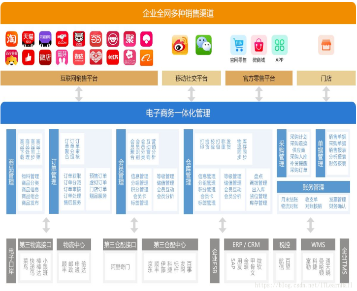
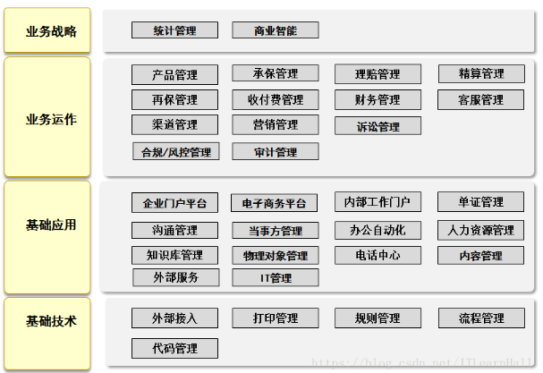
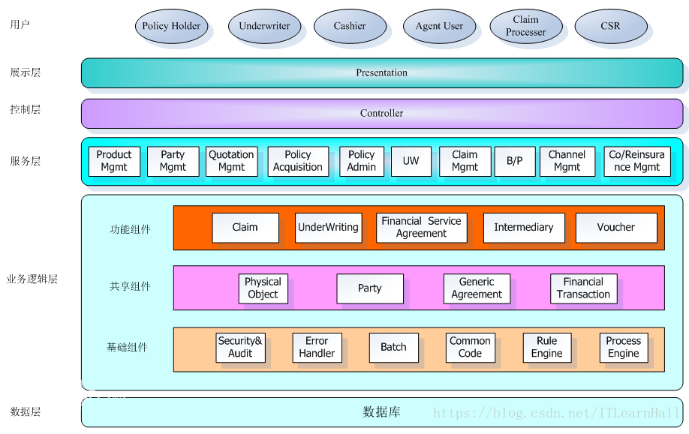
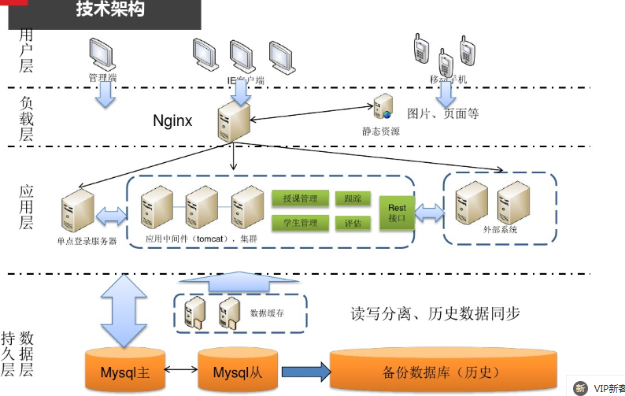

#### 																架构分类

##### 业务架构：是战略，表现的是有什么业务应用

##### 应用架构：是战术，描述系统的组成和架构，一般从系统功能和系统技术层次两个架构视角进行设计

##### 系统功能架构图

##### 系统技术架构图

##### 技术架构

##### 技术架构是武器，从技术层面描述，主要是分层模型，例如持久层、数据层、逻辑层、表现层等，然后每一层使用什么技术框架

