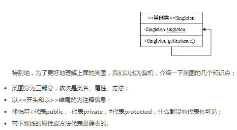
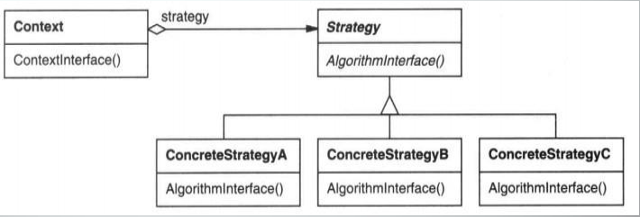
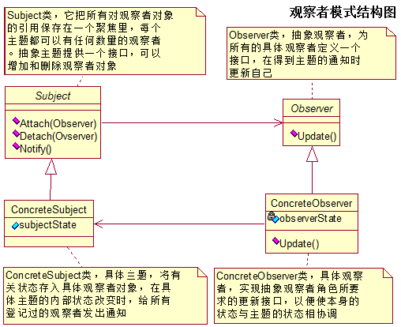
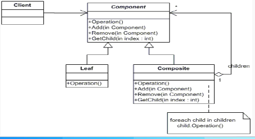
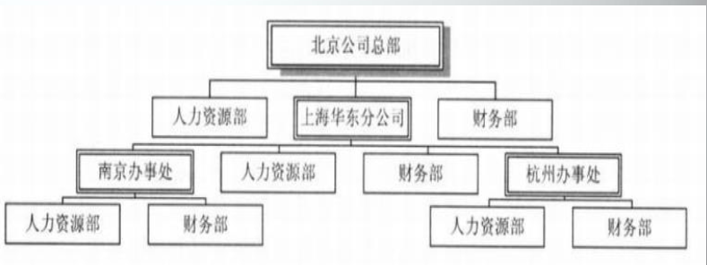
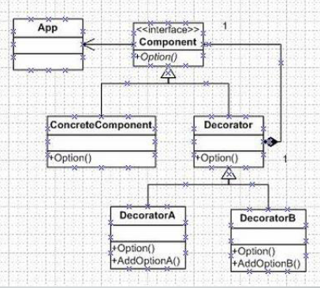
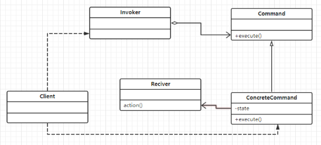

### 												设计模式

#### 定义:

每个模式都描述了一个在我们的环境中不断出现的问题，然后描述了给问题的解决方案的核心，通过这种方式，可以无数次地使用那些已有的解决方案，无需再重复相同的工作。

描述了定制化的相互通信的对象与类，以解决特定环境中的通用设计问题

```
模式一条由3部分在组成的规则
一个特定环境、一个问题、一个解决方案
模式的核心思想：进行设计的复用
```

#### 典型设计模式

##### 结构实例

- 定义:
- 环境:
- 问题:
- 结构
- 解决方案
- code

##### 单例模式

- 定义:确保一个类仅有一个唯一的实例，并且提供一个全局的访问点

- 环境:整个系统中只需要拥有一个全局的对象

- 问题:确保一个类仅有一个唯一的实例，并且提供一个全局的访问点

- 结构

  

- 解决方案

  1. 首先将构造函数声明成私有类型，屏蔽通过直接实例化的形式来访问
  2. 其次控制全局只有一个实例的类-static
  3. 提供一个可以获得实例的方法，用于返回类的实例，并保证得到的是同一个对象 

- code

  立即加载:在类加载初始化的时候就主动创建实例
  
  延迟加载:等到真正使用的时候才去创建实例，不用时不去主动创建

  饿汉模式是立即加载，他是线程安全的。懒汉模式是延迟加载，他是线程不安全的
  
  [参考代码][https://blog.csdn.net/czqqqqq/article/details/80451880]
  
  ```java
  //单例模式-恶汉模式
   class SingletonHungry {
  
      //指向自己实例的私有静态引用
      private static SingletonHungry singletonHungry = new SingletonHungry();
  
      //私有的构造方法
      private SingletonHungry() {}
  
      //已自己实例为返回值的静态公有方法
      public static SingletonHungry getInstance() {
  
          return singletonHungry;
      }
  
      public void printf() {
          System.out.println("SingletonHungry");
      }
  }
  ```
  
  ```java
  //单例模式-懒汉模式
  class SingletonLay {
  
      //指向自己实例的私有静态引用
      private static SingletonLay singletonLazy;
  
      //私有的构造方法
      private SingletonLay() {}
  
      //已自己实例为返回值的静态公有方法
      public static SingletonLay getInstance() {
  
          if(null == singletonLazy) {
              synchronized(SingletonLay.class) {
                  if(null == singletonLazy ) {
                      singletonLazy = new SingletonLay();
                  }
              }
          }
          return singletonLazy;
      }
  
      public void printf() {
          System.out.println("SingletonLay");
      }
  }
  ```
  
  ```java
  public static void testSingletonHungry() {
  
  SingletonHungry.getInstance().printf();
  }
  ```
  
  

##### 策略模式

- 定义:定义了一系列的算法,并将每一个算法封装起来,而且使它们还可以相互替换。策略模式让算法独立于它的客户而独立变化

- 环境:

  - 如果在一个系统里面有许多类，它们之间的区别仅在于它们的行为，那么使用策略模式可以动态地让一个对象在许多行为中选中一种行为
    - 一个系统需要动态地再几种算法中选中一种
  - 不希望客户端知道复杂的、与算法相关的数据结构，在具体策略类中/封装算法和相关的数据结构，提高算法的保密性和安全性/
  - 缺点:
    - 客户端必须知道所有的策略类，并自行决定师兄哪一个策略类
    - 策略模式将造成产生很多策略类

- 问题:

  1. 将每一个一系列的算法封装起来
  2. 而且使它们还可以相互替换

- 结构

  

- 解决方案

  策略模式中有以下3中角色

  - 抽象策略类(strategy):定义所有支持算法的公共接口
  - 具体策略类(concretestrategy):以strategy接口实现某具体算法
  - 环境类(context):维护一个对strategy对象的引用,可定义一个接口来让strategy访问它的数据

- code

  ```java
  /*********************************策略模式****************************************/
  interface IStrategy { //定义抽象策略类
      public void printf();
  }
  
  class StudentStrategy implements IStrategy { //定义具体策略实现类
  
      @Override
      public void printf() {
          System.out.println("StudentStrategy");
      }
  }
  
  class TeacherStrategy implements IStrategy { //定义具体策略实现类
  
      @Override
      public void printf() {
          System.out.println("TeacherStrategy");
      }
  }
  
  class ContextStrategy { //定义环境类
  
      private IStrategy strategy;
  
      public ContextStrategy(IStrategy strategy) {
          this.strategy = strategy;
      }
  
      public void printf() {
          strategy.printf();
      }
  }
  
  public static void testStrategy() {
  
      ContextStrategy stategy1 = new ContextStrategy(new StudentStrategy());
      ContextStrategy stategy2 = new ContextStrategy(new TeacherStrategy());
  
      stategy1.printf();
      stategy2.printf();
  }
  ```

##### 适配器模式

- 定义:将一个类的接口转换成客户希望的另外的一个接口，使得原本由于接口不兼容而不能一起工作的那些类可以一起工作

- 环境:

- 问题:

  - 想使用一个已经存在的类，但是它的接口不符合要求

- 结构

  适配器模式中有以下4种角色

  - 目标(target):定义客户端使用的与特定领域相关的接口
  - 被适配者(adaptee):定义了一个已经存在的接口，这个接口需要匹配
  - 适配者(adpater):对Adaptee的接口与target的接口进行适配
  - 客户端(client):与符合target接口的对象协同

- 解决方案

  - 类适配器
    - 确定目标接口
    - 确定被适配者
    - 创建适配器(继承自被适配者，实现目标接口)

  - 目标适配器
    - 确定目标接口
    - 确定被适配者
    - 创建适配器(拥有被适配者的对象,实现目标接口)

  - 类适配器和对象适配器哪个更好

    类适配器采用多继承的实现方式，带来了不良的高耦合，对象适配器采用对象组合的方式，更符合松耦合精神，类适配器无法面对多个被适配对象

- code

  ```java
  /*********************************适配器模式****************************************/
  interface IAdapter { //被确定的目标接口
  
      public void run();
      public void fly();
  }
  
  class StudentAdapter { //被确定被适配者
  
      public void run() {
          System.out.println("StudentAdapter run");
      }
  }
  
  //类适配器
  class ClassAdapter extends StudentAdapter implements IAdapter { //类适配器
  
      @Override
      public void fly() {
          System.out.println("ClassAdapter fly");
      }
  }
  
  class ObjectAdapter implements IAdapter { //对象适配器
  
      private StudentAdapter studentAdapter; //使用组合的方式,里面包含一个该类型的实例
  
      public ObjectAdapter(StudentAdapter s) {
          studentAdapter = s;
      }
  
      @Override
      public void run() {
          studentAdapter.run();
      }
  
      @Override
      public void fly() {
          System.out.println("ObjectAdapter fly");
      }
  }
  
public static void testAdapter() {
  
      ClassAdapter classAdapter = new ClassAdapter();
  
      ObjectAdapter objectAdapter = new ObjectAdapter(new StudentAdapter());
  
      classAdapter.run();
      classAdapter.fly();
  
      objectAdapter.run();
      objectAdapter.fly();
  }
  ```
  

##### 观察者模式

- 定义:

  - 又叫发布-订阅模式
  - 两个角色:观察者和被观察者对象
  - 两者之间存在观察的额逻辑关系
  - 当被观察者发生变化的时候，观察者就会观察到这样的变化，并且做出相应的响应
  - 观察不是直接调用
  - 实现观察者有很多形式，比较直观的一种是使用一种注册-通知-撤销的形式

- 环境:

- 问题:

  - 某对象发生变化，需其他对象做成调整
  - 应用程序的可维护性和重用性
  - 互动关系不能体现类之间的直接倒虹，对象之间的关系解耦
  - 

- 结构

  

- 解决方案

- code

  ```java
  /*********************************观察者模式****************************************/
  interface ISubject { //被观察者需要实现的接口
      void registerObserver(IObserver o);
      void removerObserver(IObserver o);
      void notifyOberver();
  }
  
  interface IObserver { //观察者需要实现的接口
      void update(Object o);
  }
  
  class TeacherSubject implements ISubject { //具体的被观察者对象
  
      private ArrayList<IObserver> observerList = new ArrayList<IObserver>(); //被观察者对象中含有一个容器,里面装载着观察者
  
      public String getName() {
          return name;
      }
  
      public void setName(String name) { //当被观察者发生变化是,即可通知观察者
          this.name = name;
  
          notifyOberver();
      }
  
      private String name;
  
      @Override
      public void registerObserver(IObserver o) {
          observerList.add(o);
      }
  
      @Override
      public void removerObserver(IObserver o) {
          observerList.remove(o);
      }
  
      @Override
      public void notifyOberver() {
  
          int length = observerList.size();
          for (int i = 0;i < length;i++) {
              observerList.get(i).update(name);
          }
      }
  }
  
  class StudentObserver implements IObserver {
  
      private String name;
  
      public String getName() {
          return name;
      }
  
      public void setName(String name) {
          this.name = name;
      }
  
      @Override
      public void update(Object o) {
           name = (String)o;
      }
  }
  
  public static void testObserver() {
  
      StudentObserver s1 = new StudentObserver();
      StudentObserver s2 = new StudentObserver();
  
      TeacherSubject t = new TeacherSubject();
  
      t.registerObserver(s1);
      t.registerObserver(s2);
  
      t.setName("zhaokun");
  
      System.out.println(s1.getName());
      System.out.println(s2.getName());
  
      t.setName("kunzhao");
  
      System.out.println(s1.getName());
      System.out.println(s2.getName());
  
  }
  ```

  

##### 组合模式

- 定义:

  - 组合模式又叫做整体-部分模式。它使树型结构的问题中，模糊了简单元素金额复杂元素的额概念，客户程序可以像处理简单元素一样来处理复杂元素，从而使得客户程序与复杂元素的内部结构解耦

- 环境:

  在开发中，我们经常可能要递归构建树状的组合结构

- 问题:

- 结构

  

  

- 解决方案

  - 组合模式中有3种角色
    - 抽象组件类(component):组合中的对象声明接口,实现所有类共有接口的行为。声明用于访问和管理Component的子部件的接口
    - 叶子节点:叶节点对象,叶节点没有节点。由于叶节点不能增加分支和树叶,所以叶节点的Add和Remove没有实际意义
    - 组件集合类(Composite):实现Componet的相关操作，比如Add和Remove操作。其中包含Component的容器,用来存储叶节点集合，有叶节点行为，用来存储叶节点集合

  - 实现步骤
    - 定义抽象组件接口
    - 实现叶子结点类,实现抽象组件类的接口
    - 实现组件集合类，实现抽象组件类的接口
    - 定义环境类，将叶子节点和组件集合加入根组件集合

- code

  ```java
  /*********************************组合模式****************************************/
  abstract class ComponentComposite {
  
      protected String name;
  
      public ComponentComposite(String name) {
          this.name = name;
      }
  
      public abstract void add(ComponentComposite c);
      public abstract void remove(ComponentComposite c);
      public abstract void display(int depth);
  }
  
  class DocComposite extends ComponentComposite {
  
      public DocComposite(String name) {
              super(name);
      }
      @Override
      public void add(ComponentComposite c) {
          System.out.println("我是文件不能进行添加操作");
      }
  
      @Override
      public void remove(ComponentComposite c) {
          System.out.println("我是文件不能进行删除操作");
      }
  
      @Override
      public void display(int depth) {
          System.out.println(depth + name);
      }
  }
  
  class FileComposite extends ComponentComposite {
  
      private ArrayList<ComponentComposite> list = new ArrayList<ComponentComposite>();
  
      public FileComposite(String name) {
          super(name);
      }
  
      @Override
      public void add(ComponentComposite c) {
          list.add(c);
      }
  
      @Override
      public void remove(ComponentComposite c) {
          list.remove(c);
      }
  
      @Override
      public void display(int depth) {
          System.out.println(depth + name);
          int length = list.size();
          for (int i = 0;i < length;i++) {
              list.get(i).display(1+depth);
          }
      }
  }
  
  public static void testComposite() {
  
      FileComposite root = new FileComposite("root");
      DocComposite doc1 = new DocComposite("doc1");
  
      FileComposite file1 = new FileComposite("file");
      DocComposite doc2 = new DocComposite("doc2");
      file1.add(doc2);
  
      root.add(doc1);
      root.add(file1);
  
      root.display(1);
  
  }
  ```

##### 装饰者模式

- 定义:

- 环境:

  咖啡店里咖啡中可以加不同的配料–摩卡、牛奶、糖、奶泡；不同的饮品加上不同的配料有不同的价钱，怎样实现呢？

  可能你的第一印象会想到使用继承， 

  1. 首先定义一个咖啡基类 
  2. 对于加糖的，加牛奶的，加摩卡的 ，加奶泡的，分别写一个子类继承 

  3. 对于加糖，又加奶的写一个类，对于对于加糖，又摩卡的写一个类，对于对于加糖、又奶泡的写一个类，对于加糖，又加奶、摩卡的写一个类，说到这里，你会发现这里四种配料就要写十几种实现类了，那如果我们的配料是二十几种或者三十几种呢，那么使用继承这种 方式肯定会使我们的子类爆炸，那要怎样解决你，答案就是使用装饰者模式

- 问题:

  - 不必改变原类文件和使用继承的情况下，动态地扩展一个对象的功能

- 结构

  

- 解决方案

  - 首先定义被装饰者类
  - 通过被装饰者对象产生装饰者对象

- code

  ```java
  /*********************************装饰模式****************************************/
  abstract class CarDecorator { //被装饰者
  
      protected int cost;
      public abstract int getCost();
  }
  
  class A4CarDecorator extends CarDecorator {
  
      public A4CarDecorator() {
          cost = 4;
      }
  
      @Override
      public int getCost() {
          return cost;
      }
  }
  
  class Decorator extends CarDecorator { //装饰者
  
      protected CarDecorator car;
  
      @Override
      public int getCost() {
          return cost + car.getCost();
      }
  
      public void setCar(CarDecorator car) {
          this.car = car;
      }
  }
  
  class GPSDecorator extends Decorator {
  
      public GPSDecorator() {
          cost = 1;
      }
  }
  
  class WheelDecorator extends Decorator {
  
      public WheelDecorator() {
          cost = 1;
      }
  }
  
  public static void testDecorator() {
  
      CarDecorator A4 = new A4CarDecorator();
  
      Decorator d1 = new GPSDecorator();
  
      d1.setCar(A4);
  
      WheelDecorator w1 = new WheelDecorator();
  
      w1.setCar(d1);
  
      System.out.println(w1.getCost());
  }
  ```

- ##### 命令者模式

  - 定义:

    - 将一个请求封装为一个对象，从而可用不同的请求对客户进行参数化，对请求排队火和请求做出日志记录，以及可以支持撤销的操作
    - 命令模式可以将请求发送者和接收者进行解耦，命令模式创建命令对象。命令对象接受，发送者的请求，然后命令对象调用对应的接受者的方法

  - 环境:

  - 问题:

  - 结构

  - 解决方案

    Command(抽象命令者)：这个角色为接口或抽象类，其中生命的EXECUTE方法为调用请求接受者执行的方法。

    ConcreteCommand(具体命令者):这个角色实现了抽象命令类的方法，也是具体接受者的关联的类。同过具体的execute方法调用处理类的方法处理请求。

    Invoker（请求发送者）:具体的请求发送者，不需要再创建的时候具体指定谁来处理它。可以再运行时通过命令对象具体注入谁来处理这个请求。

    Reciver(请求处理者)：执行与请求相关的业务代码。
    

  - code

    ```java
    /*********************************命令者模式****************************************/
    class WaiterInvoker { //命令传递者
    
        private Commander commander;
    
        public void setCommander(Commander commander) {
            this.commander = commander;
        }
    
        public void execute() {
            commander.execute();
        }
    }
    
    interface Commander { //命令接口
    
        void execute();
    }
    
    class PlayCommander implements Commander { //对外提供的具体命令
    
        @Override
        public void execute() {
            new StudentExecuter().execute();
        }
    }
    
    class SleepCommander implements Commander {
    
        @Override
        public void execute() {
            new TeacherExecuter().execute();
        }
    }
    
    interface RealExecuter { //真正执行命令的接口
    
        void execute();
    }
    
    class StudentExecuter implements RealExecuter {
    
        @Override
        public void execute() {
    
            System.out.println("StudentExecuter");
        }
    }
    
    class TeacherExecuter implements RealExecuter {
    
        @Override
        public void execute() {
    
            System.out.println("TeacherExecuter");
        }
    }
    
    public static void testCommand() {
    
        WaiterInvoker w = new WaiterInvoker();
    
        PlayCommander p = new PlayCommander();
    
        w.setCommander(p);
    
        w.execute();
    }
    ```

    

##### 状态模式

- 定义:

- 环境:

- 问题:

- 结构

- 解决方案

- code

  ```java
  /*********************************状态模式****************************************/
  interface State { //定义状态接口
      void book();
      void unbook();
      void checkin();
      void checkout();
  }
  
  class FreeState implements State {
  
      public FreeState() {
          System.out.println("空闲状态");
      }
  
      @Override
      public void book() {
          System.out.println("当前为空闲状态正在进行预定操作");
      }
  
      @Override
      public void unbook() {
          System.out.println("当前为空闲状态不能进行取消预定操作");
      }
  
      @Override
      public void checkin() {
          System.out.println("当前为空闲状态正在进行入住操作");
      }
  
      @Override
      public void checkout() {
          System.out.println("当前为空闲状态正在进行取消入住操作");
      }
  
  }
  
  class BookState implements State {
  
      public BookState() {
          System.out.println("预定状态");
      }
  
      @Override
      public void book() {
          System.out.println("当前为预定状态不能进行预定操作");
      }
  
      @Override
      public void unbook() {
          System.out.println("当前为预定状态正在进行取消预定操作");
      }
  
      @Override
      public void checkin() {
          System.out.println("当前为预定状态正在进行入住操作");
      }
  
      @Override
      public void checkout() {
          System.out.println("当前为预定状态不能进行取消入住操作");
      }
  
  }
  
  class InState implements State {
  
      public InState() {
          System.out.println("入住状态");
      }
  
      @Override
      public void book() {
          System.out.println("当前为入住状态不能进行预定操作");
      }
  
      @Override
      public void unbook() {
          System.out.println("当前为入住状态不能进行取消预定操作");
      }
  
      @Override
      public void checkin() {
          System.out.println("当前为入住状态不能进行入住操作");
      }
  
      @Override
      public void checkout() {
          System.out.println("当前为入住状态正在进行取消入住操作");
      }
  
  }
  
  class Room {
  
      private State state;
  
      public void setState(State state) {
          this.state = state;
      }
  
      public void book() {
         state.book();
         state = new BookState();
      }
  
      public void unbook() {
          state.unbook();
          state = new FreeState();
      }
  
      public void checkin() {
          state.checkin();
          state = new InState();
      }
  
      public void checkout() {
          state.checkout();
          state = new FreeState();
      }
  }
  
  public static void testState() {
  
      Room room = new Room();
      State s = new FreeState();
  
      room.setState(s);
  
      room.book();
  
      room.checkin();
  
      room.checkout();
  
  }
  ```

  


