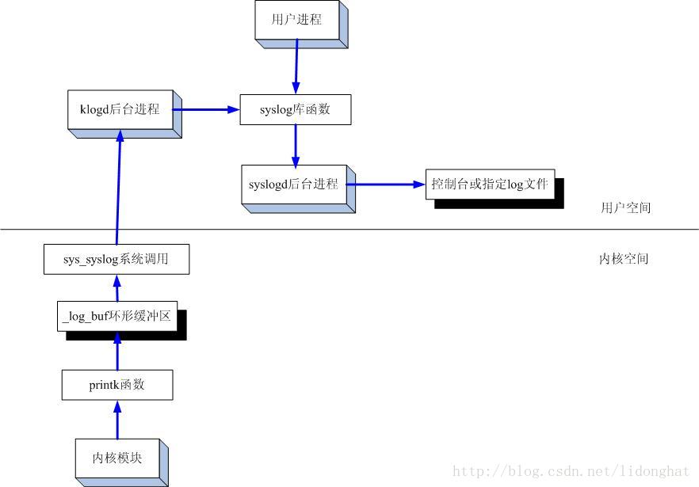
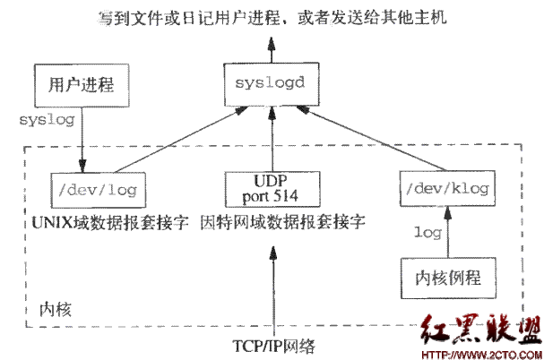

#### 1. rsyslog、syslog和klog整体关系

```
(1)syslog是unix系统的一个常见组件，用于执行系统日志记录活动
(2)syslogd是它的一个守护进程，syslogd从一组日志源(如/dev/log)中读取数据，并按照/etc/syslog.conf中的说明处理这些日志消息、通过调用syslog()可将应用程序日志消息记录到syslog中。
(3)klogd是一个从unix内核接收消息的设备，klogd守护进程获取并记录linux内核消息，通常syslogd会记录klogd传来的所有内核消息。klogd读取内核消息-->klogd调用API接口-->syslogd将其按照配置文件对数据进行处理

注意点:
	应用程序和klogd都是调用api接口，将数据写入到设备节点/dev/log中，然后syslogd读取/dev/log节点,通过这种方式实现了数据的传输
```





```shell
[root@zihome /etc]# syslogd --help
BusyBox v1.25.1 (2020-08-27 18:20:36 CST) multi-call binary.

Usage: syslogd [OPTIONS]

System logging utility
#该版本忽略了/etc/syslog.conf下的配置文件
(this version of syslogd ignores /etc/syslog.conf)

        -n              Run in foreground
        -R HOST[:PORT]  Log to HOST:PORT (default PORT:514)
        -L              Log locally and via network (default is network only if -R)
        -C[size_kb]     Log to shared mem buffer (use logread to read it)
        #默认的保存文件的路径
        -O FILE         Log to FILE (default: /var/log/messages, stdout if -)
        -s SIZE         Max size (KB) before rotation (default:200KB, 0=off)
        -b N            N rotated logs to keep (default:1, max=99, 0=purge)
        -l N            Log only messages more urgent than prio N (1-8)
        -S              Smaller output

#将日志信息保存到指定的目录下
syslogd -n -O /zihome/1.txt
#将日志信息上传到服务器上
syslogd -R 192.168.18.228:514 -n

注意点:
	(1)syslog可以产生文件日志、上传远程服务器、共享内存(可以使用logread命令读取)，但是只能选择其中的一种
	(2)使其支持logread命令
	2.1 选择logread命令:
	输出到共享内存中(即可以使用logread命令进行读取)，需要在busybox中进行配置，在buildroot下执行make menuconfig找不到logread选项（在openwrt下配置内核可以使用make kernel_menuconfig）在buildroot目录下执行make busybox-menuconfig，或在busybox下执行make menconfig命令
	
	System Logging Utilities  --->
		[*] klogd                                                                         
		[*]   Use the klogctl() interface                                                 
		[*] logger                                                                       
		[*] logread                                                                       
		[*]   Double buffering                                                           
		[*] syslogd                                                                       
		[*]   Rotate message files                                                       
		[*]   Remote Log support                                                         
		[ ]   Support -D (drop dups) option                                               
		[ ]   Support syslog.conf                                                         
		(256) Read buffer size in bytes                                                   
		(16)    Circular buffer size in Kbytes (minimum 4KB)   
		
	2.2 syslogd -C //使用-C命令开启IPC
```


```shell
//syslog命令示例:
[root@zihome /]# logger --help
BusyBox v1.25.1 (2020-08-27 18:20:36 CST) multi-call binary.

Usage: logger [OPTIONS] [MESSAGE]

Write MESSAGE (or stdin) to syslog

        -s      Log to stderr as well as the system log
        -t TAG  Log using the specified tag (defaults to user name)
        -p PRIO Priority (numeric or facility.level pair)
        
#设置级别、标签、日志信息
logger -p debug -t name -s zhaokun
Jul  5 00:36:39 zihome user.debug name: zhaokun

```

```c
//syslog代码示例:
#include <syslog.h>    
#include <stdio.h>    
#include <stdarg.h>    
 
int main(int argc, char** argv)    
{    
    /*1.打开日志*/    
    openlog("log_test ", LOG_PID|LOG_CONS, LOG_USER);   
    /*2.写日志*/    
    syslog(LOG_INFO, "%s: PID information, pid=%d", argv[0], getpid());  
    syslog(LOG_DEBUG,"%s: debug message",argv[0]);

    /*3.关闭日志*/    
    closelog();    
}

//查看打印日志结果:
cat /var/log/messages
Jul  5 00:22:30 zihome user.info log_test [2783]: ./main: PID information, pid=2783
Jul  5 00:22:30 zihome user.debug log_test [2783]: ./main: debug message
    
//打印日志解释:
    LOG_PID:对应着pid
    LOG_USERL:对应着user
    LOG_INFO/LOG_DEBUG:对应着info、debug

//API解释
    void openlog(const char *ident, int log_options, int facility);
    void syslog(int priority, const char *format, ...);
    int setlogmask(int mask_priority);
    void closelog(void);

//log_options解释：
#define    LOG_PID        0x01    /* log the pid with each message */log中包含进程pid。
#define    LOG_CONS    0x02    /* log on the console if errors in sending */如果syslogd无法正确输出，输出到控制台作为替代。
#define    LOG_ODELAY    0x04    /* delay open until first syslog() (default) */
#define    LOG_NDELAY    0x08    /* don't delay open */
#define    LOG_NOWAIT    0x10    /* don't wait for console forks: DEPRECATED */
#define    LOG_PERROR    0x20    /* log to stderr as well */
    
//facility解释:
#define    LOG_KERN    (0<<3)    /* kernel messages */
#define    LOG_USER    (1<<3)    /* random user-level messages */
#define    LOG_MAIL    (2<<3)    /* mail system */
#define    LOG_DAEMON    (3<<3)    /* system daemons */
#define    LOG_AUTH    (4<<3)    /* security/authorization messages */
#define    LOG_SYSLOG    (5<<3)    /* messages generated internally by syslogd */
#define    LOG_LPR        (6<<3)    /* line printer subsystem */
#define    LOG_NEWS    (7<<3)    /* network news subsystem */
#define    LOG_UUCP    (8<<3)    /* UUCP subsystem */
#define    LOG_CRON    (9<<3)    /* clock daemon */
#define    LOG_AUTHPRIV    (10<<3)    /* security/authorization messages (private) */
#define    LOG_FTP        (11<<3)    /* ftp daemon */ 
    
//priority解释
#define    LOG_EMERG    0    /* system is unusable */
#define    LOG_ALERT    1    /* action must be taken immediately */
#define    LOG_CRIT    2    /* critical conditions */
#define    LOG_ERR        3    /* error conditions */
#define    LOG_WARNING    4    /* warning conditions */
#define    LOG_NOTICE    5    /* normal but significant condition */
#define    LOG_INFO    6    /* informational */
#define    LOG_DEBUG    7    /* debug-level messages */
```

```shell
参考文档:
#Linux日志系统分析：rsyslog、syslog和klog
https://www.cnblogs.com/markcoven/archive/2019/07/16/11197146.html
#Busybox的syslogd认识与使用
https://www.cnblogs.com/arnoldlu/p/10583233.html
#syslogd分析
https://blog.csdn.net/shift_wwx/article/details/89105854
#rsyslogd、syslog远程传输、日志存储、转存
https://blog.csdn.net/a_tu_/article/details/72967505?utm_source=blogxgwz8
#syslog编程
https://www.cnblogs.com/embedded-linux/p/5201158.html
```

#### 2. start-stop-daemon守护进程

```shell
linux系统守护进程管理:start-stop-daemon
(1)作用:启动或停止系统守护进程
(2)格式:
	start-stop-daemon [–启动|–停止] [选项] [–参数…]
	其中(–启动|–停止)一项必须给出）
	-S,–start 开始
	-K,–stop 停止
	[–参数…] 为向应用传入的参数（argv[1] argv[2] argv[3] …）
	
(3)选项
通用选项
-u,--user USERNAME|UID		只匹配该用户的进程
	USERNAME|UID		用户名称或UID
-p,--pidfile PID_FIL		匹配文件中带有PID的进程
	PID_FIL	PID文件
-n,--name PROCESS_NAME		通过在进程名称匹配查找进程
	PROCESS_NAME		进程名称可是绝对路径也可是相对路径
	
只对start有效的选项
-x,--exec EXECUTABLE		执行可执行程序(execvp的第一个参数)。强制性的。
	[EXECUTABLE]执行的应用（最好绝对路径）
-a,--startas NAME		argv[0](默认为可执行文件)，与-x类似
-b,--background			把进程放到后台运行
-N,--nicelevel N		设置进程的优先级(NI)为N
-c,--chuid USER[:[GRP]]		改为指定用户[和组]
-m,--make-pidfile		将PID写入PID文件(pidfile)(必须同时使用-m和-p)

只对stop有效选项
-s,--signal SIG		发送信号(默认:TERM)
-t,--test 		如果发现进程，则退出，状态为0

其他选项
-o,--oknodo		如果未执行任何操作，则退出，状态为0
-q,--quiet		安静（静默输出）
-v,--verbose		冗长

示例:
#开始运行
start-stop-daemon -b -S -q -m -p /var/run/syslogd.pid --exec /sbin/syslogd -- zhaokun 30 //zhaokun 30 为传递的参数

#停止运行,根据pid号进行停止
start-stop-daemon -K -q -p /var/run/syslogd.pid
#停止运行,根据进程名字进行停止
start-stop-daemon -K -q -n syslogd

备注:
	(1)在proc文件中国查看进程的状态、线程数
        [root@zihome /proc/10]# cat status 
        Name:   kworker/u2:1
        Umask:  0022
        State:  I (idle) #状态
        Pid:    10 #进程号
        PPid:   2  #父进程号
        Threads:        1 #线程数
    
	(2)在shell脚本中读取当前进程号和父进程号
        #!/bin/sh
        #当前进程ID
        echo "PID of this script: $$"
        #父进程ID
        echo "PPID of this script: $PPID"
        echo "UID of this script: $UID"
参考文档:
https://blog.csdn.net/sunst95/article/details/107014078
```

#### 3. linux下的strip命令

```shell
#使用strip命令对库文件进行瘦身操作

#查看库文件是否strip
file libc-2.3.6.so
libc-2.3.6.so: ELF 32-bit LSB shared object, ARM, version 1, dynamically linked (uses shared libs), for GNU/Linux 2.4.3, not stripped

#对库文件进行strip
arm-linux-strip lib/*
libc-2.3.6.so: ELF 32-bit LSB shared object, ARM, version 1, dynamically linked (uses shared libs), for GNU/Linux 2.4.3, stripped

#strip前
-rwxrwxr-x 1 book book 1435660 2010-12-24 13:58 /work/nfs_root/first_fs/lib/libc-2.3.6.so

#strip后
book@book-desktop:/work/nfs_root/strip/lib$ ls -al libc-2.3.6.so
-rwxr-xr-x 1 book book 1133744 2020-08-14 11:55 libc-2.3.6.so

#总结:可以看到使用strip命令后，文件会变小
```

