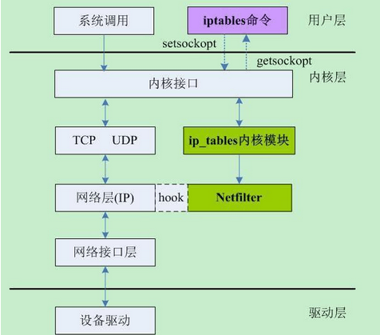
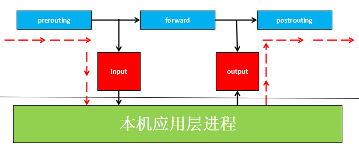
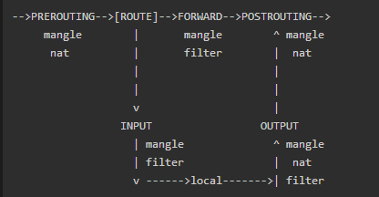
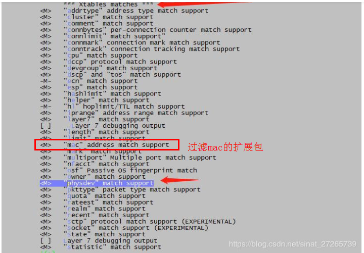
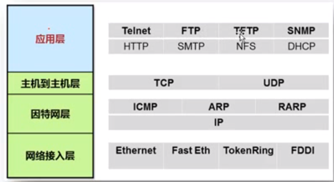
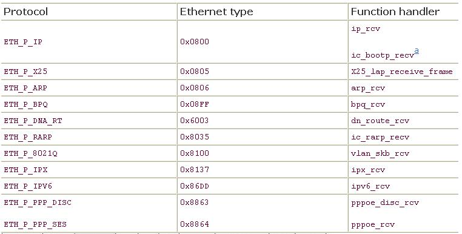
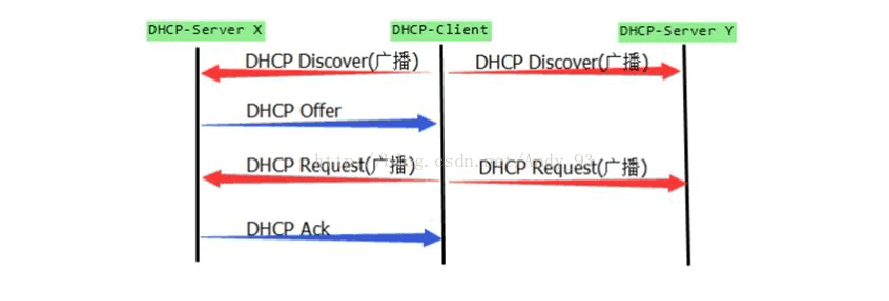

#### O1. iptables命令使用

##### 1.1 iptables/netfilter概述

```
介绍:
iptables/netfilter:ip信息包过滤系统，它实际由2个组件iptables和netfilter组成
iptables组件时一种工具，称为用户空间，它使插入、修改和除去信息包过滤表中的规则变得容易
netfilter组件称为内核空间，是内核的一部分，由一些信息包过滤表组成，这些表包含用来控制信息包过滤处理的规则集
iptables/netfilter后期简称为iptables，iptables是基于内核的防火墙，内置了filter、nat、mangle三张表，所有规则配置后，立即生效，不需要重启服务，用户一般的操作都是filter表

作用:
数据包过滤、树包处理、地址伪装、透明代理、动态网络地址转换、包速率限制等
```

##### 1.2 iptables/netfilter关系图:



##### 1.3 iptables/netfilter组成部分


```
iptable/netfilter中的3张表5条链(表中包含链)

3张表:
filter表:
	主要用于对数据包进行过滤，根据具体的规则决定是否放行该数据包(如DROP、ACCEPT、REJECT等)
nat表:
	主要用于修改数据包ip地址、端口号等信息(网络地址转换、如SNAT、DNAT、MASQUERADE、REDIRECT)
mangle表:
	主要用于修改数据包的TOS(Type of service服务类型)、TTL(time to live生存周期)以及为数据包设置Mark标记，以实现Qos(Quality of service服务质量)调整以及策略路由等
	
5条链:
PREROUTINF链:在对数据包做路由选择之前，应用此链中的规则，如DNAT
INPUT链:当接收到防火墙本机地址的数据包(入站)时，应用此链中的规则
FORWARD链:当接收到需要通过防火墙发送给其他地址的数据包(转发)时，应用此链中的规则
OUTPUT链:当防火墙本机向外发送数据包(出站)时，应用此链中的规则
POSTROUTING链:在对数据包作路由选择之后，应用此链中的规则，如SNAT

总结:整体数据包分为2类:发送给防火墙本身的数据包、需要经过防火墙的数据包
表间的优先关系:
	raw > mangle > nat > filter
	
链间的匹配顺序:
	入站数据:prerouting、input
	出站数据:output、postrouting
	转发数据:prerouting、forward、postrouting
	
链内的匹配顺序:
	自上向下按顺序依次进行检查，找到相匹配的规则即停止
	若该链内找不到相匹配的规则，则按该链的默认策略处理
```






##### 1.4 iptables命令使用

```
iptables命令的语法格式
iptables [-t 表名] 命令选项 [链名] [匹配条件] [-j 目标动作或跳转]

备注:
	1.不指定表名时，默认表示filter表
	2.不指定链名时，默认表示该表内所有链
	3.除非设置规则链的缺省策略，否则需要指定匹配条件
```


```
1.[-t 表名]：该规则所操作的哪个表，可以使用filter、nat等，如果没有指定则默认为filter
-A：新增一条规则，到该规则链列表的最后一行
-I：插入一条规则，原本该位置上的规则会往后顺序移动，没有指定编号则为1
-D：从规则链中删除一条规则，要么输入完整的规则，或者指定规则编号加以删除
-R：替换某条规则，规则替换不会改变顺序，而且必须指定编号。
-P：设置某条规则链的默认动作
-nL：-L、-n，查看当前运行的防火墙规则列表

2.chain名：指定规则表的哪个链，如INPUT、OUPUT、FORWARD、PREROUTING等
[规则编号]：插入、删除、替换规则时用，--line-numbers显示号码
[-i|o 网卡名称]：i是指定数据包从哪块网卡进入，o是指定数据包从哪块网卡输出
[-p 协议类型]：可以指定规则应用的协议，包含tcp、udp和icmp等
[-s 源IP地址]：源主机的IP地址或子网地址
[--sport 源端口号]：数据包的IP的源端口号
[-d目标IP地址]：目标主机的IP地址或子网地址
[--dport目标端口号]：数据包的IP的目标端口号

3.-m：extend matches，这个选项用于提供更多的匹配参数，如：
-m state --state ESTABLISHED,RELATED
-m tcp --dport 22
-m multiport --dports 80,8080
-m icmp --icmp-type 8

4.<-j 动作>：处理数据包的动作，包括ACCEPT、DROP、REJECT等
ACCEPT：允许数据包通过
DROP：直接丢弃数据包，不给任何回应信息
REJECT：拒绝数据包通过，必要时会给数据发送端一个响应的信息。

SNAT：源地址转换。在进入路由层面的route之后，出本地的网络栈之前，改写源地址，目标地址不变，并在本机建立NAT表项，当数据返回时，根据NAT表将目的地址数据改写为数据发送出去时候的源地址，并发送给主机。解决内网用户用同一个公网地址上网的问题。
MASQUERADE，是SNAT的一种特殊形式，适用于像adsl这种临时会变的ip上

DNAT:目标地址转换。和SNAT相反，IP包经过route之前，重新修改目标地址，源地址不变，在本机建立NAT表项，当数据返回时，根据NAT表将源地址修改为数据发送过来时的目标地址，并发给远程主机。可以隐藏后端服务器的真实地址。（感谢网友提出之前这个地方与SNAT写反了）
REDIRECT：是DNAT的一种特殊形式，将网络包转发到本地host上（不管IP头部指定的目标地址是啥），方便在本机做端口转发。

LOG：在/var/log/messages文件中记录日志信息，然后将数据包传递给下一条规则
```

```shell
#查看表中有哪些规则
iptables -t filter -vnxL //查看表中有哪些规则
#添加一条规则
iptables -t filter -A INPUT -j DROP 

#限制某个ip地址进入本机,进入本机的数据直接丢弃
iptables -t filter -A INPUT -s 192.168.188.87 -j DROP 

#显示某个mac地址进入本机,进入本机的数据直接丢弃
iptables -t filter -A INPUT -m mac --mac-source 80:a5:89:52:8a:c9 -j DROP 
iptables -t filter -A FORWARD -m mac --mac-source 80:a5:89:52:8a:c9 -j DROP

#根据序号删除
iptables -t filter -D INPUT 1
iptables -t filter -D FORWARD 1

#根据匹配条件删除
iptables -t filter -D INPUT -m mac --mac-source 80:a5:89:52:8a:c9 -j DROP
iptables -t filter -D FORWARD -m mac --mac-source 80:a5:89:52:8a:c9 -j DROP

#清空所有的链
iptables -t filter -F 

#示例：让连接wifi模块的设备可以进行上网设置
#查看
iptables  -t  nat  -vnxL
#开启wifi模块的转发功能
echo 1 > /proc/sys/net/ipv4/ip_forward
#动态源地址转换，将任意源地址的数据包进行地址伪装，转换成wlan0上的ip地址，wlan0为路由器外网网口
iptables -t nat -A POSTROUTING -o wlan0 -j MASQUERADE

###############################
#设备可以上网
iptables -t nat -A POSTROUTING -p tcp -o wlan0 -j SNAT --to 192.168.1.187(wlan0的ip)

#让外面可以直接访问设备
iptables -t nat -A PREROUTING -p tcp -d 192.168.1.187 --dport 80 -j DNAT --to-destination 192.168.2.1(设备ap的地址)
```

```c
参考文档:

//iptables原理详解
https://www.cnblogs.com/zllong/p/7236881.html
```

#### 2. iptables编译及使用问题

##### 2.1 在buildroot中选中iptables问题

```
#该iptables时不选中
 Symbol: BR2_PACKAGE_COLLECTD_IPTABLES [=n]                                                                                                         
   Type  : boolean                                                                                                                                 
   Prompt: iptables                                                                                                                                
     Location:                                                                                                                                     
       -> Target packages                                                                                                                          
         -> Miscellaneous                                                                                                                          
           -> collectd (BR2_PACKAGE_COLLECTD [=y])                                                                                                 
   (1)       -> read plugins                                                                                                                       
     Defined at package/collectd/Config.in:236                                                                                                     
     Depends on: BR2_PACKAGE_COLLECTD [=y]                                                                                                         
     Selects: BR2_PACKAGE_IPTABLES [=y]                                                                                                            
                                                                                                                                                   
#选中该iptables，可以根据Location处可以看出，属于网络软件包                                                                                                                                
   Symbol: BR2_PACKAGE_IPTABLES [=y]                                                                                                               
   Type  : boolean                                                                                                                                 
   Prompt: iptables                                                                                                                                
     Location:                                                                                                                                     
       -> Target packages                                                                                                                          
   (2)   -> Networking applications                                                                                                                
     Defined at package/iptables/Config.in:1                                                                                                       
     Selected by: BR2_PACKAGE_COLLECTD_IPTABLES [=n] && BR2_PACKAGE_COLLECTD [=y] || BR2_PACKAGE_CONNMAN [=n] && BR2_USE_WCHAR [=y] && BR2_TOOLC
     
#如果选错，则在使用iptables时报错
```

##### 2.2 在使用iptables时报错

```
报错信息:iptables: No chain/target/match by that name.
报错原因:iptables是应用层的程序,真正的实现是在内核层,因此需要内核层的支持,有些参数不可以使用原因是在内核中没有选择使用(一般都是一些扩展模块)

参考链接:

解决iptables参数-m physdev出现iptables: No chain/target/match by that name.错误
https://blog.csdn.net/sinat_27265739/article/details/104615387
```



#### 3. tcpdump编译及使用

##### 3.1 tcpdump编译

```
1.tcpdump和wireshark的关系
tcpdump是采用命令行方式对网络接口数据包进行筛选抓取，可以生成抓包文件，再用wireshark打开进行查看

2.tcpdump抓包位置
tcpdump工作在网络层，并非是从驱动层抓包。通过做实验(自己模拟一个网卡驱动):即使驱动程序没有真正发送，当发送udp广播时，使用tcpdump命令一样可以抓取到广播包

3.tcpdump交叉编译
tcpdump是基于libcap.so的，因此在编译tcpdmp前线要编译libcap.so
交叉编译的3个步骤:1.设置(configure-安装位置，交叉工具链) 2.编译(make) 3.安装(make install)

(1)先导出交叉编译的环境变量
export PATH=/opt/linaro-14.04/gcc-linaro-arm-linux-gnueabihf-4.8/bin/:$PATH
export CC=arm-linux-gnueabihf-gcc

(2)交叉编译libpcap
tar zxvf libpcap-1.8.1.tar.gz
cd libpcap-1.8.1/
#--prefix:设置安装位置 
./configure --prefix=$PWD/install --host=arm-linux-gnueabihf
make
make install

(3)交叉编译tcpdump
tar zxvf tcpdump-4.9.2.tar.gz
cd tcpdump-4.9.2/
./configure --host=arm-linux-gnueabihf
make

#此处的make install就省略了，可以将编译出的tcpdump直接拖入到开发板中

参考链接:
从github中下载tcpdump、libpcap的源码进行编译(里面有tcpdump和libpcap的源码):
https://github.com/the-tcpdump-group
		
交叉编译tcpdump
https://blog.csdn.net/onlyshi/article/details/81081707

4.交叉编译时参数选项:build、host和target
build:编译软件所使用的平台
host:该软件将运行的平台
target：该软件所处理的目标平台

一般在进行交叉编译时只需要设置host参数，target一般都是在编译交叉工具链时才设置，build一般都是x86
```

##### 3.2 tcpdump命令使用

```shell
tcpdump -i eth0 tcp port 5000

-i:指定网卡
tcp:指定协议
port:指定端口

tcpdump命令的使用
https://www.cnblogs.com/ct20150811/p/9431976.html
```

##### 3.3 tcpdump与iptables抓包顺序关系

```
tcpdump抓包比iptables抓包更加更加靠近底层数据，因此如果是添加入栈规则则可以抓取到包(由于tcpdump更加靠近底层，因此数据流先经过tcpdump在经过iptables)，如果添加的出栈规则则抓取不到(数据流先经过iptables后经过tcpdump)

进来的顺序 Wire -> NIC -> tcpdump -> netfilter/iptables
出去的顺序 iptables -> tcpdump -> NIC -> Wire

NIC:网络控制器
```

##### 3.4 tcpdump抓包与底层网卡驱动的关系

```
tcpdump抓包抓取的是网络层的数据，即使驱动程序没有真正发送，当发送udp广播时，使用tcpdump命令一样可以抓取到广播包,可以使用tcpdump判断网卡驱动程序的好坏
```

#### 4. wireshark常用命令

```
//wireshark抓包数据在note\img\嵌入式linux下
tcp过滤条件:
ip.addr == 192.168.18.202 && tcp && tcp.port == 8000

ucp过滤条件
ip.addr == 192.168.18.202 && udp

首先说几个最常用的关键字，“eq” 和 “==”等同，可以使用 “and” 表示并且，“or”表示或者。“!" 和 "not” 都表示取反。

一、针对wireshark最常用的自然是针对IP地址的过滤。其中有几种情况：
	（1）对源地址为192.168.0.1的包的过滤，即抓取源地址满足要求的包。
	表达式为：ip.src == 192.168.0.1
	（2）对目的地址为192.168.0.1的包的过滤，即抓取目的地址满足要求的包。
	表达式为：ip.dst == 192.168.0.1
	（3）对源或者目的地址为192.168.0.1的包的过滤，即抓取满足源或者目的地址的ip地址是192.168.0.1的包。
	表达式为：ip.addr == 192.168.0.1,或者 ip.src == 192.168.0.1 or ip.dst == 192.168.0.1
	（4）要排除以上的数据包，我们只需要将其用括号囊括，然后使用 "!" 即可。
表达式为：!(表达式)

二、针对协议的过滤
	（1）仅仅需要捕获某种协议的数据包，表达式很简单仅仅需要把协议的名字输入即可。
	表达式为：http
	（2）需要捕获多种协议的数据包，也只需对协议进行逻辑组合即可。
	表达式为：http or telnet （多种协议加上逻辑符号的组合即可）
	（3）排除某种协议的数据包
	表达式为：not arp      !tcp

三、针对端口的过滤（视协议而定）
	（1）捕获某一端口的数据包
	表达式为：tcp.port == 80
	（2）捕获多端口的数据包，可以使用and来连接，下面是捕获高端口的表达式
	表达式为：udp.port >= 2048

四、针对长度和内容的过滤
	（1）针对长度的过虑（这里的长度指定的是数据段的长度）
	表达式为：udp.length < 30   http.content_length <=20
	（2）针对数据包内容的过滤
	表达式为：http.request.uri matches "vipscu"  （匹配http请求中含有vipscu字段的请求信息）

备注:
	网卡底层最终数据发送的为ascii码(ascii码有二进制、十进制、十六进制的表达形式,将应用层的字符最终转换成ascii码的形式-如果应用层数据为字符形式),
参考链接
https://www.cnblogs.com/softidea/p/10446388.html
```

#### 5. linux路由器的知识

##### 5.1 路由表的查看及含义

```shell
通过rout命令查看 Linux 内核的路由表：
[root@VM_139_74_centos ~]# route
Kernel IP routing table
Destination     Gateway         Genmask         Flags Metric Ref    Use Iface
default         gateway         0.0.0.0         UG    0      0        0 eth0
10.0.0.10       10.139.128.1    255.255.255.255 UGH   0      0        0 eth0
10.139.128.0    0.0.0.0         255.255.224.0   U     0      0        0 eth0
link-local      0.0.0.0         255.255.0.0     U     1002   0        0 eth0

[root@VM_139_74_centos ~]# route -n
Kernel IP routing table
Destination     Gateway         Genmask         Flags Metric Ref    Use Iface
0.0.0.0         10.139.128.1    0.0.0.0         UG    0      0        0 eth0
10.0.0.10       10.139.128.1    255.255.255.255 UGH   0      0        0 eth0
10.139.128.0    0.0.0.0         255.255.224.0   U     0      0        0 eth0

-n:不显示名称,直接显示ip地址

#各列含义:
Destination	目标网络或目标主机。Destination 为 default（0.0.0.0）时，表示这个是默认网关，所有数据都发到这个网关（这里是 10.139.128.1）
Gateway	网关地址，0.0.0.0 表示当前记录对应的 Destination 跟本机在同一个网段，通信时不需要经过网关
Genmask	Destination 字段的网络掩码，Destination 是主机时需要设置为 255.255.255.255，是默认路由时会设置为 0.0.0.0
Flags	标记，含义参考表格后面的解释
Metric	路由距离，到达指定网络所需的中转数，是大型局域网和广域网设置所必需的 （不在Linux内核中使用。）
Ref	路由项引用次数 （不在Linux内核中使用。）
Use	此路由项被路由软件查找的次数
Iface	网卡名字，例如 eth0

总结:一条消息目的去往哪里(Destination),会从哪个接口出去(Iface),在中途首先要把消息传递给谁(Gateway)
Destination：default（0.0.0.0）时，表示这个是默认路由表，匹配所有的字段，只要其他的都不匹配，都使用该条路由记录
Gateway：0.0.0.0 或者 * ，表示当前记录对应的 Destination 跟本机在同一个网段，通信时不需要经过网关

参考链接:
#Linux 路由表详解及 route 命令详解
	https://blog.csdn.net/kikajack/article/details/80457841?utm_medium=distribute.pc_relevant.none-task-blog-BlogCommendFromMachineLearnPai2-3.channel_param&depth_1-utm_source=distribute.pc_relevant.none-task-blog-BlogCommendFromMachineLearnPai2-3.channel_param
	
示例:
route
        Kernel IP routing table
        Destination     Gateway         Genmask         Flags Metric Ref    Use Iface
        192.168.10.0    *               255.255.255.0   U     0      0        0 eth0
        192.168.56.0    *               255.255.255.0   U     0      0        0 eth1
        127.0.0.0       *               255.0.0.0       U     0      0        0 lo
        default         192.168.10.1    0.0.0.0         UG    0      0        0 eth0

这台主机有两个网络接口，一个网络接口连到192.168.10.0/24网络，另一个网络 接口连到192.168.56.0/24网络。路由表的 Destination是目的网络地址，Genmask是子网掩码，Gateway是下一跳地址，Iface是发送接口，Flags中的U标志表示此条目有效（可以禁用某些条目），G标志表示此条目的下一跳地址是某个路由器的地址，没有G标志的条目表示目的网络地址是与本机 接口直接相连的网络，不必经路由 器转发，因此下一跳地址处记为*号。
如果要发送的数据包的目的地址是192.168.56.3，跟第一行的子网掩码做与运算得到 192.168.56.0，与第一行的目的网络地址不符，再跟第二行的子网掩码做与运算得到192.168.56.0，正是第二行的目的网络地址，因此从 eth1接口发送出去，由于192.168.56.0/24正是与eth1接口直接相连的网络，因此可以直接发到目的主机，不需要经路由器转发。
如果要发送的数据包的目的地址是202.10.1.2，跟前三行路由表条目都不匹配，那么就要按缺省路由条目，从eth0接口发出去，首先发往192.168.10.1路由器，再让路由器根据它的路由表决定下一跳地址。

#linux路由表的查看和含义
https://blog.csdn.net/hzj_001/article/details/81587891
```

##### 5.2 操作路由表的命令

```shell
设置和查看路由表都可以用 route 命令，设置内核路由表的命令格式是：
# route  [add|del] [-net|-host] target [netmask Nm] [gw Gw] [[dev] If]
其中：
add : 添加一条路由规则                         del : 删除一条路由规则
-net : 目的地址是一个网络                   -host : 目的地址是一个主机
target : 目的网络或主机                       netmask : 目的地址的网络掩码
gw : 路由数据包通过的网关                   dev : 为路由指定的网络接口

3种路由类型:
(1)主机路由 (2)网络路由 (3)默认路由
#添加主机路由
route add -host 192.168.110.1 netmask 255.255.255.0 wlan0
#删除主机路由
route del -host 192.168.110.1 netmask 255.255.255.0

#添加网络
#不带网关
route add -net 192.168.110.0 netmask 255.255.255.0 wlan0
route del -net 192.168.110.0 netmask 255.255.255.0
#带网关
route add -net 192.168.110.0 netmask 255.255.255.0 gw 192.168.1.1 wlan0
route del -net 192.168.110.0 netmask 255.255.255.0 gw 192.168.1.1

#添加默认网关
route add default gw 192.168.1.1
#删除默认网关
route del default gw 192.168.1.1

参考链接:
https://blog.csdn.net/hzj_001/article/details/81587891
https://www.cnblogs.com/jmilkfan-fanguiju/p/10589729.html
```

##### 5.3 路由器的基本工作原理

```
参考链接:
https://blog.csdn.net/chengu04/article/details/106129327
```

##### 5.4 交换机与路由器的区别

```
结论:
交换机属于二层设备，工作在数据链路层,转发数据通过内部的地址表
路由器属于三层设备，工作哎网络层，转发数据通过内部的路由表

二层设备是工作在数据链路层的设备，二层交换机可以识别数据包中的mac地址信息，根据mac地址进行转发，并将这些mac地址与对应的端口记录在自己内部的一个地址表中，具体工作流程如下:
1.当交换机从某个端口收到一个数据包，他先读取包头中的源mac地址，这样他就知道源mac地址的机器连接在哪个端口上
2.再去读取包头中的目的mac地址，并在地址表中查找相应的端口
3.如果表中有与这目的mac地址对应的端口，把数据包直接复制到这端口上
4.如果表中找不到相应的端口则把数据包广播到所有端口上，当目的机器对源机器回应时，交换机又可以学习一目的mac地址与哪个端口对应，在下次传输时就不需要对所有端口进行广播了

总结:不断循环以上过程，对于全网的mac地址信息DOI可以学习到，二层交换机就是这样建立和维护自己的地址表，交换机没有ip的概念

三层设备是工作在网络层的设备，路由器是最常用的三层设备，利用不同网络的ID号(即ip地址)来确定树转发的地址

参考链接：
https://www.cnblogs.com/Anker/p/4034087.html
```


#### 6. linux网络协议

##### 6.1 各网络协议之间的关系及作用



```
传输层只有2个协议:tcp、udp协议，通过协议里面的端口号区别应用层的各种协议
网络层:ip协议、ARP协议、RARP协议属于并列关系，通过物理层的协议号进行区分,ICMP协议是基于ip协议
	ip协议:ip协议中有一个协议号用于区分是tcp、udp还是icmp协议
	ARP协议:地址解析协议，根据ip地址获取物理地址
	ICMP协议:反向地址转换协议，根据物理地址获取ip地址

参考链接:
	TCP/IP 协议簇（各个常见协议介绍）
	https://www.cnblogs.com/zoe233/p/11823882.html
```

##### 6.2 在linux内核中网络层各个协议id

​	通过下面可以看到各个网络层协议id，源码位置include/linux/if_eher.h



```
参考文档:
https://www.cnblogs.com/hustcat/archive/2009/09/26/1574411.html
```

##### 6.3 APR协议工作原理

```shell
在网络通信时,源主机的应用程序知道目的地址的ip地址和端口号，却不知道目的主机的硬件地址，而数据包首先是被网卡接收到再去处理上层协议的，如果接收到的数据包的硬件地址与本机不符时则直接丢弃，因此在通讯前必须获得主机的硬件地址，APR协议就是起到该作用
源主机发出ARP请求,询问“IP地址是192.168.0.1的主机的硬件地址是多少”,并将这个请求 广播到本地网段(以太网帧首部的硬件地址填FF:FF:FF:FF:FF:FF表示广播),目的主机接收到 广播的ARP请求,发现其中的IP地址与本机相符,则发送一个ARP应答数据包给源主机,将自己的硬件地址填写在应答包中

#关键点:发送广播，硬件地址FF:FF:FF:FF:FF:FF(由于不知道目的主机的ip地址，因此填充mac地址为全FF)

查看arp缓存表方式:
cat /proc/net/arp
arp -a

zhaokun@linux:files$ cat /proc/net/arp 
IP address       HW type     Flags       HW address            Mask     Device
192.168.1.1      0x1         0x2         18:69:da:9f:d0:18     *        eth0
192.168.2.1      0x1         0x0         cc:81:da:36:c7:79     *        eth0

每台主机都维护一个ARP缓存表,可以用arp -a命令查看。缓存表中的表项有过期时间(一 般为20分钟),如果20分钟内没有再次使用某个表项,则该表项失效,下次还要发ARP请求来获得目的主机的硬件地址

参考链接:
#Linux之ARP协议
https://blog.csdn.net/qq_36221862/article/details/73141108

#抓取arp包
https://blog.csdn.net/u011416247/article/details/80866725
```

##### 6.4 ping命令和ICMP协议之间的关系

```
ping命令是一个应用程序
ICMP是一个协议

ping命令是基于ICMP协议的，就是互联网控制报文协议，网络包在异常复杂的网络环境进行传输的时候，常常会遇到各种各样的问题，当遇到问题的时候，总要传出消息来，报告情况，这样才能调整传输策略，icmp就是这样的协议

参考链接:
https://www.cnblogs.com/ssh-html/p/10436168.html
```

##### 6.5 dhcp协议

```shell
DHCP:动态主机配置协议，它可以为客户机自动分配ip地址、子网掩码以及缺省网关、DNS服务器的ip地址等

dhcp协议流程:
dhcp discover：寻找服务器 -->
dhcp offer：分配ip地址 -->
dhcp request：请求使用 -->
dhcp ack：ip地址分配确认

参考链接:
#dhcp协议分析及抓包分析，抓包文件dhcp.cap
https://blog.csdn.net/andy_93/article/details/78238931
https://www.cnblogs.com/sbchen/p/10177599.html
```



#### 7. 网络相关命令

```shell
#启用所有网卡
ifup -a
#关闭所有网卡
ifdown -a
#只能显示已经启用的网卡,没有分配ip的网卡是没有启用的
ifconfig 
#显示所有网关，包括已经启用的和没有启用的
ifconfig -a 
#设置一个网口的ip，并且启用
ifconfig wlan0 192.168.1.1 
#关闭指定的网卡
ifconfig wlan0 down 
```

#### 8. wpa_supplicant工具

```shell
简介:
	wpa_supplicant是wifi客户端加密认证工具,wpa_supplicant运行于后台,他需要借助控制台工具wpa_cli来进行手动在操作
	
作用:
	通过该工具，连接wifi

使用:
	有两种方式:
		1.手动配置连接wifi-->主要用于手动测试使用
		2.自动连接wifi:将wifi信息，写到配置文件中，以此自动连接wifi-->实际场景中运用
手动连接wifi(使用wpa_cli命令):
    #wpa_cli命令的运行依赖于wpa_supplicant运行，因此需要先运行wpa_supplicant程序

    第1步:启动wpa_supplicant程序(指定驱动、指定网卡、指定配置文件)
    #wpa_supplicant -D nl80211 -i wlan0 -c./wpa_supplicant.conf -d & //加上调试信息
    wpa_supplicant -D nl80211 -i wlan0 -c./wpa_supplicant.conf & //不加调试信息

    #wpa_supplicant.simple配置文件内容，里面没有网络的配置信息
    cat /etc/wpa_supplicant/wpa_supplicant.conf
    ctrl_interface=/var/run/wpa_supplicant
    update_config=1

    第2步:扫描wifi信号
    wpa_cli scan

    第3步:查看扫描结果
    wpa_cli scan_result

    Selected interface 'wlan0'
    wlan0: Control interface command 'SCAN_RESULTS'
    bssid / frequency / signal level / flags / ssid
    d4:ee:07:6b:6f:32	2427	-55	[WPA-PSK-CCMP][WPA2-PSK-CCMP][ESS]	Ziroom_6B6F32
    d6:ee:07:6b:6f:31	2427	-57	[WPA-PSK-CCMP][WPA2-PSK-CCMP][ESS]	
    ac:a3:1e:28:b6:c5	2437	-84	[WPA2-EAP-CCMP][ESS]	ke.com
    ac:a3:1e:28:b6:c0	2437	-85	[WPA2-PSK-CCMP][ESS]	Ziroom-guest
    88:25:93:f2:88:66	2437	-98	[WPA-PSK-CCMP][WPA2-PSK-CCMP][ESS]	Ziroom-kuaidi
    ac:a3:1e:28:b6:c3	2437	-80	[ESS]	@Lianjia-LinShi
    ac:a3:1e:28:b6:c4	2437	-85	[ESS]	Ziroom
    ac:a3:1e:28:b6:81	2412	-87	[ESS]	Ziroom

    第4步:添加网络
    wpa_cli add_network 

    第5步:设置网络
    wpa_cli set_network 0 ssid '"ZHOME_FC84"'
    wpa_cli set_network 0 psk '"87654321"' #有密码设置
    wpa_cli set_network 1 key_mgmt '"NONE"' #无密码设置

    第6步:使能网络
    wpa_cli enable_network 0

    第7步:查看连接状态
    wpa_cli status

    Selected interface 'wlan0'
    EAPOL: EAP Session-Id not available
    bssid=d4:ee:07:6b:6f:32
    freq=2427
    ssid=ZHOME_FC84
    id=0
    mode=station
    pairwise_cipher=CCMP
    group_cipher=CCMP
    key_mgmt=WPA2-PSK
    wpa_state=COMPLETED #COMPLETED表示连接成功
 
 使用配置文件-自动连接
#有密码配置文件
cat /etc/wpa_supplicant/wpa_supplicant.conf

ctrl_interface=/var/run/wpa_supplicant
update_config=1

network={
ssid="ZHOME_7218"
scan_ssid=1
key_mgmt=WPA-PSK
psk="12345678ab"
priority=1
}

#无密码配置文件
cat /etc/wpa_supplicant/wpa_supplicant.conf

ctrl_interface=/var/run/wpa_supplicant
update_config=1

network={
ssid="ZHOME_7218"
scan_ssid=1
key_mgmt=NONE
priority=1
}
#运行wpa_supplicant命令
wpa_supplicant -D nl80211 -i wlan0 -c./wpa_supplicant.conf &

其他一些wpa_cli命令:

#当使用自动连接功能时，当修改文件后，需要重新加载配置文件
wpa_cli reconfigure

#杀死wpa_supplicant服务
wpa_cli terminate

#断开wifi,如果用udhcpc分配了ip，即使断开了，ip地址还会存在，只是再也ping不通了
wpa_cli disconnect

#重新连接wifi，与wpa_cli reconfigure是有所区别的，reconnect在没有修改配置文件下使用，reconfigure是在修改了配置文件下使用
wpa_cli reconnect

注意问题:

(1)问题1:配置使用多个ap,优先级使用字段priority，数字越大表示优先级越高,当高优先的ap连接不上时，会连接低优先级别的
wpa_supplicant.conf文件内容如下:

ctrl_interface=/var/run/wpa_supplicant
update_config=1

network={
ssid="ZHOME_7218"
scan_ssid=1
key_mgmt=WPA-PSK
psk="12345678ab"
priority=1
}

network={
ssid="ZHOME_FC84"
scan_ssid=1
key_mgmt=WPA-PSK
psk="876543210"
priority=2
}

(2)问题2:当有两个ssid和密码相同的，可以指定bssid-指定上级路由的mac地址
ctrl_interface=/var/run/wpa_supplicant
update_config=1
network={
ssid="ZHOME_FC84"
bssid=4c:e1:73:02:fc:85
scan_ssid=1
key_mgmt=WPA-PSK
psk="87654321"
priority=2
}

(3)问题3:字段scan_ssid作用
scan_ssid=1 ：这个很容易错过，如果你的无线接入点是隐藏的，那么这个就是必须的

参考链接:
#命令基本使用
https://www.cnblogs.com/lidabo/p/5062204.html
#各项命令的使用
https://www.cnblogs.com/lidabo/p/4660213.html
#有无密码参考设置
https://blog.csdn.net/weixin_37193849/article/details/53911579?utm_source=blogxgwz1
```

#### 9. udhcpc工具

```shell
udhcpc是dhcp的客户端，用于客户端获取ip地址使用

将上述的wpa_supplicant与udhcpc进行区别，wpa_supplicant是用于wifi连接的工具，udhcpc用于客户端向dhcp服务器获取ip地址。wifi连接与分配ip是两个流程

实际场景运行执行命令:
udhcpc -b -i eth0 -p /var/run/udhcpc.pid -R
-b就是切换到后台指令，-i是指定使用哪个网络接口,-R在关闭udhcpc时，可以向dhcpserver发送release取消租约

udhcpc --help
BusyBox v1.25.1 (2020-08-27 18:20:36 CST) multi-call binary.

Usage: udhcpc [-fbqRB] [-a[MSEC]] [-t N] [-T SEC] [-A SEC/-n]
        [-i IFACE] [-s PROG] [-p PIDFILE]
        [-oC] [-r IP] [-V VENDOR] [-F NAME] [-x OPT:VAL]... [-O OPT]...

        -i,--interface IFACE    Interface to use (default eth0)
        -s,--script PROG        Run PROG at DHCP events (default /usr/share/udhcpc/default.script)
        -p,--pidfile FILE       Create pidfile
        -B,--broadcast          Request broadcast replies
        -t,--retries N          Send up to N discover packets (default 3)
        -T,--timeout SEC        Pause between packets (default 3)
        -A,--tryagain SEC       Wait if lease is not obtained (default 20)
        -n,--now                Exit if lease is not obtained
        -q,--quit               Exit after obtaining lease
        -R,--release            Release IP on exit
        -f,--foreground         Run in foreground
        -b,--background         Background if lease is not obtained
        -S,--syslog             Log to syslog too
        -a[MSEC],--arping[=MSEC] Validate offered address with ARP ping
        -r,--request IP         Request this IP address
        -o,--no-default-options Don't request any options (unless -O is given)
        -O,--request-option OPT Request option OPT from server (cumulative)
        -x OPT:VAL              Include option OPT in sent packets (cumulative)
                                Examples of string, numeric, and hex byte opts:
                                -x hostname:bbox - option 12
                                -x lease:3600 - option 51 (lease time)
                                -x 0x3d:0100BEEFC0FFEE - option 61 (client id)
        -F,--fqdn NAME          Ask server to update DNS mapping for NAME
        -V,--vendorclass VENDOR Vendor identifier (default 'udhcp VERSION')
        -C,--clientid-none      Don't send MAC as client identifier
Signals:
        USR1    Renew lease //重新获取ip地址
        USR2    Release lease //释放ip地址
 
 注意问题:
 (1)当上级路由器ip发生变化时，需要释放和重新获取ip地址
 使用:
 	 kill -USR2 pid
	 kill -USR1 pid
 (2)/tmp/resolv.conf文件
 该文件存储的是dns服务器的地址(当删除该文件时解析域名会错误)，是在运行udhcpc -i wlan0命令获取ip地址时自动生成的，当获取ip地址，dhcp服务器会返回dns的ip地址
 
 (3)udhcpc服务运行起来后会挂到后台一直运行,多长时间请求一次，可以使用-T执行，发生多少次使用-t执行
 
 参考链接:
 https://www.cnblogs.com/helloworldtoyou/p/5516337.html
 https://www.cnblogs.com/lidabo/p/5076560.html
 https://zhidao.baidu.com/question/507161366.html
```

#### 10. hostapd工具

```shell
hostapd是用户态的守护进程，用于无线station接入和 安全认证，hostapd_cli是用于访问hostapd并且获取当前ap信息呵呵对ap进行操作的客户端程序。作用就是发生wifi，供客户端进行连接

#守护进程运行程序
hostapd ./hostapd.conf &

#hostapd.conf配置文件如下:

#有密码配置文件
interface=wlan1                                                                                                                          
ctrl_interface=/var/run/hostapd
ssid=ZIROOM_WPA
wpa_passphrase=12345678ab
ignore_broadcast_ssid=0
channel=1
auth_algs=1
hw_mode=g
ieee80211n=1
wpa=3
wpa_key_mgmt=WPA-PSK
wpa_pairwise=TKIP CCMP

#无密码配置文件
interface=wlan1                                                                                                                          
ctrl_interface=/var/run/hostapd
ignore_broadcast_ssid=0
ssid=ZIROOM_OPEN
channel=1
hw_mode=g
ieee80211n=1

hostapd_cli常用命令
#获取连接到wlan1网卡的所有wifi设备
hostapd_cli -i wlan1 all_sta

#获取该网卡的配置信息
hostapd_cli -i wlan1 get_config

参考文档:
#hostapd cli用法
https://blog.csdn.net/vickytong1018/article/details/79746340

```

#### 11. dhsmasq工具

```shell
Dnsmasq 提供DNS缓存和DHCP服务功能。作为域名解析服务器(DNS)，dnsmasq可以通过缓存DNS请求来提高对访问过的网址的连接速度。

hostapd与dnsmasq两个不同的应用程序，hostapd用于发生wifi。dnsmasq用于分配ip地址和提供dns服务。二者需要进行配合使用

#运行命令
/usr/sbin/dnsmasq -C /etc/dnsmasq.conf

dnsmasq.conf文件内容如下:
#指定dns服务文件
resolv-file=/etc/resolv.dnsmasq.conf                                                     #指定域名文件                                                
addn-hosts=/etc/hosts
#指定网卡接口
interface=wlan1
#指定分配的ip地址范围，及租赁时间
dhcp-range=192.168.188.50,192.168.188.150,48h
#指定本地ip地址
dhcp-option=3,192.168.188.1
#dns服务器文件
cat resolv.dnsmasq.conf 
nameserver 114.114.114.114
#域名文件
cat hosts 
127.0.0.1	localhost
192.168.188.1   link.zihome.com
127.0.1.1	buildroot

注意点:
(1)先设置网卡(wlan1)的ip地址，然后dnsmasp才能给客户端分配ip地址
```

#### 12. dropbear工具

```shell
dropbear：嵌入式ssh登录工具
#运行命令:
/usr/sbin/dropbear -R -p 1022
-p：指定运行的端口号

注意点:
(1)每登录一个ssh客户端，就会产生一个dropbear进程，父进程是最初的dropbear的进程

  917 root     /usr/sbin/dropbear -R -p 1022 //父进程，当父进程死掉后，下面的子进程的父进程为1，如果再连接ssh是连接不上的
 1012 root     /usr/sbin/dropbear -R -p 1022 //子进程
 
 [root@zihome /proc/1012]# cat status 
	Name:   dropbear
	Pid:    1012
	PPid:   917
```

#### 13. ntpd工具

```shell
ntpd是一个获取网络时间的守护进程，会自动同步网络时间，会默认读取/etc/ntp.conf这个文件
运行命令:ntpd
/etc/ntp.conf：这个是NTP daemon的配置文件,内容如下:
server 0.cn.pool.ntp.org iburst                                                                                                          
server 1.cn.pool.ntp.org iburst
server 2.cn.pool.ntp.org iburst
server 3.cn.pool.ntp.org iburst

# Allow only time queries, at a limited rate, sending KoD when in excess.
# Allow all local queries (IPv4, IPv6)
restrict default nomodify nopeer noquery limited kod 
restrict 127.0.0.1
restrict [::1]

注意点:
(1)ntpdate与ntpd之间的区别
#手动更新时间
ntpdate ntp.ntsc.ac.cn
(2)ntpd、ntpdate ntp.ntsc.ac.cn不能同时使用
(3)实际场景有3个时间，硬件时间、系统时间、网络时间
一.Linux系统时间的设置
在Linux中设置系统时间，可以用date命令：
#查看时间
[root@localhost ~]# date
2008年 12月 12日星期五 14:44:12 CST
#修改时间
[root@localhost ~]# date -set  "2013-12-24 00:01" <== （年/月/日 时:分【:秒】）
2009年 01月 01日星期四 00:01:00 CST

 二.Linux硬件时间的设置
硬件时间的设置，可以用hwclock或者clock命令。其中，clock和hwclock用法相近，只用一个就行，只不过clock命令除了支持x86硬件体系外，还支持Alpha硬件体系。

#查看硬件时间可以是用hwclock，hwclock --show 或者hwclock -r
[root@localhost ~]# hwclock --show
2008年12月12日星期五 06时52分07秒  -0.376932 seconds

#设置硬件时间
[root@localhost ~]# hwclock --set --date="1/25/09 00:00" <== 月/日/年时:分:秒
[root@localhost ~]# hwclock
2009年01月25日星期日 00时00分06秒  -0.870868 seconds

[root@localhost ~]# hwclock  -w   根据系统时间设置硬件时间

三.系统时间和硬件时间的同步
同步系统时间和硬件时间，可以使用hwclock命令。

#以系统时间为基准，修改硬件时间

[root@localhost ~]# hwclock --systohc<== sys（系统时间）to（写到）hc（Hard Clock）
[root@localhost ~]# hwclock -w

#以硬件时间为基准，修改系统时间
[root@localhost ~]# hwclock --hctosys
[root@localhost ~]# hwclock -s

参考文档:
#linux时间同步，ntpd、ntpdate
https://www.cnblogs.com/liushui-sky/p/9203657.html
```


