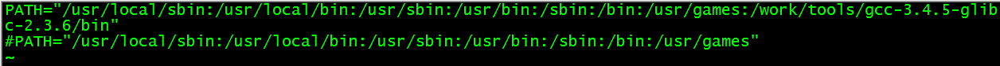

### 嵌入式linux环境搭建

#### 1. 搭建嵌入式linux开发环境主要工作

##### 1.1 准备开发主机(一般指PC机)、目标机（一般指开发板）以及二者的连接介质

> 开发主机与目标主机的连接方式有以下几种:
> (1)串口通信:UART异步串行通信接口 - 速率低(适用于小数据量的传输,一般都是115200bps),实用性强
> (2)usb通信:USB串行通信接口 - 驱动移植要修改,速度快(适用于大数据量的传输)
> (3)网络通信:TCP/IP网络通信接口 - 驱动移植要修改,速度快(10/100Mbps)
> (4)Debug jtag调试接口 - 价格高,方便快捷


##### 1.2 准备目标机源代码

> (1)bootloader代码
>
> (2)kernel代码
>
> (3)rootfs代码
>
> (4)安装交叉工具链

##### 1.3 为什么需要交叉编译？

原因:由于主机和目标机不同而造成的,编译时在宿主机上，而真正运行是在目标机上

| 开发主机 | 目标机 |                             备注                             |
| :------: | :----: | :----------------------------------------------------------: |
|   x86    |  x86   |           由于开发主机与目标机相同，不需要交叉编译           |
|   x86    |  arm   | 由于开发主机与目标机不相同，需要交叉编译交叉编译工具链的来源 |

##### 1.4 交叉工具链的来源及命名规范

###### 1.4.1 工具链来源:

交叉编译工具链一般是工作在X86平台下(因此需要x86平台的一些库文件),然后编译出其他平台所需要文件(不能在x86平台工作)的工具

- 芯片厂商提高交叉工具链(在实际应用中最为常见,芯片厂商已经编译好了工具链)

- 用户自己编译交叉工具链(实际应用中基本不会用到,一般不推荐自己制作,调试会很麻烦)

###### 1.4.2 工具链命名规范

规范:arch [-vendor] [-os] [-(gnu)eabi]

> 常见命名:
>
> arm-none-linux-gnueabi-
>
> arm-linux-   备注:对上面的简写,一般用软连接链接到上面
>
> arm-none-eabi-  备注:没有系统平台,代表不支持操作系统
>
> arm-elf-  备注:很老的编译,没有系统平台,代表不支持操作系统

- arch:体系架构,如arm、mips、x86，表示交叉编译器用于哪个目标系统架构中即此交叉编译器编译出来的程序是运行在哪种cpu上面的


- vendor:工具链提供商,即谁制作出来这个交叉编译器的。vendor的值自己可以随便编写，通用的做法是把vendor写成体系架构的值或者cpu厂家的名字或者开发板的名字


- os:目标操作系统,可选,如果没有os表示不支持操作系统,有表示所支持的操作系统，即用此交叉编译器编译出来的程序，所运行的目标系统。对应的环境或系统主要有以下两种:

​       a-linux:表示目标系统时linux

​       b-无:无操作系统

- system:system直译为系统,表示所选择的库函数，常见的值有gnu、gnueabi、uclibcgnueabi等等

​       gnu == gnu libc == glibc,表示用的是glibc库,如果没有一般表示使用libc库

​       eabi:嵌入式引用二进制接口,如果没有表示使用的是早期的oabi

- 开发实际情况,没有ventor标志

  

#### 2. 交叉编译工具链的安装及使用

##### 2.1 安装

解压交叉编译工具链到某个目录下,使用方法有两种方式相对路径使用方式和绝对路径使用方式:
(1)相对路径使用,直接使用命令,例如arm-linux-gcc ...
相对路径一般情况下是要导出环境变量,导出环境变量即设置linux下的PATH变量,以下有两种方式设置环境变量
		a.只在当前shell中导出,只在当前shell中有效

​		export PATH=$PATH:路径  备注:中间用:号隔开	

```shell
#export是导出的含义 export key=value
export PATH=$PATH:/work/tools/gcc-3.4.5-glibc-2.3.6/bin
```

​    b.在当前用户下导出
​		b.1编辑/etc/environment,修改PATH(不用导出),修改完成后source /etc/environment



​		b.2编辑.bashrc在该处要导出环境变量-仅对当前用户生效

```SHELL
export PATH=$PATH:/work/tools/gcc-3.4.5-glibc-2.3.6/bin
source .bashrc
```

​		b.3编辑/etc/profile,修改PATH-对所有用户生效

```SHELL
PATH=$PATH:/work/tools/gcc-3.4.5-glibc-2.3.6/bin
source /etc/profile
```

(2)绝对路径

```shell
/work/tools/gcc-3.4.5-glibc-2.3.6/bin/arm-linux-gcc
```

#### 3. 开发主机安装软件(编辑软件、终端软件、各种服务-tftp\\nfs等服务)

##### 3.1 TFTP服务

(1)作用:

提供对目标机的主要工作映像文件的下载工作

(2)使用条件:

- 需要网络连接

- 主机端需要安装tftp服务器软件

  - 目标机需要安装tftp客户端

  优点:

  - 传输速度快,可以将编好的内核下载到目标机,提高开发效率,tftp是用来下载远程文件的最简单网络协议,基于udp协议而实现,嵌入式linux的tftp开发环境包括两个方面,一是linux开发主机端的tftp-server支持，二是嵌入式目标机tftp-clinet支持

  TFTP服务器配置:

  ```shell
  #一、安装软件
  #安装客户端
  sudo apt-get install tftp-hpa
  #安装服务端
  sudo apt-get install tftpd-hpa
  #查看软件安装结果
  dpkg -l | grep tftp*
  ii  tftp-hpa                             0.49-1                                     HPA's tftp client
  ii  tftpd-hpa                            0.49-1                                     HPA's tftp server
  
  #二、修改配置文件/etc/default/tftpd-hpa
  #Defaults for tftpd-hpa
  RUN_DAEMON="yes"
  #69定义了tftpd服务使用的端口
  TFTP_ADDRESS="0.0.0.0:69"
  #-s /home/book/tftp指定tftp的目录
  #-l：以standalone/listen模式启动TFTP服务，而不是从xinetd启动。
  #-c：可创建新文件。默认情况下，TFTP只允许覆盖原有文件，不能创建新文件。
  #-s：改变TFTP启动的根目录。加了-s后，客户端使用TFTP时，不再需要输入指定目录，填写文件的完整路径，而是使用配置文件中写好的目录。这样也可以增加安全性。
  OPTIONS="-c -l -s /home/book/tftp"
  
  #三、创建tftp目录,启动tftp-server
  mkdir /home/book/tftp
  chmod 777 /home/book/tftp
  service tftpd-hpa restart 或者 /etc/init.d/tftpd-hpa restart
  
  #四、查看是否tftp-server是否成功
  #/usr/sbin/in.tftpd为tftpd的服务
  ps -aux | grep tftp
  root     23451  0.0  0.0   2196   272 ?        Ss   21:18   0:00 /usr/sbin/in.tftpd -c -l -s /home/book/tftp
  
  netstat -au
  Active Internet connections (servers and established)
  Proto Recv-Q Send-Q Local Address           Foreign Address         State                                   
  udp6       0      0 [::]:tftp               [::]:*
  
  #五、测试使用
  #连接tftp服务端
  tftp 127.0.0.1
  #从服务端获取文件
  tftp> get uImage
  #向服务端上传文件
  tftp> put minicom.log
  tftp> 
  
  #六、在开发板上测试tftp服务
  # tftp --help
  BusyBox v1.7.0 (2010-11-26 18:26:44 CST) multi-call binary
  
  Usage: tftp [OPTION]... HOST [PORT]
  
  Transfer a file from/to tftp server using "octet" mode
  
  Options:
          -l FILE Local FILE
          -r FILE Remote FILE
          -g      Get file
          -p      Put file
          -b SIZE Transfer blocks of SIZE octets
  # 从服务端获取文件
  tftp -gr uImage 192.168.1.3
  
  # 向服务端上传文件
  tftp -pr aa 192.168.1.3
  ```

##### 3.2 NFS服务

- 定义:Network File Sytem，网络文件系统

- linux内核支持nfs服务(在开发板的内核上进行配置)

  ```shell
  #1、配置网络部分，主要是使能CONFIG_IP_PNP以在2中能够看到Root file system on NFS选项
  Networking support 
  Networking options 
  TCP/IP networking
  IP: kernel level autoconfiguration
  [*] IP: DHCP support
  [*] IP: BOOTP support
  
  #2、配置开启nfs服务
  File systems --->	
  Network File Systems --->
  <*> NFS client support 
  [*] NFS client support for NFS version 3 [*] NFS client support for the NFSv3 ACL protocol extension 
  [*] NFS client support for NFS version 4 (EXPERIMENTAL) 
  [*] NFS client support for NFSv4.1 (DEVELOPER ONLY) 
  [*] Root file system on NFS 
  ```

- 作用:允许一个系统在网络上与他人共享目录和文件

  ```shell
  1.在Ubuntu环境下进行安装
  sudo apt-get install nfs-kernel-server
  
  #查看安装结果:
  dpkg -l | grep nfs
  ii  libnfsidmap2                         0.21-2                                     An nfs idmapping library
  ii  nfs-common                           1:1.2.0-2ubuntu8                           NFS support files common to client and serve
  ii  nfs-kernel-server                    1:1.2.0-2ubuntu8                           support for NFS kernel server #安装结果
  
  2.配置文件配置
  cat /etc/exports 
  # /etc/exports: the access control list for filesystems which may be exported
  #               to NFS clients.  See exports(5).
  #
  # Example for NFSv2 and NFSv3:
  # /srv/homes       hostname1(rw,sync,no_subtree_check) hostname2(ro,sync,no_subtree_check)
  #
  # Example for NFSv4:
  # /srv/nfs4        gss/krb5i(rw,sync,fsid=0,crossmnt,no_subtree_check)
  # /srv/nfs4/homes  gss/krb5i(rw,sync,no_subtree_check)
  #
  /work/nfs_root/first_fs   *(rw,sync,no_root_squash)
  
  #配置文件解析
  /work/nfs_root/first_fs：运行其他系统访问该系统的路径
  *:其他系统的ip地址,*表示所有ip地址,使用ip的形式:192.168.1.*允许该ip端的客户端挂载使用
  rw:可读可写
  sync:同步写磁盘(async:资料会暂存于内存中,而非直接写入硬盘)
  no_root_squash:表示客户端root用户对该目录具备写权限
  
  3.启动
  sudo /etc/init.d/nfs-kernel-server restart 或者 service nfs start
  
  #查看启动脚本
  ls /etc/init.d/nfs*
  /etc/init.d/nfs-kernel-server
  
  4.测试
  #挂载命令
  sudo mount -t nfs localhost:/work/nfs_root/first_fs /mnt
  
  #命令解释
  -t nfs:文件系统类型
  localhost:/work/nfs_root/first_fs:远端挂载的路径
  mnt:挂载的本地路径
  
  #卸载命令
  sudo umount /mnt
  
  #备注
  1.不使用root用户挂载会出现以下错误
  mount -t nfs localhost:/work/nfs_root/first_fs /mnt     
  mount: only root can do that
  
  2.如果在mnt目录下直接umount会出现以下错误
  sudo umount /mnt
  umount.nfs: /mnt: device is busy
  umount.nfs: /mnt: device is busy
  ```
  

##### 3.3 目标机各种软件烧写

###### 3.3.1 烧写uboot环境准备(参考:如何烧写S3C2440裸板程序.pdf)

- JLink与开发板的连接形式


- JLink软件的安装


​	1.运行JZ2440光盘“如何烧写S3C2440裸板程序”目录下的“jlink安装程序.exe”，使用默认选项一路安装：

​	

​	2.安装完该软件后，在Windows的开始菜单中，可以找到“SEGGER”，如下图所示：

​	

​	3.把JLink插上电脑，即会自动安装驱动；安装驱动后，JLINK指示灯会由闪烁变为常亮。 注意：如果没装好JLINK驱动，jlink的灯会一直闪烁。 如果一切正常，可以在设备管理器中看到“jlink driver”


- JLink只支持烧写Nor Flash，不支持烧写Nand Flash。要烧写Nand Flash只能按这几步操作：

  > 1. 开发板设为Nor Flash启动(开发板有选择Nor Flash或Nand Flash启动的开关)
  >
  > 2. 接好JLlink后，用JLink的软件J-Flash烧写百问网特制的u-boot.bin到Nor Flash上去
  >
  > 3. 重启开发板，在串口里操作u-boot烧写Nand Flash
  >    注意：因为JTAG线上有复位引脚，使用JTAG工具烧好程序后，一定要把JTAG工具和开发板之间的JTAG排线断开，并给开发板重新上电，开发板上的程序才能正常启动。 这章介绍怎样使用J-Flash烧写Nor Flash，下一章介绍怎样使用u-boot烧写Nand Flash。
  >
  > 4. 准备工作：
  >    JLink的USB口接到电脑上， JLink的JTAG口用排线和开发板的JTAG口相连， 开发板设为Nor Flash启动并上电
  >
  > 5. 启动J-Flash，它在“Windows开始菜单->所有程序->SEGGER”里面。
  >    在J-Flash里操作：  

  (1)选择菜单“File -> Open -> Open Project…”，打开光盘里的s3c2440.jflash。

  

  (2)选择菜单“Target -> Connect”

  

(3)选择菜单“File -> Open”，打开要烧写的二进制文件，比如u-boot.bin，并且在“Start address”里输入0。


(4)选择菜单“Target -> Auto”即可自动烧写。注意：如果出现电压过低的提示信息，如下


请确认电源适配器是否已插入JZ2440网卡旁边的电源口，是否按下红色电源按钮，开发板的电源指示灯是否被点亮。

注意：如果不是NOR启动，connect时会出现


请确认JZ2440是否已经设置为nor flash启动。在nor /nand flash启动开关背后有文字，可以根据该文字来选择是何种启动方式。

###### 3.3.2 编译uboot及通过tftp烧写uboot

```shell
###################编译uboot#################
#解压uboot
tar xjf u-boot-1.1.6.tar.bz2
#进入uboot文件夹
cd u-boot-1.1.6
#给uboot打补丁，打补丁的原因在于使uboot适应于当前的开发板(一些定制型功能)
patch -p1 < ../u-boot-1.1.6_jz2440.patch
#配置uboot
make 100ask24x0_config
#编译uboot
make all

###################烧写uboot#################
#第1种方式(指定烧写地址和烧写大小):
nand erase 0 0x10000000
tftp 0x30000000 u-boot.bin
nand write 0x30000000 0 0x40000

#第2种方式(指定分区名称):
#擦除bootloader分区
nand erase bootloader
#下载uboot下载到内存中
tftp 30000000 u-boot.bin
#下载bootloader到flash中
nand write 30000000 bootloader

备注:
#当写数据大小不为2048的整数被时,报以下错误
nand_write_ecc: Attempt to write not page aligned data
把大小对齐到2048的整数倍
drivers/nand/nand_base.c +1669行
```

###### 3.3.3 编译内核及通过tftp烧写内核

```shell
###################编译内核#################
#解压内核
tar xjf linux-2.6.22.6.tar.bz2
#进入到内核目录
cd linux-2.6.22.6
#给内核打补丁
patch -p1 <../linux-2.6.22.6_jz2440.patch
#配置内核,直接将厂家提供好的配置文件
cp config_ok  .config
#编译内核
make uImage

#####################烧写内核###############
#下载内核到内存中
tftp 0x30000000 uImage
#擦除内核分区
nand erase kernel
#下载内核到flash中
nand write 0x30000000 kernel
```

###### 3.3.4 通过tftp文件系统

```shell
#下载文件系统到内存中
tftp 0x30000000 first_fs.yaffs2
#擦除文件系统分区，如果不擦除分区，存在新烧录的根文件系统启动不起来的情况
nand erase root
#下载文件系统到flash中
nand write.yaffs 0x30000000 260000 0xa1d780
```

###### 3.3.5 在uboot中设置文件系统利用nfs文件系统

```shell
  #设置启动命令
  #要执行多个命令时,必须;号前加上\才能组成整个的字符串
  #利用tftp将内核下载到内存地址为0x30000000,并且从内存地址0x30000000开始启动
  setenv bootcmd tftp 0x30000000 uImage \;bootm 0x30000000
  
  #设置启动参数
  #其中root=/dev/nfs,并非真的设备，而是一个告诉内核经由网络取得根文件系统的标志
  #nfsroot:文件系统路径
  #init:文件系统启动的第一个程序
  setenv bootargs noinitrd root=/dev/nfs nfsroot=192.168.1.3:/work/nfs_root/first_fs ip=192.168.1.17:192.168.1.3:192.168.1.17:255:255.255.0::eth0:off init=/linuxrc console=ttySAC0
```

###### 3.3.6 在uboot中设置单板启动

```shell
#设置启动命令,告诉uboot从哪里读取内核,并且将内核加载到哪块内存地址
setenv bootcmd nand read.jffs2 0x30007FC0 kernel\; bootm 0x30007FC0

#设置启动参数,告诉内核文件系统的位置,启动的第一个应用程序,console是哪一个
setenv bootargs noinitrd root=/dev/mtdblock3 init=/linuxrc console=ttySAC0
```

###### 3.3.7 总结

```shell
#在烧写uboot、内核、文件系统时，遵循的以下步骤:
(1)擦除所在分区
(2)将数据写入到内存中
(3)将数据从内存中写到flash中
```