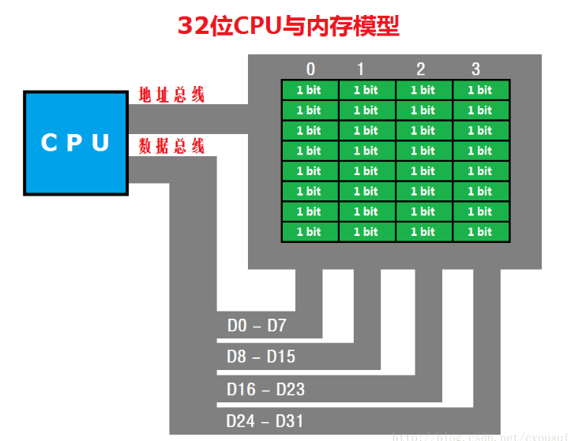
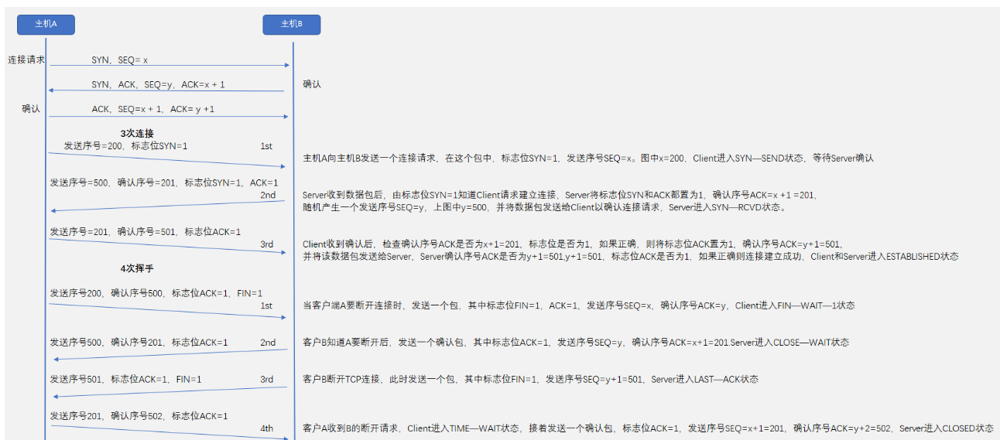
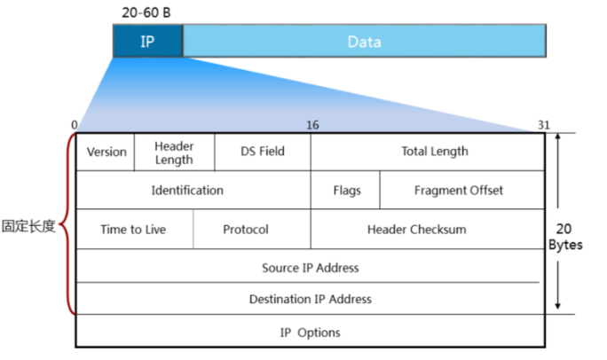
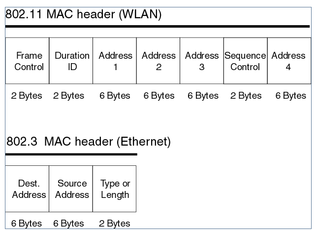
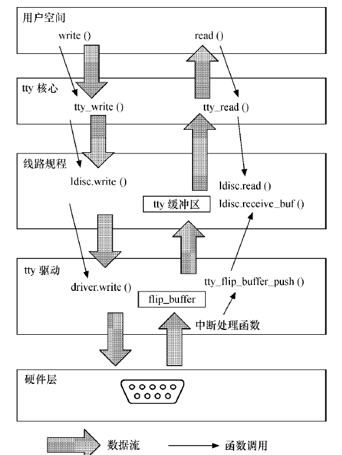

#### 1. 博客

```
https://me.csdn.net/qq_16777851
https://blog.csdn.net/hanp_linux
https://blog.csdn.net/qq_40732350/category_8245010.html
https://blog.csdn.net/yinjiabin/category_1132189.html

开发板验证:
1.内核打印时间
2.readl、writel操作函数
3.中断共享
```

#### 2. coredump

https://www.cnblogs.com/justin-y-lin/p/5598305.html

https://www.shangyouw.cn/wenjian/arc36238.html

https://blog.csdn.net/dayancn/article/details/50963822

#### 3. 字符设备3种注册方式

[参考链接](https://blog.csdn.net/nswcszmdfj/article/details/82951587)

##### 3. 1标准字符设备注册方式

```
字符设备注册流程:
    1.动态分配cdev结构
    2.初始化分配的cdev结构
    3.申请设备号
    4.向内核中添加字符设备(cdev变量+设备号)
    5.创建设备类
    6.生成设备节点(设备类+设备号)
    
字符设备注销流程:
    1.删除设备节点
    2.注销类
    3.注销设备号
    4.释放空间
```

```c
//驱动代码
#include <linux/kernel.h>
#include <linux/module.h>
#include <linux/fs.h>
#include <linux/device.h>
#include <linux/cdev.h>
#include <linux/slab.h>
#include <asm/uaccess.h>

/*
	设备号:由主设备号+次设备号组成
*/
static dev_t dev_num;

/*
	字符设备结构体
*/
static struct cdev *cdev;
/*
	 设备类
*/
static struct class *dev_class; 

/*
	定义内核缓冲区
*/
static int wb = 0;
static int rb;

/*
	定义私有数据
*/
static int device1Data = 1;
static int device2Data = 2;

static int device_open(struct inode *inode, struct file *file)
{
	printk("device1_open............\n");
	
	/*
		从inode结构体中可以获取到设备号:主设备号+次设备号
	*/
	printk("num = %lu device num = %lu,max = %lu,min = %lu\n",dev_num,inode->i_rdev,MAJOR(inode->i_rdev),MINOR(inode->i_rdev));

	/*
		可以根据次设备号的不同的存储不同节点的私有数据
	*/
	if(MINOR(inode->i_rdev) == 10) { //次设备节点为10
		file->private_data = (void *)&device1Data;
	}
	else { //次设备节点11
		file->private_data = (void *)&device2Data;
	}
	
	//通过file结构体也可以获取到设备号:主设备号+次设备号
//	printk("file open num = %p,n = %lu\n",inode,inode->i_rdev);
//	printk("file open num = %p,n = %lu\n",file->f_dentry->d_inode,file->f_dentry->d_inode->i_rdev);
	
	return 0;	
}
 
static ssize_t device_read(struct file *file, char __user *buff, size_t cnt, loff_t *loff)
{
	wb++;
	printk("device_read wb = %d  private data = %d\n",wb,*(int *)file->private_data);
	//将数据从内核空间拷贝到用户空间
	copy_to_user(buff, &wb,sizeof(wb));
	
	printk("file read num = %lu\n",file->f_dentry->d_inode->i_rdev);
	
	//buff的地址为用户空间的地址
	printk("buff = %p\n",buff);
	return cnt;
}
 
static ssize_t device_write(struct file *file, const char __user *buff, size_t cnt, loff_t *loff)
{
	printk(".....................device_write data = %d,cnt = %d\n",*((int*)buff),cnt);
	
	//从用户空间向内核空间拷贝数据
	copy_from_user(&rb, buff, sizeof(rb));
	
	printk(".....................device_write rb = %d private data = %d\n",rb,*(int *)file->private_data);
	
	return cnt;
}
 
static int device_release(struct inode *inode, struct file *file)
{
    printk("device1_release............\n");
	return 0;
}
 
static struct file_operations devicefops=
{
	.open=device_open,
	.read=device_read,
	.write=device_write,
	.release=device_release,
};

static int __init device_init(void)  
{
	int i;
	
    /*1. 动态分配cdev结构*/
	cdev = cdev_alloc();
	
	/*2. cdev初始化*/
	cdev_init(cdev,&devicefops);
	
	/*3. 动态分配设备号
		 在ls -al /proc/devices目录下会有led_dev
	*/
	alloc_chrdev_region(&dev_num,10,2,"led_dev");
	printk("dev_num:%lu\n",dev_num);
	
	/*4. 添加字符设备到内核*/
	cdev_add(cdev,dev_num,2);  //添加设备到内核
	
	/*5. 创建设备类，创建成功会在: /sys/class目录下创建子目录*/
	dev_class = class_create(THIS_MODULE, "exynos4412");
	
	for(i=0;i<2;i++)
	{
		/*6. 在/dev下生成设备节点文件*/
		device_create(dev_class,NULL,dev_num+i,NULL, "device%d",i+1);
	}
	
	if(IS_ERR(dev_class))
	{
		printk("dev_class error!\n");
		goto Class_Error;
	}
	
	printk("tips:device num success\n");
	
Class_Error:
    return 0;
}

/*
	字符设备注销流程:
	1.删除设备节点
	2.注销类
	3.注销设备号
	4.释放空间
*/
static void __exit device_exit(void)
{
	int i;
	
	for(i=0;i<2;i++)
	{
		//删除设备节点
		device_destroy(dev_class,dev_num+i);
	}
	
	//注销类
	class_destroy(dev_class);
	
	//注销设备号
	unregister_chrdev_region(dev_num,2);
	
	//释放空间
	kfree(cdev);
	
    printk("device_exit\n");
}
 
module_init(device_init);    /*指定驱动的入口函数*/
module_exit(device_exit);    /*指定驱动的出口函数*/
MODULE_LICENSE("GPL");       /*指定驱动许可证*/

```

```c
//应用层代码
#include<stdio.h>
#include <sys/types.h>
#include <sys/stat.h>
#include <fcntl.h>
 
int main(int argc ,char ** argv)
{
	int i = 0,wb = 0,rb = 0,err = 0;
	if(argc!=2)
	{
		printf("usage: ./app <device>\n");
		return 0;
	}
	
	err = open(argv[1],O_RDWR);
	
	if(err<0)
	{
		printf("device open fail!\n");
		return 0;
	}
	
	while(1)
	{
		read(err,&rb,sizeof(rb));
		printf("addr = %p app rb = %d\n",&rb,rb);
		sleep(1);
		
		wb++;
		printf("..............app write data %d\n",wb);
		write(err,&wb,sizeof(wb));
		sleep(1);
		
		if(wb >=5) {
			printf("jump while\n");
			break;
		}
	}
	
	close(err);
}
```

```
cat /proc/devices
ls -al /sys/class/
IS_ERR
https://www.cnblogs.com/kazuki/p/10620001.html
```

```c
函数使用:
/*
	作用:分配字符设备结构体
*/
struct cdev *cdev_alloc(void);

/*
	作用:初始化字符设备,将cdev与file_operations结合起来
	参数:
		字符设备结构体
		文件操作结构体
*/
void cdev_init(struct cdev *, const struct file_operations *);

/*
	作用:向内核申请设备号,内核分配给我们一个尚未使用的主设备号
	参数:
		dev:向内核申请下来的设备号
		baseminor:次设备号的起始
		count:申请次设备号的个数
		name:执行cat /prco/devices显示的名称
		
		cat /proc/devices 可以查看到主设备号和对应的设备
*/
int alloc_chrdev_region(dev_t *dev, unsigned baseminor, unsigned count,const char *name)

/*
	作用:向内核中加入字符设备,将字符设备,设备号联系起来	
*/
int cdev_add(struct cdev *p, dev_t dev, unsigned count)

/*
	作用:动态创建设备的逻辑类,并完成部分字段的初始化,然后将其添加到内核中,创建的逻辑类位于/sys/class
*/
struct class *class_create(struct module *owner, const char *name)

/*
	作用:动态创建设备节点,在linux2.6以后,当module加载时,udev daemon就会自动在/dev下创建设备节点
	ls -l dev/ 可以查看到所有的设备节点
	
	创建设备节点方式:
	(1)手动创建:
	mknod /dev/设备名 设备类型(字符：c,块：b) 主设备号 从设备号
	其中，主设备号用来区分不同种类的设备，而次设备号用来区分同一类型的多个设备。因此，想要创建设备节点，需要知道设备类型，及其主从设备号。
	例如：mknod /dev/nodetest c 244 10 就创建了一个nodetest的字符设备节点，主设备号是244，次设备号是10
	(2)自动创建:
	利用udev(mdev)来实现设备文件的自动创建,首先应保证支持udev(mdev),由busybox配置,在驱动初始化代码里调用class_create为该设备创建一个class,再为每个设备调用device_create创建对应的设备
*/
struct device *device_create(struct class *cls, struct device *parent,
				    dev_t devt, const char *fmt, ...)
https://blog.csdn.net/juckciy/article/details/7662389
https://blog.csdn.net/qq_30624591/article/details/85339304?utm_medium=distribute.pc_relevant.none-task-blog-BlogCommendFromMachineLearnPai2-2.nonecase&depth_1-utm_source=distribute.pc_relevant.none-task-blog-BlogCommendFromMachineLearnPai2-2.nonecase
```

##### 3.2 早期字符设备注册方式

```
字符设备注册流程:
    1.字符设备注册
    2.创建设备类
    3.生成设备节点(设备类+设备号)
    
字符设备注销流程:
    1.删除设备节点
    2.注销类
    3.注销字符设备
```

```c
#include <linux/module.h>
#include <linux/kernel.h>
#include <linux/init.h>
#include <linux/fs.h>
#include <linux/device.h>
#include <asm/uaccess.h>

MODULE_LICENSE("GPL");
MODULE_AUTHOR("kunzhao");
MODULE_DESCRIPTION("Hello world module");
MODULE_VERSION("V1.0");
MODULE_ALIAS("a simple module");

/*
	定义内核缓冲区
*/
static int wb = 0;
static int rb;

/*
	定义私有数据
*/
static int device1Data = 1;
static int device2Data = 2;

static struct class *device_class;

static int device_major = 0;

static int device_open(struct inode *inode, struct file *file)
{
	printk("device1_open............\n");
	
	/*
		从inode结构体中可以获取到设备号:主设备号+次设备号
	*/
	printk("device num = %lu,max = %lu,min = %lu\n",inode->i_rdev,MAJOR(inode->i_rdev),MINOR(inode->i_rdev));

	/*
		可以根据次设备号的不同的存储不同节点的私有数据
	*/
	if(MINOR(inode->i_rdev) == 10) { //次设备节点为10
		file->private_data = (void *)&device1Data;
	}
	else { //次设备节点11
		file->private_data = (void *)&device2Data;
	}
	
	//通过file结构体也可以获取到设备号:主设备号+次设备号
//	printk("file open num = %p,n = %lu\n",inode,inode->i_rdev);
//	printk("file open num = %p,n = %lu\n",file->f_dentry->d_inode,file->f_dentry->d_inode->i_rdev);
	
	return 0;	
}
 
static ssize_t device_read(struct file *file, char __user *buff, size_t cnt, loff_t *loff)
{
	wb++;
	printk("device_read wb = %d  private data = %d\n",wb,*(int *)file->private_data);
	//将数据从内核空间拷贝到用户空间
	copy_to_user(buff, &wb,sizeof(wb));
	
	printk("file read num = %lu\n",file->f_dentry->d_inode->i_rdev);
	
	//buff的地址为用户空间的地址
	printk("buff = %p\n",buff);
	return cnt;
}
 
static ssize_t device_write(struct file *file, const char __user *buff, size_t cnt, loff_t *loff)
{
	printk(".....................device_write data = %d,cnt = %d\n",*((int*)buff),cnt);
	
	//从用户空间向内核空间拷贝数据
	copy_from_user(&rb, buff, sizeof(rb));
	
	printk(".....................device_write rb = %d private data = %d\n",rb,*(int *)file->private_data);
	
	return cnt;
}
 
static int device_release(struct inode *inode, struct file *file)
{
    printk("device1_release............\n");
	return 0;
}

static struct file_operations operations = {
	.owner = THIS_MODULE,
	.open=device_open,
	.read=device_read,
	.write=device_write,
	.release=device_release,
};

static int hello_inti(void) {
	
	//该函数返回的是主设备号
	device_major = register_chrdev(0,"proc_my_driver",&operations);

	printk("device_major=%d\n",device_major);
	
	device_class = class_create(THIS_MODULE,"sys_my_driver");

	device_create(device_class,NULL,MKDEV(device_major,0),NULL,"driver_fd");

	return 0;
}

static void hello_exit(void) {
	
	printk("first driver,I quit\n");

	device_destroy(device_class,MKDEV(device_major,0));
	class_destroy(device_class);
	unregister_chrdev(device_major,"proc_my_driver");
}

module_init(hello_inti);
module_exit(hello_exit);
```

##### 3.3 杂项字符设备注册方式

```
字符设备注册流程:
    1.杂项设备注册
    
字符设备注销流程:
    1.注销杂项设备
```

```c
#include <linux/kernel.h>
#include <linux/module.h>
#include <linux/miscdevice.h>
#include <linux/fs.h>

static int open_led (struct inode *my_inode, struct file *my_file)
{
	printk("open_led\n");
	return 0;	
}

static ssize_t read_led(struct file *my_file, char __user *buff, size_t cnt, loff_t *loff)
{
	printk("read_led\n");
	return 0;
}
 
static ssize_t write_led(struct file *my_file, const char __user *buff, size_t cnt, loff_t *loff)
{
	printk("write_led\n");
	return 0;
}
 
static int release_led(struct inode *my_inode, struct file *my_file)
{
    printk("release_led\n");
	return 0;
}
 
static struct file_operations fops_led=
{
	.open=open_led,
	.write=write_led,
	.read=read_led,
	.release=release_led,
};
 
 //杂项设备的默认主设备号为10
static struct miscdevice misc_led=
{
	.minor=MISC_DYNAMIC_MINOR, /*自动分配次设备号*/
	.name="tiny4412_led",      /*设备节点的名称*/
	.fops=&fops_led           /*文件操作集合*/
};
 
static int __init tiny4412_led_init(void)
{
	int err;
	
	err = misc_register(&misc_led);  //杂项设备注册函数
	if(err<0)
	{
		printk("misc_register failed\n");
		return err;
	}
	
    printk("misc_register success\n");
    return err;
}
 
static void __exit tiny4412_led_exit(void)
{
	int err;
	err = misc_deregister(&misc_led);  //杂项设备注销函数
	if(err<0)
	{
		printk("misc_deregister failed\n");
	}
    printk("misc_deregister success\n");
}

module_init(tiny4412_led_init);
module_exit(tiny4412_led_exit);
MODULE_LICENSE("GPL");
```

```
http://www.mamicode.com/info-detail-1275108.html
```

##### 3.4 模拟杂项设备

```c
/*
	模拟杂项设备,基础设备
*/
#include <linux/kernel.h>
#include <linux/module.h>
#include <linux/miscdevice.h>
#include <linux/fs.h>
#include <linux/device.h>

/*存放主设备号*/
static unsigned int char_dev_major; 

/*定义类*/
static struct class *char_dev_class;   

/*定义给一个全局的链表,用于存储信息*/
static LIST_HEAD(char_device_list);

/*
自定义字符设备结构体
*/
static struct char_device
{
	int minor;
	const char *name;
	const struct file_operations *fops;
	struct list_head list;
};

static int open_char_dev (struct inode *my_inode, struct file *file)
{
	/*1. 获取次设备号*/
	int minor = iminor(my_inode); /*得到次设备号*/
	/*2. 查找次设备号对应的文件操作集合*/
	struct char_device *c;
	list_for_each_entry(c, &char_device_list, list)  
	{
		if (c->minor == minor) 
		{
			/*改变文件操作集合的指向*/
			file->f_op = c->fops;
			/*调用底层用户写的open函数*/			
			file->f_op->open(my_inode,file); 
		}
	}
	return 0;	
}

static struct file_operations fops_char_dev=
{
	.open=open_char_dev
};

int char_device_register(struct char_device * char_device)
{
	struct char_device *c;
	dev_t dev;
	
	/*1. 初始化传入的链表头*/
	INIT_LIST_HEAD(&char_device->list);
	
	/*2. 遍历链表,查看次设备号是否已经使用*/
	list_for_each_entry(c, &char_device_list, list)  
	{
		if (c->minor == char_device->minor) 
		{
			printk("mini num %d failed\n",c->minor);
			return -1;
		}
	}
	/*3. 合成设备号*/
	dev = MKDEV(char_dev_major, char_device->minor);
	printk("max：%d , min：%d\n",char_dev_major,char_device->minor);
	
	/*4. 在/dev下生成设备节点文件*/
	device_create(char_dev_class,NULL,dev,NULL,char_device->name);
	
	/*5. 添加设备到链表*/
	list_add(&char_device->list, &char_device_list);
}

int char_device_deregister(struct char_device *char_device)
{
	/*1. 删除链表节点*/
	list_del(&char_device->list);
	/*2. 删除设备节点文件*/
	device_destroy(char_dev_class, MKDEV(char_dev_major, char_device->minor));
}

/*对外提供函数*/
EXPORT_SYMBOL(char_device_register);
EXPORT_SYMBOL(char_device_deregister);

static int __init char_dev_init(void)  /*insmod xxx.ko*/
{
	int err;
	/*1.关键点:获取到了主设备号,所有使用该模块的驱动主设备号都为char_dev_major*/
	char_dev_major = register_chrdev(0,"char_device",&fops_char_dev);
	printk("char_dev_major=%d\n",char_dev_major);
	
	/*2. 创建类*/
	char_dev_class = class_create(THIS_MODULE, "tiny4412_char_dev");
	
	/*3. 此处并未创建设备节点,等待其他设备创建设备节点*/
    return err;
}

static void __exit char_dev_exit(void)
{
	/*1. 注销类*/
	class_destroy(char_dev_class);
	
	/*2. 设备注销*/
	unregister_chrdev(char_dev_major,"char_device");
	
}

module_init(char_dev_init);
module_exit(char_dev_exit);
MODULE_LICENSE("GPL");
```

```c
//模拟真正的设备
#include <linux/kernel.h>
#include <linux/module.h>
#include <linux/miscdevice.h>
#include <linux/fs.h>
#include <linux/device.h>
#include <linux/cdev.h>
#include <linux/slab.h> 

extern int char_device_register(struct char_device * char_device);
extern int char_device_deregister(struct char_device *char_device);

static struct char_device
{
	int minor;
	const char *name;
	const struct file_operations *fops;
	struct list_head list;
};

static int device1_open(struct inode *my_inode, struct file *my_file)
{
	printk("device1_open\n");
	return 0;	
}
 
static ssize_t device1_read(struct file *my_file, char __user *buff, size_t cnt, loff_t *loff)
{
	printk("device1_read\n");
	return cnt;
}
 
static ssize_t device1_write(struct file *my_file, const char __user *buff, size_t cnt, loff_t *loff)
{
	printk("device1_write\n");
	return cnt;
}
 
static int device1_release(struct inode *my_inode, struct file *my_file)
{
    printk("device1_release\n");
	return 0;
}
static struct file_operations fops=
{
	.open=device1_open,
	.write=device1_write,
	.read=device1_read,
	.release=device1_release,
};

static struct char_device misc_beep=
{
	.minor=10,
	.name="device1",
	.fops=&fops,
};

static int __init device1_init(void) 
{
	char_device_register(&misc_beep);
 	printk("device1_init\n");
    return 0;
}

static void __exit device1_exit(void)
{
	char_device_deregister(&misc_beep);
    printk("device1_exit\n");
}

module_init(device1_init);    /*指定驱动的入口函数*/
module_exit(device1_exit);   /*指定驱动的出口函数*/
MODULE_LICENSE("GPL");       /*指定驱动许可证*/
```

#### 4. make命令与Makefile

##### 4.1 makefile定义

```makefile
1.makfile文件里面主要有3种内容
(1)变量声明:一种基本的严格字符串替换的操作
	例如:objects=program.o foo.o utils.o
	那么在后面出现的所有$(objects)都会自动替换上面的那个字符序列
(2)映射法则
	#目标          #依赖
	target...   : prerequisites..
(3)命令
	#映射法则和命令通常都是联合起来组成这样的结构形式
	 target...   : prerequisites..
	 	#命令
	 	command
#简单理解:通过prerequisites(先决依赖的文件),采用后面描述的相应的命令(命令都是linux里面的shell命令)command之后生成了文件target,命令的前面都要按下tab按键留一段空白来表示它是命令,有的target后面并没有先决条件,也就是后面的命令是无条件执行的.这个结构的作用就是告诉make,target是不是out of date,具体视它的依赖文件而定(依赖的文件是否有所修改),target不存在也视为out of date,然后就是过期了,那么更新,即运行下面的命令来更新
```

##### 4.2 makefile示例

```makefile
#示例1:makefile中默认的执行目标
#执行make命令时,会把makefile中的第一个目标作为默认的执行目标,而其他目标不执行,例如clean、versio目标不执行
#在目标和依赖中进行打印
debug:
        echo "debug"
clean:
        echo "clean"
version:
        echo "version"

#备注:
#1.执行make,输出debug
#2.执行make debug,输出debug
#3.执行make clean,输出clean
#4.执行make version,输出version
```

```makefile
#示例2:makefile中伪目标
#伪目标:它不代表一个真正的文件名,在执行make时可以指定这个目标来执行其所在规则定义的命令,有时将一个伪目标定义为一个标签

#makefile文件内容如下:
all:hello
hello:
    gcc hello.c -o hello
clean:
    rm -rf hello
    
#当执行make clean命令时,可以执行.但是当该目录下有一个clean文件时,则不执行,如果要执行必须添加.PHONY:clean

#makefile文件内容如下:
all:hello
hello:
    gcc hello.c -o hello
clean:
    rm -rf hello
          
.PHONY:clean

#如果需要书写这样一个规则:规则所定义的命令不是去创建目标文件,而是通过make命令行明确指定它来执行一些指定的命令,例如上面的clean,当文件夹中没有clean这个文件的时候,我们输入make clean能按照初衷执行,但是一旦文件夹中年感出现clean文件,我们再次输入make clean,由于这个规则没有任何依赖文件,所以目标被认为是最新的而不去执行规则所定义的命令,所以rm命令不会被执行,因此需要将目标clean定义成伪目标

#在/project/hello的主目录下面的makefile文件的内容如下：
prefix = /usr/local
exec_prefix = $(prefix)
bindir = $(exec_prefix)/bin

#导出定义的变量,提供给其他makefile使用
export prefix
export exec_prefix
export bindir

all clean  install uninstall:
	#进入src目录,执行make命令
	#$(MAKE)make中默认的一个变量make,$@目标,例如输入的是make all,则$@则是all
	cd src && $(MAKE) $@

.PHONY:all clean install uninstall

#在/project/hello/src目录下面的makefile文件内容如下：

all: hello
hello: main.c
	$(CC)  -o $@ main.c
clean:
	rm hello
	
install:
         install -d $(bindir)
         install -m 0755 hello  $(bindir)

uninstall:
         rm $(bindir)/hello

.PHONY: all clean  install uninstall

#备注:
#########################################################################################
首先我们看主目录下的makefile文件，前面那部分是变量声明，这个等下还会说到。然后是export 变量，这个就是主目录下的主makefile文件可以使用这个命令，意思是将变量和子一级目录下的makefile共享。然后我们看到
all clean  install uninstall :
	cd src && $(MAKE) $@
.PHONY:  all clean   install uninstall
这实际上是一个跳转结构，首先介绍下.PHONY是个什么意思，前面说了每一个target默认都是一个待生成文件，但是.PHONY:后面跟着的target的意思是这些target不用生成文件。那么总的来说这里的all，clean，install，uninstall在这里是些没有依赖文件的不用生成最终target文件的执行命令了。这些执行命令就是前面说的make，make install ，make clean和make uninstall。make的意思实际上就是make all，这两个命令是没有区别的。
然后我们看到命令，cd src这个很容易理解，就是跳转到src目录中去了。然后&&符号的意思是逻辑与，即前一命令执行完之后再执行后面的命令。而后面的$(MAKE)可能是一个具有系统默认值的变量，在这里应该就是make。而$@符号的意思则是指代当前的target。比如说我现在make clean ，那么命令最终就成了这个样子：

cd src &&make clean
然后下一个make clean的命令实际上是对src子目录下的makefile文件说的，我们看到这里简单的：
clean:
    rm hello

即把生成的可执行文件hello删掉即可。
然后我们再来看子目录下那个makefile文件如何处理make all 命令：

all: hello
hello: main.c
    $(CC)  -o $@ main.c
我们看到，这里首先说明all依赖于hello，然后hello依赖于main.c，而要生成或者更新hello的话需要执行下面的命令：
cc -o hello main.c
上面的$(CC)也是具有系统默认值的变量，就是cc，不过在GNU/LINUX体系下可能调用的是gcc工具。后面的选项-o的意思是编译连接然后生成后面的那个名字的文件。名字在这里就是hello。然后我们再来看make install命令执行的情况：
install:
install -d $(bindir)
install -m 0755 hello  $(bindir)
前面说过了这个变量是继承自主目录makefile文件中的定义，然后翻译出来$(bindir)就是/usr/local/bin。linux系统在终端可以直接调用的命令存放点有两个位置，另外的一个是/usr/bin。/usr/local文件夹内部的结构和/usr内部的结构非常相似。似乎讲起来/usr是供系统内部的软件使用的空间，但这个规矩并不是死的。
uninstall命令我们看到就是一个删除对应位置hello文件的操作。所以现在就把linux中的install命令讲讲就可以了。

第一个install命令接着-d的选项的意思就是目录确认，在这里我觉得有点多余。
第二个install命令接着-m的选项的意思就是把hello复制到指定的目录中去，然后相应文件也就是hello文件的权限设置成为0755.关于权限我觉得在这里似乎也没有什么好说的。在这里用第二个install命令就可以搞定了，过程是复制，加权限，更新时间戳。
#########################################################################################
```

```makefile
#示例3:makefile中默认变量
make系统中的变量可以分为4类
1.环境变量,例如PATH,PWD变量,在makefile中$(PATH),$(PWD)
2.内置变量,例如CC,在makefile中$(CC),代表cc,$(CURDIR)
/usr/bin/cc -> /etc/alternatives/cc
/etc/alternatives/cc -> /usr/bin/gcc
3.自动变量
4.自定义变量
```

```makefile
#示例4:内核模块的makefile编写

#在makefile外面写shell语句,要使用shell
KVERS = $(shell uname -r)
#编译模块,变量名字固定的为obj-m形式,不能为其他名字
obj-m := hello.o
kernel_modules:
	#在command中执行shell语句,直接写shell语句即可
    make -C /lib/modules/$(KVERS)/build M=$(CURDIR) modules

clean:
    make -C /lib/modules/$(KVERS)/build M=$(CURDIR) clean
    
#备注:
#########################################################################################
(1)obj-m表示编译生成可加载模块,相应的,obj-y表示直接将模块编译进内核
(2)这里并没有输入hello.c源文件,原因是得益于makefile的自动推导功能,需要编译生成filename.o文件而没有显示地指定filename.c文件位置时,make查找filename.c是否存在,如果存在就正常编译,如果不存在,则报错
(3)obj-m += hello.o,这句语句就是显示地将hello.o编译成hello.ko,而hello.o则由make的自动推导功能编译hello.c文件生成
(4)make -C /lib/modules/$(shell uname -r)/build/ M=$(PWD) modules
-C:此选项指定内核源码的位置,make在编译时将会进入内核源码目录,执行编译,编译完成是返回
M=$(PWD):需要编译的模块源文件地址
#########################################################################################
```

```makefile
#示例5:编译多个文件的makefile编写
#首先当一个.o目标文件的生成依赖多个源文件时,显示make的自动推导规则就力不从心了(它只能根据同名推导,比如编译filename.o,只会去查找filename.c),因此可以指定:自定义模块的名字
第一种方式(模块名字-y):
obj-m := h.o
h-y := hello.o he.o

h.o:生成的内核的模块的名字h.ko
h-y:依赖的源文件

第二种方式(模块名字-objs):
obj-m := h.o
h-objs := hello.o he.o

hello.c文件:
#include <linux/module.h>
#include <linux/kernel.h>
#include <linux/init.h>
#include "he.h"
                                                                    
static int hello_init(void)
{
    printk( KERN_EMERG "Hello world\n");
    //引用外部函数
    he_init();
    return 0;
}

static void first_exit(void)
{
    printk( KERN_EMERG "Hello exit\n");
}

//入口文件
module_init(hello_init);
//出口文件
module_exit(first_exit);

he.h文件:
#include <linux/module.h>
#include <linux/kernel.h>
#include <linux/init.h>

int he_init(void);

he.c文件:
#include "he.h"                                                                          
int he_init(void)
{
    printk( KERN_EMERG "Hello he_init\n");
    return 0;
}
```

```makefile
#示例6:编译多个ko文件
#自定义两个模块名称
obj-m := h.o k.o 
#模块名字-y
h-y := hello.o
k-y := ho.o

hello.c文件:
#include <linux/module.h>
#include <linux/kernel.h>
#include <linux/init.h>

extern void hello_export(void);

static int hello_init(void)
{
    printk( KERN_EMERG "Hello world\n");
    //引用另一个模块的函数
  	hello_export();
    return 0;
}

static void first_exit(void)
{
    printk( KERN_EMERG "Hello exit\n");
}

//入口文件
module_init(hello_init);
//出口文件
module_exit(first_exit);

ho.c文件:
#include <linux/module.h>
#include <linux/kernel.h>
#include <linux/init.h>

static int hello_init(void)
{
    printk( KERN_EMERG "Hello world ho\n");
    return 0;
}

static void hello_export(void)
{
    printk(KERN_EMERG "Hello export ho\n");
}

static void hello_exit(void)
{
    printk( KERN_EMERG "Hello exit ho\n");
}

//导出函数
EXPORT_SYMBOL(hello_export);
//入口文件
module_init(hello_init);
//出口文件
module_exit(hello_exit);                                                                                
MODULE_LICENSE("GPL");

#查看导出的函数
#第一种方式:
cat Module.symvers
0xbfec5545      hello_export    /home/zhaokun/driver/proc/kernel_module/h1      EXPORT_SYMBOL

#第二种方式:
先安装内核模块insmod h1.ko后查看
cat /proc/kallsyms | grep hello

0000000000000000 T hello_export [h1]
0000000000000000 t hello_init   [h1]
0000000000000000 t hello_exit   [h1]

可以看到函数被内核识别并导出，第一列表示地址，最后一列表示函数属于哪个模块
```

```makefile
#示例7:insmod与modprobe
在linux中,insmod和modprobe都可用用来加载module,不过现在一般都推荐使用modprobe而不是insmod,二者区别在于:
insmod只在给定的参数中去找module(默认在到当前目录下找),不能解决依赖问题
modprobe默认在/lib/modules/<kernel-version>/下查找,并且能够解决依赖问题
modprobe的使用:
	(1)把模块文件放到 /lib/module/`uname -r`/路径下
	(2)执行depmod命令,(可以使用cat /lib/modules/2.6.16/modules.dep命令进行查看)
	(3)modprobe 模块(不用加.ko后缀)
```

```makefile
#示例8:Makefile中:=, =, ?=和+=的含义
makefile中定义:
(1) "="
#使用=进行赋值,变量的值是整个makefile中最后被指定的值
VIR_A = A
VIR_B = $(VIR_A) B
VIR_A = AA
$(warning "VIR_A="$(VIR_A))
$(warning "VIR_B="$(VIR_B))

输出:
"VIR_A="AA
#最终输出的是AA B,而不是A B
"VIR_B="AA B

(2) ":="
#即赋值
VIR_C := C                                                                               
输出:
"VIR_C="C

(3) "?="
#表示如果该变量没有被赋值,则赋予等号后的值
VIR_C ?= CC
$(warning "VIR_C="$(VIR_C))
输出:
"VIR_C="CC

VIR_C := C
VIR_C ?= CC
$(warning "VIR_C="$(VIR_C))
输出:
"VIR_C="C

(4) "+="
#将等号后面的值添加到前面的变量上
A := a.o 
A += b.o 
$(warning "A="$(A))

输出:
"A="a.o
"A="a.o b.o
```

```makefile
#示例9:Makefile 中 echo 和@echo的区别
echo: 会在shell中显示echo这条命令和后面要输出的内容
@echo:  不会显示echo这条命令，只会显示后面要输出的内容

例如：
echo “hello”  输出为：
echo "hello"
hello

@echo "hello" 输出为：
hello
```

#### 5. linux内核链表

[参考链接](https://blog.csdn.net/wanshilun/article/details/79747710)

```c
链表的结构体形式:
struct list_head
{
    struct list_head *next, *prev;
};

(1)创建链表
static inline void INIT_LIST_HEAD(struct list_head *list);
struct list_head header;

可以通过INIT_LIST_HEAD(&header)进行初始化链表,header的pre和next指针都指向自己。如果只是利用header这样的结构体实现链表就没有什么实际意义了,因为正常的链表都是为了遍历结构体中的其他意义的字段而创建的,而我们header只要pre和next指针,却没有实际有意义的字段数据,所以毫无意义。综上所述,我们要创建一个宿主结构,然后在此结构中再嵌套header字段,宿主结构又有其他字段,因此定义如下:
struct Student
{
	int id; //实际有意义字段
	struct list_head list; //嵌套链表
};

(2)添加节点
/*
	作用:向链表头添加节点
	new:新节点的链表
	head:链表头
*/
void list_add(struct list_head *new, struct list_head *head);
/*
	作用:向链表尾添加节点
	new:新节点的链表
	head:链表头
*/
void list_add_tail(struct list_head *new, struct list_head *head)
(3)删除节点
/*
	前提条件是这个节点是已知的,既在链表中存在,且pre、next都不为空
 */
void list_del(struct list_head *entry)
(4)链表遍历
宏:container_of宏的注释:
作用:根据结构体中的一个成员变量地址导出包含这个成员变量的struct地址
ptr:成员变量mem的地址
type:包含成员变量mem的宿主结构体的类型
member:在宿主结构中mem成员变量的名称

#define container_of(ptr, type, member) ({          \  
const typeof( ((type *)0)->member ) *__mptr = (ptr); \  
(type *)( (char *)__mptr - ((size_t) &((type *)0)->member) );})  

再把宏中对应的参数替换成实参：
    
const typeof( ((struct Student *)0)->mylist ) *__mptr = (&s1.list); \  
    (struct Student *)( (char *)__mptr - ((size_t) &((struct Student *)0)->list) );})

typeof 是 GNU对C新增的一个扩展关键字，用于获取一个对象的类型 ，比如这里((struct Student *)0)->list 是把0地址强制转换成struct Student 指针类型，然后取出list元素。 然后再对list元素做typeof操作，其实就是获取 Student结构中list字段的数据类型struct list_head，所以这行语句最后转化为：

const struct list_head *__mptr  = (&s1.list);

第二条语句中在用 __mptr这个指针 减去 list字段在 Student（把0地址强制转换成struct Student指针类型，然后取出list的地址，此时list的地址也是相对于0地址的偏移，所以就是list字段相对于宿主结构类型struct Student的偏移）正好就是宿主结构的起始地址

(5)宿主结构
(6)宿主结构的变量
```

```c
INIT_LIST_HEAD(&header)
```


```c
struct Student s1;
s1.id = 1;
INIT_LIST_HEAD(&s1.list);
list_add_tail(&s1.list,&header);
```


```c
struct Student s2;
s2.id = 2;
INIT_LIST_HEAD(&s1.list);
list_add_tail(&s2.list,&header);
```


```c
struct Student s1;
s1.id = 1;
INIT_LIST_HEAD(&s1.list);
list_add_tail(&s1.list,&header);

struct Student s2;
s2.id = 2;
INIT_LIST_HEAD(&s1.list);
list_add_tail(&s2.list,&header);
```


```c
//container_of宏定义的使用
#include <stdio.h>

/*
	计算起始地址
*/
#define container_of(ptr, type, member) ({            \
			const typeof(((type *)0)->member) * __mptr = (ptr);    \
			(type *)((char *)__mptr - offsetof(type, member)); })

/*计算偏移量*/
#define offsetof(TYPE, MEMBER) ((size_t) &((TYPE *)0)->MEMBER)

struct Human {

	int id;
};

struct Student {

	int age;
	int count;
	long num;
	struct Human h;
};

int main() {

	struct Student s;

	s.age = 10;
	s.h.id = 1;

	printf("age = %d  id = %d\n",s.age,s.h.id);

	struct Human *h;
	struct Student *ps;

	h = (struct Human *)&s;

	printf("id = %d\n",h->id);

	ps = (struct Student *)h;

	printf("age = %d  id = %d\n",ps->age,ps->h.id);
	printf("addr = %p age = %p count = %p num = %p  h = %p id = %p\n",ps,&ps->age,&ps->count,&ps->num,&ps->h,&ps->h.id);

	printf("age = %lx\n",offsetof(struct Student,count));

	printf("addr = %p\n",container_of(&ps->h,struct Student,h));

}

addr = 0x7fff9cb66400 age = 0x7fff9cb66400 count = 0x7fff9cb66404 num = 0x7fff9cb66408  h = 0x7fff9cb66410 id = 0x7fff9cb66410
addr = 0x7fff9cb66400
```

```c
//list.h文件
#ifndef CUSTOMER_COMMON_LIST_H_
#define CUSTOMER_COMMON_LIST_H_

struct list_head
{
    struct list_head *next, *prev;
};

static inline void INIT_LIST_HEAD(struct list_head *list)
{
    list->next = list;
    list->prev = list;
}

static inline void __list_add(struct list_head *new,
                              struct list_head *prev, struct list_head *next)
{
    next->prev = new;
    new->next = next;
    new->prev = prev;
    prev->next = new;
}

extern void __list_add(struct list_head *new,
                       struct list_head *prev, struct list_head *next);

static inline void list_add(struct list_head *new, struct list_head *head)
{
    __list_add(new, head, head->next);
}

static inline void list_add_tail(struct list_head *new, struct list_head *head)
{
    __list_add(new, head->prev, head);
}

#define list_first_entry(ptr, type, member) \
            list_entry((ptr)->next, type, member)

#define list_first_entry_or_null(ptr, type, member) \
            (!list_empty(ptr) ? list_first_entry(ptr, type, member) : NULL)

#define list_for_each(pos, head) \
    for (pos = (head)->next;pos != (head); \
        pos = pos->next)

#define list_entry(ptr, type, member) \
    container_of(ptr, type, member)

#define container_of(ptr, type, member) ({            \
    const typeof(((type *)0)->member) * __mptr = (ptr);    \
    (type *)((char *)__mptr - offsetof(type, member)); })

#define offsetof(TYPE, MEMBER) ((size_t) &((TYPE *)0)->MEMBER)

static inline void __list_del(struct list_head *prev, struct list_head *next)
{
    next->prev = prev;
    prev->next = next;
}

static inline void list_del(struct list_head *entry)
{
    __list_del(entry->prev, entry->next);
}

static inline int list_empty(struct list_head  *head)
{
  return head->next == head;
}

#endif /* CUSTOMER_COMMON_LIST_H_ */

```

```c
#include <stdio.h>
#include "list.h"

struct Student
{
	int id;
	struct list_head list;
};

void main() {
	
	struct list_head header;
	
	INIT_LIST_HEAD(&header);
	
	struct Student s1,s2;
	
	s1.id = 1;
	INIT_LIST_HEAD(&s1.list);
	
	s2.id = 2;
	INIT_LIST_HEAD(&s2.list);
	
	list_add_tail(&s1.list,&header);
	list_add_tail(&s2.list,&header);

	struct list_head *ptr = NULL;
	struct Student *s = NULL;

    /*遍历链表*/
	list_for_each(ptr,&header) {

		s = list_entry(ptr, struct Student,list);

		printf("id = %d\n",s->id);
	}
}

//编译:gcc main.c list.h -o main
```

#### 6. linux内核锁

#### 7. 从用户空间的open到内核空间的open

```c
int open(const char *pathname, int flags, mode_t mode);  --系统调用
                            ||
                            \/
long sys_open(const char __user *filename, int flags, int mode)  -- fs/open.c
/*对应内核中的open接口函数*/
                            ||
                            \/
long do_sys_open(int dfd, const char __user *filename, int flags, int mode) --fs/open.c
/*用户空间的filename被拷贝到内核空间，获取当前可用的文件描述符*/
                            ||
                            \/
static struct file *do_filp_open(int dfd, const char *filename, int flags, int mode) --fs/open.c 
                            ||
                            \/
int open_namei(int dfd, const char *pathname, int flag,
  int mode, struct nameidata *nd)
/*获取该文件对应的nameidata结构.该函数执行完毕，接着调用下面函数。这两个函数是顺序被do_filp_open调用*/
                            ||
                            \/
struct file *nameidata_to_filp(struct nameidata *nd, int flags) --fs/open.c
/*将nameidata 结构转换为打开的struct file结构*/
                            ||
                            \/
static struct file *__dentry_open(struct dentry *dentry, struct vfsmount *mnt,
     int flags, struct file *f,
     int (*open)(struct inode *, struct file *)) --fs/open.c
                            ||
                            \/
f->f_op = fops_get(inode->i_fop);  --fs/open.c
/*这里将系统调用中需要对应打开文件对应到内核中的file_operations结构体获取到，然后根据其函数
指针就可以找到该结构体中对该种文件操作的所有方法。mem_pool对应的结构体是在mem_pool_init的时候向内
核注册的。*/
                            ||
                            \/
open = f->f_op->open; 
open(inode, f);    --fs/open.c
```

#### 8. 嵌入式常见的物理总线

https://blog.csdn.net/hancunai0017/article/details/6907658?utm_medium=distribute.wap_relevant.none-task-blog-BlogCommendFromMachineLearnPai2-5.nonecase&depth_1-utm_source=distribute.wap_relevant.none-task-blog-BlogCommendFromMachineLearnPai2-5.nonecase

#### 9. linux内核中kobject、kset

```
linux2.6内核引入了sysfs文件系统,sysfs被看出是与proc同一个类别的文件系统,sysfs把连接在系统上的设备和总线组成成分级的文件,使其从用户空间可以访问到。sysfs被加载在/sys目录下,它的子目录包括:
1.Block
在系统中发现的每个块设备在该目录下对应一个子目录,每个子目录中又包含一些属性文件,它们描述了这个块设备的各个方面属性
2.Bus
在内核中注册的每条总线在该目录下对应一个子目录,如:ide pci scsi usbpcmcia,其中每个总线目录内又包含两个子目录:devices和drivers,devices目录包含了整个系统中方A线的属于该总线类型的设备,drivers目录包含了注册到该总线的所有驱动
3.Class
将设备按照功能进行分类,如/sys/class/net目录下包含了所有网络接口
4.Devices
包含系统所有的设备
5.Kernel
内核中的配置参数
6.Module
系统中所有模块信息
7.Firmware
系统中的固件
8.Fs
描述系统中的文件系统
9.Power
系统中欧冠电源选项
```

```c
//kobject示例
#include <linux/device.h>
#include <linux/module.h>
#include <linux/kernel.h>
#include <linux/init.h>
#include <linux/string.h>
#include <linux/sysfs.h>
#include <linux/stat.h>

void obj_test_release(struct kobject *kobject);
ssize_t kobj_test_show(struct kobject *kobject, struct attribute *attr,char *buf);
ssize_t kobj_test_store(struct kobject *kobject,struct attribute *attr,const char *buf, size_t count);

struct attribute test_attr = {
	//在/sys/kobject_test/kobj_config
	.name = "kobj_config",
	.mode = S_IRWXUGO,
};

static struct attribute *def_attrs[] = {
	&test_attr, 
	NULL, 
}; 

struct sysfs_ops obj_test_sysops = 
{
	//读文件时被调用
	.show = kobj_test_show,
	//写文件时被调用
	.store = kobj_test_store,
}; 

struct kobj_type ktype =
{
	.release = obj_test_release,
	.sysfs_ops=&obj_test_sysops,
	.default_attrs=def_attrs,
}; 

void obj_test_release(struct kobject *kobject)
{
	printk("eric_test: release .\n");
}

ssize_t kobj_test_show(struct kobject *kobject, struct attribute *attr,char *buf)
{
	printk("have show.\n");
	printk("attrname:%s.\n", attr->name);
	sprintf(buf,"%s\n",attr->name);
	return strlen(attr->name)+2;
} 

ssize_t kobj_test_store(struct kobject *kobject,struct attribute *attr,const char *buf, size_t count)
{
	printk("havestore\n");
	return count;
}

struct kobject kobj;

static int kobj_test_init(void) 
{
	printk("kboject test init.\n");
	//在/sys目录下创建目录kobject_test
	kobject_init_and_add(&kobj,&ktype,NULL,"kobject_test");
	return 0;
} 

static void kobj_test_exit(void)
{
	printk("kobject test exit.\n");
	kobject_del(&kobj);
} 

module_init(kobj_test_init);
module_exit(kobj_test_exit);

MODULE_LICENSE("GPL");
```

```c
kset:是具有相同类型的kobject的集合,在sysfs中体现成一个目录,在内核中用kset数据结构表示:

struct kset {
	struct kobj_type	* ktype;
	struct list_head	list;
	spinlock_t		list_lock;
	struct kobject		kobj;
	struct kset_uevent_ops	* uevent_ops;
};

//在内核中注册一个kset
int kset_register(struct kset *kset)
//从内核中注销一个kset    
void kset_unregister(struct kset *kset)
```

```c
kset:是具有相同类型的kobject的集合,在sysfs中体现成一个目录,在内核中用kset数据结构表示:

struct kset {
	struct kobj_type	* ktype;
	struct list_head	list;
	spinlock_t		list_lock;
	struct kobject		kobj;
	struct kset_uevent_ops	* uevent_ops;
};

//在内核中注册一个kset
int kset_register(struct kset *kset)
//从内核中注销一个kset    
void kset_unregister(struct kset *kset)

```

```c
//kset示例
#include <linux/device.h>
#include <linux/module.h>
#include <linux/kernel.h>
#include <linux/init.h>
#include <linux/string.h>
#include <linux/sysfs.h>
#include <linux/stat.h>
#include <linux/kobject.h>

MODULE_LICENSE("GPL");

struct kset *kset_p;
struct kset kset_c;

/* 函数声明 */
void obj_test_release(struct kobject *);
ssize_t kobj_test_show(struct kobject *,struct attribute *,char *);
ssize_t kobj_test_store(struct kobject *,struct attribute *,const char *,size_t);

static struct attribute test_attr =
{
	.name = "kobj_config",
	.mode = S_IRWXUGO,
};

static struct attribute *def_attrs[] =
{
	&test_attr,
	NULL,
};

static struct sysfs_ops obj_test_sysops =
{
	.show = kobj_test_show,
	.store = kobj_test_store,
};

static struct kobj_type ktype =
{
	.release = obj_test_release,
	.sysfs_ops = &obj_test_sysops,
	.default_attrs = def_attrs,
};

void obj_test_release(struct kobject *kobject)
{
	printk("[kobj_test: release!]\n");
}

ssize_t kobj_test_show(struct kobject *kobject,struct attribute *attr,char *buf)
{
	printk("Have show -->\n");
	printk("attrname: %s.\n",attr->name);
	sprintf(buf,"%s\n",attr->name);
	return strlen(attr->name) + 2;
}

ssize_t kobj_test_store(struct kobject *kobject,struct attribute *attr, const char *buf,size_t size)
{
	printk("Have store -->\n");
	printk("write: %s.\n",buf);
	return size;
}

static int kset_filter(struct kset *kset,struct kobject *kobj)
{
	printk("Filter: kobj %s.\n",kobj->name);
	return 1;
}

static const char *kset_name(struct kset *kset,struct kobject *kobj)
{
	static char buf[20];
	printk("Name kobj %s.\n",kobj->name);
	sprintf(buf,"%s","kset_name");
	return buf;
}

static int kset_uevent(struct kset *kset,struct kobject *kobj, struct kobj_uevent_env *env)
{
	int i = 0;
	printk("uevent: kobj %s.\n",kobj->name);

	while(i < env->envp_idx)
	{
		printk("%s.\n",env->envp[i]);
		i ++;
	}

	return 0;
}

static struct kset_uevent_ops uevent_ops =
{
	//决定是否将事件传递到用户空间,如果filter返回0,将不传递事件
	.filter = kset_filter,
	//用户将字符串传递给用户空间的热插拔处理程序
	.name = kset_name,
	//将用户空间需要的参数添加到环境变量中
	.uevent = kset_uevent,
};


static int __init kset_test_init(void)
{
	int ret = 0;

	printk("kset test init!\n");

	/* 创建并注册 kset_p */
	kset_p = kset_create_and_add("kset_p",&uevent_ops,NULL);

	/* 添加 kset_c 到 kset_p */
	kobject_set_name(&kset_c.kobj,"kset_c");
	kset_c.kobj.kset = kset_p;

	/* 对于较新版本的内核,在注册kset之前,需要填充 kset.kobj 的 ktype 成员，否则注册不会成功 */
	kset_c.kobj.ktype = &ktype;
	ret = kset_register(&kset_c);

	if(ret)
		kset_unregister(kset_p);

	return 0;
}

static void __exit kset_test_exit(void)
{
	printk("kset test exit!\n");
	kset_unregister(kset_p);
	kset_unregister(&kset_c);
}

module_init(kset_test_init);
module_exit(kset_test_exit);
```

#### 10. linux设备驱动模型

```
设备驱动、驱动子系统、设备模型之间的区别与联系
设备驱动:
    字符设备整体框架是这样的：

                [VFS]
        ------------------
        [字符设备驱动] ==> 自己实现 file_operations.....
        ------------------ 
                硬件
            
驱动子系统(实际应用中驱动子系统使用了设备模型):
	(1)键盘、鼠标、按钮都是典型的字符设备,利用上面的这种方法写出来的驱动，会发现大部分代码是相同的,于是内核开发者们把这些相同的代码抽取出来,又抽取出一层，称为驱动子系统。键盘、鼠标这些输入设备的驱动抽象出来的就是input子系统，linux系统中的驱动子系统有很多种，例如还有framebuffer子系统、sound子系统、mtd子系统、网络子系统
	(2)驱动子系统帮忙实现了同类设备的相同操作的大量代码，驱动本身则只是实现少量的差异性操作，对于input驱动来说，input驱动子系统帮忙实现了file_operation,申请设备号、创建设备、cdev_add等操作，而input驱动只需要实现去接收输入，然后向上层报告输入事件和输入的数据即可
	(3)驱动子系统会把需要的驱动需要实现的差异性操作声明为一个结构体，然后让驱动去实现，驱动实现后再注册到相应的驱动子系统中，比如input子系统需要驱动实现的结构体就是input_dev，驱动实现后(其实就是填充结构体的各个成员),通过input_register_device()注册到input子系统中,同时驱动通过子系统提供的input_event结构体向上层报告输入事件和数据

input 子系统的整体框架： 
 [VFS]
------------------- 
 [input 子系统] ==> 内核提供，实现 file_operations， device_create，cdev_add...
------------------- 
键盘驱动][鼠标驱动] ==> 自己实现，只需实现获取输入，向上层报告事件
------------------- 
 键盘 鼠标 ==> 硬件
 
 驱动框架的意义:
 	内核中驱动部分维护者针对每种类的驱动设计一套成熟的、标准的、典型的驱动实现，并把不同厂家的同类硬件驱动中相同的部分抽出来自己实现好，再把不同部分留出接口给具体的驱动开发工程师来实现,这就是驱动框架
 	
设备模型:
	(1)设备模型,一般说是驱动和设备的外衣。这里说platform_device和platform_driver,在没有模型的情况下，设备的一些硬件参数,比如寄存器地址，中断号，都是直接卸载驱动中，耦合性比较大，一旦这些参数变了，整个驱动就要重新编写。设备模型首先把这些部分内容抽取出来，放到了一个独立的结构体中，比如platform_device，用来描述一个设备，相当于一个配置文件。驱动通过 platform_get_resource() 从 platform_device 中获取寄存器地址或中断号。如果参数改变，则只需修改 platform_device 即可，驱动本身无需任何修改
	(2)platform_driver,最大的好处就是可以支持设备的热插拔。如果不使用设备模型，驱动的入口函数module_init要创建设备、申请和分配资源,只要驱动一加载，即使设备不存在，这些操作也会马上执行。如果使用设备模型，则驱动入口函数中几乎不用做什么事情，只需要调用platform_driver_register() 去注册一个 platform_driver。原来的创建设备，申请和分配资源等操作都挪到了platform_driver结构体中的probe函数中。但是这个probe函数不像原来的module_init那样会立即执行，只要对应的设备存在时或插入时,probe函数才会被真正的调用，从而实现额一种动态功能
```


```c
总线(Bus)：这里所说的总线并不是真正CPU内部的硬件总线,而是一个虚拟的概念,从某种程度上来说,它是这个模型的控制者、总览大局的，模型中的设备和驱动需要挂载它下面才能使用。在linux内核中用bus_tyep来描述总线

linux内核把设备驱动分开了,一个负责设备，一个负责驱动,在使用的时候都需要挂在对应的bus总线上(bus_type里有对应的kset,device和device_driver中也有指明那条bus的bus_type类型),当一个device来到bus注册的时候,bus就从已经注册的device_driver中遍历,找到能和device匹配的,当device_driver来注册也一样,一个设备只能匹配一个driver,而一个driver能够匹配多个device
struct bus_type {
	const char		* name; //该bus的名称,会在sysfs中以目录的形式存在,例如
	struct module		* owner;

	struct kset		subsys;
	struct kset		drivers;
	struct kset		devices;
	struct klist		klist_devices;
	struct klist		klist_drivers;

	struct blocking_notifier_head bus_notifier;

	struct bus_attribute	* bus_attrs;
	struct device_attribute	* dev_attrs;
	struct driver_attribute	* drv_attrs;
	struct bus_attribute drivers_autoprobe_attr;
	struct bus_attribute drivers_probe_attr;

	int		(*match)(struct device * dev, struct device_driver * drv);
	int		(*uevent)(struct device *dev, char **envp,
				  int num_envp, char *buffer, int buffer_size);
	int		(*probe)(struct device * dev);
	int		(*remove)(struct device * dev);
	void		(*shutdown)(struct device * dev);

	int (*suspend)(struct device * dev, pm_message_t state);
	int (*suspend_late)(struct device * dev, pm_message_t state);
	int (*resume_early)(struct device * dev);
	int (*resume)(struct device * dev);

	unsigned int drivers_autoprobe:1;
};

//设备(device):在linux内核中用device结构体来描述
struct device {
	struct device		*parent; //父设备,总线也是一个设备

	struct device_private	*p;

	struct kobject kobj;
	const char		*init_name; //设备的名字
	const struct device_type *type;

	struct mutex		mutex;	

	struct bus_type	*bus;		//依赖的总线
	struct device_driver *driver;	
	void		*platform_data;	
	void		*driver_data;	
	struct dev_links_info	links;
	struct dev_pm_info	power;
	struct dev_pm_domain	*pm_domain;

#ifdef CONFIG_GENERIC_MSI_IRQ_DOMAIN
	struct irq_domain	*msi_domain;
#endif
#ifdef CONFIG_PINCTRL
	struct dev_pin_info	*pins;
#endif
#ifdef CONFIG_GENERIC_MSI_IRQ
	struct list_head	msi_list;
#endif

#ifdef CONFIG_NUMA
	int		numa_node;	
#endif
	const struct dma_map_ops *dma_ops;
	u64		*dma_mask;	
	u64		coherent_dma_mask;
	u64		bus_dma_mask;	
	unsigned long	dma_pfn_offset;

	struct device_dma_parameters *dma_parms;

	struct list_head	dma_pools;	

	struct dma_coherent_mem	*dma_mem; 
#ifdef CONFIG_DMA_CMA
	struct cma *cma_area;		
#endif
	
	struct dev_archdata	archdata;

	struct device_node	*of_node; 
	struct fwnode_handle	*fwnode;

	dev_t			devt;	
	u32			id;	

	spinlock_t		devres_lock;
	struct list_head	devres_head;

	struct klist_node	knode_class;
	struct class		*class;
	const struct attribute_group **groups;	

	void	(*release)(struct device *dev);
	struct iommu_group	*iommu_group;
	struct iommu_fwspec	*iommu_fwspec;

	bool			offline_disabled:1;
	bool			offline:1;
	bool			of_node_reused:1;
};

//驱动
struct device_driver {
	const char		* name; //驱动的名字
	struct bus_type		* bus; //依赖的总线

	struct kobject		kobj;
	struct klist		klist_devices;
	struct klist_node	knode_bus;

	struct module		* owner;
	const char 		* mod_name;
	struct module_kobject	* mkobj;

	int	(*probe)	(struct device * dev);
	int	(*remove)	(struct device * dev);
	void	(*shutdown)	(struct device * dev);
	int	(*suspend)	(struct device * dev, pm_message_t state);
	int	(*resume)	(struct device * dev);
};
```

```c
//bus代码
#include <linux/device.h>
#include <linux/module.h>
#include <linux/kernel.h>
#include <linux/init.h>
#include <linux/string.h>

MODULE_AUTHOR("yinjiabin");
MODULE_LICENSE("Dual BSD/GPL");

static char *Version = "$Revision: 1.0 $";

/*当一个新设备或者驱动被添加到这个总线时,该方法被调用。用于判断指定的驱动程序是否能处理指定的设备。若可以,则返回非零值*/

static int my_match(struct device *dev, struct device_driver *driver)
{
	printk("....................................ybus my_match\n");
	
	/* 比较driver里面的名字与device里面的名字是否相同,只有返回为真时,才会调用driver里面的probe方法*/
	return !strncmp(dev->kobj.name, driver->name, strlen(driver->name));
}

static void my_bus_release(struct device *dev)
{
	printk(KERN_DEBUG "my bus release\n");
}

struct device my_bus = {
	//会在/sys/devices生成my_bus0目录
	.kobj.name = "my_bus0",
	.release = my_bus_release
};

/*声明总线*/
struct bus_type my_bus_type = {
	//会在/sys/my_bus生成目录
	.name = "my_bus",	//总线名字
	.match = my_match,	//总线match函数指针
};

EXPORT_SYMBOL(my_bus);	//导出my_bus
EXPORT_SYMBOL(my_bus_type); //导出my_bus_type

/*
 * Export a simple attribute.
 */
static ssize_t show_bus_version(struct bus_type *bus, char *buf)
{
	return snprintf(buf, PAGE_SIZE, "%s\n", Version);
}

/*
内核代码中如此定义：#define BUS_ATTR(_name, _mode, _show, _store) \
struct bus_attribute bus_attr_##_name = __ATTR(_name, _mode, _show, _store),

它将bus_attr_作为给定的name的前缀来创建总线的真正名称。对应下面的是bus_attr_version
*/

//会在/sys/my_bus/目录下生成version文件
static BUS_ATTR(version, S_IRUGO, show_bus_version, NULL);

/*模块加载函数*/
static int __init my_bus_init(void)
{
	int ret;

	printk("....................................ybus my_bus_init\n");
	
	/*注册总线*/
	ret = bus_register(&my_bus_type);
	if (ret)
		return ret;
	
	/*创建属性文件*/
	if (bus_create_file(&my_bus_type, &bus_attr_version))
		printk(KERN_NOTICE "Fail to create version attribute!\n");

	/*注册总线设备,总线也是一个设备*/
	ret = device_register(&my_bus);
	if (ret)
		printk(KERN_NOTICE "Fail to register device:my_bus!\n");

	return ret;
}

/*模块卸载函数*/
static void my_bus_exit(void)
{
	device_unregister(&my_bus);
	bus_unregister(&my_bus_type);
}

module_init(my_bus_init);
module_exit(my_bus_exit);
```


```c
//device代码
#include <linux/device.h>
#include <linux/module.h>
#include <linux/kernel.h>
#include <linux/init.h>
#include <linux/string.h>

MODULE_AUTHOR("yinjiabin");
MODULE_LICENSE("GPL");

extern struct device my_bus;
extern struct bus_type my_bus_type;

static void my_dev_release(struct device *dev)
{
	
}

struct device my_dev = {
	/*
		/sys/devices/my_bus0/my_dev目录
		/sys/bus/my_bus/devices/my_dev目录
		
		上面那两个目录为实际中为一个目录
	*/
	//与device_driver名字相同
	.init_name = "my_dev",
	.bus = &my_bus_type,
	.parent = &my_bus,
	.release = my_dev_release,
};

static ssize_t mydev_show(struct device *dev,struct device_attribute *attr, char *buf)
{
	return sprintf(buf, "%s\n", "This is my device!");
}

//会生成一个dev文件
static DEVICE_ATTR(dev, S_IRUGO, mydev_show, NULL);

static int __init my_device_init(void)
{
	int ret = 0;

	printk("....................................my_device_init\n");
	/*注册设备*/
	device_register(&my_dev);

	/*创建属性文件*/
	device_create_file(&my_dev, &dev_attr_dev);

	return ret;
}

static void my_device_exit(void)
{
	device_unregister(&my_dev);
}

module_init(my_device_init);
module_exit(my_device_exit);
```


```c
//driver代码
#include <linux/device.h>
#include <linux/module.h>
#include <linux/kernel.h>
#include <linux/init.h>
#include <linux/string.h>

MODULE_AUTHOR("David Xie");
MODULE_LICENSE("Dual BSD/GPL");

extern struct bus_type my_bus_type;

/*当驱动找到对应的设备时会执行该函数*/
static int my_probe(struct device *dev)
{
	printk("Driver found device which my driver can handle!\n");
	return 0;
}

static int my_remove(struct device *dev)
{
	printk("Driver found device unpluged!\n");
	return 0;
}

struct device_driver my_driver = {
	//与device名字相同
	.name = "my_dev",
	//引用外面使用的总线
	.bus = &my_bus_type,
	.probe = my_probe,
	.remove = my_remove,
};

static ssize_t mydriver_show(struct device_driver *driver, char *buf)
{
	return sprintf(buf, "%s\n", "This is my driver!");
}

//会生成一个drv文件
static DRIVER_ATTR(drv, S_IRUGO, mydriver_show, NULL);

static int __init my_driver_init(void)
{
	int ret = 0;

	printk("my_driver_init driver_register start\n");

	/*注册驱动*/
	/*
		driver_register
			bus_add_driver
				driver_attach
					bus_for_each_dev
						__driver_attach
							driver_probe_device
								//会调用bus里面的match函数
								drv->bus->match(dev, drv)
								really_probe
									//会调用driver里面的probe函数
									drv->probe(dev)
	
	*/
	driver_register(&my_driver);

	printk("my_driver_init driver_register middle\n");
	
	/*创建属性文件*/
	driver_create_file(&my_driver, &driver_attr_drv);

	printk("my_driver_init driver_register end\n");
	
	return ret;

}

static void my_driver_exit(void)
{
	driver_unregister(&my_driver);
}

module_init(my_driver_init);
module_exit(my_driver_exit);
```


#### 11. platform总线


```
platform平台设备驱动是基于设备总线驱动模型的,只是将device进一步封装成了platform_device,将device_driver进一步封装成了platform_device_driver
```


```c
//platform总线分析
platform总线是bus总线的一种,实际是对struct bus、struct device、struct device_driver进一步的封装,
实际只要有两部份工作需要完成:
1.重写platform_match方法
2.用户驱动要重写probe方法

platform设备初始化流程:
	kernel_init
		kernel_init_freeable
			do_basic_setup
				driver_init
					platform_bus_init
						device_register
						
struct bus_type platform_bus_type = {
	.name		= "platform",
	.dev_groups	= platform_dev_groups,
	.match		= platform_match, //重写了其中的match方法
	.uevent		= platform_uevent,
	.dma_configure	= platform_dma_configure,
	.pm		= &platform_dev_pm_ops,
};

platform_device_register注册流程:最终会调用掉platform_match函数,当platform_match函数返回为真时,调用driver的probe函数
	platform_device_add
		device_add //device_register->device_add,设备注册流程
			bus_probe_device
				device_initial_probe
					__device_attach_driver
						driver_match_device
							return drv->bus->match ? drv->bus->match(dev, drv) : 1; //会调用bus的match函数即platform_match函数,匹配成功后会继续往下调用
						driver_probe_device
							really_probe
								drv->probe(dev)
		
platform_driver_register注册流程:最终会调用掉platform_match函数,当platform_match函数返回为真时,调用driver的probe函数
	__platform_driver_register
		driver_register //驱动注册流程
			bus_add_driver
				driver_attach
					bus_for_each_dev
						__driver_attach
							driver_probe_device
								//会调用bus里面的match函数
								drv->bus->match(dev, drv) ////会调用bus的match函数即platform_match函数,匹配成功后会继续往下调用
								really_probe
									//会调用driver里面的probe函数
									drv->probe(dev)
									

//platform_match匹配函数分析
static int platform_match(struct device *dev, struct device_driver *drv)
{
	struct platform_device *pdev = to_platform_device(dev); //进行数据强制转换
	struct platform_driver *pdrv = to_platform_driver(drv); //进行数据强制转换


	/* Attempt an OF style match first */
	if (of_driver_match_device(dev, drv)) //设备树优先匹配,compatible字符串
		return 1;

	/* Then try to match against the id table */
	if (pdrv->id_table)
		return platform_match_id(pdrv->id_table, pdev) != NULL; //比较platform_driver->id_table->name和platform_device->name

	/* fall-back to driver name match */
	return (strcmp(pdev->name, drv->name) == 0); //匹配设备中的name字段和驱动中的name字段是否相同，即platform_driver->name和platform_device->name
}

```

```c
//平台设备
#include <linux/module.h>
#include <linux/version.h>

#include <linux/init.h>

#include <linux/kernel.h>
#include <linux/types.h>
#include <linux/interrupt.h>
#include <linux/list.h>
#include <linux/timer.h>
#include <linux/init.h>
#include <linux/serial_core.h>
#include <linux/platform_device.h>

MODULE_LICENSE("GPL");
MODULE_AUTHOR("kunzhao");
MODULE_DESCRIPTION("Hello world module");
MODULE_VERSION("V1.0");
MODULE_ALIAS("a simple module");

//2.定义平台资源
static struct resource led_resource[] = {
	
	[0] = {
        .start = 0x56000050,
        .end   = 0x56000050 + 8 - 1,
        .flags = IORESOURCE_MEM,
    },
    [1] = {
        .start = 4,
        .end   = 4,
        .flags = IORESOURCE_IRQ,
    },
	[2] = {
        .start = 0x56000060,
        .end   = 0x56000070 + 8 - 1,
        .flags = IORESOURCE_MEM,
    },
		
};

static void led_release(struct device * dev) {
	
	printk("device:led_release\n");
}

//1.定义平台设备
static struct platform_device led_dev = {
	//设备名字
	.name = "my_led",
	.id = -1,
	//设备资源大小
	.num_resources = ARRAY_SIZE(led_resource),
	//资源
	.resource = led_resource,
	.dev = {
		//release在platform_device_unregister会进行调用,该函数必须进行重写,否则在调用platform_device_unregister会报错
		.release = led_release,
	},
	
};

static int hello_inti(void) {

	printk("first driver,I come in\n");

	//3.注册平台设备
	platform_device_register(&led_dev);
	
	return 0;
}

static void hello_exit(void) {
	
	printk("first driver,I quit\n");
	//4.注销平台设备
	platform_device_unregister(&led_dev);
}

module_init(hello_inti);
module_exit(hello_exit);
```

```c
//平台驱动
#include <linux/module.h>
#include <linux/version.h>
#include <linux/init.h>
#include <linux/fs.h>
#include <linux/interrupt.h>
#include <linux/irq.h>
#include <linux/sched.h>
#include <linux/pm.h>
#include <linux/sysctl.h>
#include <linux/proc_fs.h>
#include <linux/delay.h>
#include <linux/platform_device.h>
#include <linux/input.h>
#include <linux/irq.h>
#include <asm/uaccess.h>
#include <asm/io.h>
#include <linux/device.h>

MODULE_LICENSE("GPL");
MODULE_AUTHOR("kunzhao");
MODULE_DESCRIPTION("Hello world module");
MODULE_VERSION("V1.0");
MODULE_ALIAS("a simple module");

static struct class *device_class;
static int device_major = 0;

static int driver_open(struct inode *inode, struct file *file) {
	
	return 0;
}

static ssize_t driver_write(struct file *file, const char __user *buf, size_t count, loff_t * ppos) {
	
	return count;
}

static int driver_release (struct inode *inode, struct file *file) {

	printk("first driver,I quit\n");

	return 0;
}

static struct file_operations operations = {
	.owner = THIS_MODULE,
    .open = driver_open,
    .write = driver_write,
    .release = driver_release,
    
};

//3.当注册平台驱动程序成功时(即找到了相对应的平台设备,该函数会被调用)
static int driver_probe(struct platform_device *pdev) {

	struct resource *res = NULL;

	//获取设备硬件资源
	res = platform_get_resource(pdev,IORESOURCE_MEM, 0);

	printk("IORESOURCE_MEM start[0] = %lx\n",res->start);
	printk("IORESOURCE_MEM end[0] = %lx\n",res->end);
	
	res = platform_get_resource(pdev,IORESOURCE_MEM, 1);

	printk("IORESOURCE_MEM start[1] = %lx\n",res->start);
	printk("IORESOURCE_MEM end[1] = %lx\n",res->end);
	
	res = platform_get_resource(pdev,IORESOURCE_IRQ, 0);
	
	printk("IORESOURCE_IRQ start[0] = %lx\n",res->start);
	printk("IORESOURCE_IRQ end[0] = %lx\n",res->end);
	
	
	device_major = register_chrdev(0,"proc_my_driver",&operations);
	
	device_class = class_create(THIS_MODULE,"sys_my_driver");

	device_create(device_class,NULL,MKDEV(device_major,0),NULL,"driver_fd");

	return 0;
}

//5.当注销平台驱动设备时会调用该函数
static int driver_remove(struct platform_device *pdev) {

	printk("driver_remove\n");

	device_destroy(device_class,MKDEV(device_major,0));

	class_destroy(device_class);

	unregister_chrdev(device_major,"proc_my_driver");

	return 0;
}

static const struct platform_device_id id_table[] = {
	{"my_led",0},
		{},
};
//1.平台驱动结构体
struct platform_driver led_driver = {
	//当和device中名字匹配上时调用该函数
	.probe = driver_probe,
	//当platform_driver_unregister函数并且已经和device匹配上才进行调用
	.remove = driver_remove,
	//第2种定义驱动的名字,额外定义资源,根据platform_match函数,优先级要高于第一种情况
	.id_table = id_table,
	.driver = {
		//1.第1种定义驱动的名字
		.name = "my_led",
		
	},
};

static int hello_inti(void) {

	printk("first driver,I come in\n");

	//2.注册平台驱动程序
	platform_driver_register(&led_driver);
		
	return 0;
}

static void hello_exit(void) {
	
   //4.注销平台驱动
	platform_driver_unregister(&led_driver);

}

module_init(hello_inti);
module_exit(hello_exit);
```

```c
struct platform_device {
	const char	*name; //设备的名称,该名称在设备注册时,会拷贝到dev.init_name中
	int		id; //一般为-1
	bool		id_auto;
	struct device	dev; //真正的设备,通过container_of就能找到找个platform_device,访问其他成员,如后面要提到的num_resources、resource
	u32		num_resources;
	struct resource	*resource; //设备资源,在linux中系统资源包括I/O、memory、register、IRQ、DMA、Bus等多种类型
	const struct platform_device_id	*id_entry;
	char *driver_override; /* Driver name to force a match */

	/* MFD cell pointer */
	struct mfd_cell *mfd_cell;

	/* arch specific additions */
	struct pdev_archdata	archdata;
};

/*
	linux对挂接在4G总线空间上的设备实体的管理方式 - struct resource
	一个独立的挂接在cpu总线上的设备单元,一般都需要一段线性的地址空间来描述设备自身,linux用struct resource来描述设备实体
*/
struct resource {
	resource_size_t start; //描述设备实体在cpu总线上的线性起始物理地址
	resource_size_t end; //描述设备实体在cpu总线上的线性结束物理地址
	const char *name; //描述这个设备实体的名称
	unsigned long flags; //描述设备实体的一些共性和特性的标志位
	unsigned long desc;
	struct resource *parent, *sibling, *child;
};

/*
	作用:获取设备资源
	type:资源类型
	num:下标
	
函数分析:	
unsigned int type决定资源的类型，unsigned int num决定type类型的第几份资源（从0开始）。即使同类型资源在资源数组中不是连续排放也可以定位得到该资源。
比如第一份IORESOURCE_IRQ类型资源在resource[2]，而第二份在resource[5]，那platform_get_resource(pdev,IORESOURCE_IRQ,0);
可以定位第一份IORESOURCE_IRQ资源；
platform_get_resource(pdev,IORESOURCE_IRQ,1);
可以定位第二份IORESOURCE_IRQ资源。之所以能定位到资源，在于函数实现中的这一行代码：
if (type == resource_type® && num-- == 0)
该行代码，如果没有匹配资源类型，num-- == 0不会执行而重新提取下一份资源，只有资源匹配了才会寻找该类型的第几份资源，即使这些资源排放不连续。

*/
struct resource *platform_get_resource(struct platform_device *dev,
				       unsigned int type, unsigned int num)
{
	int i;

	for (i = 0; i < dev->num_resources; i++) {
		struct resource *r = &dev->resource[i];

		if (type == resource_type(r) && num-- == 0)
			return r;
	}
	return NULL;
}
```

#### 12. linux中设备节点、主次设备号


```
linux各种设备都以文件的形式存放在/dev目录下,称为设备文件(设备名称不能重复,当使用mknod命令创建相同的文件时会报错)
(1)应用程序可以打开、关闭和读写这些设备文件,完成对设备的操作,就像操作普通的设备文件一样。为了管理这些设备,系统为了设备编了号,每个设备号又分为主设备号和次设备号。主设备号用区分不同类的设备,而次设备好用来区分同一类型的多个设备、对于常用设备,linux有约定成俗的编号,如硬盘的主设备号是3。
(2)一个字符设备或者块设备都有一个主设备号和次设备号。主设备号和次设备号统称为设备号。主设备号用来表示一个特定的程序驱动,次设备号用来表示使用该驱动的各设备。例如一个嵌入式系统，有两个LED指示灯，LED灯需要独立的打开或者关闭。那么，可以写一个LED灯的字符设备驱动程序，可以将其主设备号注册成5号设备，次设备号分别为1和2。这里，次设备号就分别表示两个LED灯。
```

#### 13. 字符设备应用层与驱动层的衔接

http://www.bubuko.com/infodetail-1971874.html

https://www.cnblogs.com/lialong1st/p/7756674.html

https://blog.csdn.net/qq_22613757/article/details/93653675

https://blog.csdn.net/owhfg/article/details/86639048

#### 14. module_init和subsys_initcall

```
不同之处在于执行顺序,声明subsys_initcall的函数被保证在声明为module_init之前执行。该排序确保在设备驱动尝试利用前者的功能(例如设备驱动程序作为子系统设备注册之前要初始化子系统和平台驱动)
```

#### 15. malloc kmalloc kzalloc与vmalloc

```c
1.
malloc:分配的是用户空间的内存,分配的是0-3G内的地址
kmalloc、kzalloc、vmalloc:分配的是内核空间的内存,分配的是3G-4G内的地址
2.kmalloc保证分配的内存在物理上连续的,driver一般是用它来完成对DS的分配,更适合于类似设备驱动的程序来使用
3.kzalloc是kmalloc与memset结合体,由于kmalloc对获得空间不进行清零
4.vmalloc保证的是在虚拟地址空间是连续的,但是物理地址非连续的,一般作为交换区、模块的分配
5.kmalloc能分配的大小有限(<=128k),vmalloc分配的空间较大
6.kmalloc和kfree管理内核段内分配的内存
7.vmalloc对应于vfree

/*
	作用:在内核空间动态分配内存
	参数:
		size:要分配空间的大小
		flags:GFP_KERNEL - 最为常用
	返回值:
    	分配的地址空间指针
*/
void *kmalloc(size_t size, int flags);

/*
	作用:释放内核空间
	参数:
		p:kmalloc返回的地址空间指针
*/
void kfree(const void *p);

/*
	作用:在内核空间动态分配内存
	参数:
		size:要分配空间的大小
	返回值:
    	分配的地址空间指针
*/
void *vmalloc(unsigned long size)

/*
		作用:释放内核空间
	参数:
		p:vmalloc返回的地址空间指针
*/
void vfree(void *addr);    

```

```c
#include <linux/module.h>
#include <linux/kernel.h>
#include <linux/init.h>
#include <linux/fs.h>
#include <linux/device.h>
#include <asm/uaccess.h>
#include<linux/slab.h>

MODULE_LICENSE("GPL");
MODULE_AUTHOR("kunzhao");
MODULE_DESCRIPTION("Hello world module");
MODULE_VERSION("V1.0");
MODULE_ALIAS("a simple module");

static char * pk;
static char *pkl;
static char *pz;
static char *pv;
	
static int hello_inti(void) {
	
	int i = 0;

	/*1.该函数只分配空间,不对空间进行清零*/
	pk = (char *)kmalloc(4,GFP_KERNEL);
	
	printk("kmalloc start\n");
	for(i=0;i<4;i++) {
		printk("pk[%d] = %d\n",i,*pk++);
	}
	
	/*2.使用memset函数对函数进行清零*/
	memset(pk,0,4);
	
	for(i=0;i<4;i++) {
		printk("pk[%d] = %d\n",i,*pk++);
	}
	
	/*kzalloc是kmalloc与memset的结合体*/
	pz = (char *)kzalloc(4,GFP_KERNEL);
		for(i=0;i<4;i++) {
		printk("pz[%d] = %d\n",i,*pz++);
	}
	
	/*kmalloc能够处理的最小分配是32字节,能够分配的最大空间是128k*/
	pkl = (char *)kmalloc(128 * 1024 + 1,GFP_KERNEL);
	
	/*vmalloc能够分配不连续的大空间*/
	pv = (char *)vmalloc(128 * 1024 * 1024);
	
	printk("...................pk = %p\n",pk);
	printk("...................pkl = %p\n",pkl);
	printk("...................pv = %p\n",pv);
	
	return 0;
}

static void hello_exit(void) {
	
	kfree(pk);
	kfree(pkl);
	kfree(pz);
	vfree(pv);
}

module_init(hello_inti);
module_exit(hello_exit);

```

https://blog.csdn.net/ricks_wu/article/details/18628545

https://blog.csdn.net/guoyiyan1987/article/details/79014883

https://blog.csdn.net/mcuwlxlong/article/details/37612391?utm_medium=distribute.pc_relevant.none-task-blog-baidujs-1

http://blog.chinaunix.net/uid-28221149-id-3715492.html

https://blog.csdn.net/guoyiyan1987/article/details/79014883

#### 16. 内存对齐及大小端

##### 16.1 内存对齐

```
下面这张图是cpu与内存如何进行数据交换的模型,其中,左边蓝色的方式是CPU,右边绿框是内存,内存上面是0-3内存地址。这张图是以32位cpu作为代表,我们知道,32位cpu是以双字为单位进行传输的,既然32位cpu是以双字进行数据传输,那么,如果我们的数据只有8位或16位数据的时候,是不是cpu就按照我们的数据的位数进行传输呢？答案是否定的,如果这样会是的cpu硬件变得更为复杂,所以32位cpu传输数据无论是8位或者16位都是以双字进行数据传输。一个int类型4字节的数据如果放在上图内存地址1开始的位置，那么这个数据占用的内存地址为1～4，那么这个数据就被分为了2个部分，一个部分在地址0～3中，另外一部分在地址4～7中，又由于32位CPU以双字进行传输，所以，CPU会分2次进行读取，一次先读取地址0～3中内容，再一次读取地址4～7中数据，最后CPU提取并组合出正确的int类型数据，舍弃掉无关数据。那么反过来，如果我们把这个int类型4字节的数据放在上图从地址0开始的位置会怎样呢？读到这里，也许你明白了，CPU只要进行一次读取就可以得到这个int类型数据了。没错，就是这样，这次CPU只用了一个周期就得到了数据。
```



```
使用内存对齐的原则:
1.每个成员的首地址是自身大小的整数倍,以4字节为例,如果自身大小大于4字节,都以4字节整数倍为基准对齐
2.最后以结构总体对齐,以4字节对齐为例,取结构中最大成员结构体中最大成员类型倍数,如果超过4字节,都以4字节整数倍为基准
```

```c
//示例:观察内存对齐
#include "stdafx.h"
#include <stdio.h>
#include <memory.h>

// 由于VS2015默认是8字节对齐，我们
// 通过预编译来通知编译器我们以4字节对齐
#pragma pack(4)

// 用于测试的结构体
typedef struct MemAlign
{
	char a[18];	// 18 bytes
	double b;	// 08 bytes	
	char c;		// 01 bytes
	int d;		// 04 bytes
	short e;	// 02 bytes
} MemAlign;

int main()
{
	// 定义一个结构体变量
	MemAlign m;
	// 定义个以指向结构体指针
	MemAlign *p = &m;
	// 依次对各个成员进行填充，这样我们可以
	// 动态观察内存变化情况
	memset(&m.a, 0x11, sizeof(m.a));
	memset(&m.b, 0x22, sizeof(m.b));
	memset(&m.c, 0x33, sizeof(m.c));
	memset(&m.d, 0x44, sizeof(m.d));
	memset(&m.e, 0x55, sizeof(m.e));
	// 由于有补齐原因，所以我们需要对整个
	// 结构体进行填充，补齐对齐剩下的字节
	// 以便我们可以观察到变化
	memset(&m, 0x66, sizeof(m));
	// 输出结构体大小,输出大小40字节
	printf("sizeof(MemAlign) = %d", sizeof(m));
}
```

```shell
#说明:
第1个成员(char a[18]):假设把它放到内存开始地址为0的位置,由于第一个成员占用18个字节,所以第一个成员占用内存地址范围是0-18
第2个成员(double b):由于double类型占8个字节,由因为8字节大于4字节,所以就以4字节对齐为基准。由于第一个成员结束地址为18,那么地址18并不是4的整数倍,我们需要再加上2个字节,也就是从地址20开始摆放第2个成员
第3个成员(char c):由于char乐行占用1字节,任意地址是1字节的整数倍,所以就直接将其摆放到紧接第2个成员之后即可
第4个成员(int d):由于int类型占4个字节,但是地址29并不是4的整数倍,所以需要再加上3个字节
第5个成员(short e):由于short类型占2个字节,地址36正好是2的整数倍,这样就可以直接摆放,无需填充字节
```


```
整体结构体对齐:以4字节对齐为例，取结构体中最大成员类型倍数，如果超过4字节，都以4字节整数倍为基准对齐。”在这个结构体中最大类型为double类型（占8字节），又由于8字节大于4字 节，所以我们还是以4字节补齐为基准，整个结构体结束地址为38，而地址38并不是4的整数倍，所以我们还需要加额外2个字节来填充结构体
```


##### 16.2 大小端对齐

```
小端模式:
	数据的低位字节序放在低地址,高位字节序的放在高地址处
大端模式:
	数据的高位字节序放在高地址,高位字节序的放在低地址处
```

```c
#include "stdafx.h"
#include <stdio.h>

int main()
{
	int a = 0x12345678;

	return 0;
}
```


```c
//判断是否大小端模式
#include "stdafx.h"
#include <stdio.h>

int main()
{
	int a = 0x12345678;
	char *p;

    //大端与小端模式获取到的值是不相同的
	p = (char *)&a;
	printf("a's addr = %p\n",&a);
	printf("p's addr = %p *p = %x\n",p,*p);

	if (*p == 0x78) {
		printf("小端模式\n");
	}
	else {
		printf("大端模式\n");
	}

	return 0;
}
```

#### 17. ioremap

```c
几乎每一种外设都是通过读写设备上的相关寄存器来进行的,通常包括控制器、状态寄存器和数据寄存器3大类，外设的寄存器通常被连续的编址,根据cpu体系结构的不同,cpu对io端口的编址方式有两种:
(1)I/O映射方式
(2)内存映射方式
	RISC指令系统的CPU(如ARM、PowerPC等)通常只实现一个屋里地址空间,外设I/O端口称为内存的一部分，此时CPU访问一个内存单元那样访问外设I/O端口,而不需要设立专门的外设I/O指令。但是，这两者在硬件实现上的差异对软件来说是完全透明的，驱动程序开发人员可以将内存映射方式的IO端口和内存映射统一看出是I/O资源

(1)一般来说,在系统运行时，外设的I/O的I/O内存资源的物理地址是已知的，由硬件的设计决定，但是cpu通常并没有为这些已知的外设I/O内存资源的物理地址预定义虚拟地址范围，驱动程序并不能直接通过物理地址访问I/O内存资源，而必须将它们映射到虚拟地址空间中，然后才能根据映射所得的虚拟地址范围，通过访内指令访问这些I/O资源
(2)linux中io.h头文件中声明了函数ioremap,用来将I/O内存资源的物理地址映射到虚拟地址空间中(3G-4G)中
(3)应该使用linux中特定函数来访问I/O内存资源,而不应该通过指向虚拟地址的指针来访问

//函数
1、ioremap函数(物理地址可能连续或者不连续,但是经过该函数转换后的虚拟地址是连续的)
ioremap宏定义在asm/io.h内：
    
#define ioremap(cookie,size)           __ioremap(cookie,size,0)

    __ioremap函数原型为(arm/mm/ioremap.c)：
    void __iomem * __ioremap(unsigned long phys_addr, size_t size, unsigned long flags);
    参数：
    phys_addr：要映射的起始的IO地址
    size：要映射的空间的大小,单位字节
    flags：要映射的IO空间和权限有关的标志
    该函数返回映射后的内核虚拟地址(3G-4G). 接着便可以通过读写该返回的内核虚拟地址去访问之这段I/O内存资源。

2、iounmap函数
iounmap函数用于取消ioremap（）所做的映射，原型如下：
void iounmap(void * addr);

//特定访问I/O资源函数

读写I/O的函数如下所示：
a -- writel()
writel()往内存映射的 I/O 空间上写数据，wirtel()  I/O 上写入 32 位数据 (4字节)。
 原型：void writel (unsigned char data , unsigned int addr )
    
b -- readl()
readl() 从内存映射的 I/O 空间上读数据,readl 从 I/O 读取 32 位数据 ( 4 字节 )。
原型：unsigned long readl (unsigned int addr )
    
//使用示例:
 1.定义物理地址
    #define GPD0CON 0x114000a0
 2.定义虚拟地址
    static unsigned int *gpd0con;
 3.内存映射
     gpd0con = ioremap(GPD0CON,4);
 4.读写数据
     writel ((readl(gpd0con),gpd0con);
```

#### 18. 内核空间与用户空间的拷贝

```c
//用户空间的open、read、write函数
1.open函数   
int open( const char * pathname, int flags);
int open( const char * pathname,int flags, mode_t mode);
/*
参数:
	pathname:文件路径字符串
	flags:
        O_RDONLY 以只读方式打开文件
        O_WRONLY 以只写方式打开文件
        O_RDWR 以可读写方式打开文件。上述三种旗标是互斥的，也就是不可同时使用，但可与下列的旗标利用OR(|)运算符组合。
        O_CREAT 若欲打开的文件不存在则自动建立该文件。
        O_EXCL 如果O_CREAT也被设置，此指令会去检查文件是否存在。文件若不存在则建立该文件，否则将导致打开文件错误。此外，若O_CREAT与O_EXCL同时设置，并且欲打开的文件为符号连接，则会打开文件失败。
        O_NOCTTY 如果欲打开的文件为终端机设备时，则不会将该终端机当成进程控制终端机。
        O_TRUNC 若文件存在并且以可写的方式打开时，此旗标会令文件长度清为0，而原来存于该文件的资料也会消失。
        O_APPEND 当读写文件时会从文件尾开始移动，也就是所写入的数据会以附加的方式加入到文件后面。
        O_NONBLOCK 以不可阻断的方式打开文件，也就是无论有无数据读取或等待，都会立即返回进程之中。
        O_NDELAY 同O_NONBLOCK。
        O_SYNC 以同步的方式打开文件。
        O_NOFOLLOW 如果参数pathname 所指的文件为一符号连接，则会令打开文件失败。
        O_DIRECTORY 如果参数pathname 所指的文件并非为一目录，则会令打开文件失败。
	mode:
		S_IRWXU00700 权限，代表该文件所有者具有可读、可写及可执行的权限。
        S_IRUSR 或S_IREAD，00400权限，代表该文件所有者具有可读取的权限。
        S_IWUSR 或S_IWRITE，00200 权限，代表该文件所有者具有可写入的权限。
        S_IXUSR 或S_IEXEC，00100 权限，代表该文件所有者具有可执行的权限。
        S_IRWXG 00070权限，代表该文件用户组具有可读、可写及可执行的权限。
        S_IRGRP 00040 权限，代表该文件用户组具有可读的权限。
        S_IWGRP 00020权限，代表该文件用户组具有可写入的权限。
        S_IXGRP 00010 权限，代表该文件用户组具有可执行的权限。
        S_IRWXO 00007权限，代表其他用户具有可读、可写及可执行的权限。
        S_IROTH 00004 权限，代表其他用户具有可读的权限
        S_IWOTH 00002权限，代表其他用户具有可写入的权限。
        S_IXOTH 00001 权限，代表其他用户具有可执行的权限。
返回值:
	成功:0
	失败:-1
	//返回值为-1,错误码存在errno中
错误码:
	EEXIST 参数pathname 所指的文件已存在，却使用了O_CREAT和O_EXCL旗标。
    EACCESS 参数pathname所指的文件不符合所要求测试的权限。
    EROFS 欲测试写入权限的文件存在于只读文件系统内。
    EFAULT 参数pathname指针超出可存取内存空间。
    EINVAL 参数mode 不正确。
    ENAMETOOLONG 参数pathname太长。
    ENOTDIR 参数pathname不是目录。
    ENOMEM 核心内存不足。
    ELOOP 参数pathname有过多符号连接问题。
    EIO I/O 存取错误
*/ 
2.read函数
    ssize_t read(int fd,void * buf ,size_t count);
/*
	函数说明:
		read会把fd所指向的文件传送count字节到buf所指向的内存中。如果参数count为0,则read不会有作用并返回0,返回值为实际读取到的字节数,如果返回0,表示已达到文件尾或是无可读取的数据,此处文件读写位置会随读取到的字节移动
	附加说明:
		如果顺利read会返回实际读到的字节数,做好能将返回值与参数count做比较,若返回的字节数比要求读取的字节数少,则有可能读到了文件尾，从管道或终端机读取或是read被信号中断了读取动作，当有错误发生时则返回-1，错误代码存入errno中，而文件读写位置则无法预期
	EINTR 此调用被信号所中断。
	EAGAIN 当使用不可阻断I/O 时（O_NONBLOCK），若无数据可读取则返回此值。
	EBADF 参数fd 非有效的文件描述词，或该文件已关闭。
*/
3.write函数
    ssize_t write (int fd,const void * buf,size_t count);
/*
	函数说明:
		write会把参数buf所指向的内存写入count字节到参数fd所指向的文件内，文件读写位置也会随之移动
	返回值
		如果顺利write()会返回实际写入的字节数。当有错误发生时则返回-1，错误代码存入errno中
	错误代码
		EINTR 此调用被信号所中断。
		EAGAIN 当使用不可阻断I/O 时（O_NONBLOCK），若无数据可读取则返回此值。
		EADF 参数fd非有效的文件描述词，或该文件已关闭。
*/
```

```c
//内核空间的read、write函数

/*
	inode:待操作的设备文件inode结构体指针
	filp:待操作的设备文件file结构体指针
	
	成功:0
	失败:
*/
int (*open)(struct inode *inode, struct file *filp)
/*
	filp:待操作的设备文件file结构体指针
	buf:待写入所读数据的用户空间缓冲区指针
	count:待读取数据字节数
	f_pos:待读取数据文件位置，读取完成后根据实际读取字节数重新定位
	
	返回：成功实际读取的字节数
	失败：返回负值
*/    
ssize_t (*read)(struct file *filp, char __user *buf, size_t  count, lofft *f_pos);

/*
filp:待操作的设备文件file结构体指针
buf:待写入所读取数据的用户空间缓冲区指针
count:待读取数据字节数
f_pos:待读取数据文件位置，写入完成后根据实际写入字节数重新定位
返回：
	成功:实际写入的字节数
	失败:负值
*/
ssize_t (*write)(struct file *filp, const char __user *buf, size_t count, loff_t *f_pos);

//内核为驱动提供了在内核空间和用户空间传递数据的方法
/*
作用:从用户空间拷贝数据到内核空间
    to:目标地址（内核空间）
    from:源地址（用户空间）
    n:将要拷贝数据的字节数
    返回：成功返回0
    失败:返回没有拷贝成功的数据字节数
*/
unsigned long copy_from_user(void *to, const void *from, unsigned long n);

/*
作用:从内核空间拷贝数据到用户空间
to:目标地址（用户空间）
from:源地址（内核空间）
n:将要拷贝数据的字节数
返回：成功返回0，失败返回没有拷贝成功的数据字节数
*/
unsigned long copy_to_user(void *to, const void *from, unsigned long n);

```

#### 19. 看门狗

https://blog.csdn.net/weixin_44410537/article/details/86708540

https://blog.csdn.net/kunkliu/article/details/100565061

#### 20.linux设备驱动中的并发

#####  20.1 并发与并行

```
并发:多个任务在同一个cpu核上按细分的时间片交替执行,从逻辑来看那些任务是并行执行的,但从cpu角度来看,任务仍然是按细粒度的串行执行。(一个cpu同一时刻只能执行一个任务)
并行:多个任务真正的分配到不同的cpu内核上去执行
并发与并行共同面临的问题:对共享资源(硬件资源和软件上的全局变量、静态变量等)的访问则容易导致竞态
```

```
解决并发与并行的手段:
0.中断屏蔽
1.原子操作
2.自旋锁
3.信号量
4.互斥锁
```

##### 20.2 原子操作

```c
//驱动代码
#include <linux/module.h>
#include <linux/kernel.h>
#include <linux/init.h>
#include <linux/fs.h>
#include <linux/device.h>
#include <asm/uaccess.h>
#include <asm/atomic.h>

MODULE_LICENSE("GPL");
MODULE_AUTHOR("kunzhao");
MODULE_DESCRIPTION("Hello world module");
MODULE_VERSION("V1.0");
MODULE_ALIAS("a simple module");

static struct class *device_class;

static int device_major = 0;

//1.定义原子变量,初始化为1,同一个时间只能有一个进程访问该驱动
static atomic_t btn_atomic = ATOMIC_INIT(1);

static int device_open(struct inode *inode, struct file *file)
{
	printk(".....................device1_open start\n");
	
	//2.测试原子变量减一并测试是不是为0,为0时返回真,不为0返回假
	if(!atomic_dec_and_test(&btn_atomic))
    {
		printk(".....................atomic_dec_and_test\n");
        atomic_inc(&btn_atomic); //当测试已经被占用时,在加回来
        return -1; //直接返回,保证其他应用进程不能访问
    }
	
	printk(".....................device1_open end\n");
	
	return 0;	
}
 
static int device_release(struct inode *inode, struct file *file)
{
    printk(".....................device_release start\n");
	
	atomic_inc(&btn_atomic);
	
	printk(".....................device_release end\n");
	return 0;
}

static struct file_operations operations = {
	.owner = THIS_MODULE,
	.open=device_open,
	.release=device_release,
};

static int hello_inti(void) {
	
	//该函数返回的是主设备号
	device_major = register_chrdev(0,"proc_my_driver",&operations);

	printk("device_major=%d\n",device_major);
	
	device_class = class_create(THIS_MODULE,"sys_my_driver");

	device_create(device_class,NULL,MKDEV(device_major,0),NULL,"driver_fd");

	return 0;
}

static void hello_exit(void) {
	
	printk("first driver,I quit\n");

	device_destroy(device_class,MKDEV(device_major,0));
	class_destroy(device_class);
	unregister_chrdev(device_major,"mydriver");
}

module_init(hello_inti);
module_exit(hello_exit);
```

```c
//应用层代码
#include<stdio.h>
#include <sys/types.h>
#include <sys/stat.h>
 
int main(int argc ,char ** argv)
{
	int i = 0,err = 0;
	
	if(argc!=2)
	{
		printf("usage: ./app <device>\n");
		return 0;
	}
	
	err = open(argv[1],O_RDWR);

	printf("err = %d\n",err);
	if(err<0)
	{
		printf("device open fail!\n");
		return 0;
	}
	
	while(i++<10)
	{
		printf("i = %d\n",i);
		sleep(1);
	}
	
	close(err);
}
```

```
原子操作定义:
	就像原子一样不可再细分不可被中途打断,一个操作是原子操作,意思是以原子的方式被执行执行过程中不被其他OS的其他行为打断,是一个整体过程,在执行过程中,OS的其他行为是插不进来的。
linux内核提供了一些列函数来实现内核中的原子操作,这些函数又分为两类:分别针对位和整型变量进行原子操作,他们的共同点是在任务情况下操作都是原子的,内核代码可以安全地调用它们而不被打断,位和整型变量原子操作都依赖底层CPU的原子操作来实现,因此所有这些函数都与cpu架构密切相关

原子整数操作使用:
	1.常见的用途是计数器,因为计数器是一个很简单操作,所以无需复杂的锁机制
	2.能使用原子操作的地方,尽量不使用复杂的锁机制
```

```c
原子操作分为整型原子操作和位原子操作
整型原子操作:
    1.定义原子变量
        atomic_t v;
		//内核中的定义变量
		typedef struct {
			volatile int val;
		} atomic_t;
    2.设置原子变量
        void atomic_set(atomic_t *v, int i); //设置原子变量的值为i
		atomic_t v = ATOMIC_INIT(0); //定义原子变量v并初始化为0
    3.获取原子变量
         int atomic_read(atomic_t *v)
    4.原子变量加/减
        void atomic_add(int i, atomic_t *v); //原子变量增加i
		void atomic_sub(int i, atomic_t *v); //原子变量减少i
    5.原子变量自增/自减
        void atomic_inc(atomic_t *v); //原子变量增加1
		void atomic_dec(atomic_t *v); //原子变量减少1
    6.操作并测试
        int atomic_inc_and_test(atomic_t *v);
		int atomic_dec_and_test(atomic_t *v);
		int atomic_sub_and_test(int i, atomic_t *v);
		上述操作对原子变量执行自增、自减和减操作后（注意没有加）测试其是否为0，为0 则返回true，否则返回false
    7.操作并返回
        int atomic_add_return(int i, atomic_t *v);
		int atomic_sub_return(int i, atomic_t *v);
		int atomic_inc_return(atomic_t *v);
		int atomic_dec_return(atomic_t *v);
		上述操作对原子变量进行加/减和自增/自减操作，并返回新的值
位原子操作:
	1.设置位
        void set_bit(nr, void *addr);
		上述操作设置addr 地址的第nr 位，所谓设置位即将位写为1。
    2.清除位
        void clear_bit(nr, void *addr);
		上述操作清除addr 地址的第nr 位，所谓清除位即将位写为0。
    3.改变位
        void change_bit(nr, void *addr);
		上述操作对addr 地址的第nr 位进行反置。
    4.测试位
        test_bit(nr, void *addr);
		上述操作返回addr 地址的第nr 位。
    5.测试并操作
        int test_and_set_bit(nr, void *addr); //返回的结果是测试的值
		int test_and_clear_bit(nr, void *addr);
		int test_and_change_bit(nr, void *addr);
		上述test_and_xxx_bit（nr, void *addr）操作等同于执行test_bit （nr, void *addr）后
再执行xxx_bit（nr, void *addr）
            
     int i = 1;
     printk(".........%d\n",test_bit(0,(void *)&i)); //输出1
     printk("%d\n",test_bit(1,(void *)&i)); //输出0

     printk("%d...........\n",test_and_set_bit(0,(void *) &i)); //输出1    
```

##### 20.3 自旋锁

```c
//驱动程序代码
#include <linux/module.h>
#include <linux/kernel.h>
#include <linux/init.h>
#include <linux/fs.h>
#include <linux/device.h>
#include <asm/uaccess.h>
#include <linux/spinlock.h>

MODULE_LICENSE("GPL");
MODULE_AUTHOR("kunzhao");
MODULE_DESCRIPTION("Hello world module");
MODULE_VERSION("V1.0");
MODULE_ALIAS("a simple module");

static struct class *device_class;

static int device_major = 0;

//定义自旋锁
static spinlock_t lock;
static int count = 0;

//定义读写锁
static rwlock_t rwlock;

//定义顺序锁
static seqlock_t sqlock;

static int device_open(struct inode *inode, struct file *file)
{
	printk(".....................device1_open start\n");

//示例1:测试自旋锁
#if 0	
	spin_lock(&lock);
	if(count)
	{
		spin_unlock(&lock);
		return - EBUSY;
	}
	count++;
	spin_unlock(&lock);
#endif	

//示例2:测试读写锁
#if 0
//	read_lock(&rwlock);
//	write_lock(&rwlock);
#endif

//示例3:测试顺序锁
	write_seqlock(&sqlock);
	write_sequnlock(&sqlock);
	printk(".....................device1_open end\n");
	return 0;	
}
 
static ssize_t device_read(struct file *file, char __user *buff, size_t cnt, loff_t *loff)
{
	printk(".....................device_write\n");
	return cnt;
}
 
static ssize_t device_write(struct file *file, const char __user *buff, size_t cnt, loff_t *loff)
{
	unsigned int seqnum;
	
	printk(".....................device_write start\n");

//示例2:测试读写锁	
//	write_lock(&rwlock);

//示例3:测试顺序锁
	do {
		seqnum = read_seqbegin(&sqlock);
		printk(".....................seqnum = %u\n",seqnum);
	} while (read_seqretry(&sqlock, seqnum)); ///判断如果在读操作期间,发生了写操作,要进行重新读操作

	printk(".....................device_write end\n");
	return cnt;
}
 
static int device_release(struct inode *inode, struct file *file)
{
    printk(".....................device_release start\n");
	
#if 0	
	spin_lock(&lock);
	count--;
	spin_unlock(&lock);
#endif
	
#if 0
	read_unlock(&rwlock);
	write_unlock(&rwlock);
#endif

	write_sequnlock(&sqlock);
	printk(".....................device_release end\n");
	return 0;
}

static struct file_operations operations = {
	.owner = THIS_MODULE,
	.open=device_open,
	.read=device_read,
	.write=device_write,
	.release=device_release,
};

static int hello_inti(void) {

    //自旋锁初始化
#if 0	
	spin_lock_init(&lock);
#endif
	//读写锁初始化
#if 0		
	rwlock_init(&rwlock);
#endif
	//顺序锁初始化
	seqlock_init(&sqlock);
	
	//该函数返回的是主设备号
	device_major = register_chrdev(0,"proc_my_driver",&operations);
	printk("device_major=%d\n",device_major);
	device_class = class_create(THIS_MODULE,"sys_my_driver");
	device_create(device_class,NULL,MKDEV(device_major,0),NULL,"driver_fd");

	return 0;
}

static void hello_exit(void) {
	
	printk("first driver,I quit\n");

	device_destroy(device_class,MKDEV(device_major,0));
	class_destroy(device_class);
	unregister_chrdev(device_major,"mydriver");
}

module_init(hello_inti);
module_exit(hello_exit);
```

```
自旋锁定义:
自旋锁(spin lock)是一种对临界资源进行互斥访问的典型手段,为了获得一个自旋锁,在某cpu上运行的代码首先先执行一个原子操作,该操作测试并设置(test-and-set)某个内存变量,由于它是原子操作,所以在该操作完成之前其他执行单元不可能访问这个内存变量。如果测试结果表明锁已经空闲,则程序获得这个自旋锁并继续执行;如果测试结果表明锁仍被占用,程序将在一个小的循环内重复这个测试并设置曹,即进行所谓的自旋-原地打转。当自旋锁的持有者通过重置该变量释放这个自旋锁后,某个等待的"测试并设置"操作向其调用者报告锁已释放
```

```c
自旋锁的使用:
1.定义自旋锁
    spinlock_t spin; //定义自旋锁
	spinlock_t spin = SPIN_LOCK_UNLOCKED; //静态定义自旋锁,并且初始化
2.初始化自旋锁
    spin_lock_init(lock) //初始化自旋锁
   该宏用于动态初始化自旋锁lock
3.获得自旋锁
    spin_lock(lock)
    该宏用于获得自旋锁lock，如果能够立即获得锁，它就马上返回，否则，它将自旋在那里，直到该自旋锁的保持者释放；
     spin_trylock(lock)
    该宏尝试获得自旋锁lock，如果能立即获得锁，它获得锁并返回真，否则立即返,回假，实际上不再“在原地打转”
4.释放自旋锁
    spin_unlock(lock)
    该宏释放自旋锁lock，它与spin_trylock或spin_lock配对使用

5.自旋锁使用步骤
    //定义一个自旋锁
	spinlock_t lock;
	spin_lock_init(&lock);
	spin_lock (&lock) ; //获取自旋锁，保护临界区
	...//临界区
	spin_unlock (&lock) ; //解锁
```

```c
自旋锁的衍生:
尽管用了自旋锁可以保证临界区不受别的cpu和本cpu内的抢占进程打扰,但是得到锁的代码路径在执行临界区的时候还可能受到中断和底部(BH)的影响。为了防止这种情况,就需要用到自旋锁的衍生
spin_lock_irq() = spin_lock() + local_irq_disable() //关中断
spin_unlock_irq() = spin_unlock() + local_irq_enable() //开中断
    
spin_lock_irqsave() = spin_unlock() + local_irq_save() //关中断并保存状态字
spin_unlock_irqrestore() = spin_unlock() + local_irq_restore() //开中断并恢复状态字
    
spin_lock_bh() = spin_lock() + local_bh_disable() //关底半部
spin_unlock_bh() = spin_unlock() + local_bh_enable() //开底半部
```

```
自旋锁注意事项:
(1)自旋锁实际上忙等待,当锁不可用时,cpu一直循环执行"测试丙申设置"该锁直到可用而取得该锁,cpu在等待自旋锁时不做任何有用的工作,仅仅是等待。因此,只有砸死占用锁的时间极短的情况下，使用自旋锁才是合理的。当临界区很大时或有意共享设备的时候,需要较长时间占用锁,使用自旋锁会下降系统的性能
(2)自旋锁可能导致系统死锁。引发这个问题最常见的情况是递归使用一个自旋
锁，即如果一个已经拥有某个自旋锁的CPU 想第二次获得这个自旋锁，则
该CPU 将死锁。此外，如果进程获得自旋锁之后再阻塞，也有可能导致死
锁的发生。copy_from_user()、copy_to_user()和kmalloc()等函数都有可能引
起阻塞，因此在自旋锁的占用期间不能调用这些函数
```

##### 20.4 读写锁

```
自旋锁不关心锁定的临界区究竟进行怎样的操作,不管是读还是写,它都一视同仁,即便多个执行单元同时读取临界资源也会被锁住。实际上,对共享资源并发访问时,多个执行单元读取它是不会有问题的,自旋锁的衍生锁读写自旋锁(rwlock)可允许读的并发。
读写自旋锁时一种比自旋锁粒度更小的锁机制,它保留了自旋的概念,但是在写操作方面,只能最多有一个写进程,在读操作方面,同时可以有多个读执行单元,当然读和写不能同时进行
```

```c
1.定义和初始化读写自旋锁
	rwlock_t my_rwlock = RW_LOCK_UNLOCKED; /* 静态初始化*/

	rwlock_t my_rwlock;	
	rwlock_init(&my_rwlock); /* 动态初始化*/
2.读锁定
    void read_lock(rwlock_t *lock);
	void read_lock_irqsave(rwlock_t *lock, unsigned long flags);
	void read_lock_irq(rwlock_t *lock);
	void read_lock_bh(rwlock_t *lock);
3.读解锁
    void read_unlock(rwlock_t *lock);
	void read_unlock_irqrestore(rwlock_t *lock, unsigned long flags);
	void read_unlock_irq(rwlock_t *lock);
	void read_unlock_bh(rwlock_t *lock);
4.写锁定
    void write_lock(rwlock_t *lock);
	void write_lock_irqsave(rwlock_t *lock, unsigned long flags);
	void write_lock_irq(rwlock_t *lock);
	void write_lock_bh(rwlock_t *lock);
	int write_trylock(rwlock_t *lock);
5.写解锁
    void write_unlock(rwlock_t *lock);
	void write_unlock_irqrestore(rwlock_t *lock, unsigned long flags);
	void write_unlock_irq(rwlock_t *lock);
	void write_unlock_bh(rwlock_t *lock);
6.读写锁使用方式
    rwlock_t lock; //定义rwlock
    rwlock_init(&lock); //初始化rwlock
    //读时获取锁
    read_lock(&lock);
    ... //临界资源
    read_unlock(&lock);
    //写时获取锁
    write_lock_irqsave(&lock, flags);
    ... //临界资源
    write_unlock_irqrestore(&lock, flags);
```

##### 20.5 顺序锁

```
1.顺序锁(seqlock)是对读写锁的一种优化,若使用顺序锁,读执行单元绝不会被写执行单元阻塞,也就是说,读执行单元可以在写执行单元对被顺序锁保护的共享资源进行写操作时仍然可以继续读,而不必等待写执行单元完成写操作,写执行单元也不需要等待所有读执行单元完成读操作才去进行写操作。
2.写执行单元与写执行单元之间仍然是互斥的,即如果有写执行单元在进行写操作,其他写执行单元必须自旋在那里,直到写执行单元释放了顺序锁
3.如果读执行单元在读操作期间,写执行单元已经发生了写操作,那么,读执行单元必须重新读取数据,以便确保得到的数据是完整的。这种锁在读写同时进行的概率比较小时，性能是非常好的，而且它允许读写同时进行，因而更大地提高了并发性。
顺序锁有一个限制，它必须要求被保护的共享资源不含有指针，因为写执行单元可能使得指针失效，但读执行单元如果正要访问该指针，将导致Oops。
```

```c
1.获得顺序锁
    void write_seqlock(seqlock_t *sl);
	int write_tryseqlock(seqlock_t *sl);
	write_seqlock_irqsave(lock, flags)
	write_seqlock_irq(lock)
	write_seqlock_bh(lock)
2.释放顺序锁
    void write_sequnlock(seqlock_t *sl);
	write_sequnlock_irqrestore(lock, flags)
	write_sequnlock_irq(lock)
	write_sequnlock_bh(lock)
    //写执行单元使用顺序锁的模式    
	write_seqlock(&seqlock_a);
	...//写操作代码块
	write_sequnlock(&seqlock_a);
3.读开始
    unsigned read_seqbegin(const seqlock_t *sl);
	read_seqbegin_irqsave(lock, flags)
4.重读
    int read_seqretry(const seqlock_t *sl, unsigned iv);
	read_seqretry_irqrestore(lock, iv, flags)
5.顺序锁使用流程
    do {
	seqnum = read_seqbegin(&seqlock_a);
	//读操作代码块
	...
	} while (read_seqretry(&seqlock_a, seqnum));
```

##### 20.6 被信号打断

https://blog.csdn.net/qimi123456/article/details/52225726/

https://www.cnblogs.com/charlesblc/p/6434213.html

##### 20.7 信号量

```c
//驱动代码示例
#include <linux/module.h>
#include <linux/kernel.h>
#include <linux/init.h>
#include <linux/fs.h>
#include <linux/device.h>
#include <asm/uaccess.h>
#include<linux/semaphore.h>
#include <linux/kthread.h>
#include <linux/sched.h>
#include <linux/time.h>
#include <linux/delay.h>
#include <linux/completion.h>

MODULE_LICENSE("GPL");
MODULE_AUTHOR("kunzhao");
MODULE_DESCRIPTION("Hello world module");
MODULE_VERSION("V1.0");
MODULE_ALIAS("a simple module");

static struct class *device_class;

static int device_major = 0;

//示例1:定义信号量
static struct semaphore sem;

//示例2:定义完成量
static struct completion comp;

//示例3:定义互斥量
static struct mutex mut;

static struct task_struct *mythread1 = NULL;
static struct task_struct *mythread2 = NULL;

static int device_open(struct inode *inode, struct file *file)
{
	printk(".....................device1_open start\n");

	//示例1:获取信号量
//	down(&sem);
	
	//示例3:互斥量加锁
	mutex_lock(&mut);
	
	printk(".....................device1_open end\n");
	return 0;	
}
 
static ssize_t device_read(struct file *file, char __user *buff, size_t cnt, loff_t *loff)
{
	printk(".....................device_write\n");
	return cnt;
}
 
static ssize_t device_write(struct file *file, const char __user *buff, size_t cnt, loff_t *loff)
{	
	printk(".....................device_write start\n");
	

	printk(".....................device_write end\n");
	return cnt;
}
 
static int device_release(struct inode *inode, struct file *file)
{
    printk(".....................device_release start\n");
	
	//示例1:释放信号量
//	up(&sem);
	
	//示例3:互斥量解锁
	mutex_unlock(&mut);
	printk(".....................device_release end\n");
	return 0;
}

static struct file_operations operations = {
	.owner = THIS_MODULE,
	.open=device_open,
	.read=device_read,
	.write=device_write,
	.release=device_release,
};

static int thread1(void *data)
{
	printk("......................thread1 start\n");
	int i = 10;
	
	while(i--){
		msleep(1000);
		printk("......................thread1 up,time = %ld\n",get_seconds());
//		up(&sem);
//      示例2:唤醒完成量
		complete(&comp);
	}
	 
     return 0;
}

static int thread2(void *data)
{
	printk("......................thread2 start\n");
	int i = 10;
	
	while(i--){
//		down(&sem);
//      示例2:等待完成量
		wait_for_completion(&comp);
		printk("......................thread2 down\n");
	}
	 
    return 0;
}

static int hello_inti(void) {
	
	//示例1:信号量的初始化
//	sema_init(&sem, 0);
	
	//示例2:完成量的初始化
//	init_completion(&comp);

	//示例3:互斥锁的初始化
	mutex_init(&mut);
	
	//该函数返回的是主设备号
	device_major = register_chrdev(0,"proc_my_driver",&operations);

	printk("device_major=%d\n",device_major);
	
	device_class = class_create(THIS_MODULE,"sys_my_driver");

	device_create(device_class,NULL,MKDEV(device_major,0),NULL,"driver_fd");

//	mythread1 = kthread_run(thread1,NULL,"thread_sender");
//	mythread2 = kthread_run(thread2,NULL,"thread_receiver");
	return 0;
}

static void hello_exit(void) {
	
	printk("first driver,I quit\n");

	device_destroy(device_class,MKDEV(device_major,0));
	class_destroy(device_class);
	unregister_chrdev(device_major,"mydriver");
}

module_init(hello_inti);
module_exit(hello_exit);

```

```c
信号量(semaphore):是用于保护临界区的一种常用方法,与自旋锁相同,只有得到信号量的进程才能执行临界代码,但是与自旋锁不同的是,当获取不到信号量时,进程不会原地打转而是进入休眠等待状态

作用;
	信号量可以实现互斥与同步
1.定义信号量
    struct semaphore sem;

2.初始化信号量
    void sema_init (struct semaphore *sem, int val);
	该函数初始化信号量，并设置信号量sem 的值为val。尽管信号量可以被初始化为大于1 的值从而成为一个计数信号量，但是它通常不被这样使用。
	void init_MUTEX(struct semaphore *sem);
	该函数用于初始化一个用于互斥的信号量，它把信号量sem 的值设置为1，== sema_init (struct semaphore *sem, 1)。
	void init_MUTEX_LOCKED (struct semaphore *sem);
	该函数也用于初始化一个信号量，但它把信号量sem 的值设置为0，== sema_init (struct semaphore *sem, 0)。
	此外，下面两个宏是定义并初始化信号量的“快捷方式”。
	DECLARE_MUTEX(name)
	DECLARE_MUTEX_LOCKED(name)
前者定义一个名为name 的信号量并初始化为1，后者定义一个名为name 的信号量并初始化为0。
        
3.获得信号量
    void down(struct semaphore * sem);
	该函数用于获得信号量sem，它会导致睡眠，因此不能在中断上下文使用
    int down_interruptible(struct semaphore * sem); //可以被信号打断,函数返回,从而不进行阻塞
	该函数功能与down()类似，不同之处为，因为down()而进入睡眠状态的进程不能被信号打断，而因为down_interruptible()而进入睡眠状态的进程能被信号打断，信号也会导致该函数返回，这时候函数的返回值非0。
    int down_trylock(struct semaphore * sem);
	该函数尝试获得信号量sem，如果能够立刻获得，它就获得该信号量并返回0，否则，返回非0 值。它不会导致调用者睡眠，可以在中断上下文使用。在使用down_interruptible()获取信号量时，对返回值一般会进行检查，如果非0，
通常立即返回-ERESTARTSYS，如：
	if (down_interruptible(&sem))
	{
		return - ERESTARTSYS;
	}    
4.释放信号量
    void up(struct semaphore * sem);

5.使用信号量互斥的流程
    //定义信号量,该方式可以实现同一时间只能有一个进程访问
	DECLARE_MUTEX(mount_sem);
	down(&mount_sem);//获取信号量，保护临界区
	...
	critical section //临界区
	...
	up(&mount_sem);//释放信号量
6.信号量用于同步
    如果信号量初始化为0,则它可以用于同步,同步意味着一个执行单元的继续执行需等待另一个执行单元完成某事,保证执行的先后顺序
```

##### 20.8 完成量

```c
linux系统提供了一种比信号量更好的同步机制,即完成量(completion),它用于一个执行单元等待另一个执行单元执行完某件事情
1.定义完成量
struct completion my_completion;
2.初始化完成量
    init_completion(&my_completion); //动态初始化
	DECLARE_COMPLETION(my_completion); //定义并完成初始化
3.等待完成量
    void wait_for_completion(struct completion *c);
4.唤醒完成量
    void complete(struct completion *c);
	void complete_all(struct completion *c);
	前者只唤醒一个等待的执行单元，后者释放所有等待同一完成量的执行单元
```

##### 20.9 读写信号量

```
读写信号量可能引起进程阻塞,但它可允许N个读执行单元同时访问共享资源,而最多只能有一个写执行单元
```

```c
1.定义和初始化读写信号量
    struct rw_semaphore my_rws; /*定义读写信号量*/
	void init_rwsem(struct rw_semaphore *sem); /*初始化读写信号量*/
2.读信号量获取
    void down_read(struct rw_semaphore *sem);
	int down_read_trylock(struct rw_semaphore *sem);
3.读信号量释放
    void up_read(struct rw_semaphore *sem);
4.写信号量获取
    void down_write(struct rw_semaphore *sem);
	int down_write_trylock(struct rw_semaphore *sem);
5.写信号量释放
    void up_write(struct rw_semaphore *sem);
6.读写信号量流程
    rw_semaphore rw_sem; //定义读写信号量
    init_rwsem(&rw_sem); //初始化读写信号量
    //读时获取信号量
    down_read(&rw_sem);
    ... //临界资源
    up_read(&rw_sem);
    //写时获取信号量
    down_write(&rw_sem);
    ... //临界资源
    up_write(&rw_sem);
```

##### 20.10 自旋锁与信号量的比较

```
信号量是进程级的，用于多个进程之间对资源的互斥，虽然也是在内核中，但是该内核执行路径是以进程的身份，代表进程来争夺资源的。如果竞争失败，会发生进程上下文切换，当前进程进入睡眠状态，CPU将运行其他进程。鉴于进程上下文切换
的开销也很大，因此，只有当进程占用资源时间较长时，用信号量才是较好的选择。当所要保护的临界区访问时间比较短时，用自旋锁是非常方便的，因为它节省上下文切换的时间。但是CPU得不到自旋锁会在那里空转直到其他执行单元解锁为止，所以要求锁不能在临界区里长时间停留，否则会降低系统的效率。
```

##### 20.11 互斥体

```c
1.定义互斥体
    struct mutex my_mutex;
2.初始化互斥体
    mutex_init(&my_mutex);
3.加锁
    void fastcall mutex_lock(struct mutex *lock);
	int fastcall mutex_lock_interruptible(struct mutex *lock);
	int fastcall mutex_trylock(struct mutex *lock);

	mutex_lock()与mutex_lock_interruptible()的区别和down()与down_trylock()的区别,完全一致，前者引起的睡眠不能被信号打断，而后者可以。mutex_trylock()用于尝试获得mutex，获取不到mutex 时不会引起进程睡眠
4.解锁
    void fastcall mutex_unlock(struct mutex *lock);
5.使用流程
    struct mutex my_mutex; //定义mutex
	mutex_init(&my_mutex); //初始化mutex
	mutex_lock(&my_mutex); //获取mutex
	...//临界资源
	mutex_unlock(&my_mutex); //释放mutex
```

#### 21. linux设备驱动的阻塞与非阻塞

##### 21.0 IO模型

```
1.IO定义
	linux世界中,一切皆文件,文件就是一串二进制流而已,不管是socket、管道、终端对我们来说，一切都是文件、都是流，在信息交换中的过程中,我们都是对这些流进行数据的收发操作,简称为I/O操作，往流中读出数据，系统调用read，写入数据，系统调用write。计算机里这么多流,怎么区分操作哪一个流呢?做到这个就是文件描述符,即通常所说的fd，一个fd就是一个整数,所以对这个整数的操作,就是对这个文件(流)的操作。
2.IO交互
	通常用户进程中的一个完整IO分为2个阶段:用户空间<-->内核空间、内核空间<-->设备空间
	内核空间中存放的是内核代码和数据，进程的用户空间中存放的是用户程序的代码和数据,不管是内核空间还是用户空间,他们都是处于虚拟空间中,linux使用两级保护机制：0级供内核使用、3级供用户程序使用
	操作系统和驱动程序运行在内核空间、应用程序运行在用户空间，两者不能简单地使用指针传递数据,因为linux使用的虚拟内存机制，其必须通过系统调用请求kernel来协助完成IO动作
3.IO模型
	a.阻塞IO(block I/O)
	b.非阻塞IO(noblocking I/O)
	c.信号驱动IO(signal blocking I/O)
	d.IO多路复用(I/O multiplexing)
	e.异步IO
```


阻塞IO:用户进程通过系统调用read发起IO读操作,由用户空间转到内核空间,内核等到数据包到达后,然后接收的数据拷贝到用户空间,完成read操作。用户需要等待read将socket中的数据读取到buffer后，才继续处理接收的数据。整个IO请求的过程中，用户线程是被阻塞的，这导致用户在发起IO请求时，不能做任何事情，对CPU的资源利用率不够


非阻塞IO:由于socket是非阻塞的方式，因此用户线程发起IO请求时立即返回。但并未读取到任何数据，用户线程需要不断地发起IO请求，直到数据到达后，才真正读取到数据，继续执行。即用户需要不断地调用read，尝试读取socket中的数据，直到读取成功后，才继续处理接收的数据。整个IO请求的过程中，虽然用户线程每次发起IO请求后可以立即返回，但是为了等到数据，仍需要不断地轮询、重复请求，消耗了大量的CPU的资源。一般很少直接使用这种模型，而是在其他IO模型中使用非阻塞IO这一特性。


信号驱动IO:


多路复用IO:是建立在内核提供的多路分离函数select基础之上的，使用select函数可以避免同步非阻塞IO模型中轮询等待的问题。用户首先将需要进行IO操作的socket添加到select中，然后阻塞等待select系统调用返回。当数据到达时，socket被激活，select函数返回。用户线程正式发起read请求，读取数据并继续执行。

从流程上来看，使用select函数进行IO请求和同步阻塞模型没有太大的区别，甚至还多了添加监视socket，以及调用select函数的额外操作，效率更差。但是，使用select以后最大的优势是用户可以在一个线程内同时处理多个socket的IO请求。用户可以注册多个socket，然后不断地调用select读取被激活的socket，即可达到在同一个线程内同时处理多个IO请求的目的。而在同步阻塞模型中，必须通过多线程的方式才能达到这个目的。

虽然上述方式允许单线程内处理多个IO请求，但是每个IO请求的过程还是阻塞的（在select函数上阻塞），平均时间甚至比同步阻塞IO模型还要长。如果用户线程只注册自己感兴趣的socket或者IO请求，然后去做自己的事情，等到数据到来时再进行处理，则可以提高CPU的利用率。


异步IO:


##### 21.1 同步与异步，阻塞与非阻塞

```
同步和异步:
	描述的是用户进程与内核交互的方式,同步是指用户进程发起IO请求后需要等待或者轮询内核IO操作完成后才能继续执行;异步是指用户进程发起IO请求后仍然继续执行,当内核IO操作完成后悔通知用户进程或者调用用户进程注册的回调函数 
阻塞与非阻塞:
	描述的是用户进程调用内核IO操作的方式,阻塞是指IO操作需要彻底完成后才返回到用户空间;而非阻塞是指IO操作被调用后立即返回给用户一个状态值,无需 等到IO彻底完成
阻塞操作:
	是指在执行设备操作时若不能获得资源则挂起进程,直到满足可操作的条件后再进行操作。被挂起的进程进入休眠状态,被从调度器的运行队列移走,直到等待的条件被满足。而非阻塞操作的进程在不能进行设备操作时并不能挂起，它或者放弃或者不停的查询，直至可以进行操作为止

阻塞的后果与唤醒处:
阻塞从字面上听起来似乎意味着低效率，实则不然，如果设备驱动不阻塞，则用户想获取设备资源只能不停地查询，这反而会无谓地耗费CPU资源。而阻塞访问时，不能获取资源的进程将进入休眠，它将CPU资源让给其他进程。因为阻塞的进程会进入休眠状态，因此，必须确保有一个地方能够唤醒休眠的进程。唤醒进程的地方最大可能发生在中断里面，因为硬件资源获得的同时往往伴随着一个中断。
```

##### 21.2 等待队列

```
在linux驱动程序中.可以使用等待队列(wait queue)来实现进程的阻塞和进程的唤醒,同时也可以实现对系统资源的同步
```

```c
//驱动代码,用于测试等待队列
#include <linux/module.h>
#include <linux/kernel.h>
#include <linux/init.h>
#include <linux/fs.h>
#include <linux/device.h>
#include <asm/uaccess.h>
#include <linux/sched.h>
#include <linux/time.h>
#include <linux/delay.h>
#include <linux/kthread.h>

MODULE_LICENSE("GPL");
MODULE_AUTHOR("kunzhao");
MODULE_DESCRIPTION("Hello world module");
MODULE_VERSION("V1.0");
MODULE_ALIAS("a simple module");

static struct class *device_class;

static int device_major = 0;
//1.定义等待队列的头
static wait_queue_head_t queue_head;
static volatile int condition = 0;

static struct task_struct *mythread1 = NULL;
static struct task_struct *mythread2 = NULL;

static struct file_operations operations = {
	.owner = THIS_MODULE,
};

static int thread1(void *data)
{
	printk("......................thread1 start\n");
	int i = 10;
	
	while(i--){
		msleep(1000);
		printk("......................thread1 up,i = %d,time = %ld\n",i,get_seconds());
		//4.唤醒等待队列
		condition = 1;
		wake_up(&queue_head);
	}
    return 0;
}

static int thread2(void *data)
{
	printk("......................thread2 start\n");
	int i = 10;
	
	while(i--){
		//3.等待事件的发生,这里会阻塞住线程的执行
		wait_event(queue_head,condition);
		condition = 0;
		printk("......................thread2 down i = %d,time = %ld\n",i,get_seconds());
	}
	 
    return 0;
}

static int hello_inti(void) {
	
	//2.初始化等待队列的头
	init_waitqueue_head(&queue_head);
	
	//该函数返回的是主设备号
	device_major = register_chrdev(0,"proc_my_driver",&operations);

	printk("device_major=%d\n",device_major);
	
	device_class = class_create(THIS_MODULE,"sys_my_driver");

	device_create(device_class,NULL,MKDEV(device_major,0),NULL,"driver_fd");

	//创建2个内核线程,一个线程用于等待信号,一个线程用于发送信号
	mythread1 = kthread_run(thread1,NULL,"thread_sender");
	mythread2 = kthread_run(thread2,NULL,"thread_receiver");
	
	return 0;
}

static void hello_exit(void) {
	
	printk("first driver,I quit\n");

	device_destroy(device_class,MKDEV(device_major,0));
	class_destroy(device_class);
	unregister_chrdev(device_major,"mydriver");
}

module_init(hello_inti);
module_exit(hello_exit);
```

```c
//函数解释
1.定义等待队列头
    wait_queue_head_t my_queue;
2.初始化等待队列头
    init_waitqueue_head(&my_queue);
	//静态定义并初始化等待队列头
	DECLARE_WAIT_QUEUE_HEAD (name)
3.定义等待队列
    DECLARE_WAITQUEUE(name, current)
    该宏用于定义并初始化一个名为name的等待队列。第二个参数是进程，一般用current这个默认的指针，代表的是用户当前进程
4.添加/移除等待队列
    void fastcall add_wait_queue(wait_queue_head_t *q, wait_queue_t *wait);
	void fastcall remove_wait_queue(wait_queue_head_t *q, wait_queue_t *wait);
5.等待事件
    wait_event(queue, condition)
	wait_event_interruptible(queue, condition)
	wait_event_timeout(queue, condition, timeout)
	wait_event_interruptible_timeout(queue, condition, timeout)
    
    等待第一个参数queue 作为等待队列头的等待队列被唤醒，而且第二个参数condition 必须满足，否则阻塞。wait_event()和wait_event_interruptible()的区别在于后者可以被信号打断，而前者不能。加上_timeout 后的宏意味着阻塞等待的超时时间，以jiffy为单位，在第三个参数的timeout 到达时，不论condition是否满足，均返回
    
6.唤醒队列
    void wake_up(wait_queue_head_t *queue);
	void wake_up_interruptible(wait_queue_head_t *queue);

	上述操作会唤醒以queue 作为等待队列头的所有等待队列中所有属于该等待队列头的等待队列对应的进程。
	wake_up() 应与wait_event() 或wait_event_timeout() 成对使用， 而wake_up_interruptible() 则应与wait_event_interruptible() 或wait_event_interruptible_timeout() 成对使用。wake_up() 可唤醒处于TASK_INTERRUPTIBLE 和TASK_UNINTERRUPTIBLE 的进程， 而wake_up_interruptible()只能唤醒处于TASK_INTERRUPTIBLE 的进程
```

##### 21.3 轮询

```
使用非阻塞I/O的应用程序通常会使用select()和poll系统调用查询是否可对设备进行无阻塞访问,select()和poll系统调用最终会引发驱动的poll()函数被执行
```

```c
//驱动示例
#include <linux/module.h>
#include <linux/kernel.h>
#include <linux/init.h>
#include <linux/fs.h>
#include <linux/device.h>
#include <asm/uaccess.h>
#include <linux/sched.h>
#include <linux/time.h>
#include <linux/delay.h>
#include <linux/kthread.h>
#include <linux/poll.h>

MODULE_LICENSE("GPL");
MODULE_AUTHOR("kunzhao");
MODULE_DESCRIPTION("Hello world module");
MODULE_VERSION("V1.0");
MODULE_ALIAS("a simple module");

static struct class *device_class;

static int device_major = 0;

static wait_queue_head_t queue_head;
static volatile int condition = 0;

static struct task_struct *mythread1 = NULL;

static int device_open(struct inode *inode, struct file *file)
{
	printk(".....................device1_open start\n");
	
	//从struct file结构体中可以判别出是以阻塞式形式访问,还是非阻塞形式访问
	printk("flag = %x,O_NONBLOCK=%x\n",file->f_flags,O_NONBLOCK);
	
	printk(".....................device1_open end\n");
	
	return 0;	
}
 
static ssize_t device_read(struct file *file, char __user *buff, size_t cnt, loff_t *loff)
{
	printk(".....................device_read\n");
	
	copy_to_user(buff,"123",3);
	return cnt;
}

static unsigned int driver_poll(struct file *file, poll_table *wait) {

	unsigned int mask = 0;

	printk("============before poll time = %ld\n",get_seconds());
	//1. 将当前进程挂到handler_wait_irp队列中,该函数为非阻塞语句
	poll_wait(file,&queue_head,wait);
	
//	poll_wait(file,&w_queue_head,wait); //也可以加入多个等待队列的头
	
	//3.当事件被唤醒时,即将进入该代码块中,正确返回掩码,让应用层知道为可读状态,从而在应用层调用read函数来读取数据
	if(condition == 1) {
		printk("I come in............\n");
		condition = 0;
		mask = POLLIN | POLLRDNORM; //返回的掩码,标识数据可读
		
//		mask |= POLLOUT | POLLWRNORM; //返回掩码,标识数据可写
	}
	printk("============after poll\n");
	
	return mask;
}

static struct file_operations operations = {
	.owner = THIS_MODULE,
	.open=device_open,
	.read=device_read,
	.poll = driver_poll,
};

static int thread1(void *data)
{
	printk("......................thread1 start\n");
	
	//2.延时一段时间,用于唤醒等待的队列
	msleep(5000);
	printk("......................thread1 up,i = %d,time = %ld\n",i,get_seconds());
	condition = 1;
	wake_up_interruptible(&queue_head);
	 
     return 0;
}

static int hello_inti(void) {
	
	init_waitqueue_head(&queue_head);
	
	//该函数返回的是主设备号
	device_major = register_chrdev(0,"proc_my_driver",&operations);

	printk("device_major=%d\n",device_major);
	
	device_class = class_create(THIS_MODULE,"sys_my_driver");

	device_create(device_class,NULL,MKDEV(device_major,0),NULL,"driver_fd");

	mythread1 = kthread_run(thread1,NULL,"thread_sender");
	
	return 0;
}

static void hello_exit(void) {
	
	printk("first driver,I quit\n");

	device_destroy(device_class,MKDEV(device_major,0));
	class_destroy(device_class);
	unregister_chrdev(device_major,"mydriver");
}

module_init(hello_inti);
module_exit(hello_exit);

```

##### 21.4 select、poll示例

|                  |                select                 |                 poll                  |                            epoll                             |
| ---------------- | :-----------------------------------: | :-----------------------------------: | :----------------------------------------------------------: |
| 支持最大的连接数 |       有限制,1024个,由内核决定        |           无上限,由硬件决定           |                      无上限,由硬件决定                       |
| I/O效率          | 每次调用进行线性遍历,时间复杂度为O(n) | 每次调用进行线性遍历,时间复杂度为O(n) | 使用事件通知方式,每当fd就绪，系统注册的回调函数就会被调用,将就绪fd放到rdlist里面,这样epoll_wait返回的时候我们就拿到了就绪的fd。时间发复杂度O（1） |
| fd拷贝           |           每次select都拷贝            |            每次poll都拷贝             | 调用epoll_ctl时拷贝进内核并由内核保存，之后每次epoll_wait不拷贝 |

备注:当连接数不大，并且连接点都处于比较活跃的状态，那么epoll的效率就不如前两者了，毕竟回调通知的方式在大用户量下也会很慢

```c
//select示例 -server
/*使用select函数可以以非阻塞的方式和多个socket通信。程序只是演示select函数的使用，即使某个连接关闭以后也不会修改当前连接数，连接数达到最大值后会终止程序。
1. 程序使用了一个数组fd，通信开始后把需要通信的多个socket描述符都放入此数组
2. 首先生成一个叫sock_fd的socket描述符，用于监听端口。
3. 将sock_fd和数组fd中不为0的描述符放入select将检查的集合fdsr。
4. 处理fdsr中可以接收数据的连接。如果是sock_fd，表明有新连接加入，将新加入连接的socket描述符放置到fd。 */
// select_server.c
#include <stdio.h>
#include <stdlib.h>
#include <unistd.h>
#include <errno.h>
#include <string.h>
#include <sys/types.h>
#include <sys/socket.h>
#include <sys/time.h>
#include <netinet/in.h>
#include <arpa/inet.h>
#define MYPORT 1234 //连接时使用的端口
#define MAXCLINE 5 //连接队列中的个数
#define BUF_SIZE 200
int fd[MAXCLINE];
//连接的fd
int conn_amount;
//当前的连接数
void showclient() {
	int i;
	printf("client amount:%d\n",conn_amount);
	for (i=0;i<MAXCLINE;i++) {
		printf("[%d]:%d ",i,fd[i]);
	}
	printf("\n\n");
}
int main(void) {
	
	int sock_fd,new_fd;
	//监听套接字 连接套接字
	struct sockaddr_in server_addr;
	// 服务器的地址信息
	struct sockaddr_in client_addr;
	//客户端的地址信息
	socklen_t sin_size;
	int yes = 1;
	char buf[BUF_SIZE];
	int ret;
	int i;
	
	/*
		int socket(int af, int type, int protocol);
		作用;创建套接字
		af:地址协议族,常见的有AF_INET、AF_INET6。AF:address family,INET:inetnet简称,AF_INET表示IPv4地址,AF_INET6表示IPv6地址
		type:数据传输方式/套接字类型,SOCK_STREAM(流格式套接字/面向连接的套接字)、SOCK_DGRAM(数据包套接字/无连接的套接字)、SOCK_RAW(原始套接字)
		protocol:传输协议,常用的有IPPROTO_TCP和IPPTOTO_UDP,分别表示TCP传输协议和UDP传输协议
		
		有了地址类型和数据传输方式,为什么还需要第3个参数呢?
		一般情况下有了af和type两个参数就可以创建套接字了,操作系统会自动推演出协议类型,除非遇到这样的情况:有2种不同的协议支持同一种地址类型和数据传输类型,
		如果我们不指明使用哪种协议,操作系统没有办法自动推演出,当只有一种协议满足条件时,可以将protocol 的值设置为0
		
		int tcp_socket = socket(AF_INET, SOCK_STREAM, 0);  //创建TCP套接字
		int udp_socket = socket(AF_INET, SOCK_DGRAM, 0);  //创建UDP套接字
	*/
	//建立sock_fd套接字
	if((sock_fd = socket(AF_INET,SOCK_STREAM,0))==-1) {
		perror("setsockopt");
		exit(1);
	}
	//设置套接口的选项 SO_REUSEADDR 允许在同一个端口启动服务器的多个实例
	// setsockopt的第二个参数SOL SOCKET 指定系统中，解释选项的级别 普通套接字
	if(setsockopt(sock_fd,SOL_SOCKET,SO_REUSEADDR,&yes,sizeof(int))==-1) {
		perror("setsockopt error \n");
		exit(1);
	}
	
	/*
		struct sockaddr_in {
			__kernel_sa_family_t	sin_family; //地址协议族
			__be16		sin_port; //tcp、udp端口号
			struct in_addr	sin_addr; //ip地址
		};
	*/
	server_addr.sin_family = AF_INET;
	//主机字节序
	server_addr.sin_port = htons(MYPORT);
	server_addr.sin_addr.s_addr = INADDR_ANY;
	
	//通配IP
	memset(server_addr.sin_zero,'\0',sizeof(server_addr.sin_zero));
	if(bind(sock_fd,(struct sockaddr *)&server_addr,sizeof(server_addr)) == -1) {
		perror("bind error!\n");
		exit(1);
	}
	
	if(listen(sock_fd,MAXCLINE)==-1) {
		perror("listen error!\n");
		exit(1);
	}
	printf("listen port %d\n",MYPORT);
	fd_set fdsr;
	//文件描述符集的定义
	int maxsock;
	struct timeval tv;
	conn_amount =0;
	sin_size = sizeof(client_addr);
	maxsock = sock_fd;
	
	while(1) {
		
		/*
			文件描述符操作集合
			//清除一个文件描述符集
			FD_ZERO(fd_set *set)
			//将一个文件描述符加入文件描述符集中
			FD_SET(int fd,fd_set *set)
			//将一个文件描述符从文件描述符集中清除
			FD_CLR(int fd,fd_set *set)
			//判断文件描述符是否被置位
			FD_ISSET(int fd,fd_set *set)
		*/
		//每次循环,初始化文件描述符集合,清除描述符集
		FD_ZERO(&fdsr);
		
		//每次循环,把sock_fd重新加入描述符集
		FD_SET(sock_fd,&fdsr);
		
				
		//每次循环,添加活动的连接,将fd重新添加进去
		for (i=0;i<MAXCLINE;i++) {
			if(fd[i]!=0) {
				printf("fd[%d] = %d\n",i,fd[i]);
				FD_SET(fd[i],&fdsr);
			}
		}
		
		/*
			struct timeval {
				__kernel_time_t		tv_sec;		//秒
				__kernel_suseconds_t	tv_usec; //微妙
			};
			
		*/
		//超时的设定,设置select的阻塞超时时间
		tv.tv_sec = 30;
		tv.tv_usec =0;
		
		/*
			int select(int numfds, fd_set *readfds, fd_set *writefds, fd_set *exceptfds,struct timeval *timeout);
			作用:指示内核等待多个事件中的任何一个发生或多个发生,仅在一个多个事件发生或者一个足够的时间后才唤醒进程
			参数:
				numfds:最高的文件描述符+1
				readfds:被监视的读文件描述符集合
				writefds:被监视的写文件描述符集合
				exceptfds:被监视的异常处理的文件描述符集合
				timeout:
					NULL-会永远等待下去
					等待固定的时间:如果timeout指向的timeval中的具体的值时，会等待一个固定的时间，不等待立刻返回。当参数都设置为0时,相当于非阻塞方式,将会不停的循环
			返回值:
				正常: > 0 ,准备就绪的文件描述符个数
				失败: -1,并设置errno为EINTR
					  EBADF 文件描述词为无效的或该文件已关闭
					  EINTR 此调用被信号所中断
					  EINVAL 参数n 为负值
					  ENOMEM 核心内存不足 
				超时: 0,经过了timeout时间后无设备准备好
		*/
		//如果文件描述符中有连接请求 会做相应的处理，实现I/O的复用 多用户的连接通讯,用3个文件集来存储文件描述符从而区分不同的事件-可读、可写、出错,通过文件集来区分不同的事件
		ret = select(maxsock +1,&fdsr,NULL,NULL,&tv);

		//没有找到有效的连接 失败
		if(ret <0)  {
			printf("select error!\n");
			break;
		} else if(ret ==0) { // 指定的超时时间到
			printf("timeout \n");
			continue;
		}
		
		//监听的文件描述符发生变化,循环判断有效的连接是否有数据到达
		for (i=0;i<conn_amount;i++) {
			
			if(FD_ISSET(fd[i],&fdsr)) { //判断是哪一个文件描述符发生了变化,然后对哪个文件描述符进行操作
				ret = recv(fd[i],buf,sizeof(buf),0);
				
				if(ret <=0) { //客户端连接关闭，清除文件描述符集中的相应的位
					printf("client[%d] close\n",i);
					close(fd[i]);
					FD_CLR(fd[i],&fdsr); //将当前文件描述符从从文件集中去除
					fd[i]=0;
					conn_amount--;
				}
				else { //否则有相应的数据发送过来 ，进行相应的处理
					if(ret <BUF_SIZE)
					    memset(&buf[ret],'\0',1);
					printf("client[%d] send:%s\n",i,buf);
				}
			}
		}
		
		//判断是否是sock_fd文件描述符发生变化
		if(FD_ISSET(sock_fd,&fdsr)) {
			new_fd = accept(sock_fd,(struct sockaddr *)&client_addr,&sin_size);
			if(new_fd <=0) {
				perror("accept error\n");
				continue;
			}
			
			//添加新的fd 到数组中 判断有效的连接数是否小于最大的连接数，如果小于的话，就把新的连接套接字加入集合
			if(conn_amount <MAXCLINE) {
				for (i=0;i< MAXCLINE;i++) { //从空闲的数组中选择一个空间进行存储
					if(fd[i]==0) {
						fd[i] = new_fd;
						break;
					}
				}
				conn_amount++;
				printf("new connection client[%d]%s:%d\n",conn_amount,inet_ntoa(client_addr.sin_addr),ntohs(client_addr.sin_port));
				if(new_fd > maxsock) {
					maxsock = new_fd;
				}
			} else {
				printf("max connections arrive ,exit\n");
				send(new_fd,"bye",4,0);
				close(new_fd);
				continue;
			}
		}
		showclient();
	}
	for (i=0;i<MAXCLINE;i++) {
		if(fd[i]!=0) {
			close(fd[i]);
		}
	}
	exit(0);
}
```

```c
//poll示例 - server
#include <sys/socket.h>
#include <netinet/in.h>
#include <stdio.h>
#include <error.h>
#include <errno.h>
#include <unistd.h>
#include <string.h>
#include <stdlib.h>
#include <sys/wait.h>
#include <limits.h>
#include <poll.h>
#include <sys/stropts.h>
#include <signal.h>
#define MAXLINE 5
#define OPEN_MAX 1024
#define SA struct sockaddr

//event事件
/*
----------------------------+---------------------------------------+---------------------------------------+----------------------------------------+

　　常量　　　　　　　  |  能做为 events 的输入吗？    |　能作为revents 的结果吗？ |　说明　　　　　　　　　　   |

　　----------------------------+---------------------------------------+---------------------------------------+----------------------------------------+

　　POLLIN　　　　　　  |　　　　能　　　　　　　　 | 　　　　　　能　　　　　　|  普通或者优先级带数据可读      |

　　POLLRDNORM　　      |　　　　能　　　　　　　　 |　　　　　　 能　　　　　　|  普通数据可读　　　　　　      |

　　POLLRDBAND          |　　　　能　　　　　　　　 |　　　　　　 能　　　　　　|  优先级带数据可读　　　　      |

　　POLLPRI　　　　　   |　　　　能　　　　　　　　 |　　　　　　 能　　　　　　|  高优先级数据可读　　　　　    |

　　----------------------------+---------------------------------------+---------------------------------------+----------------------------------------+

　　POLLOUT　　　　     |　　　　能　　　　　　　　 |　　　　　　 能　　　　　　| 普通数据可写　　　　　　       |

　　POLLWRNORM　　      |　　　　能　　　　　　　　 |　　　　　　 能　　　　　　| 普通数据可写　　　　　　　     |

　　POLLWRBAND　　      |　　　　能　　　　　　　　 |　　　　　　 能　　　　　　| 优先级带数据可写　　　　　     |

　　----------------------------+---------------------------------------+--------------------------------------+-----------------------------------------+

　　POLLERR　　　　     |　　　　　　　　　　　　　 |　　　　　　 能　　　　　　| 发生错误　　　　　　　　　     |

　　POLLHUP　　　　     |　　　　　　　　　　　　　 |　　　　　　 能　　　　　　| 发生挂起　　　　　　　　　     |

　　POLLNVAL            |　　　　　　　　　　　　　 |　　　　　    能　　　　　　| 描述字不是一个打开的文件      |

　　-----------------------------+--------------------------------------+---------------------------------------+----------------------------------------+
*/
int main() {
	int listenfd, connfd, sockfd, i, maxi;
	int nready;
	socklen_t clilen;
	ssize_t n;
	char buf[MAXLINE];
	struct pollfd client[OPEN_MAX]; //在一个结构体中存储事件,通过结构体中的变量区分不同的事件
	struct sockaddr_in servaddr, cliaddr;
	int yes = 1;
	
	//创建监听套接字
	if((listenfd = socket(AF_INET, SOCK_STREAM, 0)) < 0) {
		printf("socket() error!");
		exit(0);
	}
	
	setsockopt(listenfd,SOL_SOCKET,SO_REUSEADDR,&yes,sizeof(int));
	
	//先要对协议地址进行清零
	bzero(&servaddr,sizeof(servaddr));
	//设置为 IPv4 or IPv6
	servaddr.sin_family = AF_INET;
	//绑定本地端口号
	servaddr.sin_port    = htons(1234);
	//任何一个 IP 地址，让内核自行选择
	servaddr.sin_addr.s_addr = INADDR_ANY;
	//绑定套接口到本地协议地址
	if(bind(listenfd, (SA *) &servaddr,sizeof(servaddr)) < 0) {
		printf("bind() error!");
		exit(0);
	}
	//服务器开始监听
	if(listen(listenfd,5) < 0) {
		printf("listen() error!");
		exit(0);
	}
	
	
	/*
		struct pollfd {
			int fd; //监听的文件描述符
			short events; //监听fd发生的事件
			short revents; //实际fd上发生的事件
		};
	*/
	client[0].fd = listenfd;
	client[0].events = POLLRDNORM;
	
	//初始化fd,关心监听套机字的读事件
	for (i = 1; i < OPEN_MAX; ++i) {
		client[i].fd = -1;
	}
	
	maxi = 0;
	
	//循环遍历
	for (;;) {
		
		/*
			int poll(struct pollfd *fdarray, unsigned long nfds, int timeout)
			作用:
				对文件描述符进行遍历,查看是否有描述符就绪
			参数:
				fdarray:指向结构体数组第一个元素的指针,每个数组都是一个pollfd结构,用于指定测试某个指定描述符fd的条件
				nfds:数组中元素的个数
				timeout:指定poll函数返回前等待多长时间。INFTIM/-1表示永远等待， 0 代表立即返回， > 0 等待指定数目的秒数
			返回值:
				正常: > 0 ,准备就绪的文件描述符个数
				失败: -1,并设置errno为EINTR
					  EBADF 文件描述词为无效的或该文件已关闭
					  EINTR 此调用被信号所中断
					  EINVAL 参数n 为负值
					  ENOMEM 核心内存不足 
				超时: 0,经过了timeout时间后无设备准备好
		*/
		
		printf("maxiiii = %d\n",maxi);
		nready = poll(client, maxi + 1, -1);
		
		printf("nready = %d\n",nready);
		//首先判断是否为服务端的listenfd
		if(client[0].revents & POLLRDNORM) {
			
			clilen = sizeof(cliaddr);
			//accept 的后面两个参数都是值-结果参数，他们的保留的远程连接电脑的信息，如果不管新远程连接电脑的信息，可以将这两个参数设置为 NULL
			connfd = accept(listenfd, (SA *) &cliaddr, &clilen);
			printf("connfd = %d\n",connfd);
			if(connfd < 0) {
				continue;
			}
			for (i = 1; i < OPEN_MAX; ++i) {
				if(client[i].fd < 0) {
					client[i].fd = connfd; //添加文件描述符
					break;
				}
	
			}
			if(i == OPEN_MAX) {
				printf("too many clients");
				exit(0);
			}
			client[i].events = POLLRDNORM;
			//client[i].events = POLLIN; //添加监听的事件
			printf("i.................. = %d\n",i);
			if(i > maxi) {
				printf("maxi................. = %d\n",maxi);
				maxi = i;
			}
			if(--nready <=0 )
			   continue;
		}
		
		//循环遍历所有的文件描述符,不知道具体是哪个文件描述符发生了变化,因此需要循环遍历
		for (i = 1; i < OPEN_MAX; ++i) {
			if((sockfd = client[i].fd) < 0) {
				continue;
			}
			if(client[i].revents & (POLLRDNORM | POLLERR)) {
			//if(client[i].revents == POLLIN) {
				if((n = read(sockfd, buf, MAXLINE)) < 0) {
					if(errno == ECONNRESET) {
						close(sockfd);
						client[i].fd = -1;
					} else {
						printf("read error!\n");
					}
				} else if(n == 0) {
					close(sockfd);
					client[i].fd = -1;
				} else {
					printf("buf = %s\n",buf);
					//write(sockfd, buf,  n);
				}
				if(--nready <= 0) //当遍历完成后,跳出
				    break;
			}
		}
	}
}
```

```c
#include <stdio.h>
#include <stdlib.h>
#include <fcntl.h> // open function
#include <unistd.h> // close function
#include <sys/socket.h>
#include <netinet/in.h>
#include <string.h>
#include <pthread.h>
#include <errno.h>
#include <sys/epoll.h>

//程序流程
/*
1.创建套接字，绑定，监听....

2.创建epoll_event 结构体，为epoll函数调用做准备；

3.创建epoll，调用epoll_creat函数，将返回的句柄用epfd保存；

4.为监听套接字lfd设置epoll_event结构体，设置相应的事件及描述符，将lfd插入到epoll树中，调用函数epoll_ctl()；

5.进入循环，调用epoll_wait()，epoll_wait监控epoll树上各节点相应事件；

6.epoll_wait返回，遍历传出参数epoll_event结构体数组，如果其中含有lfd对于的结构体，那么就说明有新的连接请求，则调用accept函数，并用connfd保存新连接套接字，然后将connfd相应的epoll_event结构体插入epoll树中；

7.继续遍历传出的epoll_event数组，如果数组中还有其他元素，就说明其相对应的套接字发生了感兴趣事件，由于前面设置的是EPOLLIN,因此这里就表示相应的套接字有数据传来，因此直接对其接收即可。

8.如果read函数返回0，说明客户端关闭，此时就需要将相应的套接字关闭掉，并且将其从epoll树上删除。
*/
const int PORT = 1234;
int epollfd;
//epoll监听套接字，作不同处理
void listen_loop();
//新的客户端连接进来，执行accept，将fd加入epoll set
void accept_conn(unsigned int sock_fd, unsigned int epollfd);
//recv并且重复输出一份给客户端
void recv_message(unsigned int sock_fd);

int main(void) {
    int sock_fd;
    struct sockaddr_in server_addr;

    //初始化socket
    sock_fd = socket(AF_INET, SOCK_STREAM, 0);
    if (sock_fd < 0) {
        perror("socket:");
        return 0;
    }

    //编辑地址
    memset(&server_addr, 0, sizeof(server_addr));
    server_addr.sin_family = AF_INET;//ipv_4
    server_addr.sin_port = htons(PORT);//监听端口8888
    server_addr.sin_addr.s_addr = INADDR_ANY;//本地的任意地址

    //绑定然后监听
    if (bind(sock_fd, (struct sockaddr*)&server_addr, sizeof(server_addr)) < 0) {
        perror("bind:");
        return 0;
    }
    if (listen(sock_fd, 10) < 0) {
        perror("listen");
        return 0;
    }

    listen_loop(sock_fd);

    return 0;
}

void accept_conn(unsigned int sock_fd, unsigned int epollfd) {
    struct sockaddr_in clientaddr;
    struct epoll_event event;
    socklen_t len = sizeof(struct sockaddr);
    int accept_fd = 0;

    accept_fd = accept(sock_fd, (struct sockaddr*)&clientaddr, &len);

    if (accept_fd <= 0) {
        perror("accept error");
        return;
    }

	printf("accept_fd = %d\n",accept_fd);
	
	//测试边沿触发时,要设置文件描述符为非阻塞方式
	fcntl(accept_fd,F_SETFL,O_NONBLOCK);
    //将新建连接加入epoll set
	
    event.data.fd = accept_fd;
//  event.events = EPOLLIN | EPOLLET | EPOLLRDHUP;
	event.events = EPOLLIN | EPOLLRDHUP; //设置为水平触发方式
    epoll_ctl(epollfd, EPOLL_CTL_ADD, accept_fd, &event);
    return;
}

void recv_message(unsigned int sock_fd) {
	int ret = 0;
//    char recv_buf[1024], send_buf[1024];
	char recv_buf[2], send_buf[1024];
	
    memset(recv_buf, 0, sizeof(recv_buf));
    memset(send_buf, 0, sizeof(send_buf));

#if 1
	ret = recv(sock_fd, recv_buf, sizeof(recv_buf), 0);
	if(ret == 0) { //对方端口关闭
		printf("xxxxxerrno = %d\n",errno);
		epoll_ctl(epollfd, EPOLL_CTL_DEL, sock_fd, NULL);
		close(sock_fd);
		return;
	}
	else if(ret == -1) { //读取出错
		printf("yyyyerrno = %d\n",errno);
		epoll_ctl(epollfd, EPOLL_CTL_DEL, sock_fd, NULL);
		close(sock_fd);
		return;
	}
	else { //正常读取
		printf("recv_buf = %s\n",recv_buf);
	}
#endif

//测试边沿触发方式
#if 0
while(1) {
	ret = recv(sock_fd, recv_buf, sizeof(recv_buf), 0); //为非阻塞形式,当读取完成后,返回-1,根据errno跳出循环
	if(ret == 0) {
		epoll_ctl(epollfd, EPOLL_CTL_DEL, sock_fd, NULL);
		close(sock_fd);
		break;
	}
	else if(ret == -1) {
		printf("errno = %d\n",errno);
		if(errno == EINTR) {
			continue;
		}
		else if(errno == EWOULDBLOCK || errno == EAGAIN) {
			break;
		}
		else {
			epoll_ctl(epollfd, EPOLL_CTL_DEL, sock_fd, NULL);
			close(sock_fd);
			break;
		}
	}
	else {
		printf("recv_buf = %s\n",recv_buf);
	}
	
}

#endif	
		
	#if 0
    fputs(recv_buf, stdout);
    strcpy(send_buf, recv_buf);
    send(sock_fd, send_buf, sizeof(send_buf), 0);
	#endif
	
    return;
}

void listen_loop(unsigned int sock_fd)
{
    int i, ret;
    int timeout = 30000;
    struct epoll_event event;
    struct epoll_event eventList[10];

    /*
		int epoll_create(int size);
		作用:创建一个epoll的句柄,
		参数:size用来告诉内核这个监听的数目一共有多大,这个参数不同于select中的第一个参数,给出最大监听的fd+1的值。
		返回值:
			成功:一个非负数文件描述符
			失败:-1
		备注:当创建好epoll句柄后,它就会占用一个fd,在linux下如果查看/proc/pid/fd/是能够看到这个fd的,所以在使用完epoll后,必须调用close关闭,否则可能会导致fd被耗尽
		
	*/
	
	//1.第1步
    epollfd = epoll_create(10);
	
	/*
		struct epoll_event
		{
		  uint32_t events; //监听的事件
		  epoll_data_t data;
		} __attribute__ ((__packed__));

		typedef union epoll_data
		{
		  void *ptr;
		  int fd; //监听的文件描述符fd
		  uint32_t u32;
		  uint64_t u64;
		} epoll_data_t;
		
		events可以是以下几个宏的集合：
			EPOLLIN ：表示对应的文件描述符可以读（包括对端SOCKET正常关闭）；
			EPOLLOUT：表示对应的文件描述符可以写；
			EPOLLPRI：表示对应的文件描述符有紧急的数据可读（这里应该表示有带外数据到来）；
			EPOLLERR：表示对应的文件描述符发生错误；
			EPOLLHUP：表示对应的文件描述符被挂断；
			EPOLLET： 将EPOLL设为边缘触发(Edge Triggered)模式，这是相对于水平触发(Level Triggered)来说的。
			EPOLLONESHOT：只监听一次事件，当监听完这次事件之后，如果还需要继续监听这个socket的话，需要再次把这个socket加入到EPOLL队列里
	*/
	
	//首先设置sockfd的监听
//    event.events = EPOLLIN | EPOLLET; //设置边沿触发方式
	event.events = EPOLLIN; //设置水平触发方式
    event.data.fd = sock_fd; 

	/*
		int epoll_ctl(int epfd, int op, int fd, struct epoll_event *event);
		作用:事件注册函数,它不同于select是在监听事件时告诉内核要监听什么类型的事件,而是在这里先注册要监听的事件类型
		参数:
			epfd:epoll_create的返回值
			op:动作
				EPOLL_CTL_ADD：注册新的fd到epfd中；
				EPOLL_CTL_MOD：修改已经注册的fd的监听事件；
				EPOLL_CTL_DEL：从epfd中删除一个fd；
			fd:需要监听的fd
			event:告诉内核监听的事件
	*/
    //2.第2步
    if (epoll_ctl(epollfd, EPOLL_CTL_ADD, sock_fd, &event) < 0) {
        printf("register epoll event err !");
        return;
    }

    while (1) {
		/*
			int epoll_wait(int epfd, struct epoll_event * events, int maxevents, int timeout);
			作用:等待事件的产生
			参数:
				epfd:epoll_create的返回值
				events:events用来从内核得到事件的集合,由内核进行填充
				maxevents:告知内核events有多大,该参数的值不能大于创建epoll_create()时的size
				timeout:超时时间(毫秒,0会立即返回,-1将永久阻塞)
			返回值:
				成功:返回需要处理的事件数目
				失败:-1
				超时:0
			
		*/
		//第3步:
        ret = epoll_wait(epollfd, eventList, 10, timeout);
		
		printf("ret = %d.........................\n",ret);
//		ret = epoll_wait(epollfd, eventList, 10, -1);
		
		printf("ret = %d\n",ret);
		
        /*epoll事件错误.*/
        if (ret < 0) {
            printf("epoll event err!");
            break;
        }
        /*无事件返回.*/
        else if (ret == 0) {
            continue;
        }

        /*epoll返回事件.*/
        for (i = 0; i < ret; i++) {
            /*epoll 错误*/ //通过结构体中的变量来区分不同的事件
            if ((eventList[i].events & EPOLLERR) || (eventList[i].events & EPOLLHUP) || !(eventList[i].events & EPOLLIN)) {
                printf("epoll error\n");
                close(eventList[i].data.fd);
                exit(-1);
            }

            //half connection
            if (eventList[i].events & EPOLLRDHUP) {
                printf("//one client close the conne.//\n");
                close(eventList[i].data.fd);
            }

            /*accept事件*/
            if (eventList[i].data.fd == sock_fd) {
                accept_conn(sock_fd, epollfd);
            }
            /*非sock_fd则为其他事件.*/
            else {
                recv_message(eventList[i].data.fd);
            }
        }
    }
    close(epollfd);
    close(sock_fd);
    return;
}
```

```c
//客户端的一个简单的实现，只是为了证实一下，服务器端程序的正确性 
//select_client.c
#include <stdio.h>
#include <stdlib.h>
#include <errno.h>
#include <string.h>
#include <netdb.h>
#include <sys/types.h>
#include <netinet/in.h>
#include <sys/socket.h>
#include <sys/types.h>
 
#define MAXDATASIZE 100
#define SERVPORT 1234
#define MAXLINE 1024
int main(int argc,char *argv[])
{
  int sockfd,sendbytes;
  // char send[MAXLINE];
 
   char send[MAXLINE];
  char buf[MAXDATASIZE];
  struct hostent *host;
  struct sockaddr_in serv_addr;
  if(argc <2)
  {
    fprintf(stderr,"Please enter the server's hostname\n");
    exit(1);
  }
 
  if((host = gethostbyname(argv[1])) == NULL)
  {
    perror("gethostbyname");
    exit(1);
  }
  if((sockfd = socket(AF_INET,SOCK_STREAM,0)) == -1)
  {
    perror("socket error \n");
    exit(1);
  }
 
  serv_addr.sin_family = AF_INET;
  serv_addr.sin_port = htons(SERVPORT);
  serv_addr.sin_addr = *((struct in_addr *)host->h_addr);
  bzero(&(serv_addr.sin_zero),8);
 
  if(connect(sockfd,(struct sockaddr *)&serv_addr,sizeof(struct sockaddr)) ==-1)
  {
    perror("connect \n");
    exit(1);
  }
  while(fgets(send,1024,stdin)!=NULL)
  {
     if((sendbytes = write(sockfd,send,2)) ==-1)
  {
    perror("send error \n");
    exit(1);
  }
  }
  close(sockfd);
}
```

```
//https://blog.csdn.net/qq_28114615/article/details/88563216
LT模式是指只要缓冲区中有数据，epoll_wait就会返回，而在ET模式下，epoll_wait只有当新事件来临时才会返回。举个例子，对于一般的LT，在阻塞模式下，如果设置了read一次读取长度为1K，当对端发来2K的数据，read一次读取完1K后，由于是水平触发，那么epoll_wait会再次返回，然后read去读剩下的1K数据，这样就将2K数据全部读完；而对于ET模式，那么在第一次读完1K数据后，epoll_wait是不会返回的，要返回也是需要等到下一次对端数据传来，假设下一次对端数据再传2K过来，此时epoll_wait返回，read读到的实际上是上一次剩下来的1K，这显然是不行的。因此，如果read是阻塞的，为了让read一次性读完数据，那么就需要用循环让read读取，循环两次来把2K读完，但是2K读完之后呢？由于read是阻塞的，当缓冲区中没有数据，read就会一直卡在那等待数据，此时read不返回，也就无法调用epoll_wait，如果这个时候一个客户端发起连接请求，不就没人来响应了吗？因此，在ET模式下，是不应该设置套接字为阻塞的。另一方面，如果设置为非阻塞，此时让read循环读取，当没有数据可读的时候，read并不会阻塞在那里，此时read就会返回-1，表示数据读完了。可以见得，阻塞与非阻塞，关键就在于read函数是否在无数据可读的时候会立刻返回，如果能返回，那自然就能继续处理其他请求了，而如果不能，那么read就会一直阻塞在原处，而其他连接请求也就无法及时处理了。
因此，对于ET模式，应当将套接字设置为非阻塞式。
```

```
socket编程，阻塞与非阻塞read返回值，阻塞与非阻塞read返回值没有区分,是相同的,>0:接收数据的大小,=0连接关闭,<0:出错
备注:在非阻塞模式下的返回值<0时并且(errno == EINTR || errno == EWOULDBLOCK || errno == EAGAIN)的情况下是认为是正常连接的,继续接收(不用去close掉文件描述符),只是阻塞模式下read会阻塞着接收数据,非阻塞模式下如果没有数据返回,不会阻塞着读,因此需要循环读取

socket阻塞与非阻塞情况下的recv、send、read、write返回值
recv：
阻塞与非阻塞recv返回值没有区分，都是 <0：出错，=0：连接关闭，>0接收到数据大小，
特别：非阻塞模式下返回 值 <0时并且(errno == EINTR || errno == EWOULDBLOCK || errno == EAGAIN)的情况 下认为连接是正常的，继续接收。
只是阻塞模式下recv会阻塞着接收数据，非阻塞模式下如果没有数据会返回，不会阻塞着读，因此需要 循环读取。
write：
阻塞与非阻塞write返回值没有区分，都是 <0：出错，=0：连接关闭，>0发送数据大小，
特别：非阻塞模式下返回值 <0时并且 (errno == EINTR || errno == EWOULDBLOCK || errno == EAGAIN)的情况下认为连接是正常的， 继续发送。
只是阻塞模式下write会阻塞着发送数据，非阻塞模式下如果暂时无法发送数据会返回，不会阻塞着 write，因此需要循环发送。
read：
阻塞与非阻塞read返回值没有区分，都是 <0：出错，=0：连接关闭，>0接收到数据大小，
特别：非阻塞模式下返回 值 <0时并且(errno == EINTR || errno == EWOULDBLOCK || errno == EAGAIN)的情况 下认为连接是正常的，继续接收。
只是阻塞模式下read会阻塞着接收数据，非阻塞模式下如果没有数据会返回，不会阻塞着读，因此需要 循环读取。
send：
阻塞与非阻塞send返回值没有区分，都是 <0：出错，=0：连接关闭，>0发送数据大小，
特别：非阻塞模式下返回值 <0时并且 (errno == EINTR || errno == EWOULDBLOCK || errno == EAGAIN)的情况下认为连接是正常的， 继续发送。
只是阻塞模式下send会阻塞着发送数据，非阻塞模式下如果暂时无法发送数据会返回，不会阻塞着 send，因此需要循环发送。
```

```c
#include <unistd.h>
#include <fcntl.h>
#include <stdio.h>
#include <sys/types.h>
#include <sys/stat.h>
#include <errno.h>
#include <string.h>
#define BUFFER_SIZE 2

int main(int argc, char **argv) {
	int from_fd;
	int bytes_read;
	char buffer[BUFFER_SIZE];

	/* 打开源文件 */
	if ((from_fd = open("aa.txt", O_RDONLY | O_NONBLOCK)) == -1) {
		printf("open failed\n");
	}

	/* 以下代码是一个经典的拷贝文件的代码 */
	while (1) {
		printf("read start...................\n");
		bytes_read = read(from_fd, buffer, BUFFER_SIZE);
		if(bytes_read < 0) {
			if(errno == EINTR) { //EINTR 此调用被信号所中断,EAGAIN 
				continue; //跳出本次循环
			}
			else if(errno == EWOULDBLOCK || errno == EAGAIN) { //当使用不可阻断I/O 时（O_NONBLOCK），若无数据可读取则返回此值
				break; //跳出整个循环,实际需要根据实际场景是退出本次循环还是整个循环
			}
			else {
				close(from_fd); //关闭文件描述符,并且跳出循环
				break;
			}
		}
		else if(bytes_read == 0) { //文件读取结束
			break;
		}
		else {
			printf("bytes_read = %d，errno = %d\n",bytes_read,errno);
		}
	}
	
	close(from_fd);

	return 0;
}
```

```
实际读取socket与读取文件不管是阻塞还是非阻塞返回结果是相同的,当read返回0时,都表示无数据可读,只是socket表示对方端口已经关闭,读数据为0,文件表示已经读取结束,读取数据为0

在阻塞模式或者非阻塞模式下,返回值-1,errno=EINTR表示此调用被信号中断,在非阻塞模式下errno = EWOULDBLOCK或者errno = EAGAIN表示也表示无数据可读,但并非真正的出错(真正的出错需要关闭文件描述符)
```

##### 21.5 驱动中的异步通知

```
异步通知:一旦设备就绪,则主动通知应用程序,这样应用程序就不需要查询设备状态，这一点非常类似于硬件上的“中断”的概念,比较准确的称谓是“信号驱动的异步I/O”,信号时在软件层次上对中断机制的一种模拟,在原理上,一个进程收到一个信号与处理器收到一个中断请求可以说是一样的,信号时异步的,一个进程不必通过任何操作来等待信号的到达,事实上进程也不知道信号什么时候到达。阻塞I/O意味着一直等待设备可访问后再访问,非阻塞I/O中使用poll意味着查询设备是否可访问，而异步通知则意味着设备通知自身可访问,实现了异步I/O
```


##### 21.6 同步、异步应用场景

```
同步:最天然的控制过程顺序执行的方式,对结果的处理始终和前文保存在一个上下文内
异步:可以立即给调用方返回初步结果,适用于高并发场景中
```

#### 22. netlink通信

```c
1.linux中用户空间和内核空间的通讯方式(linux用户态和内核态由于cpu权限限制,通信不像想象中使用进程间通信方式那么简单)
(1)系统调用
(2)虚拟文件系统
    2.1 procfs文件系统(/proc)
    (1)procfs是进程文件系统的缩写,它本质是一个伪文件系统,为什么是伪文件系统呢?因为它不占用外部存储空间,只是占用少量的内存,通常挂载在/proc目录下。
    (2)我们在该目录下看到的一个文件,实际上是一个内核变量,内核就是通过这个目录，以文件的形式展现自己的内部信息，相当于/proc目录为用户态和内核态之间的交互搭建了一个桥梁,用户读写/proc下的文件,就是读写内核相关的配置参数,比如常见的/proc/cpuinfo、/proc/meminfo和/proc/net就分别提供了cpu、内存、网络的相关参数
    (3)该目录下可以看到这里里面有很多数字表示的文件,这些其实是当前系统运行的进程文件,数字表示进程号(PID)，每个文件包含该进程所有的配置信息,包括进程状态、文件描述符、内存映射等待
    (4)内核通过一个个文件来暴露自己的系统配置信息,这些文件,有些事只读的,有些事可写的,有些事动态变化的,比如进程文件,当应用程序读取某个/proc文件时.内核才会去注册这个文件,然后再调用一组内核函数来处理,将相应的内核参数拷贝到用户空间,这样用户读这个号文件就可以获得内核额信息,大致流程如下:参照图1
    2.2 sysfs文件系统(/sys)
    sysfs是linux2.6才引入的一种虚拟文件系统,它的做法是通过/sys来完成用户态和内核的通信,和procfs不同的是，sysfs将一些原来在procfs中,关于设备和驱动的部分,独立出来,以设备树的形式呈现给用户,sysfs不仅可以从内核空间读取设备和驱动程序的信息,也可以对设备和驱动进行配置
    2.3 debugfs文件系统
    (1)debugfs是一种用于内核调试的虚拟文件系统,内核开发者通过debugfs和用户空间交互数据,这几种虚拟文件系统都不是存储子硬盘上,而是linux内核运行起来后才建立起来的。
    (2)通常情况下,最常用的内核调试手段是printk,但printk并不是所有情况都好用,比如打印的数据可能过多,我摸呢真正关心的数据在大量的输出里不是那么一目了然或者我们在调试时可能需要修改某些内核变量,这种情况下printk刘无能为力,而如果为了修改某个值重新编译内核或者驱动又过于低效,此时就需要一个临时的文件系统可以把我们需要关心的数据映射到用户空间.默认情况下,debugfs会被挂载在目录/sys/kernel/debug之下,也可以用如下命令手动完成
    mount -t debugfs none /your/debugfs/dir
    
    2.4 sysctl(/proc/sys)
    stsctl是linux中的一个命令,主要是被用来修改内核的运行时参数,即在内核运行过程中,动态修改内核参数,本质上还是用到了文件的读写操作,用来完成用户态和内核态的通信,它使用的是/proc的一个子目录/proc/sys，和procfs的区别在于:procfs主要是输出只读数据,而sysctl输出的大部分信息是可写的,例如cat /proc/sys/net/ipv4/ip_forward来获取内核网络层是否允许转发IP数据包,通过echo 1 > /proc/sys/net/ipv4/ip_forward 或者 sysctl -w net.ipv4.ip_forward=1来设置内核网络层允许转发IP数据包
(3)netlink
     (1)netlink套接字是用于实现用户进程和内核进程通信的一种特殊的进程间通信IPC,是网络应用程序与内核通信的最常用的接口。netlink是一种特殊的socket,它是linux所特有的，目前在linux内核中使用netlink进行应用与内核通信的例子比较多:路由daemon(NETLINK_ROUTE),用户态socket协议(NETLINK_YSERSOCK),防火墙(NETLINK_FIREWALL)，netfilter子系统(NETLINK_NETFILTER),内核事件向用户态通知(NET_KOBJECT_UEVENT),通用NETLINK_GENERIC等
     (2)内核相比其他用户态与内核态交互具有以下特点:
	  a.netlink使用简单,只需要在include/linux/netlink.h中增加一个新类型netlink协议定义即可(例如 #define NETLINK_TEST 24然后内核和用户态应用就可以立即通过socket API使用该netlink、协议类型进行数据交换)
      b.netlink是一种异步通信机制,在内核与用户态应用之间传递的消息保存在socket缓存队列中,发送消息只是把消息保存在接收的socket的接收队列中,而不需要等待接收者受到消息
      c.使用netlink的内核部分可以采用模块的方式实现,使用netlink的应用部分和内核部分没有依赖时依赖
      d.netlink支持多播,.内核模块或应用可以把消息多播给一个netlink组,属于该netlink组任何内核模块或应用都能接收到该消息,内核事件向用户态的通知机制就使用了这一机制
      e.内核可以使用netlink首先发起会话
```

图1:


```c
//#include <linux/kernel.h>
#include <linux/module.h>
#include <linux/skbuff.h>
#include <linux/init.h>
#include <linux/ip.h>
#include <linux/types.h>
#include <linux/sched.h>
#include <net/sock.h>
#include <net/netlink.h>
#include <linux/kthread.h>

#define MAX_MSGSIZE 4096 
#define NETLINK_TEST 24
MODULE_LICENSE("GPL");
MODULE_AUTHOR("WHO");

struct sock *nl_sk = NULL;
static struct task_struct *mythread = NULL; 

void sendnlmsg(char *message)
{
    struct sk_buff *skb;
    struct nlmsghdr *nlh;
    int slen = 0;

    if(!message || !nl_sk){
        return;
    }

    /*1. 创建一个struct sk_buff结构体*/
    skb = nlmsg_new(MAX_MSGSIZE, GFP_KERNEL);
    if(!skb){
        printk(KERN_ERR "my_net_link: alloc_skb Error./n");
        return;
    }

    slen = strlen(message)+1;

    /*
    	struct nlmsghdr *nlmsg_put(struct sk_buff *skb, u32 portid, u32 seq,
					 int type, int payload, int flags)
					 
		2. 填充struct nlmsghdr结构体
    */
    nlh = nlmsg_put(skb, 0, 0, 0, MAX_MSGSIZE, 0);

    //3. 向payload填充数据
	memcpy(NLMSG_DATA(nlh), message, slen);

//4. 内核发送广播
#if 0
	//   NETLINK_CB(skb).portid = 0; 
	//   NETLINK_CB(skb).dst_group = 1; //设置组id
	netlink_broadcast(nl_sk, skb, 0,1, GFP_KERNEL);
 
#endif

//内核发送单播
#if 1
	netlink_unicast(nl_sk, skb, 100, MSG_DONTWAIT);
#endif

    printk("send OK!\n");
    return;
}

//内核接收函数
static void recnldata (struct sk_buff *__skb, char *mydata)
{
    struct nlmsghdr *nlh = NULL;
    struct sk_buff *skb;
    skb = skb_get(__skb);
    
	//获取头信息
    if(skb->len >= NLMSG_SPACE(0))
    {
          /*从struct sk_buff结构体中获取struct nlmsghdr *结构体*/
          nlh = (struct nlmsghdr *)skb->data;
		  
		  printk("port:%u\n",nlh->nlmsg_pid);
		  
		  //struct nlmsghdr *结构体中获取payload
          mydata = (char*)NLMSG_DATA(nlh);
          printk("%s:received netlink message payload: %s \n",__FUNCTION__,mydata);
          kfree_skb(skb);
    }
    printk("recvied finished!\n");
}

//内核发送函数
static int sending_thread(void *data)
{
     int i = 1000;
     struct completion cmpl;
     while(i--){
            init_completion(&cmpl);
            wait_for_completion_timeout(&cmpl, 1 * HZ);
            sendnlmsg("hello userspace!");
     }
     printk("sending thread exited!");
     return 0;
}

static int __init myinit_module(void)
{
    struct netlink_kernel_cfg netlink_kerncfg = {
           .input = recnldata,
    };
    printk("my netlink in\n");
    nl_sk = netlink_kernel_create(&init_net,NETLINK_TEST,&netlink_kerncfg);

    if(!nl_sk){
        printk(KERN_ERR "my_net_link: create netlink socket error.\n");
        return 1;
    }

    printk("my netlink: create netlink socket ok.\n");
	
	//内核中创建线程
//    mythread = kthread_run(sending_thread,NULL,"thread_sender");
    return 0;
}

static void __exit mycleanup_module(void)
{
    if(nl_sk != NULL){
        sock_release(nl_sk->sk_socket);
    }
printk("my netlink out!\n");
}

module_init(myinit_module);
module_exit(mycleanup_module);

```

```c
//应用层程序
#include <stdio.h>
#include <stdlib.h>
#include <sys/socket.h>
#include <string.h>
#include <linux/netlink.h>
#include <stdint.h>
#include <unistd.h>
#include <errno.h>

#define NETLINK_USER 24
#define MSG_LEN 100

#define MAX_PLOAD 100

struct _my_msg
{
    struct nlmsghdr hdr;
    int8_t  data[MSG_LEN];
};

unsigned int netlink_group_mask(unsigned int group){
    return group ? 1<<(group-1) : 0;
}

int main(int argc, char **argv)
{
    char *data = "hello kernel";
    struct sockaddr_nl  local, dest_addr;

    int skfd;
    struct nlmsghdr *nlh = NULL;
    struct _my_msg info;
    int ret;

	/*1. 创建socket
	参数:
		NETLINK_USER:自定义协议类型
	*/
    skfd = socket(AF_NETLINK, SOCK_RAW, NETLINK_USER);
    if(skfd == -1)
    {
        printf("create socket error...%s\n", strerror(errno));
        return -1;
    }

	/*2. 设置本地端口,并且绑定*/
    memset(&local, 0, sizeof(local));
    local.nl_family = AF_NETLINK; //设置协议族
	local.nl_pid = getpid(); //端口号设置的为自身的进程号
    local.nl_groups = netlink_group_mask(0); //0-单播 非0:组播
    if(bind(skfd, (struct sockaddr *)&local, sizeof(local)) != 0)
    {
        printf("bind() error\n");
        close(skfd);
        return -1;
    }

	/*3. 设置目的端口*/
    memset(&dest_addr, 0, sizeof(dest_addr));
    dest_addr.nl_family = AF_NETLINK;
    dest_addr.nl_pid = 0; // to kernel
    dest_addr.nl_groups = netlink_group_mask(0);

//模拟应用层发送数据
#if 1
	while(1) {		

	/*4. 构造发送的消息*/
    nlh = (struct nlmsghdr *)malloc(NLMSG_SPACE(MAX_PLOAD));
    memset(nlh, 0, sizeof(struct nlmsghdr));
	
    nlh->nlmsg_len = NLMSG_SPACE(MAX_PLOAD);
    nlh->nlmsg_flags = 0;
    nlh->nlmsg_type = 0;
    nlh->nlmsg_seq = 0;
    nlh->nlmsg_pid = local.nl_pid; //self port
    //拷贝数据
    memcpy(NLMSG_DATA(nlh), data, strlen(data));

	//5. 发送消息
    ret = sendto(skfd, nlh, nlh->nlmsg_len, 0, (struct sockaddr *)&dest_addr, sizeof(struct sockaddr_nl));

    if(!ret) {
        perror("sendto error1\n");
        close(skfd);
        exit(-1);
    }
	
	sleep(1);
	}
#endif

//模拟应用层接收数据
#if 1
	while(1) {
		printf("wait kernel msg!\n");
		memset(&info, 0, sizeof(info));
		ret = recvfrom(skfd, &info, sizeof(struct _my_msg), 0, (struct sockaddr *)&dest_addr, sizeof(dest_addr));
		if(!ret)
		{
			perror("recv form kernel error\n");
			close(skfd);
			exit(-1);
		}
		printf("msg receive from kernel:%s\n", info.data);
	}

#endif
    
    close(skfd);
    free((void *)nlh);

    return 0;
}
```

```c
//内核态的常用数据结构和函数

//1.netlink协议类型
netlink.h文件:
#define NETLINK_ROUTE		0	/* Routing/device hook				*/
#define NETLINK_UNUSED		1	/* Unused number				*/
#define NETLINK_USERSOCK	2	/* Reserved for user mode socket protocols 	*/
#define NETLINK_FIREWALL	3	/* Unused number, formerly ip_queue		*/
#define NETLINK_SOCK_DIAG	4	/* socket monitoring				*/
#define NETLINK_NFLOG		5	/* netfilter/iptables ULOG */
#define NETLINK_XFRM		6	/* ipsec */
#define NETLINK_SELINUX		7	/* SELinux event notifications */
#define NETLINK_ISCSI		8	/* Open-iSCSI */
#define NETLINK_AUDIT		9	/* auditing */
#define NETLINK_FIB_LOOKUP	10	
#define NETLINK_CONNECTOR	11
#define NETLINK_NETFILTER	12	/* netfilter subsystem */
#define NETLINK_IP6_FW		13
#define NETLINK_DNRTMSG		14	/* DECnet routing messages */
#define NETLINK_KOBJECT_UEVENT	15	/* Kernel messages to userspace */
#define NETLINK_GENERIC		16
/* leave room for NETLINK_DM (DM Events) */
#define NETLINK_SCSITRANSPORT	18	/* SCSI Transports */
#define NETLINK_ECRYPTFS	19
#define NETLINK_RDMA		20
#define NETLINK_CRYPTO		21	/* Crypto layer */
#define NETLINK_SMC		22	/* SMC monitoring */

//2.netlink常用宏函数
#define NLMSG_ALIGNTO   4U
/* 宏NLMSG_ALIGN(len)用于得到不小于len且字节对齐的最小数值 */
#define NLMSG_ALIGN(len) ( ((len)+NLMSG_ALIGNTO-1) & ~(NLMSG_ALIGNTO-1) )

/* Netlink 头部长度 */
#define NLMSG_HDRLEN     ((int) NLMSG_ALIGN(sizeof(struct nlmsghdr)))

/* 计算消息数据len的真实消息长度（消息体 +　消息头）*/
#define NLMSG_LENGTH(len) ((len) + NLMSG_HDRLEN)

/* 宏NLMSG_SPACE(len)返回不小于NLMSG_LENGTH(len)且字节对齐的最小数值 */
#define NLMSG_SPACE(len) NLMSG_ALIGN(NLMSG_LENGTH(len))

/* 宏NLMSG_DATA(nlh)用于取得消息的数据部分的首地址，设置和读取消息数据部分时需要使用该宏 */
#define NLMSG_DATA(nlh)  ((void*)(((char*)nlh) + NLMSG_LENGTH(0)))

/* 宏NLMSG_NEXT(nlh,len)用于得到下一个消息的首地址, 同时len 变为剩余消息的长度 */
#define NLMSG_NEXT(nlh,len)  ((len) -= NLMSG_ALIGN((nlh)->nlmsg_len), \
                  (struct nlmsghdr*)(((char*)(nlh)) + NLMSG_ALIGN((nlh)->nlmsg_len)))

/* 判断消息是否 >len */
#define NLMSG_OK(nlh,len) ((len) >= (int)sizeof(struct nlmsghdr) && \
               (nlh)->nlmsg_len >= sizeof(struct nlmsghdr) && \
               (nlh)->nlmsg_len <= (len))

/* NLMSG_PAYLOAD(nlh,len) 用于返回payload的长度*/
#define NLMSG_PAYLOAD(nlh,len) ((nlh)->nlmsg_len - NLMSG_SPACE((len)))

/*
	作用:内核中创建socket
	参数:
        net:net指向所在的网络命名空间,一般输入的是&init_net(不需要定义)
        uint:netlink协议类型
        cfg:cfg存放的是netlink内核配置参数

        struct netlink_kernel_cfg {
            unsigned int	groups;
            unsigned int	flags;
            void		(*input)(struct sk_buff *skb); /*接收的回调函数*/
            struct mutex	*cb_mutex;
            int		(*bind)(struct net *net, int group);
            void		(*unbind)(struct net *net, int group);
            bool		(*compare)(struct net *net, struct sock *sk);
        };
*/
struct sock * netlink_kernel_create(struct net *net, int unit, struct netlink_kernel_cfg *cfg)
    
/*
	作用:发送单播消息
	参数:
		ssk:netlink_kernel_create返回的参数
		skb:skb buff指针
		portid:通信端口号
		nonblock:表示该函数是否为阻塞,如果为1,该函数将在没有接收到缓存可利用时立即返回,而如果为0,则函数在在没有接收缓冲区可利用时睡眠
	返回值:
		成功:0
		失败:负值
*/
int netlink_unicast(struct sock *ssk, struct sk_buff *skb, __u32 portid, int nonblock);

/*
   作用:发送广播消息
   参数:
       ssk: 同上（对应netlink_kernel_create 返回值）、
       skb: 内核skb buff
       portid： 端口id
       group: 是所有目标多播组对应掩码的"OR"操作的合值。
       allocation: 指定内核内存分配方式，通常GFP_ATOMIC用于中断上下文，而GFP_KERNEL用于其他场合。
                    这个参数的存在是因为该API可能需要分配一个或多个缓冲区来对多播消息进行clone
   返回值:
   		成功:0
   		失败:负值
*/
int netlink_broadcast(struct sock *ssk, struct sk_buff *skb, __u32 portid,
			     __u32 group, gfp_t allocation);
```

```c
//应用台常用数据结构和函数
```

skb->data指针指向struct nlmsghdr类型


```c
struct sockaddr_nl {
	__kernel_sa_family_t	nl_family;	/* 协议族 - AF_NETLINK	*/
	unsigned short	nl_pad;		/* zero		*/
	__u32		nl_pid;		/* 通信端口号 - port ID	*/
       	__u32		nl_groups;	/* 单播、广播掩码 - multicast groups mask */
};

struct nlmsghdr {
	__u32		nlmsg_len;	/* Length of message including header */
	__u16		nlmsg_type;	/* Message content */
	__u16		nlmsg_flags;	/* Additional flags */
	__u32		nlmsg_seq;	/* Sequence number */
	__u32		nlmsg_pid;	/* Sending process port ID */
};

nlmsg_len：整个netlink消息的长度（包含消息头）
nlmsg_type：消息状态,
    #define NLMSG_NOOP      0x1 /* Nothing.     */
    #define NLMSG_ERROR     0x2 /* Error        */
    #define NLMSG_DONE      0x3 /* End of a dump    */
    #define NLMSG_OVERRUN       0x4 /* Data lost        */

    #define NLMSG_MIN_TYPE      0x10    /* < 0x10: reserved control messages */

    /*NLMSG_NOOP：不执行任何动作，必须将该消息丢弃；
    NLMSG_ERROR：消息发生错误；
    NLMSG_DONE：标识分组消息的末尾；
    NLMSG_OVERRUN：缓冲区溢出，表示某些消息已经丢失。
    NLMSG_MIN_TYPEK：预留 */
nlmsg_flags：消息标记，它们用以表示消息的类型
    /* Flags values */
    #define NLM_F_REQUEST       1   /* It is request message.   */
    #define NLM_F_MULTI     2   /* Multipart message, terminated by NLMSG_DONE */
    #define NLM_F_ACK       4   /* Reply with ack, with zero or error code */
    #define NLM_F_ECHO      8   /* Echo this request        */
    #define NLM_F_DUMP_INTR     16  /* Dump was inconsistent due to sequence change */

    /* Modifiers to GET request */
    #define NLM_F_ROOT  0x100   /* specify tree root    */
    #define NLM_F_MATCH 0x200   /* return all matching  */
    #define NLM_F_ATOMIC    0x400   /* atomic GET       */
    #define NLM_F_DUMP  (NLM_F_ROOT|NLM_F_MATCH)

    /* Modifiers to NEW request */
    #define NLM_F_REPLACE   0x100   /* Override existing        */
    #define NLM_F_EXCL  0x200   /* Do not touch, if it exists   */
    #define NLM_F_CREATE    0x400   /* Create, if it does not exist */
    #define NLM_F_APPEND    0x800   /* Add to end of list       */
nlmsg_seq：消息序列号，用以将消息排队，有些类似TCP协议中的序号（不完全一样），但是netlink的这个字段是可选的，不强制使用
nlmsg_pid：发送端口的ID号，对于内核来说该值就是0，对于用户进程来说就是其socket所绑定的ID号
    
参考链接:
https://blog.csdn.net/bingyu9875/article/details/72496054
http://control.blog.chinaunix.net/uid/29523188/sid-204252-list-1.html
https://www.cnblogs.com/wenqiang/p/6306727.html
```

debugfs虚拟文件系统代码

```c
#include <linux/kernel.h>
#include <linux/module.h>
#include <linux/slab.h>
#include <linux/debugfs.h>
#include <asm/uaccess.h>
#include <linux/skbuff.h>
#include <linux/init.h>
#include <linux/ip.h>
#include <linux/types.h>
#include <linux/sched.h>
#include <net/sock.h>
#include <linux/kthread.h>

struct dentry *my_debugfs_root;

u8 a = 0;
char hello[32] = "Hello world!\n";
struct debugfs_blob_wrapper b;

static struct task_struct *mythread = NULL;

static int c_open(struct inode *inode, struct file *filp)
{
	
	printk("..................................c_open\n");
#if 0
	filp->private_data = inode->i_private;
#endif

	return 0;
}

static ssize_t c_read(struct file *filp, char __user *buffer,
		size_t count, loff_t *ppos)
{
	printk("..................................c_read\n");
	
#if 1
	if (*ppos >= 32)
		return 0;
	if (*ppos + count > 32)
		count = 32 - *ppos;

	if (copy_to_user(buffer, hello + *ppos, count))
		return -EFAULT;

	*ppos += count;
#endif

	return count;
}

static ssize_t c_write(struct file *filp, const char __user *buffer,
		size_t count, loff_t *ppos)
{
	printk("..................................c_write\n");
#if 1
	if (*ppos >= 32)
		return 0;
	if (*ppos + count > 32)
		count = 32 - *ppos;

	if (copy_from_user(hello + *ppos, buffer, count))
		return -EFAULT;

	*ppos += count;
#endif

	printk(".............................buf = %s，count = %d\n",buffer,count);
	
	printk(".............................buf = %s\n",hello);
	
	return count;
}

struct file_operations c_fops = {
	.owner = THIS_MODULE,
	.open = c_open,
	.read = c_read,
	.write = c_write,
};

static int sending_thread(void *data)
{
     int i = 1000;
     struct completion cmpl;
     while(i--){
            init_completion(&cmpl);
            wait_for_completion_timeout(&cmpl, 1 * HZ);
            printk("..................................a = %d\n",a);
			printk("..................................b = %s\n",hello);
     }
     return 0;
}

static int __init mydebugfs_init(void)
{
	struct dentry *sub_dir, *r_a, *r_b, *s_c;

        printk(KERN_INFO "mydebugfs_init\n");
	
    /*
    	作用:创建根目录
    	第一个参数:目录的名称
		第二个参数:用来指定这个目录的上级目录,如果是NULL,则表示放在debugfs根目录里
    */
	my_debugfs_root = debugfs_create_dir("mydebug", NULL);
	if (!my_debugfs_root)
		return -ENOENT;

	/*
		创建一个a类型的变量,a变量可读可写
		a对应模块中一个u8类型变量,b和subdir下面的c都是对应模块里的一个字符数组,只是他们的实现方式不同
		第一个参数:目录的名称
		第二个参数:用来指定这个目录的上级目录,如果是NULL,
	*/
	r_a = debugfs_create_u8("a", 0644, my_debugfs_root, &a);
	if (!r_a)
		goto Fail;
	
#if 1
	b.data = (void *)hello;
	b.size = strlen(hello) + 1;
	/*
		b是一个32-bytes的字符数组.在dbugfs里,数组可以用blob_wrapper来实现
		blob wrapper定义的数据只能是只读的,虽然把文件b设定为0644,但实际这个文件还是只读的,如果试图改写这个文件,系统将提出出错
		如果需要对内核数组进行写的动作,blob wrapper就无法满足要求,我们只能通过自定义文件操作来实现,可以参考对c文件的读写操作
	*/
	r_b = debugfs_create_blob("b", 0644, my_debugfs_root, &b);
	if (!r_b)
		goto Fail;

    /*
    	建立子目录
    */
	sub_dir = debugfs_create_dir("subdir", my_debugfs_root);
	if (!sub_dir)
		goto Fail;

	s_c = debugfs_create_file("c", 0644, sub_dir, NULL, &c_fops);
	if (!s_c)
		goto Fail;
#endif

	mythread = kthread_run(sending_thread,NULL,"thread_sender");
	        
        return 0;

Fail:
	debugfs_remove_recursive(my_debugfs_root);
	my_debugfs_root = NULL;
	return -ENOENT;
}

static void __exit mydebugfs_exit(void)
{
    printk(KERN_INFO "mydebugfs_exit\n");

    /*
    	3个文件和子目录已经创建完毕,debugfs_remove_recursive可以帮我们逐步移除每个分配的dentry,如果想要一个一个手动的移除,可以直接调用debugfs_remove
    */
	debugfs_remove_recursive(my_debugfs_root);

     return;
}

module_init(mydebugfs_init);
module_exit(mydebugfs_exit);

MODULE_LICENSE("GPL");
```

```c
目录结构:
├── a
├── b
└── subdir
    └── c

//可以直接对a、b、c文件进行操作,例如写数据:echo 1 > a,读数据cat a
    
//创建和撤销目录及文件
struct dentry *debugfs_create_dir(const char *name, struct dentry *parent);
struct dentry *debugfs_create_file(const char *name, mode_t mode, 
        struct dentry *parent, void *data, 
        const struct file_operations *fops);
void debugfs_remove(struct dentry *dentry);
void debugfs_remove_recursive(struct dentry *dentry);

//创建单值文件
struct dentry *debugfs_create_u8(const char *name, mode_t mode, 
        struct dentry *parent, u8 *value);
struct dentry *debugfs_create_u16(const char *name, mode_t mode, 
        struct dentry *parent, u16 *value);
struct dentry *debugfs_create_u32(const char *name, mode_t mode, 
        struct dentry *parent, u32 *value);
struct dentry *debugfs_create_u64(const char *name, mode_t mode, 
        struct dentry *parent, u64 *value);
 
struct dentry *debugfs_create_x8(const char *name, mode_t mode, 
        struct dentry *parent, u8 *value);
struct dentry *debugfs_create_x16(const char *name, mode_t mode, 
        struct dentry *parent, u16 *value);
struct dentry *debugfs_create_x32(const char *name, mode_t mode, 
        struct dentry *parent, u32 *value);
 
struct dentry *debugfs_create_size_t(const char *name, mode_t mode, 
        struct dentry *parent, size_t *value);
struct dentry *debugfs_create_bool(const char *name, mode_t mode, 
        struct dentry *parent, u32 *value);

//创建blob文件
truct debugfs_blob_wrapper {
    void *data;
    unsigned long size;
};
 
struct dentry *debugfs_create_blob(const char *name, mode_t mode, 
         struct dentry *parent, struct debugfs_blob_wrapper *blob);

//其他:
struct dentry *debugfs_rename(struct dentry *old_dir, struct dentry *old_dentry, 
        struct dentry *new_dir, const char *new_name);
 
struct dentry *debugfs_create_symlink(const char *name, 
        struct dentry *parent, const char *target);
```

内核选中debugfs文件系统


#### 23. 寄存器、缓存、内存之间的区别 

```
根据数据的存储和操作距离来理解之间的区别:
cpu(数据的存储)<------>高速缓存(集成在cpu内存,数据的存储)<------>寄存器(数据、指令等存储)<------>内存(需要等待的所有数据的存储)<------>外部存储器(硬盘、光盘等)

缓存:为了避免数据多次从一个地方拿到另外一个地方,从而在中间通过其中一个划分一块区域作为临时存放数据地址,以便下次读取方便。缓存又可以分类:cpu缓存、寄存器缓存、内存缓存
```

#### 24. char data[0] 用法及意义

https://blog.csdn.net/ligeforrent/article/details/48639277?utm_source=blogxgwz0

#### 25. C语言中volatile关键字的作用

```
由于内存的访问速度远不及cpu处理速度,为了提高机器整体性能,因此从硬件和软件方面进行了优化:
硬件方面:
	引入硬件高速缓冲Cache
软件方面:
	编译器优化,将内存变量缓存到就寄存器中,由于访问寄存器要比访问内存单元块的多,编译器在存取变量时,为了提高存取速度，编译器优化有时会先把变量读取到一个寄存器中,以后再取变量值时就直接从寄存器中取值，但在很多情况下会读取到脏数据,严重影响程序的运行效果
	
volatile:易变的,解释为:直接存取原始内存地址。volatile提醒编译器他后面所定义的变量随时都有可能改变，因此编译后的程序每次需要存储或读取这个变量的时候，告诉编译器对该变量不错优化，直接会从变量的内存地址中读取数据。如果没有volatile关键字，则编译器可能优化读取和存储，可能蚕食使用寄存器总的值，如果这个变量由别的程序更新的话，将会出现不一致的现象

volatile使用场景:
	(1)中断服务程序中修改的供其他程序坚持的变量,需要加volatile。
	当变量在触发某中断修改,而编译判断主函数里面没有修改该变量,因此可能只执行一次从内存到某寄存器的读操作,而后每次只会从该寄存器中读取变量副本，使得中断程序的操作被短路
	(2)多任务环境下各任务间共享的标志
	在本次线程内,当读取一个变量时,编译器优化时有时会把变量读取到一个寄存器中,以后再读取变量值时,就直接从寄存器中取值；当内存变量或寄存器变量在因别的线程等而改变了值,该寄存器的值不会相应改变,从而造成应用程序读取的值和实际的变量值不一致
	(3)存储器映射的硬件寄存器通常要加volatile,因为每次它的读写都有可能不同的数据
```

#### 26. 进程上下文

https://blog.csdn.net/linshenyuan1213/article/details/81875928

#### 27. 深入剖析Linux内核定时器实现机制

https://blog.csdn.net/qq_41453285/category_9376523_2.html

#### 28. linux常用字符设备驱动框架图

https://wenku.baidu.com/view/4a1855d4900ef12d2af90242a8956bec0975a594?ivk_sa=1023194j

#### 29. 驱动ioctl函数

```c
ioctl、wirte、read用途:
	一个字符设备驱动通常会实现常规的打开、关闭、读、写等功能，但是在一些细分的情境下，如果需要扩展新的功能，通常以增设ioctl命令的方式实现。ioctl可以用来设置硬件控制器或者读取硬件状态寄存器的数值,而read、write是把数据丢入缓冲区,硬件驱动从缓冲区读取数据发送或者把接收到的数据送入缓冲区中

应用层ioctl:
/*
参数:
	fd:文件描述符
	cmd:命令,设备驱动将根据cmd执行对应的操作
	可变参数arg:依赖于cmd指定长度以及类型
返回值:
	成功:0
	失败:-1，并设置全局变量errno
	
	第2个参数cmd为用户与驱动的协议,理论上可以为任意int类型数据,可以为0、1、2,但是为了确保该协议的唯一性,ioctl命令应该使用更为科学严谨的方法赋值,在linnux中,提供了一种ioctl命令的统一格式,将32位int类型数据划分4个段位:
	dir(direction):数据传输方向,占用2bit,可以为_IOC_NONE、_IOC_READ、_IOC_WRITE、_IOC_READ | _IOC_WRITE,分别指示了4种访问模式:无数据、读数据、写数据、读写数据
	type(device type):设备类型,占据8bit,可以为任意char型字符,例如'a'、'b'等待,其主要作用是使ioctl命令具有唯一的设备标识
		tips：Documentions/ioctl-number.txt记录了在内核中已经使用的“魔数”字符，为避免冲突，在自定义ioctl	命令之前应该先查阅该文档。通过查看文档可以看到:(可用的字符：G, Z,],g,k,x,2,3,4,5,6,7,9)
	nr(number):命令编号/序号,占据8bit,可以为任意unsigned char型数据,取值范围0-255,如果定义了多个ioctl命令,通常从0开始编号递增
	size:涉及到ioctl第三个参数arg，占据13bit或者14bit（体系相关，arm架构一般为14位），指定了arg的数据类型及长度，如果在驱动的ioctl实现中不检查，通常可以忽略该参数
*/
#include <sys/ioctl.h> 
int ioctl(int fd, int cmd, ...) ;

内核层ioctl:
/*
	在新版内核中,unlocked_ioctl与compat_ioctl取代了ioctl。unlocked_ioctl在无大内核锁的情况下调用；compat_ioctl主要目的是为了64位系统提供32位ioctl的兼容方法,也是在无大内核锁的情况下调用。
	备注:在字符驱动设备开发中，一般情况下只要实现unlocked_ioctl即可,因为在vfs层的代码直接调用unlocked
*/
	int (*ioctl) (struct inode *, struct file *, unsigned int, unsigned long);
	long (*unlocked_ioctl) (struct file *, unsigned int, unsigned long);
	long (*compat_ioctl) (struct file *, unsigned int, unsigned long);

```


```c
/*最为基础的拼接cmd命令:根据dir、type、nr、size4个字段,在应用层使用*/
#define _IOC(dir,type,nr,size) \
	(((dir)  << _IOC_DIRSHIFT) | \
	 ((type) << _IOC_TYPESHIFT) | \
	 ((nr)   << _IOC_NRSHIFT) | \
	 ((size) << _IOC_SIZESHIFT))

/*使用各位简单的形式对cmd进行封装,在应用层使用*/
/* used to create numbers */
#define _IO(type,nr)		_IOC(_IOC_NONE,(type),(nr),0)
#define _IOR(type,nr,size)	_IOC(_IOC_READ,(type),(nr),(_IOC_TYPECHECK(size)))
#define _IOW(type,nr,size)	_IOC(_IOC_WRITE,(type),(nr),(_IOC_TYPECHECK(size)))
#define _IOWR(type,nr,size)	_IOC(_IOC_READ|_IOC_WRITE,(type),(nr),(_IOC_TYPECHECK(size)))
#define _IOR_BAD(type,nr,size)	_IOC(_IOC_READ,(type),(nr),sizeof(size))
#define _IOW_BAD(type,nr,size)	_IOC(_IOC_WRITE,(type),(nr),sizeof(size))
#define _IOWR_BAD(type,nr,size)	_IOC(_IOC_READ|_IOC_WRITE,(type),(nr),sizeof(size))

/*对cmd命令进行解码,解出dir、type、nr、size4个值,在内核层使用*/
/* used to decode ioctl numbers.. */
#define _IOC_DIR(nr)		(((nr) >> _IOC_DIRSHIFT) & _IOC_DIRMASK)
#define _IOC_TYPE(nr)		(((nr) >> _IOC_TYPESHIFT) & _IOC_TYPEMASK)
#define _IOC_NR(nr)		(((nr) >> _IOC_NRSHIFT) & _IOC_NRMASK)
#define _IOC_SIZE(nr)		(((nr) >> _IOC_SIZESHIFT) & _IOC_SIZEMASK)
```

```c
//驱动代码

#include <linux/module.h>
#include <linux/kernel.h>
#include <linux/init.h>
#include <linux/fs.h>
#include <linux/device.h>
#include <asm/uaccess.h>

MODULE_LICENSE("GPL");
MODULE_AUTHOR("kunzhao");
MODULE_DESCRIPTION("Hello world module");
MODULE_VERSION("V1.0");
MODULE_ALIAS("a simple module");

static struct class *device_class;

static int device_major = 0;

struct Student {
	int id;
	char name[2];
};

static int device_open(struct inode *inode, struct file *file)
{

	return 0;	
}
 
static ssize_t device_read(struct file *file, char __user *buff, size_t cnt, loff_t *loff)
{

	return cnt;
}
 
static ssize_t device_write(struct file *file, const char __user *buff, size_t cnt, loff_t *loff)
{
	return cnt;
}

/*
	第3个参数类型为unsigned long,但是可以进行强制类型转换成应用层所传递的数据
*/
static long device_ioctl(struct file *file, unsigned int cmd, \
                        unsigned long arg)
{
//	printk("device1_ioctl cmd = %d arg = %lu\n",cmd,arg);

	struct Student *s;
	struct Student msg;
	
	//第1种方式:直接从用户空间拷贝数据
	#if 0
		copy_from_user(&msg, (struct Student *)arg, sizeof(struct Student));
		printk("id = %d name = %s\n",msg.id,msg.name);
	#endif
	
	//第2种方式:使用普通的方式进行数据拷贝
	#if 0
		s = (struct Student *)arg;
		printk("add = %p id = %d name = %s\n",s,s->id,s->name);
		
		msg.id = s->id;
		memcpy(msg.name,s->name,sizeof(s->name));
		printk("id = %d name = %s\n",msg.id,msg.name);
	#endif
	
	printk("dir = %x\n",_IOC_DIR(cmd));
    /*可以用if语句判断设备类型*/
	printk("type = %x\n",_IOC_TYPE(cmd));
    /*可以判断命令序号*/
	printk("nr = %x\n",_IOC_NR(cmd));
	printk("size = %x\n",_IOC_SIZE(cmd));
	
	return 0;
}

static int device_release(struct inode *inode, struct file *file)
{
    printk("device1_release............\n");
	return 0;
}

static struct file_operations operations = {
	.owner = THIS_MODULE,
	.open=device_open,
	.read=device_read,
	.write=device_write,
	.unlocked_ioctl = device_ioctl,
	.release=device_release,
};

static int hello_inti(void) {
	
	//该函数返回的是主设备号
	device_major = register_chrdev(0,"proc_my_driver",&operations);

	printk("device_major=%d\n",device_major);
	
	device_class = class_create(THIS_MODULE,"sys_my_driver");

	device_create(device_class,NULL,MKDEV(device_major,0),NULL,"driver_fd");

	return 0;
}

static void hello_exit(void) {
	
	printk("first driver,I quit\n");

	device_destroy(device_class,MKDEV(device_major,0));
	class_destroy(device_class);
	unregister_chrdev(device_major,"mydriver");
}

module_init(hello_inti);
module_exit(hello_exit);

```

```c
//应用程序代码

#include <stdio.h>
#include <stdlib.h>
#include <string.h>
#include <sys/types.h>
#include <sys/stat.h>
#include <fcntl.h>
#include <unistd.h>
#include <sys/ioctl.h> 


/* 定义设备类型 */
#define IOC_MAGIC  'c'

//定义ioctl是的cmd
/* 初始化设备命令 */
#define IOCINIT    _IO(IOC_MAGIC, 0)
/* 读寄存器命令 */
#define IOCGREG    _IOW(IOC_MAGIC, 1, int) 
/* 写寄存器命令 */
#define IOCWREG    _IOR(IOC_MAGIC, 2, int)
 

struct Student {
	int id;
	char name[2];
};

int main(int argc, char **argv)
{
 
    int fd;
    int ret;
	int data = 10;
	
	struct Student s;
	s.id = 1;
	s.name[0] = 'z';
	s.name[1] = 'k';
	
    fd = open("/dev/driver_fd", O_RDWR);
	
    if (fd < 0) {
		printf("open failed");
        return -1;
    }

// 传递普通数据 
 #if 0
	printf("data = %p\n",&data);
    ret = ioctl(fd, 1,data);
#endif

// 传递结构体数据
#if 0
	printf("data = %p\n",&s);
	ret = ioctl(fd, 1,&s);
#endif

	printf("cmd = %llx\n",IOCINIT);
	ret = ioctl(fd, IOCINIT,&s);
 
 	printf("cmd = %llx\n",IOCGREG);
	ret = ioctl(fd, IOCGREG,&s);
	
	printf("cmd = %llx\n",IOCWREG);
	ret = ioctl(fd, IOCWREG,&s);
	
	close(fd);
	
    return 0;
}
```

#### 30. 内核中创建线程

```c
#include <linux/kernel.h>
#include <linux/module.h>
#include <linux/slab.h>
#include <asm/uaccess.h>
#include <linux/skbuff.h>
#include <linux/init.h>
#include <linux/ip.h>
#include <linux/types.h>
#include <linux/sched.h>
#include <net/sock.h>
#include <linux/kthread.h>
#include <linux/time.h>

static struct task_struct *mythread = NULL;

struct file_operations c_fops = {
	.owner = THIS_MODULE,

};

static int sending_thread(void *data)
{
    int i = 2;
	
	while(--i)
	{
		if(kthread_should_stop()) 
		{
			printk("kthread_should_stop\n");
			break;
		}
			
		if(1)
		{
			printk("sending_thread\n"); //处理实际的业务
		}
		else
		{
			msleep(1000); //让出cpu,同时还能调度过来,schedule_timeout(HZ);该函数也能实现该功能
		}
		
	}
    return 0;
}

static int __init kthread_init(void)
{
	printk(KERN_INFO "kthread_init\n");

//1.内核中创建线程的第一种方式
	mythread = kthread_create(sending_thread,NULL,"thread_sender");

	wake_up_process(mythread);
	
//2.内核中创建线程的第二种方式
//	mythread = kthread_run(sending_thread,NULL,"thread_sender");
	        
    return 0;

}

static void __exit kthread_exit(void)
{
    printk(KERN_INFO "kthread_exit\n");

	if(mythread)
	{
		kthread_stop(mythread);
	}
	
	printk(KERN_INFO "kthread_exit.................\n");
	
    return;
}

module_init(kthread_init);
module_exit(kthread_exit);

MODULE_LICENSE("GPL");
```

```c
1. 使用kthread_create创建线程：
    struct task_struct *kthread_create(int (*threadfn)(void *data),                                        void *data,        const char *namefmt, ...);

	这个函数可以像printk一样传入某种格式的线程名,线程创建后，不会马上运行，而是需要将kthread_create() 返回的task_struct指针传给wake_up_process()，然后通过此函数运行线程。

2. 当然，还有一个创建并启动线程的函数：kthread_run
	struct task_struct *kthread_run(int (*threadfn)(void *data), void *data, const char *namefmt, ...);

3. 线程一旦启动起来后，会一直运行，除非该线程主动调用do_exit函数，或者其他的进程调用kthread_stop函数，结束线程的运行。
    int kthread_stop(struct task_struct *thread);

	kthread_stop() 通过发送信号给线程。如果线程函数正在处理一个非常重要的任务，它不会被中断的。当然如果线程函数永远不返回并且不检查信号，它将永远都不会停止。
        
1.在调用kthread_stop函数时，线程函数不能已经运行结束。否则，kthread_stop函数会一直进行等待。

2.线程函数必须能让出CPU，以便能运行其他线程。同时线程函数也必须能重新被调度运行。在例子程序中，这是通过schedule_timeout()函数完成的。
```


```

msleep
https://blog.csdn.net/bullbat/article/details/7401688?utm_medium=distribute.pc_relevant.none-task-blog-BlogCommendFromMachineLearnPai2-1.nonecase&depth_1-utm_source=distribute.pc_relevant.none-task-blog-BlogCommendFromMachineLearnPai2-1.nonecase
```

#### 31. 存储控制器与MMU

```
存储控制器(讨论是物理地址):

cpu和稍微复杂点的外设通信时,一般都有专门的寄存器,对于没有专门的的寄存器,会有存储器控制器来与外设进行通信。cpu专门的寄存器例如:存储控制器、USB Host控制器、中断控制器等待，并且这些控制器有起始的物理地址、结束地址。
s3c2440:32位cpu理论上可以寻址4G的物理地址,对于S3C2440,0-1G(0x00000000-0x40000000)为外设的物理地址,还有0x48000000-0x5FFFFFFF为一些寄存器的地址,其他的地址没有使用
```

s3c2440存储器地址空间分布图(存储控制器其中划分的为0-1G的物理地址):


s3c2440存储器所接外设的访问地址:


s3c2440寄存器地址范围:


cpu控制器与引脚的关系:通过读写控制器从而来读写引脚的高低电平,所在编写驱动程序时,实际就是对控制器的读写(要用ioremap对物理地址转换成虚拟地址,然后读写操作;)

```
参考链接:
https://blog.csdn.net/u010442934/article/details/73277212?fps=1&locationNum=7
https://blog.csdn.net/callinghl/article/details/46043061?utm_medium=distribute.pc_relevant.none-task-blog-baidujs-5
```

#### 32. linux内核打印时间

内核中配置printk打印信息:

```c
prink将来的打印格式如下,前面会有时间戳
[    0.165000] DMA channel 0 at c4800000, irq 33
[    0.170000] DMA channel 1 at c4800040, irq 34
[    0.175000] DMA channel 2 at c4800080, irq 35
[    0.180000] DMA channel 3 at c48000c0, irq 36

```


```c
#include <linux/kernel.h>
#include <linux/module.h>
#include <linux/slab.h>
#include <asm/uaccess.h>
#include <linux/time.h>

static int __init time_init(void)
{
	/*
		//秒,纳秒
		struct timespec {
			time_t  tv_sec;
			long    tv_nsec;
		};
	*/
	struct timespec ts;
	
	ts = current_kernel_time();
	printk(KERN_ALERT "%ld %ld\n", ts.tv_sec, ts.tv_nsec);
 
	/*
		//秒,微妙
		struct timeval {
			__kernel_time_t		tv_sec;
			__kernel_suseconds_t	tv_usec;
		};
	*/
	struct timeval tv;
	/*获取时间*/
	do_gettimeofday(&tv);
	printk(KERN_ALERT "now: %ld %ld\n", tv.tv_sec, tv.tv_usec);
   	
	//设置时间， 时钟调后5小时*/
	//ts.tv_sec = tv.tv_sec + 3600*5;
	
	//设置时间
	//do_settimeofday(&ts);

	//获取秒数
	printk(KERN_ALERT "%ld\n", get_seconds());
	
    return 0;
}

static void __exit time_exit(void)
{
    printk(KERN_INFO "time_exit\n");

    return;
}

module_init(time_init);
module_exit(time_exit);

MODULE_LICENSE("GPL");
```

#### 33. linux内核uevent

```
uevent定义:
	uevent是一种linux设备模型中的一个组成部分,uevent可以在设备发生变化时制动通知应用层,是对普通先注册设备后注册驱动模式的一种补充,一般用作usb设备的自动驱动加载、电池电量上报等
	uevent是Kobject的一部分,用于kobject状态发生改变时,例如增加、移除等通知用户空间程序,用户空间程序收到这样的事件后会做相应的处理

uevent主动通知应用层的原理:
	第一种设置环境变量后使用call_usermodehelper_setup函数直接调用应用层程序
	第二种是通过netlink向应用层发送消息,在应用层的守护进程收到消息后完成相关操作(为主)
	
uevent示例:
	该机制通常用来支持热插拔设备,例如U盘插入后,usb相关的驱动软件会动态创建用于表示U盘的device结构,并告知用户空间程序，为该U盘动态的创建/dev/目录下的设备节点，更进一步可以通知其他的应用程序，将该盘mount到系统中，从而动态的支持该设备
```


```c
uevent上报的事件:
	enum kobject_action {
        KOBJ_ADD, //添加事件
        KOBJ_REMOVE, //移除事件
        KOBJ_CHANGE, //状态或内容发生改变事件
        KOBJ_OFFLINE, //下线事件
        KOBJ_ONLINE, //上线事件
        KOBJ_MOVE //更改名或者parent事件
	};
    
uevent上报的函数:
/*
	kobject_uevent默认会发送"ACTION=xxx”，”DEVPATH=xxx”，”SUBSYSTEM=xxx"这3个uevent环境变量
	kobject_uevent_env可以发送一些如”xxx=xxx”的自定义的uevent环境变量
*/
int kobject_uevent(struct kobject *kobj, enum kobject_action action);
int kobject_uevent_env(struct kobject *kobj, enum kobject_action action,
			char *envp[]);

```

```c
//内核代码
#include <linux/module.h>
#include <linux/init.h>
#include <linux/gpio.h>
#include <linux/slab.h>
#include <linux/kobject.h>
#include <linux/sysfs.h>
#include <linux/kernel.h>

/*
	//模块加载完成后,会在相应的目录下生成文件
	/sys/kernel/uevent_report/uevent_report/uevent

*/ 
static struct kset *uevent_kset = NULL;

struct uevent_obj {
    struct kobject kobj;
    int val;
};
struct uevent_obj *uobj;

struct uevent_attribute {
    struct attribute attr;
    ssize_t (*show)(struct uenent_obj *uobj, struct attribute *attr, char *buf);
    ssize_t (*store)(struct uevent_obj *uobj, struct attribute *attr,
            const char *buf, size_t count);
};

/*
	cat /sys/kernel/uevent_report/uevent_report/uevent该文件时会调用该函数
*/
static ssize_t uevent_attr_show(struct kobject *kobj,
            struct attribute *attr,
            char *buf)
{
    ssize_t count;
	
	printk("..................uevent_attr_show\n");
	
	count = sprintf(buf, "%s\n", "hello");

    return  count;
}

/*
	echo "ddd" > /sys/kernel/uevent_report/uevent_report/uevent该文件时会调用该函数
*/
static ssize_t uevent_attr_store(struct kobject *kobj,
            struct attribute *attr,
            const char *buf, size_t len)
{
	printk("..................uevent_attr_store\n");
    return 0;
}

static const struct sysfs_ops uevent_sysfs_ops = {
    .show = uevent_attr_show,
    .store = uevent_attr_store,
};

static void uevent_release(struct kobject *kobj)
{
	printk("..................uevent_release\n");
    kfree(uobj);
}

static ssize_t uevent_show(struct uevent_obj *uevent_obj, struct attribute *attr,
            char *buf)
{
    /*do nothing*/
	printk("..................uevent_show\n");
    return  0;
}

static ssize_t uevent_store(struct uvent_obj *uevent_obj, struct attribute *attr,
             const char *buf, size_t count)
{
    /*do nothing*/
	printk("..................uevent_store\n");
    return  0;
}

static struct uevent_attribute fp8102_uevent_attr =
    __ATTR(uevent, 0666, uevent_show, uevent_store);

static struct attribute *uevent_default_attrs[] = {
    &fp8102_uevent_attr.attr,
    NULL,
};

static struct kobj_type uevent_ktype = {
    .sysfs_ops = &uevent_sysfs_ops,
    .release = uevent_release,
    .default_attrs = uevent_default_attrs,
};

static void destroy_uevent_obj(struct uevent_obj *ub)
{
	printk("..................destroy_uevent_obj\n");
    kobject_put(&ub->kobj);
    kfree(&ub->kobj);
}

static int __init fp8102_det_init(void)
{
	int ret = 0;
	char *msg[] = {NULL, NULL, NULL};
	
	printk("..................fp8102_det_init\n");
	
	//  会生成/sys/kernel/uevent_report目录
    uevent_kset = kset_create_and_add("uevent_report", NULL, kernel_kobj);
    if (!uevent_kset){
        return -ENOMEM;
    }
	
    uobj = kzalloc(sizeof(*uobj), GFP_KERNEL);
    if (!uobj){
        goto kset_error;
    }

    uobj->kobj.kset = uevent_kset;
	
	// 会生成/sys/kernel/uevent_report/uevent_report目录
    ret = kobject_init_and_add(&uobj->kobj, &uevent_ktype, NULL, "%s", "uevent_report");
    if (ret){
        goto uevent_error;
    }

	/*自定义属性,当定义2个属性时,msg要定义成3个*/
	msg[0] = "name=zk";
	msg[1] = "age=30";
	
	//上报数据
	kobject_uevent_env(&uobj->kobj, KOBJ_CHANGE, msg);
	
    return 0;

uevent_error:
    destroy_uevent_obj(uobj);
kset_error:
    kset_unregister(uevent_kset);
	
    return -1;
}

static void __exit fp8102_det_exit(void)
{
    destroy_uevent_obj(uobj);
    kset_unregister(uevent_kset);
}

module_init(fp8102_det_init);
module_exit(fp8102_det_exit);

MODULE_DESCRIPTION("fp8102 charge status report");
MODULE_LICENSE("GPL v2");
MODULE_AUTHOR("Bing");
```

```c
//应用层代码
#include <stdio.h>
#include <string.h>
#include <sys/types.h>
#include <unistd.h>
#include <stdlib.h>
#include <sys/socket.h>
#include <linux/netlink.h>

#define UEVENT_MSG_LEN 4096
struct luther_gliethttp {
    const char *action;
    const char *path;
    const char *subsystem;
    const char *firmware;
    int major;
    int minor;
};
static int open_luther_gliethttp_socket(void);
static void parse_event(const char *msg, struct luther_gliethttp *luther_gliethttp);

int main(int argc, char* argv[])
{
    int device_fd = -1;
    char msg[UEVENT_MSG_LEN+2];
    int n;

    device_fd = open_luther_gliethttp_socket();
    printf("device_fd = %d\n", device_fd);

    do {
        while((n = recv(device_fd, msg, UEVENT_MSG_LEN, 0)) > 0) {
            struct luther_gliethttp luther_gliethttp;

            if(n == UEVENT_MSG_LEN)
                continue;

            msg[n] = '\0';
            msg[n+1] = '\0';

            parse_event(msg, &luther_gliethttp);
        }
    } while(1);
}

static int open_luther_gliethttp_socket(void)
{
    struct sockaddr_nl addr;
    int sz = 64*1024;
    int s;

    memset(&addr, 0, sizeof(addr));
    addr.nl_family = AF_NETLINK;
    addr.nl_pid = getpid();
    addr.nl_groups = 0xffffffff;
	//1. netlink协议类型默认为NETLINK_KOBJECT_UEVENT类型
    s = socket(PF_NETLINK, SOCK_DGRAM, NETLINK_KOBJECT_UEVENT);
    if (s < 0)
        return -1;

    setsockopt(s, SOL_SOCKET, SO_RCVBUFFORCE, &sz, sizeof(sz));

    if (bind(s, (struct sockaddr *) &addr, sizeof(addr)) < 0) {
        close(s);
        return -1;
    }

    return s;
}

static void parse_event(const char *msg, struct luther_gliethttp *luther_gliethttp)
{
	/*循环打印内核上报的信息*/
    while (*msg) {
        printf("%s\n", msg);
        while(*msg++);
    }
}
```

```c
//加载内核
insmod uevent.ko
//运行app
./app

/*打印出的环境变量*/
ACTION=change
DEVPATH=/kernel/uevent_report/uevent_report
SUBSYSTEM=uevent_report
name=zk
age=30
```

#### 34. udev、mdev

```c
mdev是udev的简化版本,是busybox中所带的程序,最合适用于嵌入式系统,而udev一般用在pc上的linux,相对于mdev要复杂一些,从本质上讲,udev与mdev他们都是一个应用程序,配置了就可以使用,为了方便,我们可以使用busybox自动的mdev,当然也可以去下载udev的源码去编译和移植

udev和mdev是两个使用uevent机制来处理热插拔问题的用户空间程序,两者的实现机理不同,udev是基于netlink机制的,它在系统启动时运行了一个deamon程序udevd,通过监听内核发出的uevent来执行相应的热插拔动作,包括创建/删除设备节点,加载/卸载驱动模块等。mdev是基于event_helper机制,它在系统启动时修改了内核中的uevent_helper变量(通过写/proc/sys/kernel/hotplug)，值为/sbin/mdev.这样内核产生uevent时会调用uevent_helper所指向的用户程序,也就会mdev来执行相应的热插拔动作。udev使用的netlink机制在有大量uevent的场合效率高，适合在pc机上，而mdev使用额uevent_helper机制实现简单,适合在嵌入式系统中。另外要说明的一点是,uevent_helper 的初始值在内核编译时时可配置的，默认值为/sbin/hotplug。如果想修改它的值，写/proc/sys/kernel/hotplug 文件就可以了，例如：echo “/sbin/mdev” > /proc/sys/kernel/hotplug

mdev -s命令作用:
在系统启动时,通过执行mdev -s扫描/sys/class和/sys/block,在目录中查找dev文件,例如:/sys/class/tty/tty0/dev,它的内容为"4:0"，即主设备号是4，次设备号是0，dev的上一级目录为设备名(和/dev目录下的名称一样)，这里是tty0。/sys/class/下的每个文件夹都代表着一个子系统
    
echo /sbin/mdev > /proc/sys/kernel/hotplug作用:
即是把/sbin/mdev写到/proc/sys/kernel/hotplug文件里
解释：当有热插拔事件产生时，内核会调用/proc/sys/kernel/hotplug文件里指定的应用程序来处理热插拔事件
    
启动mdev的典型用法:    
/etc/init.d/rcS文件内容:
mount -t sysfs sysfs /sys
echo /bin/mdev > /proc/sys/kernel/hotplug
mdev -s
mount -t tmpfs mdev /dev
mkdir /dev/pts
mount -t devpts devpts /dev/pts
    
/etc/inittab --> init进程要执行的配置文件
/etc/fstab   --> mount -a 执行的配置文件
/etc/mdev.conf --> mdev执行的文件
```

```c
流程:
当手动加载内核,驱动中调用device_create函数-->会调用/proc/sys/kernel/hotplug下的可执行文/sbin/mdev-->会在/dev下创建设备节点-->同时会匹配/etc/mdev.conf编写的命令(只匹配相同的设备文件并且执行,如果不同则不执行)-本次加载的设备文件与配置文件编写的相比较
    
1.配置文件目录
    /etc/mdev.conf
2.配置文件格式
    基本格式:
    <device regex> <uid>:<gid> <octal permissions>
        device regex:正则表达式,表示的是哪一个设备(对应的是/dev下的设备文件)
        uid:owner
		gid:组id
		octal permissions:以八进制表示的属性
    如果想mdev在找到匹配行时可以执行自定义的命令,文件格式如下:
	<device regex> <uid>:<gid> <octal permissions> [<@|$|*> <command>]
	
    @:表示创建设备节点之后执行的命令
	$:表示删除设备节点之前执行的命令
	*:表示创建设备节点之后和删除设备节点之前执行的命令
    command:表示要执行的命令
3.示例
    环境变量:
	$MDEV：表示的是设备节点
    $ACTION：表示的是动作,是添加add,还是移除remove
        
    mdev.conf内容如下:
	1.将以下设备文件的属性修改为777
		leds 0:0 777 
		led1 0:0 777
		led2 0:0 777
		led3 0:0 777

	2.使用了正则表达式
		leds?[123]? 0:0 777
            
	3.$MDEV:表示当前的设备文件节点
		leds?[123]? 0:0 777 @ echo create /dev/$MDEV > /dev/console
        
	4.可以脚本语句
		leds?[123]? 0:0 777 * if [ $ACTION = "add" ]; then echo create /dev/$MDEV > /dev/console; else echo remove /dev/$MDEV > /dev/console; fi

	5. 可以执行shell脚本文件
		leds?[123]? 0:0 777 * /bin/add_remove_led.sh

	把命令写入一个脚本：
		add_remove_led.sh

		#!/bin/sh
		if [ $ACTION = "add" ]; 
		then 
			echo create /dev/$MDEV > /dev/console; 
		else 
			echo remove /dev/$MDEV > /dev/console; 
		fi

	6. U盘自动加载
		sda[1-9]+ 0:0 777 * if [ $ACTION = "add" ]; then mount /dev/$MDEV /mnt; else umount /mnt; fi

	7.
		sda[1-9]+ 0:0 777 * /bin/add_remove_udisk.sh

		add_remove_udisk.sh
		#!/bin/sh
		if [ $ACTION = "add" ]; 
		then 
			mount /dev/$MDEV /mnt; 
		else 
			umount /mnt; 
		fi

```

```c
参考文档:
https://blog.csdn.net/fulinus/article/details/9393063
https://www.169it.com/tech-qa-linux/article-8056082117400330730.html
```

#### 35. linux中断与时钟

##### 35.1 软中断与硬中断

```
中断定义:是指CPU在执行程序的过程中,出现了某些突发事件时CPU必须暂停执行当前的程序,转去处理突发事件,处理完毕后CPU又返回原程序被中断的位置并继续执行。
从本质上来讲,中断是一种信号,当设备有某种事件发生时，它就会产生中断,通过总线把信号发送给中断控制器，如果中断的线是激活的，中断控制器就把电信号发送给处理器的某个特定的引脚,处理器于是立即停止自己正在做的事情,跳转到中断处理程序的入口点,进行中断处理

硬中断:
由与系统相连的外设(比如网卡、硬盘)自动产生的,主要用来通知操作系统外设状态的变化,比如当网卡收到数据包的时候,就会发出一个中断,我们通常所说的中断指的是硬中断(hardirq)

软中断:
为了满足实时系统的要求,中断处理应该是越快越好,linux为了实现这个特点,当中断发生的时候,硬中断处理那些短时间就可以完成的工作,而将那些处理时间比较长的工作,放到中断完成之后,也就是软中断(softirq)来完成

硬中断与软中断的区别:
硬中断是由外设引发的,软中断是执行中断指令产生的
硬中断的中断号是由中断控制器提供的,软中断的中断号是指令直接指出,无需使用中断控制器
#linux分为硬中断和软中断(即上下半部)的目的是:保证系统的实时性
硬中断处理程序要确保它能快速完成任务，这样程序执行时才不会等待较长时间，称为上半部 -->一些寄存器操作,数据缓存
软中断处理硬中断未完成的工作,是一种推后执行额机制,属于下半部 -->数据处理部分
```

中断示例:


上下半部的处理:


```c
/*
	作用:申请中断
	参数:
        irq:中断号
        handler:中断服务函数
        irqflags:触发中断的参数
        devname:中断程序的名字,使用cat /proc/interrupt可以产看中断程序的名字
        dev_id:传入中断处理程序的参数,注册共享中断时不能为NULL,因为卸载时需要这个做参数,避免卸载气他中断服务函数。可以传递一个结构体变量,用于保存一个设备信息,使中断处理函数可以获得该设备的信息,也可以作为共享中断时的中断区别
	返回值:
		0:成功
		负数:失败
*/
int request_irq(unsigned int irq, irq_handler_t handler,
		unsigned long irqflags, const char *devname, void *dev_id)
/*
	作用:释放中断
	irq:中断号
	dev_id:与request_irq的dev_id相同
*/    
void free_irq(unsigned int irq, void *dev_id)
    
```

```c
//驱动代码-普通中断与共享中断
#include <linux/module.h>
#include <linux/kernel.h>
#include <linux/fs.h>
#include <linux/init.h>
#include <linux/delay.h>
#include <asm/uaccess.h>
#include <asm/irq.h>
#include <asm/io.h>
#include <asm/arch/regs-gpio.h>
#include <asm/hardware.h>
#include <linux/device.h>
#include <linux/interrupt.h>
#include <linux/irq.h>
#include <linux/poll.h>

MODULE_LICENSE("GPL");
MODULE_AUTHOR("kunzhao");
MODULE_DESCRIPTION("Hello world module");
MODULE_VERSION("V1.0");
MODULE_ALIAS("a simple module");

static struct class *device_class;

static int device_major = 0;

volatile static unsigned long *gpiog_conf = NULL;
volatile static unsigned long *gpiog_data = NULL;

static int i = 1;
/*
	自定义一个结构体类型
	pin:引脚
	ping_value:引脚值
*/
struct pin_desc {
	unsigned int pin;
	unsigned char pin_value;
};

static struct pin_desc pindesc[1] = {
	{S3C2410_GPG3, 0x01}
};

static struct timer_list timer_buttons;

static irqreturn_t handler_irq(int irq, void *dev_id) {
	
	int * data = (int *)dev_id;
		
	mod_timer(&timer_buttons,jiffies+HZ/100); 
	
//	printk("handler_irq happens GPG3's data = %x\n",(readl(gpiog_data) & 0x08)>>3);

	/*
		中断返回值有3个:
		#define IRQ_NONE	(0) //如果产生的中断并不会执行该中断处理函数时返回该值
		#define IRQ_HANDLED	(1) //中断处理函数正确调用会返回
		#define IRQ_RETVAL(x)	((x) != 0) //指定返回的数值,如果非0返回IRQ_HANDLED,否则返回IRQ_NONE
	*/
	
	return IRQ_RETVAL(IRQ_HANDLED);
}

/*
	使用定时器进行消抖
*/
static void time_buttons_handler(unsigned long data) {

	printk("button time_buttons_handler\n");
	
	if(((readl(gpiog_data) & 0x08)>>3) == 0) {
		printk("button key down\n");
	}
}

static int driver_open(struct inode *inode, struct file *file) {
	
	printk("driver_open_GPG3's data = %x\n",(readl(gpiog_data) & 0x08)>>3);
	
	return 0;
}

ssize_t driver_read(struct file *file, char __user *buf, size_t size, loff_t *ppos) {

	return size;		
}

static int driver_release (struct inode *inode, struct file *file) {

	printk("call driver_release\n");

	return 0;
}

static struct file_operations operations = {
	.owner = THIS_MODULE,
    .open = driver_open,
    .read = driver_read,
    .release = driver_release,    
};

static int hello_inti(void) {

	int error = 0;
	
	printk("first driver,I come in\n");
	
	device_major = register_chrdev(0,"proc_my_driver",&operations);
		
	device_class = class_create(THIS_MODULE,"sys_my_driver");
	device_create(device_class,NULL,MKDEV(device_major,0),"driver_fd");

	gpiog_conf = (volatile unsigned long *)ioremap(0x56000060,8);
	gpiog_data = gpiog_conf + 1;
	
	//先将6、7位置清零
	writel(readl(gpiog_conf) & (~(0x03<<(3*2))),gpiog_conf);
	//将6、7位置成中断模式
	writel(readl(gpiog_conf) | ((1<<7)),gpiog_conf);
	
	/*
		#define IRQT_RISING	(__IRQT_RISEDGE) - 上升沿
		#define IRQT_FALLING	(__IRQT_FALEDGE) - 下降沿
		#define IRQT_BOTHEDGE	(__IRQT_RISEDGE|__IRQT_FALEDGE) 上升沿和下降沿
	*/
	//普通中断
	//error = request_irq(IRQ_EINT11, handler_irq, IRQT_BOTHEDGE, "S4", NULL);
	//共享中断,当采用共享中断时,触发方式与另外一个驱动必须相同,否则注册中断会失败
	error = request_irq(IRQ_EINT11, handler_irq, IRQT_FALLING | SA_SHIRQ, "S4", &i);
	
	printk("button error %d\n",error);
	
	//配置内核定时器
	init_timer(&timer_buttons); //初始化内核定时器
	timer_buttons.function = time_buttons_handler; //设置定时器的回调函数,当当前时间与设置时间相等时进入该回调函数
	add_timer(&timer_buttons); //添加内核定时器
	
	return 0;
}

static void hello_exit(void) {
	
	printk("first driver,I quit\n");

	del_timer(&timer_buttons);
	
	device_destroy(device_class,MKDEV(device_major,0));

	class_destroy(device_class);

	unregister_chrdev(device_major,"mydriver");

//	free_irq(IRQ_EINT11,NULL);

	free_irq(IRQ_EINT11,&i);

	iounmap(gpiog_conf);
	
}

module_init(hello_inti);
module_exit(hello_exit);
```

```c
//共享中断
#include <linux/module.h>
#include <linux/kernel.h>
#include <linux/fs.h>
#include <linux/init.h>
#include <linux/delay.h>
#include <asm/uaccess.h>
#include <asm/irq.h>
#include <asm/io.h>
#include <asm/arch/regs-gpio.h>
#include <asm/hardware.h>
#include <linux/device.h>
#include <linux/interrupt.h>
#include <linux/irq.h>
#include <linux/poll.h>

MODULE_LICENSE("GPL");
MODULE_AUTHOR("kunzhao");
MODULE_DESCRIPTION("Hello world module");
MODULE_VERSION("V1.0");
MODULE_ALIAS("a simple module");

static struct class *device_class;

static int device_major = 0;

static int i = 2;

static irqreturn_t handler_irq(int irq, void *dev_id) {
	
	
	printk("btn handler_irq id = %d\n",*((int *)dev_id));
	return IRQ_RETVAL(IRQ_HANDLED);
}

static int driver_open(struct inode *inode, struct file *file) {
		
	return 0;
}

ssize_t driver_read(struct file *file, char __user *buf, size_t size, loff_t *ppos) {

	return size;		
}

static int driver_release (struct inode *inode, struct file *file) {

	printk("call driver_release\n");

	return 0;
}

static struct file_operations operations = {
	.owner = THIS_MODULE,
    .open = driver_open,
    .read = driver_read,
    .release = driver_release,    
};

static int hello_inti(void) {

	int error = 0;
	
	printk("first driver,I come in\n");
	
	device_major = register_chrdev(0,"proc_my_driver1",&operations);
		
	device_class = class_create(THIS_MODULE,"sys_my_driver1");
	device_create(device_class,NULL,MKDEV(device_major,0),"driver_fd1");
	
	error = request_irq(IRQ_EINT11, handler_irq, IRQT_FALLING | SA_SHIRQ, "S4-1", &i);
	
	printk("button error %d\n",error);
	
	return 0;
}

static void hello_exit(void) {
	
	printk("first driver,I quit\n");

	device_destroy(device_class,MKDEV(device_major,0));

	class_destroy(device_class);

	unregister_chrdev(device_major,"mydriver");

	free_irq(IRQ_EINT11,&i);
}

module_init(hello_inti);
module_exit(hello_exit);
```

##### 35.2 共享中断

```
中断共享应用场景:在开发板上按键的中断已经被另外的驱动程序注册了中断了,而又想再次注册一次这个中断,这就出现了一个中断号不止对应一个中断函数的情况，这里与硬件上的共享中断不一样，这里是指，当一个中断信号来了，基于操作系统，一个中断的带来可以调用多个中断处理程序,与硬件无关

1.如果采用共享中断方式，所有使用request_irq注册的中断时flags都要加上SA_SHIRQ这个共享参数，表明其实共享中断。
2.对于共享中断，每一个申请共享的中断，申请和释放时都要给request_irq和free_irq的最后一个参数dev和id_dev传递一个指针，将来来中断的时候，将会传递这个指针到每个中断函数中，而中断函数就可以用来区分到底是不是它的中断，是则执行，不是则判断后直接退出中断处理函数即可。同时在free_irq时也会使用这个指针，查找这个贡献中断链表上了所有注册的irq，只有在这个指针能对的上的时候，才会删除它所在的链表节点（如果是最后一个节点还要释放该中断）。所在在编写中断处理函数时该指针必须是唯一的，通常传的这个指针是该设备结构体的地址，这个每个设备不一样所以肯定是唯一的
```

##### 35.3 底半部处理机制1-task_let

```c
#include <linux/module.h>
#include <linux/kernel.h>
#include <linux/init.h>
#include <linux/fs.h>
#include <linux/device.h>
#include <asm/uaccess.h>
#include <linux/sched.h>
#include <linux/time.h>
#include <linux/delay.h>
#include <linux/kthread.h>
#include <linux/poll.h>
#include <linux/interrupt.h>
#include <linux/workqueue.h>

MODULE_LICENSE("GPL");
MODULE_AUTHOR("kunzhao");
MODULE_DESCRIPTION("Hello world module");
MODULE_VERSION("V1.0");
MODULE_ALIAS("a simple module");

static struct class *device_class;

static int device_major = 0;

static void tasklet_func(unsigned long data);
static void wq_func(unsigned long data);

/*
	软中断和tasklet仍然运行于中断上下文,而工作队列则运行于进程上下文,因此软中断和tasklet处理函数中不能睡眠,而工作队列处理函数中允许睡眠
*/
//1.中断底半部方式一:task_let,声明并且初始化
static DECLARE_TASKLET(tasklet,tasklet_func,0);

//1.中断底半部方式二:工作队列,声明
static struct work_struct wq;

//1.自定义工作队列
static struct workqueue_struct *my_wq;

struct my_struct_t {
    char *name;
    struct work_struct my_work;
};

static struct my_struct_t my_obj;

static void tasklet_func(unsigned long data)
{
	printk("data = %d\n",data);
}

static void wq_func(unsigned long data)
{
	printk("data = %d\n",data);	
}

static void my_func(struct work_struct *work)
{
    //获取自定义结构体变量
    struct my_struct_t *my = container_of(work, struct my_struct_t, my_work);
    printk("Hello world, my name is %s!\n", my->name);
}

static int device_open(struct inode *inode, struct file *file)
{
	printk(".....................device1_open start\n");
	
	
	
	printk(".....................device1_open end\n");
	
	return 0;	
}
 
static ssize_t device_read(struct file *file, char __user *buff, size_t cnt, loff_t *loff)
{
	printk(".....................device_read start\n");
	
	printk(".....................device_read end\n");
	return cnt;
}
 
static ssize_t device_write(struct file *file, const char __user *buff, size_t cnt, loff_t *loff)
{
	printk(".....................device_write start\n");
	
	//2.调度
//	tasklet_schedule(&tasklet);
	schedule_work(&wq);
	
	printk(".....................device_write end\n");
	return cnt;
}

static int device_release(struct inode *inode, struct file *file)
{
    printk(".....................device_release start\n");
	
	printk(".....................device_release end\n");
	return 0;
}

static struct file_operations operations = {
	.owner = THIS_MODULE,
	.open=device_open,
	.read=device_read,
	.write=device_write,
	.release=device_release,
};

static int hello_inti(void) {
	
	//该函数返回的是主设备号
	device_major = register_chrdev(0,"proc_my_driver",&operations);

	printk("device_major=%d\n",device_major);
	
	device_class = class_create(THIS_MODULE,"sys_my_driver");

	device_create(device_class,NULL,MKDEV(device_major,0),NULL,"driver_fd");
	
	//初始化工作队列
//	INIT_WORK(&wq, wq_func);
	
	//创建工作队列
	my_wq = create_workqueue("my wq");
	
	my_obj.name = "Jack";
	INIT_WORK(&(my_obj.my_work), my_func);
	queue_work(my_wq, &(my_obj.my_work));
	
	return 0;
}

static void hello_exit(void) {
	
	printk("first driver,I quit\n");

	device_destroy(device_class,MKDEV(device_major,0));
	class_destroy(device_class);
	unregister_chrdev(device_major,"mydriver");
}

module_init(hello_inti);
module_exit(hello_exit);
```

```c
tasklet函数:
初始化:
	void tasklet_init(struct tasklet_struct *t, void (*func)(unsigned long),unsigned long data);
 
定义并初始化:
	DECLARE_TASKLET(t, void (*func)(unsigned long),unsigned long data);
 
调度Tasklet:
	void tasklet_schedule(struct tasklet_struct *t);
	void tasklet_hi_schedule(struct tasklet_struct *t); //高优先级
 
	同一个Tasklet不会同时被多个CPU执行
 
禁止Tasklet:
	void tasklet_disable(struct tasklet_struct *t);
	
开启Tasklet:
	void tasklet_enable(struct tasklet_struct *t);
```

##### 35.4 底半部处理机制2-工作队列

```c
//初始化指定工作,目的是把用户指定的函数func赋值给work_struct的func
INIT_WORK(struct work_struct *work, work_func_t func);
INIT_DELAYED_WORK(struct delayed_work *work, work_func_t func);

//对工作进行调度,即把给定工作的处理函数提交给缺省的工作队列和工作线程。工作线程本质是一个普通的内核线程，在默认情况下，每个cpu均有一个类型为events的工作线程,当调用schedule_work时,这个工作线程会被唤醒去执行工作链表上的所有工作
int schedule_work(struct work_struct *work);
//延迟执行工作
int schedule_delayed_work(struct delayed_work *work, unsigned long delay);
//创建新的工作队列和相应的工作线程,name用于该内核线程的命名
struct workqueue_struct *create_workqueue(const char *name);
//类似于schedule_work,区别在于queue_work把给定工作提交给创建的工作队列wq而不是缺省的队列
int queue_work(struct workqueue_struct *wq, struct work_struct *work);
//延迟执行工作
int queue_delayed_work(struct workqueue_struct *wq, struct delayed_work *work, unsigned long delay);
//刷新缺省工作队列,此函数会一直等待,直到队列总的所有工作被执行
void flush_scheduled_work(void);
//刷洗指定工作队列
void flush_workqueue(struct workqueue_struct *wq);
//取消延迟工作
int cancel_delayed_work(struct delayed_work *work);
//释放创建的工作队列
void destroy_workqueue(struct workqueue_struct *wq);
```

##### 35.5 定时器

```c
//内核定时器示例
#include <linux/module.h>
#include <linux/kernel.h>
#include <linux/init.h>
#include <linux/fs.h>
#include <linux/device.h>
#include <asm/uaccess.h>
#include <linux/sched.h>
#include <linux/time.h>
#include <linux/delay.h>
#include <linux/kthread.h>
#include <linux/poll.h>
#include <linux/interrupt.h>
#include <linux/workqueue.h>

MODULE_LICENSE("GPL");
MODULE_AUTHOR("kunzhao");
MODULE_DESCRIPTION("Hello world module");
MODULE_VERSION("V1.0");
MODULE_ALIAS("a simple module");

static struct class *device_class;

static int device_major = 0;

//1.定义内核定时器
static struct timer_list timer;

static void time_handler(unsigned long data)
{
	printk("time_handler................\n");
	
	//修改内核定时器
	mod_timer(&timer,jiffies + 5 * HZ);
	
	printk(KERN_ALERT "%ld\n", get_seconds());
}

static struct file_operations operations = {
	.owner = THIS_MODULE,
	.release=device_release,
};

static int hello_inti(void) {
	
	//该函数返回的是主设备号
	device_major = register_chrdev(0,"proc_my_driver",&operations);

	printk("device_major=%d\n",device_major);
	
	device_class = class_create(THIS_MODULE,"sys_my_driver");

	device_create(device_class,NULL,MKDEV(device_major,0),NULL,"driver_fd");
	
	//2.初始化内核定时器
	init_timer(&timer);
	//3.设置内核定时器
	timer.function = time_handler;
	timer.expires = jiffies + 5 * HZ;
	//4.添加内核定时器
	add_timer(&timer);
	
	return 0;
}

static void hello_exit(void) {
	
	printk("first driver,I quit\n");

	//删除内核定时器
	del_timer(&timer);

	device_destroy(device_class,MKDEV(device_major,0));
	class_destroy(device_class);
	unregister_chrdev(device_major,"mydriver");
}

module_init(hello_inti);
module_exit(hello_exit);
```

```c
1.定义内核定时器
    struct timer_list my_timer;
struct timer_list {
	struct list_head entry; //定时器列表
	unsigned long expires; //定时器到期时间
	void (*function)(unsigned long); //定时器处理函数
	unsigned long data; //作为参数被传入定时器处理函数
	struct timer_base_s *base;
};

2.初始化内核定时器
    void init_timer(struct timer_list * timer);

3.增加定时器
    void add_timer(struct timer_list * timer);
	上述函数用于注册内核定时器，将定时器加入到内核动态定时器链表中
        
4.删除定时器
    int del_timer(struct timer_list * timer);
	上述函数用于删除定时器
        
5.修改定时器
    int mod_timer(struct timer_list *timer, unsigned long expires);
	上述函数用于修改定时器的到期时间，在新的被传入的expires到来后才会执行定时器函数。
        
```

##### 35.8 内核延时

```c
1.短延时
void ndelay(unsigned long nsecs); //纳秒延时
void udelay(unsigned long usecs); //微妙延时
void mdelay(unsigned long msecs); //毫秒延时

//备注:上述延迟的实现原理本质上是忙等待,它根据cpu频率进行一定次数的循环,毫秒时延(以及更多的时延)已经比较大了,在内核总最好不要使用,这将无谓地消耗cpu资源,对于毫秒级级以上的时延,内核提供了以下函数:

void msleep(unsigned int millisecs);
unsigned long msleep_interruptible(unsigned int millisecs);
void ssleep(unsigned int seconds);

//备注:上述函数将使得调用它的进程睡眠参数指定的时间，msleep()、ssleep()不能被打断，而msleep_interruptible()则可以被打断。

2.长延时-长期占用cpu
/*延迟100个jiffies*/
unsigned long delay = jiffies + 100;
while (time_before(jiffies, delay)); //当delay > jiffies时返回为真

/*再延迟2s*/
unsigned long delay = jiffies + 2*HZ;
while (time_before(jiffies, delay));

//源码
#define time_after(a,b)		\
	(typecheck(unsigned long, a) && \
	 typecheck(unsigned long, b) && \
	 ((long)((b) - (a)) < 0))
#define time_before(a,b)	time_after(b,a)

3.睡眠延迟 - 睡眠延时无疑是比忙等待更好的方式,随着延迟在等待的时间来到之前进程处于睡眠状态,cpu资源被其它进程使用
schedule_timeout() //可以使当前任务睡眠指定jiffies之后重新被调度执行,原理是向系统添加一个定时器,在定时器处理函数中唤醒参数对应的进程
schedule_timeout_interruptible()

msleep()和msleep_interruptible()在本质上都是依靠包含了schedule_timeout() 的schedule_timeout_uninterruptible()

//源码
void msleep(unsigned int msecs)
{
	unsigned long timeout = msecs_to_jiffies(msecs) + 1;

	while (timeout)
		timeout = schedule_timeout_uninterruptible(timeout);
}

```

##### 35.7 linux内核中jiffies、HZ含义

```
jiffies：在内核中是一个全局变量,它用来统计系统启动以来系统中产生的总节拍数
HZ:节拍率,实际是系统定时器产生中断的频率,所谓频率即指中断每秒钟产生多少次,不同的体系结构体的系统，节拍率不一定相同

系统运行的总时间:
	jiffies用来统计系统启动以来系统中产生的总节拍数。该变量在系统启动时被初始化为0，接下来没进行一次时钟中断，jiffies自动加1。因此，知道了总的节拍数，然后再除以Hz，即可知系统的运行时间（jiffies/Hz）
	
系统1s钟的表示:
	jiffies表示当前的系统时钟中断数，Hz表示一秒后的时钟中断的增加量，假设time=jiffies+Hz，正如上面所说 ，内核正是利用节拍数来计算系统时钟和系统运行时间的，则通过jiffies+Hz即可间接表示一秒钟
```

##### 35.8 等待队列与工作队列的区别

```
wait queue是一种任务队列,可以把一些进程放在上面睡眠等待某个事件的发生。实现了在事件上的条件等待，希望等待特定事件的进程把自己放进合适的等待队列,并放弃控制权，当某一条件为真时,由内核唤醒它们，适用于中断处理,进程同步

work queue是一种bottom half,中断处理的后半程,重点work，它允许内核代码来请求在将来某个时间调用一个函数，用来处理不是很紧急事件的回调处理法
```

#### 36.led子系统

##### 36.1 简单io控制-led

```c
//驱动代码
#include <linux/module.h>
#include <linux/kernel.h>
#include <linux/fs.h>
#include <linux/init.h>
#include <linux/delay.h>
#include <asm/uaccess.h>
#include <asm/irq.h>
#include <asm/io.h>
#include <asm/arch/regs-gpio.h>
#include <asm/hardware.h>
#include <linux/device.h>

MODULE_LICENSE("GPL");
MODULE_AUTHOR("kunzhao");
MODULE_DESCRIPTION("Hello world module");
MODULE_VERSION("V1.0");
MODULE_ALIAS("a simple module");

static struct class *device_class;

static int device_major = 0;

volatile static unsigned long *gpiof_conf = NULL;
volatile static unsigned long *gpiof_data = NULL;

static int driver_open(struct inode *inode, struct file *file) {

	printk("call driver_open\n");

	/*
		设置配置寄存器,01为输出模式
		1.先清空占用的2位寄存器
		2.再设置占用的2位寄存器
	*/
	*gpiof_conf &= ~(0x03<<(4*2));
	*gpiof_conf |= 0x01<<(4*2);

	/*
		设置数据寄存器,低电平点亮,高电平熄灭
		1.打开时灯为熄灭状态
	*/
	*gpiof_data |= (1<<4);
	
	return 0;
}

static ssize_t driver_write(struct file *file, const char __user *buf, size_t count, loff_t * ppos) {

	char data = 0;
	unsigned long error = 0;
	
	printk("call driver_write\n");
	
	data = 0;

	error = copy_from_user(&data,buf,1);

	printk("gpiof_data = %x,gpiof_data = %x\n",readl(gpiof_data),*gpiof_data);

	switch(data) {
	case 0: {
		/*
			操作寄存器一般有2种方式:
			1.不建议使用:直接对地址进行操作
			2.建议使用:使用linux内核中提供的函数:readl、writel
			3.建议使用:厂家提供的标准函数,可以直接对某个寄存器中的位直接进行读写操作
		*/
		//*gpiof_data &= ~(1<<4);
		writel((gpiof_data) & (~(1<<4)),gpiof_data);
		printk("x11 gpiof_data = %x,gpiof_data = %x\n",readl(gpiof_data),*gpiof_data);
		break;
	}

	case 1: {
		//*gpiof_data |= (1<<4);
		writel(readl(gpiof_data) | (1<<4),gpiof_data);
		printk("x22 gpiof_data = %x,gpiof_data = %x\n",readl(gpiof_data),*gpiof_data);
		break;
	}
	default:
		break;
	}
	
	return 0;
}

static int driver_release (struct inode *inode, struct file *file) {

	printk("call driver_release\n");
	return 0;
}

static struct file_operations operations = {
	.owner = THIS_MODULE,
    .open = driver_open,
    .write = driver_write,
    .release = driver_release,
    
};

static int hello_init(void) {

	printk("first driver,I come in\n");
	
	printk("long size = %d\n",sizeof(long));
	
	device_major = register_chrdev(0,"proc_my_driver",&operations);
	
	printk("device_major=%d\n",device_major);
	
	device_class = class_create(THIS_MODULE,"sys_my_driver");

	device_create(device_class,NULL,MKDEV(device_major,0),"driver_fd");

	//1.绑定物理地址与虚拟地址的映射
	gpiof_conf = (volatile unsigned long *)ioremap(0x56000050,8); //将返回结果强制转换为所需要的类型

	printk("gpiof_conf=%p\n",gpiof_conf); //输出的地址为0xc486e050

	gpiof_data = gpiof_conf + 1;	//输出的地址为0xc486e054,由于类型long类型,因此+1,会偏移4字节地址

	printk("gpiof_data=%p\n",gpiof_data);
	
	return 0;
}

static void hello_exit(void) {
	
	printk("first driver,I quit\n");

	device_destroy(device_class,MKDEV(device_major,0));

	class_destroy(device_class);

	unregister_chrdev(device_major,"mydriver");

	//2.解绑物理地址与虚拟地址的映射
	iounmap(gpiof_conf);
}

module_init(hello_init);
module_exit(hello_exit);

```

```c
//应用程序
#include <stdio.h>
#include <sys/types.h>
#include <sys/stat.h>
#include <fcntl.h>

int main(int argc,char ** agrv) {

	int fd = 0;
	char data = -1;

	printf("argc = %d\n",argc); //打印传入参数的个数

	printf("agrv[0]=%s\n",agrv[0]); //打印输入的第一个参数
	printf("agrv[1]=%s\n",agrv[1]); //打印输入的第二个参数
	
	if(argc != 2) {

		printf("argc is not equal to 2\n");
		printf("%s <on|off>\n",agrv[0]);
		return -1;
	}

	fd = open("/dev/driver_fd",O_RDWR);

	if(fd < 0) {
		printf("open /dev/driver_fd failed\n");
		return -1;
	}

	if(0 == strcmp(agrv[1],"on")) {
		printf("open led\n");
		data = 0;
	}

	if(0 == strcmp(agrv[1],"off")) {
		printf("close led\n");
		data = 1;
	}

	write(fd,&data,1);
	
	close(fd);	
}

//./app on/off
```

##### 36.2 led子系统

```c
led子系统驱动框架:
共性:1.有和用户通信的设备节点 2.亮和灭 
异性:1.led可能接在不同的gpio管脚上 2.可以设置亮度 3.可以闪烁
linux中led子系统驱动框架把所有led的共性给实现了，把不同的地方留给驱动工程师去做
    
led子系统核心文件:
driver/leds/led-class.c 
driver/leds/led-core.c 
driver/leds/led-triggers.c 
include/linux/leds.h

辅助文件(也就是说可以根据需求来决定这部分代码是否需要)
driver/leds/led-triggers.c 
driver/leds/trigger/led-triggers.c 
driver/leds/trigger/ledtrig-oneshot.c 
driver/leds/trigger/ledtrig-timer.c 
driver/leds/trigger/ledtrig-heartbeat.c
    
struct led_classdev {
	const char		*name; //在目录/sys/class/leds下生成的文件夹的名字
	int			 brightness; //亮度
	int			 flags; //标志,目前只支持LED_SUSPENDED

#define LED_SUSPENDED		(1 << 0)

	/* Set LED brightness level */
    //设置led亮度,函数的实现不可以睡眠,有必要的话可以使用工作队列
	void		(*brightness_set)(struct led_classdev *led_cdev,
					  enum led_brightness brightness);

	struct class_device	*class_dev;
	struct list_head	 node;			/* LED Device list */
    //默认触发器
	char			*default_trigger;	/* Trigger to use */

#ifdef CONFIG_LEDS_TRIGGERS
	/* Protects the trigger data below */
	rwlock_t		 trigger_lock;

	struct led_trigger	*trigger;
	struct list_head	 trig_list;
	void			*trigger_data;
#endif
};
```

```c
在使用led子系统前,要在内核中选中以下,make menuconfig
Device Drivers  --->
	LED devices1  --->
		[*] LED Support                                                                   
        	<*>   LED Class Support                                             
  				  --- LED Triggers                                                      
  	                 [*] LED Trigger support                                             
                     <*>   LED Timer Trigger                                             
                     <*>   LED Heartbeat Trigger
```

```c
/*
	编写led子系统流程:
	1.定义一个struct led_classdev类型变量
	2.设置struct led_classdev变量
	3.注册struct led_classdev变量
*/
#include <linux/kernel.h>
#include <linux/init.h>
#include <linux/platform_device.h>
#include <linux/leds.h>

MODULE_AUTHOR("Ben Dooks <ben@simtec.co.uk>");
MODULE_DESCRIPTION("LED driver");
MODULE_LICENSE("GPL"); //当没有声明这些时,在插入驱动模块时会报错

struct led_device {
    struct led_classdev cdev;
    int gpio;
};

static struct led_device * led_devs = NULL;

//当echo该文件时,该函数可以进行调用,如果设置为闪烁,则会循环调用该函数
static void my_brightness_set(struct led_classdev * led_cdev, enum led_brightness brightness)
{	
	//通过该种方式可以获取到传递的参数
	struct led_device * dev = container_of(led_cdev, struct led_device, cdev);
	
	printk("gpio = %d,brightness = %d\n",dev->gpio,dev->cdev.brightness);
	
	/*
		在这里可以根据gpio(具体哪个引脚)、brightness(具体的亮或灭)去操作硬件
	*/
}

static int myled_init(void)
{
    int ret;

	//1.定义一个led_classdev类型变量
    led_devs = kzalloc(sizeof(struct led_device), GFP_KERNEL);
    
	if (led_devs == NULL)
    {
        printk("alex.han %s:%d led_devs alloc error\n", __func__, __LINE__);
        return -1;
    }

	//2.设置变量
	led_devs->cdev.brightness = LED_HALF;
	led_devs->cdev.name = "led1";
	led_devs->cdev.default_trigger = "timer"; //默认trigger为timer
	led_devs->gpio = 1; // gpio端口号
	led_devs->cdev.brightness_set = my_brightness_set;
	
	//3.注册变量
	ret = led_classdev_register(NULL, &led_devs->cdev);
	
	printk("ret = %d\n",ret);

    return 0;
}

static void myled_exit(void)
{	
	led_classdev_unregister(&led_devs->cdev);
    kfree(led_devs);
}

module_init(myled_init);
module_exit(myled_exit);

//测试led子系统
//设置亮或灭
echo 1 > /sys/class/leds/led1/brightness //设置亮
echo 0 > /sys/class/leds/led1/brightness //设置灭


//设置闪烁
cat /sys/class/leds/led1/trigger
none nand-disk timer heartbeat //没有激活timer日志
none nand-disk [timer] heartbeat //激活timer日志

echo timer > /sys/class/leds/led1/trigger //激活timer
echo none > /sys/class/leds/led1/trigger  //失效timer

在激活timer后会生成delay_off、delay_on两个文件
echo 500 > /sys/class/leds/led1/delay_off //设置关闭时间,单位ms
echo 500 > /sys/class/leds/led1/delay_on  //设置亮时间,单位ms
```

```
参考链接:
https://blog.csdn.net/hanp_linux/article/details/79037610
https://blog.csdn.net/hanp_linux/article/details/79037684
```

#### 37. 输入子系统

##### 37.1 概述


```
linux内核为了能够处理不同类型的输入设备,比如触摸屏、鼠标、键盘、操作杆等设计实现了1.为驱动程序的实现提供统一的接口函数,2.为上层应用提供了统一的抽象层

从上图可以看出，输入子系统由input driver(驱动层)、input core(输入子系统核心)、Event handler(事件处理)三部分组成。一个输入事件，需要通过input driver --> input core --> Event Handler --> userspace的顺序到达用户空间

input driver:
	主要实现对硬件设备的读写访问,中断设置,并把硬件产生的事件转换为核心层定义的规范提交给事件处理层
input core:
	为设备驱动层和事件处理层提供了规范和接口,通知事件处理层对事件进行处理
Event handler:
	提供用户变成的接口,并处理驱动提交的数据处理
	
Input驱动程序是linux输入设备的驱动程序，分成游戏杆(joystick)、鼠标(mouse和mice)、事件设备(event)。其中事件驱动程序是目前通用的驱动程序，可支持键盘、鼠标、触摸屏等多种输入设备

源码目录在driver/input文件夹下
```

##### 37.2 示例

```c
/*
	编写输入子系统流程:
	1.定义struct input_dev类型变量
	2.设置input_dev类型变量
	3.注册input_dev类型变量
*/
//驱动程序
#include <linux/module.h>
#include <linux/kernel.h>
#include <linux/fs.h>
#include <linux/init.h>
#include <linux/delay.h>
#include <asm/uaccess.h>
#include <asm/irq.h>
#include <asm/io.h>
#include <asm/arch/regs-gpio.h>
#include <asm/hardware.h>
#include <linux/device.h>
#include <linux/interrupt.h>
#include <linux/irq.h>
#include <linux/platform_device.h>
#include <linux/input.h>
#include <linux/irq.h>
#include <asm/gpio.h>
#include <asm/arch/regs-gpio.h>

MODULE_LICENSE("GPL");
MODULE_AUTHOR("kunzhao");
MODULE_DESCRIPTION("Hello world module");
MODULE_VERSION("V1.0");
MODULE_ALIAS("a simple module");

struct pin_desc{
	int irq; //中断号
	char *name; //中断名字
	unsigned int pin; //中断引脚
	unsigned int key_val; //按键code值
};

struct pin_desc pinsdesc[4] = {
	{IRQ_EINT0,  "S2", S3C2410_GPF0,   KEY_L},
	{IRQ_EINT2,  "S3", S3C2410_GPF2,   KEY_S},
	{IRQ_EINT11, "S4", S3C2410_GPG3,   KEY_ENTER},
	{IRQ_EINT19, "S5",  S3C2410_GPG11, KEY_LEFTSHIFT},
};

static struct pin_desc * p_ping_des = NULL;

//定义内核定时器变量
static struct timer_list timer_buttons;

//定义输入子系统变量
static struct input_dev *input_button_dev;

/*
	中断处理函数
*/
static irqreturn_t handler_irq(int irq, void *dev_id) {

	p_ping_des = (struct pin_desc *)dev_id;

	//10ms以后产生时间中断
	mod_timer(&timer_buttons,jiffies+HZ/100);

	return IRQ_RETVAL(IRQ_HANDLED);
}

//定义内核定时器的回调函数
static void time_buttons_handler(unsigned long data) {

	struct pin_desc * pindesc = p_ping_des;
	unsigned int pin_key;

	if(!pindesc) {
		return;
	}

	if(pindesc) {
		//获取引脚的值
		pin_key = s3c2410_gpio_getpin(p_ping_des->pin);

		//根据当前引脚是按下还是抬起进行返回不同的值
		if(pin_key) {
			/*
				void input_event(struct input_dev *dev, unsigned int type, unsigned int code, int value)
				作用:在发生事件输入时,向子系统报告事件
				参数:
					dev:要报告哪个input_dev驱动设备的事件
					type:要报告哪类事件,比如按键事件
					code:对应的事件支持的哪个变量,比如按下按键L
					value:对应变量里的数值,比如松开按键则填入1,按下按键填入0
				
				对事件的一些简化函数
				void input_report_key(struct input_dev *dev,unsigned int code,int value)
				void input_report_rel(struct input_dev *dev,unsigned int code,int value)
				void input_report_abs(struct input_dev *dev,unsigned int code,int value)

				input_reprot_abs(input_dev,ABS_X,x);   //x坐标
				input_reprot_abs(input_dev,ABS_Y,y);   // y坐标
				input_reprot_abs(input_dev,ABS_PRESSURE,1);

			*/
			//5.上报事件,该处只能上报设置的事件和产生该事件的值
			input_event(input_button_dev, EV_KEY, pindesc->key_val, 0);
			//6.同步,用于高速input core子系统报告结束
			input_sync(input_button_dev);
		}
		else {
			input_event(input_button_dev, EV_KEY, pindesc->key_val, 1);
			input_sync(input_button_dev);
		}
	}
}

static int hello_init(void) {

	int i = 0;
	int err = 0;
	
	printk("NBITS(EV_MAX) = %d,NBITS(KEY_MAX)= %d\n",NBITS(EV_MAX),NBITS(KEY_MAX));
	//1.分配一个input_button_dev类型变量
	input_button_dev = input_allocate_device();

	//这里的if判断实际可以使用goto语句替代
	#if 0
	if(!input_button_dev) {
		return -ENOMEM;
	}
	#endif
	//2.设置能产生哪些事件,set_bit将变量的指定的位置1
	set_bit(EV_KEY, input_button_dev->evbit);
	set_bit(EV_REL, input_button_dev->evbit);
	set_bit(EV_ABS, input_button_dev->evbit);
	set_bit(EV_REP, input_button_dev->evbit);
	
	//3.设置哪些操作可以产生上述的事件,必须设置该参数,如果不设置,再进行上报时应用层是读取不到数据的
	set_bit(KEY_L, input_button_dev->keybit);
	set_bit(KEY_S, input_button_dev->keybit);
	set_bit(KEY_ENTER, input_button_dev->keybit);
	set_bit(KEY_LEFTSHIFT, input_button_dev->keybit);

//cat /proc/bus/input/devices 可以查看下面设置的参数
#if 0
	input_button_dev->name = "zk_name";
	input_button_dev->phys = "zk_phys";
	input_button_dev->uniq = "zk_uniq";
	
	input_button_dev->id.bustype = BUS_RS232;
    input_button_dev->id.vendor = 0xDEAD;
    input_button_dev->id.product = 0xBEEF;
    input_button_dev->id.version = 0x0100;
#endif	
	//4.注册输入子系统
	err = input_register_device(input_button_dev);
	#if 0
	if(err) {
		input_free_device(input_button_dev);
	}
	#endif
	//设置内核定时器
	init_timer(&timer_buttons); //初始化内核定时器
	timer_buttons.function = time_buttons_handler; //设置定时器的回调函数,当当前时间与设置时间相等时进入该回调函数
	add_timer(&timer_buttons); //添加内核定时器

	/*
		硬件初始化操作,配置各个引脚的中断
	*/
	
	
	//注册驱动
	for (i = 0; i < 4; i++)
	{
		err = request_irq(pinsdesc[i].irq, handler_irq, IRQT_BOTHEDGE, pinsdesc[i].name, &pinsdesc[i]);
		#if 0
		if(err) {
			input_unregister_device(input_button_dev);
			input_free_device(input_button_dev);
			return -ENODEV;
		}
		#endif
	}
	
	return 0;
}

static void hello_exit(void) {

	int i = 0;
//	printk("first driver,I quit\n");

	//释放中断
	for (i = 0; i < 4; i++)
	{
		free_irq(pinsdesc[i].irq, &pinsdesc[i]);
	}

	//删除内核定时器
	del_timer(&timer_buttons);
	//7.注销input子系统
	input_unregister_device(input_button_dev);
	//8.释放input子系统
	input_free_device(input_button_dev);

}

module_init(hello_init);
module_exit(hello_exit);
```

```c
//测试输入子系统方式:
//方式1:
hexdump /dev/event1 <=======> open(/dev/event1)+read()
           秒        微秒     类  code    value
0000000 0bb2 0000 0e48 000c 0001 0026 0001 0000
0000010 0bb2 0000 0e54 000c 0000 0000 0000 0000
0000020 0bb2 0000 5815 000e 0001 0026 0000 0000
0000030 0bb2 0000 581f 000e 0000 0000 0000 0000
    
//方式二：用应用程序进行测试
#include <stdio.h>
#include <stdlib.h>
#include <unistd.h>
#include <fcntl.h>
#include <string.h>
#include <linux/input.h>
 
int main()
{
	int fd;
	int version;
	int ret;
    /*
    struct input_event {
		struct timeval time; //时间戳
		__u16 type; //输入设备的事件类型
		__u16 code; //该类型下的编码
		__s32 value; //编码的值
	};

	读取键盘的按键”a” 
	type —-> EV_KEY —>键盘类型的输入事件 
	code —-> KEY_A —->按键a的编码 
	value —-> 1–> 按键按下； 0—>按键松开，2—>按键连击

	读取触摸屏的坐标 
	type —-> EV_ABS —>绝对坐标类型的输入事件 
	code —-> ABS_X —->坐标x，ABS_Y —->坐标y 
	value —-> 坐标的值
    */
	struct input_event ev;
	
	fd = open("/dev/input/event1", O_RDONLY);
	if (fd < 0) {
		printf("open file failed\n");
		exit(1);
	}
 
	ioctl(fd, EVIOCGVERSION, &version);
	printf("evdev driver version is 0x%x: %d.%d.%d\n",
					version, version>>16, (version>>8) & 0xff, version & 0xff);
 
	while (1) {
		ret = read(fd, &ev, sizeof(struct input_event));
		if (ret < 0) {
			printf("read event error!\n");
			exit(1);
		}
		
		if (ev.type == EV_KEY)
			printf("type %d,code %d, value %d\n", ev.type, ev.code, ev.value);
	}
	
	return 0;
}
```

##### 37.3 源码分析

```c
输入子系统是所有I/O设备驱动的中间层，为上层提供了一个统一的界面。例如，在终端系统中，我们不需要去管有多少个键盘，多少个鼠标。它只要从输入子系统中去取对应的事件(按键，鼠标移位等)就可以了

1.系统核心层（Input core）
申请主设备号;
提供input_register_device跟input_register_handler函数分别用于注册device跟handler;
提供input_register_handle函数用于注册一个事件处理，代表一个成功配对的input_dev和input_handler;

2.事件处理层（Event handler）
不涉及硬件方面的具体操作，handler层是纯软件层，包含不同的解决方案，如键盘，鼠标，游戏手柄等；
对于不同的解决方案，都包含一个名为input_handler的结构体，该结构体内含的主要成员如下：

.id_table		一个存放该handler所支持的设备id的表（其实内部存放的是EV_xxx事件,用于判断device是否支持该事件）
.fops			该handler的file_operation
.connect		连接该handler跟所支持device的函数
.disconnect		断开该连接
.event			事件处理函数，让device调用
h_list			是一个链表，该链表保存着该handler到所支持的所有device的中间站：handle结构体的指针

3.设备驱动层（Input driver）
device是纯硬件操作层，包含不同的硬件接口处理，如gpio等
对于每种不同的具体硬件操作，都对应着不同的input_dev结构体
该结构体内部也包含着一个h_list，指向handle

4.两条链表一个结构
对于handler和device，分别用链表input_handler_list和input_device_list进行维护，
当handler或者device增加或减少的时候，分别往这两链表增加或删除节点，这两条都是全局链表。
input_handle 结构体代表一个成功配对的input_dev和input_handler。input_hande 没有一个全局的链表，它注册的时候将自己分别挂在了input_device_list和 input_handler_list的h_list上了；同时，input_handle的成员.*dev，关联到input_dev结构，.*handler关联到input_handler结构 。从此，建立好了三者的铁三角关系，通过任何一方，都可以找到彼此。

 总结一下，输入子系统作为一个模块存在；向上,为用户层提供调用接口；向下,为驱动层程序提供统一的注册接口。这样,就能够使输入设备的事件通过输入子系统发送给用户层应用程序,用户层应用程序也可以通过输入子系统通知驱动程序完成某项功能。

//输入设备注册
input_register_device
	list_add_tail(&dev->node, &input_dev_list); //向全局变量input_dev_list添加设备
	list_for_each_entry(handler, &input_handler_list, node) //遍历input_handler_list
		input_attach_handler(dev, handler); //把dev、handler进行遍历
			input_match_device(handler->id_table, dev); //匹配
			 handler->connect(handler, dev, id); //匹配成功调用handler的connect函数
			 

static struct input_handler evdev_handler = {
	.event =	evdev_event,
	.connect =	evdev_connect, //该函数中创建设备节点
	.disconnect =	evdev_disconnect,
	.fops =		&evdev_fops, //为应用层提供的接口函数
	.minor =	EVDEV_MINOR_BASE,
	.name =		"evdev",
	.id_table =	evdev_ids,
};

static const struct file_operations evdev_fops = {
	.owner =	THIS_MODULE,
	.read =		evdev_read, //应用层的读会调用到该函数
	.write =	evdev_write,
	.poll =		evdev_poll,
	.open =		evdev_open,
	.release =	evdev_release,
	.unlocked_ioctl = evdev_ioctl,
#ifdef CONFIG_COMPAT
	.compat_ioctl =	evdev_ioctl_compat,
#endif
	.fasync =	evdev_fasync,
	.flush =	evdev_flush
};

//应用层读
read
	evdev_read
		wait_event_interruptible //在这里进行阻塞住,可以联想到有阻塞住的地方肯定有唤醒出
	
	
//驱动层通知
input_event
	handle->handler->event(handle, type, code, value);
		evdev_event
			wake_up_interruptible
```


##### 37.4 参考链接

```
1.https://www.jianshu.com/p/e9cfae59e3df
2.https://blog.csdn.net/qq_33487044/article/details/81459915?utm_medium=distribute.wap_relevant.none-task-blog-BlogCommendFromMachineLearnPai2-
3.nonecase&depth_1-utm_source=distribute.wap_relevant.none-task-blog-BlogCommendFromMachineLearnPai2-3.nonecase
3.https://blog.csdn.net/luckywang1103/article/details/42324229
```

#### 38. 网络

##### 38.1 tcp/ip模型

```
tcp/ip协议族是一个4层协议系统，自底而上分别是数据链路层、网络层、传输层和应用层。每一层完成不同的功能,且通过若干协议来实现,上层协议使用下层协议提供的服务

数据链路层协议报文中有type字段用来表示该数据包是arp包、ip包还是其他数据包
网络层协议报文中有protol字段用来标识该数据包是tcp、还是udp包
传输层协议报文中有端口字段来表示该数据包属于是哪个一个应用的
```


```
数据链路层:
	作用:实现了网卡接口的网络驱动程序,以及处理数据在物理媒介(比如以太网‘令牌环等)上的传输
	重要协议:
		ARP:地址解析协议-将ip地址转换为物理地址
		RARP:逆地址解析协议-将物理地址转换为ip地址
```

```
网络层：
	作用:实现数据包的选路和转发。
	背景:通信的两台主机一般不是直接相连的,而是通过多个中间节点(路由器)连接的,网络层的任务就是选择这些中间节点,以确定两台主机之间的通信路径,同时网络层对上层协议隐藏了网络拓扑连接的细节,使得在传输层和网络应用程序来看,通信的双方是直接连接的
    重要协议:
    	IP:根据数据包的目的ip地址来决定如何投递数据,如果数据包不能直接发送给目标主机,那么ip协议就为它寻找一个合适的吓一跳(next hop)路由器,并将数据包交付给该路由器来转发，多次重复这一过程,数据包最终到达目标主机或者由于发送失败而被丢弃,ip协议使用逐跳(hop by hop)的方式确定通信路径
    	ICMP协议:主要用于网络连接
```

```
传输层:
	作用:为两台主机上的应用程序提供端到端的通信,只关心通信的起始端和目的端,不在乎数据包的中转过程
	重要协议:
		tcp:为应用层提供面向连接、可靠的、基于流的服务
			面向连接的:tcp协议通信的双方必须先建立tcp连接,并在内核中年感为该连接维持一些必要的数据结构,比如连接的状态、读写缓冲区以及诸多定时器等。当通信结束时,双方必须关闭连接以及释放这些内核数据
			可靠的:使用超时重传、数据确认等方式来确保数据包被正确地发送至目的端
			基于流:数据没有边界(长度)限制,它源源不断的从通信的一端流入另一端,发送端可以逐个字节地向数据流中写入数据,接收端也可以逐字节地将它们读出
		udp:为应用提供无连接、不可靠、基于数据报的服务
			无连接:通信双方不保持一个长久的联系,应用程序每次发送数据都要明确指定接收端的ip地址、端口等
			不可靠:udp协议无法保证数据从发送端正确地传送到目的端,如果数据在中途丢失或者目的端通过校验发现数据错误而将其丢弃，因此udp协议的应用程序通常要自己处理数据确认、超时重传等逻辑
			基于数据报:每个udp数据报都有一个长度,接收端必须以该长度为徐晓单位将其所有内容一次性读出,否则数据将被截断
		tcp与udp适应场景:
        tcp适用于实时性要求不高,但要求内容完整传输的应用
        ucp适用于实时性要求高(延时小),对内容完整性要求不高的应用,如游戏服务器，音频，视频等
        
        tcp与udp优缺点比较:
        1.先说一下TCP的优缺点吧。优点呢，TCP是可靠的连接，由于有基本的重传确认机制，可以保证把一个数据块完完整整的从A传到B；缺点也是因优点而生，因为有三次握手，所以会传输更多的包，浪费一些带宽；因为需要可靠地连接进行通信，则需要双方都必须持续在线，所以在通信过程中server需要维持非常大的并发连接，浪费了系统资源，甚至会出现宕机；再者就是因为有重传确认，则会浪费一部分的带宽，且在不好的网络中，会因为不断地连接断开连接，严重降低了传输效率。

		2.相对于TCP来说，UDP是非面向连接的不可靠的协议，其优点也因为缺点而生。首先，因为没有三次握手，所以会起步比较快，延时小；另外，由于不需要双方持续在线，所以server不用维护巨量的并发连接，节省了系统资源；三，因为没有重传确认，虽然到达的数据可能会有所缺失，但在不影响使用的情况下，能更高效的利用网络带宽。

```


```
应用层:
	作用:负责应用层程序的逻辑
	重要协议:
		ping是应用程序，而不是协议，前面说过它利用ICMP报文检测网络连接，是调试网络环境的必备工具
		telnet协议是一种远程登录协议，它使我们能在本地完成远程任务
		OSPF（Open Shortest Path First，开放最短路径优先）协议是一种动态路由更新协议，用于路由器之间的通信，以告知对方各自的路由信息
		DNS（Domain Name Service，域名服务）协议提供机器域名到IP地址的转换
		
		应用层协议（或程序）可能跳过传输层直接使用网络层提供的服务，比如ping程序和OSPF协议。应用层协议（或程序）通常既可以使用TCP服务，又可以使用UDP服务，比如DNS协议。我们可以通过/etc/services文件查看所有知名的应用层协议，以及它们都能使用哪些传输层服务。
```

```
参考链接:
https://blog.csdn.net/csdn_kou/article/details/8291073
```

##### 38.2 linux网络架构


```
1.system call interface - 系统调用接口

2.protocol agnostic interface - 协议无关接口
	socket 层是一个协议无关接口，它提供了一组通用函数来支持各种不同协议。socket 层不但可以支持典型的 TCP 和 UDP 协议，而且还可以支持 IP、裸以太网和其他传输协议，例如 SCTP（Stream Control Transmission Protocol）

3.network protocols - 协议接口
	网络协议这一节对一些可用的特定网络协议作出了定义（例如 TCP、UDP 等）
	
4.device agnostic interface - 设备无关接口
	协议层下面是另外一个无关接口层，它将协议与具有很多各种不同功能的硬件设备连接在一起。这一层提供了一组通用函数供底层网络设备驱动程序使用，让它们可以对高层协议栈进行操作
	
5.device drivers - 设备驱动
	网络栈底部是负责管理物理网络设备的设备驱动程序。例如，包串口使用的 SLIP 驱动程序以及以太网设备使用的以太网驱动程序都是这一层的设备	
```

```
参考链接:
https://www.ibm.com/developerworks/cn/linux/l-linux-networking-stack/?mhq=linux-networking-stack&mhsrc=ibmsearch_a
```

##### 38.3 linux网络驱动架构


```
对上面的设备无关接口、设备驱动的进一步解释
网络协议接口层:
	作用:网络协议接口层向网络层协议提供统一的数据包收发接口,不论上层协议为ARP还是其他协议,通通过dev_queue_xmit函数发送数据,并通过netif_rx函数接收数据
	
网络设备接口层:
	作用:向协议接口提供统一的用于描述具体网络设备属性和操作的结构体net_device，该结构体是设备驱动功能层中各函数的容器
		
设备驱动功能层:
	作用:是网络设备接口层net_devivce数据结构的具体成员,是驱使网络设备硬件完成相应动作的程序
	
网络设备与媒介层:
	完成数据包发送和接收到额物理实体
```

```
https://blog.csdn.net/lingfeng5/article/details/74901788
https://www.cnblogs.com/biterror/p/6909860.html
```

##### 38.4 各协议报文分析

##### 38.4.1 tcp协议

```c
参考链接:
https://www.cnblogs.com/juankai/p/10315837.html
```


```
1、源端口和目的端口各占16bit，端口是传输层与应用层的服务接口

	在使用TCP进行通信时，有65535个端口可供使用，并通常将端口分成两个部分:
		1~1023：标准端口组，特定服务会用到这些通常位于标准端口分组中的标准端口
		1024~65535：是临时端口组，当一个服务想在任意时间使用端口进行通信时，操作系统会随机选择这个源端口，让这个通信使用唯一源端口
	
2、序号字段，SEQ序号，占32bit。TCP连接中传送的数据流中得每一个字节都编上一个序号。序号字段的值则指的是本报文段所发送的数据的第一个字节的序号

3、确认序号：ACK序号，占32bit，是期望收到对方的下一个报文段的数据的第一个字节的序号。只有ACK标志位为1时，确认序号字段才有效，ACK=SEQ + 1

4、标志位：共6个。
	紧急比特：URG。当URG=1时，表明紧急指针字段有效，它告诉系统此报文中有紧急数据，应尽快传送
	确认比特：ACK。只有当ACK=1时，确认号字段才有效。当ACK=0时，确认号无效
	推送比特：PSH。接收TCP收到推送比特为1的报文段，就尽快地交付给接收应用进程，而不再等到整个缓存都填满了后再向上交付
	复位比特：RST。当RST=1时，表明TCP连接中出现严重过差错，必须释放连接，然后再重新建立运输连接
	同步比特：SYN。同步比特SYN置为1，就表示这是一个连接请求或连接接受报文
	终止比特：FIN。用来释放一个连接，当FIN=1时，表明此报文段的发送端的数据已发送完毕，并要求释放运输连接
	
5、数据偏移，4bit。指出TCP报文段的数据起始处距离TCP报文段的起始处有多远

6、窗口字段，16bit。窗口字段用来控制对方发送的数据量，单位为字节。TCP连接的一端根据设置的缓存空间大小确定自己接收窗口大小，然后通知对方以确定对方的发送窗口的上限

7、检验和，16bit。检验和字段检验的范围包括首部和数据这两部分，在计算检验和时，要在TCP报文段的前面加上12字节的伪首部

8、紧急指针字段，16bit。紧急指针指出在本报文段中得紧急数据的最后一个字节的序号

9、选项字段，长度可变。TCP只规定了一种选项，即最大报文段长度MSS（Maximum Segment Size）。MSS告诉对方TCP：我的缓存所能接收的报文段的数据字段的最大长度是MSS个字节

10、保留字段，16bit。保留为今后使用，但目前应置为0
```

###### tcp的3次握手和4次挥手分析

```
3次握手:
1.我能连接你吗
2.能连接,我能连接你吗
3.能连接
主要涉及到的标志SYN、ACK,序号seq、序号ack

4次挥手:
1.我要断开了:主动关闭方 向 被动关闭方发送结束报文段
2.收到了:被动关闭方 向 发送结束报文段确认,此时主动关闭方数据已经传输完毕
3.我也要断开了:被动关闭方数据也发送完毕,发送结束报文段
4.收到了:主动关闭方对结束报文段进行确认

主要涉及到的标志SYN、ACK、FIN,序号seq、序号ack
```



###### tcp的状态迁移图分析

```c
三次握手端口状态：
LISTEN：表示服务器的某个SOCKET处于监听状态，可以进行连接了。
SYN_SENT：表示客户端的某个SOCKET与服务器进行connect时，首先发送SYN报文，然后进入SYN_SENT状态，等待服务器发送ACK+SYN报文。
SYN_RECV：表示服务器收到客户端发送的SYN报文，然后向客户端发送SYN+ACK报文，随后服务器进入SYN_RECV状态。
ESTABLISHED：表示连接已经建立，当客户端在SYN_SENT状态时，收到服务器发送的ACK+SYN报文之后，然后进行第三次握手，客户端发送ACK报文，然后进入ESTABLISHED状态，当处于SYN_RECV状态的服务器收到客户端发送的ACK报文之后，也进入ESTABLISHED状态，然后连接建立。

四次挥手端口状态：
FIN_WAIT_1：表示客户端SOCKET想主动关闭连接，于是向服务器发送FIN报文，然后进入FIN_WAIT_1状态。
FIN_WAIT_2：表示客户端收到服务器发来的ACK报文，此时客户端进入FIN_WAIT_2状态，此时客户端这边的连接已经关闭，但服务器端的连接还没关闭，也就是服务器还可以继续向客户端发送数据。
CLOSING：这种状态表示此时双方刚好可能都在关闭连接，即客户端向服务器发送FIN报文，进入FIN_WAIT_1状态后，没有收到服务器发来的ACK报文，反而受到服务器发来的FIN报文，说明此时客户端和服务器同时发起关闭连接，随后，客户端进入CLOSING状态。
TIME_WAIT：表示收到了服务器发来的FIN报文，然后客户端发送ACK报文，随后进入TIME_WAIT状态，等待2MSL之后进入CLOSED状态。
CLOSE_WAIT：表示当服务器收到客户端发来的FIN报文之后，发送ACK报文，随后服务器进入CLOSE_WAIT状态。就是等待关闭：当被动方接收到FIN时,会立刻恢复一个ACK给对方,接下来解释进入close_wait状态，在这个状态中，被动方需要考虑自己还有没有数据要发送给对方，如果有可以继续发送，如果没有就可以关闭连接了，发送一个FIN给对方。这个状态其实也就是给自己一个缓冲的时间，让自己处理完需要处理的事，然后去关闭连接。
LAST_ACK：表示服务器主动关闭连接，向客户端发送FIN报文后，随即进入LAST_ACK状态，如果收到了客户端发来的ACK报文之后，就进入CLOSED状态。

//参考链接
https://blog.csdn.net/zjsyhjh/article/details/37056829
https://blog.csdn.net/Shuffle_Ts/article/details/93909003
```


```
1.系统调用、tcp3次握手或4次挥手、tcp端口各个状态的联系
用户系统调用会触发tcp3次或4次挥手,从而会改变tcp各个端口的状态
2.SEQ序号、ACK序号代表的含义
  SEQ序号:本报文段所发送的数据的第一个字节的序号,代表发送方数据的序号
  ACK序号:是期望收到对方的下一个报文段的数据的第一个字节的序号,表示该序号以前的数据全部收到,代表接收数据的序号
3.TIME_WAIT为什么需要2MSL时间才能回到CLOSED状态
如果网络不可靠,那么就无法保证最后客户端发送的ACK报文，服务端一定能够收到。因此处于LAST_ACK状态的服务器可能会因为超时而未收到ACK报文，会重新向客户端发送FIN报文，TIME_WAIT的作用就是用来客户端重新发发送可能丢失的ACK报文
```

```c
1.tcp连接为什么必须是3次不是别的次数
为了实现可靠传输,发送方和接收方始终需要同步(synchronize)序号,需要注意的是,序号并不是从0开始的,而是由发送方随机选择的初始序列号,由于TCP是一个双向通信协议,通信双方都有能力发送信息和接收响应，因此通信双方都需要随机产生一个初始序列号并把这个起始值告诉对方
https://blog.csdn.net/lengxiao1993/article/details/82771768

2.tcp挥手为什么是4次而不是别的次数
观察4次挥手过程可见第3次包含了第2次的确认值,因此3次挥手只能将第3次和第2次合并,但是这样合并是有问题的，被动关闭方发送第2次只是确认主动关闭方发来的结束报文段，但并不代表自身的数据以及传输完毕，当断开连接的时候，一个方向的断开，只能说明该方向数据已经传输完毕,而另外方向或许还有数据，所以到等到另一个方向数据也全部传输完成，才能实现3次挥手，但是这个时间不确定，因此会造成主动关闭方的结束报文段长时间未得到响应而进行超时重传，造成不必要的资源浪费
https://blog.csdn.net/judgejames/article/details/86654689?utm_medium=distribute.pc_relevant_t0.none-task-blog-BlogCommendFromMachineLearnPai2-1.channel_param&depth_1-utm_source=distribute.pc_relevant_t0.none-task-blog-BlogCommendFromMachineLearnPai2-1.channel_param

3.tcp可靠传输机制
https://blog.csdn.net/qq_40927789/article/details/80607610?utm_medium=distribute.wap_relevant.none-task-blog-BlogCommendFromMachineLearnPai2-2.nonecase&depth_1-utm_source=distribute.wap_relevant.none-task-blog-BlogCommendFromMachineLearnPai2-2.nonecase
https://blog.csdn.net/caofengtao1314/article/details/106548368

3.怎样解决tcp的分包和粘包
分包:发送发发送字符串"helloworld",接收方却收到两个字符串"hello"和"world"。接收方对于这种情况要进行组包处理
粘包:发送方发送两个字符串"hello" + "world",接收方却一次性接收到了"helloworld"

tcp分包原理:
	tcp是以段位单位发送数据的,建立tcp连接后,有一个最大消息长度(MSS),如果应用层数据包超过MSS,就会把应用层数据包拆分,分成多个段来方,这个时候接收端的应用层就要拼接这些tcp包,才能正确处理数据。
        
tcp粘包原理:
	tcp为了提高网络的利用率,会使用一个叫做nagle算法,该算法是指,发送端即使有要发送的数据,如果很少的话,会延时发送,如果应用层给tcp传送数据很快的话,就会把两个应用层数据包粘在一起,tcp最后只发送一个tcp数据包给接收端
        
进行分包或者粘包处理的前提:
1.接收的数据包顺序不变,例如发送方发送hello,world,接收方也一定是按顺序接收hello和world
2.分割的包中间不会插入其他的数据
    
解决分包和粘包的方案是：在应用层定一个协议格式:消息头部+消息长度+消息正文
    
帧头		有效数据长度	命令ID	帧序号		发送/应答	有效数据	异或校验	帧尾
0xAA	0x00~0xFF						  0x55
1字节		1字节	       1字节	   4字节	     1字节	 N字节	   1字节	   1字节
   
https://www.cnblogs.com/yxh168/articles/9033311.html
```

tcp保证可靠传输的方法:

```c
参考连接:
https://blog.csdn.net/qq_40927789/article/details/80607610?utm_medium=distribute.wap_relevant.none-task-blog-BlogCommendFromMachineLearnPai2-2.nonecase&depth_1-utm_source=distribute.wap_relevant.none-task-blog-BlogCommendFromMachineLearnPai2-2.nonecase

https://blog.csdn.net/caofengtao1314/article/details/106548368
```

```
1.确认应答机制
在tcp中,tcp将每个字节的数据都进行了编号,即为序列号
```


```
2.超时重传机制
```


```
3.流量控制
接收端处理数据的速度是优先的，如果发送端发的太快，导致接收端的缓冲区被打满，这个时候如果发送端继续发送就会造成丢包，继而引起丢包重传等一系列连锁反应。因此TCP支持根据接收端的处理能力，来决定发送端的发送速度，这个机制就叫做流量控制
```


```
4.拥塞控制
拥塞窗口 cwnd是发送方维护的一个 的状态变量，它会根据网络的拥塞程度动态变化的。
我们在前面提到过发送窗口 swnd 和接收窗口 rwnd 是约等于的关系，那么由于入了拥塞窗口的概念后，此时发送窗口的值是swnd(滑动窗口) = min(cwnd, rwnd)，也就是拥塞窗口和接收窗口中的最小值。

拥塞窗口 cwnd 变化的规则：
	(1)只要网络中没有出现拥塞，cwnd 就会增大；
	(2)但网络中出现了拥塞，cwnd 就减少；
```


##### 38.4.2 udp协议


```
源端口：端口号0-65535，1-1024保留端口号，为标准的服务端口
目的端口：端口号0-65535，1-1024保留端口号，为标准的服务端口
UDP长度：header＋data 总长度
UDP校验和：伪头部，头部，data 三部分校验和
数据：上层应用层的数据
```

```
普通udp示例:
https://www.cnblogs.com/xuning/p/4614458.html
udp可靠传输示例:
```

##### 38.4.3 ip协议

```c
参考链接:
https://www.cnblogs.com/juankai/p/11468166.html
```



```c
//ip协议解析
版本号：指IP协议所使用的版本。4个位。版本号为0100，4，即IPv4，版本号为6，即IPv6
IP首部长度：表示IP包头长度，该字段用4位表示。最常见的报头长度是0101即20位，当IP报头长度不是4字节整数倍时，就需要对填充域填充
DS位：现在一般用于支持QoS中差分服务模型，实现网络流量优化
总长度：指IPv4数据报的总长度。数据报的最大长度为：2*16-1=65535字节，当IP数据报超过最大传输单元MTU后，会被分片处理
标识符：网络中转发的IP报文的长度可以不同，但如果报文长度超过了数据链路所支持的最大长度，则报文就需要分割成若干个小的片段才能在链路上传输。将报文分割成多个片段的过程叫做分片
　　　　主机将数据报分片后，在发送前，会给每一个分片数据报一个ID值，放在16位的标识符字段中。
标志位：标志字段在IP报头中占3位，
　　　　第1位作为保留，置0;
　　　　第2位，分段，有两个不同的取值：该位置0，表示可以分段;该位置1，表示不能分段;
　　　　第3位，更多分段，同样有两个取值：该位置0，表示这是数据流中的最后一个分段，该位置1，表示数据流未完，后续还有
　　　　当目的主机接收到一个IP数据报时，会首先查看该数据报的标识符，并且检查标志位的第3位是置0或置1，以确定是否还有更多的分段。如果还有后续报文，接收主机则将接收到的报文放在缓存直到接收完所有具有相同标识符的数据报，然后再进行重组。
偏移量：各个IP分片数据报在发送到目的主机时可能是无序的，所以就需要“偏移量”字段来指明“该分片在原数据报中的位置顺序”
生存时间：该字段用于设置一个“数据报可经过的路由器数量”的上限。
　　　　报文在网段间转发时，如果网络数设备上的路由规划不合理，就可能出现环路，导致报文在网络中无线循环，无法到达目的端。环路发生后，所有发往这个目的地的报文都会被循环转发，网络将发生拥塞。
　　　　发送方在初始发送时设定某个值（建议为64,、128或255），每台路由器再转发时都将其减一，当字段达到0时，该数据报被丢弃，并使用一个ICMP消息通知发送方。
协议：8位1个字节，包含一个数字，该数字对应一个“有效载荷部分的数据类型”。比如0x06代表TCP。
首部校验和：2个字节，该字段“仅计算”IPv4首部。也就是说只“校验”首部。并不检查数据报的“数据部分”。
　　首先将“首部校验和”设置为0。然后对首部（整个首部是一个16位字的“序列”）计算16位二进制反码和。该值被存储在首部校验和字段中。当接收方接收到数据报后，也对其首部进行校验计算，如果结果与“首部校验和”的值不同，就丢弃收到的数据报。
源IP、目的IP：各占4个字节
可选字段：IP支持很多可选选项。
```

##### 38.4.4 以太网协议

```
参考链接:
https://www.cnblogs.com/juankai/p/11466603.html
```

```
两种格式得区别在于Ethernet 格式种包含一个Type字段，标识以太网帧处理完之后将被发送到哪个上层协议进行处理，IEEE 802.3格式种，同样位置是长度字段
从Type/Length字段值可以区分两种帧类型：当Type字段值小于等于1500（0x05DC）时，帧使用的是IEEE 802.3格式。当Type字段值大于等于1536（0x0600）时，帧使用的是Ethernet II格式
```


##### 38.6 tcp与udp最大的传输长度

```c
udp允许理论上允许传输的最大长度是2^16 - ip头部 - udp头部 = 65535 - 20 -8
但实际上udp数据包的数据区最大长度为1472字节 = 1500 - ip头部 - udp头部 = 1500 - 20 -8

以太网(Ethernet)数据帧的长度必须在46-1500字节之间,这是由以太网的物理特性决定的,被称为链路层的MTU(最大传输单元)，udp传输长度,超过1472字节是,将导致丢弃整个udp数据包

tcp包的大小 = 1500 -ip头部 - tcp头部 = 1500 - 20 - 20 = 1460字节

参考链接:
https://blog.csdn.net/yichu5074/article/details/80991635
```

##### 38.7 802.3与802.11

```c
参考文档:
https://blog.csdn.net/nameisjinjianghua/article/details/78754970
802.3与802.11规定的是数据链路层和物理层的2层的协议，802.3针对的是以太网协议,802.11针对的是无线协议
```





##### 38.5 tcp/ip源码分析

https://www.cnblogs.com/better-zyy/archive/2012/03/16/2400811.html

##### 38.6 网卡驱动示例

```
网络设备是完成用户数据包在网络媒介上发送和接收的设备,它将上层协议传递下来的数据包以特定的媒介访问控制方式进行发送，并将接收到的数据包传递给上层协议,与字符设备和快设备不同,网络设备并不对应于/dev目录下的文件,应用程序最终使用套接字socket完成与网络设备的接口,因而在网络设备上并不能体现出一切皆文件的思想
```

##### 38.7 wireshark常用命令

```c
//wireshark抓包数据在note\img\嵌入式linux下
tcp过滤条件:
ip.addr == 192.168.18.202 && tcp && tcp.port == 8000

ucp过滤条件
ip.addr == 192.168.18.202 && udp

首先说几个最常用的关键字，“eq” 和 “==”等同，可以使用 “and” 表示并且，“or”表示或者。“!" 和 "not” 都表示取反。

一、针对wireshark最常用的自然是针对IP地址的过滤。其中有几种情况：
	（1）对源地址为192.168.0.1的包的过滤，即抓取源地址满足要求的包。
	表达式为：ip.src == 192.168.0.1
	（2）对目的地址为192.168.0.1的包的过滤，即抓取目的地址满足要求的包。
	表达式为：ip.dst == 192.168.0.1
	（3）对源或者目的地址为192.168.0.1的包的过滤，即抓取满足源或者目的地址的ip地址是192.168.0.1的包。
	表达式为：ip.addr == 192.168.0.1,或者 ip.src == 192.168.0.1 or ip.dst == 192.168.0.1
	（4）要排除以上的数据包，我们只需要将其用括号囊括，然后使用 "!" 即可。
表达式为：!(表达式)

二、针对协议的过滤
	（1）仅仅需要捕获某种协议的数据包，表达式很简单仅仅需要把协议的名字输入即可。
	表达式为：http
	（2）需要捕获多种协议的数据包，也只需对协议进行逻辑组合即可。
	表达式为：http or telnet （多种协议加上逻辑符号的组合即可）
	（3）排除某种协议的数据包
	表达式为：not arp      !tcp

三、针对端口的过滤（视协议而定）
	（1）捕获某一端口的数据包
	表达式为：tcp.port == 80
	（2）捕获多端口的数据包，可以使用and来连接，下面是捕获高端口的表达式
	表达式为：udp.port >= 2048

四、针对长度和内容的过滤
	（1）针对长度的过虑（这里的长度指定的是数据段的长度）
	表达式为：udp.length < 30   http.content_length <=20
	（2）针对数据包内容的过滤
	表达式为：http.request.uri matches "vipscu"  （匹配http请求中含有vipscu字段的请求信息）

备注:
	网卡底层最终数据发送的为ascii码(ascii码有二进制、十进制、十六进制的表达形式,将应用层的字符最终转换成ascii码的形式-如果应用层数据为字符形式),
参考链接
https://www.cnblogs.com/softidea/p/10446388.html
```

#### 39.看门狗

```shell
看门狗(watchdog)分为硬看门狗和软件看门狗.
硬件看门狗是利用一个定时电路,其定时输出连接到电路的复位端,程序在一定时间范围内对定时器清零(俗称喂狗),因此程序正常工作时,定时器总不能溢出,也就不能产生复位信号,如果程序出现故障，不在定时周期复位看门狗,就使得看门狗定时器溢出产生复位信号并重启系统。
软件看门狗原理上一样,只是将硬件电路上的定时器用处理器内部的定时器代替,这样可以简化硬件电路设计,但是在可靠性方面不如硬件定时器

#备注:
(1)硬件看门狗是一个独立的硬件,系统死掉后(系统死掉而非上层应用程序死掉)，会复位系统，然后整个系统重启
(2)软件看门狗是用软件层面实现，一般是在内核层面用定时器实现，所以当系统死掉后，系统有可能重启不了
(3)上层有watdog应用，通过设备节点/dev/watchdog，控制底层驱动的看门狗
```


```c
s3c2440中看门狗驱动代码:

硬件看门狗:
源代码:drivers/char/watchdog/s3c2410_wdt.c
当看门狗超时，看门狗会复位芯片(并非是在驱动中的看门狗中断函数中处理,而是硬件自动复位系统,会有一个寄存器设置选择是使系统复位还是进入中断函数处理中)
    
软件看门狗代码:
drivers/char/watchdog/softdog.c
当看门狗超时，看门狗会复位芯片，会调用函数emergency_restart()重启系统;

应用层设置多长时间喂一次狗:
watchdog -T 5 /dev/watchdog

备注:
系统重启，一般芯片是可以读取寄存器的值，来判断系统重新原因:

shutdown: 彻底关电；当断电时会调动此函数
suspend：休眠，可能是低功耗状态；当系统休眠时会调用次函数
resume：唤醒；当系统从休眠状态恢复时会调用此函数

参考文档:
https://blog.csdn.net/mr_raptor/article/details/6555704?utm_source=blogxgwz8
https://blog.csdn.net/lqluckywind/article/details/38301175
https://blog.csdn.net/gjsisi/article/details/7716130?utm_source=blogxgwz8
```


#### 40. DMA

```
DMA作用:
	DMA是一种无须CPU的参与就可以让外设与系统内存之间进行双向数据传输的硬件机制。使用DMA可以使系统CPU从实际的I/O数据传输过程中摆脱出来,从而大大提高了系统的吞吐量。DMA方式的数据传输由DMA控制器(DMAC)控制,在传输期间,cpu可以并发地执行其他任务,当DMA结束后,DMAC通过终端通知cpu数据传输已经结束,然后由cpu执行相应的中断服务程序进行后处理
```

https://www.cnblogs.com/lifexy/p/7880737.html

https://blog.csdn.net/junwua/article/details/80942295?utm_medium=distribute.pc_relevant.none-task-blog-BlogCommendFromMachineLearnPai2-3.channel_param&depth_1-utm_source=distribute.pc_relevant.none-task-blog-BlogCommendFromMachineLearnPai2-3.channel_param

#### 41. linux内核中的事件通知机制

```
1.简介
	linux内核中大多数内核子系统都是相互独立的，因此某个子系统可能对其他子系统产生的事件感兴趣，为了满足这个需求(即让某个子系统在发生某个事件时通知其他的子系统，linux内核听额通知链的机制，通知链表只能够在内核的子系统之间通知，而不能够在内核与用户之间进行事件的通知)
	
	接收方通过notifier_chain_register向特定的chain注册回调函数，并且一般情况下子系统会用特定的函数来包装notifier_chain_register
2.接收者注册流程
	1. 申明struct notifier_block结构
    2. 编写notifier_call函数
    3. 调用特定的事件通知链的注册函数，将notifier_block注册到通知链中
           
3.发送者发送消息流程
	发送者是通过notifier_call_chain来通知其他的子系统的，notifier_call_chain会按照通知链上各成员的优先级顺序执行回调函数（notifier_call_x）；回调函数的执行现场在notifier_call_chain进程地址空间
	
4.内核中事件链分类:
	(1)原子通知链（ Atomic notifier chains ）
	(2)可阻塞通知链（ Blocking notifier chains ）
	(3)原始通知链（ Raw notifierchains ）
	(4)SRCU 通知链（ SRCU notifier chains ）
```

```c
//接收者代码
#include <linux/notifier.h>  
#include <linux/module.h>  
#include <linux/init.h>  
#include <linux/kernel.h>   
#include <linux/fs.h> 

//1.定义及初始化struct raw_notifier_head类型变量
RAW_NOTIFIER_HEAD(notfier_chain_fp);

//2.导出struct raw_notifier_head类型变量,接收者与发送者必须使用同一个变量否则会接收不到消息
EXPORT_SYMBOL(notfier_chain_fp);

#define NOTIFIER_TCHAIN_NUMBER 520111 

//5.自定义回调函数
int receiver_notifier_chain_event(struct notifier_block *nb, unsigned long event, void *v)
{  
    switch(event){
    case NOTIFIER_TCHAIN_NUMBER:  
        printk(KERN_DEBUG "%s\n",(char *)v);
        break;
    default:
        break;
    }  
  
    return NOTIFY_DONE;  
}  

/*
struct notifier_block {
	notifier_fn_t notifier_call; //回调函数
	struct notifier_block __rcu *next;
	int priority; //定义优先级
};
*/
//4.自定义struct notifier_block变量,最为主要的是接收到消息的回调函数
static struct notifier_block receiver_notifier_chain = {  
    .notifier_call = receiver_notifier_chain_event,  
};

static int __init receiver_notifier_chain_init(void)  
{  
    printk(KERN_DEBUG "receiver_notifier_chain_init %p\n",&notfier_chain_fp);

	//3.向链中注册函数
	raw_notifier_chain_register(&notfier_chain_fp, &receiver_notifier_chain);
	
    return 0;  
}  
  
static void __exit receiver_notifier_chain_exit(void)  
{  
    printk(KERN_DEBUG "receiver_notifier_chain_exit!\n");
	raw_notifier_chain_unregister(&notfier_chain_fp, &receiver_notifier_chain);
}  
  
MODULE_LICENSE("GPL");
  
module_init(receiver_notifier_chain_init);  
module_exit(receiver_notifier_chain_exit);

```

```c
//发送者代码
#include <linux/notifier.h>  
#include <linux/module.h>  
#include <linux/init.h>  
#include <linux/kernel.h> 
#include <linux/fs.h> 

//1.引用接收者定义的struct raw_notifier_head类型变量
extern struct raw_notifier_head notfier_chain_fp;

#define NOTIFIER_TCHAIN_NUMBER 520111  
  
static int __init send_nofifier_chain_init(void)  
{
	int err;

    printk(KERN_DEBUG "send_nofifier_chain_init %p\n",&notfier_chain_fp);

	//2.发送消息
    err = raw_notifier_call_chain(&notfier_chain_fp,NOTIFIER_TCHAIN_NUMBER, "your are very beautiful!");  
    
	printk("err = %d\n",err);
    return 0;  
}  
  
static void __exit send_nofifier_chain_exit(void)  
{  
    printk(KERN_DEBUG "send_nofifier_chain_exit\n");  
}  
  
MODULE_LICENSE("GPL"); 
   
module_init(send_nofifier_chain_init);  
module_exit(send_nofifier_chain_exit);
```

```shell
备注:
	1.struct raw_notifier_head类型变量一定要使用同一个变量，可以根据打印地址查看是否为同一个变量，如果不为同一个变量则发送者发送的消息，接收者是接收不到的
	2.事件链机制用于linux内核模块之间的通信,不能用于内核模块与用户进程之间的通信
	3.上述的例子是发送模块依赖于接收模块，原因是发送模块使用了接收模块中定义的变量，因此可有有以下2种方式进行装载内核模块
		(1)使用insmod命令装载模块时，先装载接收模块，然后在装载发送模块
		(2)使用modprobe模块，当装载发送模块时会自动装载接收模块
		步骤:
			a.将2个模块放到/lib/modules/`uname -r`/目录下
			b.执行命令depmod //更新modules.dep文件，该处已经可以使用modprobe命令进行装载内核模块
			c.cat modules.dep | grep 模块的名字 //可以通过该命令查看更新是否成功
	4.当内核模块导出函数或者变量时，可以查看一个文件：/proc/kallsyms是否导出成功
		 cat /proc/kallsyms | grep notfier_chain_fp
			0000000000000000 r __kstrtab_notfier_chain_fp   [receiver_notifier_chain]
			0000000000000000 r __kcrctab_notfier_chain_fp   [receiver_notifier_chain]
			0000000000000000 r __ksymtab_notfier_chain_fp   [receiver_notifier_chain]
			0000000000000000 B notfier_chain_fp     [receiver_notifier_chain]

参考文档:
//Linux内核事件通知链（Linux Notifier Chains）简介
https://blog.csdn.net/qq_37858386/article/details/78451179

//内核中EXPORT_SYMBOL导出变量的实例
http://www.voidcn.com/article/p-ehihbfje-bkp.html

//Linux下使用modprobe加载驱动
https://blog.csdn.net/qianyizhou17/article/details/44135133

//linux内核之模块参数及导出符号
https://www.cnblogs.com/-tbd-/p/12712830.html

//Linux驱动模块依赖的问题,当一个内核模块依赖于另外一个内核模块时，makfile的编写
https://blog.csdn.net/a3121772305/article/details/108563274?utm_medium=distribute.pc_relevant_ask_down.none-task-blog-baidujs-1.nonecase&depth_1-utm_source=distribute.pc_relevant_ask_down.none-task-blog-baidujs-1.nonecase

```

#### 42. 存储器容量、位宽及其地址线根数三者之间的关系

```shell
位宽(数据线)：表示每个地址下有多少位数据，与它的数据线根数相等
地址线：决定了它的地址编号，N根地址线，它的地址编号范围是(2^N)
位宽与地址线是没有联系的，容量 = 位宽 * 2^N，单位为bit

#存储器:
Flash ROM:  SST39VF1601
数据位宽为16位（16根数据线）；20根地址线；2M(1M*16bit)。

#内存:
SDRAM:  HY57V641620HG
数据位宽为16位（16根数据线）；12根地址线（行地址选择线有12根，列地址选择线有8根（12根的低8根）），2根bank选择线，总共有22根有效地址线；8M(4bank*1M*16bit)

#cpu：
存储器编址：以其位宽为单位，也就是说每个存储器地址下的数据位数为位宽。如8K*12bit的存储器中的12就是存储器的位宽，指每个存储器地址下数据的位数。这个12与地址线的多少无关，8K就是指有8K个不同的地址8K=8*1024=2^?   2的多少次方等于8*1024就有多少根地址线，8=2^3,  1024=2^10, 那么8K=2^13 ，存储器地址线就为13根

#示例:
以上面的SST39VF1601为例，
存储容量2M=16Mbit=16*2^20bit,
地址线寻址范围：2^20*16bit(地址线根数20，位宽16)。
 
 
以上面的HY57V641620HG为例，
存储容量8M=8*8Mbit=64*2^20bit,
地址线寻址范围：2^22*16bit=64*2^20bit(地址线根数22，位宽16)。

参考文档:
https://www.douban.com/note/298738586/
```

#### 43. linux中的设备树

##### 43.1 有无设备树烧写命令

```shell
#无设备树烧写命令
#(1)先查看分区情况，使用mtd命令
mtd
device nand0 <nandflash0>, # parts = 4
#: name                        size            offset          mask_flags
0: bootloader          0x00040000      0x00000000      0
1: params              0x00020000      0x00040000      0
2: kernel              0x00200000      0x00060000      0
3: root                0x0fda0000      0x00260000      0

#(2)烧写uboot
nand erase bootloader
tftp 30000000 u-boot.bin
#使用nand write命令即可
nand write 30000000 bootloader

#(3)烧写环境变量，实际情况中，该处不用烧写，uboot中有默认的环境变量，只有使用saveenv命令保存时，会保存到该分区中
nand erase params

#(4)烧写内核
nand erase kernel
tftp 30000000 uImage
#同样可以使用nand write烧写，也可以使用nand write.jff2命令
nand write.jffs2 30000000 kernel

#(5)烧写文件系统
#烧写yaffs2文件系统
setenv bootargs noinitrd root=/dev/mtdblock3 init=/linuxrc console=ttySAC0 rootfstype=yaffs2
nand erase root
tftp 30000000 fs_mini_mdev.yaffs2
#烧写命令必须要nand write.yaffs命令
nand write.yaffs 30000000 root $(filesize)

#烧写jffs2文件系统
setenv bootargs noinitrd root=/dev/mtdblock3 init=/linuxrc console=ttySAC0 rootfstype=jffs2
nand erase root
tftp 30000000 fs_mini_mdev.jffs2
#烧写命令必须用nand write.jff2命令
nand write.jffs2 30000000 root $(filesize)

#注意:
#(1) 当烧写yaffs2、jff2文件系统时，烧写方式(nand write.yaffs/jffs2)与文件系统类型(rootfstype=yaffs2/jffs2)是不同的，内核就是使用该参数来选择使用哪个文件系统
#(2) 如果不设置该参数，当挂载根文件系统时，会出现挂载不上的问题

#有设备树烧写参考命令
#(1)先查看分区情况
mtd
device nand0 <nandflash0>, # parts = 5
 #: name                        size            offset          mask_flags
 0: bootloader          0x00040000      0x00000000      0
 1: device_tree         0x00020000      0x00040000      0
 2: params              0x00020000      0x00060000      0
 3: kernel              0x00400000      0x00080000      0
 4: root                0x0fb80000      0x00480000      0
 
#(2)烧写uboot
nand erase bootloader
tftp 30000000 u-boot.bin
nand write 30000000 bootloader

#(3)烧写设备树
nand erase device_tree
tftp 30000000 jz2440_irq.dtb
nand write 30000000 device_tree

#(4)烧写启动参数
nand erase params

#(5)烧写内核
//nand erase 80000 400000
nand erase kernel
tftp 30000000 uImage
nand write.jffs2 30000000 kernel
#                 内存地址  nandflash起始地址 数据长度
#nand write.jffs2 30000000 80000 400000

(6)烧写文件系统
#			起始地址 数据长度
#nand erase 480000 fb80000
nand erase root
tftp 30000000 fs_mini_mdev_new.yaffs2
#nand write.yaffs 0x30000000 0x480000 0x791340
#filesize:文件大小，当使用tftp命令下载完成后，会设置该环境变量                           
nand write.yaffs 30000000 root $(filesize)
#nand write.yaffs 30000000 0x480000 $(filesize)

#注意:
#uboot中的环境变量可以使用$(filesize)来确定刚下载得到的文件大小，使用tftp命令传输后会自动更新filesize环境变量

```

##### 43.2 设备树使用

```shell
#设备树基本环境搭建
1. 通过设置PATH环境变量来选择使用某个工具链:
	1.1 安装工具链:
		这非常简单, 解压即可:
		sudo tar -xvjf arm-linux-gcc-4.3.2.tar.bz2 -C /                    (解压到根目录, /usr/local/arm/4.3.2/bin/下就是工具链)
		tar -xvJf gcc-linaro-4.9.4-2017.01-x86_64_arm-linux-gnueabi.tar.xz  (解压到当前目录, 假设/work/system/gcc-linaro-4.9.4-2017.01-x86_64_arm-linux-gnueabi/bin下就是工具链)
	 
		注意: "/work/system" 请自行替换为你的实际目录
		
	1.2 设置环境变量使用某个工具链:

	   编译应用程序
	a. 要使用arm-linux-gcc 4.3.2, 执行如下命令:
		export PATH=$PATH:/usr/local/arm/4.3.2/bin
		然后就可以执行 arm-linux-gcc -v 观看到版本号了
		echo $PATH //打印当前的环境变量
		
	   编译除应用程序以外的所有东西
	b. 要使用arm-linux-gnueabi-gcc 4.9.4, 执行如下命令:	export  PATH=$PATH:/work/tools/gcc-linaro-4.9.4-2017.01-x86_64_arm-linux-gnueabi/bin
	   然后就可以执行 arm-linux-gnueabi-gcc -v 观看到版本号了
	   echo $PATH //打印当前的环境变量
   
2. u-boot的编译:
	a. 首先设置环境变量使用要使用arm-linux-gnueabi-gcc 4.9.4
	b. 
	把源文件u-boot-1.1.6.tar.bz2、补丁文件u-boot-1.1.6_device_tree_for_jz2440.patch放在同一个目录,
	执行如下命令:
	//解压
	tar -zxjf u-boot-1.1.6.tar.bz2                                   
	cd u-boot-1.1.6  
	//打补丁                
	patch -p1 < ../u-boot-1.1.6_device_tree_for_jz2440.patch  
	//配置     
	make 100ask24x0_config 
	//编译, 根据编译信息,在最后可以得到u-boot.bin文件                                        
	make                                                           

3. kernel的编译:
	a. 首先设置环境变量使用要使用arm-linux-gnueabi-gcc 4.9.4
	b. 
	把源文件linux-4.19-rc3.tar.gz、补丁文件linux-4.19-rc3_device_tree_for_irq_jz2440.patch放在同一个目录,
	执行如下命令:
	// 解压
	tar -zxvf linux-4.19-rc3.tar.gz                                   
	cd linux-4.19-rc3
	// 打补丁，如果打linux-4.19-rc3_device_tree_for_jz2440.patch该补丁，uboot能够启动，但是内核启动不起来，原因暂不知             
	patch -p1 < ../linux-4.19-rc3_device_tree_for_irq_jz2440.patch      
	// 配置
	cp config_ok .config                                            
	// 编译, 可以得到arch/arm/boot/uImage
	make uImage 
	// 编译, 可以得到arch/arm/boot/dts/jz2440_irq.dtb                                                  
	make dtbs                                                       

	编译内核和编译设备树是分开来进行编译的,编译内核时生成内核镜像文件,编译设备树时生成设备树的镜像文件

	//编译内核输出信息:
	Kernel: arch/arm/boot/uImage is ready

	//编译设备树输出信息:
	DTC     arch/arm/boot/dts/jz2440_irq.dtb


参考文档:
//打补丁
patch -p1 < ../../linux-4.19-rc3_device_tree_for_irq_jz2440.patch
//卸载补丁
patch -p1 -R < ../../linux-4.19-rc3_device_tree_for_jz2440.patch

Linux下安装和卸载补丁包
https://blog.csdn.net/sdd220/article/details/78393700

4.镜像烧写
nand erase bootloader
tftp 30000000 u-boot.bin
#使用nand write命令即可
nand write 30000000 bootloader

#(1)烧写uboot
nand erase bootloader
tftp 30000000 u-boot.bin
nand write 30000000 bootloader

#(2)烧写设备树
nand erase device_tree
tftp 30000000 jz2440_irq.dtb
nand write 30000000 device_tree

#(3)烧写启动参数
nand erase params

#(4)烧写内核
nand erase kernel
tftp 30000000 uImage
nand write.jffs2 30000000 kernel

(6)烧写文件系统
nand erase root
tftp 30000000 fs_mini_mdev_new.yaffs2                      
nand write.yaffs 30000000 root $(filesize)

//uboot中启动命令,各个命令用;分割
bootcmd=nand read.jffs2 0x30007FC0 kernel; nand read.jffs2 32000000 device_tree; bootm 0x30007FC0 - 0x32000000
解释:
nand read.jffs2 0x30007FC0 kernel; //读取内核到0x30007FC0
nand read.jffs2 32000000 device_tree; //读取设备树到32000000
bootm 0x30007FC0 - 0x32000000 //启动内核,并且传入设备树的地址，中间用用-分割，主要两边有空格

5.查看开发板上的dtb文件

//5.1 在该目录下，查看设备树根目录下的各个节点，在各个目录下有可能又有各个节点(属于一层套一层的关系)
cd /proc/device-tree/
 ls -a
#address-cells                 nand@4e000000
#size-cells                    pinctrl@56000000
.                              rtc@57000000
..                             s3c2410-dma@4B000000
aliases                        s3c2440_iis@55000000
chosen                         s3c24xx_uda134x
clock-controller@4c000000      serial@50000000
compatible                     serial@50004000
cpus                           serial@50008000
fb@4d000000                    srom-cs4@20000000
i2c-gpio-1                     test_nod@12345678
i2c@54000000                   timer@51000000
interrupt-controller@4a000000  tq2440ts@5800000
interrupt-parent               uda134x-codec
memory                         usb_ohci@49000000
model                          watchdog@53000000
name                           xti_clock

//反编译dtb文件，由于dts可能有多个，使用该种方式，使其生成一个dts文件，可以结合上述开发板上的信息和该dts文件对应查看
./scripts/dtc/dtc -I dtb -o temp.dts arch/arm/boot/dts/jz2440_irq.dtb

//5.2 在该目录下可以查看具有compatible属性的节点的各个属性
/sys/devices/platform/xxx/of_node
```

```shell
#设备树基础知识
在linux2.6中，arch/arm/plat-xxx/和arch/arm/match-xxx中充斥着大量的垃圾代码，相当于多数的代码只是在描述板级的细节，而这些板级细节对于内核来讲，不过是垃圾，如板上的platform设备、resource、i2c_board_info、spi_board_info以及各种硬件platform_data。常见的s3c2410、s3c6410等板级目录，代码量在数万行。后来linux开发社区就开始整改，设备树最早用于powerpc等其他体系架构，ARM架构开发社区就开始采用设备树来描述设备的信息。采用设备树后，许多硬件的细节就就可以透过它传递给linux，儿童不再需要在kernel中进行大量的冗余编码

总结:
	设备树描述的是板级的硬件设备信息，替代的是之前在内核中写的大量设备信息代码，设备树的存储地址，在开始时由uboot传递给内核，而不再传递环境变量的存储地址,启动启动参数，也会在设备树中进行描述，由内核负责解析

#设备树语法
/dts-v1/; //用于描述dts文件的版本
[memory reservations]    // 格式为: /memreserve/ <address> <length>; //可以省略,用于告诉内核,那些内存区域用于保留,不要占用
/ {
    [property definitions] //用于描述硬件的信息
    [child nodes] //子节点,子节点中还可以包含子节点
};

property definitions格式:
	第一种格式:(有value)
	[label:] property-name = value;
	[label:]标签可以省略不写
	property-name取值有一些是默认的属性名称,有一些是自定义名称,例如	compatible是默认的,pin是自定义的。
	value的取值完全取决于驱动程序
	
	
	第二种格式:(没有value值)
	[label:] property-name;
	
	value取值:
		1.32位数据组成的数组,<1 0x3 0x123> - 每一个数值是32位数据,每一个数值用空格分开
		  例如:reg = <S3C2410_GPF(5) 1>;
		2."字符串"
		  compatible = "jz2440_led";
		3.一字节数据组成的数组,[00 11 22] - 每一个数值是一字节数据,用16进制来表示,每一字节之间用空格分开
		4.可以多种组合,中间用都好隔开(很少使用)

		示例: 
		a. Arrays of cells : cell就是一个32位的数据
		interrupts = <17 0xc>;

		b. 64bit数据使用2个cell来表示:
		clock-frequency = <0x00000001 0x00000000>;

		c. A null-terminated string (有结束符的字符串):
		compatible = "simple-bus";

		d. A bytestring(字节序列) :
		local-mac-address = [00 00 12 34 56 78];  // 每个byte使用2个16进制数来表示
		local-mac-address = [000012345678];       // 每个byte使用2个16进制数来表示

		e. 可以是各种值的组合, 用逗号隔开:
		compatible = "ns16550", "ns8250";
		example = <0xf00f0000 19>, "a strange property format";
		
#基本数据类型
字符串信息                                     string-property = "a string"
32bits无符号整型数组信息            			   cell-property = <0xbeef 123 0xabcd1234>
二进制数数组                                   binary-property = [01 23 45 67];   
混和形式                                       mixed-property = "a string", [01 23 45 67], <0x12345678>;
字符串哈希表                                   string-list = "red fish", "blue fish";

子节点格式:
	[label:] node-name[@uint-address] { //在子节点中,节点的名字相当于一个目录
		[property definitions] //在字节中,属性名字相当于一个文件,因此在同一目录中不允许有相同的名字的文件存在
		[child nodes] //子节点,相当于又嵌套了一个目录,该目录中又有各种和dts文件属性名字相同的文件存在
	};
	
	同一级的节点名字不能重复,因此一般情况下node-name后面要加一个地址,例如:
	memory@30000000 { //表示30000000地址下的内存
		device_type = "memory";
		reg =  <0x30000000 0x4000000>;
	};
	
	memory@40000000 { //表示40000000地址下的内存
		device_type = "memory";
		reg =  <0x30000000 0x4000000>;
	};

#覆盖节点
例如在jz2440.dtsi文件中有
	led {
		compatible = "jz2440_led";
		reg = <S3C2410_GPF(5) 1>;
	};
	
jz2440.dts文件中有
//要包含前面的的头文件,会覆盖前面定的led节点
#include "jz2440.dtsi"
/ { //这样覆盖时必须写在/路径下
    led {
		pin = <S3C2410_GPF(6)>;
	};
};

第2种写法:
//jz2440.dtsi中,对于用标签覆盖的
LED: led {
	compatible = "jz2440_led";
	pin = <S3C2410_GPF(5)>;
};

#include "jz2440.dtsi"
&LED { //不能加根目录,疑问?如果添加一个节点是否还需要添加根节点 
   pin = <S3C2410_GPF(7)>;
};

#引用节点
//第一种写法:
phandle属性:节点中的phandle属性,它的取值必须是唯一的不能与其他重复
pic@10000000 {
    phandle = <1>;
    interrupt-controller;
};

another-device-node {
    interrupt-parent = <1>;   // 使用phandle值为1来引用上述节点
};

//第二种写法,使用label标签
//使用lable时实际上也是使用phandle来引用, 在编译dts文件为dtb文件时, 编译器dtc会在dtb中插入phandle属性
PIC: pic@10000000 {
    interrupt-controller;
};

another-device-node {
    interrupt-parent = <&PIC>;   // 使用label来引用上述节点, 
};

#一些节点的含义
	//如果两块板子的基本配置一样,即compatible相同,则通过model来进行区分
	model = "SMDK24440"; //用于区分相同平台下的不同板子
	
	//定义内存
	memory {
		device_type = "memory"; //类型必须是memory
		reg =  <0x30000000 0x4000000>; //定义内存的地址,内存的大小
	};
	
	//定义启动时传递给系统的参数,作用和uboot中设置的bootargs作用一样
	chosen {
		bootargs = "noinitrd root=/dev/mtdblock4 rw init=/linuxrc console=ttySAC0,115200";
	};
	
	//定义使用的cpu
	//cpus节点下有一个或者多个cpu子节点,cpu子节点用reg属性来表明自己是哪一个cpu
	cpus {
		//因此,cpus节点中必须有以下2个属性
		#address-cells 1
		#size-cells 0 //必须设置为0
		cpu {
			device_type = "cpu"
			compatible = "arm,arm926ej-s";
			reg = <1 0>
		};
	};
	
	#address-cells:在它的子节点的reg属性中,使用多少个u32整数来描述地址(adsress)
	#size-cells:   在它的子节点的reg属性中,使用多少个u32整数来描述大小(size)
	例如:
	#address-cells = <1>;
	#size-cells = <1>;
	
	reg =  <0x30000000 0x4000000>;
	
	0x30000000:表示地址,取1个
	0x4000000:表示大小,取1个
	
	#address-cells = <2>;
	#size-cells = <1>;
	
	reg =  <0x30000000 0x4000000 0x5000000>;
	0x30000000 0x4000000:取2个表示地址
	0x5000000:取一个表示大小
	
	##关于中断的一些属性
	interrupt-controller - 一个空属性用来声明这个node接收中断信号；会用到中断控制器上
	#interrupt-cells - 这是中断控制器节点的属性，用来标识这个控制器需要几个单位做中断描述符；会用到中断控制器上
	interrupt-parent - 标识此设备节点属于哪一个中断控制器，如果没有设置这个属性，会自动依附父节点的，会用到使用控制器的节点上
	interrupts - 一个中断标识符列表，表示每一个中断输出信号。会用到使用控制器的节点上，一般为<组内io口序号  中断触发标志>
	发出中断的组成元素:
	(1)具体属于哪一个中断控制器 (2)在上述中断控制器的所属位置
	
	<gpio组  组内io口序号  中断触发标志>
###############################
以前在写驱动程序的时候，需要把驱动分为平台device和平台driver2部分，在平台device中会存放硬件所使用的资源，使用C代码来指定platform_device,当需要修改硬件资源时，比如说想修改led引脚时，需要重新修改c文件，冲农信编译内核，再后来使用了设备树，可以在设备树中质地经硬件资源，设备树是dts文件，他会转换为dtb文件，最终给内核使用，内核会解析dtb文件得到一些列的device_node,然后将满足要求的device_node转换为为platform_device

转换流程:
dts-由dtc工具->dtb-由内核->device_node-由内核->platform_device

根节点会对应一个device_node，它并不对应什么设备，也就是说不对应什么硬件，因此根节点对应的device_node不会被转换成platform_device，memory虽然是一个硬件，但是我们不需要什么驱动程序，因此内存对应的device_node不会转换成platform_device,chosen它只是用来设置一些运行时的信息，并不对应真实的硬件，不会被转换成platform_device

###############################
#哪些device_node会转换为platform_device
1.根节点的子节点，节点必须含有compatible属性
2.含有特殊compatible属性的节点的子节点(字节点必须含有compatible属性)
  这些特殊的compatible属性为:"simple-bus","simple-mfd","isa","arm,amba-bus"
  #下面的配置在根节点下
  #会转换为platform_device
  test_nod@12345679 {
                compatible = "farsight,test";
                #address-cells = <1>;
                #size-cells = <1>;
                reg = <0x12345679 0x24 0x87654321 0x24>;
                testprop,mytest = "test";
                test_list_string = "red fish","fly fish", "blue fish";
                interrupt-parent = <&gpf>;
                interrupts = <7 IRQ_TYPE_EDGE_RISING 6 IRQ_TYPE_EDGE_RISING>;

                zk {
                        reg = <0x12345678 0x24 0x87654321 0x24>;
                };

                ycl {
                        testprop = "testprop";
                };
        };
		#不会转换为platform_device
        test_nod@1 {
                #address-cells = <1>;
                #size-cells = <1>;

                ycl {
                        testprop = "testprop";
                };  
        };
	#不会转换为platform_device，由于没有compatible属性
	test_nod@2 {
                #address-cells = <1>;
                #size-cells = <1>;

                ycl {
                		#不会转换为platform_device，由于父节点没有compatible属性
						compatible = "test_nod2ycl";
                        testprop = "testprop";
                };
        };
	#会转换为platform_device
	test_nod@3 {
		compatible = "test_nod3";
                #address-cells = <1>;
                #size-cells = <1>;

                ycl {
                		#不会转换为platform_device，由于父节点没有特殊属性
                        compatible = "test_nod3ycl";
                        testprop = "testprop";
                };
        };
	#会转换为platform_device
	test_nod@4 {
                compatible = "test_nod3","simple-bus";
                #address-cells = <1>;
                #size-cells = <1>;

                ycl {
                		#会转换为platform_device，由于父节点含有特殊属性
                        compatible = "test_nod4ycl";
                        testprop = "testprop";
                };
        };
 ########################################################################################
 /mytest会被转换为platform_device, 
因为它兼容"simple-bus", 它的子节点/mytest/mytest@0 也会被转换为platform_device

/i2c节点一般表示i2c控制器, 它会被转换为platform_device, 在内核中有对应的platform_driver;
/i2c/at24c02节点不会被转换为platform_device, 它被如何处理完全由父节点的platform_driver决定, 一般是被创建为一个i2c_client。

类似的也有/spi节点, 它一般也是用来表示SPI控制器, 它会被转换为platform_device, 在内核中有对应的platform_driver;
/spi/flash@0节点不会被转换为platform_device, 它被如何处理完全由父节点的platform_driver决定, 一般是被创建为一个spi_device。
 / {
          mytest {
              compatile = "mytest", "simple-bus";
              mytest@0 {
                    compatile = "mytest_0";
              };
          };
          
          i2c {
              compatile = "samsung,i2c";
              at24c02 {
                    compatile = "at24c02";                      
              };
          };

          spi {
              compatile = "samsung,spi";              
              flash@0 {
                    compatible = "winbond,w25q32dw";
                    spi-max-frequency = <25000000>;
                    reg = <0>;
                  };
          };
      };
      
 #设备树基本API函数
 //1.platform平台封装好的API函数
struct platform_device --> struct resource --> 拿到reg irq的信息

platform_get_resource(pdev, IORESOURCE_MEM, 0); //获取reg信息
platform_get_resource(pdev, IORESOURCE_IRQ, 0); //获取中断信息

//2.使用通用设备树API函数

//通过struct platform_device类型获取struct device_node类型
struct platform_device --> platform_device->dev.of_node

//通过路径索引节点
struct device_node *of_find_node_by_path(const char *path)

//提取属性的值
struct property *of_find_property(const struct device_node *np,const char *name,int *lenp)
//获取属性的整形数组
int of_property_read_u32_array(const struct device_node *np,const char *propname, u8* out_values, size_t sz)
//获取字符串
static inline int of_property_read_string(struct device_node *np,const char *propname, const char **out_string)
//获取属性中的字符串数组
static inline int of_property_read_string_index(struct device_node *np,const char *propname, int index,const char **out_string)
//从节点中获取中断号
unsigned int irq_of_parse_and_map(struct device_node *dev, int index)
```

```c
//示例1:原始获取设备节点信息
#include <linux/init.h>
#include <linux/module.h>
#include <linux/of.h>
#include <linux/of_irq.h>
#include <linux/interrupt.h>
 
#define U32_DATA_LEN 4

static int irqno;		//中断号
 
irqreturn_t key_irq_handler(int irqno, void *devid);	//中断处理方法
 
/*
//设备树中的节点
test_nod@12345678{
	compatible = "farsight,test";
	reg = <0x12345678 0x24 0x87654321 0x24>;
	testprop,mytest;
	test_list_string = "red fish","fly fish", "blue fish";
	 interrupt-parent = <&gpx1>;
	interrupts = <1 4>;
	}
*/
 
 //设备树的头文件在目录include/linux/of.h include/linux/of_irq.h两个文件中
 
 /*
	获取流程:
	(1)根据路径名称获取设备节点(struct device_node类型结构体)
	(2)根据设备节点就可以获取
 */
static int __init dt_drv_init(void)
{
	struct device_node *np = NULL;
	struct device_node *zk = NULL;
	struct device_node *ycl = NULL;
	
	//按照节点路径查找,获取结点信息,必须要有/，表示根路径，可以在/proc/device-tree/目录下查看
	np = of_find_node_by_path("/test_nod@12345678");
	if(np)
	{
		printk("node name = %s\n", np->name); //设备节点的名字:test_nod
		printk("node full name = %s\n", np->full_name); //设备节点的全名:test_nod@12345678 
	}
 	
	//获取到节点中的属性，一般只是获取字符串类型的数据
	struct property *prop = NULL;
	prop = of_find_property(np, "compatible",NULL);
	if(prop)
	{
		printk("compatible name = %s\n", prop->name); //节点的名字: compatible 
		printk("compatible value = %s\n", prop->value); //节点的值：farsight,test
	}
	
	//读取字符串,用这种方式of_property_read_string可以替代上述方式(of_find_property)
	#if 0
		const char *pst[1];
		of_property_read_string(np, "compatible", &pst[0]);
		printk("find compatible %s\n",pst[0]);
	#endif
	
 	//判断设备节点的名称是否是farsight,test
	if(of_device_is_compatible(np, "farsight,test"))
	{//匹配compatible属性
		printk("we have a compatible named farsight,test\n");
	}
 
	u32 regdata[U32_DATA_LEN];
	int ret;
	//读取整型数值属性，指定读取的个数
	ret = of_property_read_u32_array(np, "reg", regdata, U32_DATA_LEN);
	if(!ret)
	{
		int i;
		for(i=0; i<U32_DATA_LEN; i++)
			printk("reg[%d] = 0x%x\n", i,regdata[i]);
		
	}
 
	const char *pstr[3];
	int i;
	//读取字符数组,根据下标读取
	for(i=0; i<3; i++)
	{
		ret = of_property_read_string_index(np, "test_list_string", i, &pstr[i]);
		if(!ret)
		{
			printk("test_list_string[%d] = %s\n", i,pstr[i]);
		}
	}
 
	//判断某一个属性是否为存在
	if(of_find_property(np, "testprop,mytest", NULL))
	{
			printk("testprop,mytest node is exist\n");
	}
	
	//获取到中断的号码，可以根据下标读取，该方式只能读取中断号，中断触发方式读取不出来
	//获取第一个中断
	irqno = irq_of_parse_and_map(np, 0);
	printk("irq[0] = 0x%x\n", irqno);
	//获取第二个中断
	irqno = irq_of_parse_and_map(np, 1);
	printk("irq[1] = 0x%x\n", irqno);
	
 	//用这种方式读取中断，把中断中所有的数据都读取出来
	ret = of_property_read_u32_array(np, "interrupts", regdata, 2);
	if(!ret)
	{
		int i;
		for(i=0; i<2; i++)
			printk("irq[%d] = 0x%x\n", i,regdata[i]);
		
	}
	
#if 0
	//验证中断号码是否有效
	ret = request_irq(irqno, key_irq_handler, IRQF_TRIGGER_FALLING|IRQF_TRIGGER_RISING, "key_irq", NULL);
	if(ret)
	{
		printk("request_irq error\n");
		return -EBUSY;
	}
 #endif
 
	//根据名字获取子节点
	zk = of_get_child_by_name(np,"zk");
	//读取整型数值属性，指定读取的个数
	ret = of_property_read_u32_array(zk, "reg", regdata, U32_DATA_LEN);
	if(!ret)
	{
		int i;
		for(i=0; i<U32_DATA_LEN; i++)
			printk("zk reg[%d] = 0x%x\n", i,regdata[i]);
	}
	
	return 0;
}
 
 
static void __exit dt_drv_exit(void)
{
 
 
}
 
irqreturn_t key_irq_handler(int irqno, void *devid)
{
	return IRQ_HANDLED;
}
 
module_init(dt_drv_init);
module_exit(dt_drv_exit);
MODULE_LICENSE("GPL");
```

```c
//示例2:平台设备获取设备节点信息，如果设备节点中含有多个相匹配的compatible，会调动probe函数多次
#include <linux/module.h>
#include <linux/kernel.h>
#include <linux/fs.h>
#include <linux/init.h>
#include <linux/delay.h>
#include <linux/uaccess.h>
#include <asm/irq.h>
#include <asm/io.h>
#include <linux/of.h>
#include <linux/of_device.h>
#include <linux/of_platform.h>
#include <linux/platform_device.h>

static int led_probe(struct platform_device *pdev)
{
	struct resource		*res;
	//通过该种方式，可以获取struct device_node节点
	struct device_node *dp_node = pdev->dev.of_node;
	
	s32 led_pin;
	
	printk("led_probe...................\n");

	/* 只能获取reg默认的属性*/
	res = platform_get_resource(pdev, IORESOURCE_MEM, 0);
	if (res) {
		printk("res->start = %x\n",res->start);
		printk("res->start = %x\n",res->end);
		led_pin = res->start;
	}
	else {
		/* 获得pin属性 */
		of_property_read_s32(pdev->dev.of_node, "reg", &led_pin);
	}
	
	//只能获取中断的属性
	res = platform_get_resource(pdev, IORESOURCE_IRQ, 0);
	if (res) {
		printk("res->start = %x\n",res->start);
		printk("res->end = %x\n",res->end);
	}
	
	res = platform_get_resource(pdev, IORESOURCE_IRQ, 1);
	if (res) {
		printk("res->start = %x\n",res->start);
		printk("res->end = %x\n",res->end);
	}
	
	return 0;
}

static int led_remove(struct platform_device *pdev)
{
	
	return 0;
}

/*会匹配设备树中的compatible属性*/
static const struct of_device_id of_match_leds[] = {
	{ .compatible = "farsight,test", .data = NULL },
	{ /* sentinel */ }
};

struct platform_driver led_drv = {
	.probe		= led_probe,
	.remove		= led_remove,
	.driver		= {
		.name	= "myled",
		.of_match_table = of_match_leds, /* 能支持哪些来自于dts的platform_device */
	}
};

static int myled_init(void)
{
	platform_driver_register(&led_drv);
	return 0;
}

static void myled_exit(void)
{
	platform_driver_unregister(&led_drv);
}

module_init(myled_init);
module_exit(myled_exit);
MODULE_LICENSE("GPL");
```

```shell
参考文档:
#设备树的定义规则和获取方法
https://blog.csdn.net/feit2417/article/details/84585989?utm_medium=distribute.wap_relevant.none-task-blog-BlogCommendFromBaidu-8.nonecase&depth_1-utm_source=distribute.wap_relevant.none-task-blog-BlogCommendFromBaidu-8.nonecase
#device_node转换为platform_device
https://www.cnblogs.com/-glb/p/12364448.html
#概述中断
https://blog.csdn.net/huanting_123/article/details/91320381
#详解中断
https://www.cnblogs.com/pengdonglin137/p/6847685.html
```


#### 4. s3c2440的中断体系

```shell
中断流程:
硬件设备控制器产生中断 --> 中断控制器  --> cpu --> 处理中断
cpu和外设构成了计算机系统，cpu和外设之间通过总线进行连接，用于数据通信和控制，cpu管理监视计算机系统所有硬件，通常有以下2种方式来对硬件进行管理和监视:

1.查询方式:
	cpu不停的去查询每个硬件的当前状态，根据硬件的状态决定处理与否。这种方式是耗时和低效的，由于占用了大量cpu资源，对多任务系统反应迟钝
	
2.中断方式:
	当某个硬件产生需要cpu处理的事件时，主动通过一根信号线告知cpu，同时设置某个寄存器里对应的位，cpu一旦发现这个这个信号线的电平有变化，就会中断当前程序，然后去处理发出该中断请求。中断处理方式相对查询方式要复杂的多，并且需要硬件的支持，但是它处理的实时性更高

内核中硬件中断号
include/asm-arm/arch-s3c2410/irqs.h

//查看硬件中断号
# cat /proc/interrupts 

硬件中断号,这里面的中断号与上述头文件中定义的中断号是一一对应的
           CPU0
 30:      43914         s3c  S3C2410 Timer Tick
 32:          0         s3c  s3c2410-lcd
 33:          0         s3c  s3c-mci
 34:          0         s3c  I2SSDI
 35:          0         s3c  I2SSDO
 37:         12         s3c  s3c-mci
 42:          0         s3c  ohci_hcd:usb1
 43:          0         s3c  s3c2440-i2c
 51:        136     s3c-ext  eth0
 60:          0     s3c-ext  s3c-mci
 70:         16   s3c-uart0  s3c2440-uart
 71:         25   s3c-uart0  s3c2440-uart
 79:         25     s3c-adc  s3c2410_action
 80:     173959     s3c-adc  s3c2410_action
 83:          0           -  s3c2410-wdt
 
  arch\arm\plat-s3c24xx\devs.c 对中断进行了定义
  arch\arm\mach-s3c2440\s3c2440.c对中断又进行了重新的赋值
  
  参考文档:
  https://blog.csdn.net/zhangwenjianqin/article/details/7619546
  https://www.cnblogs.com/GyForever1004/p/8361571.html
  https://blog.csdn.net/uffgfbft/article/details/86692580?utm_medium=distribute.pc_relevant.none-task-blog-baidujs-1&spm=1001.2101.3001.4242
  https://blog.csdn.net/fanadong1/article/details/8831734
```


```shell
硬件中断号与软件中断号
linux4.0内核中，中断注册时，不能使用硬件中断号直接注册，要通过设备树获取内核虚拟中断号，然后才能注册
硬件中断号是通过device_tree给出，然后通过函数platform_get_irq(dev, 0)获得软件中断号，再条用中断注册函数进行中断注册，注册成功后，可以通过cat/proc/interrupts来查看注册的中断是否对应想要的中断号，这里面包含了硬件中断号

参考文档:
#linux 4.0版本内核的中断注册
https://blog.csdn.net/hanlixin2012/article/details/104382872?utm_medium=distribute.wap_relevant.none-task-blog-BlogCommendFromMachineLearnPai2-3.nonecase&depth_1-utm_source=distribute.wap_relevant.none-task-blog-BlogCommendFromMachineLearnPai2-3.nonecase
```

#### 45. s3c2440的时钟

```shell
s3c2440soc内不仅仅有cpu还有各种硬件控制器，而对于这些硬件控制器需要时钟，系统时钟是整个电路的心脏，总体来说，与s3c2440处理器有关的时钟主要有4钟，Fin、FCLK、HCLK、PCLK
Fin：外部输入的晶振频率
FCLK:主要作用于cpu核上-->系统时钟
HCLK:主要用于与AHB总线互连的设备上(存储控制器、lcd控制器、dma等)-->高速时钟
PCLK:主要用于与APB总线互连的低速设备上(uart adc 定时器等)-->低速时钟

arch\arm\mach-s3c2410\clock.c里面定义了各种时钟,里面标记了各种时钟的id。在驱动程序中使用clk_get()函数进行获取，时钟id从可以从上面的文件中获取。实际不管上层封装的多么的复杂,最终会调动的设置相应的寄存器上

static struct clk init_clocks_disable[] = {
        {
                .name           = "nand", //时钟的名字，供clk_get()函数使用
                .id             = -1,
                .parent         = &clk_h,
                .enable         = s3c2410_clkcon_enable,
                .ctrlbit        = S3C2410_CLKCON_NAND,
        },...


#总结:
	一般情况下，频率越高，运算速度会越快，但是由于硬件特性决定了任何一个设备都不可能无止境的超频，频率越大，发热会越大。增大频率的目的是提高各个硬件的工作效率
	
参考文档:
s3c2440的系统时钟
https://blog.csdn.net/u011916318/article/details/42713729?utm_medium=distribute.pc_relevant.none-task-blog-BlogCommendFromMachineLearnPai2-1.channel_param&depth_1-utm_source=distribute.pc_relevant.none-task-blog-BlogCommendFromMachineLearnPai2-1.channel_param

https://www.cnblogs.com/may1016/p/5088377.html

S3C2440时钟配置
https://blog.csdn.net/shitou123xsx/article/details/80048682

Linux时钟管理clk_get函数透彻分析
https://blog.csdn.net/qq_21792169/article/details/51085111
```

#### 46. s3c2440的串口驱动



```shell
#tty设备发送数据流程
	tty核心从一个用户获取将要发送给一个tty设备的数据，tty核心将数据传递给tty线路规程驱动，接着数据被传递到tty驱动，tty驱动将数据转换为可以发送的硬件格式。
	
#tty设备接收数据流程
	从tty硬件接收到的数据向上交给tty驱动，进入tty线路规程驱动，再进入tty核心，在此被用户获取。尽管tty核心与tty之间的数据传输会经历tty线路规程的转换，但是tty驱动与tty核心之间也可以直接传输数据。

#tty线程规程
	以特殊的方式格式化从一个用户或者硬件收到的数据，这种格式化常常采用一个协议转换的形式，如虚拟终端、PPP、Bluetooth、Ir等。
```

```c
//驱动层分析
(1)uart设备通用tty驱动层
drivers/serial/serial_core.c文件

//串口的驱动
struct uart_driver {

}

//串口的描述
struct uart_port {

}

//串口的操作
struct uart_ops {

.startup	= s3c24xx_serial_startup, //启动串口,应用程序打开串口设备文件时,该函数会被调用
.shutdown	= s3c24xx_serial_shutdown, //关闭串口,应用程序关闭串口设备文件时,该函数会被调用
}

(2)tty驱动
s3c2440具体实例:
drivers/serial/serial_core.c
drivers/serial/s3c2410.c

//3个重要的结构体
struct uart_ops s3c24xx_serial_ops
struct uart_driver s3c24xx_uart_drv
s3c24xx_uart_port s3c24xx_serial_ports[NR_PORTS]

static struct platform_driver s3c2410_serial_drv = {
	.probe		= s3c2410_serial_probe,
	.remove		= s3c24xx_serial_remove,
	.suspend	= s3c24xx_serial_suspend,
	.resume		= s3c24xx_serial_resume,
	.driver		= {
		.name	= "s3c2410-uart",
		.owner	= THIS_MODULE,
	},
};

//uart驱动
s3c24xx_serial_modinit
	s3c2410_serial_init
		s3c24xx_serial_init(&s3c2410_serial_drv, &s3c2410_uart_inf);
			platform_driver_register
			
s3c2410_serial_probe
	s3c24xx_serial_ports //在这个函数中将上面的定义的变量赋值过去


//2个重要的接收和发送函数
s3c24xx_serial_startup //串口启动函数
	//申请接收中断
	request_irq(RX_IRQ(port),
			  s3c24xx_serial_rx_chars, 0,
			  s3c24xx_serial_portname(port), ourport);
	
	//申请发送中断
	ret = request_irq(TX_IRQ(port),
			  s3c24xx_serial_tx_chars, 0,
			  s3c24xx_serial_portname(port), ourport);
	
//uart设备资源
arch/arm/mach-s3c2410/s3c2410.c
s3c2410_init_uarts
	s3c24xx_init_uartdevs("s3c2410-uart", s3c2410_uart_resources, cfg, no);

arch/arm/mach-s3c2440/mach-smdk2410.c在改文件中设置了相应及寄存器
static struct s3c2410_uartcfg smdk2440_uartcfgs[] __initdata = {
	[0] = {
		.hwport	     = 0,
		.flags	     = 0,
		.ucon	     = 0x3c5,
		.ulcon	     = 0x03,
		.ufcon	     = 0x51,
	},
	[1] = {
		.hwport	     = 1,
		.flags	     = 0,
		.ucon	     = 0x3c5,
		.ulcon	     = 0x03,
		.ufcon	     = 0x51,
	},
	/* IR port */
	[2] = {
		.hwport	     = 2,
		.flags	     = 0,
		.ucon	     = 0x3c5,
//		  .ulcon	   = 0x43,	// www.100ask.net
		 .ulcon	   = 0x33,
		.ufcon	     = 0x51,
	}
};

//调试信息-proc文件系统
# cat /proc/devices
204 s3c2410_serial

ls -al /dev/
crw-rw----    1 0        0        204,  64 Jan  1 00:00 s3c2410_serial0
crw-rw----    1 0        0        204,  65 Jan  1 00:00 s3c2410_serial1
crw-rw----    1 0        0        204,  66 Jan  1 00:00 s3c2410_serial2

//从proc文件系统查看uart信息
# cat /proc/tty/driver/ttySAC 
serinfo:1.0 driver revision:
0: uart:S3C2440 mmio:0x50000000 irq:70 membase 0xF0400000 tx:139837 rx:1063 RTS|CTS|DTR|DSR|CD
1: uart:S3C2440 mmio:0x50004000 irq:73 membase 0xF0404000 tx:0 rx:0 DSR|CD
2: uart:S3C2440 mmio:0x50008000 irq:76 membase 0xF0408000 tx:0 rx:0 DSR|CD

# cat /proc/tty/drivers
驱动名               设备节点        注设备号 次设备号范围 tty驱动类型 
/dev/tty             /dev/tty        5       0 system:/dev/tty
/dev/console         /dev/console    5       1 system:console
/dev/ptmx            /dev/ptmx       5       2 system
/dev/vc/0            /dev/vc/0       4       0 system:vtmaster
ttySAC               /dev/s3c2410_serial 204 64-66 serial
serial               /dev/ttyS       4 64-71 serial
pty_slave            /dev/pts      136 0-1048575 pty:slave
pty_master           /dev/ptm      128 0-1048575 pty:master
pty_slave            /dev/ttyp       3 0-255 pty:slave
pty_master           /dev/pty        2 0-255 pty:master
unknown              /dev/tty        4 1-63 console

static struct uart_driver s3c24xx_uart_drv = {
	.owner		= THIS_MODULE,
	.dev_name	= "s3c2410_serial", //设备节点
	.nr		= 3,
	.cons		= S3C24XX_SERIAL_CONSOLE,
	.driver_name	= S3C24XX_SERIAL_NAME, //驱动名字,ttySAC,可以在/proc/tty/drivers中看到
	.major		= S3C24XX_SERIAL_MAJOR,
	.minor		= S3C24XX_SERIAL_MINOR,
};

//调试信息-console
1.
console=tty 使用虚拟串口终端设备 .
console=ttyS[,options] 使用特定的串口，options可以是这样的形式bbbbpnx，这里bbbb是指串口的波特率，p是奇偶位（从来没有看过使用过），n是指的bits。

2.
console=ttySAC[,options] 同上面。
eg:DM365中：console=ttySAC0,115200n8

看你当前的环境，有时用ttyS，有时用ttySAC，网上有人说，这是跟内核的版本有关，2.4用ttyS，2.6用ttySAC，但实际情况是官方文档中也是使用ttyS，所以应该是跟内核版本没有关联的。可以查看Documentation/serial-console.txt找到相关描述

参考文档:
//串口驱动分析
http://blog.chinaunix.net/uid-27041925-id-3999810.html
http://blog.chinaunix.net/uid-27041925-id-3999817.html

//应用层分析:
//应用程序stty
/bin/stty -F /dev/ttyS0 speed 115200 cs8 -parenb -cstopb raw -echo -iexten
    
//串口测试
//必须先设置串口参数,否则测试时会有问题
stty 命令
https://blog.csdn.net/lqxandroid2012/article/details/78929506
stty -F /dev/s3c2410_serial1 speed 115200 cs8 -parenb -cstopb raw -echo -iexten
115200波特率 8数据位 1停止位 无校验位

speed	输出终端速度(单位为波特)
csN		设置字符大小为N 位,N 的范围为5到8
[-]parenb    对输出生成奇偶校验位并等待输入的奇偶校验位
 
stty -echo 设置命令不被显示 
stty echo 取消不显设置

//写数据
echo "111" > /dev/s3c2410_serial1

//读取数据
cat /dev/s3c2410_serial1

//查看该设备节点参数
stty -F /dev/s3c2410_serial1 -a

参考文档:
https://blog.csdn.net/lqxandroid2012/article/details/78929506
```

```shell
uart传输数据协议:
uart通讯的数据包由发送设备通过自身的TXD接口传输到接收设备的RXD接口。在串口通讯的协议层中，规定了数据包的内容，它由起始位、数据位、校验位以及停止位组成，通讯双方的数据包格式以及波特率要约定一致才能正常收发数据

起始位：
	起始信号一般由一个逻辑‘0’的数据位表示。
传输有效数据：
	在起始位后，紧接着的是传输数据的主体内容，即有效数据。通常有效数据的长度有5,6,7和8位长。
校验位：
	在有效数据之后，有一个可选的数据校验位。由于数据通信很容易受到外界干扰，导致数据传输出现偏差，因此，可以在传输过程中加上数据校验位来解决这个问题。校验方法有奇校验（odd），偶校验（even），0校验（space），1校验（mark）以及无校验（noparity）。
停止位：
	停止信号可由0.5、1、1.5、或2个逻辑‘1’的数据位表示。
波特率：
	由于UART是异步通讯，通讯过程中没有时钟信号线，因此通讯双方需要约定好波特率，即每个码元的长度，以便对信号进行解码。

#参考文档:
UART传输数据协议
https://baijiahao.baidu.com/s?id=1665274898041730396&wfr=spider&for=pc

应用层串口:
https://www.cnblogs.com/chengmin/p/3818133.html
https://blog.csdn.net/zgrjkflmkyc/article/details/8974243
```


#### 47. s3c2440的RTC驱动


```shell
通过上图可以看到，应用层操作RTC可以通过普通的应用程序，可以通过sysfs文件系统，可以通过proc文件系统

操作分别如下:
（1）操作设备文件/dev/rtc0
（2）通过proc查看：cat /proc/driver/rtc
（3）通过sys文件系统接口：cat /sys/class/rtc/rtc0/date; cat /sys/class/rtc/rtc0/time

#应用程序查看
hwclock -r
Sun 27 Sep 2020 06:56:26 AM CST  -0.920302 seconds
#proc查看
/proc/driver$ cat rtc 
rtc_time        : 06:49:44
rtc_date        : 2020-09-27
alrm_time       : 00:00:00
alrm_date       : ****-**-**
alarm_IRQ       : no
alrm_pending    : no
24hr            : yes
periodic_IRQ    : no
update_IRQ      : no
HPET_emulated   : no
DST_enable      : no
periodic_freq   : 1024
batt_status     : okay
#sys查看
cat /sys/class/rtc/rtc0/date
2020-09-27
cat /sys/class/rtc/rtc0/time
06:58:35

#驱动分析:
//定义的rtc寄存器数据
static struct resource s3c_rtc_resource[] = {
	[0] = {
		.start = S3C24XX_PA_RTC,
		.end   = S3C24XX_PA_RTC + 0xff,
		.flags = IORESOURCE_MEM,
	},
	[1] = {
		.start = IRQ_RTC,
		.end   = IRQ_RTC,
		.flags = IORESOURCE_IRQ,
	},
	[2] = {
		.start = IRQ_TICK,
		.end   = IRQ_TICK,
		.flags = IORESOURCE_IRQ
	}
};

//定义的平台设备
struct platform_device s3c_device_rtc = {
	.name		  = "s3c2410-rtc", //驱动中会使用
	.id		  = -1,
	.num_resources	  = ARRAY_SIZE(s3c_rtc_resource),
	.resource	  = s3c_rtc_resource,
};

驱动中涉及的文件:

drivers/rtc/class.c //内核已经完成
drivers/rtc/rtc-dev.c //内核已经完成
drivers/rtc/rtc-s3c.c //需要由厂家完成

	
struct rtc_device {
	const struct rtc_class_ops *ops;
}

//驱动层需要实现
struct rtc_class_ops {
	int (*open)(struct device *);
	void (*release)(struct device *);
	int (*ioctl)(struct device *, unsigned int, unsigned long);
	int (*read_time)(struct device *, struct rtc_time *);
	int (*set_time)(struct device *, struct rtc_time *);
	int (*read_alarm)(struct device *, struct rtc_wkalrm *);
	int (*set_alarm)(struct device *, struct rtc_wkalrm *);
	int (*proc)(struct device *, struct seq_file *);
	int (*set_mmss)(struct device *, unsigned long secs);
	int (*irq_set_state)(struct device *, int enabled);
	int (*irq_set_freq)(struct device *, int freq);
	int (*read_callback)(struct device *, int data);
};

#应用分析:
时间应用程序:hwclock源码:
busybox-1.7.0/util-linux/hwclock.c
rtc = open("/dev/rtc0", flags); //hwclock也要对应着设备节点才行

<*> RTC class                                           
[*]   Set system time from RTC on startup and resume    #启动时将系统时钟从硬件时钟同步，所以当系统启动时，硬件时间会同步到系统时间
(rtc0)  RTC used to set the system time (NEW)           
[ ]   RTC debug support                                 
---   RTC interfaces                                    
[*]   /sys/class/rtc/rtcN (sysfs)                       
[*]   /proc/driver/rtc (procfs for rtc0)                
[*]   /dev/rtcN (character devices)
  
参考文档：
RTC设备驱动架构
https://www.cnblogs.com/jamesharden/p/6618471.html

RTC框架分析
https://www.cnblogs.com/wulei0630/p/10840516.html

s3c2440 rtc移植
https://blog.csdn.net/xiaodingqq/article/details/82023863?utm_medium=distribute.wap_relevant.none-task-blog-BlogCommendFromMachineLearnPai2-4.nonecase&depth_1-utm_source=distribute.wap_relevant.none-task-blog-BlogCommendFromMachineLearnPai2-4.nonecase
```

#### 48. s3c2440的IIC驱动

#### 49. s3c2440的spi驱动

#### 50. s3c2440的usb驱动

#### 51. s3c2440的lcd驱动

#### 52. s3c2440的音频驱动

#### 53. proc文件系统

```
proc文件系统概述:
(1)proc文件系统是一个虚拟文件系统，它存储的是当前内核运行状态的一些列特殊的文件，用户可以通吃这些文件查看有关系统硬件以及当前正在运行进程的信息，甚至可以更改其中某些文件来改变内核的运行状态。即通过它可以在Linux内核空间和用户空间之间进行通信
(2)用户可以利用proc虚拟文件系统，写内核模块与应用程序交互
```

```c
//proc文件系统代码
#include <linux/module.h>
#include <linux/kernel.h>
#include<linux/sched.h>
#include <asm/uaccess.h>
#include <linux/proc_fs.h>

static struct proc_dir_entry *proc_parent;

//定义总共的字节数
static int total = 8;

//定义剩余的字节数
static int tmp = 0;
static char msg[10] = {"zhaokun"};

static ssize_t read_proc(struct file *filp,char __user *buf,size_t count,loff_t *offp ) 
{
	printk("read_proc................................,count = %d\n",count);
	if(count > tmp)
	{
		count = tmp;
	}
    
	//剩余字节数
	tmp = total -count;
    copy_to_user(buf,msg, count);
	if(count == 0)
	{
		tmp = total;
	}
    return count;
}

static ssize_t write_proc(struct file *file, const char __user *buff, size_t cnt, loff_t *loff)
{	
	int len = 0;
	
	if(cnt > total)
	{
		len = total;
	}
    else
	{
		len = cnt;
	}
	copy_from_user(msg, buff, len);
	return len;
}

static const struct file_operations proc_fops = { 
    .read       =  read_proc,
	.write=		   write_proc
};

void create_new_proc_entry(void)
{
    //在proc目录下创建一个目录
    proc_parent = proc_mkdir("zhaokun",NULL);
    if(!proc_parent)
    {
        printk(KERN_INFO "Error creating proc entry");
    }
	//在该目录下创建一个文件，并且和file_operations类型变量相关联,如果创建多个,则可以写多个该类型变量与多个文件相关联
    proc_create("name",0777,proc_parent,&proc_fops);
	tmp = total;
}

int proc_init (void)
{
    create_new_proc_entry();
    return 0;
}

void proc_cleanup(void)
{
    printk("Inside cleanup_module\n");
    remove_proc_entry("name",proc_parent);
    remove_proc_entry("zhaokun",NULL);
}

MODULE_LICENSE("GPL");
module_init(proc_init);
module_exit(proc_cleanup);

参考文档:
https://blog.csdn.net/sty23122555/article/details/51638697?utm_medium=distribute.wap_relevant.none-task-blog-BlogCommendFromMachineLearnPai2-4.nonecase&depth_1-utm_source=distribute.wap_relevant.none-task-blog-BlogCommendFromMachineLearnPai2-4.nonecase

https://blog.csdn.net/larry233/article/details/88093780?utm_medium=distribute.wap_relevant.none-task-blog-BlogCommendFromMachineLearnPai2-2.nonecase&depth_1-utm_source=distribute.wap_relevant.none-task-blog-BlogCommendFromMachineLearnPai2-2.nonecase

```

#### 54. s3c2440的sdram分析

```shell
SDRAM连线分析
https://blog.csdn.net/MichaelBaker/article/details/12704023?utm_medium=distribute.pc_relevant.none-task-blog-BlogCommendFromMachineLearnPai2-1.channel_param&depth_1-utm_source=distribute.pc_relevant.none-task-blog-BlogCommendFromMachineLearnPai2-1.channel_param

s3c2440的sdram原理
https://blog.csdn.net/enlaihe/article/details/7601450
```

#### 55. 怎样向内核驱动模块中传递参数

```
想linux驱动传递参数的方式有2种，一种是在系统启动的时候由bootload传入(驱动模块编译进内核)，另外一种值将驱动编译成模块，当加载模块是传入参数
```

```c
//方式一：将驱动编译内核中
#include <linux/module.h>
#include <linux/kernel.h>
#include <linux/init.h>

//在uboot中传递的bootargs中有mac=字符串将会回调param_mac_setup函数
static int __init param_mac_setup(char *str)
{
        printk("str = %s\n",str);
        return 0;
}

__setup("mac=", param_mac_setup);

static int first_init(void)
{
        return 0;
}

static void first_exit(void)
{

}

module_init(first_init);
module_exit(first_exit);
MODULE_LICENSE("GPL");

总结:

(1)为方便测试，可以在uboot中设置启动参数，该参数是uboot传递给内核的。在实际情况中，可以修改uboot中的源码 lib_arm/armlinux.c，修改commandline该参数，该参数就是获取到的bootargs的环境变量
set bootargs noinitrd root=/dev/mtdblock4 init=/linuxrc console=ttySAC0 mac=12345678
 
 cat /proc/cmdline使用该命令可以查看uboot向内核传递的参数
    
(2)传递参数的流程    
uboot把环境变量存储在某个地址，将某个地址传递给内核，内核从某个地址读取到uboot传递的参数，__setup解析出该字段，然后调用回调函数
 
U-Boot中MAC地址设置及往内核中传递
https://blog.csdn.net/viewsky11/article/details/53126115

Linux内核代码中的__setup的用途
https://blog.csdn.net/chs007chs/article/details/88122847
```

```c
//方式二:将驱动编译成模块，手动传入参数
#include <linux/module.h>
#include <linux/kernel.h>
#include <linux/fs.h>
#include <linux/init.h>
#include <linux/delay.h>
#include <asm/uaccess.h>
#include <asm/irq.h>
#include <asm/io.h>
#include <asm/arch/regs-gpio.h>
#include <asm/hardware.h>

MODULE_LICENSE("GPL");

//1.先定义使用的参数,如果不定义将会报错
static char *book_name = "dissecting Linux Device Driver";
static int num = 4000;

static int hello_init(void) {
        printk(KERN_INFO " book name:%s\n",book_name);
        printk(KERN_INFO " book num:%d\n",num);

        return 0;
}

static void hello_exit(void) {
        printk("first driver,I quit\n");
}

module_init(hello_init);
module_exit(hello_exit);

//定义在外可以设置的变量
module_param(num, int, S_IRUGO);
module_param(book_name, charp, S_IRUGO);

//手动加载模块，打印信息
# insmod he.ko num=123 book_name=100fff
[ 1142.395000] first driver,I come in
[ 1142.395000]  book name:100fff
[ 1142.395000]  book num:123

//查看内核信息
modinfo he.ko 
filename:       he.ko
license:        GPL
srcversion:     A9AF078FDEB16F8DCD37A2C
depends:        
vermagic:       2.6.31-14-generic SMP mod_unload modversions 586 
parm:           num:int
parm:           book_name:charp
```

#### xx. 块设备驱动

```c
1.S3C2440与SDRAM NorFlash NandFlash连线分析
http://news.eeworld.com.cn/mcu/article_2016080528227.html
2.s3c2440存储控制器和地址以及启动的理解
https://www.cnblogs.com/aaronLinux/p/5699607.html
3.用软件操作nandflash芯片本身的接口电路与用nandflash控制器操作nandflash芯片本身的接口电路比较
软件操作:(1)时序很难保证 (2)代码难写,需要看nandflash芯片的手册,严格按照接口的时序图编程
nandflash控制器:硬件电路,这个硬件电路完全满足nand接口的时序操作,nandflash控制器硬件会根据寄存器值生成合适的nandflash接口时序和nandflash芯片通信,所以读写nandflash芯片时再也不用关注nandflash接口时序了,只需要关注nandflash寄存器即可

4.顺序访问和随机访问
顺序访问:
	意味着从第一个元素开始逐个读取元素,例如链表只能顺序访问,要读取链表的第10个元素,得先读取第9个,并沿着链找到第10个。
	字符设备属于顺序访问,按照字符流的方式被有序访问,像串口、键盘都属于字符设备。键盘这种设备提供的就是一个数据流，当你敲入“fox”这个字符串时，键盘驱动程序会按照和输入完全相同的顺序返回这个由三个字符组成的数据流。如果让键盘驱动程序打乱顺序来读字符串，或读取其他字符，都是没有意义的
	
随机访问:
	随机访问意味着可直接跳跃读取元素,例如数组,可以直接读取第10个元素。
	块设备属于随机访问。硬盘设备的情况就不大一样了。硬盘设备的驱动可能要求读取磁盘上任意块的内容，然后又转去读取别的块的内容，而被读取的块在磁盘上位置不一定要连续，所以说硬盘可以被随机访问，而不是以流的方式被访问

5.涉及到块设备的源码
linux内核中文件系统位置(支持哪个文件系统时,需要在make menuconfig中进行选择,File systems在文件系统下进行选择;具体使用哪一个文件系统需要在uboot的bootargs配置使用文件系统类型的选项)
	//文件系统的源码位置
	fs/jffs2 - jff2文件系统
	fs/nfs   - nfs文件系统
	fs/yaffs2 - yaffs2文件系统
	
	//nor、nandflash驱动位置
	drivers/mtd/下包含了mtd原始层、mtd设备层的源文件
	drivers/mtd/chips/下包含了norflash的源文件
	drivers/mtd/nand/下包含了nandflash的源文件
	
	Device Drivers  --->
		Memory Technology Device (MTD) support  --->
			MTD partitioning support  //mtd原始、设备层
			RAM/ROM/Flash chip drivers  ---> //norflash驱动层
			NAND Device Support  --->  //nandflash层
            
综上所述:linux要使用块设备,要同时支持和选中文件系统和相应的flash驱动
    
扇区:硬盘的最小读写单位
块(并非nandflash物理块):逻辑块,操作系统和ROM读写的基本单位
    
https://www.cnblogs.com/lfxiao/p/10471992.html
https://blog.csdn.net/cheng_fangang/article/details/7076374
```


