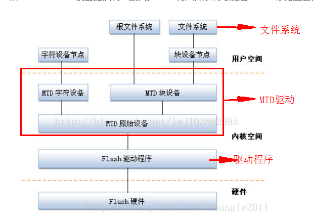
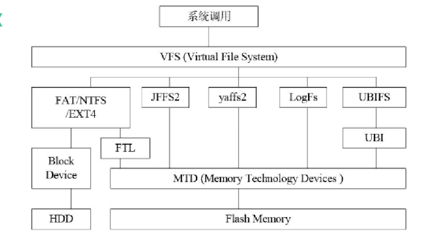

### ubi文件系统

#### 1. ubi文件系统简介

```
由于超大容量Nand Flash的普及,YAFFS等皆无法再去控制Nand Flash的空间，因此设计开发了UBI及其UBIFS文件系统，专门为了解决MTD(Memory Technology Device)设备所遇到的瓶颈。UBIFS通过子系统UBI处理与MTD device之间的动作，与JFFS2一样，UBIFS构建于MTD device之上，是一种用于大容量flash上的文件系统
```

#### 2. MTD驱动框架与ubi驱动框架

##### 2.1 MTD驱动框架



```
linux内核中,引入了MTD层为NOR Flash和Nand Flash设备提供统一的接口,MTD将文件系统与底层Flash存储进行了隔离。
Flash驱动层:
	Flash硬件驱动层负责对Flash硬件的读、写和擦除操作,MTD设备的Nand Flash芯片的驱动位于drivers/mtd/nand/子目录下,Nor Flash芯片驱动位于drivers/mtd/chips/子目录
	
MTD原始设备:
	用于描述MTD原始设备的数据结构是mtd_info,它定义了大量的关于MTD的数据和操作函数。其中mtdcore.c-MTD原始设备接口相关实现,mtdpart.c-MTD分区接口相关实现
	
MTD设备层:
	基于MTD原始设备,linux系统可以定出MTD的块设备和字符设备。mtdchar.c-MTD字符设备接口相关实现,mtdbblock.c-MTD块设备接口相关实现
	
设备节点:
	通过mknode在/dev子目录下建立MTD块设备节点和MTD字符设备节点,通过访问此设备节点即可访问MTD块设备和字符设备
```

##### 2.2 UBI驱动框架



```
ubifs工作于ubi之上,ubi工作用MTD之上
```

#### 3. 移植yaffs2文件系统

```makefile
(1)将yaffs2移植到目录内核fs目录下
fs/yaffs2

(2)修改fs目录下的Kconfig文件
source "fs/yaffs2/Kconfig"

(3)修改fs目录下的Makefile文件
obj-$(CONFIG_YAFFS_FS)          += yaffs2/

(4)在make menuconfig配置yaffs                                                 
Symbol: YAFFS_AUTO_YAFFS2 [=y]                                       
Prompt: Autoselect yaffs2 format  
  Defined at fs/yaffs2/Kconfig:81  #变量在哪里定义的                                   
  Depends on: YAFFS_YAFFS2                                           
  Location: #在make menuconfig中的位置                                                     
    -> File systems                                                  
      -> Miscellaneous filesystems                                   
        -> YAFFS2 file system support (YAFFS_FS [=y])                
          -> 2048 byte (or larger) / page devices (YAFFS_YAFFS2 [=y])
```

#### 4. ubi在内核中的配置

```makefile
(1)ubi驱动的配置
Device Drivers
	-> Memory Technology Device (MTD) support
		-> Enable UBI - Unsorted block images
		
(2)ubifs文件系统的配置
File systems
	-> Miscellaneous filesystems
		-> UBIFS file system support 
```

#### 5.ubifs文件文件系统的制作

[参考链接](https://blog.csdn.net/liuzijiang1123/article/details/49559607)

[参考链接](https://blog.csdn.net/dzw19911024/article/details/51220405/)

[参考链接](https://blog.csdn.net/yexiangcsdn/article/details/81198757)

```shell
(1)制作ubifs镜像 - make a ubifs file system image from an existing directory tree
/usr/sbin/mkfs.ubifs --> 该命令为主机上的命令,并非开发板上的命令

mkfs.ubifs -F -m 2048 -e 126976 -c 1960 -r rootfs -o img-256mb.ubifs

参数解释:
-m：最小输入输出大小为2KiB-2048bytes,一般为页大小
-e:逻辑可擦除块大小为124KiB=(每块的页数-2) * 页大小 = (64-2)*2KiB = 124KiB - 126976bytes
-c:最多逻辑可擦除块数目为1960(1960 * 128KiB) = 245MB
-r:文件系统的路径
-o:镜像文件名

(2)将ubifs镜像转换成可直接在flash上烧写的格式(带有ubi文件系统镜像卷标)
/usr/sbin/ubinize --> 该命令为主机上的命令,并非开发板上的命令

ubinize -p 131072 -m 2048 -s 2048 -O 2048 -o rootfs.ubifs img-256mb.ini

参数解释:
-m:最小输入出大小为2KiB(2049bytes),一般为页大小
-p:物理可擦除块大小为128KiB=每块的页数*页大小=64*2KiB=128KiB
-s:用于UBI头部信息的最小输入输出单元,一般与最小输入输出(-m)大小一样

img-256mb.ini文件内容如下:

[rootfs]                                                                                        
mode = ubi 
image = img-256mb.ubifs
vol_name = rootfs
vol_size=57MiB #根文件系统的大小,不能大于60M,参照下面rootfs分区的大小
vol_flags = autoresize
vol_type = dynamic
vol_alignment = 1
vol_id = 0

#修改uboot中的分区
include/configs/at91-sama5_common.h文件
//设置分区情况
#define CONFIG_BOOTARGS                                                 \
        "console=ttyS0,115200 earlyprintk "                             \
        "mtdparts=atmel_nand:256k(bootstrap)ro,512k(uboot)ro,"          \
        "256K(env),"                    \
        "512k(dtb),6M(kernel)ro,60M(rootfs),-(ziroom) "                         \
        "rootfstype=ubifs ubi.mtd=5 root=ubi0:rootfs"

//设置启动命令,启动命令中的地址要根据上面设置的参数确定		
#define CONFIG_BOOTCOMMAND              "nand read 0x21000000 0x100000 0x80000;"        \
                                        "nand read 0x22000000 0x180000 0x600000;"       \
                                        "bootz 0x22000000 - 0x21000000"
```

```shell
mkfs.ubifs的用法 
Usage: mkfs.ubifs [OPTIONS] target 
Make a UBIFS file system image from an existing directory tree 
Examples: 
Build file system from directory /opt/img, writting the result in the ubifs.img file 
        mkfs.ubifs -m 512 -e 128KiB -c 100 -r /opt/img ubifs.img 
The same, but writting directly to an UBI volume 
        mkfs.ubifs -r /opt/img /dev/ubi0_0 
Creating an empty UBIFS filesystem on an UBI volume 
        mkfs.ubifs /dev/ubi0_0 
Options: 
-r, -d, --root=DIR               build file system from directory DIR 
-m, --min-io-size=SIZE       minimum I/O unit size，最小输入输出大小 
-e, --leb-size=SIZE        logical erase block size逻辑可擦出块大小 
-c, --max-leb-cnt=COUNT    maximum logical erase block count最大逻辑可擦出块数目 
-o, --output=FILE        output to FILE输出文件名 
-j, --jrn-size=SIZE      journal size 
-R, --reserved=SIZE      how much space should be reserved for the super-user 
-x, --compr=TYPE        compression type - "lzo", "favor_lzo", "zlib" or 
                                  "none" (default: "lzo") 
-X, --favor-percent       may only be used with favor LZO compression and defines 
                                how many percent better zlib should compress to make 
                                mkfs.ubifs use zlib instead of LZO (default 20%) 
-f, --fanout=NUM         fanout NUM (default: 8) 
-F, --space-fixup         file-system free space has to be fixed up on first moun
                          (requires kernel version 3.0 or greater) 
-k, --keyhash=TYPE       key hash type - "r5" or "test" (default: "r5") 
-p, --orph-lebs=COUNT     count of erase blocks for orphans (default: 1) 
-D, --devtable=FILE       use device table FILE 
-U, --squash-uids         squash owners making all files owned by root 
-l, --log-lebs=COUNT     count of erase blocks for the log (used only for debugging) 
-v, --verbose             verbose operation 
-V, --version             display version information 
-g, --debug=LEVEL         display debug information (0 - none, 1 - statistics, 2 - files, 3 - more details) 
-h, --help               display this help text 
```

```shell
ubinize的用法
Usage: ubinize [-o filename] [-p <bytes>] [-m <bytes>] [-s <bytes>] [-O <num>] [-e 
<num>][-x  <num>]  [-Q  <num>]  [-v]  [-h]  [-V]  [--output=<filename>] 
[--peb-size=<bytes>]  [--min-io-size=<bytes>]  [--sub-page-size=<bytes>] 
[--vid-hdr-offset=<num>]  [--erase-counter=<num>]  [--ubi-ver=<num>] 
[--image-seq=<num>] [--verbose] [--help] [--version] ini-file 
Example: ubinize -o ubi.img -p 16KiB -m 512 -s 256 cfg.ini - create UBI image 
         'ubi.img' as described by configuration file 'cfg.ini' 
-o, --output=<file name>     output file name 
-p, --peb-size=<bytes>       size of the physical eraseblock of the flash 
                             this UBI image is created for in bytes, 
                              kilobytes (KiB), or megabytes (MiB) 
                              (mandatory parameter)物理可擦出块大小 
-m, --min-io-size=<bytes>    minimum input/output unit size of the flash 
                             in bytes 
-s, --sub-page-size=<bytes>  minimum input/output unit used for UBI 
                             headers, e.g. sub-page size in case of NAND 
                             flash (equivalent to the minimum input/output 
                             unit size by default)子页大小 
-O, --vid-hdr-offset=<num>   offset if the VID header from start of the 
                              physical eraseblock (default is the next 
                             minimum I/O unit or sub-page after the EC 
                             header)VID头部偏移量,默认是512 
-e, --erase-counter=<num>    the erase counter value to put to EC headers (default is 0) 
-x, --ubi-ver=<num>           UBI version number to put to EC headers  (default is 1) 
-Q, --image-seq=<num>        32-bit UBI image sequence number to use 
                             (by default a random number is picked) 
-v, --verbose                 be verbose 
-h, --help                   print help message 
-V, --version                 print program version 
```

#### 6. 对ubifs文件系统进行分区

```shell
对ubifs文件系统进行分区:
(1)步骤1:将分区和ubi相关联成ubi设备
/usr/sbin/ubiattach /dev/ubi_ctrl -m 6 

参数解释:
-m 6 对应着/dev/mtd6

#查看分区情况,具体把那个分区关联成ubi设设备
# cat /proc/mtd 
dev:    size   erasesize  name
mtd0: 00040000 00020000 "bootstrap"
mtd1: 00080000 00020000 "uboot"
mtd2: 00040000 00020000 "env"
mtd3: 00080000 00020000 "dtb"
mtd4: 00600000 00020000 "kernel"
mtd5: 03c00000 00020000 "rootfs"
mtd6: 0bc80000 00020000 "zihome"

(2)步骤2:将ubi设备划分逻辑卷
/usr/sbin/ubimkvol /dev/ubi1 -s 177MiB -N zihome

-s:分区的大小
-N:逻辑卷的名字

# 查看逻辑情况
# ls -al /dev | grep ubi
crw-rw----    1 root     root      250,   0 Jan  1  1970 ubi0
crw-rw----    1 root     root      250,   1 Jan  1  1970 ubi0_0
crw-rw----    1 root     root      249,   0 Jun  9 03:23 ubi1
crw-rw----    1 root     root      249,   1 Jun  9 03:23 ubi1_0
crw-rw----    1 root     root       10,  59 Jan  1  1970 ubi_ctrl

# ls -al sys/class/ubi/
total 0
drwxr-xr-x    2 root     root             0 Jun  9 03:23 .
drwxr-xr-x   31 root     root             0 Jun  9 03:23 ..
lrwxrwxrwx    1 root     root             0 Jun  9 03:23 ubi0 -> ../../devices/virtual/ubi/ubi0
lrwxrwxrwx    1 root     root             0 Jun  9 03:23 ubi0_0 -> ../../devices/virtual/ubi/ubi0/ubi0_0
lrwxrwxrwx    1 root     root             0 Jun  9 03:23 ubi1 -> ../../devices/virtual/ubi/ubi1
lrwxrwxrwx    1 root     root             0 Jun  9 03:23 ubi1_0 -> ../../devices/virtual/ubi/ubi1/ubi1_0
-r--r--r--    1 root     root          4096 Jun  9 03:23 version

# ubinfo /dev/ubi1
ubi1
Volumes count:                           1
Logical eraseblock size:                 126976 bytes, 124.0 KiB
Total amount of logical eraseblocks:     1504 (190971904 bytes, 182.1 MiB)
Amount of available logical eraseblocks: 2 (253952 bytes, 248.0 KiB)
Maximum count of volumes                 128
Count of bad physical eraseblocks:       4
Count of reserved physical eraseblocks:  36
Current maximum erase counter value:     3
Minimum input/output unit size:          2048 bytes
Character device major/minor:            249:0
Present volumes:                         0

# ubinfo /dev/ubi1_0
Volume ID:   0 (on ubi1)
Type:        dynamic
Alignment:   1
Size:        1462 LEBs (185638912 bytes, 177.0 MiB)
State:       OK
Name:        zihome
Character device major/minor: 249:1

(3)步骤3:挂载
/bin/mount -t ubifs /dev/ubi1_0 /zihome

# 查看结果最终的挂载结果
# mount
ubi0:rootfs on / type ubifs (rw,relatime)
devtmpfs on /dev type devtmpfs (rw,relatime,size=93436k,nr_inodes=23359,mode=755)
proc on /proc type proc (rw,relatime)
devpts on /dev/pts type devpts (rw,relatime,gid=5,mode=620)
tmpfs on /dev/shm type tmpfs (rw,relatime,mode=777)
tmpfs on /tmp type tmpfs (rw,relatime)
tmpfs on /run type tmpfs (rw,nosuid,nodev,relatime,mode=755)
sysfs on /sys type sysfs (rw,relatime)
ubi1_0 on /zihome type ubifs (rw,relatime)

#卸载操作

# 卸载分区
umount /zihome
# 删除逻辑分区
ubirmvol /dev/ubi1 -N zihome
# 将设备节点与ubi设备进行去连接
ubidetach /dev/ubi_ctrl -m 6 

```


