### 根文件系统制作

#### 1. busybox

##### 1.1 busybox简介

内核启动成功后，启动了第一个应用程序init,从而我们就可以输入ls、cp、vi等命令了，这些其实都是一个应用程序，命令都放大/bin、/sbin目录中

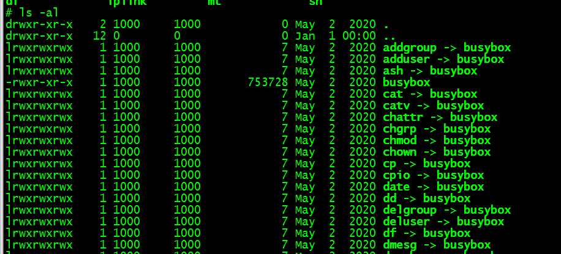

发现所有命令都是放在busybox中，linux是借助busybox来实现这些命令，除命令以外，init进程同样也是放在busybox中，因此制作根文件系统必须要busybox，如下图所示:

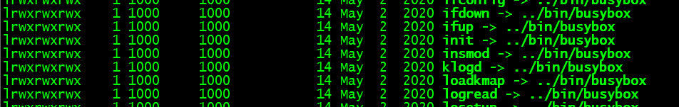

##### 1.2 init进程分析

```shell
#总体分析思路
其中ls命令就位于ls.c文件中,cp命令就位于cp.c文件中,同样的init进程就位于init.c文件中
执行这些命令或者进程,最终调用它们自己的文件中xx_main()函数。
所以分析init进程就分析init.c文件中的init_main()函数
```

```shell
init进程:除了启动第一个应用程序(/linuxrc或者/sbin/init等),还要启动用户的应用程序(例如启动摄像,视频等),那么就需要:
(1)读取配置文件(一般放在linux中/etc目录下, /etc/inittab)
(2)解析配置文件
(3)最后执行用户的应用程序(里面的各个子进程)

其中配置文件说明在busybox-1.7.0/examples/inittab中,通过inittab分析得出:

#什么应用,在什么情况下执行开始执行
inittab配置文件格式如下:
Format for each entry: <id>:<runlevels>:<action>:<process>

参数如下:
id:  id 会等于/dev/id, 用做终端(标准输入、标准输出以及标准错误) ，这个可以不需要设置，因为/etc/console已经设为标准输入输出了，如不设置就等于dev/null，则从控制台输入输出。

runlevels:可以被忽略

#重要参数
action: 运行时机，指应用程序何时(action)行动,它的参数有(参数必须小写):

sysinit(用来初始化时启动),
respawn(每当相应的进程终止运行时,该进程就会重新启动),
askfirst(每次启动进程之前等待用户按下enter键),
wait(告诉init必须等到相应的进程执行完成之后才能继续执行),
once(仅执行相应的进程一次，而且不会等待它执行完成),
restart(当重新读取分析inittab配置文件时，会执行相应进程),
ctrlaltdel(当按下Ctrl+Alt+Delete组合键时，会执行相应进程),
andshutdown(该进程用于系统关机时执行)

#重要参数
process:应用程序或者脚本, 就是要启动的进程(如果有“-”字符,说明这个程序被称为”交互的”)。
```

init_main整体流程

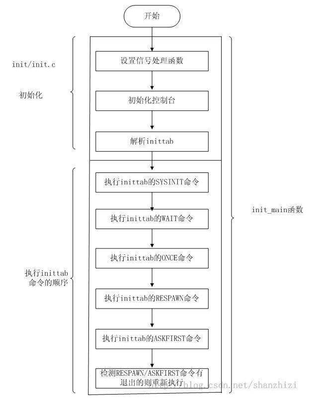

##### 1.2.1 先分析init_main()前部分如何读取解析配置文件

init_main()部分代码如下:

```c
int init_main(int argc, char **argv)
{
 ... ...
 console_init();                //初始化控制台，在init_post()中只是打开了控制台设备
 ... ...
 if (argc > 1      //在init_post()中执行的”_init_process("/sbin/init");”,所以argc=1, argv=/sbin/init
        && (!strcmp(argv[1], "single") || !strcmp(argv[1], "-s") || LONE_CHAR(argv[1], '1')))
     {... ...}                   //此处省略,因为不执行
 else {       
      parse_inittab();              //argc==1,执行else,读取解析init 表(解析配置文件)
       }

.... ...                               //运行应用程序

}
```

通过函数名称可以猜测出,上面代码中parse_inittab()就是实现解析init表的

##### 1.2.2 接下来分析parse_inittab();函数是怎么读取解析init表:

由于argc=1,所以会进入到parse_inittab()中，该函数代码如下:

```c
#define INITTAB      "/etc/inittab"           //定义INITTAB=/etc/inittab
static void parse_inittab(void)
{
file = fopen(INITTAB, "r");  //找到INITTAB定义,显然是打开 /etc/inittab 配置文件

/* 如果/etc/inittab无法打开,则调用new_init_action进行一些默认的操作配置 */
if (file == NULL) {         
     new_init_action(CTRLALTDEL, "reboot", "");
     new_init_action(SHUTDOWN, "umount -a -r", "");
   if (ENABLE_SWAPONOFF) new_init_action(SHUTDOWN, "swapoff -a", "");
     new_init_action(RESTART, "init", "");
     new_init_action(ASKFIRST, bb_default_login_shell, "");
     new_init_action(ASKFIRST, bb_default_login_shell, VC_2);
     new_init_action(ASKFIRST, bb_default_login_shell, VC_3);
     new_init_action(ASKFIRST, bb_default_login_shell, VC_4);
     /* sysinit */
     new_init_action(SYSINIT, INIT_SCRIPT, "");
     return ;
     }

/* while一直循环解析file文件将里面的内容一行一行读出来，然后调用new_init_action进行操作*/
while (fgets(buf, INIT_BUFFS_SIZE, file) != NULL) {  
                   /* Skip leading spaces */
                   for (id = buf; *id == ' ' || *id == '\t'; id++);
                   /* Skip the line if it's a comment */
                   if (*id == '#' || *id == '\n')
                           continue;
                           ... ...
new_init_action(a->action, command, id);        //读完后调用new_init_action
     }}
```

显然parse_inittab()函数任务就是将配置文件内容读出来，然后调用**new_init_action**解析配置文件.

如果,上面函数中file == NULL,会配置出什么来?默认的配置文件里内容又是什么?

##### (1)首先我们分析new_init_action()函数

我们以上面的new_init_action(ASKFIRST, bb_default_login_shell, VC_2);为例来分析:

其中该函数定义为:

```c
new_init_action(int action, const char *command, const char *cons)
{... ...}
```

首先搜索这3个实参 ASKFIRST, bb_default_login_shell, VC_2:

其中ASKFIRST=0X04；

 bb_default_login_shell[]="-/bin/sh"

 VC_2= "/dev/tty2"

其中参数定义:

0X04(action): 等于配置文件的action(运行时机，指应用程序何时(action)行动)

"-/bin/sh"(*command): 等于配置文件的process(应用程序)

"/dev/tty2"( *cons) :等于配置文件的id (终端,这里使用的tty2终端)

接下来分析new_init_action(0x04,"-/bin/sh","/dev/tty2")函数:

```c
# define bb_dev_null "/dev/null"                 //定义bb_dev_null等于"/dev/null"
static struct init_action *init_action_list = NULL;     //定义init_action型结构体链表

static void new_init_action(int action, const char *command, const char *cons)  //函数开始
{
/*
先介绍init_action结构体,定义如下:
struct init_action {
struct init_action *next;      //指向下一个init_action结构体,用于链表
int action;                       //执行时机,用于何时执行
pid_t pid;                       //process id(进程号)
char command[INIT_BUFFS_SIZE];  //应用程序或者脚本, 就是要启动的进程。
char terminal[CONSOLE_NAME_SIZE]; //终端
};
*/

/*定义init_action型指针, *new_action:指新的结构体*/
struct init_action *new_action, *a, *last;       

/*判断cons是否 "/"开头 */
if (strcmp(cons, bb_dev_null) == 0 && (action & ASKFIRST))
           return; 

/* a和last都等于init_action_list 链表,a始终指向下一个结构体,查找是否有相同的command和termin*/
     for (a = last = init_action_list; a; a = a->next)
   {
         /*找到有相同的command和termin,则只更新action执行时机参数,并return*/
       if ((strcmp(a->command, command) == 0)&& (strcmp(a->terminal, cons) == 0))
       {a->action = action;
       return;}

     /*更新last,等于上一个init_action 结构体*/
        last = a;
   }

new_action = xzalloc(sizeof(struct init_action));  //为new_action分配内存,使它成为静态变量,不释放
if (last) {       //last!=NULL,说明init_action_list当前有内容，将链表下一个节点等于new_action
           last->next = new_action;           }
   else {      //last==NULL，说明init_action_list里面还没有内容,直接将链表等于new_action
         init_action_list = new_action;           }
strcpy(new_action->command, command);  //更新当前链表里的command
new_action->action = action;             //更新链表里的action
strcpy(new_action->terminal, cons);      //更新链表里的command
messageD(L_LOG | L_CONSOLE, "command='%s' action=%d tty='%s'\n",
new_action->command, new_action->action, new_action->terminal);
}
```

所以new_init_action()解析配置文件,就是将配置文件中的配置格式放在init_action链表中.

##### (2)然后通过new_init_action()函数反推出parse_inittab()函数中file==NULL情况下的默认配置文件:

其中配置文件格式: <id>:<runlevels>:<action>:<process>

**id**: **id** 会等于/dev/id, 用做终端,可以忽略使用从控制台输入输出。  

**runlevels**:可以被忽略

**action**: 运行时机，指应用程序何时(action)行动，它有sysinit, respawn, askfirst, wait, once,restart, ctrlaltdel, andshutdown.这些值可选择。

**process**:应用程序或者脚本, 就是要启动的进程。

**(2.1)** 然后逐步反推代码:

```c
if (file == NULL) {         

/*ID为空, runlevels忽略, action= ctrlaltdel, process= reboot */
new_init_action(CTRLALTDEL, "reboot", "");     

/*ID为空, runlevels忽略, action= shutdown, process= umount -a -r */
new_init_action(SHUTDOWN, "umount -a -r", ""); 

/* ENABLE_SWAPONOFF 未定义,不分析*/if (ENABLE_SWAPONOFF) new_init_action(SHUTDOWN, "swapoff -a", "");  

/*ID为空, runlevels忽略, action= restart, process= init */
new_init_action(RESTART, "init", ""); 

/*ID为空, runlevels忽略, action= askfirst, process= -/bin/sh */
/* 其中bb_default_login_shell ="-/bin/sh" */
new_init_action(ASKFIRST, bb_default_login_shell, "");
 
/*ID=/dev/tty2, runlevels忽略, action= askfirst, process=-/bin/sh */
new_init_action(ASKFIRST, bb_default_login_shell, VC_2); //VC_2= "/dev/tty2"
 
/* ID=/dev/tty3, runlevels忽略, action= askfirst, process=-/bin/sh */
new_init_action(ASKFIRST, bb_default_login_shell, VC_3);  // VC_3= "/dev/tty3"
 
/* ID=/dev/tty4,runlevels忽略, action= askfirst, process=-/bin/sh */
new_init_action(ASKFIRST, bb_default_login_shell, VC_4); // VC_4= "/dev/tty3"
 
/* sysinit */
/*ID为空, runlevels忽略, action= sysinit, process= etc/init.d/rcS */

new_init_action(SYSINIT, INIT_SCRIPT, ""); //INIT_SCRIPT="etc/init.d/rcS"

return ;
}
```

**(2.2)**根据配置文件格式<id>:<runlevels>:<action>:<process>,得出最终默认的配置文件内容如下:

```c
:: ctrlaltdel:reboot          //当按下Ctrl+Alt+Delete组合键时，会执行reboot

:: shutdown:umount -a -r      //  告诉init，在系统关机的时候执行umount命令卸载所有文件系统，失败则以读模式安装

:: restart:init                //init重启时，指定执行init进程

:: askfirst: -/bin/sh             //启动-/bin/sh之前不显示，等待用户按enter键

/dev/tty2:: askfirst:-/bin/sh      //启动tty2的-/bin/sh之前在终端tty2上显示信息，并等待用户按enter键

/dev/tty3:: askfirst:-/bin/sh      //启动tty3的-/bin/sh之前在终端tty3上显示信息，并等待用户按enter键

/dev/tty4:: askfirst:-/bin/sh      //启动tty4的-/bin/sh之前在终端tty4上显示信息，并等待用户按enter键

:: askfirst:etc/init.d/rcS        //启动etc/init.d/rcS之前不显示，并等待用户按enter键
```

从上面发现init进程里分了很多个子进程,每个子进程都需要3样:

id(可以为空),action(运行时机,必须小写),process(指定要运行的应用程序位置)

parse_inittab()函数到这里就分析完毕,它主要就是将配置文件读出来解析，然后放在链表init_action_list中

##### 3.2 接下来继续分析int_main()后面如何运行应用程序的，简写代码如下:

```c
int init_main(int argc, char **argv)
{
 ... ...
 console_init();                //初始化控制台，在init_post()中只是打开了控制台设备
 ... ...

if (argc > 1      //在init_post()中执行的”_init_process("/sbin/init");”,所以argc=1, argv=/sbin/init
        && (!strcmp(argv[1], "single") || !strcmp(argv[1], "-s") || LONE_CHAR(argv[1], '1')))
{... ...}                   //此处省略,因为不执行
 else {       
                 parse_inittab();              //读取解析init 表(解析配置文件)
       }
....
  
/* First run the sysinit command */
run_actions(SYSINIT);    /*首先运行系统初始化的链表节点(SYSINIT:等待运行结束为止)*/
/* Next run anything that wants to block */
run_actions(WAIT);      //运行 action = WAIT的链表节点(WAIT:等待运行结束为止)
/* Next run anything to be run only once */
run_actions(ONCE);           //运行 action = ONCE的链表节点(ONCE:不会等待运行)
while (1) {
  run_actions(RESPAWN);    //运行 action = RESPAWN的链表节点(pid==0时才能运行) 
  run_actions(ASKFIRST); //运行action = ASKFIRST的链表节点(pid==0时才能运行,且还需要等待回车)

  sleep(1);                  //让CPU等待会儿
  wpid = wait(NULL);        //等待上面两个的子进程退出

  while (wpid > 0)              //退出后设置pid=0，然后while重新运行RESPAWN&& ASKFIRST
    { a->pid = 0;}           
      }

}
```

从上面得出run_actions()函数就是用来链表节点里的应用程序.

且 ASKFIRST和 RESPAWN会在while中一直运行.

##### 3.3分析上面run_actions ()函数是怎么运行链表节点的,代码如下:

```c
static void run_actions(int action)       //执行时机参数
{
  struct init_action *a, *tmp;
   for (a = init_action_list; a; a = tmp)            //从链表init_action_list中循环查找
  {tmp = a->next;                           //指向下一个链表的节点
     if (a->action == action)                    //找到相同名称的action节点了
    {        if (a->terminal[0] && access(a->terminal, R_OK | W_OK))
         { delete_init_action(a);}   //已经使用过该应用程序,从链表中删除

            /* SYSINIT|WAIT|CTRLALTDEL|SHUTDOWN|RESTART这些的应用程序都需要等待执行完毕 */
        else if (a->action & (SYSINIT | WAIT | CTRLALTDEL | SHUTDOWN | RESTART))
        {  waitfor(a, 0); //(0:ID号为空) 执行a节点的应用程序,然后等待它执行完毕      
          delete_init_action(a);  //然后从链表init_action_list中删除(delete)
        } 
        else if (a->action & ONCE) //action(运行时机)=ONCE时，不需要等待执行完毕
       {run(a);                    //创建子进程后即删除该节点
        delete_init_action(a);        }         
         //action(运行时机)= RESPAWN | ASKFIRST时，也不需要等待执行完毕
         else if (a->action & (RESPAWN | ASKFIRST))
       { if (a->pid == 0) {a->pid = run(a);}  }    //a->pid==0才run(a)创建子进程
    }
  }
}
```

通过上面代码分析出执行waitfor()时,需要等待应用程序执行完毕,

执行run()时,不需要等待.

**3.4先分析上面waitfor(a, 0)函数是怎么实现执行应用程序然后等待的?**

waitfor代码如下:

```c
static int waitfor(const struct init_action *a, pid_t pid) //*a:链表中的一个节点
{
         int runpid;
         int status, wpid;
         /*run(a):创建<process>子进程(运行应用程序)*/
         runpid = (NULL == a)? pid : run(a);  //当a==NULL,runpid=pid=0,否则runpid=run(a).
         while (1) {
                   wpid = waitpid(runpid, &status, 0);  //等待应用程序执行完毕
                   if (wpid == runpid)
                            break;
                   if (wpid == -1 && errno == ECHILD) {
                            /* we missed its termination */
                            break;
                   }

                   /* FIXME other errors should maybe trigger an error, but allow
                    * the program to continue */
         }
         return wpid;
}
```

最终waitfor还是调用的run(a),所以这些所有节点都会调用run(a)来创建<process>子进程(运行应用程序).然后在while中循环运行action=(RESPAWN| ASKFIRST)的节点

**3.2.3 , 除了没分析run(a)以外,RESPAWN和ASKFIRST还是没懂什么不同.**

RESPAWN和ASKFIRST到底有什么不同,就需要分析run(a)了

```c
static pid_t run(const struct init_action *a) //*a:链表中的一个节点   
{
 .. ...
     if (a->action & (SYSINIT | WAIT | CTRLALTDEL | SHUTDOWN | RESTART)) 
          {... ...}        //只分析RESPAWN和ASKFIRST有什么不同,所以此处省略
     if (a->action & ASKFIRST)  //action==ASKFIRST的时候
      {
         /*打印\nPlease press Enter to activate this console.(请按回车键启动控制台.)*/
       tatic const char press_enter[] ALIGN1 ="\nPlease press Enter to activate this console. ";
       char c;
       ... ...
       while (read(0, &c, 1) == 1 && c != '\n');  //一直等待用户回车
       }

BB_EXECVP(cmdpath, cmd);          //创建子进程

}
```

从上面分析出,当执行action=RESPAWN时,只创建子进程,而action=ASKFIRST时,需要一直等待用户回车才创建子进程

#### 2. 配置编译busybox

##### 2.1 配置busybox

**配置交叉工具链**

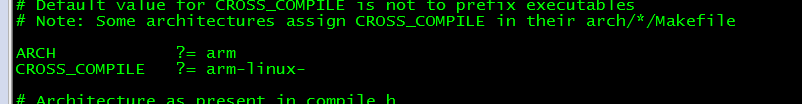

**配置:make menuconfig**
(1)在library Tuning子菜单中设置tab键补齐

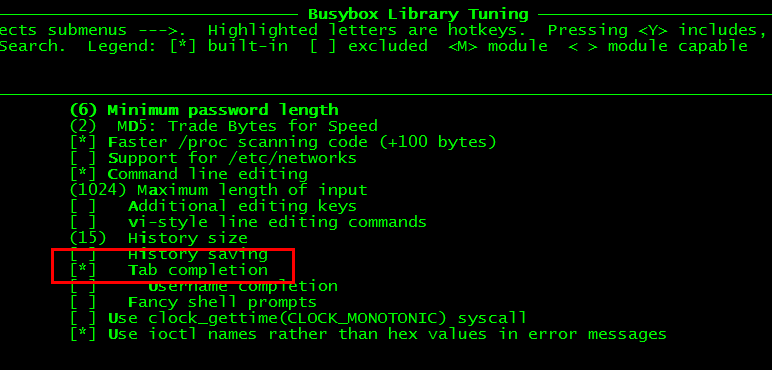

(2)取消静态连接

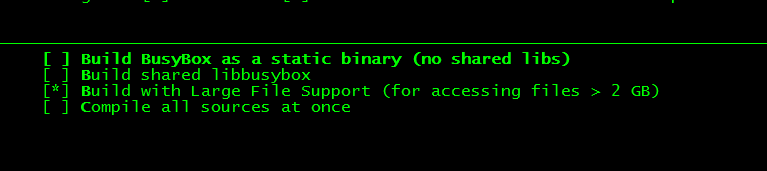

因为使用库函数glibc时，如果 静态编译busybox，当make时会报错，库函数glibc要放到/lib目录下

(3)选择tar命令

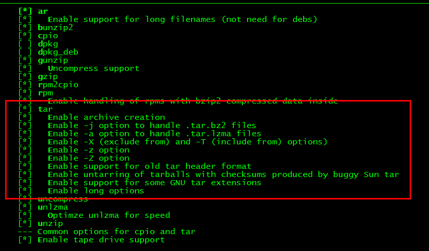

(4)选择insmod、rmmod、lsmod

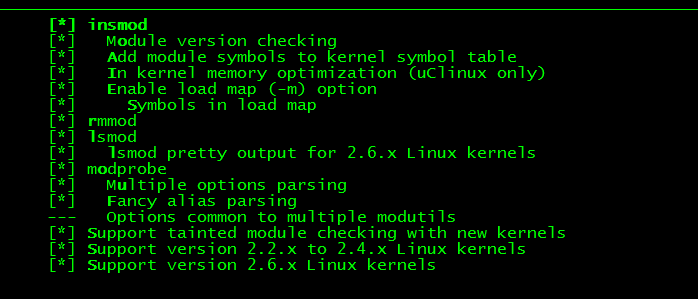

(5)支持mdev(并支持mdev.conf和热插拔)，选择mount/umont命令(并支持NFS文件系统)

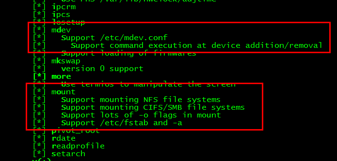

(6)选择支持ifconfig命令

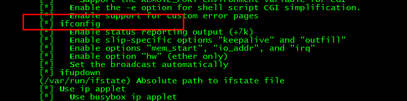

##### 2.2 编译

```shell
make
```

##### 2.3 安装

```shell
#安装到指定目录,不能直接执行命令make install

make CONFIG_PREFIX=/work/nfs_root/mini_fs install

bin包含用户工具，包括了大部分命令,该子目录下所有文件指向busybox
sbin目录包含操作系统工具，同样也指向busybox
linuxrc是一个链接文件，指向busybox
```

#### 3. 最小根文件系统的制作

根文件系统是一些目录和文件,jffs2或者yaffs2是文件系统类型

```
制作最小的根文件系统至少需要以下几步:
(1)/dev/console - 终端控制台，提供标准输入、标准输出以及标准错误
   /dev/null - 所有写到这个文件中的数据都会被丢弃掉
(2)init进程程序 - 在busybox中
(3)/etc/inittab - 用于init进程读取配置，然后执行inittab里面指定的应用程序
(4)应用程序 - 被inittab配置文件调用的应用程序
(5)C库 - glibc(被应用程序调用的C库函数)
```

##### 3.1 创建终端(/dev/console /dev/null)

##### 3.1.1 输入ls /dev/console /dev/null -l 查看pc机上终端的设备号:

```shell
crw-------   1 root root      5,   1 2020-05-13 17:23 console
crw-rw-rw-   1 root root      1,   3 2020-05-13 17:22 null

得出:/dev/console主设备号=5，次设备号=1
     /dev/null  主设备号=1，次设备号=3
```

##### 3.1.2 根据上面得出的设备号,创建console和null字符设备文件

```shell
mkdir dev                 #先在mini_fs目录下创建个dev目录(设备都放在dev目录下)
cd dev/

sudo mknod –m 660  console c 5 1    #创建console字符设备,设置权限用户和组都能读写
sudo mknod –m 660 null c 1 3    #创建null 字符设备, 设置权限用户和组都能读写
```

##### 3.1.3 构造/etc/inittab (执行inittab里的指定应用程序)

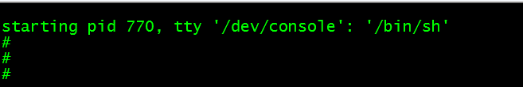

```shell
mkdir etc          //在mini_fs目录下创建个etc目录
vi  etc/inittab       //创建inittab文件

inittab里添加内容:
console::askfirst:-/bin/sh      //action值必须小写  id可以写成/dev/xx或xx
表示action= askfirst(每次启动/bin/sh进程之前等待用户按下enter键),然后指定/bin/sh的终端对应/dev/console字符设备
```

##### 3.1.4 安装glibc库

```shell
mkdir lib              #在mini_fs目录下创建个lib目录 (存放库函数)

cd /work/tools/gcc-3.4.5-glibc-2.3.6/arm-linux/lib     #进入源目录

cp *.so* /work/nfs_root/mini_fs/lib -d        #复制glibc库到lib目录(*:匹配符,-d:保持链接)
```

##### 3.1.5 使用mkyaffs2image制作文件系统(yaffs1针对小页512B,yaffs2针对大页2KB)

```shell
#生成mkyaffs2image工具
在/work/system目录中 有一个压缩文件yaffs_source_util_larger_small_page_nand.tar.bz2(保存了yaffs1和yaffs2)
tar –xjf  yaffs_source_util_larger_small_page_nand.tar.bz2    //解压
解压得到Development_util_ok,里面就有yaffs1和yaffs2,如下图:

#然后,进入yaffs2/utils,执行make 命令生成mkyaffs2image工具,将它复制到usr/local/bin目录:

cd yaffs2/utils
make
sudo cp mkyaffs2image /usr/local/bin
sudo chmod +x /usr/local/bin/ mkyaffs2image                //添加可执行属性
```

##### 3.1.6 mkyaffs2image制作yaffs2文件系统

```shell
cd /work/nfs_root               //进入文件系统目录上一层

mkyaffs2image  mini_fs  mini_fs.yaffs2      //将mini_fs文件系统制作成mini_fs.yaffs2映像文件系统
```

烧写根文件系统：当系统启动完成后,出现下图所示的内容，表明烧写成功

```shell
刚好对应inittab配置文件中内容：console:: askfirst:-/bin/sh

askfirst: 启动/bin/sh进程之前等待用户按下enter键 
```


##### 3.1.7 完善系统 - proc虚拟文件系统

通过proc虚拟文件系统挂接到proc目录,然后当前进程的信息会以文件的形式保存到proc目录,就可以用ps命令来查看内存中当前进程的状态了

```shell
mkdir proc                    #创建proc目录
mount –t proc none /proc      #挂载proc,  none:表示运行mount命令时显示proc相关的输出
```

接下来就可以使用ps命令了,如下图:

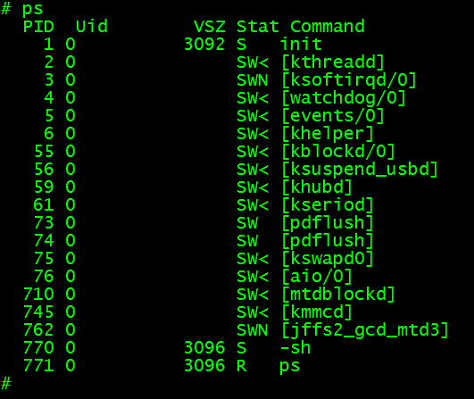

这里的PID进程号都以文件的形式存在了/proc目录里，例如cd proc/1 ,进入init进程(init进程是内核第1个挂载的进程),如下图

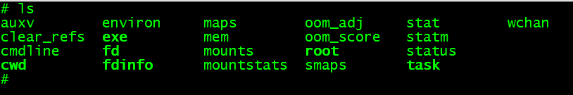

其中fd文件就是保存init进程的3个文件描述符--标准输入(0)、标准输出(1)以及标准错误(2)

通过ls –l fd  可以看出这3个文件描述符都指向/dev/console控制台,如下图:

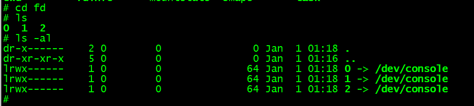

inittab配置文件中追加内容，避免手动mount挂载proc

```shell
方法1:
在inittab里追加内容:
::sysinit:/etc/init.d/rcS          #将/etc/init.d/rcS脚本设置成系统的初始化文件
mkdir -p etc/init.d
vi etc/init.d/rcS, #添加一行命令(也可以添加其它命令)
mount -t proc none /proc      #挂载proc(前提根文件系统有proc目录)
sudo chmod +x etc/init.d/rcS               //使脚本rcS能够执行命令

方法2:
mount -a  #作用是加载文件/etc/fstab中配置的所有设备，它会依赖一个配置文件/etc/fstab
vi etc/init.d/rcS #添加一行命令
mount -a      #加载文件/etc/fstab中配置的所有设备
vi  etc /fstab, #然后创建fstab文件,添加内容:

#device   mount-point  type     options   dump   fsck order
proc       /proc       proc     defaults   0       0

#通过cat proc/mounts 命令就可以查看当前挂载proc虚拟文件系统:
# cat /proc/mounts 
rootfs / rootfs rw 0 0
/dev/root / jffs2 rw 0 0
proc /proc proc rw 0 0
sysfs /sys sysfs rw 0 0
tmpfs /dev tmpfs rw 0 0
devpts /dev/pts devpts rw 0 0
```

##### 3.1.8 完善系统 - 使用mdev自动挂载/dev下创建设备节点

现在dev下只有2个字符设备，如果大量增加设备的话，手动创建太麻烦，可以使用udev，mdev是udev的一个迷你版，它的主要功能是管理/dev目录底下的设备节点，他同时也是用来接替devfs及热插拔的功能

```shell
#创建sysfs、devpts要挂载的目录
mkdir   /sys                     #创建sysfs要挂载的目录
mkdir   /dev/pts                 #创建devpts要挂载的目录

#vi etc/init.d/rcS, 
echo /sbin/mdev > /proc/sys/kernel/hotplug  #设置内核，当有设备拔插时调用/sbin/mdev程序
mdev -s                      #在/dev目录下生成内核支持的所有设备的节点
#####################################################################################
#vi  etc /fstab,添加sysfs、tmpfs、pevpts挂载内容:
#mount -t proc none /proc
proc       /proc        proc   defaults  0    0
#mount -t sysfs sysfs /sys
sysfs     /sys      sysfs      defaults   0       0
#使用内存文件系统，减少对flash的读写
#mount -t tmpfs mdev /dev替代
tmpfs     /dev      tmpfs      defaults   0       0
#mount -t devpts devpts /dev/pts
devpts    /dev/pts   devpts     defaults   0       0
```

```
sysfs是管理虚拟系统，为udev提供设备入口和uevent通道，sysfs类型,需要挂载到/sys目录下
tmpfs是内存文件系统，tmpfs类型，需要挂载到/dev目录下
devpts是内核虚拟系统，管理员通过文件系统和内核进行读写的一种渠道，devpts类型，需要挂载到/dev/pts目录下
```

##### 3.1.9 制作jff2文件系统

```shell
(1)zlib(压缩动态库) - mkfs.jff2依赖zlib库
cd /work/GUI/xwindow/X/deps
tar -xzf zlib-1.2.3.tar.gz
cd zlib-1.2.3
./configure --shared --prefix=/usr  #配置安装动态库(shared)到指定(prefix)的/usr目录下
make            					#编译
sudo make install         			#安装

(2)然后编译mkfs.jffs2工具
cd /work/tools
tar -xjf mtd-utils-05.07.23.tar.bz2
cd mtd-utils-05.07.23/util
make
sudo make install

(3)制作jffs2文件系统

cd /work/nfs_root                   #准备制作子目录mini_fs

mkfs.jffs2 -n  -s 2048  -e 128KiB  -d mini_fs  -o mini_fs.jffs2

#-n:表示每块不添加清除标记,-s:size一页大小为2k,-e:一块大小为128kb
#-d:制作的dir目录,-o:输出文件

(4)并设置bootargs参数为jffs2启动
在uboot中输入:
setenv bootargs noinitrd  root=/dev/mtdblock3 rootfstype=jffs2  init=/linuxrc console=ttySAC0
#rootfstype:将root file system type(根文件系统类型)强制设为jffs2
saveenv

(5)烧写完文件系统,启动后查看日志信息,可以看到挂接的为jff2文件系统
VFS: Mounted root (jffs2 filesystem).
```

##### 3.2.0 使用nfs挂载虚拟机目录

```shell
#通过该项功能,可以在虚拟机上将需要的文件放到挂载的目录下,而不必将文件放到拖入到开发板上
(1)确定板子是否与虚拟机位于同一网段，只有开发板和虚拟机网络能够网络互通才能使用nfs功能
ifconfig eth0 up                 #开启网关0,连接网线到路由器
ifconfig eth0 192.168.0.107      #设置ip
ping 192.168.0.106             	 #与虚拟机ping一下，是否已通

(2)确定虚拟机是否能被允许挂载目录
#首先要使虚拟机能够被别人挂载目录,在/etc/exports中添加需要被挂载的目录即可
sudo vi /etc/exports            
#添加以下一段内容:
/work/nfs_root/mini_fs   *(rw,sync,no_root_squash)  #添加挂载目录:/work/nfs_root/mini_fs
sudo  /etc/init.d/nfs-kernel-sever  restart         #然后重启nfs服务

(3)将板子内核来挂载虚拟机目录
mkdir  /mnt                  #创建要挂载的目录
mount -t nfs -o nolock,vers=2 192.168.0.106:/work/nfs_root/mini_fs     /mnt
#将远端虚拟机/work/nfs_root/mini_fs目录挂载到开发板/mnt目录里
然后板子内核的/mnt目录就是虚拟机/work/nfs_root/mini_fs目录了
```

##### 3.2.1使用nfs作为根文件系统启动

```shell
#通过设置u-boot的bootargs来更改开机自动进入nfs文件系统，文件系统在虚拟机上,而不是开发板上,不需要mount指令
#进入uboot,输入:
setenv  bootargs  noinitrd  root=/dev/nfs  nfsroot=192.168.0.106:/work/nfs_root/mini_fs ip=192.168.0.107:192.168.0.106:192.168.0.1:255.255.255.0::eth0:off   init=/linuxrc console=ttySAC0            

saveenv                                            #保存参数

#192.168.0.106为服务器ip
#192.168.0.107为开发板ip

然后重启开发板进入内核,就启动nfs文件系统了
VFS: Mounted root (nfs filesystem).
```

```shell
#总结
	(1)init函数 --> inittab文件 --> rcS文件 --> fstab文件
	 a. init函数读取，解析inittab，并执行inittab中写好的应用
	 b. inittab中要执行的应用存放在rcS文件中
	 c. rcS中有mount -a命令会挂载各种虚拟文件系统,挂载的虚拟文件系统定义在fstab中
```

