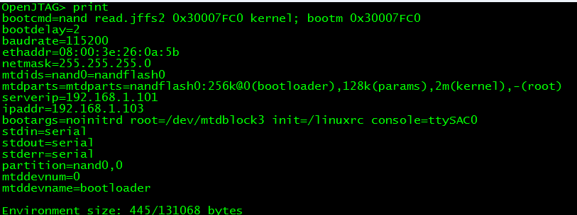
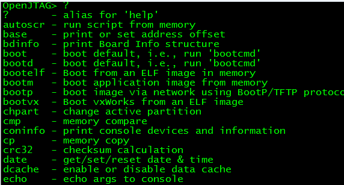
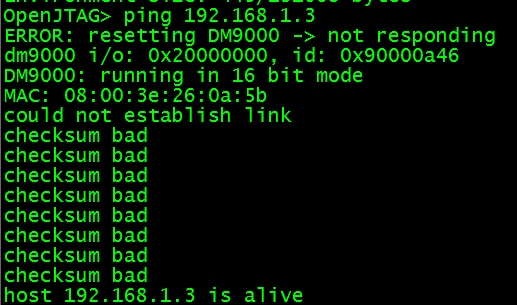
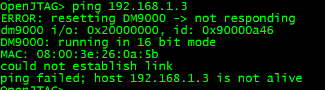

### uboot知识点

#### 1. uboot中环境变量 - 输入命令print

| **环境变量**  | **作用描述**                 |
| ------------- | ---------------------------- |
| **bootdelay** | **执行自动启动的等候秒数**   |
| **baudrate**  | **串口控制台的波特率**       |
| **netmask**   | **以太网接口的掩码**         |
| **ethaddr**   | **以太网卡的网卡物理地址**   |
| **bootfile**  | **缺省的下载文件**           |
| **bootargs**  | **传递给内核的启动参数**     |
| **bootcmd**   | **自动启动时执行的命令**     |
| **serverip**  | **服务器端的****ip****地址** |
| **ipaddr**    | **本地****ip****地址**       |
| **stdin**     | **标准输入设备**             |
| **stdout**    | **标准输出设备**             |
| **stderr**    | **标准出错设备**             |



#### 2. uboot中常用命令 - 输入命令?

https://blog.csdn.net/weixin_40405692/article/details/83048644



```shell
#内存操作指令
#显示内存中的数据
#指令 内存地址 个数
md 0x30000000 10
30000000: c0000000 c0000000 c0000008 c0000008    ................
30000010: c0000010 c0000010 c0000018 c0000018    ................
30000020: c0000020 c0000020 c0000028 c0000028     ... ...(...(...
30000030: c0000030 c0000030 c0000038 c0000038    0...0...8...8...
#往内存中写入数据
#指令 内存地址 数据 个数
mw 0x30000000 0 10

#nand flash操作指令
#从nandflash中读取数据到内存中
指令  内存中地址  Flash内地址 写入长度
nand read  0x30000000 0 10
#从内存中向flash中写入数据
nand write 0x30000000 0 10
#擦除flash数据
指令           Flash内地址        擦除长度
nand erase     0x100000            0x200000 

#查看坏块区域
nand bad
Device 0 bad blocks:
  00a80000
  00aa0000
  00ac0000

#https://blog.csdn.net/li_wen01/article/details/88918066
#不管是读取data, 使用nand read，还是读取oob，使用命令nand read.oob， 后面跟的地址addr，都是ram的地址， off指的是nand flash的地址， size：指要读取nand flash的数据大小， 但是如果是读取oob， size不能超过一个page的oob size， 如果page size为512个字节， oob size就是16个字节.如果一次想读取完整的一个page 的值，包含oob， 使用下面将的命令， nand dump
nand read(.oob) [addr] [off] [size]
#读取命令，这里是两条命令：
nand read [addr] [off] [size]
nand read.oob [addr] [off] [size]

#读取flash addr地址开始的size 大小数据出来。最小单位是一个page.也就是说size小于一个page,也会读出一个page的数据。该数据包括oob数据。
nand dump [addr] [size]

#清除flash off偏移地址开始的size大小的数据，最小单位是一个page
nand erase/clean [off] [size]

#查看nand flash信息
nand info
#整个nand flash大小为256MB,每一个块大小为128kB
Device 0: NAND 256MiB 3,3V 8-bit, sector size 128 KiB
```

#### 3. 在uboot下测试网络是否可行

> 测试网络可用：is a live



> 测试网络不可用: is not a live



#### 4. uboot默认参数

(1)uboot的命令行中的所有数字都被默认当成16进制处理，不管是否加0x都一样

#### 5. uboot中常见一些调试命令

```shell
#向内存中写数据
mw 30000000 55
#显示
md 30000000
#从内存中向nandflash中写数据
nand write.jffs2 30000000 40000 2
#从nandflash向内存中读数据
nand read.jffs2 30000000 40000 2

#查看坏块信息
nand bad
Device 0 bad blocks:
  00a80000
  00aa0000
  00ac0000
  00ae0000
  00b00000
  00ce0000
  07540000
  07c60000
  09b40000
  09d00000
  0a940000
  0b800000
  
nand read 0x30000000 0x00a80000 0x800 
#坏块直接报错报错信息:
2048 bytes read: ERROR

#会略过坏块,进行读取
nand read.jffs2 0x30000000 0x00a80000 0x800

#略过坏块信息:
Bad block at 0xa80000 in erase block from 0xa80000 will be skipped
Bad block at 0xaa0000 in erase block from 0xaa0000 will be skipped
Bad block at 0xac0000 in erase block from 0xac0000 will be skipped
Bad block at 0xae0000 in erase block from 0xae0000 will be skipped
Bad block at 0xb00000 in erase block from 0xb00000 will be skipped
Reading data from 0xb20000 -- 100% complete.
 2048 bytes read: OK //读取成功
 
#会略过坏块,进行读取,yaffs2专用命令
nand read.yaffs 0x30000000 0x00a80000 0x800
#略过坏块信息:
Bad block at 0xa80000 in erase block from 0xa80000 will be skipped
Bad block at 0xaa0000 in erase block from 0xaa0000 will be skipped
Bad block at 0xac0000 in erase block from 0xac0000 will be skipped
Bad block at 0xae0000 in erase block from 0xae0000 will be skipped
Bad block at 0xb00000 in erase block from 0xb00000 will be skipped
Reading data from 0xb20000 -- 100% complete.
2048 bytes read: OK

#查看nandflash数据，包括oob区
nand dump 00a80000 100
Page 00a80000 dump:
        00 00 00 00 00 00 00 00  48 60 0c 40 00 00 00 60
        01 60 03 00 00 00 00 00  00 00 00 00 00 00 00 00
        00 00 00 00 00 00 00 00  00 00 00 00 00 00 00 00
		....
		
OOB:    
        3b c4 02 10 00 00 05 03
        00 50 57 02 00 80 00 00
		....
```

