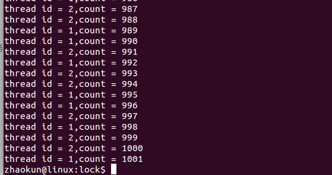
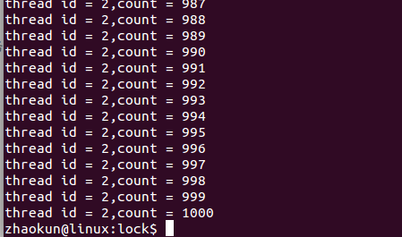
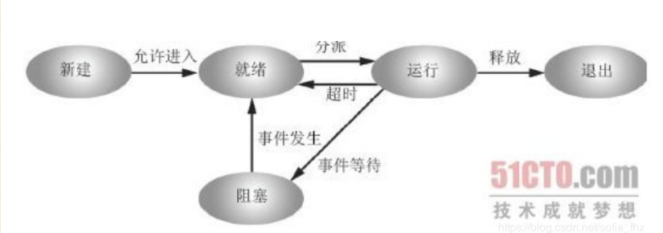
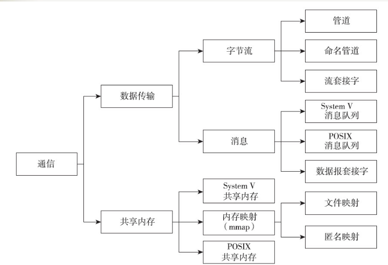
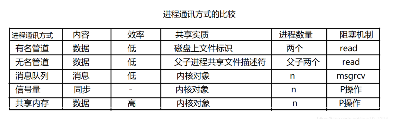
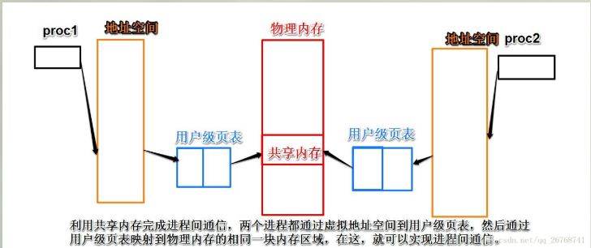
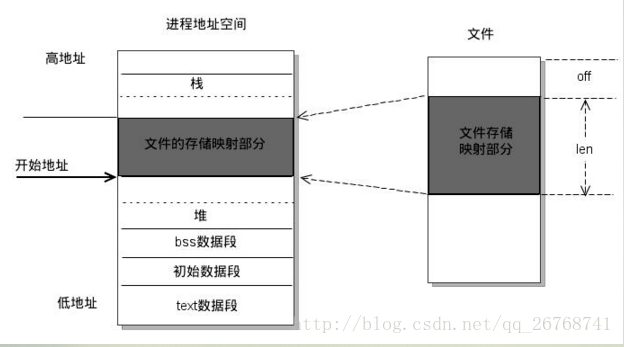
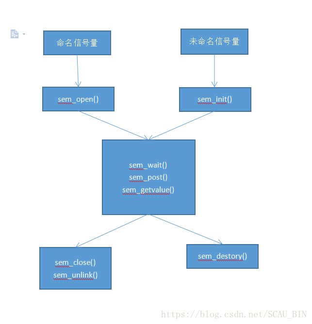
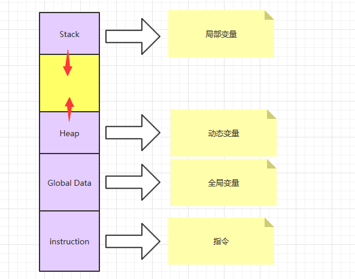
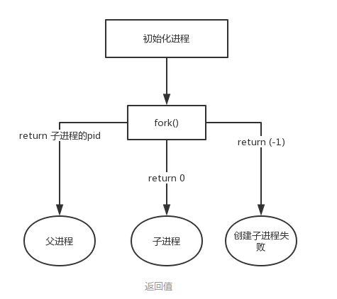

### 进程与线程

#### 0. 基本概念

```
临界数据:多个进程或线程会竞争修改的数据
临界区:修改临界数据的代码区域
原子操作:临界区的代码不会被这个临界数据的其他临界的代码打断
三者之间的联系:如果一个临界区在访问这个临界数据,那么当进程进行调度的时,就对不会切换到另一个临界区,只可能切换到其他的代码
```

#### 1. 同步与互斥的区别

```c
1.线程同步
2.线程互斥
3.进程同步
4.进程互斥

同步:直接制约关系,是指多个线程或进程为了合作完成任务,必须严格按照规定某种次序来运行
例如:线程T2的语句y要使用线程T1中的语句x的运行结果,所以只有当语句x执行完成之后y才可以执行,在这里使用信号量进行同步
    
示例:
semaphore S=0;   // 初始化信号量
T1() {
    ...
    x;           // 语句x
    V(S);        // 告诉线程T2，语句x已经完成
    ...
}

T2() {
    ...
    P(S);        // 检查语句x是否运行完成
    y;           // 检查无误，运行y语句
    ...
}

互斥:又称间接制约关系,是指系统中的某些共享资源,一次只允许一个线程访问,当一个线程正在访问该临界资源时,其他线程必须等待。
例如,打印机就是一种临界资源,而访问打印机的代码段称为临界区，故每次只允许一个线程进入临界区，同样可以使用信号量解决互斥问题,只需要把临界区置于P(S)和V(S)之间,即可实现两线程对临界资源的互斥访问

semaphore S=1;   // 初始化信号量

T1() {
    ...
    P(S);
    线程T1的临界区;  // 访问临界资源
    V(S);
    ...
}

T2() {
    ...
    P(S);
    线程T2的临界区;  // 访问临界资源
    V(S);
    ...
}

总结:
1.互斥是指某一资源同时只允许一个访问者对其进行访问,具有唯一性和排它性,但是互斥无法限制访问者对资源的访问顺序，即访问是无序的
2.同步是在互斥的基础上,通过其他机制实现访问者对资源的有序访问
3.同步已经实现了互斥,同步是一种更为复杂的互斥
4.互斥是一种特殊的同步
```

#### 2. 线程互斥

```
在多线程应用中,所有的线程都是共享资源,当线程并发运行时,就有可能导致多个线程同时访问操作的共享资源。假如有AB两个线程,A线程读共享资源,B线程写共享资源,就会发生A线程读取的共享资源一部分被B线程修改过一部分没有修改过,那么在这种情况下就会造成数据混乱,通常数据要么是原始数据，要么是经过完成修改后的数据,而多线程的并发性就可能产生访问的资源还没有被全部修改完毕,就被读取了
```

```c
//使用互斥锁实现线程的互斥
#include <stdio.h>
#include <stdlib.h>
#include <string.h>
#include <assert.h>
#include <unistd.h>
#include <pthread.h>

static int count = 0; //定义全局共享数据
static pthread_mutex_t p;//定义全局互斥量

//函数线程
void * fun_pthread1(void *arg)
{
	int id = (int)arg;
	printf("id = %d\n",id);

    while(1)
    {
		pthread_mutex_lock(&p);//给互斥量加锁
		if(count < 1000) {
			usleep(10); //目的是加大出错的机会
			count++;
			printf("thread id = %d,count = %d\n",id,count);
			pthread_mutex_unlock(&p);//给互斥量解锁
		}
		else {
			pthread_mutex_unlock(&p);
			break;
		}
	}		
}

int main()
{
    pthread_mutex_init(&p,NULL);//给互斥量进行初始化，第二个参数是属性，NULL表示使用默认属性

    pthread_t id1;//线程id
    pthread_t id2;//线程id

	//创建函数线程，第二个参数是属性，NUll表示使用默认属性，第四个参数传递的是参数，NULL表示没有参数
    pthread_create(&id1,NULL,fun_pthread1,(void *)1);

    //创建函数线程，第二个参数是属性，NUll表示使用默认属性，第四个参数传递的是参数，NULL表示没有参数
    pthread_create(&id2,NULL,fun_pthread1,(void *)2);

    //等待函数线程结束再执行，第二个参数接收函数线程结束时传递的信息，NULl表示无信息。
    pthread_join(id1,NULL);

    //等待函数线程结束再执行，第二个参数接收函数线程结束时传递的信息，NULl表示无信息。
    pthread_join(id2,NULL);

    //当函数线程结束时，销毁互斥量
    pthread_mutex_destroy(&p);//当函数线程结束时，销毁互斥量

    //主线程退出时，函数线程不一定结束，如果使用exit函数（默认）退出，那么进程就会结束，所有包含在进程中的线程也会结束，可能导致函数线程未执行完突然结束
//  pthread_exit(NULL);

    return 0;
}
```

##### 测试结果:不加互斥锁情况,有可能出现1001的情况



##### 测试结果:加互斥锁情况,保证最后出现的是1000情况



```c
//函数解释:
1.互斥锁的初始化,有以下2种方法:
(1)调用方法的初始化:互斥锁是用malloc动态分配或者分配在共享区的时候使用
(2)不调用方法的初始化:静态分配的时候使用

//动态初始化锁,可以设置更多锁的属性信息
int pthread_mutex_init(pthread_mutex_t *restrict mutex,const pthread_mutexattr_t *restrict attr);
返回值：成功0；失败errno
//静态初始化锁
pthread_mutex_t mutex = PTHREAD_MUTEX_INITIALIZER;

2.互斥锁的销毁
int pthread_mutex_destroy(pthread_mutex_t *mutex);
返回值：成功0；失败errno

3.加锁与解锁
int pthread_mutex_lock(pthread_mutex_t *mutex);
int pthread_mutex_trylock(pthread_mutex_t *mutex);
int pthread_mutex_unlock(pthread_mutex_t *mutex);

pthread_mutex_lock:加锁,如果是没有加锁的状态,则加锁并返回不阻塞。如果已经加锁的状态,在这里阻塞,并一直等待直到解锁
pthread_mutex_trylock:尝试去加锁,如果没有加锁,则加锁并返回不阻塞。如果是已经被加锁的状态,则不阻塞,立即返回,返回值为EBUSY
    
4.创建线程函数
 int pthread_create(pthread_t *restrict tidp,const pthread_attr_t *restrict_attr,void*（*start_rtn)(void*),void *restrict arg);

参数:
　　第一个参数为指向线程标识符的指针。
　　第二个参数用来设置线程属性。
　　第三个参数是线程运行函数的地址。
　　最后一个参数是运行函数的参数。
返回值:
　　若成功则返回0，否则返回出错编号
      
5.等待线程结束
int pthread_join (pthread_t __th, void **__thread_return);

参数:
	第一个参数为被等待的线程标识符
	第二个参数为一个用户定义的指针，它可以用来存储被等待线程的返回值
        
返回值:
	若成功则返回0，否则返回出错编号
注意:
	线程阻塞函数,调用它的函数将移植等待被等待的线程结束为止,当函数返回时,被等待线程的资源被收回。
```

```
信号量是一个特殊类型的变量,它可以被增加或减少,但对其的关键访问被保证是原子操作,即使在一个多线程程序中也是如此。这意味着如果一个程序中有两个或者多个的线程试图改变一个信号量的值,系统将保证所有的操作都将依次进行。而如果是普通变量,来自一个程序中不同线程的冲突操作所导致的结果是不确定的
```

```c
//使用信号量实现线程的互斥
#include <stdio.h>
#include <stdlib.h>
#include <string.h>
#include <assert.h>
#include <unistd.h>
#include <pthread.h>
#include <semaphore.h>

static int count = 0;
static sem_t sem;

//函数线程
void * fun_pthread1(void *arg)
{
	int id = (int)arg;
	printf("id = %d\n",id);
    while(1)
    {
		sem_wait(&sem); //等待信号量,当信号量的值为0时,则等待

		if(count < 1000) {
			usleep(10);
			count++;
			printf("thread id = %d,count = %d\n",id,count);
			sem_post(&sem); //释放信号量
		}
		else {
			sem_post(&sem);
			break;
		}
	}		
}

int main()
{
    pthread_t id1;//线程id
    pthread_t id2;//线程id
	
	sem_init(&sem,1,1); //将信号量的值初始为1,相当于一个互斥锁

    pthread_create(&id1,NULL,fun_pthread1,(void *)1);
    pthread_create(&id2,NULL,fun_pthread1,(void *)2);

    pthread_join(id1,NULL);
    pthread_join(id2,NULL);

	sem_destroy(&sem);

    return 0;
}
```

```c
Posix函数解释:
//信号量创建函数
int sem_init(sem_t *sem,int pshared,usigned int value);
参数:
	sem:信号量
    pshared:指明信号量是由进程内线程共享(等于0),还是由进程之间共享(大于0)。
返回值:
	0-成功
    -1:失败
//等待信号量,如果信号量的值大于0,将信号量的值减1,立即返回。如果信号量的值为,则线程阻塞。相当于P操作,成功返回0,失败返回-1,设置errno来指示错误
int sem_wait(sem_t *sem);
//等待信号量,但不阻塞
int sem_trywait(sem_t *sem);
//释放信号量,让信号量的值加1,相当于V操作
int sem_post(sem_t *sem);
//销毁信号量
int sem_destroy(sem_t *sem);
```

#### 3. 线程的同步

```c
#include <pthread.h>
#include <stdio.h>
#include <stdlib.h>

int nitem = 100;

/*
	1. 多个线程共享的数据定义和互斥锁定义在一个结构体中
*/
//共享资源结构体
struct {
  pthread_mutex_t mutex;
  int data; //共享的数据

} shared = {
  PTHREAD_MUTEX_INITIALIZER,
  0
};

/*
	2. 条件变量,互斥锁和临界条件定义在一个结构体中
*/
//条件变量结构体
struct {
  pthread_mutex_t mutex; //锁定义
  pthread_cond_t  cond; //条件变量定义
  int nready; //临界条件定义
} nready = {
  PTHREAD_MUTEX_INITIALIZER,
  PTHREAD_COND_INITIALIZER,
  0
};

void* produce(void*);
void* consume(void*);

int main(int argc, char** argv)	{

	int i;
	int nthreads = 10;
	int consumeTheads= 10;
	int produceCountTheads = 20;

	pthread_t tid_produce[produceCountTheads]; 
	pthread_t tid_consume[consumeTheads];

	//创建消费者线程组
	for(i = 0; i < consumeTheads; ++i) {
		pthread_create(&tid_consume[i], NULL, consume, (void *)i);
	}

	//创建生产线程组
	for(i = 0; i < produceCountTheads; ++i){
		pthread_create(&tid_produce[i], NULL, produce, (void *)i);

	}

	for(i = 0; i < produceCountTheads; ++i){
		pthread_join(tid_produce[i], NULL);
	}
	
	for(i = 0; i < consumeTheads; ++i){
		pthread_join(tid_consume[i], NULL);
	}

	return 0;
}

void* produce(void* arg){

 	int count = (int)arg;
	while(1){
		//对共享资源进行加锁
		pthread_mutex_lock(&shared.mutex);		
		if(nitem == 0){
			pthread_mutex_unlock(&shared.mutex);
			return NULL;
		}
		
		nitem--;
		shared.data++;
		printf("produceId = %d,val = %d\n",count,shared.data);

		pthread_mutex_unlock(&shared.mutex);

		pthread_mutex_lock(&nready.mutex);
		nready.nready++;
		pthread_mutex_unlock(&nready.mutex);
		
		pthread_cond_signal(&nready.cond);

		usleep(10);
	}
}

void* consume(void* arg){

	int count = (int)arg;
	while(1) {
		pthread_mutex_lock(&nready.mutex);

        /*
        	3. 此处不用if,原因在于pthread_cond_wait返回后,有可能另一个消费者把它消费掉了,所以再次测试相应的条件成立与否防止发生虚假的唤醒
        */
		while(nready.nready == 0) {
		  pthread_cond_wait(&nready.cond, &nready.mutex);
		}

		nready.nready--;
		pthread_mutex_unlock(&nready.mutex);

		//获取共享资源
		pthread_mutex_lock(&shared.mutex)
		printf("............................consumeId = %d,data = %d\n",count,shared.data);
		shared.data--;
		pthread_mutex_unlock(&shared.mutex);
		usleep(10);
	}	
}
```

```c
函数解释:
1.分配变量:
静态方式分配条件变量:
pthread_cond_t cond = PTHREAD_COND_INITIALIZER;
动态方式分配条件变量:
int pthread_cond_init(pthread_cond_t *cond, pthread_condattr_t *cond_attr);

2.销毁条件变量(动态分配的条件变量要用完后要进行销毁):
只有在没有线程在该条件变量上等待的时候才能注销这个条件变量,否则返回EBUSY
int pthread_cond_destroy(pthread_cond_t *cond)
    
3.等待变量
    (1)条件等待
    	int pthread_cond_wait(pthread_cond_t * cond, pthread_mutex_t * mutex);
    (2)时间等待
        int pthread_cond_timedwait(pthread_cond_t *cond, pthread_mutex_t *mutex, const struct timespec *abstime);
		其中计时等待,如果在给定时刻前条件没有满足,则返回ETIMEOUT,结束等待
     内部操作:
		1.将线程放在等待队列上,解锁
        2.等待pthread_cond_signal或者pthread_cond_broadcast信号之后去竞争锁
        3.若竞争到则将锁进行加锁
            
4.触发变量
/*
	作用是发送一个信号给另外一个处于阻塞等待状态的线程,使其脱离阻塞状态继续执行,如果没有线程处于在阻塞等待状态,也会返回成功
*/            
int pthread_cond_signal(pthread_cond_t *cond);
/*
	它使所有参数cond指向的条件变量阻塞的线程退出阻塞状态,如果没有阻塞线程,则函数无效
*/
int pthread_cond_broadcast(pthread_cond_t *cond);
```

#### 4. 进程状态转移图

##### 4.1 进程的5种状态

```
1.创建状态
	进程由创建而产生,创建进程是一个非常复杂的过程,一般需要通过多个步骤才能完成,如首先由进程申请一个空白的进程控制块(PCB)-->并向PCB中填写用于控制和管理进程的信息-->然后为该进程分配运行时所必须的资源-->最后把该进程转入就绪状态并插入到就绪队列中
	
2.就绪状态
	是指进程已经装备好运行的状态,即进程已分配大除CPU以外的所有必要资源,只要再获得CPU,便可立即执行。如果系统中有许多处于就绪状态的进程，通常将它们按照一定的策略排列成一个队列,该队列称为就绪队列,有执行资格,没有执行权限的进程
	
3.运行状态
	是指进程已经获得CPU,其进程处于正在执行的状态,对任何一个时刻而言,在单处理机的系统中,只有一个进程处于执行状态而多处理机系统中，有多个进程处于执行状态，既有执行资格又有执行权限
	
4.阻塞状态
	是指正在执行的进程由于发生某事件(如I/O请求、申请缓冲区失败等)暂时无法继续执行的状态,即进程执行收到阻塞，此时引发进程调度，操作系统把处理机分配给另外一个就绪的进程，而让受阻的进程处于暂停的状态，一般将这个暂停的状态称为阻塞状态
	
5.退出状态
	进程的终止也要通过两个步骤:首先等待操作系统进行善后处理,最后将其PCB清零,并将PCB空间返还给系统当一个进程到达了自然结束点或是出现了无法克服的错误或是被操作系统所终结或是被其它有终止权的进程所终结，它将进入终止状态。进入终止态的进程以后不能再执行，但是操作系统中仍然保留了一个记录，其中保存状态码和一些计时统计数据，是其他进程进行收集，一旦其他进程完成了对其信息的提取之后，操作系统将删除其进程，即将其PCB清零，并将该空白的PCB返回给系统
```



##### 4.2 阻塞(挂起)与死循环的区别

```
阻塞(挂起)的实质:
	1.将当前任务控制块的状态标志改为挂起状态
	2.将任务就绪表中的对应位置置0
	3.如果是事件类型，则还会将任务加入到当前的事件等待任务列表中
	4.执行任务调度，让出cpu使用权，将不再处于占用cpu状态，不占用cpu资源

二者之间的区别:
	阻塞只在多任务操作系统下能体现，阻塞状态的任务是不会占用cpu,而死循环会一直占用cpu(时间片轮转比如linux还好些等待调度其他任务还能运行些时间，ucos这种基于优先级的如果当前任务又是最高级就完全在这个任务上了)
```

##### 4.3 进程间通讯

###### 4.3.1 进程间通信的目的

```
数据传输:一个进程需要将它的数据发送给另一个进程,发送的数据量在一个字节到几M字节之间
共享数据:多个进程要操作共享数据
信息传递:一个进程需要向另一个进程发送信息，通知它发生了某种事件
资源共享:多个进程之间共享同样的数据,需要内核提供锁和同步机制
进程控制:有些进程希望完全控制另一个进程的执行,此时控制进程希望能够拦截另一个进程的所有陷入和异常,并能够及时知道它的状态改变
```

###### 4.3.2 进程通信的概念

```
每个进程各自有不同的用户地址空间,任何一个进程的变量在另一个进程中都是看不到的,所以进程之间要交换数据必须通过内核,在内核中开辟出一块缓冲区,一个进程把自己的数据从用户空间拷贝到内核缓冲区,另一个进程再从内核缓冲区把数据读走。内核提供的这种机制被称为进程间通信-IPC
```

###### 4.3.3 进程通信方式





```
Linux间进程通信有以下几种方式:
1.管道-pipe(包括匿名管道和命名管道):
	管道的实质是一个内核缓冲区,需要通信的两个进程在管道的两端,进程利用管道传递信息,管道对于管道两端的进程而言就是一个文件,但是这个文件比较特殊,它不属于文件系统并且只存在于内存中
	管道分为匿名管道和命名管道,这两种管道有一定区别,
	匿名管道:
	(1)管道是半双工的,数据只能在一个方向上流动,A进程传给B进程,不能反向传递
	(2)管道只能用于父子进程或兄弟进程之间的通信,即具有亲缘关系的进程
	命名管道:
	(1)允许没有亲缘关系的进程进行通信,命名管道不同于匿名管道之处在于它提供了一个路径名与之关联,这样一个进程即使与创建有名管道的进程不存在亲缘关系,只要可以访问该路径,就能通过有名管道互相通信
	
2.信号-signal:
	信号时软件层面上对中断机制的一种模拟,是一种异步通信方式,进程不必通过任何操作来等待信号的到达,信号可以在用户进程和内核之间直接交互,内核利用信号来通知用户空间的进程发生了哪些系统事件
	信号来源:
		硬件来源:比如按下了键盘或者其他硬件故障
		软件来源:发送信号的系统函数如kill、raise、alarm、非法运算等操作
	进程对信号的响应-3种方式:
		(1)忽略信号,即对信号不做任何处理,但是有两个信号时不能忽略的；SIGKILL和SIGSTOP
		(2)捕捉信号:定义信号处理函数,当信号发生时,执行相应的处理函数
		(3)执行缺省操作，Linux对每一种信号都规定了默认操作
		
3.消息队列(queue):
	实质是消息的链表,具有特定的格式,放在内存中并由消息队列标识符标识,并且允许一个或多个进程向它写入与读取消息
	
4.共享内存:
	使得多个进程可以直接读写同一块内存空间,是针对其他通信机制运行效率较低而设计的,为了在多个进程间交换信息,内核专门保留出了一块内存区,可以由需要访问的进程将其映射到自己的私有地址空间,进程就可以直接读写这一块内存而不需要进行数据的拷贝,从而大大提高效率
	注意点:共享内存并未提供同步进制,在一个进程结束对共享内存的写操作之前,并无自动机制可以阻止另外的进程对它进行读取,所有通常需要用其他的机制来同步对共享内存的访问
	
5.信号量:
	用于同步使用,实质上是一个标识可用资源数量的计数器,它的值总是非负整数,只有0和1两种取值的信号量叫做二进制信号量(或是二值信号量).可用来标识某个资源是否可用
	
6.套接字:
	套接字是更为基础的进程间通信机制,与其他方式的不同的是,不仅用于同一机器之间的进程通讯,还能用于不同机器之间的进程通讯。有两种类型的套接字:基于文件的和面向网络的
	(1)第一种套接字是基于文件的,家族名字-AF_UNIX,代表地址家族：UNIX
	(2)第二种套接字是基于网络的,家族名字-AF_INET,代表地址家族：INTERNET
	不管采用哪种地址家族,都有2种不同的套接字连接：面向连接的和无连接的
	(1)面向连接的套接字(SOCK_STREAM):进行通信前必须建立一个连接,面向连接的通信提供序列化的、可靠地和不重复的数据交付而没有记录边界,这意味着每条信息可以被拆分成多个片段,并且每个片段都能确保达到目的地,然后在目的地将信息拼接起来,这种连接类型的主要协议是传输控制协议-TCP
	(2)无连接的套接字(SOCK_DGRAM):在通信开始之前并不需要建立连接,在传输过程中并无法保证它的顺序性、可靠性或重复性。然后数据报确实保存了记录边界,这意味着消息是以整体发送的，而并非首先分成多个片段,实现这种连接类型的主要协议是用户数据报协议-UDP
```

##### 5. 共享内存示例

```
共享内存区:按标准可分为Posix共享内存区和System V共享内存区
Posix:表示可移植操作系统接口
System V:是Unix操作系统众多版本中的一种
总结:Posix、SystemV相当于2种标准,现在比较常用的为Posix标准
1.共享内存是最快的可用IPC形式,它允许多个不相关(无亲缘关系)的进程去访问同一部分逻辑内存,如果需要爱两个进程之间传输数据,共享内将是一种效率极高的解决方案,一旦这样的内存区域映射到共享它的进程的地址空间,这些进程间数据的传输就不在涉及内核,这样就可以减少系统调用时间,提高程序效率
2.共享内存是由IPC为一个进程创建的一个特殊的地址范围,他将出现在进程的地址空间中,其他进程可以把同一段共享内存段连接到它们自己的地址空间里去,所有进程都可以访问共享内存中的地址,如果一个进程向这段共享内存写了数据,所有的改动都会立刻被有访问同一段共享的其他进程看到
```



```c
//共享内存写
#include <unistd.h>
#include <sys/types.h>
#include <sys/ipc.h>
#include <sys/mman.h>
#include <fcntl.h>
#include <sys/stat.h>
#include <stdlib.h>
#include <stdio.h>
#include <errno.h>
#include <string.h>

#define ERR_EXIT(m) \
        do \
        { \
                perror(m); \
                exit(EXIT_FAILURE); \
        }while(0)
 
typedef struct stu
{
	char name[32];
	int age;
}STU;
 
int main(void)
{
	int shmid;
	struct stat buf;
	
	shmid = shm_open("/xyz",O_RDWR | O_CREAT | O_TRUNC,0666);
	
	if(shmid==-1) {
		ERR_EXIT("shm_open\n");
	}
		
	printf("shm_open succss\n");
	
	if (ftruncate(shmid, sizeof(STU)) == -1) {
		ERR_EXIT("ftruncate error\n");
	}
	if(fstat(shmid,&buf) == -1) {
		ERR_EXIT("fstat error\n");
	}
		
	//共享内存的状态信息
	//共享内存的大小和权限
	printf("size=%ld mode=%o\n",buf.st_size,buf.st_mode & 07777);
 
	//将共享内存映射到进程的地址空间
	STU *p;
	p = mmap(NULL,buf.st_size,PROT_WRITE,MAP_SHARED,shmid,0);
	if(p == MAP_FAILED) {
		ERR_EXIT("mmap error\n");
	}
		
	//往共享内存中写入一些数据
	strcpy(p->name,"test");
	p->age=20;
    
#if 0	
	while(1) {
		sleep(10);
	}
#endif 
    
	shm_unlink("/xyz");
	
	//和文件的关闭方式一样
	close(shmid);
	
	return 0;
}

//编译,依赖库librt.so
	gcc shared_w.c -lrt -o sw
        
//共享内存自动会挂载在/dev/shm,可以使用hexdump命令查看共享内存里面的数据
zhaokun@linux:/$ hexdump -C /dev/shm/xyz 
00000000  74 65 73 74 00 00 00 00  00 00 00 00 00 00 00 00  |test............|
00000010  00 00 00 00 00 00 00 00  00 00 00 00 00 00 00 00  |................|
00000020  14 00 00 00                                       |....|
00000024
    
//共享内存读
#include <unistd.h>
#include <sys/types.h>
#include <sys/ipc.h>
#include <sys/mman.h>
#include <fcntl.h>
#include <sys/stat.h>
 
#include <stdlib.h>
#include <stdio.h>
#include <errno.h>
#include <string.h>
#define ERR_EXIT(m) \
        do \
        { \
                perror(m); \
                exit(EXIT_FAILURE); \
        }while(0)
 
typedef struct stu
{
	char name[32];
	int age;
}STU;
 
int main(void)
{
	int shmid;
	struct stat buf;
	
	shmid = shm_open("/xyz",O_RDWR | O_CREAT,0666);
	
	if(shmid==-1) {
		ERR_EXIT("shm_open\n");
	}
		
	printf("shm_open succss\n");
	
	if (ftruncate(shmid, sizeof(STU)) == -1) {
		ERR_EXIT("ftruncate error\n");
	}
	if(fstat(shmid,&buf) == -1) {
		ERR_EXIT("fstat error\n");
	}
		
	//共享内存的状态信息
	//共享内存的大小和权限
	printf("size=%ld mode=%o\n",buf.st_size,buf.st_mode & 07777);
 
	//将共享内存映射到进程的地址空间
	STU *p;
	p = mmap(NULL,buf.st_size,PROT_WRITE,MAP_SHARED,shmid,0);
	if(p == MAP_FAILED) {
		ERR_EXIT("mmap error\n");
	}
 
	printf("name=%s age=%d\n",p->name,p->age);	

#if 0
    //当执行该语句时,会删除/dev/shm/xyz的文件,但是数据还可以访问
	shm_unlink("/xyz");
	printf("name=%s age=%d\n",p->name,p->age);	
#endif

#if 0
    //当执行该语句时,已经解除了内存映射,若再进行数据访问,则会报段错误
	int ret = munmap(p,buf.st_size);
	printf("ret = %d\n",ret);
	//会报段错误
	printf("name=%s age=%d\n",p->name,p->age);	
#endif

	//和文件的关闭方式一样
	close(shmid);
	return 0;
}

//编译:
gcc shared_r.c -lrt -o sr
```

```c
//函数解释:
//1. 创建/获取一个共享内存
int shm_open(const char *name, int oflag, mode_t mode);
参数:
	name:共享内存的名字
	oflag:O_RDONLY(只读)、O_WRONLY(只写)、O_RDWR(读写)、O_CREAT(创建), O_EXCL, O_TRUNC
	mode:权限
返回值:
	成功:返回一个文件描述符
	失败:-1
    
//2. 删除一个共享内存对象
int shm_unlink(const char *name);
参数:
	name:共享内存的名字
返回值:
	成功:0
	失败:-1
备注:
	删除一个名字不会影响对其底层支撑对象的现有引用,直到对于该对象的引用全部关闭为止
    
//3. 修改共享内存的大小
int ftruncate(int fd, off_t length);
参数:
fd:文件描述符
length:长度
返回值:
	成功:0
	失败:-1
备注:
	该函数不仅可用于修改共享内存的大小,而且可以用于修改文件大小

//4. 获取共享内存的状态
int fstat(int fd, struct stat *buf);
参数:
	fd:文件描述符
    buf:返回共享内存状态
返回值:
	成功:0
	失败:-1
struct stat
{
    dev_t     st_dev;     /* ID of device containing file */
    ino_t     st_ino;     /* inode number */
    mode_t    st_mode;    /* protection */
    nlink_t   st_nlink;   /* number of hard links */
    uid_t     st_uid;     /* user ID of owner */
    gid_t     st_gid;     /* group ID of owner */
    dev_t     st_rdev;    /* device ID (if special file) */
    off_t     st_size;    /* total size, in bytes */
    blksize_t st_blksize; /* blocksize for filesystem I/O */
    blkcnt_t  st_blocks;  /* number of 512B blocks allocated */
    time_t    st_atime;   /* time of last access */
    time_t    st_mtime;   /* time of last modification */
    time_t    st_ctime;   /* time of last status change */
};

//4. 映射共享内存
void *mmap(void *addr, size_t length, int prot, int flags, int fd, off_t offset);
参数:
	addr:要映射的起始地址,通常指定为NULL,让内核自动选择
	length:映射到进程地址空间的字节数,通常是先前已经创建的共享内存的大小
	prot:映射区保护方式
        PROT_READ - 页面可读
        PROT_WRITE - 页面可写
        PROC_EXEC - 页面可执行
        PROC_NONE - 页面不可访问
	flags:通常指定为MAP_SHARED,用于进程间通信
        MAP_SHARED - 变动时共享的
        MAP_PRIVATE - 变动时私有的
        MAP_FIXED - 准确解释addr参数, 如果不指定该参数, 则会以4K大小的内存进行对齐
		MAP_ANONYMOUS - 建立匿名映射区, 不涉及文件
	fd:文件描述符,填写为shm_open返回的共享内存ID
	offset:从文件头开始偏移量(一般填为0)
返回值:
	成功:0
	失败:-1
        
//5. 卸载共享内存
int munmap(void *addr, size_t length);
参数:
	addr:mmap返回的地址
	length:映射区的大小
返回值:
	成功:0
	失败:-1
备注:当调用该函数后,再次访问这些地址将导致向调用进程产生一个SIGSEGV信号
```

##### 6. 内存映射示例



```c
//内存映射写
#include <sys/mman.h>
#include <sys/types.h>
#include <sys/stat.h>
#include <fcntl.h>
#include <stdio.h>
#include <string.h>
#include <unistd.h>

int main() {

  int fd = open("mem", O_RDWR | O_CREAT,0666);

  if(fd < 0) {
	printf("fd open error\n");
	return -1;
  }

  //当文件不存在时,直接创建的文件大小为0,因此这里需要修改映射文件的大小
  int ret = ftruncate(fd, 8);
  if(ret < 0) {
	  printf("ftruncate failed\n");
  }

  //MAP_SHARED,对内存里面的值进行修改,会反映到文件,文件同时也被修改,偏移量必须为4k的倍数
  char* buf = mmap(NULL, 8, PROT_READ|PROT_WRITE, MAP_SHARED, fd, 0);

  //当设置为该MAP_PRIVATE参数时,对内存里面的值不能反映到文件上,文件不会被修改
  //char* buf = mmap(NULL, 8, PROT_READ|PROT_WRITE, MAP_PRIVATE, fd, 0);

  if(buf == MAP_FAILED) {
	printf("mmap failed\n");
	return -1;
  }

  printf("buf = %s\n",buf);
  //写入的大小>映射区域的大小,不能全部写入
//  strcpy(buf, "123456789");
  strcpy(buf, "123456789");

  printf("buf = %s\n",buf);

#if 0
  while(1) {
	  sleep(1);
  }
#endif
  //释放映射区
  munmap(buf, 8);

  close(fd);
}

//内存映射读
#include <sys/mman.h>
#include <sys/types.h>
#include <sys/stat.h>
#include <fcntl.h>
#include <stdio.h>
#include <string.h>
#include <unistd.h>

int main() {

  int fd = open("mem", O_RDWR,0666);

  if(fd < 0) {
	printf("fd open error\n");
	return -1;
  }

  //MAP_SHARED,对内存里面的值进行修改,会反映到文件,文件同时也被修改,偏移量必须为4k的倍数
  char* buf = mmap(NULL, 8, PROT_READ|PROT_WRITE, MAP_SHARED, fd, 0);

  //当设置为该MAP_PRIVATE参数时,对内存里面的值不能反映到文件上,文件不会被修改
  //char* buf = mmap(NULL, 8, PROT_READ|PROT_WRITE, MAP_PRIVATE, fd, 0);

  if(buf == MAP_FAILED) {
	printf("mmap failed\n");
	return -1;
  }

  printf("buf = %s\n",buf);

  //释放映射区
  munmap(buf, 8);

  close(fd);
}
```

```c
上述内存映射注意的几个问题:
1.如果更改上面例子里变量buf的地址，释放的时候munmap，还能成功吗？
不能成功。错误信息：【Invalid argument
    
2.对映射区的操作，越界了会怎么样?
open文件size > 要写入的size > mmap参数的length：能够全部写入文件
open文件size < 要写入的size > mmap参数的length：不能全部写入文件，能够写入的size是open文件的size
    
3.偏移量随便填个数字会怎么样?
mmap函数出错，错误信息：【Invalid argument】
offset必须是4K的整数倍，【0，4*1024。。。】
用【stat】命令查看文件，发现文件的size实际小于4096，但是【IO Block: 4096】
    
4.如果文件描述符先关闭，对mmap映射有没有影响?
没有影响
    
5.open的时候，可以用新创建一个文件的方式，来创建映射区吗？
错误：Bus error (core dumped)。
错误理由是：创建的文件的size为0，所以出上面的错误。新创建一个文件后，马上把文件大小扩展一下就不会发生错误了
int fd = open("mem", O_RDWR|O_CREAT, 0666);
ftruncate(fd, 8);//把新创建的文件mem的大小扩展为8.

6.pen文件时，选择O_WRONLY，可以吗
mmap函数出错，错误：【Permission denied】。
因为要把文件的内容读到内存，所以隐含一次读取操作，所以没有读的权限的话，就出这个错误。
    
7.当选择MAP_SHARED的时候，open文件选择O_RDONLY，prot可以选择【PROT_READ|PROT_WRITE】吗
mmap函数出错，错误：【Permission denied】。
MAP_SHARED的时候会去写文件，但是open的时候只有读权限，所以权限不够。
```

```
内存映射与共享内存的比较:
1.mmap是在磁盘上建立一个文件,每个进程地址空间中开辟一块空间进行映射。而shm共享内存,每个进程最终都会映射到同一块物理内存,shm保存在物理内存上,这样的读写速度肯定要比磁盘要快,但是存储量不是特别大
2.mmap有一个好处是当机器重启，因为mmap把文件保存在磁盘上，这个文件还保存了操作系统同步的映像，所以mmap不会丢失，但是shmget在内存里面就会丢失
```

##### 7. 进程同步示例

```c
//写操作
#include <unistd.h>
#include <sys/types.h>
#include <sys/ipc.h>
#include <sys/mman.h>
#include <fcntl.h>
#include <sys/stat.h>
#include <stdlib.h>
#include <stdio.h>
#include <errno.h>
#include <string.h>
#include <semaphore.h>
#include <pthread.h>

int main()
{
	int val = 1;

	sem_t * sem = sem_open("xyz",O_RDWR | O_CREAT,0666,0);

	if(SEM_FAILED == sem) {
		printf("sem_open failed\n");
	}

	sem_getvalue(sem,&val);
	printf("val = %d\n",val);

	sem_post(sem);

	sem_getvalue(sem,&val);

	printf("val = %d\n",val);

	printf("sem_post\n");

	sem_unlink("xyz");

	sem_close(sem);

	return 0;
}

//读操作
#include <unistd.h>
#include <sys/types.h>
#include <sys/ipc.h>
#include <sys/mman.h>
#include <fcntl.h>
#include <sys/stat.h>
#include <stdlib.h>
#include <stdio.h>
#include <errno.h>
#include <string.h>
#include <semaphore.h>
#include <pthread.h>

int main()
{
	int val = 1;

	sem_t * sem = sem_open("xyz",O_RDWR | O_CREAT,0666,0);

	if(SEM_FAILED == sem) {
		printf("sem_open failed\n");
	}

	sem_getvalue(sem,&val);
	printf("val = %d\n",val);
	printf("sem_wait\n");

	sem_wait(sem);

	sem_getvalue(sem,&val);

	sem_unlink("xyz");

	sem_close(sem);
	return 0;
}
```

```c
函数解释:
//1.创建或者打开一个信号量
sem_t *sem_open( const char *name, int oflag, mode_t mode, unsigned int value);
参数:
	name：标识信号量
	oflag：位掩码。
    	IF oflag == 0 访问一个既有的信号量
        IF oflag == O_CREAT 访问的信号量不存在 THEN 创建一个新的信号量
        IF oflag == O_CREAT | O_EXCL 信号量已经存在 THEN 失败
    如果用来打开一个存在的信号量，上面两个参数就够了，但是，当指定了O_CREAT，则还需要mode和value。
    mode：位掩码。指定了新信号量上的权限
    value：无符号整数，指定了信号量的初始值
返回值:
	成功:返回信号量指针
   	失败:返回SEM_FAILED
    
//2.关闭信号量
int sem_close(sem_t *sem);
返回值:
	成功返回0
	失败返回-1
备注:
 	当一个进程打开一个命名信号量时，系统会记录进程和信号量之间的关联关系。sem_close()会终止这种关系，释放系统为该进程关联到该信号量之上的所有资源，并递减引用该信号量的进程数
     
//3.获取一个信号量的当前值
int sem_getvalue(sem_t *sem, int *sval);
返回值:
	成功返回0
	失败返回-1
备注:
	sem_getvalue()返回得到的值sval可能已经过时
        
//4.删除一个信号量的名字并将其标记为在所有进程关闭该信号量时删除该信号量
int sem_unlink(const char *name);
返回值:
	成功返回0
	失败返回-1
备注:
 	sem_unlink()函数删除通过name标识的信号量并将其标记为一旦所有的进程都使用完这个信号量后就摧毁该信号量。也就是说，这个函数不一定是马上起作用的，当所有的进程都close了，该信号量才会被摧毁
```

```
posix信号量都是用于进程和线程同步对共享资源的访问，posix信号量主要分为:命名信号量、魏命名信号量
```



##### 8. 进程的互斥(共享内存)

```
思路:
	开辟一块共享内存,使得相关进程均可访问同一块区域,再将互斥锁定义在该区域(即共享内存上,否则达不到效果),使得相关进程可以使用该锁
pthread_mutex_init(互斥锁地址， 属性对象地址)再定义一把线程锁的时候第2个参数通常传入NULL,这样的锁默认只能被统一进程下的线程持有,如果要将其定义为进程之间可以持有的互斥锁，则需要传入属性对象地址

备注:
	互斥锁为信号量的一种特殊情况,相当于二值信号量
```

```c
//主进程
#include <unistd.h>
#include <sys/types.h>
#include <sys/ipc.h>
#include <sys/mman.h>
#include <fcntl.h>
#include <sys/stat.h>
#include <stdlib.h>
#include <stdio.h>
#include <errno.h>
#include <string.h>
#include <pthread.h>

#define ERR_EXIT(m) \
        do \
        { \
                perror(m); \
                exit(EXIT_FAILURE); \
        }while(0)
 
typedef struct stu
{
	pthread_mutex_t lock;
    pthread_mutexattr_t lock_attr;
	int count;
}STU;
 
int main(void)
{
	int shmid;
	struct stat buf;
	
	shmid = shm_open("/xyz",O_RDWR | O_CREAT | O_TRUNC,0666);
	
	if(shmid==-1) {
		ERR_EXIT("shm_open\n");
	}
		
	printf("shm_open succss\n");
	
	if (ftruncate(shmid, sizeof(STU)) == -1) {
		ERR_EXIT("ftruncate error\n");
	}
	if(fstat(shmid,&buf) == -1) {
		ERR_EXIT("fstat error\n");
	}
		
	//共享内存的状态信息
	//共享内存的大小和权限
	printf("size=%ld mode=%o\n",buf.st_size,buf.st_mode & 07777);
 
	//将共享内存映射到进程的地址空间
	STU *p;
	p = mmap(NULL,buf.st_size,PROT_WRITE,MAP_SHARED,shmid,0);
	if(p == MAP_FAILED) {
		ERR_EXIT("mmap error\n");
	}
	
    //该处的初始化,需要在其他进程启动前准备好
 	pthread_mutexattr_init(&(p->lock_attr));
 	pthread_mutexattr_setpshared(&(p->lock_attr), PTHREAD_PROCESS_SHARED);
 	pthread_mutex_init(&(p->lock), &(p->lock_attr));
	p->count = 0;

	while(1) {
		printf("main start end pid = %d.....\n",getpid());
		sleep(1);
	}

	pthread_mutex_destroy(&(p->lock));
    pthread_mutexattr_destroy(&(p->lock_attr));

	munmap(p,buf.st_size);

	shm_unlink("/xyz");
	
	//和文件的关闭方式一样
	close(shmid);

	return 0;
}

gcc shared_lock_w.c -o swl -lpthread -lrt
    
//辅助进程写
#include <unistd.h>
#include <sys/types.h>
#include <sys/ipc.h>
#include <sys/mman.h>
#include <fcntl.h>
#include <sys/stat.h>
#include <stdlib.h>
#include <stdio.h>
#include <errno.h>
#include <string.h>
#include <pthread.h>

#define ERR_EXIT(m) \
        do \
        { \
                perror(m); \
                exit(EXIT_FAILURE); \
        }while(0)
 
typedef struct stu
{
	pthread_mutex_t lock;
    pthread_mutexattr_t lock_attr;
	int count;
}STU;
 
int main(void)
{
	int shmid;
	struct stat buf;

//	shmid = shm_open("/xyz",O_RDWR | O_CREAT,0666);
#if 1
	while((shmid = shm_open("/xyz",O_RDWR,0666)) == -1) {
		usleep(5);
	}
#endif

#if 1
	if(shmid==-1) {
		ERR_EXIT("shm_open\n");
	}
#endif

	printf(".................shm_open succss pid =%d\n",getpid());
	
	if (ftruncate(shmid, sizeof(STU)) == -1) {
		ERR_EXIT("ftruncate error\n");
	}
	if(fstat(shmid,&buf) == -1) {
		ERR_EXIT("fstat error\n");
	}
		
	//共享内存的状态信息
	//共享内存的大小和权限
	printf(".................pid=%d size=%ld mode=%o\n",getpid(),buf.st_size,buf.st_mode & 07777);
 
	//将共享内存映射到进程的地址空间
	STU *p;
	p = mmap(NULL,buf.st_size,PROT_WRITE,MAP_SHARED,shmid,0);
	if(p == MAP_FAILED) {
		ERR_EXIT("mmap error\n");
	}
	
#if 0
 	pthread_mutexattr_init(&(p->lock_attr));
 	pthread_mutexattr_setpshared(&(p->lock_attr), PTHREAD_PROCESS_SHARED);
 	pthread_mutex_init(&(p->lock), &(p->lock_attr));

#endif

	while(1) {
		printf("...................while pid = %d\n",getpid());
		pthread_mutex_lock(&p->lock);
		if(p->count < 1000) {
			usleep(100);
			p->count++;
			printf(".......................threadId = %d, count = %d\n",getpid(),p->count);
			pthread_mutex_unlock(&p->lock);//给互斥量解锁
		}
		else {
			pthread_mutex_unlock(&p->lock);
			break;
		}
	}

	printf(".......................threadId = %d end\n",getpid());

    //1. 主进程销毁即可
#if 0	
	pthread_mutex_destroy(&(p->lock));
    pthread_mutexattr_destroy(&(p->lock_attr));
#endif

	munmap(p,buf.st_size);

	shm_unlink("/xyz");
	
	//和文件的关闭方式一样
	close(shmid);
	 
	return 0;
}

//编译
gcc shared_lock_w1.c -o swl1 -lpthread -lrt
```

|      |                互斥                |      同步       |
| :--: | :--------------------------------: | :-------------: |
| 线程 |         互斥锁或匿名信号量         | 互斥锁+条件变量 |
| 进程 | 共享内存中的互斥锁或命名二值信号量 |   命名信号量    |

##### 8.进程的创建

##### 8.1 进程空间(保存在用户空间)



```
每个进程都有自己的进程地址空间,如上图所示。栈(stack)以帧为单位,当程序调用函数(假如该函数名为fun01)时,stack会向下增长一帧，这个帧会存储该函数的参数、局部变量以及返回地址,计算机将控制权交给fun01,fun01处于激活状态，这时Global Data和该帧中的局部变量共同构成了contex也就是环境上下文，当函数又进一步调用另一个函数的时候，一个新的帧会继续增加到栈的下方，控制权转移到新的函数中，当激活函数返回的时候，会从栈中弹出该帧，并根据帧中记录的返回地址，将控制权交给返回地址所指向的指令
```

##### 8.2 进程元数据(保存在内核空间)

```
进程元数据可以用来区分进程,通过元数据了解进程状态信息,每一个进程都有PID(进程id),PPID(进程的父进程id),PGID(进程组id)等，这些信息描述了进程了各种信息，但是他们并不保存在进程的内存空间中。内核会为每个进程在内核自己的空间中分配一个变量(task_struct结构体)以保存上述信息。内核可以通过查看自己空间中的各个进程的附加信息就能知道进程的概况，而不用进入到进程自身的空间
```

##### 8.3 如何创建进程

```
1. 当一个程序调用fork的时候,实际上就是将本进程的内存空间,包括text,global data，heap和stack,又复制出来一个,构成一个新的进程。子进程的栈、数据以及栈段开始时是父进程内存相应各部分的完全拷贝，因此它们互不影响，从性能方面考虑，父进程到子进程的数据拷贝并不是创建时就拷贝了，而是采用了写拷贝技术来处理。--->
2.同时在内核中为改进程创建新的附加信息(比如新的pid) --->
3.当调用ecec的时候，进程清空自身内存空间的text,global data，heap和stack,并根据新的程序文件重建text,global data，heap和stack
```

##### 8.4 创建进程示例

```c
#include <unistd.h>  
#include <stdio.h>
#include <sys/wait.h>

int main ()   
{   
	pid_t fpid; //fpid表示fork函数返回的值  
	int count = 0;
	int status = 0;
	
	fpid = fork();

	if (fpid < 0) {
		printf("error in fork!:");   
	}   
	else if (fpid == 0) {  
		printf("i am the child process, my process id is %d,father process is %d\n",getpid(),getppid());
		count++; 
	}  
	else {  
		printf("i am the parent process, my process id is %d\n",getpid());
		count++;
	}
	
    //count变量每个进程都将拷贝一份,为单独的变量
	printf("统计结果是: %d\n",count);  

	return 0;  
}

运行结果:
./fork
i am the parent process, my process id is 3494
统计结果是: 1
zhaokun@linux:fork$ i am the child process, my process id is 3495,father process is 2613
统计结果是: 1
```

```c
函数:
pid_t fork()
返回值:
成功:调用一次返回2个值:子进程返回0,父进程返回子进程ID
失败:-1
```



##### 9. exec函数

```c
一个进程如何来启动另一个程序的执行,在linux中要使用exec函数,系统调用exec对当前进程进行替换，替换为一个指定的程序，其参数包括文件名，参数列表以及环境变量，一个进程一旦调用exec类函数，它本身就死亡了，系统把代码替换成新的程序的代码，废弃原有的数据段和堆栈段，并为新程序分配新的数据段和堆栈段,唯一留下的就是进程号，也就是说，对系统而言，还是同一个进程，不过是另一个程序了

#include<stdio.h> 
#include<unistd.h>
#include<stdlib.h>

int main()
{
	//孤儿进程：父进程先退出，子进程继续执行
	pid_t pid = fork();
	if (pid == 0)
	{
        //使用ls -al替代当前的子进程
		execlp("ls","ls","-al","./",(char *)0);
	}
	else if (pid > 0)
	{
		//父进程退出
		printf("parent pid=%d ppid=%d\n", getpid(), getppid());
		exit(1);
	}
	else
	{
		printf("fork errot\n");
	}
	return 0;
}

函数解释:
int execlp(const char *file, const char *arg, ... /* (char  *) NULL */);
参数1:其中第一个参数file指向可执行文件名称,因为execlp函数会从系统PATH路径中寻找相应命令,所以不需要带完整路径
第二个参数之后就都是传给可执行文件的参数，类似main函数的args[]，只是最后一个参数必须为空字符指针；   
```

##### 10. 孤儿进程与僵尸进程

```
进程的7种状态:
1.R-运行状态,这个状态并不是说明当前进程在CPU里运行，而是说当前进程在处理运行队列里
2.S-浅度睡眠状态
3.D-深度睡眠状态
4.T-停止状态
5.t-追踪状态
6.X-死亡状态
7.Z-僵尸状态
注意:状态后面带+表示前台进程,不带+表示后台进程
```

```c
僵尸进程(一个父进程利用fork创建子进程,如果子进程退出,而父进程没有利用wait或者waitpid来获取子进程的状态信息,那么子进程的状态描述符依然保存在系统中):
1.定义
当一个子进程退出后,其父进程还在继续执行,子进程的退出信息并没有被父进程接收到,但是一个进程的退出信息必须被父进程或一些有联系的进程接收到,所以当前进程会一直处于僵死状态
2.为什么子进程的退出信息要被接收呢?
因为一个进程的退出方式有3种(程序执行完结果正确即正常退出、程序执行完结果不正确、程序还没有执行完)，父进程必须知道子进程到底是何种状态退出的，如果子进程不是正常退出的，则父进程还要创建子进程
3.处于僵尸状态的进程会一直等待其父进程读取其退出信息
4.模拟一个僵尸进程
  主要子进程退出,而父进程还在执行，但父进程还没有读取子进程的状态信息，则子进程会变成一个僵尸,只要让子进程先退出,父进程一直执行即可模拟出一个僵尸进程
  
#include<stdio.h>
#include<unistd.h>
#include<stdlib.h>

int main()
{
	//先创建一个子进程
	pid_t pid = fork();
	if (pid == 0)
	{
		//让子进程先退出，父进程一直执行,子进程将来会变成僵尸进程
		printf("child pid=%d ppid=%d\n", getpid(), getppid());
		exit(1); //让子进程睡5秒后推出
	}
	else if (pid > 0)
	{
		//让父进程一直执行
		while (1)
		{
			printf("parent pid=%d ppid=%d\n", getpid(), getppid());
			sleep(2); //让父进程每隔两秒打印这个
		}
	}
	else
	{
		printf("error\n");
	}
}

5.如何避免僵尸进程
  僵尸进程是由于子进程退出但是父进程没有接收其退出信息而导致的,主要让子进程退出后,父进程接收子进程的退出信息就可以避免僵尸进程,所以父进程通过进程等待的方式,回收子进程的资源,获取子进程的信息即可
   
#include<stdio.h>
#include<unistd.h>
#include<stdlib.h>

int main()
{
	//先创建一个子进程
	pid_t pid = fork();
	if (pid == 0)
	{
		//让子进程先退出，父进程一直执行,子进程将来会变成僵尸进程
		printf("child pid=%d ppid=%d\n", getpid(), getppid());
		exit(1); //让子进程睡5秒后推出
	}
	else if (pid > 0)
	{
        //等待任意一个子进程结束
		wait(NULL);
        
        //等待所有进程结束
        #if 0
        	while(wait(NULL) ! = -1);
        #endif
	}
	else
	{
		printf("error\n");
	}
}
```

```c
孤儿进程(一个父进程退出,而它的一个或几个子进程仍然还在运行，那么这些子进程就会变成孤儿进程,孤儿进程将被init进程所收养,并由init进程对它们完成状态收集工作):
1.当一个子进程还在执行时,它的父进程已经退出,那么这个字进程的退出信息也没有被父进程接收到,如果子进程的退出信息没有被别的进程接收到，那么这个子进程就会变成一个僵尸进程,所以孤儿进程可能会引发僵尸进程,所以这个子进程必须被其它进程所领养，领养它的进程为1号进程，则它的退出信息会被1号进程所接收
2.如果父进程退出，父进程会变成僵尸进程吗
不会，因为父进程的的父进程为bash,父进程的退出信息会由bash接收到,这些我们看不到
3.模拟一个孤儿进程(只要让父进程先退出,子进程执行)

#include<stdio.h> 
#include<unistd.h>
#include<stdlib.h>

int main()
{
	//孤儿进程：父进程先退出，子进程继续执行
	pid_t pid = fork();
	if (pid == 0)
	{
		//子进程循环执行
		while (1)
		{
			printf("child pid=%d ppid=%d\n", getpid(), getppid());
			sleep(3);
		}
	}
	else if (pid > 0)
	{
		//父进程退出
		printf("parent pid=%d ppid=%d\n", getpid(), getppid());
		exit(1);
	}
	else
	{
		printf("fork errot\n");
	}
	return 0;
}

//我们可以发现5秒之后子进程的父进程变为1号进程，说明当5秒之后父进程退出后，子进程被1号进程领养
```

##### 11. wait和waipid区别

```c
#include <sys/wait.h>
pid_t wait(int * statloc);
pid_t waitpid(pid_t pid,int *statloc,int options);

作用:返回已经终止的子进程的进程ID,并清除僵尸进程
    
wait会令调用者阻塞至某个子进程终止
waitpid则可以通过设置一个选项来设置为非阻塞
    
waitpid的option常量：
　　WNOHANG   waitpid将不阻塞如果指定的pid并未结束
　　WUNTRACED 如果子进程进入暂停执行情况则马上返回，但结束状态不予以理会。

   waitpid中pid的含义依据其具体值而变：
　　pid==-1 等待任何一个子进程，此时waitpid的作用与wait相同
　　pid >0   等待进程ID与pid值相同的子进程
　　pid==0   等待与调用者进程组ID相同的任意子进程
　　pid<-1   等待进程组ID与pid绝对值相等的任意子进程

   waitpid提供了wait所没有的三个特性：
　　	1 waitpid使我们可以等待指定的进程
　　	2 waitpid提供了一个无阻塞的wait
　　	3 waitpid支持工作控制
```

##### 12. 进程与线程的区别

```
进程:系统资源分配的最小单位
线程:程序执行的最小单位,系统分配处理器时间资源的基本单元或者说进程之内独立执行的一个单元执行流
```

##### 13. ipc与rpc的区别

```
ipc(inter process communication):这个概念泛指进程之间任何形式的通信行为,它不仅包括各种形式的消息传递,还可以指共享资源以及同步对象,即确保安全的并发访问共享资源的东西
rpc(remote procedure call):一种隐藏了过程调用时实际通信细节的IPC方法。客户端将调用一个本地方法，而换个本地方法则是负责透明的与远程服务端进行过程间通信。这个本地方法会将相关参数顺序打包到一个消息中,然后把这个消息发送给服务端提供的方法,服务端的方法会从消息洪解出序列化发出来的参数,然后执行,最后仍以同样的方式将方法的返回值发送给客户端
```

##### 14. 线程私有数据

```
在单线程程序中,我们经常用到全局变量以实现多个函数间共享数据,在多线程环境下,由于数据空间是共享的,因此全局变量也为所有线程所共有,现在有一全局变量,所有线程都可以使用它,改变它的值,而如果每个线程希望单独拥有它,那就需要使用线程存储了.
应用场景:程序中可能需要每个线程维护一个链表,而会使用同样的函数来操作这个链表,最简单的方法就是使用同名而不同变量地址的线程来处理
```

```c
函数解释:

1.创建线程私有数据
int pthread_key_create(pthread_key_t *key, void (*destructor)(void*));
参数:
	key:在分配(malloc)线程私有数据之前,需要创建和线程私有数据相关联的键(key),这个键的功能是获得对线程私有数据的访问权
	destructor:清理函数名字,当线程退出时,假设线程私有数据地址不是非NULL,此函数会自动主动被调用,该函数指针能够设成NULL,这样系统将调用默认的清理函数
返回值:
	成功:0
    失败:-1
        
2.注销线程私有数据
int pthread_key_delete(pthread_key_t key);
参数:
	key:待注销私有数据
返回值:
	成功:0
    失败:-1
备注:
	这个函数不会检查当前是否有线程正使用线程私有数据(key),也不会调用清理函数destructor(),而仅仅是将线程私有数据释放以提供下一次调用pthread_key_create使用
        
3.设置线程私有数据
int pthread_setspecific(pthread_key_t key, const void *value);
参数:
	key:线程私有数据
   	value:和key相关联的指针
返回值:
	成功:0
    失败:-1
        
4.获取线程私有数据
void *pthread_getspecific(pthread_key_t key);
參数：
key：线程私有数据。

返回值：
成功：线程私有数据( key )所关联的值。
失败：NULL
    
备注:
	写入（pthread_setspecific()）时，将pointer的值（不是所指的内容）与key相关联，而相应的读出函数则将与key相关联的数据读出来。数据类型都设为void *，因此可以指向任何类型的数据
```


##### 8. 驱动mmap

https://www.cnblogs.com/wanghuaijun/p/7624564.html

