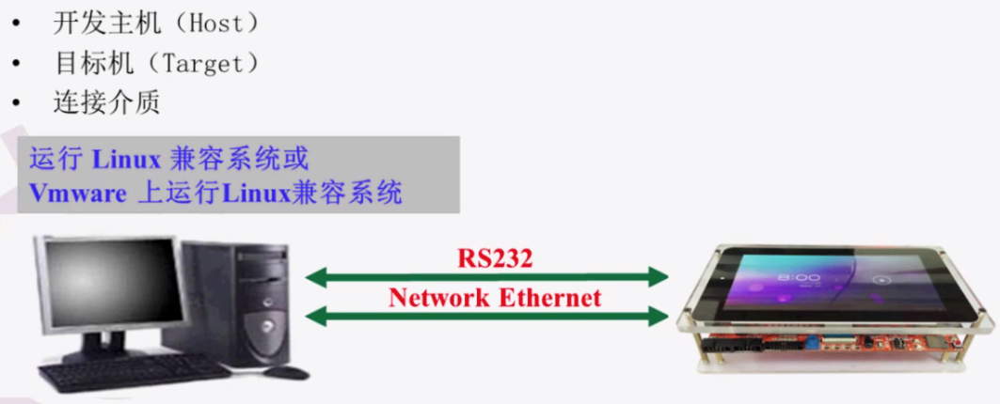
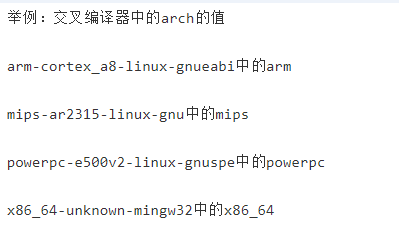
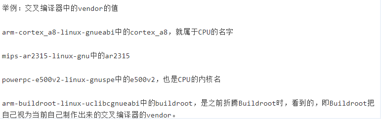
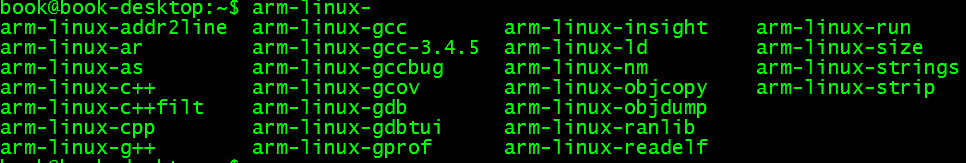
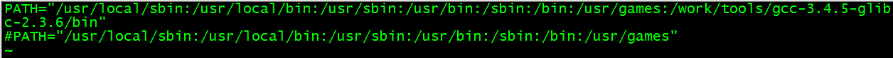

### linux系统移植

##### 1.系统移植定义:

```
针对公司相应的产品定位进行定制,定制包括软件和硬件，核心就是定制。原因在于硬件变化以后软件也必须做出相应的调整
```

##### 2.系统移植的价值:

```
快速整合资源
```

##### 3.系统移植所需的知识及涉及的主要工作:

```javascript
所需知识:
1.看得懂电路图
2.看得懂芯片手册
3.看得懂软件(包括bootloader、kernel、rootfs)

主要工作:
  (1)搭建交叉编译环境:主要是厂商的工作,厂商提供交叉编译工具链,系统工程师负责安装即可
  (2)bootloader的选择和移植(通常使用的uboot是bootloader的一种),主要是芯片厂商的工作,厂商提bootloader
     系统工程师负责进行编译即可
     boot:启动 loader:加载,两者组合在一起是启动加载内核的含义
  (3)kernel的配置、移植、编译:主要是系统工程师工作
  	 配置的含义:
     linux内核实际会支持很多平台(例如x86平台、arm平台、mips平台)，同时又支持各个平台下的不同机器，因此在      实际应用中要选择自己的平台、自己的机器
     移植的含义:
     意思就是修改,实际应用中不可能厂家提供的就是自己所需要的,厂家提供的我们不需要因此需要删除，我们需要的厂家没有提供因此需要添加，厂提供的不符合我们需要的因此需要修改，因此需要增删改的工作
     编译的含义:
     当配置，移植工作做好以后，需要对整个linux系统进行编译 
  (4)根文件系统的制作:主要是系统工程师工作
     根文件系统应用程序提供接口
```

##### 4.系统移植思想及步骤:

```
思想:不纠缠细节、关注背后的设计思想与方法
步骤:
(1)先整体后局部,层层推进,先了解以上4个部分每一部分的整体框架,各个框架下包含了哪些内容，各个内容的作用、联系
(2)以上4部分应该如何编译
(3)以上4部分应如何添加删除修改命令或功能
(4)以上4部分如何根据需要自定义
```

##### 5.嵌入式系统的定义

```
嵌入式系统的的核心是定制,是根据市场需求对软硬件进行定制，实现性能最大化
```

##### 6.linux在嵌入式应用的条件和与前景

```
1.嵌入式系统越来越追求数字化、网络化和智能化。这就要求整个嵌入式系统必须是开放的、提供标准的API,并且能够方便地与众多第三方的软硬件沟通
2.linux是在GPL协议下开放源码的系统，内核可以定制裁剪、功能强大、支持多种文件系统、网络功能及其强大、非常适合高端嵌入式系统
```

##### 7.搭建嵌入式linux开发环境主要工作

- 准备开发主机(一般指PC机)、目标机（一般指开发板）以及二者的连接介质

  ```
  开发主机与目标主机的连接方式有以下几种:
  (1)串口通信:UART异步串行通信接口 - 速率低(适用于小数据量的传输,一般都是115200bps),实用性强
  (2)usb通信:USB串行通信接口 - 驱动移植要修改,速度快(适用于大数据量的传输)
  (3)网络通信:TCP/IP网络通信接口 - 驱动移植要修改,速度快(10/100Mbps)
  (4)Debug jtag调试接口 - 价格高,方便快捷
  ```

  

- 准备目标机源代码

  - bootloader代码
  - kernel代码
  - rootfs代码

- 安装交叉工具链

  - 为什么需要交叉编译？

    原因:由于主机和目标机不同而造成的,编译时在宿主机上，而真正运行是在目标机上

    | 开发主机 | 目标机 |                             备注                             |
    | :------: | :----: | :----------------------------------------------------------: |
    |   x86    |  x86   |           由于开发主机与目标机相同，不需要交叉编译           |
    |   x86    |  arm   | 由于开发主机与目标机不相同，需要交叉编译交叉编译工具链的来源 |

  - 交叉工具链的来源及命令规范

    来源:交叉编译工具链一般是工作在X86平台下(因此需要x86平台的一些库文件),然后编译出其他平台所需要文件(不能在x86平台工作)的工具

    - 芯片厂商提高交叉工具链(在实际应用中最为常见,芯片厂商已经编译好了工具链)

    ​	arm-none-linux-gnueabi-

    ​	arm-linux-   备注:对上面的简写,一般用软连接链接到上面

    ​	arm-none-eabi-  备注:没有系统平台,代表不支持操作系统

    ​	arm-elf-  备注:很老的编译,没有系统平台,代表不支持操作系统

    - 用户自己编译交叉工具链(实际应用中基本不会用到)

    ​	一般不推荐自己制作,调试会很麻烦

    规范:arch [-vendor] [-os] [-(gnu)eabi]

    - arch:体系架构,如arm、mips、x86，表示交叉编译器用于哪个目标系统架构中即此交叉编译器编译出来的程序是运行在哪种cpu上面的

    

    - vendor:工具链提供商,即谁制作出来这个交叉编译器的。vendor的值自己可以随便编写，通用的做法是把vendor写成体系架构的值或者cpu厂家的名字或者开发板的名字

    

    - os:目标操作系统,可选,如果没有os表示不支持操作系统,有表示所支持的操作系统，即用此交叉编译器编译出来的程序，所运行的目标系统。对应的环境或系统主要有以下两种:

    ​       a-linux:表示目标系统时linux

    ​       b-无:无操作系统

    - system:system直译为系统,表示所选择的库函数，常见的值有gnu、gnueabi、uclibcgnueabi等等

    ​       gnu == gnu libc == glibc,表示用的是glibc库,如果没有一般表示使用libc库

    ​       eabi:嵌入式引用二进制接口,如果没有表示使用的是早期的oabi

    - 开发实际情况,没有ventor标志

      

  - 交叉编译工具链的安装及使用

    安装:解压交叉编译工具链到某个目录下,使用方法有两种方式相对路径使用方式和绝对路径使用方式:
    (1)相对路径使用,直接使用命令,例如arm-linux-gcc ...
    相对路径一般情况下是要导出环境变量,导出环境变量即设置linux下的PATH变量,以下有两种方式设置环境变量
    	a.只在当前shell中导出,只在当前shell中有效
    		export PATH=$PATH:路径  备注:中间用:号隔开	

    ```shell
    #export是导出的含义 export key=value
    export PATH=$PATH:/work/tools/gcc-3.4.5-glibc-2.3.6/bin
    ```

    ​    b.在当前用户下导出
    ​		b.1编辑/etc/environment,修改PATH(不用导出),修改完成后source /etc/environment

    

    ​		b.2编辑.bashrc在该处要导出环境变量-仅对当前用户生效

    ```SHELL
    export PATH=$PATH:/work/tools/gcc-3.4.5-glibc-2.3.6/bin
    source .bashrc
    ```

    ​		b.3编辑/etc/profile,修改PATH-对所有用户生效

    ```SHELL
    PATH=$PATH:/work/tools/gcc-3.4.5-glibc-2.3.6/bin
    source /etc/profile
    ```

    (2)绝对路径

    ```shell
    /work/tools/gcc-3.4.5-glibc-2.3.6/bin/arm-linux-gcc
    ```

  - linux下查看动态库和静态库所支持的CPU架构

    ```shell
    #查看动态库-方式1
    file libutil-2.10.1.so
    libutil-2.10.1.so: ELF 32-bit LSB shared object, Intel 80386, version 1 (SYSV), dynamically linked (uses shared libs), for GNU/Linux 2.6.15, stripped
    
    #查看动态库-方式2
    readelf -h libutil-2.10.1.so
    ELF Header:
      Magic:   7f 45 4c 46 01 01 01 00 00 00 00 00 00 00 00 00 
      Class:                             ELF32
      Data:                              2's complement, little endian
      Version:                           1 (current)
      OS/ABI:                            UNIX - System V
      ABI Version:                       0
      Type:                              DYN (Shared object file)
      Machine:                           Intel 80386
      Version:                           0x1
      Entry point address:               0xa00
      Start of program headers:          52 (bytes into file)
      Start of section headers:          8588 (bytes into file)
      Flags:                             0x0
      Size of this header:               52 (bytes)
      Size of program headers:           32 (bytes)
      Number of program headers:         8
      Size of section headers:           40 (bytes)
      Number of section headers:         29
      Section header string table index: 28
      
    #查看静态库-方式1,用file方式不能查看
    file libftdi.a
    libftdi.a: current ar archive
    
    #查看静态库-方式,用readelf命令
    readelf -h libftdi.a
    
    File: libftdi.a(ftdi.o)
    ELF Header:
      Magic:   7f 45 4c 46 01 01 01 00 00 00 00 00 00 00 00 00 
      Class:                             ELF32
      Data:                              2's complement, little endian
      Version:                           1 (current)
      OS/ABI:                            UNIX - System V
      ABI Version:                       0
      Type:                              REL (Relocatable file)
      Machine:                           Intel 80386
      Version:                           0x1
      Entry point address:               0x0
      Start of program headers:          0 (bytes into file)
      Start of section headers:          44124 (bytes into file)
      Flags:                             0x0
      Size of this header:               52 (bytes)
      Size of program headers:           0 (bytes)
      Number of program headers:         0
      Size of section headers:           40 (bytes)
      Number of section headers:         28
      Section header string table index: 25
    ```

  - linux下设置临时全局变量和全局的环境变量

    - 查看当前由哪些环境变量

      ```shell
      #查看环境变量命令env
      env
      TERM=xterm
      SHELL=/bin/bash
      XDG_SESSION_COOKIE=c0fbedb2eb0e1a195fcabda54b26e6fa-1581852595.530612-1468451737
      SSH_CLIENT=192.168.1.2 53092 22
      OLDPWD=/
      SSH_TTY=/dev/pts/1
      NAME=YCL
      USER=book
      PATH=/usr/local/sbin:/usr/local/bin:/usr/sbin:/usr/bin:/sbin:/bin:/usr/games:/work/tools/gcc-3.4.5-glibc-2.3.6/
      ```

    - 临时全局环境变量

      ```shell
      #export命令用法
      export: usage: export [-fn] [name[=value] ...]
      #在当前shell中执行
      #设置环境变量
      export name=zhaokun
      #打印环境变量
      echo $name
      #取消环境变量
      unset name
      ```

    - 全局环境变量

      ```shell
      编辑.bashrc
      export name=zhaokun
      source .bashrc
      ```

  - libc与glibc的关系

  ```c
  glibc和libc都是Linux下的C函数库。libc是Linux下的ANSI C函数库；glibc是Linux下的GUN C函数库。
  
  ANSI C 函数库是基本的C语言函数库，包含了C语言最基本的库函数。
  lic常用的头文件:
  <ctype.h>：包含用来测试某个特征字符的函数的函数原型，以及用来转换大小写字母的函数原型；
  <errno.h>：定义用来报告错误条件的宏；
  <float.h>：包含系统的浮点数大小限制；
  <math.h>：包含数学库函数的函数原型；
  ...........
  
  GNU C函数库是一种类似于第三方插件的东西，由于Linux是用C语言写的，所以Linux的一些操作是用C语言实现的，因此GNU组织开发了一个C语言的库以便更好地利用C语言开发基于Linux操作系统的程序，现在不同的Linux的发行版本对这两个函数库有不同的处理方法，有的可能已经集成到同一个库中
  glibc是linux下c标准库的实现,即GNU C Library，glibc本身是GNU旗下的C标准库，后来逐渐形成Linux的标准C库，而Linux下原来的标准库Linux libc逐渐不爱被维护。glibc在/lib目录下的.so文件为libc.so.6
      
  #在开发板中/lib目录下查看    
  -rwxrwxr-x    1 1000     1000      1435660 Dec 24  2010 libc-2.3.6.so
  -rwxrwxr-x    1 1000     1000          195 Dec 24  2010 libc.so
  lrwxrwxrwx    1 1000     1000           13 Dec 24  2010 libc.so.6 -> libc-2.3.6.so
  
  #查看glibc的版本
   ./libc.so.6
  GNU C Library stable release version 2.3.6, by Roland McGrath et al.
  Copyright (C) 2005 Free Software Foundation, Inc.
  This is free software; see the source for copying conditions.
  There is NO warranty; not even for MERCHANTABILITY or FITNESS FOR A
  PARTICULAR PURPOSE.
  Compiled by GNU CC version 3.4.5.
  Compiled on a Linux 2.6.12 system on 2008-01-21.
  Available extensions:
          GNU libio by Per Bothner
          crypt add-on version 2.1 by Michael Glad and others
          linuxthreads-0.10 by Xavier Leroy
          BIND-8.2.3-T5B
          libthread_db work sponsored by Alpha Processor Inc
          NIS(YP)/NIS+ NSS modules 0.19 by Thorsten Kukuk
  For bug reporting instructions, please see:
  <http://www.gnu.org/software/libc/bugs.html>.
  
  glic常用功能:
  string，字符串处理
  signal，信号处理
  dlfcn，管理共享库的动态加载
  direct，文件目录操作
  elf，共享库的动态加载器，也即interpreter
  ...........
  ```

- 开发主机安装软件(编辑软件、终端软件、各种服务-tftp\\nfs等服务)

  - TFTP服务

    - 使用条件

      - 需要网络连接
      - 主机端需要安装tftp服务器软件
      - 目标机需要安装tftp客户端

    - 优点

      - 传输速度快,可以将编好的内核下载到目标机,提高开发效率,tftp是用来下载远程文件的最简单网络协议,基于udp协议而实现,嵌入式linux的tftp开发环境包括两个方面,一是linux开发主机端的tftp-server支持，二是嵌入式目标机tftp-clinet支持

    - TFTP服务器配置

      ```shell
      #一、安装软件
      #安装客户端
      sudo apt-get install tftp-hpa
      #安装服务端
      sudo apt-get install tftpd-hpa
      #查看软件安装结果
      dpkg -l | grep tftp*
      ii  tftp-hpa                             0.49-1                                     HPA's tftp client
      ii  tftpd-hpa                            0.49-1                                     HPA's tftp server
      
      #二、修改配置文件/etc/default/tftpd-hpa
      #Defaults for tftpd-hpa
      RUN_DAEMON="yes"
      #69定义了tftpd服务使用的端口
      TFTP_ADDRESS="0.0.0.0:69"
      #-s /home/book/tftp指定tftp的目录
      #-l：以standalone/listen模式启动TFTP服务，而不是从xinetd启动。
      #-c：可创建新文件。默认情况下，TFTP只允许覆盖原有文件，不能创建新文件。
      #-s：改变TFTP启动的根目录。加了-s后，客户端使用TFTP时，不再需要输入指定目录，填写文件的完整路径，而是使用配置文件中写好的目录。这样也可以增加安全性。
      OPTIONS="-c -l -s /home/book/tftp"
      
      #三、创建tftp目录,启动tftp-server
      mkdir /home/book/tftp
      chmod 777 /home/book/tftp
      service tftpd-hpa restart 或者 /etc/init.d/tftpd-hpa restart
      
      #四、查看是否tftp-server是否成功
      #/usr/sbin/in.tftpd为tftpd的服务
      ps -aux | grep tftp
      root     23451  0.0  0.0   2196   272 ?        Ss   21:18   0:00 /usr/sbin/in.tftpd -c -l -s /home/book/tftp
      
      netstat -au
      Active Internet connections (servers and established)
      Proto Recv-Q Send-Q Local Address           Foreign Address         State                                   
      udp6       0      0 [::]:tftp               [::]:*
      
      #五、测试使用
      #连接tftp服务端
      tftp 127.0.0.1
      #从服务端获取文件
      tftp> get uImage
      #向服务端上传文件
      tftp> put minicom.log
      tftp> 
      
      #六、在开发板上测试tftp服务
      # tftp --help
      BusyBox v1.7.0 (2010-11-26 18:26:44 CST) multi-call binary
      
      Usage: tftp [OPTION]... HOST [PORT]
      
      Transfer a file from/to tftp server using "octet" mode
      
      Options:
              -l FILE Local FILE
              -r FILE Remote FILE
              -g      Get file
              -p      Put file
              -b SIZE Transfer blocks of SIZE octets
      # 从服务端获取文件
      # tftp -gr uImage 192.168.1.3
      # 向服务端上传文件
      # tftp -pr aa 192.168.1.3
      ```

    - 搭建tftp服务时,遇到的一些知识点

      - linux文件的为什么默认大小是4096

        目录只是一个特殊的文件,它包含每个文件的文件名和inode编号的数组，创建目录时,文件系统将1个inode分配为上述创建的目录,inode指向单个数据块(最小开销),即4096字节

        ```shell
        ls -al
        drwxr-xr-x  2 book book    4096 2009-12-15 09:38 Documents
        drwxr-xr-x  2 book book    4096 2009-12-15 09:38 Downloads
        drwxr-xr-x  3 book book    4096 2010-11-22 17:09 .eclipse
        
        sudo tune2fs -l /dev/sdb1 | grep Block
        Block count:              10484412
        Block size:               4096
        Blocks per group:         32768
        
        ```

      - linux ulimit命令

        ulimit为shell内建指令,可用于控制执行程序的资源

        ```shell
        ulimit -a
        core file size          (blocks, -c) 0
        data seg size           (kbytes, -d) unlimited
        scheduling priority             (-e) 20
        file size               (blocks, -f) unlimited
        pending signals                 (-i) 16382
        max locked memory       (kbytes, -l) 64
        max memory size         (kbytes, -m) unlimited
        open files                      (-n) 1024
        pipe size            (512 bytes, -p) 8
        POSIX message queues     (bytes, -q) 819200
        real-time priority              (-r) 0
        stack size              (kbytes, -s) 8192
        cpu time               (seconds, -t) unlimited
        max user processes              (-u) unlimited
        virtual memory          (kbytes, -v) unlimited
        file locks                      (-x) unlimited
        
        -a 　显示目前资源限制的设定。
        -c <core文件上限> 　设定core文件的最大值，单位为区块。
        -d <数据节区大小> 　程序数据节区的最大值，单位为KB。
        -f <文件大小> 　shell所能建立的最大文件，单位为区块。
        -H 　设定资源的硬性限制，也就是管理员所设下的限制。
        -m <内存大小> 　指定可使用内存的上限，单位为KB。
        -n <文件数目> 　指定同一时间最多可开启的文件数。
        -p <缓冲区大小> 　指定管道缓冲区的大小，单位512字节。
        -s <堆叠大小> 　指定堆叠的上限，单位为KB。
        -S 　设定资源的弹性限制。
        -t <CPU时间> 　指定CPU使用时间的上限，单位为秒。
        -u <程序数目> 　用户最多可开启的程序数目。
        -v <虚拟内存大小> 　指定可使用的虚拟内存上限，单位为KB。
        ```

    - linux man 1 2 3命令

      linux的man很强大,该手册分成很多section,使用man时可以指定不同的section来浏览,各个setion意义如下:

      1 - commands - 普通命令

      2 - system callls -系统调用,如open、wirite之类的，通常这个可以很方便地查到调用这个函数需要加什么头文件

      3 - library callls - 库函数,如printf,fread

      4 -special files - 特殊文件,也就是/dev下的各种设备文件

      5 - file formats and convertions - 文件的格式,比如passwd,就会说明这个文件中各个字段的含义

      6 - games for linux - 留给游戏留用

      7 - macro packages and conventions - 

      8 - system management commands - 系统管理命令,这些命令只能由root使用,如ifconfig

      9 - 其他

      ```shell
      man 1 ls
      man 3 printf
      对于像open,kill这种既有命令又有系统调用来说，man open则显示man 1 open,如果想查看openw系统调用的话,需用man 2 open
      ```

    - 关于库函数和系统调用

      - 从运行空间

      ​       库函数是高层的,完全运行在用户空间，为程序员提供更方便地接口。

      ​      系统调用在内核态运行并且由内核自己提供。

      - 从提供功能

        函数库提供的函数通常是不需要操作系统的服务，函数是在用户空间内执行的，除非函数涉及到I/O操作等，一般是不会切到核心

        系统调用要求操作系统为用户提供进程，提高某种服务，通常是涉及系统的硬件资源和一些敏感的软件资源等

      - 从移植角度

        库函数尤其与输入输出相关的函数,大多必须通过linux的系统调用来完成，因此可以将函数库当成应用程序设计人员与系统调用程序之间的一个中间层，通过这个中间层我们可以用一致的接口来安全的调用系统调用，这样程序员可以只要写一次代码就能够在不同版本的linux系统实现完全不同的系统调用，至于如何实现对不同的系统调用的兼容性问题，那是函数库开发者所关心的问题

      - 从执行效率

        系统调用的执行效率大多要比函数高，尤其是处理输入输出的函数。当处理的数据量比较小时，函数库的函数执行效率可能比较好，因为函数库的做法是将要处理的数据先存入缓冲区，等到缓冲区满了，再将数据一次写入或者读出，这种方式处理小量数据时效率比较高，但是在进行系统调用时，因为用户进程从用户模式进入系统核心 模式，中间涉及了许多额外的任务的切换工作，这些操作称为上下文切换，此类的额外工作会影响系统的执行效率。但是当要处理的数据量比较大时，例如当输入输 出的数据量超过文件系统定义的尽寸时，利用系统调用可获得较高的效率。

    - strace命令

      作用:查看程序使用了哪些系统调用

      ```c
      //c文件
      #include <stdio.h>
      
      void main() {
      	printf("Hello\n");
      }
      
      //执行命令，可以看到输出信息里面包含了系统调用
      strace ./main    
      execve("./main", ["./main"], [/* 20 vars */]) = 0
      brk(0)                                  = 0x905e000
      access("/etc/ld.so.nohwcap", F_OK)      = -1 ENOENT (No such file or directory)
      mmap2(NULL, 8192, PROT_READ|PROT_WRITE, MAP_PRIVATE|MAP_ANONYMOUS, -1, 0) = 0xb7796000
      access("/etc/ld.so.preload", R_OK)      = -1 ENOENT (No such file or directory)
      open("/etc/ld.so.cache", O_RDONLY)      = 3
      fstat64(3, {st_mode=S_IFREG|0644, st_size=71399, ...}) = 0
      mmap2(NULL, 71399, PROT_READ, MAP_PRIVATE, 3, 0) = 0xb7784000
      close(3)                                = 0
      access("/etc/ld.so.nohwcap", F_OK)      = -1 ENOENT (No such file or directory)
      open("/lib/tls/i686/cmov/libc.so.6", O_RDONLY) = 3
      read(3, "\177ELF\1\1\1\0\0\0\0\0\0\0\0\0\3\0\3\0\1\0\0\0\260l\1\0004\0\0\0"..., 512) = 512
      fstat64(3, {st_mode=S_IFREG|0755, st_size=1319364, ...}) = 0
      mmap2(NULL, 1325416, PROT_READ|PROT_EXEC, MAP_PRIVATE|MAP_DENYWRITE, 3, 0) = 0xbe5000
      mmap2(0xd23000, 12288, PROT_READ|PROT_WRITE, MAP_PRIVATE|MAP_FIXED|MAP_DENYWRITE, 3, 0x13e) = 0xd23000
      mmap2(0xd26000, 10600, PROT_READ|PROT_WRITE, MAP_PRIVATE|MAP_FIXED|MAP_ANONYMOUS, -1, 0) = 0xd26000
      close(3)                                = 0
      mmap2(NULL, 4096, PROT_READ|PROT_WRITE, MAP_PRIVATE|MAP_ANONYMOUS, -1, 0) = 0xb7783000
      set_thread_area({entry_number:-1 -> 6, base_addr:0xb77836c0, limit:1048575, seg_32bit:1, contents:0, read_exec_only:0, limit_in_pages:1, seg_not_present:0, useable:1}) = 0
      mprotect(0xd23000, 8192, PROT_READ)     = 0
      mprotect(0x8049000, 4096, PROT_READ)    = 0
      mprotect(0xd44000, 4096, PROT_READ)     = 0
      munmap(0xb7784000, 71399)               = 0
      fstat64(1, {st_mode=S_IFCHR|0620, st_rdev=makedev(136, 1), ...}) = 0
      mmap2(NULL, 4096, PROT_READ|PROT_WRITE, MAP_PRIVATE|MAP_ANONYMOUS, -1, 0) = 0xb7795000
      write(1, "Hello\n", 6Hello
      )                  = 6
      exit_group(6)                           = ?
      ```

    - linux查看符号表

      ```shell
      #在实际应用中,是需要把符号表去掉的
      #查看文件是否去掉了符号表
      file main
      main: ELF 32-bit LSB executable, Intel 80386, version 1 (SYSV), dynamically linked (uses shared libs), for GNU/Linux 2.6.15, not stripped
      
      #查看符号表
      nm main
      08049f20 d _DYNAMIC
      08049ff4 d _GLOBAL_OFFSET_TABLE_
      080484bc R _IO_stdin_used
               w _Jv_RegisterClasses
      08049f10 d __CTOR_END__
      08049f0c d __CTOR_LIST__
      08049f18 D __DTOR_END__
      08049f14 d __DTOR_LIST__
      080484c8 r __FRAME_END__
      08049f1c d __JCR_END__
      08049f1c d __JCR_LIST__
      0804a014 A __bss_start
      0804a00c D __data_start
      08048470 t __do_global_ctors_aux
      08048360 t __do_global_dtors_aux
      0804a010 D __dso_handle
               w __gmon_start__
      0804846a T __i686.get_pc_thunk.bx
      08049f0c d __init_array_end
      08049f0c d __init_array_start
      08048400 T __libc_csu_fini
      08048410 T __libc_csu_init
               U __libc_start_main@@GLIBC_2.0
      0804a014 A _edata
      0804a01c A _end
      0804849c T _fini
      080484b8 R _fp_hw
      080482b8 T _init
      08048330 T _start
      0804a014 b completed.6990
      0804a00c W data_start
      0804a018 b dtor_idx.6992
      080483c0 t frame_dummy
      080483e4 T main
               U puts@@GLIBC_2.0
      #去掉符号表         
      strip main
      
      file main
      main: ELF 32-bit LSB executable, Intel 80386, version 1 (SYSV), dynamically linked (uses shared libs), for GNU/Linux 2.6.15, stripped
      
      nm main
      nm: main: no symbols
      ```

    - linux输出线程id

      ```c
      //获取进程pid
      #include <unistd.h>  
      pid_t getpid(void);
      
      //获取线程pid
      #include <sys/syscall.h>  
      printf("The ID of this thread is: %ld\n", (long int)syscall(224));  
      ```

      ```c
      //示例
      #include <stdio.h>
      #include <pthread.h> //线程头文件 
      #include <sys/types.h>
      #include <unistd.h>
      
      //pthread不是linux下的默认的库，也就是在链接的时候，无法找到phread库中哥函数的入口地址，于是链接会失败,在gcc编译的时候，附加要加 -lpthread参数即可解决。gcc -o run pthreadtext.c  -lpthread
      
      void *myThread1(void) //线程函数
      {
          int i;
          for(i=0;i<500; i++)
          {
              printf("now pid is %d \n", getpid());
              printf("now tid is %ld \n", (long int)syscall(224));
              sleep(500);
          }
      }
      
      int main()
      {
          int i=0,ret=0;
          pthread_t id1,id2;
          ret= pthread_create(&id1,NULL,(void*)myThread1,NULL ); //创建线程
          if(ret)
          {
              printf("create error\n");
              return 1;
          }
      
          pthread_join(id1,NULL); //当前线程会处于阻塞状态，直到被调用的线程结束后，当前线程才会重新开始执行
          return 0;
      }
      
      gcc -o run pthreadtext.c  -lpthread
      ```

      

    - ldd命令

      作用:查看应用程序或动态库依赖哪些库函数

      ```shell
      ldd main
              linux-gate.so.1 =>  (0x00231000)
              libc.so.6 => /lib/tls/i686/cmov/libc.so.6 (0x005ae000)
              /lib/ld-linux.so.2 (0x0046a000)
              
      ldd /lib/libc.so.6
              /lib/ld-linux.so.2 (0x009cb000)
              linux-gate.so.1 =>  (0x00ee1000)
              
      注意：在 ldd 命令打印的结果中，“=>”左边的表示该程序需要连接的共享库之 so 名称，右边表示由 Linux 的共享库系统找到的对应的共享库在文件系统中的具体位置。默认情况下，/etc/ld.so.conf 文件中包含有默认的共享库搜索路径。
      ```

      

    - pstree命令

      查看进程及线程号

      ```shell
      pstree -ap
      init,1
        ├─NetworkManager,991
        │   └─{NetworkManager},1054
        ├─acpid,869 -c /etc/acpi/events -s /var/run/acpid.socket
        ├─anacron,870 -s
        │   └─sh,1839 -c nice\040run-parts\040--report\040/etc/cron.daily
        │       └─run-parts,1840 --report /etc/cron.daily
        │           └─apt,1846 /etc/cron.daily/apt
        │               └─sleep,1876 1052
        ├─atd,871
        ├─avahi-daemon,774
        │   └─avahi-daemon,775
        ├─bonobo-activati,1571 --ac-activate --ior-output-fd=20
        │   └─{bonobo-activati},1572
        ├─console-kit-dae,919
        ├─cron,872
        ├─cupsd,1182 -C /etc/cups/cupsd.conf
        ├─dbus-daemon,761 --system --fork
        ├─dbus-daemon,1494 --fork --print-pid 7 --print-address 9 --session
        ├─dbus-launch,1358 --exit-with-session
        ├─dbus-launch,1493 --exit-with-session /usr/bin/pulse-session gnome-session
        ├─dd,711 bs=1 if=/proc/kmsg of=/var/run/rsyslog/kmsg
        ├─devkit-disks-da,1597
        │   └─devkit-disks-da,1605       
        ├─devkit-power-da,1363
        ├─gconfd-2,1503
        ├─gdm-binary,899
        │   └─gdm-simple-slav,1153 --display-id /org/gnome/DisplayManager/Display1
        │       ├─Xorg,1183 :0 -br -verbose -auth /var/run/gdm/auth-for-gdm-JNQykO/database -nolisten tcp ...
        │       └─gdm-session-wor,1410
        │           └─gnome-session,1451
        │               ├─bluetooth-apple,1586
        │               ├─evolution-alarm,1590
        │               │   └─{evolution-alarm},1668
        │               ├─gdu-notificatio,1587
        │               ├─gnome-panel,1568
        │               ├─gnome-power-man,1594
        │               ├─gnome-volume-co,1598
        │               ├─metacity,1533 --replace
        │               ├─nautilus,1569
        │               ├─nm-applet,1585 --sm-disable
        │               ├─polkit-gnome-au,1576
        │               ├─python,1574 /usr/share/system-config-printer/applet.py
        │               ├─ssh-agent,1490 /usr/bin/dbus-launch --exit-with-session /usr/bin/pulse-session ...
        │               ├─update-notifier,1593 --startup-delay=60
        │               └─{gnome-session},1508
        ├─getty,855 -8 38400 tty4
        ├─getty,857 -8 38400 tty5
        ├─getty,862 -8 38400 tty2
        ├─getty,863 -8 38400 tty3
        ├─getty,865 -8 38400 tty6
        ├─getty,1328 -8 38400 tty1
        ├─gnome-keyring-d,1436 --daemonize --login
        │   ├─{gnome-keyring-d},1437
        │   └─{gnome-keyring-d},1514
        ├─gnome-screensav,1610
        ├─gnome-settings-,1513
        │   └─{gnome-settings-},1516
        ├─gvfs-fuse-daemo,1527 /home/book/.gvfs
        │   ├─{gvfs-fuse-daemo},1528
        │   ├─{gvfs-fuse-daemo},1529
        │   └─{gvfs-fuse-daemo},1530
        ├─gvfs-gdu-volume,1589
        ├─gvfs-gphoto2-vo,1614
        ├─gvfsd,1520
        ├─gvfsd-burn,1639 --spawner :1.9 /org/gtk/gvfs/exec_spaw/1
        ├─gvfsd-trash,1607 --spawner :1.9 /org/gtk/gvfs/exec_spaw/0
        ├─hald,767 --daemon=yes
        │   └─hald-runner,982
        │       ├─hald-addon-acpi,1180
        │       ├─hald-addon-inpu,1181
        │       └─hald-addon-stor,1168
        ├─in.tftpd,1106 -c -l -s /home/book/tftp
        ├─indicator-apple,1621 --oaf-activate-iid=OAFIID:GNOME_IndicatorApplet_Factory--oaf-
        ├─indicator-apple,1623--oaf-activate-iid=OAFIID:GNOME_FastUserSwitchApplet_F
        ├─indicator-messa,1637
        ├─indicator-sessi,1635
        ├─indicator-statu,1631
        ├─indicator-users,1633
        ├─kerneloops,1019
        ├─konsole,1646
        │   ├─bash,1650
        │   └─{konsole},1649
        ├─modem-manager,993
        ├─notify-osd,1525
        ├─polkitd,1600
        ├─portmap,698
        ├─pulseaudio,1498 --start
        │   ├─gconf-helper,1501
        │   ├─{pulseaudio},1499
        │   └─{pulseaudio},1500
        ├─rpc.idmapd,780
        ├─rpc.mountd,1089 --manage-gids
        ├─rpc.statd,747 -L
        ├─rsyslogd,758 -c4
        │   ├─{rsyslogd},771
        │   └─{rsyslogd},772
        ├─seahorse-daemon,1517
        ├─sshd,983
        │   └─sshd,1696
        │       └─sshd,1779
        │           ├─bash,1780
        │           │   └─pstree,2000 -ap
        │           └─bash,1939
        │               └─run,1992 #该处是进程名字及进程号
        │                   ├─{run},1993 #该处是线程名字及线程号
        │                   └─{run},1994 #该处是线程名字及线程号
        ├─system-service-,1677 /usr/lib/system-service/system-service-d
        ├─trashapplet,1583 --oaf-activate-iid=OAFIID:GNOME_Panel_TrashApplet_Factory--oaf-ior-fd
        ├─udevd,408 --daemon
        │   ├─udevd,523 --daemon
        │   └─udevd,534 --daemon
        ├─update-manager,1681 /usr/bin/update-manager --no-focus-on-map
        ├─upstart-udev-br,405 --daemon
        ├─vsftpd,1126
        └─wpa_supplicant,1048 -u -s
        
      #在proc目录页能看到该进程下有多少线程  
      ls /proc/1992/task 
      1992  1993  1994
      ```

      

    - nohup和& 区别

      ```shell
      &是指在后台运行,./a.out & 的时候，即使使用ctrl+c,那么a.out照样运行(因为对SIGINT信号免疫)，需注意的是如果直接关掉shell，那么a.out进程同样会退出，可见，&的后台对SIGHUP不免疫
      
      nohup:Run COMMAND, ignoring hangup signals.表示忽略挂起信号,就是不挂断地运行，但是没有后台运行的功能,即可以用ctrl+c打断
      
      nohup的意思是忽略SIGHUP信号， 所以当运行nohup ./a.out的时候， 关闭shell, 那么a.out进程还是存在的（对SIGHUP信号免疫）,但是如果直接在shell中用Ctrl C, 那么, a.out进程也是会消失的（因为对SIGINT信号不免疫）
      nohua ./a.out &
      &和nohup没有半毛钱的关系， 要让进程真正不受shell中Ctrl C和shell关闭的影响，就需要运行一下命令:
      nohua ./a.out &
      ```

    - linux中ctrl+z和ctrl+c的区别

      ```shell
      ctrl+z与ctrl+c都是中断命令,但是他们的作用却不一样
      ctrl+c:是强制中断程序执行,进程已经死掉
      ctrl+z:是将任务中断,但是任务并没有结束,它仍然在进程中,只是将进程进行挂起(进程没有死掉),用户恶意使用fg/bg操作前台或后台的任务,fg命令重新启动前台被中断的任务,bg命令把被中断的任务放在后台执行.
      
      fg、bg、jobs、&、 ctrl+z都是跟系统任务有关的
      一、&最经常被用到
      这个用在一个命令的最后，可以把这个命令放到后台执行
      二、ctrl + z
      可以将一个正在前台执行的命令放到后台，并且暂停
      三、jobs
      查看当前有多少在后台运行的命令
      四、fg
      将后台中的命令调至前台继续运行
      如果后台有多个命令，可以用fg %jobnumber将选中的命令调出，%jobnumber是通过jobs命令查到的后台正在执行的命令的序号（不是pid）
      五、bg
      将一个在后台暂停的命令，变成继续执行
      
      如果后台有多个命令，可以用bg %jobnumber将选中的命令调出，%jobnumber是通过jobs命令查到的后台正在执行的命令的序号（不是pid）
      ```

      

    - sigaction函数

      https://www.cnblogs.com/lidabo/p/4581202.html

    - dup( )和dup2( )函数

      https://blog.csdn.net/tiandc/article/details/81489447
      https://www.cnblogs.com/lidabo/p/4581202.html

    - linux守护进程

      https://blog.csdn.net/xu1105775448/article/details/80877747

      https://www.cnblogs.com/yinbiao/p/11203225.html

    - linux内核进程

      ```shell
      用ps命令查看是内核进程还是用户进程,内核进程带[]
      # ps
        PID  Uid        VSZ Stat Command
          1 0          3092 S   init     #用户进程
          2 0               SW< [kthreadd] #内核进程
          3 0               SWN [ksoftirqd/0]
          4 0               SW< [watchdog/0]
          5 0               SW< [events/0]
          6 0               SW< [khelper]
         55 0               SW< [kblockd/0]
         56 0               SW< [ksuspend_usbd]
         59 0               SW< [khubd]
         61 0               SW< [kseriod]
         73 0               SW  [pdflush]
         74 0               SW  [pdflush]
         75 0               SW< [kswapd0]
         76 0               SW< [aio/0]
        710 0               SW< [mtdblockd]
        745 0               SW< [kmmcd]
        762 0               SW< [rpciod/0]
        770 0          3096 S   -sh 
        771 0          3096 R   ps 
        
      在代码里是通过查看/proc/pid/cmdline 来进行判断，如果为空则追加[]
      
      一个系统支持多少个进程取决于虚拟内存,系统创建的进程过多，运行速度非常慢，一个进程支持的最大线程数据也取决于虚拟内存，使用ulimit命令可以查看
      ulimit -a
      time(seconds)        unlimited
      file(blocks)         unlimited
      data(kbytes)         unlimited
      stack(kbytes)        8192 #最大占用的栈空间
      coredump(blocks)     0
      memory(kbytes)       unlimited
      locked memory(kbytes) 32
      process              512 #最大的进程数
      nofiles              1024
      vmemory(kbytes)      unlimited
      locks                unlimited
      ```
      
      

  - NFS服务

    

- 目标机各种软件烧写

##### 8.bootloader

##### 9.kernel

##### 10.rootfs


