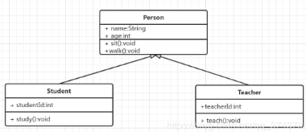
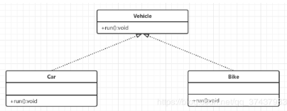
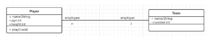
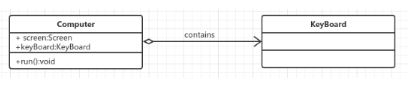
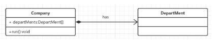
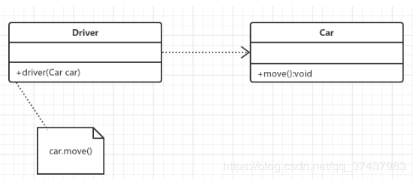
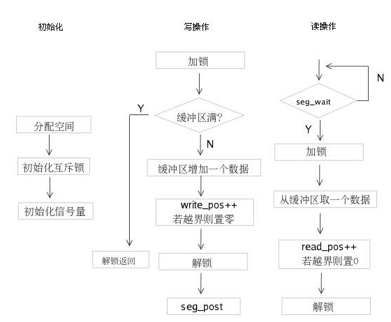
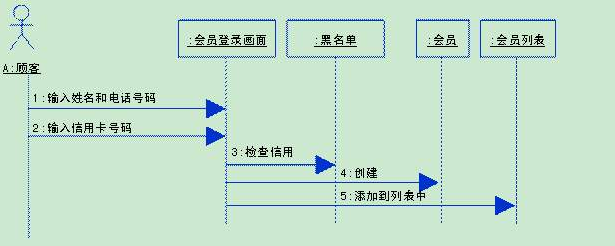

### 												UML知识点

#### 类图之间的关系

用户根据用例图抽象成类，描述类的内部结构和类与类之间的关系，是一种静态结构图。在UML类图中，常见的有以下几种关系：泛化(Generalization)、实现(Realization)、关联(Assocication)、聚合(Aggregation)、组合(Compositon)、依赖(Dependecy)

各种关系的强弱顺序：泛化 = 实现 > 组合 > 聚合 > 关联 > 依赖

##### 泛化关系

- 定义:是一种继承关系，表示一般与特殊的关系，它指定了子类如何继承父类的所有特征和行为。

- 表示方法:在UML中，泛化关系用带空心三角形的直线来表示

- 图示:

  

##### 实现关系

- 定义:是一种类与接口的关系，表示类是接口所有特征和行为的实现

- 表示方法:在UML中，类与接口之间的实现关系用带空心三角形的虚线来表示

- 图示

  

##### 关联关系

- 定义:类之间的联系，如客户和订单，每个订单对应特定的客户，每个客户对应一些特定的订单

- 表示方法:在UML类图中，用实线连接有关联的对象所对应的类

- 图示

  

##### 聚合关系

- 定义:是整体与部分的关系，且部分可以离开整体而单独存在。如车和轮胎是整体和部分的关系，轮胎离开车仍然可以存在。聚合关系是关联关系的一种，是强的关联关系；关联和聚合在语法上无法区分，必须考察具体的逻辑关系。

- 表示方法:在UML中，聚合关系用带空心菱形的直线表示。

- 图示

  

##### 组合关系

- 定义:整体与部分的关系，但是整体与部分不可以分开,一旦整体对象不存在，部分对象也将不存在，部分对象与整体对象之间具有同生共死的关系。

- 表示方法:在UML中，组合关系用带实心菱形的直线表示

- 图示

  

##### 依赖关系

- 定义:是一种使用关系，特定事物的改变有可能会影响到使用该事物的其他事物，在需要表示一个事物使用另一个事物时使用依赖关系。大多数情况下，依赖关系体现在某个类的方法使用另一个类的对象作为参数。
- 表示方法:在UML中，依赖关系用带箭头的虚线表示，由依赖的一方指向被依赖的一方
- 图示

#### 图示

##### 流程图

- 定义:面向业务逻辑，不涉及软件内部的组件和结构，不涉及业务逻辑处理的参与者，只考虑业务处理的步骤及流程

  

##### 时序图

- 定义:通过业务处理的参与者的顺序协作来展示软件的不同组织如何协作来完成业务

  

[参考文献][https://blog.csdn.net/qq_37437983/article/details/89194396]