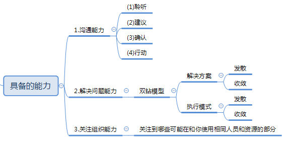

###  													项目管理

##### 项目管理的组成部分

##### 定义

##### 特点

##### 5大组成部分

##### 5大过程

###### 步骤1：启动

###### 步骤2：规划

###### 步骤3：执行

###### 步骤牛4：监控

###### 步骤5：收尾

##### 具备的能力

###  软件开发模型

#### 瀑布式开发模型

####  瀑布开发详细信息

#### 敏捷开发模型

#### 敏捷开发模型信息

#### 敏捷开发会议

#### 瀑布式开发+敏捷开发

##### 核心：

减小瀑布模型的粒度，采用敏捷开发的优秀实践方式，提高开发的沟通效率，提供项目的全景视图

敏捷开发首先把客户最关注的软件原型先做出来，交付或者上线，在实际场景中去修改弥补需求中的不足，快速修改，再次发布版本，再次上线或者交付。通过一些敏捷实践方式，细化story，可以提供更小的迭代。如此循环，直到用户满意。适用于需求不明确的项目、创新性的项目或者需求抢占市场的项目。

瀑布式开发首先要求明确的需求，大家按照需求一步步规划好，在项目运行过程中严格产出各种文档，按照流程一步步走下去，在这种模式一般适用于需求比较明确的项目

但总的来说，在现在额管理项目过程中，并没有严格按照完全的敏捷或者完全的瀑布式模式，都是各自掺杂了其他的方式，哎实际项目过程中，过去强调模式并没有谁什么意义，重要的是能不能预防问题的发生，在问题发生之后能不能用最小的成本解决，模式更多的是起一个参考作用
